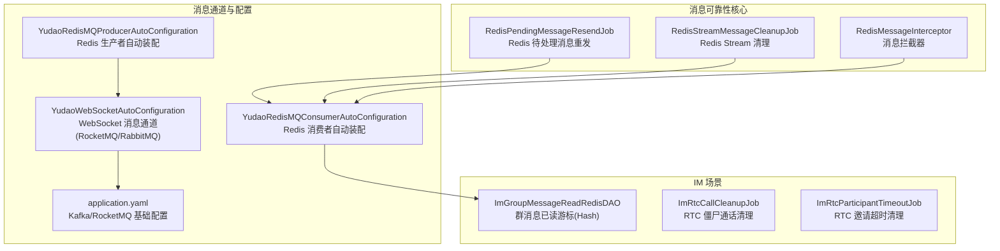
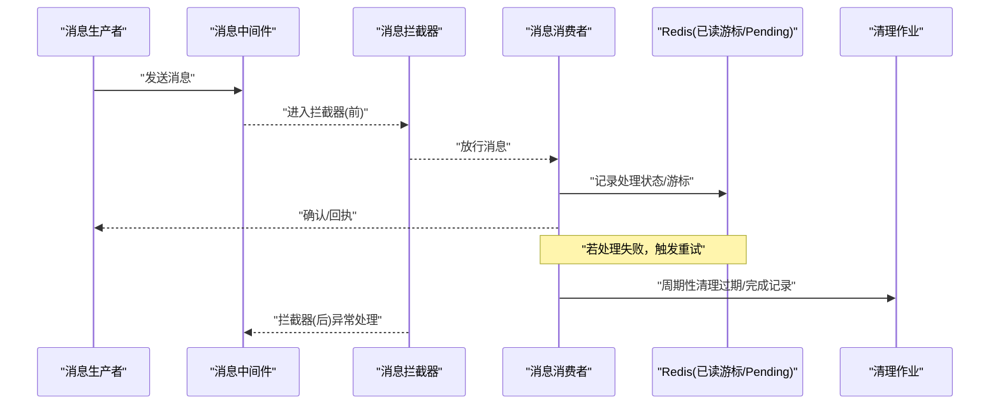
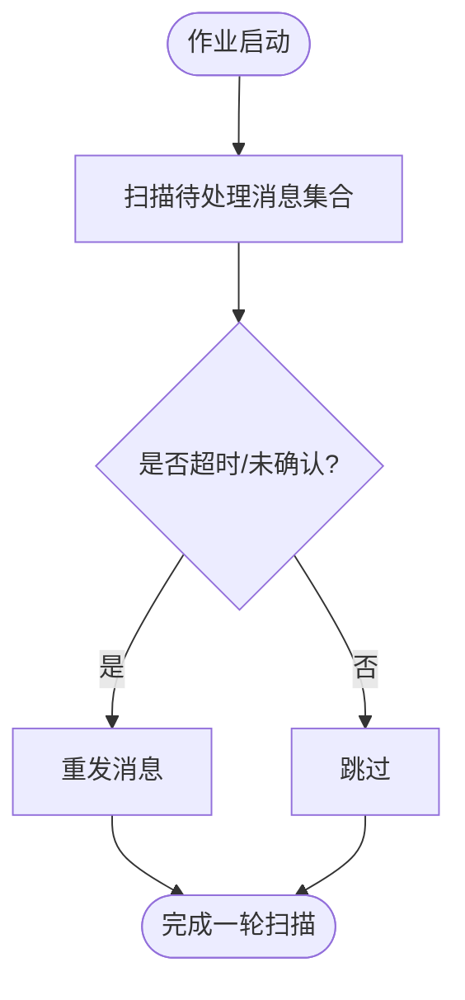
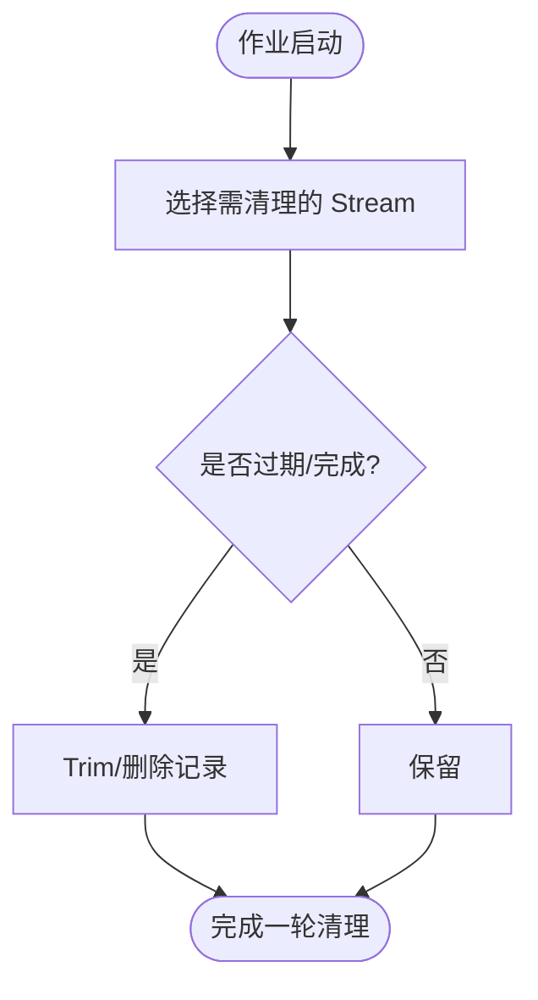
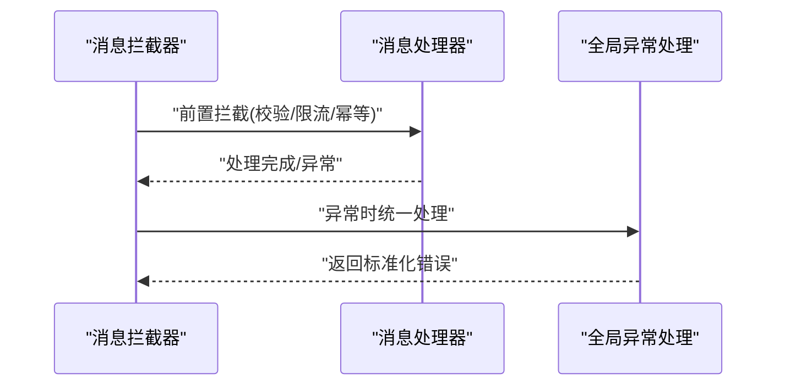
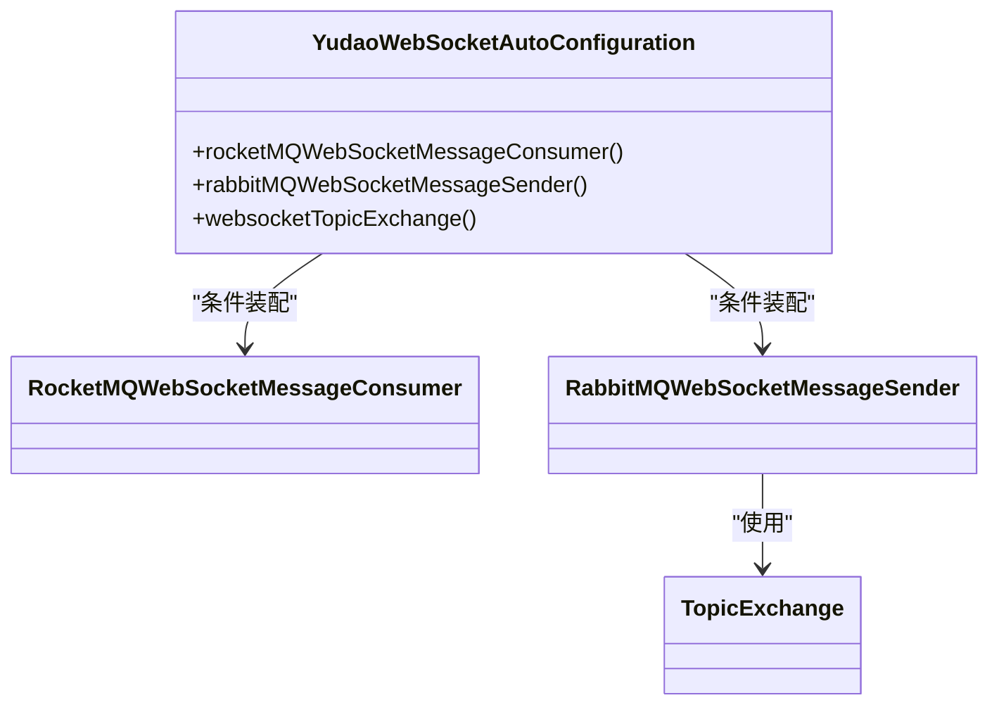
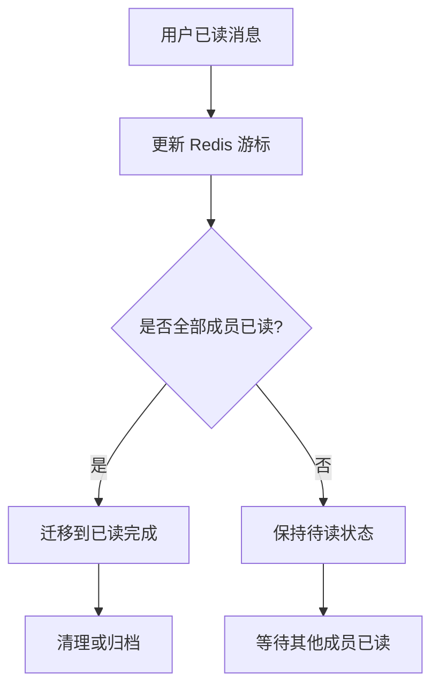
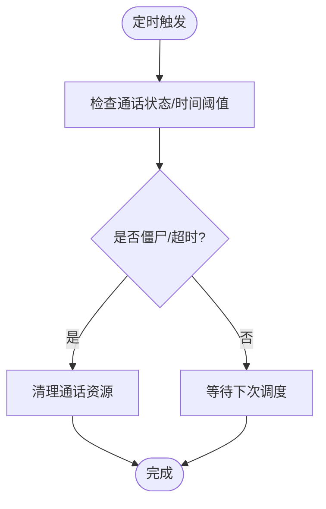
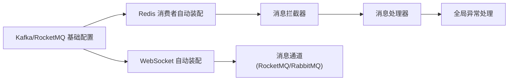

# 消息可靠性保障

<cite>
**本文引用的文件**
- [RedisPendingMessageResendJob.java](file://yudao-framework/yudao-spring-boot-starter-mq/src/main/java/cn/iocoder/yudao/framework/mq/redis/core/job/RedisPendingMessageResendJob.java)
- [RedisStreamMessageCleanupJob.java](file://yudao-framework/yudao-spring-boot-starter-mq/src/main/java/cn/iocoder/yudao/framework/mq/redis/core/job/RedisStreamMessageCleanupJob.java)
- [RedisMessageInterceptor.java](file://yudao-framework/yudao-spring-boot-starter-mq/src/main/java/cn/iocoder/yudao/framework/mq/redis/core/interceptor/RedisMessageInterceptor.java)
- [YudaoRedisMQConsumerAutoConfiguration.java](file://yudao-framework/yudao-spring-boot-starter-mq/src/main/java/cn/iocoder/yudao/framework/mq/redis/config/YudaoRedisMQConsumerAutoConfiguration.java)
- [YudaoRedisMQProducerAutoConfiguration.java](file://yudao-framework/yudao-spring-boot-starter-mq/src/main/java/cn/iocoder/yudao/framework/mq/redis/config/YudaoRedisMQProducerAutoConfiguration.java)
- [application.yaml](file://yudao-server/src/main/resources/application.yaml)
- [GlobalExceptionHandler.java](file://yudao-framework/yudao-spring-boot-starter-web/src/main/java/cn/iocoder/yudao/framework/web/core/handler/GlobalExceptionHandler.java)
- [GlobalResponseBodyHandler.java](file://yudao-framework/yudao-spring-boot-starter-web/src/main/java/cn/iocoder/yudao/framework/web/core/handler/GlobalResponseBodyHandler.java)
- [YudaoWebSocketAutoConfiguration.java](file://yudao-framework/yudao-spring-boot-starter-websocket/src/main/java/cn/iocoder/yudao/framework/websocket/config/YudaoWebSocketAutoConfiguration.java)
- [ImGroupMessageReadRedisDAO.java](file://yudao-module-im/src/main/java/cn/iocoder/yudao/module/im/dal/redis/message/ImGroupMessageReadRedisDAO.java)
- [ImGroupMessageServiceImplTest.java](file://yudao-module-im/src/test/java/cn/iocoder/yudao/module/im/service/message/ImGroupMessageServiceImplTest.java)
- [ImRtcCallCleanupJob.java](file://yudao-module-im/src/main/java/cn/iocoder/yudao/module/im/job/rtc/ImRtcCallCleanupJob.java)
- [ImRtcParticipantTimeoutJob.java](file://yudao-module-im/src/main/java/cn/iocoder/yudao/module/im/job/rtc/ImRtcParticipantTimeoutJob.java)
</cite>

## 目录
1. [引言](#引言)
2. [项目结构](#项目结构)
3. [核心组件](#核心组件)
4. [架构总览](#架构总览)
5. [详细组件分析](#详细组件分析)
6. [依赖关系分析](#依赖关系分析)
7. [性能考量](#性能考量)
8. [故障排查指南](#故障排查指南)
9. [结论](#结论)
10. [附录](#附录)

## 引言
本文件聚焦于消息可靠性保障，系统性阐述消息确认机制、重试策略与死信队列配置，结合 Redis 消息的可靠性实现（Pending 重发与 Stream 清理），以及消息拦截器在消息处理前后的作用与异常处理。同时给出不同业务场景下的可靠性需求与对应措施、消息丢失排查方法与预防建议，并提供可落地的配置示例与故障处理流程。

## 项目结构
围绕消息可靠性，本仓库的关键模块与文件分布如下：
- Redis 消息可靠性：Pending 重发与 Stream 清理作业
- 消息拦截器：统一的消息处理前后拦截与异常处理
- WebSocket 消息通道：基于 RocketMQ/RabbitMQ 的消息收发配置
- IM 场景：基于 Redis 的已读游标与消息可靠性配合
- 通用配置：Kafka/RocketMQ 的生产者/消费者基础配置

**图表来源**
- [RedisPendingMessageResendJob.java:1-200](file://yudao-framework/yudao-spring-boot-starter-mq/src/main/java/cn/iocoder/yudao/framework/mq/redis/core/job/RedisPendingMessageResendJob.java#L1-L200)
- [RedisStreamMessageCleanupJob.java:1-200](file://yudao-framework/yudao-spring-boot-starter-mq/src/main/java/cn/iocoder/yudao/framework/mq/redis/core/job/RedisStreamMessageCleanupJob.java#L1-L200)
- [RedisMessageInterceptor.java:1-200](file://yudao-framework/yudao-spring-boot-starter-mq/src/main/java/cn/iocoder/yudao/framework/mq/redis/core/interceptor/RedisMessageInterceptor.java#L1-L200)
- [YudaoRedisMQConsumerAutoConfiguration.java:1-200](file://yudao-framework/yudao-spring-boot-starter-mq/src/main/java/cn/iocoder/yudao/framework/mq/redis/config/YudaoRedisMQConsumerAutoConfiguration.java#L1-L200)
- [YudaoRedisMQProducerAutoConfiguration.java:1-200](file://yudao-framework/yudao-spring-boot-starter-mq/src/main/java/cn/iocoder/yudao/framework/mq/redis/config/YudaoRedisMQProducerAutoConfiguration.java#L1-L200)
- [YudaoWebSocketAutoConfiguration.java:120-170](file://yudao-framework/yudao-spring-boot-starter-websocket/src/main/java/cn/iocoder/yudao/framework/websocket/config/YudaoWebSocketAutoConfiguration.java#L120-L170)
- [application.yaml:120-146](file://yudao-server/src/main/resources/application.yaml#L120-L146)
- [ImGroupMessageReadRedisDAO.java:1-120](file://yudao-module-im/src/main/java/cn/iocoder/yudao/module/im/dal/redis/message/ImGroupMessageReadRedisDAO.java#L1-L120)
- [ImRtcCallCleanupJob.java:1-120](file://yudao-module-im/src/main/java/cn/iocoder/yudao/module/im/job/rtc/ImRtcCallCleanupJob.java#L1-L120)
- [ImRtcParticipantTimeoutJob.java:1-120](file://yudao-module-im/src/main/java/cn/iocoder/yudao/module/im/job/rtc/ImRtcParticipantTimeoutJob.java#L1-L120)

**章节来源**
- [RedisPendingMessageResendJob.java:1-200](file://yudao-framework/yudao-spring-boot-starter-mq/src/main/java/cn/iocoder/yudao/framework/mq/redis/core/job/RedisPendingMessageResendJob.java#L1-L200)
- [RedisStreamMessageCleanupJob.java:1-200](file://yudao-framework/yudao-spring-boot-starter-mq/src/main/java/cn/iocoder/yudao/framework/mq/redis/core/job/RedisStreamMessageCleanupJob.java#L1-L200)
- [RedisMessageInterceptor.java:1-200](file://yudao-framework/yudao-spring-boot-starter-mq/src/main/java/cn/iocoder/yudao/framework/mq/redis/core/interceptor/RedisMessageInterceptor.java#L1-L200)
- [YudaoRedisMQConsumerAutoConfiguration.java:1-200](file://yudao-framework/yudao-spring-boot-starter-mq/src/main/java/cn/iocoder/yudao/framework/mq/redis/config/YudaoRedisMQConsumerAutoConfiguration.java#L1-L200)
- [YudaoRedisMQProducerAutoConfiguration.java:1-200](file://yudao-framework/yudao-spring-boot-starter-mq/src/main/java/cn/iocoder/yudao/framework/mq/redis/config/YudaoRedisMQProducerAutoConfiguration.java#L1-L200)
- [YudaoWebSocketAutoConfiguration.java:120-170](file://yudao-framework/yudao-spring-boot-starter-websocket/src/main/java/cn/iocoder/yudao/framework/websocket/config/YudaoWebSocketAutoConfiguration.java#L120-L170)
- [application.yaml:120-146](file://yudao-server/src/main/resources/application.yaml#L120-L146)
- [ImGroupMessageReadRedisDAO.java:1-120](file://yudao-module-im/src/main/java/cn/iocoder/yudao/module/im/dal/redis/message/ImGroupMessageReadRedisDAO.java#L1-L120)
- [ImRtcCallCleanupJob.java:1-120](file://yudao-module-im/src/main/java/cn/iocoder/yudao/module/im/job/rtc/ImRtcCallCleanupJob.java#L1-L120)
- [ImRtcParticipantTimeoutJob.java:1-120](file://yudao-module-im/src/main/java/cn/iocoder/yudao/module/im/job/rtc/ImRtcParticipantTimeoutJob.java#L1-L120)

## 核心组件
- Redis 待处理消息重发作业：周期扫描待处理消息并触发重发，确保消息最终被成功处理。
- Redis Stream 清理作业：定期清理过期或已完成的消息记录，防止资源泄漏。
- Redis 消息拦截器：在消息进入/离开处理链路时执行统一逻辑（如幂等、限流、埋点等）。
- 消息通道与配置：Redis 消费者/生产者自动装配，WebSocket 消息通道（RocketMQ/RabbitMQ）配置，Kafka/RocketMQ 基础配置。
- IM 场景：基于 Redis 的已读游标存储，支撑消息已读回执与可靠性闭环。

**章节来源**
- [RedisPendingMessageResendJob.java:1-200](file://yudao-framework/yudao-spring-boot-starter-mq/src/main/java/cn/iocoder/yudao/framework/mq/redis/core/job/RedisPendingMessageResendJob.java#L1-L200)
- [RedisStreamMessageCleanupJob.java:1-200](file://yudao-framework/yudao-spring-boot-starter-mq/src/main/java/cn/iocoder/yudao/framework/mq/redis/core/job/RedisStreamMessageCleanupJob.java#L1-L200)
- [RedisMessageInterceptor.java:1-200](file://yudao-framework/yudao-spring-boot-starter-mq/src/main/java/cn/iocoder/yudao/framework/mq/redis/core/interceptor/RedisMessageInterceptor.java#L1-L200)
- [YudaoRedisMQConsumerAutoConfiguration.java:1-200](file://yudao-framework/yudao-spring-boot-starter-mq/src/main/java/cn/iocoder/yudao/framework/mq/redis/config/YudaoRedisMQConsumerAutoConfiguration.java#L1-L200)
- [YudaoRedisMQProducerAutoConfiguration.java:1-200](file://yudao-framework/yudao-spring-boot-starter-mq/src/main/java/cn/iocoder/yudao/framework/mq/redis/config/YudaoRedisMQProducerAutoConfiguration.java#L1-L200)
- [YudaoWebSocketAutoConfiguration.java:120-170](file://yudao-framework/yudao-spring-boot-starter-websocket/src/main/java/cn/iocoder/yudao/framework/websocket/config/YudaoWebSocketAutoConfiguration.java#L120-L170)
- [application.yaml:120-146](file://yudao-server/src/main/resources/application.yaml#L120-L146)
- [ImGroupMessageReadRedisDAO.java:1-120](file://yudao-module-im/src/main/java/cn/iocoder/yudao/module/im/dal/redis/message/ImGroupMessageReadRedisDAO.java#L1-L120)

## 架构总览
消息可靠性保障贯穿“生产—投递—确认—重试—清理—异常处理”全链路。Redis 侧通过 Pending 重发与 Stream 清理形成兜底；消息拦截器在处理前后统一接入；WebSocket 提供跨协议消息通道；IM 场景通过 Redis 已读游标实现消息回执闭环。

**图表来源**
- [RedisPendingMessageResendJob.java:1-200](file://yudao-framework/yudao-spring-boot-starter-mq/src/main/java/cn/iocoder/yudao/framework/mq/redis/core/job/RedisPendingMessageResendJob.java#L1-L200)
- [RedisStreamMessageCleanupJob.java:1-200](file://yudao-framework/yudao-spring-boot-starter-mq/src/main/java/cn/iocoder/yudao/framework/mq/redis/core/job/RedisStreamMessageCleanupJob.java#L1-L200)
- [RedisMessageInterceptor.java:1-200](file://yudao-framework/yudao-spring-boot-starter-mq/src/main/java/cn/iocoder/yudao/framework/mq/redis/core/interceptor/RedisMessageInterceptor.java#L1-L200)
- [ImGroupMessageReadRedisDAO.java:1-120](file://yudao-module-im/src/main/java/cn/iocoder/yudao/module/im/dal/redis/message/ImGroupMessageReadRedisDAO.java#L1-L120)

## 详细组件分析

### Redis 待处理消息重发作业（RedisPendingMessageResendJob）
职责与机制：
- 周期扫描 Redis 中处于“待处理/未确认”的消息集合。
- 对超时或长时间未确认的消息进行重发，确保最终一致性。
- 支持按业务键/租户隔离，避免跨租户干扰。

**图表来源**
- [RedisPendingMessageResendJob.java:1-200](file://yudao-framework/yudao-spring-boot-starter-mq/src/main/java/cn/iocoder/yudao/framework/mq/redis/core/job/RedisPendingMessageResendJob.java#L1-L200)

**章节来源**
- [RedisPendingMessageResendJob.java:1-200](file://yudao-framework/yudao-spring-boot-starter-mq/src/main/java/cn/iocoder/yudao/framework/mq/redis/core/job/RedisPendingMessageResendJob.java#L1-L200)

### Redis Stream 清理作业（RedisStreamMessageCleanupJob）
职责与机制：
- 清理已完成或过期的 Stream 消息记录，释放内存与磁盘空间。
- 支持按业务键/租户维度清理，避免误删。

**图表来源**
- [RedisStreamMessageCleanupJob.java:1-200](file://yudao-framework/yudao-spring-boot-starter-mq/src/main/java/cn/iocoder/yudao/framework/mq/redis/core/job/RedisStreamMessageCleanupJob.java#L1-L200)

**章节来源**
- [RedisStreamMessageCleanupJob.java:1-200](file://yudao-framework/yudao-spring-boot-starter-mq/src/main/java/cn/iocoder/yudao/framework/mq/redis/core/job/RedisStreamMessageCleanupJob.java#L1-L200)

### 消息拦截器（RedisMessageInterceptor）
职责与机制：
- 在消息进入消费者处理链路之前与之后分别执行拦截逻辑。
- 常见用途：幂等检查、重复消费防护、埋点统计、异常转译与降级。
- 与全局异常处理协同，保证异常场景下的可观测与可控。

**图表来源**
- [RedisMessageInterceptor.java:1-200](file://yudao-framework/yudao-spring-boot-starter-mq/src/main/java/cn/iocoder/yudao/framework/mq/redis/core/interceptor/RedisMessageInterceptor.java#L1-L200)
- [GlobalExceptionHandler.java:292-315](file://yudao-framework/yudao-spring-boot-starter-web/src/main/java/cn/iocoder/yudao/framework/web/core/handler/GlobalExceptionHandler.java#L292-L315)
- [GlobalResponseBodyHandler.java:26-45](file://yudao-framework/yudao-spring-boot-starter-web/src/main/java/cn/iocoder/yudao/framework/web/core/handler/GlobalResponseBodyHandler.java#L26-L45)

**章节来源**
- [RedisMessageInterceptor.java:1-200](file://yudao-framework/yudao-spring-boot-starter-mq/src/main/java/cn/iocoder/yudao/framework/mq/redis/core/interceptor/RedisMessageInterceptor.java#L1-L200)
- [GlobalExceptionHandler.java:292-315](file://yudao-framework/yudao-spring-boot-starter-web/src/main/java/cn/iocoder/yudao/framework/web/core/handler/GlobalExceptionHandler.java#L292-L315)
- [GlobalResponseBodyHandler.java:26-45](file://yudao-framework/yudao-spring-boot-starter-web/src/main/java/cn/iocoder/yudao/framework/web/core/handler/GlobalResponseBodyHandler.java#L26-L45)

### WebSocket 消息通道（RocketMQ/RabbitMQ）
- 自动装配根据配置选择 RocketMQ 或 RabbitMQ 作为 WebSocket 消息通道。
- 提供发送与消费 Bean，支持 Topic Exchange 等配置。

**图表来源**
- [YudaoWebSocketAutoConfiguration.java:120-170](file://yudao-framework/yudao-spring-boot-starter-websocket/src/main/java/cn/iocoder/yudao/framework/websocket/config/YudaoWebSocketAutoConfiguration.java#L120-L170)

**章节来源**
- [YudaoWebSocketAutoConfiguration.java:120-170](file://yudao-framework/yudao-spring-boot-starter-websocket/src/main/java/cn/iocoder/yudao/framework/websocket/config/YudaoWebSocketAutoConfiguration.java#L120-L170)

### IM 场景：已读游标与消息回执
- 使用 Redis Hash 存储每个群的最大已读消息 ID，用于计算回执状态。
- 测试覆盖了部分已读、全部已读、删除游标等场景，验证回执状态迁移。

**图表来源**
- [ImGroupMessageReadRedisDAO.java:1-120](file://yudao-module-im/src/main/java/cn/iocoder/yudao/module/im/dal/redis/message/ImGroupMessageReadRedisDAO.java#L1-L120)
- [ImGroupMessageServiceImplTest.java:809-992](file://yudao-module-im/src/test/java/cn/iocoder/yudao/module/im/service/message/ImGroupMessageServiceImplTest.java#L809-L992)

**章节来源**
- [ImGroupMessageReadRedisDAO.java:1-120](file://yudao-module-im/src/main/java/cn/iocoder/yudao/module/im/dal/redis/message/ImGroupMessageReadRedisDAO.java#L1-L120)
- [ImGroupMessageServiceImplTest.java:809-992](file://yudao-module-im/src/test/java/cn/iocoder/yudao/module/im/service/message/ImGroupMessageServiceImplTest.java#L809-L992)

### RTC 场景：清理与超时
- 僵尸通话清理作业：兜底 Webhook 丢失或客户端异常关闭导致的遗留状态。
- 邀请超时清理作业：对长时间未响应的邀请进行清理。

**图表来源**
- [ImRtcCallCleanupJob.java:1-120](file://yudao-module-im/src/main/java/cn/iocoder/yudao/module/im/job/rtc/ImRtcCallCleanupJob.java#L1-L120)
- [ImRtcParticipantTimeoutJob.java:1-120](file://yudao-module-im/src/main/java/cn/iocoder/yudao/module/im/job/rtc/ImRtcParticipantTimeoutJob.java#L1-L120)

**章节来源**
- [ImRtcCallCleanupJob.java:1-120](file://yudao-module-im/src/main/java/cn/iocoder/yudao/module/im/job/rtc/ImRtcCallCleanupJob.java#L1-L120)
- [ImRtcParticipantTimeoutJob.java:1-120](file://yudao-module-im/src/main/java/cn/iocoder/yudao/module/im/job/rtc/ImRtcParticipantTimeoutJob.java#L1-L120)

## 依赖关系分析
- Redis 消费者/生产者自动装配依赖于 RedisTemplate 与相关配置。
- 消息拦截器与全局异常处理共同构成消息处理链路的“前后置处理+异常兜底”。
- WebSocket 消息通道与消息队列配置相互独立但可并存。

**图表来源**
- [YudaoRedisMQConsumerAutoConfiguration.java:1-200](file://yudao-framework/yudao-spring-boot-starter-mq/src/main/java/cn/iocoder/yudao/framework/mq/redis/config/YudaoRedisMQConsumerAutoConfiguration.java#L1-L200)
- [YudaoRedisMQProducerAutoConfiguration.java:1-200](file://yudao-framework/yudao-spring-boot-starter-mq/src/main/java/cn/iocoder/yudao/framework/mq/redis/config/YudaoRedisMQProducerAutoConfiguration.java#L1-L200)
- [RedisMessageInterceptor.java:1-200](file://yudao-framework/yudao-spring-boot-starter-mq/src/main/java/cn/iocoder/yudao/framework/mq/redis/core/interceptor/RedisMessageInterceptor.java#L1-L200)
- [GlobalExceptionHandler.java:292-315](file://yudao-framework/yudao-spring-boot-starter-web/src/main/java/cn/iocoder/yudao/framework/web/core/handler/GlobalExceptionHandler.java#L292-L315)
- [YudaoWebSocketAutoConfiguration.java:120-170](file://yudao-framework/yudao-spring-boot-starter-websocket/src/main/java/cn/iocoder/yudao/framework/websocket/config/YudaoWebSocketAutoConfiguration.java#L120-L170)
- [application.yaml:120-146](file://yudao-server/src/main/resources/application.yaml#L120-L146)

**章节来源**
- [YudaoRedisMQConsumerAutoConfiguration.java:1-200](file://yudao-framework/yudao-spring-boot-starter-mq/src/main/java/cn/iocoder/yudao/framework/mq/redis/config/YudaoRedisMQConsumerAutoConfiguration.java#L1-L200)
- [YudaoRedisMQProducerAutoConfiguration.java:1-200](file://yudao-framework/yudao-spring-boot-starter-mq/src/main/java/cn/iocoder/yudao/framework/mq/redis/config/YudaoRedisMQProducerAutoConfiguration.java#L1-L200)
- [RedisMessageInterceptor.java:1-200](file://yudao-framework/yudao-spring-boot-starter-mq/src/main/java/cn/iocoder/yudao/framework/mq/redis/core/interceptor/RedisMessageInterceptor.java#L1-L200)
- [GlobalExceptionHandler.java:292-315](file://yudao-framework/yudao-spring-boot-starter-web/src/main/java/cn/iocoder/yudao/framework/web/core/handler/GlobalExceptionHandler.java#L292-L315)
- [YudaoWebSocketAutoConfiguration.java:120-170](file://yudao-framework/yudao-spring-boot-starter-websocket/src/main/java/cn/iocoder/yudao/framework/websocket/config/YudaoWebSocketAutoConfiguration.java#L120-L170)
- [application.yaml:120-146](file://yudao-server/src/main/resources/application.yaml#L120-L146)

## 性能考量
- 合理设置重试间隔与最大重试次数，避免“惊群效应”。
- 清理作业应按业务维度分片执行，降低峰值压力。
- Redis 操作尽量批量化，减少网络往返。
- IM 场景下，已读游标采用 Hash 结构，读写效率高，注意键命名规范与过期策略。

## 故障排查指南
常见问题与定位步骤：
- 消息未被消费
  - 检查消费者自动装配与拦截器是否生效。
  - 查看清理作业是否误删消息记录。
  - 核对 Kafka/RocketMQ 基础配置（acks/retries 等）。
- 消息重复消费
  - 检查拦截器中的幂等逻辑是否正确。
  - 校验消息处理完成后是否及时更新游标或标记。
- 回执状态异常
  - 校验 Redis 已读游标是否正确更新。
  - 确认回执状态迁移逻辑与成员列表一致性。
- WebSocket 消息不通
  - 检查 WebSocket 自动装配的 sender-type 与交换机配置。
  - 核对路由键与订阅关系。

**章节来源**
- [RedisMessageInterceptor.java:1-200](file://yudao-framework/yudao-spring-boot-starter-mq/src/main/java/cn/iocoder/yudao/framework/mq/redis/core/interceptor/RedisMessageInterceptor.java#L1-L200)
- [RedisStreamMessageCleanupJob.java:1-200](file://yudao-framework/yudao-spring-boot-starter-mq/src/main/java/cn/iocoder/yudao/framework/mq/redis/core/job/RedisStreamMessageCleanupJob.java#L1-L200)
- [application.yaml:120-146](file://yudao-server/src/main/resources/application.yaml#L120-L146)
- [YudaoWebSocketAutoConfiguration.java:120-170](file://yudao-framework/yudao-spring-boot-starter-websocket/src/main/java/cn/iocoder/yudao/framework/websocket/config/YudaoWebSocketAutoConfiguration.java#L120-L170)
- [ImGroupMessageReadRedisDAO.java:1-120](file://yudao-module-im/src/main/java/cn/iocoder/yudao/module/im/dal/redis/message/ImGroupMessageReadRedisDAO.java#L1-L120)
- [ImGroupMessageServiceImplTest.java:809-992](file://yudao-module-im/src/test/java/cn/iocoder/yudao/module/im/service/message/ImGroupMessageServiceImplTest.java#L809-L992)

## 结论
通过“重发兜底 + 清理回收 + 拦截治理 + 通道配置 + 业务回执”的组合拳，系统实现了多维度的消息可靠性保障。Redis 侧的 Pending 重发与 Stream 清理为最终一致性提供基础；消息拦截器与全局异常处理确保链路可控；IM 场景的已读游标进一步完善了回执闭环；WebSocket 通道与通用配置则保证了跨协议互通。按业务场景选择合适的策略与参数，可有效降低消息丢失风险并提升系统稳定性。

## 附录

### 配置示例（片段）
- Kafka/RocketMQ 基础配置（生产者/消费者）
  - 参考路径：[application.yaml:120-146](file://yudao-server/src/main/resources/application.yaml#L120-L146)
- Redis 消费者/生产者自动装配
  - 参考路径：[YudaoRedisMQConsumerAutoConfiguration.java:1-200](file://yudao-framework/yudao-spring-boot-starter-mq/src/main/java/cn/iocoder/yudao/framework/mq/redis/config/YudaoRedisMQConsumerAutoConfiguration.java#L1-L200)
  - 参考路径：[YudaoRedisMQProducerAutoConfiguration.java:1-200](file://yudao-framework/yudao-spring-boot-starter-mq/src/main/java/cn/iocoder/yudao/framework/mq/redis/config/YudaoRedisMQProducerAutoConfiguration.java#L1-L200)
- WebSocket 消息通道（RocketMQ/RabbitMQ）
  - 参考路径：[YudaoWebSocketAutoConfiguration.java:120-170](file://yudao-framework/yudao-spring-boot-starter-websocket/src/main/java/cn/iocoder/yudao/framework/websocket/config/YudaoWebSocketAutoConfiguration.java#L120-L170)

### 故障处理流程（模板）
- 步骤一：确认消息是否到达消费者
  - 检查消费者自动装配与拦截器。
- 步骤二：定位重复/丢失
  - 幂等检查与重试策略核对。
- 步骤三：回执与清理
  - 校验 Redis 游标与清理作业。
- 步骤四：通道与配置
  - 核对 WebSocket 与 Kafka/RocketMQ 配置。