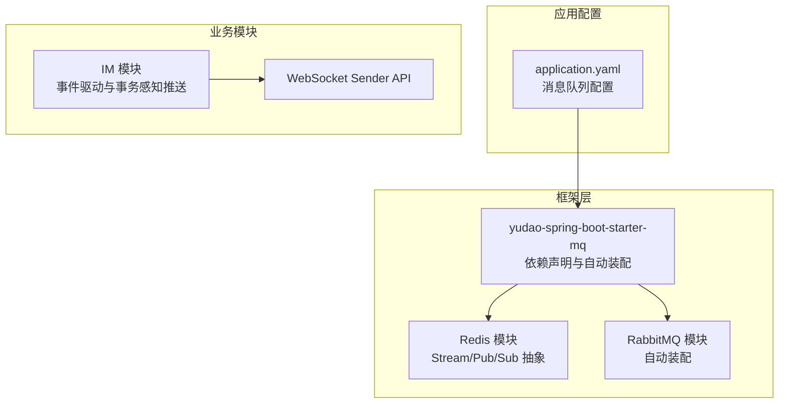
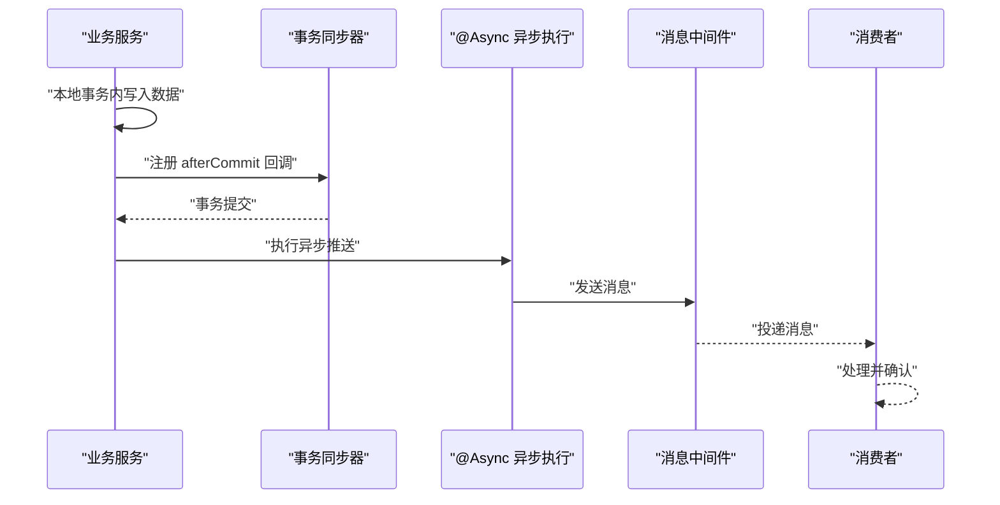
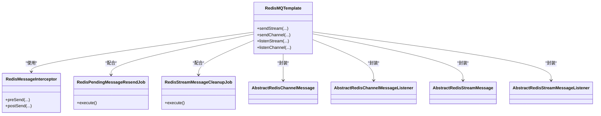
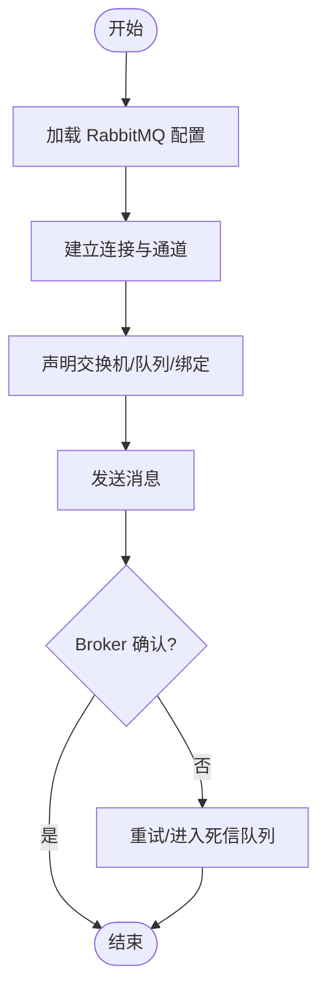
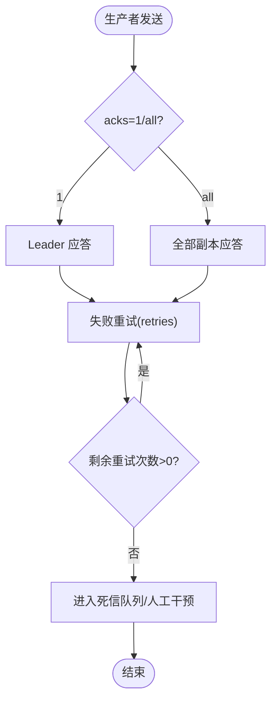
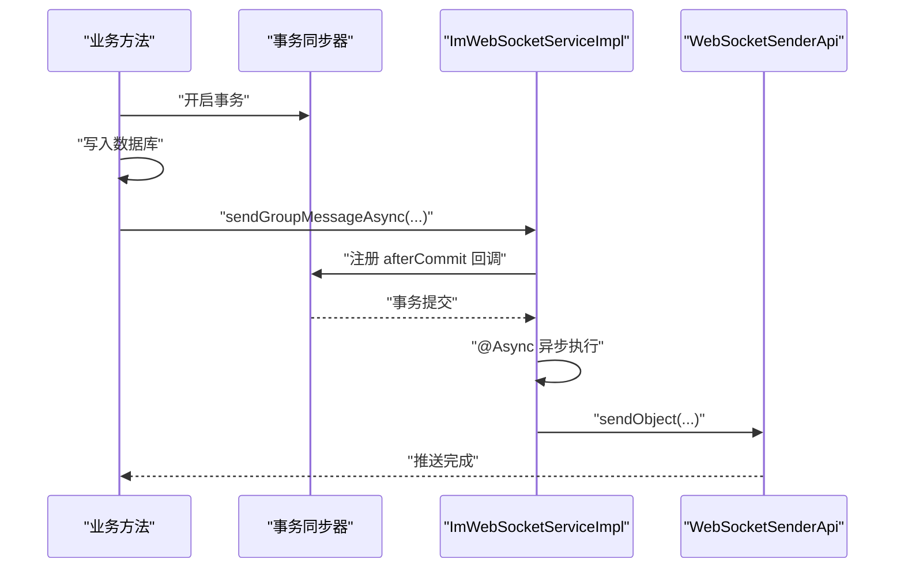
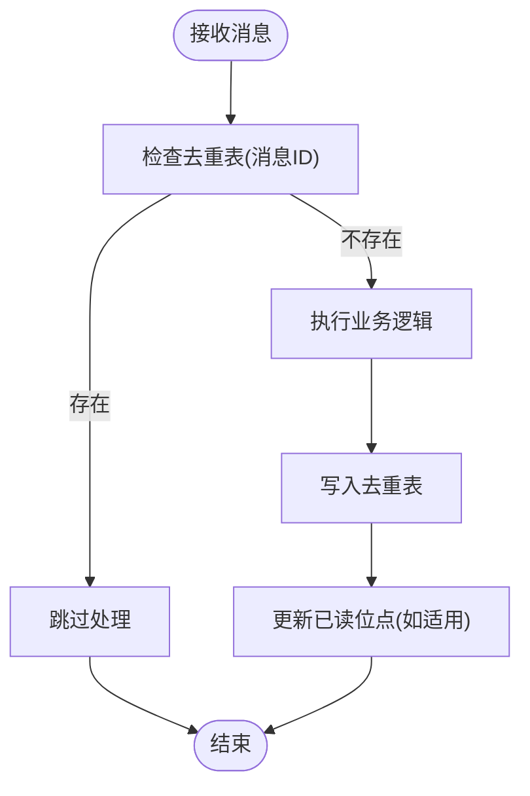
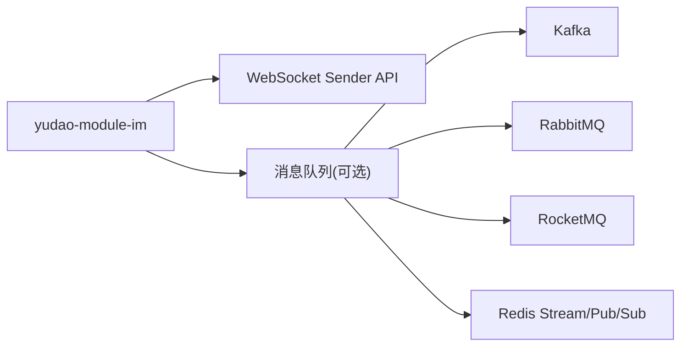

# 消息队列

<cite>
**本文引用的文件**
- [application.yaml](file://yudao-server/src/main/resources/application.yaml)
- [pom.xml](file://yudao-framework/yudao-spring-boot-starter-mq/pom.xml)
- [ImWebSocketService.java](file://yudao-module-im/src/main/java/cn/iocoder/yudao/module/im/service/websocket/ImWebSocketService.java)
- [ImWebSocketServiceImpl.java](file://yudao-module-im/src/main/java/cn/iocoder/yudao/module/im/service/websocket/ImWebSocketServiceImpl.java)
- [ImGroupMessageServiceImpl.java](file://yudao-module-im/src/main/java/cn/iocoder/yudao/module/im/service/message/ImGroupMessageServiceImpl.java)
- [ImGroupMessageReadRedisDAO.java](file://yudao-module-im/src/main/java/cn/iocoder/yudao/module/im/dal/redis/message/ImGroupMessageReadRedisDAO.java)
- [ImChannelMessageReadRedisDAO.java](file://yudao-module-im/src/main/java/cn/iocoder/yudao/module/im/dal/redis/message/ImChannelMessageReadRedisDAO.java)
- [TracerUtils.java](file://yudao-framework/yudao-common/src/main/java/cn/iocoder/yudao/framework/common/util/monitor/TracerUtils.java)
- [TracerFrameworkUtils.java](file://yudao-framework/yudao-spring-boot-starter-monitor/src/main/java/cn/iocoder/yudao/framework/tracer/core/util/TracerFrameworkUtils.java)
- [RabbitMQConfigForm.vue](file://yudao-ui/yudao-ui-admin-vue3/src/views/iot/rule/data/sink/config/RabbitMQConfigForm.vue)
- [index.ts](file://yudao-ui/yudao-ui-admin-vue3/src/views/iot/rule/data/sink/config/index.ts)
- [YudaoRabbitMQAutoConfiguration.java](file://yudao-framework/yudao-spring-boot-starter-mq/src/main/java/cn/iocoder/yudao/framework/mq/rabbitmq/config/YudaoRabbitMQAutoConfiguration.java)
- [YudaoRedisMQConsumerAutoConfiguration.java](file://yudao-framework/yudao-spring-boot-starter-mq/src/main/java/cn/iocoder/yudao/framework/mq/redis/config/YudaoRedisMQConsumerAutoConfiguration.java)
- [YudaoRedisMQProducerAutoConfiguration.java](file://yudao-framework/yudao-spring-boot-starter-mq/src/main/java/cn/iocoder/yudao/framework/mq/redis/config/YudaoRedisMQProducerAutoConfiguration.java)
- [RedisMQTemplate.java](file://yudao-framework/yudao-spring-boot-starter-mq/src/main/java/cn/iocoder/yudao/framework/mq/redis/core/RedisMQTemplate.java)
- [RedisMessageInterceptor.java](file://yudao-framework/yudao-spring-boot-starter-mq/src/main/java/cn/iocoder/yudao/framework/mq/redis/core/interceptor/RedisMessageInterceptor.java)
- [RedisPendingMessageResendJob.java](file://yudao-framework/yudao-spring-boot-starter-mq/src/main/java/cn/iocoder/yudao/framework/mq/redis/core/job/RedisPendingMessageResendJob.java)
- [RedisStreamMessageCleanupJob.java](file://yudao-framework/yudao-spring-boot-starter-mq/src/main/java/cn/iocoder/yudao/framework/mq/redis/core/job/RedisStreamMessageCleanupJob.java)
- [AbstractRedisChannelMessage.java](file://yudao-framework/yudao-spring-boot-starter-mq/src/main/java/cn/iocoder/yudao/framework/mq/redis/core/pubsub/AbstractRedisChannelMessage.java)
- [AbstractRedisChannelMessageListener.java](file://yudao-framework/yudao-spring-boot-starter-mq/src/main/java/cn/iocoder/yudao/framework/mq/redis/core/pubsub/AbstractRedisChannelMessageListener.java)
- [AbstractRedisStreamMessage.java](file://yudao-framework/yudao-spring-boot-starter-mq/src/main/java/cn/iocoder/yudao/framework/mq/redis/core/stream/AbstractRedisStreamMessage.java)
- [AbstractRedisStreamMessageListener.java](file://yudao-framework/yudao-spring-boot-starter-mq/src/main/java/cn/iocoder/yudao/framework/mq/redis/core/stream/AbstractRedisStreamMessageListener.java)
</cite>

## 目录
1. [引言](#引言)
2. [项目结构](#项目结构)
3. [核心组件](#核心组件)
4. [架构总览](#架构总览)
5. [组件详解](#组件详解)
6. [依赖关系分析](#依赖关系分析)
7. [性能考量](#性能考量)
8. [故障排查指南](#故障排查指南)
9. [结论](#结论)
10. [附录](#附录)

## 引言
本文件系统性梳理本项目的异步消息能力与实践，覆盖以下主题：
- 支持的消息队列技术：Redis Pub/Sub、RabbitMQ、Kafka、RocketMQ 的集成与配置要点
- 异步消息处理模式：事件驱动架构、生产者与消费者的配置方式
- 可靠性保障：消息确认、重试与死信队列策略
- 分布式事务：Saga 与 TCC 的落地思路
- 幂等性设计：去重表与消费幂等
- 监控与调试：消息追踪、延迟监控与异常处理

## 项目结构
消息队列能力主要由“框架层”与“业务模块”协同实现：
- 框架层（yudao-spring-boot-starter-mq）：统一抽象 Redis Stream/Pub/Sub、RabbitMQ、Kafka、RocketMQ 的接入与自动装配
- 业务模块（如 yudao-module-im）：以 IM 场景为例，展示事件驱动、事务感知异步推送、Redis 已读位点等

图表来源
- [application.yaml:120-146](file://yudao-server/src/main/resources/application.yaml#L120-L146)
- [pom.xml:18-41](file://yudao-framework/yudao-spring-boot-starter-mq/pom.xml#L18-L41)

章节来源
- [application.yaml:120-146](file://yudao-server/src/main/resources/application.yaml#L120-L146)
- [pom.xml:18-41](file://yudao-framework/yudao-spring-boot-starter-mq/pom.xml#L18-L41)

## 核心组件
- 框架级消息队列启动器：统一引入 Kafka、RabbitMQ、RocketMQ 依赖，便于按需启用
- Redis 模块：提供 Redis Stream/Pub/Sub 的抽象与作业（重发、清理），支撑高吞吐与可靠投递
- RabbitMQ 自动装配：基于 Spring AMQP 的自动配置入口
- 业务侧 IM 模块：以事件驱动方式触发异步推送，结合事务同步确保数据一致性

章节来源
- [pom.xml:18-41](file://yudao-framework/yudao-spring-boot-starter-mq/pom.xml#L18-L41)
- [YudaoRabbitMQAutoConfiguration.java](file://yudao-framework/yudao-spring-boot-starter-mq/src/main/java/cn/iocoder/yudao/framework/mq/rabbitmq/config/YudaoRabbitMQAutoConfiguration.java)
- [YudaoRedisMQConsumerAutoConfiguration.java](file://yudao-framework/yudao-spring-boot-starter-mq/src/main/java/cn/iocoder/yudao/framework/mq/redis/config/YudaoRedisMQConsumerAutoConfiguration.java)
- [YudaoRedisMQProducerAutoConfiguration.java](file://yudao-framework/yudao-spring-boot-starter-mq/src/main/java/cn/iocoder/yudao/framework/mq/redis/config/YudaoRedisMQProducerAutoConfiguration.java)

## 架构总览
整体采用“事件驱动 + 事务感知 + 多消息中间件”的架构：
- 事件产生：业务服务在本地事务内完成数据变更后，触发异步事件
- 事务感知：若事务未提交，事件延迟至提交后异步执行，避免客户端提前可见未落盘数据
- 消息投递：根据配置选择 Redis Stream/Pub/Sub 或 RabbitMQ/Kafka/RocketMQ 进行投递
- 可靠性：Redis 侧通过 Pending/Stream 与定时作业保障重试与清理；RabbitMQ/Kafka/RocketMQ 依赖各自确认与重试机制

图表来源
- [ImWebSocketServiceImpl.java:130-145](file://yudao-module-im/src/main/java/cn/iocoder/yudao/module/im/service/websocket/ImWebSocketServiceImpl.java#L130-L145)
- [ImWebSocketService.java:19-82](file://yudao-module-im/src/main/java/cn/iocoder/yudao/module/im/service/websocket/ImWebSocketService.java#L19-L82)

章节来源
- [ImWebSocketServiceImpl.java:130-145](file://yudao-module-im/src/main/java/cn/iocoder/yudao/module/im/service/websocket/ImWebSocketServiceImpl.java#L130-L145)
- [ImWebSocketService.java:19-82](file://yudao-module-im/src/main/java/cn/iocoder/yudao/module/im/service/websocket/ImWebSocketService.java#L19-L82)

## 组件详解

### Redis 消息队列（Stream/Pub/Sub）
- 抽象与模板：提供 RedisMQTemplate 作为统一操作入口，封装 Stream/Pub/Sub 的通用行为
- 作业与拦截：包含消息拦截器、待处理消息重发作业、Stream 清理作业，提升可靠性
- 通道与流监听：抽象 Channel/Stream 消息与监听器，便于扩展不同场景的消息模型

图表来源
- [RedisMQTemplate.java](file://yudao-framework/yudao-spring-boot-starter-mq/src/main/java/cn/iocoder/yudao/framework/mq/redis/core/RedisMQTemplate.java)
- [RedisMessageInterceptor.java](file://yudao-framework/yudao-spring-boot-starter-mq/src/main/java/cn/iocoder/yudao/framework/mq/redis/core/interceptor/RedisMessageInterceptor.java)
- [RedisPendingMessageResendJob.java](file://yudao-framework/yudao-spring-boot-starter-mq/src/main/java/cn/iocoder/yudao/framework/mq/redis/core/job/RedisPendingMessageResendJob.java)
- [RedisStreamMessageCleanupJob.java](file://yudao-framework/yudao-spring-boot-starter-mq/src/main/java/cn/iocoder/yudao/framework/mq/redis/core/job/RedisStreamMessageCleanupJob.java)
- [AbstractRedisChannelMessage.java](file://yudao-framework/yudao-spring-boot-starter-mq/src/main/java/cn/iocoder/yudao/framework/mq/redis/core/pubsub/AbstractRedisChannelMessage.java)
- [AbstractRedisChannelMessageListener.java](file://yudao-framework/yudao-spring-boot-starter-mq/src/main/java/cn/iocoder/yudao/framework/mq/redis/core/pubsub/AbstractRedisChannelMessageListener.java)
- [AbstractRedisStreamMessage.java](file://yudao-framework/yudao-spring-boot-starter-mq/src/main/java/cn/iocoder/yudao/framework/mq/redis/core/stream/AbstractRedisStreamMessage.java)
- [AbstractRedisStreamMessageListener.java](file://yudao-framework/yudao-spring-boot-starter-mq/src/main/java/cn/iocoder/yudao/framework/mq/redis/core/stream/AbstractRedisStreamMessageListener.java)

章节来源
- [YudaoRedisMQConsumerAutoConfiguration.java](file://yudao-framework/yudao-spring-boot-starter-mq/src/main/java/cn/iocoder/yudao/framework/mq/redis/config/YudaoRedisMQConsumerAutoConfiguration.java)
- [YudaoRedisMQProducerAutoConfiguration.java](file://yudao-framework/yudao-spring-boot-starter-mq/src/main/java/cn/iocoder/yudao/framework/mq/redis/config/YudaoRedisMQProducerAutoConfiguration.java)

### RabbitMQ 集成
- 自动装配：通过 YudaoRabbitMQAutoConfiguration 提供 RabbitMQ 相关的自动配置
- 配置示例：前端 IoT 规则引擎 Sink 配置表单中包含 RabbitMQ 的连接参数（主机、端口、虚拟主机、用户名、密码、交换机、路由键、队列）

图表来源
- [YudaoRabbitMQAutoConfiguration.java](file://yudao-framework/yudao-spring-boot-starter-mq/src/main/java/cn/iocoder/yudao/framework/mq/rabbitmq/config/YudaoRabbitMQAutoConfiguration.java)
- [RabbitMQConfigForm.vue:47-62](file://yudao-ui/yudao-ui-admin-vue3/src/views/iot/rule/data/sink/config/RabbitMQConfigForm.vue#L47-L62)

章节来源
- [YudaoRabbitMQAutoConfiguration.java](file://yudao-framework/yudao-spring-boot-starter-mq/src/main/java/cn/iocoder/yudao/framework/mq/rabbitmq/config/YudaoRabbitMQAutoConfiguration.java)
- [RabbitMQConfigForm.vue:47-62](file://yudao-ui/yudao-ui-admin-vue3/src/views/iot/rule/data/sink/config/RabbitMQConfigForm.vue#L47-L62)

### Kafka 集成
- 配置要点：acks、retries、序列化器、消费者 auto-offset-reset、监听器缺失主题容错等
- 使用建议：生产者侧合理设置 acks 与重试次数；消费者侧注意反序列化信任包与主题不存在容错

图表来源
- [application.yaml:129-144](file://yudao-server/src/main/resources/application.yaml#L129-L144)

章节来源
- [application.yaml:129-144](file://yudao-server/src/main/resources/application.yaml#L129-L144)

### RocketMQ 集成
- 依赖引入：yudao-spring-boot-starter-mq 引入 RocketMQ Spring Boot Starter
- 配置要点：生产者分组等基础配置，结合业务模块按需启用

章节来源
- [pom.xml:36-40](file://yudao-framework/yudao-spring-boot-starter-mq/pom.xml#L36-L40)
- [application.yaml:122-126](file://yudao-server/src/main/resources/application.yaml#L122-L126)

### 事件驱动与事务感知异步推送（IM 示例）
- 接口定义：ImWebSocketService 提供私聊/群聊/频道消息的异步推送接口
- 实现逻辑：ImWebSocketServiceImpl 在事务内延迟执行，事务提交后通过 @Async 异步推送
- 事件触发：例如群消息已读事件，使用 @Async 触发 WebSocket 推送

图表来源
- [ImWebSocketService.java:19-82](file://yudao-module-im/src/main/java/cn/iocoder/yudao/module/im/service/websocket/ImWebSocketService.java#L19-L82)
- [ImWebSocketServiceImpl.java:130-145](file://yudao-module-im/src/main/java/cn/iocoder/yudao/module/im/service/websocket/ImWebSocketServiceImpl.java#L130-L145)
- [ImGroupMessageServiceImpl.java:444-449](file://yudao-module-im/src/main/java/cn/iocoder/yudao/module/im/service/message/ImGroupMessageServiceImpl.java#L444-L449)

章节来源
- [ImWebSocketService.java:19-82](file://yudao-module-im/src/main/java/cn/iocoder/yudao/module/im/service/websocket/ImWebSocketService.java#L19-L82)
- [ImWebSocketServiceImpl.java:130-145](file://yudao-module-im/src/main/java/cn/iocoder/yudao/module/im/service/websocket/ImWebSocketServiceImpl.java#L130-L145)
- [ImGroupMessageServiceImpl.java:444-449](file://yudao-module-im/src/main/java/cn/iocoder/yudao/module/im/service/message/ImGroupMessageServiceImpl.java#L444-L449)

### 消息可靠性保障
- Redis 侧：Pending/Stream 与定时作业（重发、清理）保障消息可达与资源回收
- RabbitMQ/Kafka/RocketMQ：依赖 broker 确认、重试与死信队列策略
- IM 侧：事务感知异步推送避免“先看到消息再看到数据”的一致性问题

章节来源
- [RedisPendingMessageResendJob.java](file://yudao-framework/yudao-spring-boot-starter-mq/src/main/java/cn/iocoder/yudao/framework/mq/redis/core/job/RedisPendingMessageResendJob.java)
- [RedisStreamMessageCleanupJob.java](file://yudao-framework/yudao-spring-boot-starter-mq/src/main/java/cn/iocoder/yudao/framework/mq/redis/core/job/RedisStreamMessageCleanupJob.java)
- [application.yaml:129-144](file://yudao-server/src/main/resources/application.yaml#L129-L144)

### 分布式事务：Saga 与 TCC
- Saga 模式：长流程拆分为多个本地事务，通过补偿动作回滚；适合跨服务编排
- TCC 模式：Try-Confirm-Cancel 三阶段，锁定资源，适合强一致场景
- 在本项目中，可通过消息队列编排各子事务，结合幂等与重试保障最终一致性

（本节为概念性说明，不直接分析具体文件）

### 幂等性设计
- 去重表设计：利用 Redis Hash 存储“消息 ID -> 已处理时间戳”，消费端在处理前检查是否重复
- IM 已读位点：通过 Redis 记录用户在频道/群的最大已读消息 ID，避免重复推进状态
- 消费幂等：结合消息 ID 去重与业务幂等键，确保重复消息不会产生副作用

图表来源
- [ImGroupMessageReadRedisDAO.java:32-35](file://yudao-module-im/src/main/java/cn/iocoder/yudao/module/im/dal/redis/message/ImGroupMessageReadRedisDAO.java#L32-L35)
- [ImChannelMessageReadRedisDAO.java:28-44](file://yudao-module-im/src/main/java/cn/iocoder/yudao/module/im/dal/redis/message/ImChannelMessageReadRedisDAO.java#L28-L44)

章节来源
- [ImGroupMessageReadRedisDAO.java:32-35](file://yudao-module-im/src/main/java/cn/iocoder/yudao/module/im/dal/redis/message/ImGroupMessageReadRedisDAO.java#L32-L35)
- [ImChannelMessageReadRedisDAO.java:28-44](file://yudao-module-im/src/main/java/cn/iocoder/yudao/module/im/dal/redis/message/ImChannelMessageReadRedisDAO.java#L28-L44)

### 监控与调试
- 链路追踪：TracerUtils 提供 SkyWalking TraceId 获取；TracerFrameworkUtils 将异常信息记录到 Span
- 延迟监控：结合消息发送与消费时间戳计算延迟；对重试与死信队列进行告警
- 异常处理：在消费者侧捕获异常并记录到 Span，便于定位问题

章节来源
- [TracerUtils.java:26-28](file://yudao-framework/yudao-common/src/main/java/cn/iocoder/yudao/framework/common/util/monitor/TracerUtils.java#L26-L28)
- [TracerFrameworkUtils.java:24-44](file://yudao-framework/yudao-spring-boot-starter-monitor/src/main/java/cn/iocoder/yudao/framework/tracer/core/util/TracerFrameworkUtils.java#L24-L44)

## 依赖关系分析
- yudao-spring-boot-starter-mq 统一引入 Kafka、RabbitMQ、RocketMQ 依赖，按需启用
- IM 模块通过 WebSocket Sender API 与消息队列解耦，便于替换底层传输

图表来源
- [pom.xml:26-40](file://yudao-framework/yudao-spring-boot-starter-mq/pom.xml#L26-L40)
- [application.yaml:128-144](file://yudao-server/src/main/resources/application.yaml#L128-L144)

章节来源
- [pom.xml:26-40](file://yudao-framework/yudao-spring-boot-starter-mq/pom.xml#L26-L40)
- [application.yaml:128-144](file://yudao-server/src/main/resources/application.yaml#L128-L144)

## 性能考量
- Redis Stream：适合高吞吐、有序消息；注意分区与消费者组规模
- RabbitMQ：适合需要严格确认与路由的场景；合理设置 prefetch 与并发
- Kafka：适合日志/事件流；关注分区数、副本与压缩策略
- RocketMQ：适合大流量与顺序消息；关注队列数量与主从同步
- 事务感知异步：减少客户端等待，但需控制异步任务数量，避免阻塞线程池

（本节为通用指导，不直接分析具体文件）

## 故障排查指南
- 消息未达：检查 acks/retries、交换机/队列/主题是否存在、消费者组是否正确
- 重复消费：启用去重表与幂等键；核对 Redis 去重记录与已读位点
- 延迟过高：采集发送/消费时间戳，定位瓶颈；优化消费者并发与批处理
- 异常定位：通过链路追踪 TraceId 与 Span 日志快速定位异常

章节来源
- [application.yaml:129-144](file://yudao-server/src/main/resources/application.yaml#L129-L144)
- [TracerUtils.java:26-28](file://yudao-framework/yudao-common/src/main/java/cn/iocoder/yudao/framework/common/util/monitor/TracerUtils.java#L26-L28)
- [TracerFrameworkUtils.java:24-44](file://yudao-framework/yudao-spring-boot-starter-monitor/src/main/java/cn/iocoder/yudao/framework/tracer/core/util/TracerFrameworkUtils.java#L24-L44)

## 结论
本项目通过“框架层统一抽象 + 业务模块事件驱动”的方式，实现了对多种消息中间件的支持与可靠投递。结合事务感知异步、Redis 重试与清理作业、以及去重表与已读位点等机制，能够在保证最终一致性的前提下，满足高吞吐与低延迟的业务需求。

## 附录
- 前端 IoT 规则引擎 Sink 配置：包含 RabbitMQ 连接参数，便于在规则链路中输出到消息中间件
- RabbitMQ 配置表单导出：统一导出各 Sink 组件，便于前端按需渲染

章节来源
- [RabbitMQConfigForm.vue:47-62](file://yudao-ui/yudao-ui-admin-vue3/src/views/iot/rule/data/sink/config/RabbitMQConfigForm.vue#L47-L62)
- [index.ts:6-21](file://yudao-ui/yudao-ui-admin-vue3/src/views/iot/rule/data/sink/config/index.ts#L6-L21)