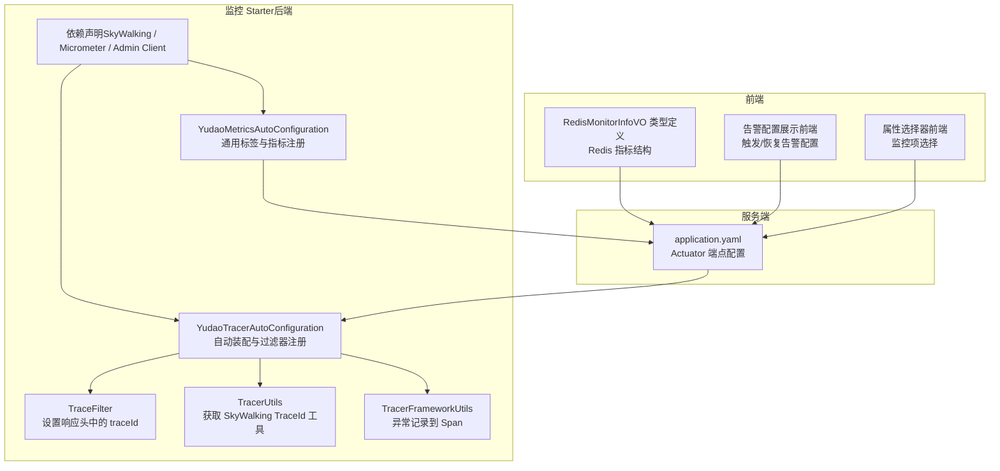
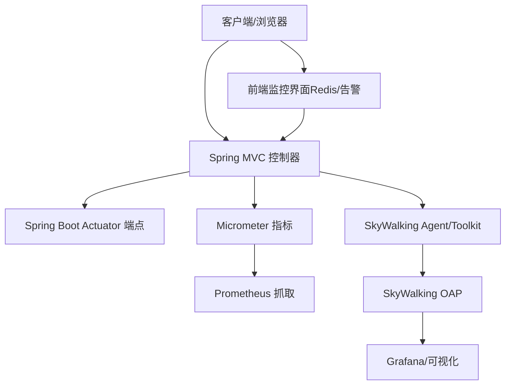
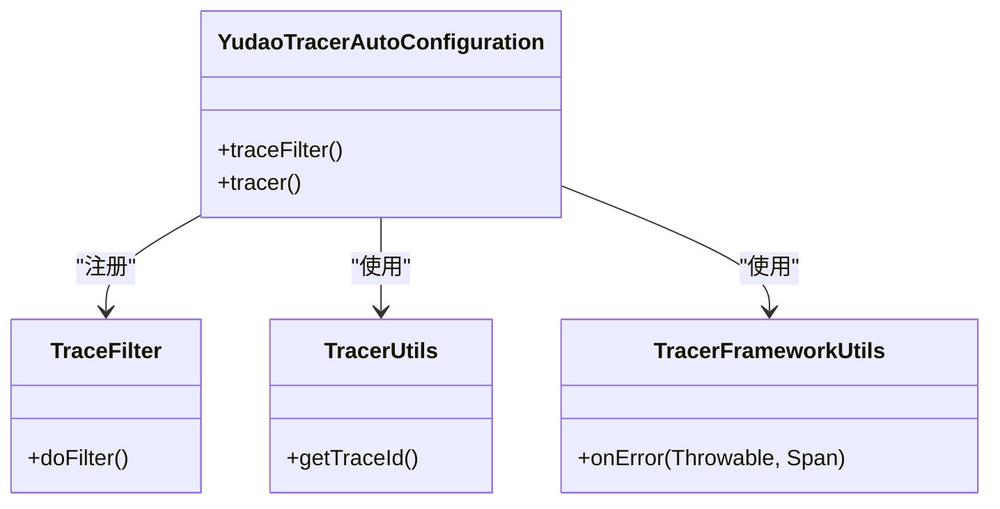
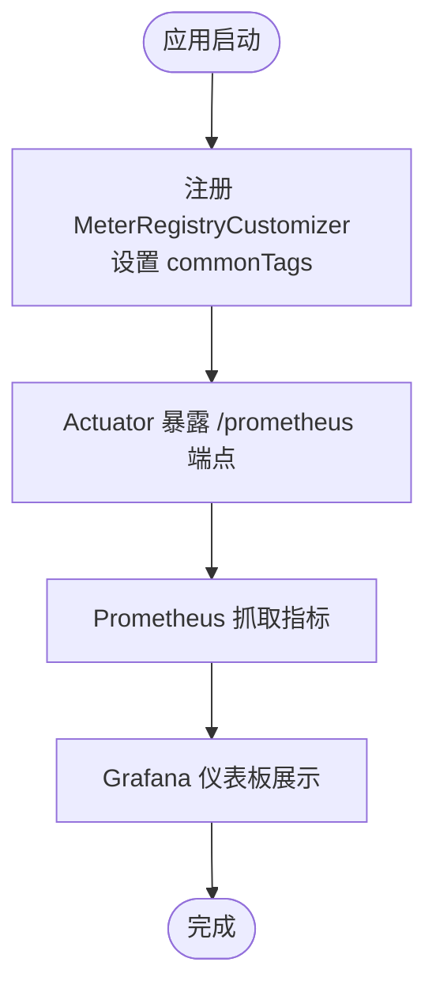
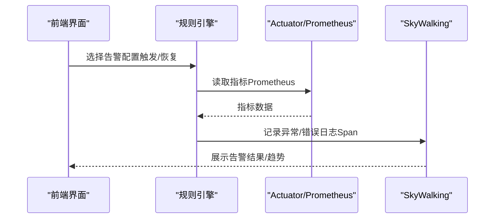
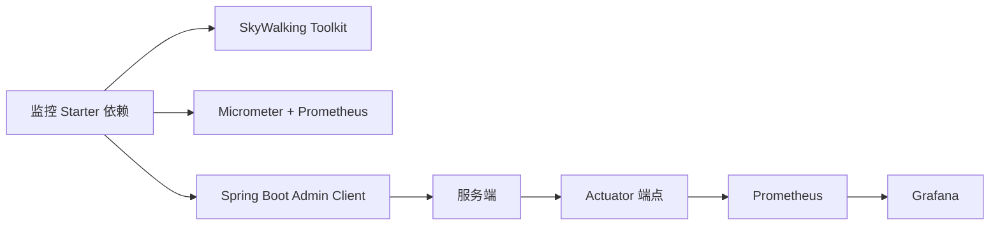

# 监控与追踪

<cite>
**本文引用的文件**
- [YudaoTracerAutoConfiguration.java](file://yudao-framework/yudao-spring-boot-starter-monitor/src/main/java/cn/iocoder/yudao/framework/tracer/config/YudaoTracerAutoConfiguration.java)
- [YudaoMetricsAutoConfiguration.java](file://yudao-framework/yudao-spring-boot-starter-monitor/src/main/java/cn/iocoder/yudao/framework/tracer/config/YudaoMetricsAutoConfiguration.java)
- [TracerUtils.java](file://yudao-framework/yudao-common/src/main/java/cn/iocoder/yudao/framework/common/util/monitor/TracerUtils.java)
- [TracerFrameworkUtils.java](file://yudao-framework/yudao-spring-boot-starter-monitor/src/main/java/cn/iocoder/yudao/framework/tracer/core/util/TracerFrameworkUtils.java)
- [TraceFilter.java](file://yudao-framework/yudao-spring-boot-starter-monitor/src/main/java/cn/iocoder/yudao/framework/tracer/core/filter/TraceFilter.java)
- [pom.xml（监控 Starter）](file://yudao-framework/yudao-spring-boot-starter-monitor/pom.xml)
- [application.yaml（服务端）](file://yudao-server/src/main/resources/application.yaml)
- [RedisMonitorInfoVO 类型定义](file://yudao-ui/yudao-ui-admin-vue3/src/api/infra/redis/types.ts)
- [告警配置展示（前端）](file://yudao-ui/yudao-ui-admin-vue3/src/views/iot/rule/scene/form/sections/ActionSection.vue)
- [属性选择器（前端）](file://yudao-ui/yudao-ui-admin-vue3/src/views/iot/rule/scene/form/selectors/PropertySelector.vue)
</cite>

## 目录
1. [简介](#简介)
2. [项目结构](#项目结构)
3. [核心组件](#核心组件)
4. [架构总览](#架构总览)
5. [详细组件分析](#详细组件分析)
6. [依赖关系分析](#依赖关系分析)
7. [性能考量](#性能考量)
8. [故障排查指南](#故障排查指南)
9. [结论](#结论)
10. [附录](#附录)

## 简介
本文件面向监控与追踪系统，结合后端 Spring Boot 应用与前端监控界面，系统性阐述以下能力：
- 应用监控：基于 Spring Boot Actuator 的端点暴露与安全访问策略
- 链路追踪：SkyWalking 的集成与分布式追踪实现
- 指标采集与可视化：Micrometer 指标定义与 Prometheus/Grafana 集成
- 日志监控与分析：日志聚合、错误统计与性能分析
- 告警机制：阈值告警、异常告警与业务指标告警
- 性能监控最佳实践：响应时间、吞吐量与资源使用监控

## 项目结构
监控与追踪能力由“监控 Starter”模块提供，包含自动装配、过滤器、工具类与对 SkyWalking、Micrometer 的依赖声明；服务端通过配置启用 Actuator 端点；前端提供 Redis 监控与告警配置等可视化界面。

图示来源
- [YudaoTracerAutoConfiguration.java:1-100](file://yudao-framework/yudao-spring-boot-starter-monitor/src/main/java/cn/iocoder/yudao/framework/tracer/config/YudaoTracerAutoConfiguration.java#L1-L100)
- [YudaoMetricsAutoConfiguration.java:1-27](file://yudao-framework/yudao-spring-boot-starter-monitor/src/main/java/cn/iocoder/yudao/framework/tracer/config/YudaoMetricsAutoConfiguration.java#L1-L27)
- [TraceFilter.java](file://yudao-framework/yudao-spring-boot-starter-monitor/src/main/java/cn/iocoder/yudao/framework/tracer/core/filter/TraceFilter.java)
- [TracerUtils.java:1-30](file://yudao-framework/yudao-common/src/main/java/cn/iocoder/yudao/framework/common/util/monitor/TracerUtils.java#L1-L30)
- [TracerFrameworkUtils.java:1-46](file://yudao-framework/yudao-spring-boot-starter-monitor/src/main/java/cn/iocoder/yudao/framework/tracer/core/util/TracerFrameworkUtils.java#L1-L46)
- [pom.xml（监控 Starter）:37-79](file://yudao-framework/yudao-spring-boot-starter-monitor/pom.xml#L37-L79)
- [application.yaml（服务端）](file://yudao-server/src/main/resources/application.yaml)
- [RedisMonitorInfoVO 类型定义:1-176](file://yudao-ui/yudao-ui-admin-vue3/src/api/infra/redis/types.ts#L1-L176)
- [告警配置展示（前端）:100-124](file://yudao-ui/yudao-ui-admin-vue3/src/views/iot/rule/scene/form/sections/ActionSection.vue#L100-L124)
- [属性选择器（前端）:1-34](file://yudao-ui/yudao-ui-admin-vue3/src/views/iot/rule/scene/form/selectors/PropertySelector.vue#L1-L34)

章节来源
- [YudaoTracerAutoConfiguration.java:1-100](file://yudao-framework/yudao-spring-boot-starter-monitor/src/main/java/cn/iocoder/yudao/framework/tracer/config/YudaoTracerAutoConfiguration.java#L1-L100)
- [YudaoMetricsAutoConfiguration.java:1-27](file://yudao-framework/yudao-spring-boot-starter-monitor/src/main/java/cn/iocoder/yudao/framework/tracer/config/YudaoMetricsAutoConfiguration.java#L1-L27)
- [pom.xml（监控 Starter）:37-79](file://yudao-framework/yudao-spring-boot-starter-monitor/pom.xml#L37-L79)
- [application.yaml（服务端）](file://yudao-server/src/main/resources/application.yaml)
- [RedisMonitorInfoVO 类型定义:1-176](file://yudao-ui/yudao-ui-admin-vue3/src/api/infra/redis/types.ts#L1-L176)
- [告警配置展示（前端）:100-124](file://yudao-ui/yudao-ui-admin-vue3/src/views/iot/rule/scene/form/sections/ActionSection.vue#L100-L124)
- [属性选择器（前端）:1-34](file://yudao-ui/yudao-ui-admin-vue3/src/views/iot/rule/scene/form/selectors/PropertySelector.vue#L1-L34)

## 核心组件
- 自动装配与过滤器
  - YudaoTracerAutoConfiguration：负责注册 TraceFilter，并预留 SkyWalking Tracer Bean 的扩展位置（当前注释掉，待迁移至 OpenTelemetry）
  - YudaoMetricsAutoConfiguration：为 Micrometer 注册通用标签（如 application），便于多实例指标聚合
- 追踪工具
  - TracerUtils：提供获取 SkyWalking TraceId 的便捷方法
  - TracerFrameworkUtils：将异常信息标准化记录到 Span，便于追踪与诊断
- 依赖与端到端链路
  - pom.xml 声明 SkyWalking Toolkit（trace/logback/opentracing）、Micrometer Prometheus 支持以及 Spring Boot Admin Client
  - application.yaml 提供 Actuator 端点的启用与安全访问控制

章节来源
- [YudaoTracerAutoConfiguration.java:1-100](file://yudao-framework/yudao-spring-boot-starter-monitor/src/main/java/cn/iocoder/yudao/framework/tracer/config/YudaoTracerAutoConfiguration.java#L1-L100)
- [YudaoMetricsAutoConfiguration.java:1-27](file://yudao-framework/yudao-spring-boot-starter-monitor/src/main/java/cn/iocoder/yudao/framework/tracer/config/YudaoMetricsAutoConfiguration.java#L1-L27)
- [TracerUtils.java:1-30](file://yudao-framework/yudao-common/src/main/java/cn/iocoder/yudao/framework/common/util/monitor/TracerUtils.java#L1-L30)
- [TracerFrameworkUtils.java:1-46](file://yudao-framework/yudao-spring-boot-starter-monitor/src/main/java/cn/iocoder/yudao/framework/tracer/core/util/TracerFrameworkUtils.java#L1-L46)
- [pom.xml（监控 Starter）:37-79](file://yudao-framework/yudao-spring-boot-starter-monitor/pom.xml#L37-L79)
- [application.yaml（服务端）](file://yudao-server/src/main/resources/application.yaml)

## 架构总览
后端通过 Actuator 暴露运行状态与健康检查端点；Micrometer 汇聚 JVM 与业务指标并通过 Prometheus 抓取；SkyWalking 采集链路追踪数据；前端提供 Redis 监控与告警配置界面。

图示来源
- [application.yaml（服务端）](file://yudao-server/src/main/resources/application.yaml)
- [pom.xml（监控 Starter）:37-79](file://yudao-framework/yudao-spring-boot-starter-monitor/pom.xml#L37-L79)

## 详细组件分析

### 组件一：链路追踪（SkyWalking 集成）
- 自动装配
  - 注册 TraceFilter，确保响应头中携带 traceId，便于跨服务定位请求
  - 预留 Tracer Bean 扩展点（当前注释），未来迁移至 OpenTelemetry
- 追踪工具
  - TracerUtils：从 SkyWalking Toolkit 获取 TraceId
  - TracerFrameworkUtils：将异常对象、类型、消息与堆栈写入 Span，统一错误标记
- 依赖
  - apm-toolkit-trace、apm-toolkit-logback-1.x、apm-toolkit-opentracing

图示来源
- [YudaoTracerAutoConfiguration.java:1-100](file://yudao-framework/yudao-spring-boot-starter-monitor/src/main/java/cn/iocoder/yudao/framework/tracer/config/YudaoTracerAutoConfiguration.java#L1-L100)
- [TraceFilter.java](file://yudao-framework/yudao-spring-boot-starter-monitor/src/main/java/cn/iocoder/yudao/framework/tracer/core/filter/TraceFilter.java)
- [TracerUtils.java:1-30](file://yudao-framework/yudao-common/src/main/java/cn/iocoder/yudao/framework/common/util/monitor/TracerUtils.java#L1-L30)
- [TracerFrameworkUtils.java:1-46](file://yudao-framework/yudao-spring-boot-starter-monitor/src/main/java/cn/iocoder/yudao/framework/tracer/core/util/TracerFrameworkUtils.java#L1-L46)

章节来源
- [YudaoTracerAutoConfiguration.java:1-100](file://yudao-framework/yudao-spring-boot-starter-monitor/src/main/java/cn/iocoder/yudao/framework/tracer/config/YudaoTracerAutoConfiguration.java#L1-L100)
- [TracerUtils.java:1-30](file://yudao-framework/yudao-common/src/main/java/cn/iocoder/yudao/framework/common/util/monitor/TracerUtils.java#L1-L30)
- [TracerFrameworkUtils.java:1-46](file://yudao-framework/yudao-spring-boot-starter-monitor/src/main/java/cn/iocoder/yudao/framework/tracer/core/util/TracerFrameworkUtils.java#L1-L46)
- [pom.xml（监控 Starter）:37-79](file://yudao-framework/yudao-spring-boot-starter-monitor/pom.xml#L37-L79)

### 组件二：指标与可视化（Micrometer + Prometheus + Grafana）
- 通用标签
  - YudaoMetricsAutoConfiguration 为所有指标添加 commonTags，包含 application 名称，便于多实例聚合
- 依赖
  - micrometer-registry-prometheus，用于暴露 /actuator/prometheus 端点
- 可视化
  - Prometheus 抓取 /actuator/prometheus
  - Grafana 导入 Prometheus 数据源并创建仪表板

图示来源
- [YudaoMetricsAutoConfiguration.java:1-27](file://yudao-framework/yudao-spring-boot-starter-monitor/src/main/java/cn/iocoder/yudao/framework/tracer/config/YudaoMetricsAutoConfiguration.java#L1-L27)
- [pom.xml（监控 Starter）:65-70](file://yudao-framework/yudao-spring-boot-starter-monitor/pom.xml#L65-L70)
- [application.yaml（服务端）](file://yudao-server/src/main/resources/application.yaml)

章节来源
- [YudaoMetricsAutoConfiguration.java:1-27](file://yudao-framework/yudao-spring-boot-starter-monitor/src/main/java/cn/iocoder/yudao/framework/tracer/config/YudaoMetricsAutoConfiguration.java#L1-L27)
- [pom.xml（监控 Starter）:65-70](file://yudao-framework/yudao-spring-boot-starter-monitor/pom.xml#L65-L70)
- [application.yaml（服务端）](file://yudao-server/src/main/resources/application.yaml)

### 组件三：日志监控与分析
- SkyWalking 日志采集
  - 通过 apm-toolkit-logback-1.x 将日志与 TraceId 关联，便于在 SkyWalking 中进行日志检索与错误统计
- 错误统计与性能分析
  - 结合异常记录到 Span 的工具，可按 TraceId 聚合错误堆栈，辅助性能分析与根因定位

章节来源
- [pom.xml（监控 Starter）:55-58](file://yudao-framework/yudao-spring-boot-starter-monitor/pom.xml#L55-L58)
- [TracerFrameworkUtils.java:1-46](file://yudao-framework/yudao-spring-boot-starter-monitor/src/main/java/cn/iocoder/yudao/framework/tracer/core/util/TracerFrameworkUtils.java#L1-L46)

### 组件四：告警机制（阈值/异常/业务指标）
- 前端告警配置
  - 告警配置展示组件支持“触发告警”和“恢复告警”的配置入口，便于在规则场景中自动执行告警动作
- 业务指标告警
  - 结合 Micrometer 指标与 Prometheus 报警规则，可针对响应时间、错误率、吞吐量等建立阈值告警
- 异常告警
  - 通过 TracerFrameworkUtils 将异常写入 Span，SkyWalking 可据此生成异常告警

图示来源
- [告警配置展示（前端）:100-124](file://yudao-ui/yudao-ui-admin-vue3/src/views/iot/rule/scene/form/sections/ActionSection.vue#L100-L124)
- [application.yaml（服务端）](file://yudao-server/src/main/resources/application.yaml)
- [pom.xml（监控 Starter）:65-70](file://yudao-framework/yudao-spring-boot-starter-monitor/pom.xml#L65-L70)

章节来源
- [告警配置展示（前端）:100-124](file://yudao-ui/yudao-ui-admin-vue3/src/views/iot/rule/scene/form/sections/ActionSection.vue#L100-L124)
- [application.yaml（服务端）](file://yudao-server/src/main/resources/application.yaml)
- [pom.xml（监控 Starter）:65-70](file://yudao-framework/yudao-spring-boot-starter-monitor/pom.xml#L65-L70)

### 组件五：性能监控最佳实践
- 响应时间监控
  - 使用 Micrometer Timer 记录控制器耗时，Prometheus 抓取后在 Grafana 中绘制 P50/P95/P99
- 吞吐量统计
  - 使用 Counter 记录请求总量与成功/失败计数，计算 RPS 与错误率
- 资源使用监控
  - 利用 JVM 指标（堆内存、GC、线程）与业务指标共同评估资源压力

章节来源
- [YudaoMetricsAutoConfiguration.java:1-27](file://yudao-framework/yudao-spring-boot-starter-monitor/src/main/java/cn/iocoder/yudao/framework/tracer/config/YudaoMetricsAutoConfiguration.java#L1-L27)
- [pom.xml（监控 Starter）:65-70](file://yudao-framework/yudao-spring-boot-starter-monitor/pom.xml#L65-L70)
- [application.yaml（服务端）](file://yudao-server/src/main/resources/application.yaml)

## 依赖关系分析
- 监控 Starter 依赖 SkyWalking Toolkit、Micrometer Prometheus 与 Spring Boot Admin Client
- 服务端通过 Actuator 暴露端点，Prometheus 抓取指标，Grafana 可视化
- 前端通过接口获取 Redis 监控数据，支撑资源使用监控

图示来源
- [pom.xml（监控 Starter）:37-79](file://yudao-framework/yudao-spring-boot-starter-monitor/pom.xml#L37-L79)
- [application.yaml（服务端）](file://yudao-server/src/main/resources/application.yaml)

章节来源
- [pom.xml（监控 Starter）:37-79](file://yudao-framework/yudao-spring-boot-starter-monitor/pom.xml#L37-L79)
- [application.yaml（服务端）](file://yudao-server/src/main/resources/application.yaml)

## 性能考量
- 指标开销
  - 合理设置指标粒度，避免过度细分导致 GC 压力上升
- 过滤器链路
  - TraceFilter 仅在必要处注入，减少对高频接口的影响
- 日志与追踪
  - SkyWalking 日志采集建议按需开启采样，避免大量日志影响性能
- 可观测性成本
  - Prometheus 抓取间隔与保留策略需平衡存储与查询性能

## 故障排查指南
- 无法获取 traceId
  - 检查 TraceFilter 是否被正确注册与生效
  - 确认 SkyWalking Agent/Toolkit 是否接入
- 指标未显示
  - 确认 Actuator 端点已启用且未被安全策略拦截
  - 检查 Micrometer commonTags 是否正确设置
- 告警不触发
  - 核对前端告警配置是否正确绑定规则
  - 检查 Prometheus 抓取与报警规则配置

章节来源
- [YudaoTracerAutoConfiguration.java:1-100](file://yudao-framework/yudao-spring-boot-starter-monitor/src/main/java/cn/iocoder/yudao/framework/tracer/config/YudaoTracerAutoConfiguration.java#L1-L100)
- [YudaoMetricsAutoConfiguration.java:1-27](file://yudao-framework/yudao-spring-boot-starter-monitor/src/main/java/cn/iocoder/yudao/framework/tracer/config/YudaoMetricsAutoConfiguration.java#L1-L27)
- [application.yaml（服务端）](file://yudao-server/src/main/resources/application.yaml)

## 结论
本项目以监控 Starter 为核心，结合 SkyWalking、Micrometer、Prometheus 与 Grafana，构建了完整的可观测性体系；配合前端 Redis 监控与告警配置界面，实现了从链路追踪、指标采集、日志分析到告警与可视化的闭环。建议在生产环境中合理设置采样与抓取策略，持续优化指标维度与告警阈值，保障系统稳定性与可运维性。

## 附录
- Redis 监控数据结构
  - 前端通过 VO 类型定义获取 Redis 实例信息、键空间大小与命令统计，支撑资源使用监控与容量规划

章节来源
- [RedisMonitorInfoVO 类型定义:1-176](file://yudao-ui/yudao-ui-admin-vue3/src/api/infra/redis/types.ts#L1-L176)