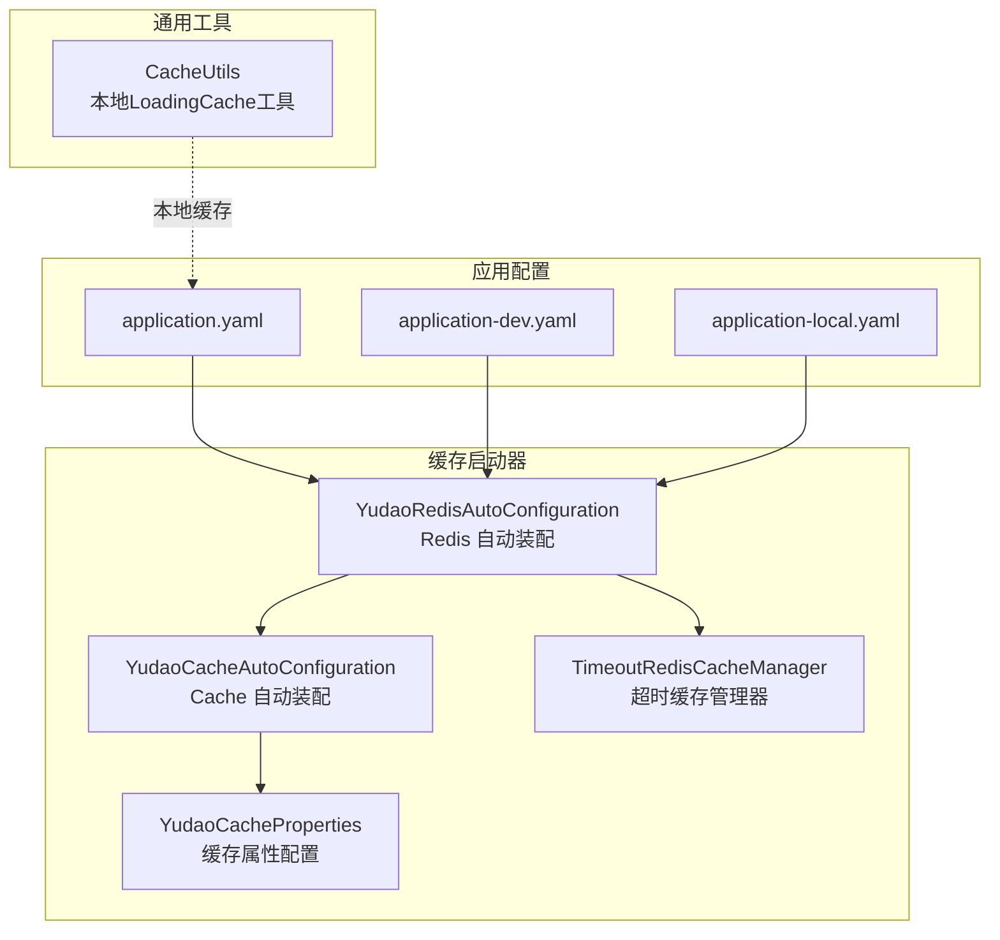
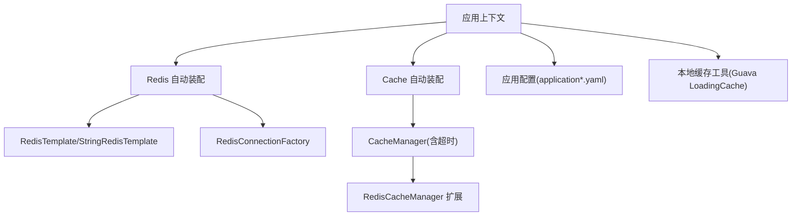
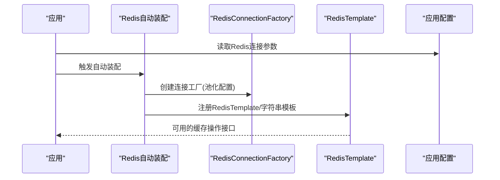
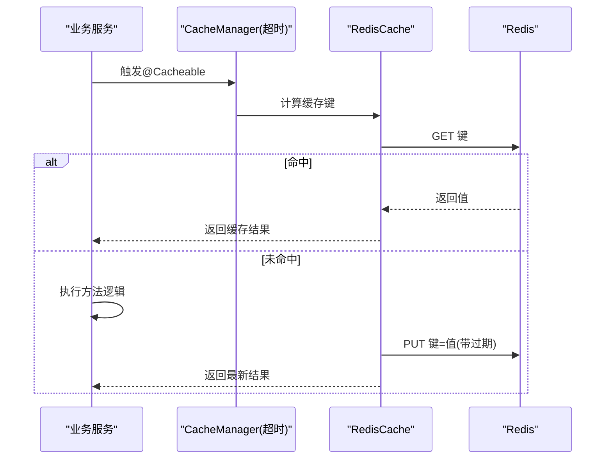
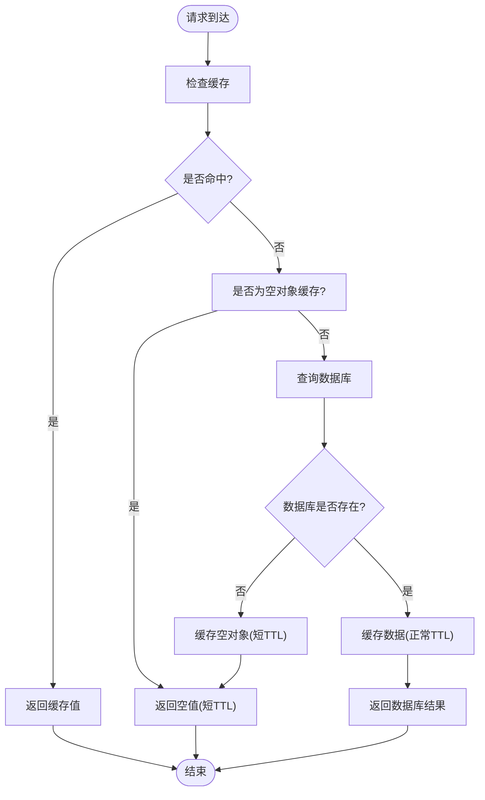
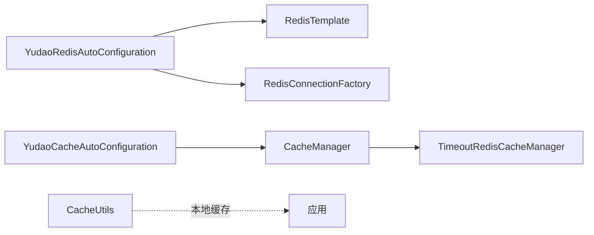

# 缓存系统

<cite>
**本文引用的文件**
- [YudaoRedisAutoConfiguration.java](file://yudao-framework/yudao-spring-boot-starter-redis/src/main/java/cn/iocoder/yudao/framework/redis/config/YudaoRedisAutoConfiguration.java)
- [YudaoCacheAutoConfiguration.java](file://yudao-framework/yudao-spring-boot-starter-redis/src/main/java/cn/iocoder/yudao/framework/redis/config/YudaoCacheAutoConfiguration.java)
- [YudaoCacheProperties.java](file://yudao-framework/yudao-spring-boot-starter-redis/src/main/java/cn/iocoder/yudao/framework/redis/config/YudaoCacheProperties.java)
- [TimeoutRedisCacheManager.java](file://yudao-framework/yudao-spring-boot-starter-redis/src/main/java/cn/iocoder/yudao/framework/redis/core/TimeoutRedisCacheManager.java)
- [CacheUtils.java](file://yudao-framework/yudao-common/src/main/java/cn/iocoder/yudao/framework/common/util/cache/CacheUtils.java)
- [application.yaml](file://yudao-server/src/main/resources/application.yaml)
- [application-dev.yaml](file://yudao-server/src/main/resources/application-dev.yaml)
- [application-local.yaml](file://yudao-server/src/main/resources/application-local.yaml)
</cite>

## 目录
1. [简介](#简介)
2. [项目结构](#项目结构)
3. [核心组件](#核心组件)
4. [架构总览](#架构总览)
5. [详细组件分析](#详细组件分析)
6. [依赖分析](#依赖分析)
7. [性能考虑](#性能考虑)
8. [故障排查指南](#故障排查指南)
9. [结论](#结论)
10. [附录](#附录)

## 简介
本文件系统性梳理项目中缓存体系的设计与实现，重点覆盖以下方面：
- Redis 集成与配置：连接配置、序列化方式、连接池设置
- Spring Cache 注解使用：@Cacheable、@CacheEvict、@CachePut 等的配置与典型场景
- 分布式缓存设计模式：缓存穿透、缓存击穿、缓存雪崩的解决方案
- 缓存策略制定：更新策略、过期时间、缓存预热
- 性能优化实践：命中率提升、内存使用优化、缓存一致性
- Redisson 分布式对象与并发工具的使用方法

## 项目结构
缓存相关能力主要由 yudao-spring-boot-starter-redis 提供自动装配与管理器扩展，并在 yudao-server 的应用配置中启用与调优；通用本地缓存工具位于 yudao-common。

**图表来源**
- [YudaoRedisAutoConfiguration.java:1-200](file://yudao-framework/yudao-spring-boot-starter-redis/src/main/java/cn/iocoder/yudao/framework/redis/config/YudaoRedisAutoConfiguration.java#L1-L200)
- [YudaoCacheAutoConfiguration.java:1-200](file://yudao-framework/yudao-spring-boot-starter-redis/src/main/java/cn/iocoder/yudao/framework/redis/config/YudaoCacheAutoConfiguration.java#L1-L200)
- [YudaoCacheProperties.java:1-200](file://yudao-framework/yudao-spring-boot-starter-redis/src/main/java/cn/iocoder/yudao/framework/redis/config/YudaoCacheProperties.java#L1-L200)
- [TimeoutRedisCacheManager.java:1-200](file://yudao-framework/yudao-spring-boot-starter-redis/src/main/java/cn/iocoder/yudao/framework/redis/core/TimeoutRedisCacheManager.java#L1-L200)
- [application.yaml:1-200](file://yudao-server/src/main/resources/application.yaml#L1-L200)
- [application-dev.yaml:1-200](file://yudao-server/src/main/resources/application-dev.yaml#L1-L200)
- [application-local.yaml:1-200](file://yudao-server/src/main/resources/application-local.yaml#L1-L200)
- [CacheUtils.java:1-120](file://yudao-framework/yudao-common/src/main/java/cn/iocoder/yudao/framework/common/util/cache/CacheUtils.java#L1-L120)

**章节来源**
- [YudaoRedisAutoConfiguration.java:1-200](file://yudao-framework/yudao-spring-boot-starter-redis/src/main/java/cn/iocoder/yudao/framework/redis/config/YudaoRedisAutoConfiguration.java#L1-L200)
- [YudaoCacheAutoConfiguration.java:1-200](file://yudao-framework/yudao-spring-boot-starter-redis/src/main/java/cn/iocoder/yudao/framework/redis/config/YudaoCacheAutoConfiguration.java#L1-L200)
- [YudaoCacheProperties.java:1-200](file://yudao-framework/yudao-spring-boot-starter-redis/src/main/java/cn/iocoder/yudao/framework/redis/config/YudaoCacheProperties.java#L1-L200)
- [TimeoutRedisCacheManager.java:1-200](file://yudao-framework/yudao-spring-boot-starter-redis/src/main/java/cn/iocoder/yudao/framework/redis/core/TimeoutRedisCacheManager.java#L1-L200)
- [application.yaml:1-200](file://yudao-server/src/main/resources/application.yaml#L1-L200)
- [application-dev.yaml:1-200](file://yudao-server/src/main/resources/application-dev.yaml#L1-L200)
- [application-local.yaml:1-200](file://yudao-server/src/main/resources/application-local.yaml#L1-L200)
- [CacheUtils.java:1-120](file://yudao-framework/yudao-common/src/main/java/cn/iocoder/yudao/framework/common/util/cache/CacheUtils.java#L1-L120)

## 核心组件
- Redis 自动装配：负责构建 Redis 连接工厂、RedisTemplate、StringRedisTemplate、RedisConnectionFactory 等核心 Bean，并支持自定义序列化策略与连接池参数。
- Cache 自动装配：提供基于 Spring Cache 的统一管理器扩展，支持超时控制与命名空间隔离。
- 缓存属性配置：集中管理缓存相关的配置项，如过期时间、容量限制等。
- 超时缓存管理器：在默认缓存管理器基础上增加超时控制能力，避免缓存无限存在。
- 本地缓存工具：提供基于 Guava 的 LoadingCache，支持异步刷新与最大容量控制，适用于轻量级本地缓存场景。

**章节来源**
- [YudaoRedisAutoConfiguration.java:1-200](file://yudao-framework/yudao-spring-boot-starter-redis/src/main/java/cn/iocoder/yudao/framework/redis/config/YudaoRedisAutoConfiguration.java#L1-L200)
- [YudaoCacheAutoConfiguration.java:1-200](file://yudao-framework/yudao-spring-boot-starter-redis/src/main/java/cn/iocoder/yudao/framework/redis/config/YudaoCacheAutoConfiguration.java#L1-L200)
- [YudaoCacheProperties.java:1-200](file://yudao-framework/yudao-spring-boot-starter-redis/src/main/java/cn/iocoder/yudao/framework/redis/config/YudaoCacheProperties.java#L1-L200)
- [TimeoutRedisCacheManager.java:1-200](file://yudao-framework/yudao-spring-boot-starter-redis/src/main/java/cn/iocoder/yudao/framework/redis/core/TimeoutRedisCacheManager.java#L1-L200)
- [CacheUtils.java:1-120](file://yudao-framework/yudao-common/src/main/java/cn/iocoder/yudao/framework/common/util/cache/CacheUtils.java#L1-L120)

## 架构总览
整体架构围绕“自动装配 + 管理器扩展 + 应用配置”的分层设计展开，既满足 Redis 远程缓存需求，又兼顾本地缓存与超时控制。

**图表来源**
- [YudaoRedisAutoConfiguration.java:1-200](file://yudao-framework/yudao-spring-boot-starter-redis/src/main/java/cn/iocoder/yudao/framework/redis/config/YudaoRedisAutoConfiguration.java#L1-L200)
- [YudaoCacheAutoConfiguration.java:1-200](file://yudao-framework/yudao-spring-boot-starter-redis/src/main/java/cn/iocoder/yudao/framework/redis/config/YudaoCacheAutoConfiguration.java#L1-L200)
- [TimeoutRedisCacheManager.java:1-200](file://yudao-framework/yudao-spring-boot-starter-redis/src/main/java/cn/iocoder/yudao/framework/redis/core/TimeoutRedisCacheManager.java#L1-L200)
- [application.yaml:1-200](file://yudao-server/src/main/resources/application.yaml#L1-L200)
- [CacheUtils.java:1-120](file://yudao-framework/yudao-common/src/main/java/cn/iocoder/yudao/framework/common/util/cache/CacheUtils.java#L1-L120)

## 详细组件分析

### Redis 配置与连接
- 连接配置：通过应用配置文件设置 Redis 地址、端口、密码、数据库索引、超时时间等基础连接参数。
- 序列化方式：自动装配中提供 RedisTemplate 与 StringRedisTemplate，默认采用 JDK 序列化或 JSON 序列化策略，确保键值对的正确存储与读取。
- 连接池设置：自动装配中配置 Lettuce 连接池参数（如最小空闲连接、最大空闲连接、最大连接数、连接超时等），以提升连接复用与稳定性。

**图表来源**
- [YudaoRedisAutoConfiguration.java:1-200](file://yudao-framework/yudao-spring-boot-starter-redis/src/main/java/cn/iocoder/yudao/framework/redis/config/YudaoRedisAutoConfiguration.java#L1-L200)
- [application.yaml:1-200](file://yudao-server/src/main/resources/application.yaml#L1-L200)
- [application-dev.yaml:1-200](file://yudao-server/src/main/resources/application-dev.yaml#L1-L200)
- [application-local.yaml:1-200](file://yudao-server/src/main/resources/application-local.yaml#L1-L200)

**章节来源**
- [YudaoRedisAutoConfiguration.java:1-200](file://yudao-framework/yudao-spring-boot-starter-redis/src/main/java/cn/iocoder/yudao/framework/redis/config/YudaoRedisAutoConfiguration.java#L1-L200)
- [application.yaml:1-200](file://yudao-server/src/main/resources/application.yaml#L1-L200)
- [application-dev.yaml:1-200](file://yudao-server/src/main/resources/application-dev.yaml#L1-L200)
- [application-local.yaml:1-200](file://yudao-server/src/main/resources/application-local.yaml#L1-L200)

### Spring Cache 注解与管理器
- Cache 管理器扩展：在默认 CacheManager 基础上引入超时控制，避免缓存长期驻留导致的数据陈旧问题。
- 注解使用场景：
  - @Cacheable：用于查询型接口，先查缓存，未命中则执行方法并将结果写入缓存。
  - @CacheEvict：用于删除型接口，清除指定缓存键或清空整个缓存集合。
  - @CachePut：用于更新型接口，直接写入缓存并返回方法结果，不参与条件判断。
- 命名空间与键生成：结合 KeyGenerator 与缓存前缀，确保多模块共享缓存时的键冲突避免。

**图表来源**
- [YudaoCacheAutoConfiguration.java:1-200](file://yudao-framework/yudao-spring-boot-starter-redis/src/main/java/cn/iocoder/yudao/framework/redis/config/YudaoCacheAutoConfiguration.java#L1-L200)
- [TimeoutRedisCacheManager.java:1-200](file://yudao-framework/yudao-spring-boot-starter-redis/src/main/java/cn/iocoder/yudao/framework/redis/core/TimeoutRedisCacheManager.java#L1-L200)

**章节来源**
- [YudaoCacheAutoConfiguration.java:1-200](file://yudao-framework/yudao-spring-boot-starter-redis/src/main/java/cn/iocoder/yudao/framework/redis/config/YudaoCacheAutoConfiguration.java#L1-L200)
- [TimeoutRedisCacheManager.java:1-200](file://yudao-framework/yudao-spring-boot-starter-redis/src/main/java/cn/iocoder/yudao/framework/redis/core/TimeoutRedisCacheManager.java#L1-L200)

### 分布式缓存设计模式与防护
- 缓存穿透：查询不存在的数据，未命中且无缓存。解决思路：缓存空对象并设置短 TTL；布隆过滤器提前拦截无效请求。
- 缓存击穿：热点 Key 突发失效。解决思路：热点 Key 永不过期或单飞互斥锁；后台异步刷新。
- 缓存雪崩：大量 Key 同时过期。解决思路：TTL 加随机抖动；多级缓存（本地+远程）；限流降载。

**图表来源**
- [YudaoRedisAutoConfiguration.java:1-200](file://yudao-framework/yudao-spring-boot-starter-redis/src/main/java/cn/iocoder/yudao/framework/redis/config/YudaoRedisAutoConfiguration.java#L1-L200)
- [YudaoCacheAutoConfiguration.java:1-200](file://yudao-framework/yudao-spring-boot-starter-redis/src/main/java/cn/iocoder/yudao/framework/redis/config/YudaoCacheAutoConfiguration.java#L1-L200)

**章节来源**
- [YudaoRedisAutoConfiguration.java:1-200](file://yudao-framework/yudao-spring-boot-starter-redis/src/main/java/cn/iocoder/yudao/framework/redis/config/YudaoRedisAutoConfiguration.java#L1-L200)
- [YudaoCacheAutoConfiguration.java:1-200](file://yudao-framework/yudao-spring-boot-starter-redis/src/main/java/cn/iocoder/yudao/framework/redis/config/YudaoCacheAutoConfiguration.java#L1-L200)

### 缓存策略制定
- 更新策略：写时更新/失效（Write-Through/Write-Behind）结合缓存键版本号；或采用延迟双删策略降低不一致窗口。
- 过期时间：热点数据永不过期或长 TTL；非热点数据短 TTL 并加抖动；空对象短 TTL。
- 缓存预热：启动阶段批量加载热点键；定时任务周期性刷新；异步监听数据库变更事件触发缓存更新。

**章节来源**
- [YudaoCacheAutoConfiguration.java:1-200](file://yudao-framework/yudao-spring-boot-starter-redis/src/main/java/cn/iocoder/yudao/framework/redis/config/YudaoCacheAutoConfiguration.java#L1-L200)
- [TimeoutRedisCacheManager.java:1-200](file://yudao-framework/yudao-spring-boot-starter-redis/src/main/java/cn/iocoder/yudao/framework/redis/core/TimeoutRedisCacheManager.java#L1-L200)

### 性能优化实践
- 命中率提升：合理划分命名空间、规范键生成规则、避免大对象与大集合频繁读写；对热点数据做本地缓存兜底。
- 内存使用优化：设置最大容量与淘汰策略；对大字段拆分存储；定期清理僵尸键。
- 缓存一致性：结合分布式锁与消息队列，确保写扩散期间的一致性；对强一致场景采用直连数据库或最终一致性策略。

**章节来源**
- [CacheUtils.java:1-120](file://yudao-framework/yudao-common/src/main/java/cn/iocoder/yudao/framework/common/util/cache/CacheUtils.java#L1-L120)
- [YudaoRedisAutoConfiguration.java:1-200](file://yudao-framework/yudao-spring-boot-starter-redis/src/main/java/cn/iocoder/yudao/framework/redis/config/YudaoRedisAutoConfiguration.java#L1-L200)

### Redisson 分布式对象与并发工具
- 分布式对象：RMap、RSet、RList、RScoredSortedSet 等，适合跨节点共享的集合类缓存。
- 并发工具：RLock（分布式锁）、RCountDownLatch（计数闭锁）、RSemaphore（信号量）等，用于缓存更新过程中的互斥与协调。
- 使用建议：优先使用本地缓存作为第一层，Redis 作为第二层；对高并发写入场景配合 Redisson 分布式锁，避免惊群与脏写。

**章节来源**
- [YudaoRedisAutoConfiguration.java:1-200](file://yudao-framework/yudao-spring-boot-starter-redis/src/main/java/cn/iocoder/yudao/framework/redis/config/YudaoRedisAutoConfiguration.java#L1-L200)

## 依赖分析
- 组件内聚与耦合：Redis 自动装配与 Cache 自动装配相互独立但共同服务于缓存层；管理器扩展对默认实现进行增强而非替换。
- 外部依赖：Lettuce 连接池、Guava LoadingCache、Spring Cache、Redis 服务器。
- 潜在循环依赖：当前结构为单向依赖（配置 -> 自动装配 -> Bean），未见循环依赖迹象。

**图表来源**
- [YudaoRedisAutoConfiguration.java:1-200](file://yudao-framework/yudao-spring-boot-starter-redis/src/main/java/cn/iocoder/yudao/framework/redis/config/YudaoRedisAutoConfiguration.java#L1-L200)
- [YudaoCacheAutoConfiguration.java:1-200](file://yudao-framework/yudao-spring-boot-starter-redis/src/main/java/cn/iocoder/yudao/framework/redis/config/YudaoCacheAutoConfiguration.java#L1-L200)
- [TimeoutRedisCacheManager.java:1-200](file://yudao-framework/yudao-spring-boot-starter-redis/src/main/java/cn/iocoder/yudao/framework/redis/core/TimeoutRedisCacheManager.java#L1-L200)
- [CacheUtils.java:1-120](file://yudao-framework/yudao-common/src/main/java/cn/iocoder/yudao/framework/common/util/cache/CacheUtils.java#L1-L120)

**章节来源**
- [YudaoRedisAutoConfiguration.java:1-200](file://yudao-framework/yudao-spring-boot-starter-redis/src/main/java/cn/iocoder/yudao/framework/redis/config/YudaoRedisAutoConfiguration.java#L1-L200)
- [YudaoCacheAutoConfiguration.java:1-200](file://yudao-framework/yudao-spring-boot-starter-redis/src/main/java/cn/iocoder/yudao/framework/redis/config/YudaoCacheAutoConfiguration.java#L1-L200)
- [TimeoutRedisCacheManager.java:1-200](file://yudao-framework/yudao-spring-boot-starter-redis/src/main/java/cn/iocoder/yudao/framework/redis/core/TimeoutRedisCacheManager.java#L1-L200)
- [CacheUtils.java:1-120](file://yudao-framework/yudao-common/src/main/java/cn/iocoder/yudao/framework/common/util/cache/CacheUtils.java#L1-L120)

## 性能考虑
- 连接池参数：根据 QPS 与实例规格调整最大连接数、空闲连接、连接超时；开启公平锁与优雅关闭。
- 序列化策略：优先 JSON 序列化，避免 JDK 序列化带来的类版本问题；对大对象采用压缩或分片存储。
- 命中率优化：热点键本地缓存 + 远程缓存双写；对冷数据设置短 TTL 并定期淘汰。
- 内存与网络：合理设置过期时间与最大内存，避免 OOM；在网络抖动场景下增加重试与熔断。

[本节为通用指导，无需特定文件引用]

## 故障排查指南
- 连接失败：检查应用配置中的 Redis 地址、端口、密码；确认网络连通性与防火墙策略。
- 序列化异常：核对 RedisTemplate 的序列化配置与实体类的兼容性；必要时切换为 JSON 序列化。
- 缓存不生效：确认 @Cacheable/@CacheEvict/@CachePut 的 key 生成规则与缓存管理器配置；检查命名空间前缀是否一致。
- 命中率低：使用慢查询日志定位热点键；评估 TTL 设置与本地缓存策略；检查是否存在大对象频繁读写。
- 一致性问题：排查分布式锁使用是否正确；确认写扩散流程与消息投递是否成功。

**章节来源**
- [YudaoRedisAutoConfiguration.java:1-200](file://yudao-framework/yudao-spring-boot-starter-redis/src/main/java/cn/iocoder/yudao/framework/redis/config/YudaoRedisAutoConfiguration.java#L1-L200)
- [YudaoCacheAutoConfiguration.java:1-200](file://yudao-framework/yudao-spring-boot-starter-redis/src/main/java/cn/iocoder/yudao/framework/redis/config/YudaoCacheAutoConfiguration.java#L1-L200)
- [TimeoutRedisCacheManager.java:1-200](file://yudao-framework/yudao-spring-boot-starter-redis/src/main/java/cn/iocoder/yudao/framework/redis/core/TimeoutRedisCacheManager.java#L1-L200)

## 结论
本项目通过“自动装配 + 管理器扩展 + 应用配置”的架构实现了稳定高效的缓存体系。Redis 连接、序列化与连接池均在自动装配中完成统一配置；Spring Cache 注解与超时管理器提供了清晰的缓存语义与生命周期控制；本地缓存工具与 Redisson 则分别满足了轻量本地缓存与分布式并发控制的需求。结合合理的缓存策略与性能优化手段，可在高并发场景下获得良好的吞吐与一致性表现。

[本节为总结性内容，无需特定文件引用]

## 附录
- 关键配置项参考：
  - Redis 连接：地址、端口、密码、数据库索引、超时
  - 连接池：最大连接数、最小/最大空闲连接、连接超时
  - 序列化：JSON/JDK 序列化策略选择
  - 缓存：TTL、命名空间、键生成规则
- 常用注解与职责：
  - @Cacheable：查询缓存
  - @CacheEvict：删除缓存
  - @CachePut：更新缓存

**章节来源**
- [application.yaml:1-200](file://yudao-server/src/main/resources/application.yaml#L1-L200)
- [application-dev.yaml:1-200](file://yudao-server/src/main/resources/application-dev.yaml#L1-L200)
- [application-local.yaml:1-200](file://yudao-server/src/main/resources/application-local.yaml#L1-L200)
- [YudaoRedisAutoConfiguration.java:1-200](file://yudao-framework/yudao-spring-boot-starter-redis/src/main/java/cn/iocoder/yudao/framework/redis/config/YudaoRedisAutoConfiguration.java#L1-L200)
- [YudaoCacheAutoConfiguration.java:1-200](file://yudao-framework/yudao-spring-boot-starter-redis/src/main/java/cn/iocoder/yudao/framework/redis/config/YudaoCacheAutoConfiguration.java#L1-L200)