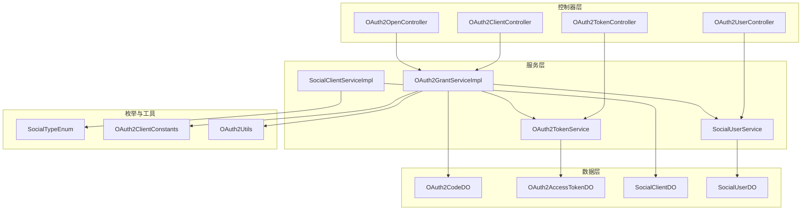
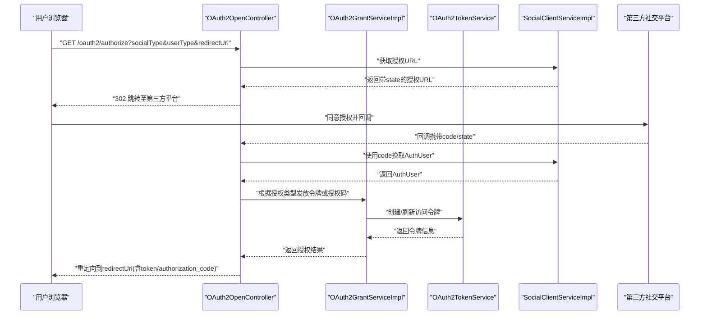
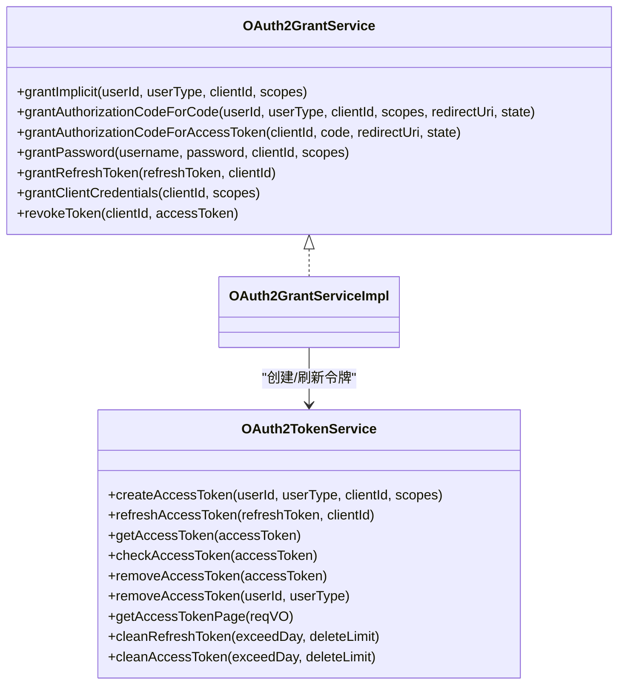
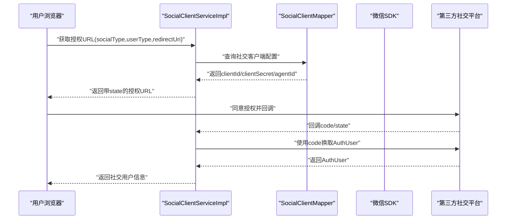
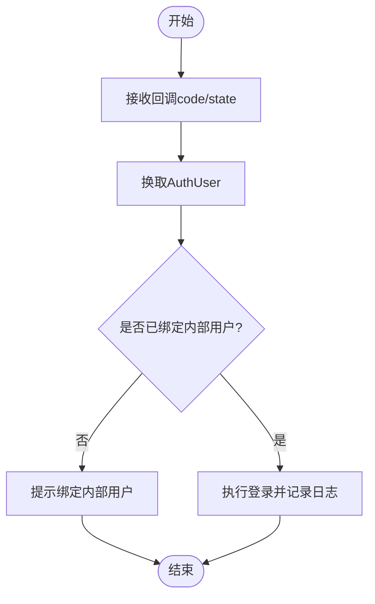
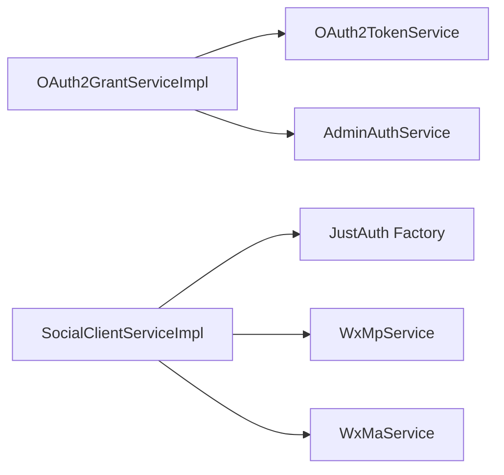

# OAuth2第三方集成

<cite>
**本文引用的文件**
- [OAuth2ClientConstants.java](file://yudao-module-system/src/main/java/cn/iocoder/yudao/module/system/enums/oauth2/OAuth2ClientConstants.java)
- [AdminAuthServiceImpl.java](file://yudao-module-system/src/main/java/cn/iocoder/yudao/module/system/service/auth/AdminAuthServiceImpl.java)
- [SocialClientServiceImpl.java](file://yudao-module-system/src/main/java/cn/iocoder/yudao/module/system/service/social/SocialClientServiceImpl.java)
- [SocialUserService.java](file://yudao-module-system/src/main/java/cn/iocoder/yudao/module/system/service/social/SocialUserService.java)
- [OAuth2GrantService.java](file://yudao-module-system/src/main/java/cn/iocoder/yudao/module/system/service/oauth2/OAuth2GrantService.java)
- [OAuth2GrantServiceImpl.java](file://yudao-module-system/src/main/java/cn/iocoder/yudao/module/system/service/oauth2/OAuth2GrantServiceImpl.java)
- [OAuth2TokenService.java](file://yudao-module-system/src/main/java/cn/iocoder/yudao/module/system/service/oauth2/OAuth2TokenService.java)
- [OAuth2Utils.java](file://yudao-module-system/src/main/java/cn/iocoder/yudao/module/system/util/oauth2/OAuth2Utils.java)
- [SocialTypeEnum.java](file://yudao-module-system/src/main/java/cn/iocoder/yudao/module/system/enums/social/SocialTypeEnum.java)
- [OAuth2ClientApiImpl.java](file://yudao-module-system/src/main/java/cn/iocoder/yudao/module/system/api/social/SocialClientApiImpl.java)
- [OAuth2TokenApiImpl.java](file://yudao-module-system/src/main/java/cn/iocoder/yudao/module/system/api/oauth2/OAuth2TokenApiImpl.java)
- [OAuth2ClientController.java](file://yudao-module-system/src/main/java/cn/iocoder/yudao/module/system/controller/admin/oauth2/OAuth2ClientController.java)
- [OAuth2OpenController.java](file://yudao-module-system/src/main/java/cn/iocoder/yudao/module/system/controller/admin/oauth2/OAuth2OpenController.java)
- [OAuth2TokenController.java](file://yudao-module-system/src/main/java/cn/iocoder/yudao/module/system/controller/admin/oauth2/OAuth2TokenController.java)
- [OAuth2UserController.java](file://yudao-module-system/src/main/java/cn/iocoder/yudao/module/system/controller/admin/oauth2/OAuth2UserController.java)
- [AuthSocialLoginReqVO.java](file://yudao-module-system/src/main/java/cn/iocoder/yudao/module/system/controller/admin/auth/vo/AuthSocialLoginReqVO.java)
- [OAuth2AccessTokenCheckRespDTO.java](file://yudao-framework/yudao-common/src/main/java/cn/iocoder/yudao/framework/common/biz/system/oauth2/dto/OAuth2AccessTokenCheckRespDTO.java)
- [OAuth2AccessTokenCreateReqDTO.java](file://yudao-framework/yudao-common/src/main/java/cn/iocoder/yudao/framework/common/biz/system/oauth2/dto/OAuth2AccessTokenCreateReqDTO.java)
- [OAuth2AccessTokenRespDTO.java](file://yudao-framework/yudao-common/src/main/java/cn/iocoder/yudao/framework/common/biz/system/oauth2/dto/OAuth2AccessTokenRespDTO.java)
</cite>

## 目录
1. [引言](#引言)
2. [项目结构](#项目结构)
3. [核心组件](#核心组件)
4. [架构总览](#架构总览)
5. [详细组件分析](#详细组件分析)
6. [依赖分析](#依赖分析)
7. [性能考虑](#性能考虑)
8. [故障排查指南](#故障排查指南)
9. [结论](#结论)
10. [附录](#附录)

## 引言
本文件面向“OAuth2第三方集成”模块，系统化阐述OAuth2协议在本项目中的实现与落地，涵盖授权码模式、简化模式、密码模式、客户端凭证模式等授权类型的适用场景与控制流；同时给出微信、钉钉、企业微信等主流第三方平台的集成方式与关键配置步骤，说明OAuth2与系统内部用户的映射机制（绑定、信息同步、权限继承）、安全策略（重放攻击防护、CSRF防护、Token安全存储），以及配置示例与常见问题处理。

## 项目结构
围绕OAuth2与社交登录，系统采用“控制器-服务-数据对象-枚举-工具”的分层组织：
- 控制器层：提供OAuth2客户端、开放接口、令牌、用户相关接口
- 服务层：OAuth2授权与令牌服务、社交客户端与社交用户服务
- 数据层：OAuth2授权码、访问令牌、社交客户端、社交用户等DO
- 枚举与常量：社交平台类型、OAuth2客户端默认常量
- 工具：OAuth2工具类（如构建简化模式重定向URI）

图表来源
- [OAuth2ClientController.java](file://yudao-module-system/src/main/java/cn/iocoder/yudao/module/system/controller/admin/oauth2/OAuth2ClientController.java)
- [OAuth2OpenController.java](file://yudao-module-system/src/main/java/cn/iocoder/yudao/module/system/controller/admin/oauth2/OAuth2OpenController.java)
- [OAuth2TokenController.java](file://yudao-module-system/src/main/java/cn/iocoder/yudao/module/system/controller/admin/oauth2/OAuth2TokenController.java)
- [OAuth2UserController.java](file://yudao-module-system/src/main/java/cn/iocoder/yudao/module/system/controller/admin/oauth2/OAuth2UserController.java)
- [OAuth2GrantServiceImpl.java](file://yudao-module-system/src/main/java/cn/iocoder/yudao/module/system/service/oauth2/OAuth2GrantServiceImpl.java)
- [OAuth2TokenService.java](file://yudao-module-system/src/main/java/cn/iocoder/yudao/module/system/service/oauth2/OAuth2TokenService.java)
- [SocialClientServiceImpl.java](file://yudao-module-system/src/main/java/cn/iocoder/yudao/module/system/service/social/SocialClientServiceImpl.java)
- [SocialUserService.java](file://yudao-module-system/src/main/java/cn/iocoder/yudao/module/system/service/social/SocialUserService.java)
- [OAuth2CodeService.java](file://yudao-module-system/src/main/java/cn/iocoder/yudao/module/system/service/oauth2/OAuth2CodeService.java)

章节来源
- [OAuth2ClientController.java](file://yudao-module-system/src/main/java/cn/iocoder/yudao/module/system/controller/admin/oauth2/OAuth2ClientController.java)
- [OAuth2OpenController.java](file://yudao-module-system/src/main/java/cn/iocoder/yudao/module/system/controller/admin/oauth2/OAuth2OpenController.java)
- [OAuth2TokenController.java](file://yudao-module-system/src/main/java/cn/iocoder/yudao/module/system/controller/admin/oauth2/OAuth2TokenController.java)
- [OAuth2UserController.java](file://yudao-module-system/src/main/java/cn/iocoder/yudao/module/system/controller/admin/oauth2/OAuth2UserController.java)

## 核心组件
- OAuth2授权服务：负责授权码、简化、密码、客户端凭证、刷新令牌等授权流程
- OAuth2令牌服务：负责访问令牌创建、刷新、校验、撤销、清理
- 社交客户端服务：封装JustAuth与微信SDK，统一社交平台授权入口与配置覆盖
- 社交用户服务：提供社交用户绑定、解绑、按code获取社交用户等能力
- OAuth2工具类：构建简化模式重定向URI等

章节来源
- [OAuth2GrantService.java](file://yudao-module-system/src/main/java/cn/iocoder/yudao/module/system/service/oauth2/OAuth2GrantService.java)
- [OAuth2GrantServiceImpl.java](file://yudao-module-system/src/main/java/cn/iocoder/yudao/module/system/service/oauth2/OAuth2GrantServiceImpl.java)
- [OAuth2TokenService.java](file://yudao-module-system/src/main/java/cn/iocoder/yudao/module/system/service/oauth2/OAuth2TokenService.java)
- [SocialClientServiceImpl.java](file://yudao-module-system/src/main/java/cn/iocoder/yudao/module/system/service/social/SocialClientServiceImpl.java)
- [SocialUserService.java](file://yudao-module-system/src/main/java/cn/iocoder/yudao/module/system/service/social/SocialUserService.java)
- [OAuth2Utils.java](file://yudao-module-system/src/main/java/cn/iocoder/yudao/module/system/util/oauth2/OAuth2Utils.java)

## 架构总览
系统通过“社交授权入口 + OAuth2授权与令牌服务 + 内部用户映射”的链路完成第三方登录闭环。社交平台授权由JustAuth统一抽象，微信公众号/小程序由wx-java SDK对接；OAuth2授权与令牌服务独立于Spring Security，自研实现以适配多租户与多用户类型。

图表来源
- [OAuth2OpenController.java](file://yudao-module-system/src/main/java/cn/iocoder/yudao/module/system/controller/admin/oauth2/OAuth2OpenController.java)
- [OAuth2GrantServiceImpl.java](file://yudao-module-system/src/main/java/cn/iocoder/yudao/module/system/service/oauth2/OAuth2GrantServiceImpl.java)
- [OAuth2TokenService.java](file://yudao-module-system/src/main/java/cn/iocoder/yudao/module/system/service/oauth2/OAuth2TokenService.java)
- [SocialClientServiceImpl.java](file://yudao-module-system/src/main/java/cn/iocoder/yudao/module/system/service/social/SocialClientServiceImpl.java)

## 详细组件分析

### OAuth2授权与令牌服务
- 授权类型支持
  - 授权码模式：两阶段，先生成授权码，再用授权码换取访问令牌
  - 简化模式：直接返回访问令牌（隐式授权）
  - 密码模式：用户名+密码登录后发放令牌
  - 客户端凭证模式：仅客户端身份验证，用于服务间调用
  - 刷新令牌：使用refresh_token刷新访问令牌
- 关键校验
  - 授权码换取令牌时，校验clientId、redirectUri、state一致性
  - 撤销令牌时，确保clientId匹配
- 令牌操作
  - 创建、刷新、校验、撤销、按用户批量清理、定时清理过期令牌

图表来源
- [OAuth2GrantService.java](file://yudao-module-system/src/main/java/cn/iocoder/yudao/module/system/service/oauth2/OAuth2GrantService.java)
- [OAuth2GrantServiceImpl.java](file://yudao-module-system/src/main/java/cn/iocoder/yudao/module/system/service/oauth2/OAuth2GrantServiceImpl.java)
- [OAuth2TokenService.java](file://yudao-module-system/src/main/java/cn/iocoder/yudao/module/system/service/oauth2/OAuth2TokenService.java)

章节来源
- [OAuth2GrantServiceImpl.java](file://yudao-module-system/src/main/java/cn/iocoder/yudao/module/system/service/oauth2/OAuth2GrantServiceImpl.java)
- [OAuth2TokenService.java](file://yudao-module-system/src/main/java/cn/iocoder/yudao/module/system/service/oauth2/OAuth2TokenService.java)
- [OAuth2Utils.java](file://yudao-module-system/src/main/java/cn/iocoder/yudao/module/system/util/oauth2/OAuth2Utils.java)

### 社交客户端与社交用户服务
- 社交授权入口
  - 生成授权URL（自动拼接redirect_uri并生成state）
  - 使用code换取AuthUser（统一第三方返回结构）
- 配置覆盖
  - 优先使用数据库配置覆盖JustAuth默认配置（支持clientId、clientSecret、agentId、公钥等）
  - 微信公众号/小程序提供缓存化的WxMpService/WxMaService单例
- 微信生态扩展
  - JS-SDK签名、手机号解密、小程序码生成、订阅模板与消息、订单发货信息上传与确认收货通知
- 社交用户
  - 提供绑定/解绑、按userId/按code获取社交用户等能力

图表来源
- [SocialClientServiceImpl.java](file://yudao-module-system/src/main/java/cn/iocoder/yudao/module/system/service/social/SocialClientServiceImpl.java)
- [SocialTypeEnum.java](file://yudao-module-system/src/main/java/cn/iocoder/yudao/module/system/enums/social/SocialTypeEnum.java)

章节来源
- [SocialClientServiceImpl.java](file://yudao-module-system/src/main/java/cn/iocoder/yudao/module/system/service/social/SocialClientServiceImpl.java)
- [SocialUserService.java](file://yudao-module-system/src/main/java/cn/iocoder/yudao/module/system/service/social/SocialUserService.java)
- [SocialTypeEnum.java](file://yudao-module-system/src/main/java/cn/iocoder/yudao/module/system/enums/social/SocialTypeEnum.java)

### OAuth2与系统内部用户的映射机制
- 社交登录流程
  - 用户在第三方平台授权后回调，系统使用code换取AuthUser
  - 若已绑定内部用户，则直接登录；未绑定则提示需绑定
- 绑定与解绑
  - 绑定：将社交用户与内部用户建立关联
  - 解绑：解除关联，不影响第三方账户
- 权限继承
  - 登录成功后，按内部用户的角色与权限体系下发

图表来源
- [AdminAuthServiceImpl.java](file://yudao-module-system/src/main/java/cn/iocoder/yudao/module/system/service/auth/AdminAuthServiceImpl.java)
- [SocialUserService.java](file://yudao-module-system/src/main/java/cn/iocoder/yudao/module/system/service/social/SocialUserService.java)

章节来源
- [AdminAuthServiceImpl.java](file://yudao-module-system/src/main/java/cn/iocoder/yudao/module/system/service/auth/AdminAuthServiceImpl.java)
- [SocialUserService.java](file://yudao-module-system/src/main/java/cn/iocoder/yudao/module/system/service/social/SocialUserService.java)

### OAuth2开放接口与控制器
- 客户端管理：新增/更新/删除社交客户端配置
- 开放授权：生成授权URL、换取授权码/令牌
- 令牌管理：校验令牌、撤销令牌、分页查询
- 用户管理：OAuth2用户信息展示与更新

章节来源
- [OAuth2ClientController.java](file://yudao-module-system/src/main/java/cn/iocoder/yudao/module/system/controller/admin/oauth2/OAuth2ClientController.java)
- [OAuth2OpenController.java](file://yudao-module-system/src/main/java/cn/iocoder/yudao/module/system/controller/admin/oauth2/OAuth2OpenController.java)
- [OAuth2TokenController.java](file://yudao-module-system/src/main/java/cn/iocoder/yudao/module/system/controller/admin/oauth2/OAuth2TokenController.java)
- [OAuth2UserController.java](file://yudao-module-system/src/main/java/cn/iocoder/yudao/module/system/controller/admin/oauth2/OAuth2UserController.java)

## 依赖分析
- 组件耦合
  - OAuth2GrantServiceImpl依赖OAuth2TokenService与AdminAuthService，承担授权与令牌发放
  - SocialClientServiceImpl依赖JustAuth工厂与微信SDK，负责社交平台对接
- 外部依赖
  - JustAuth：统一社交平台授权
  - wx-java：微信公众号/小程序能力
- 潜在风险
  - 配置覆盖逻辑需确保字段完整性（clientId/clientSecret/agentId/publicKey）
  - 微信SDK实例缓存需避免并发更新导致的配置不一致

图表来源
- [OAuth2GrantServiceImpl.java](file://yudao-module-system/src/main/java/cn/iocoder/yudao/module/system/service/oauth2/OAuth2GrantServiceImpl.java)
- [SocialClientServiceImpl.java](file://yudao-module-system/src/main/java/cn/iocoder/yudao/module/system/service/social/SocialClientServiceImpl.java)

章节来源
- [OAuth2GrantServiceImpl.java](file://yudao-module-system/src/main/java/cn/iocoder/yudao/module/system/service/oauth2/OAuth2GrantServiceImpl.java)
- [SocialClientServiceImpl.java](file://yudao-module-system/src/main/java/cn/iocoder/yudao/module/system/service/social/SocialClientServiceImpl.java)

## 性能考虑
- 授权码模式
  - 授权码有效期短、一次性使用，建议缩短存储有效期并及时消费
- 简化模式
  - 直接返回访问令牌，适合公共客户端且需降低交互复杂度的场景
- 令牌缓存
  - 建议在网关或鉴权层对频繁校验的令牌做本地缓存，减少后端查询
- 微信SDK
  - 使用缓存化的WxMpService/WxMaService单例，避免重复初始化带来的开销

## 故障排查指南
- 授权失败
  - 检查redirect_uri与state是否与回调一致
  - 确认社交客户端配置（clientId/clientSecret/agentId）正确
- 令牌校验失败
  - 核对令牌是否过期、是否被撤销
  - 确认调用方clientId与令牌绑定一致
- 微信相关
  - JS-SDK签名失败：检查域名白名单与url参数
  - 手机号解密失败：确认phoneCode有效且在有效期内
  - 订单发货信息上传失败：关注“支付单不存在”错误并按重试策略处理

章节来源
- [OAuth2GrantServiceImpl.java](file://yudao-module-system/src/main/java/cn/iocoder/yudao/module/system/service/oauth2/OAuth2GrantServiceImpl.java)
- [SocialClientServiceImpl.java](file://yudao-module-system/src/main/java/cn/iocoder/yudao/module/system/service/social/SocialClientServiceImpl.java)

## 结论
本模块通过JustAuth与微信SDK实现了对主流第三方平台的统一封装，结合自研OAuth2授权与令牌服务，提供了完整的第三方登录闭环。通过社交用户绑定与内部用户映射，可灵活承接不同业务场景下的用户体系与权限模型。配合完善的校验与安全策略，能够满足生产环境对安全性与稳定性的要求。

## 附录

### OAuth2授权类型与适用场景
- 授权码模式
  - 场景：Web应用、移动App（含H5）等
  - 特点：安全性高，适合有后端的服务端交换令牌
- 简化模式
  - 场景：纯前端应用、移动端直连
  - 特点：无需后端参与，但仅返回访问令牌
- 密码模式
  - 场景：信任度极高的内部系统
  - 特点：直接使用用户名密码换取令牌
- 客户端凭证模式
  - 场景：服务间调用、无用户上下文
  - 特点：仅客户端身份验证
- 刷新令牌
  - 场景：长期有效令牌续期
  - 特点：安全地延长会话有效期

章节来源
- [OAuth2GrantServiceImpl.java](file://yudao-module-system/src/main/java/cn/iocoder/yudao/module/system/service/oauth2/OAuth2GrantServiceImpl.java)
- [OAuth2Utils.java](file://yudao-module-system/src/main/java/cn/iocoder/yudao/module/system/util/oauth2/OAuth2Utils.java)

### 第三方平台集成要点（微信/钉钉/企业微信）
- AppID与回调地址
  - 在各平台注册应用，获取AppID/AppSecret
  - 回调地址需与系统配置一致，且与授权URL中的redirect_uri匹配
- 微信公众号
  - 配置JS-SDK安全域名、授权回调域
  - 使用WxMpService进行JS-SDK签名与素材管理
- 微信小程序
  - 配置手机号解密、订阅消息模板与发送
  - 使用WxMaService生成二维码、管理订单发货信息
- 钉钉/企业微信
  - 配置agentId（如企业微信）并在社交客户端配置中启用
  - 使用JustAuth提供的对应AuthRequest进行授权

章节来源
- [SocialClientServiceImpl.java](file://yudao-module-system/src/main/java/cn/iocoder/yudao/module/system/service/social/SocialClientServiceImpl.java)
- [SocialTypeEnum.java](file://yudao-module-system/src/main/java/cn/iocoder/yudao/module/system/enums/social/SocialTypeEnum.java)

### OAuth2与系统内部用户的映射
- 绑定流程
  - 用户在系统内选择绑定已有账户或新建账户
  - 绑定后，社交用户与内部用户建立关联，后续授权直接登录
- 信息同步
  - 首次登录时拉取第三方头像、昵称等信息，后续可按需更新
- 权限继承
  - 登录后按内部用户角色与部门/岗位继承相应权限

章节来源
- [SocialUserService.java](file://yudao-module-system/src/main/java/cn/iocoder/yudao/module/system/service/social/SocialUserService.java)
- [AdminAuthServiceImpl.java](file://yudao-module-system/src/main/java/cn/iocoder/yudao/module/system/service/auth/AdminAuthServiceImpl.java)

### 安全策略
- 重放攻击防护
  - 使用state参数防止CSRF与重放；回调时严格比对state
- CSRF防护
  - state随机生成并与回调一致；限制redirect_uri白名单
- Token安全存储
  - 访问令牌与刷新令牌区分存储，定期清理过期令牌
  - 建议在网关层对敏感令牌做脱敏与审计

章节来源
- [OAuth2GrantServiceImpl.java](file://yudao-module-system/src/main/java/cn/iocoder/yudao/module/system/service/oauth2/OAuth2GrantServiceImpl.java)
- [OAuth2TokenService.java](file://yudao-module-system/src/main/java/cn/iocoder/yudao/module/system/service/oauth2/OAuth2TokenService.java)

### 配置示例与常见问题
- 配置示例
  - 社交客户端：clientId、clientSecret、agentId（如企业微信）、状态
  - 微信公众号：appId、secret、Redis配置前缀
  - 微信小程序：appid、secret、订阅消息模板、二维码参数
- 常见问题
  - 授权失败：检查state与redirect_uri一致性
  - 令牌无效：确认令牌未过期且未被撤销
  - 微信回调延迟：发货信息上传采用指数退避重试

章节来源
- [SocialClientServiceImpl.java](file://yudao-module-system/src/main/java/cn/iocoder/yudao/module/system/service/social/SocialClientServiceImpl.java)
- [OAuth2ClientConstants.java](file://yudao-module-system/src/main/java/cn/iocoder/yudao/module/system/enums/oauth2/OAuth2ClientConstants.java)