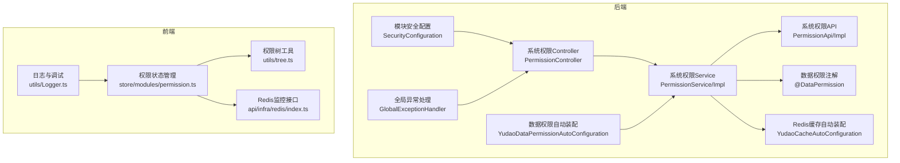
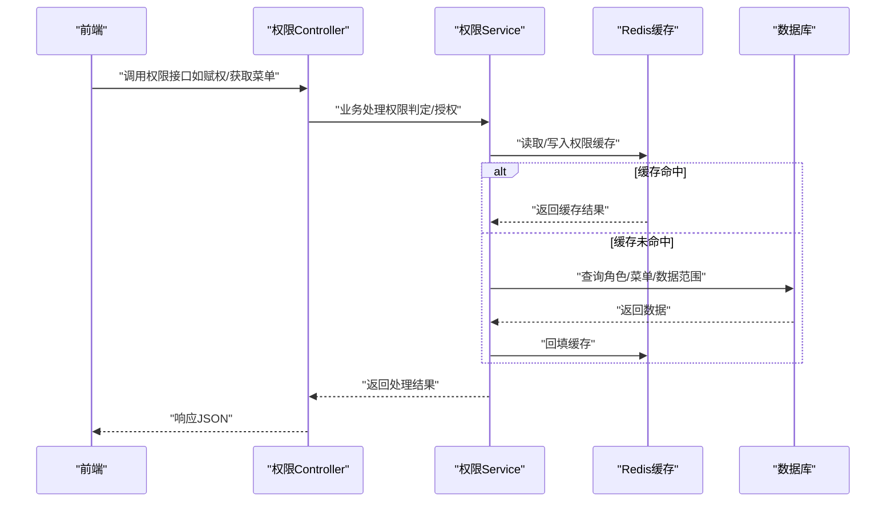
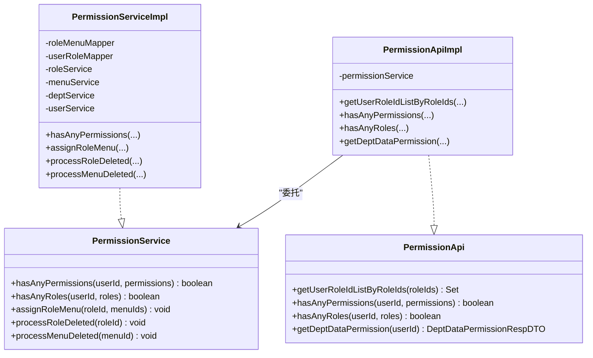
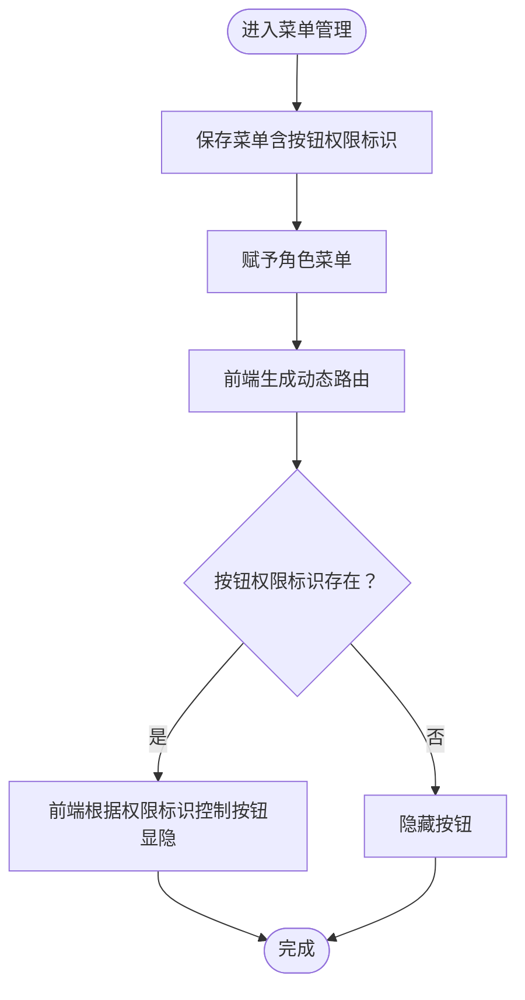
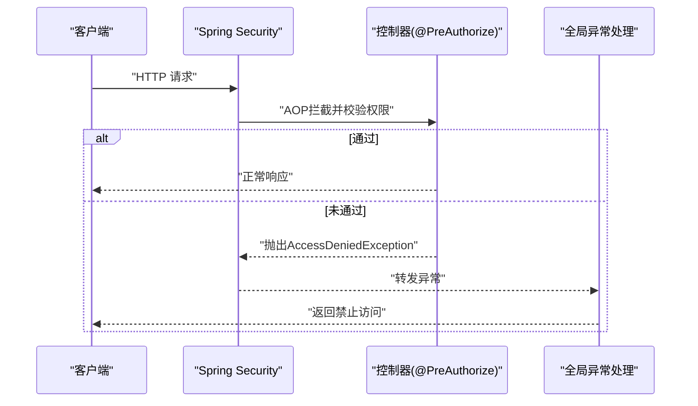
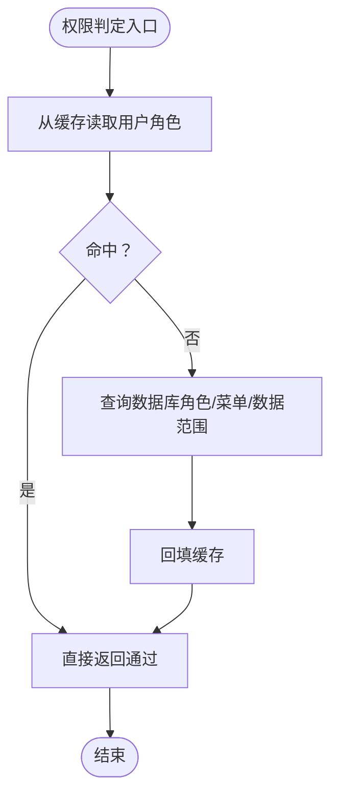
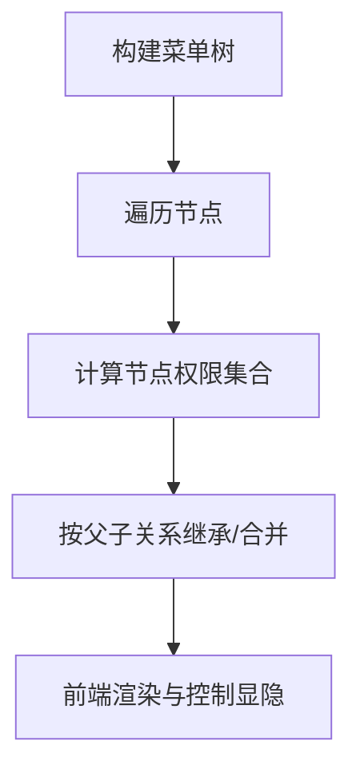
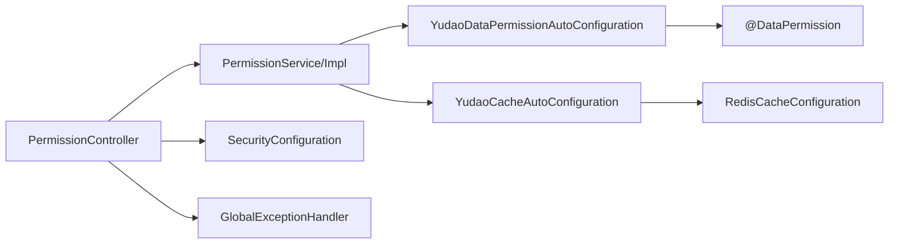

# RBAC权限控制

<cite>
**本文引用的文件**
- [PermissionApi.java](file://yudao-module-system/src/main/java/cn/iocoder/yudao/module/system/api/permission/PermissionApi.java)
- [PermissionApiImpl.java](file://yudao-module-system/src/main/java/cn/iocoder/yudao/module/system/api/permission/PermissionApiImpl.java)
- [PermissionController.java](file://yudao-module-system/src/main/java/cn/iocoder/yudao/module/system/controller/admin/permission/PermissionController.java)
- [PermissionService.java](file://yudao-module-system/src/main/java/cn/iocoder/yudao/module/system/service/permission/PermissionService.java)
- [PermissionServiceImpl.java](file://yudao-module-system/src/main/java/cn/iocoder/yudao/module/system/service/permission/PermissionServiceImpl.java)
- [PermissionAssignUserRoleReqVO.java](file://yudao-module-system/src/main/java/cn/iocoder/yudao/module/system/controller/admin/permission/vo/permission/PermissionAssignUserRoleReqVO.java)
- [PermissionAssignRoleMenuReqVO.java](file://yudao-module-system/src/main/java/cn/iocoder/yudao/module/system/controller/admin/permission/vo/permission/PermissionAssignRoleMenuReqVO.java)
- [PermissionAssignRoleDataScopeReqVO.java](file://yudao-module-system/src/main/java/cn/iocoder/yudao/module/system/controller/admin/permission/vo/permission/PermissionAssignRoleDataScopeReqVO.java)
- [MenuSaveVO.java](file://yudao-module-system/src/main/java/cn/iocoder/yudao/module/system/controller/admin/permission/vo/menu/MenuSaveVO.java)
- [SecurityConfiguration.java](file://yudao-module-opshub/src/main/java/cn/iocoder/yudao/module/opshub/framework/security/config/SecurityConfiguration.java)
- [GlobalExceptionHandler.java](file://yudao-framework/yudao-spring-boot-starter-web/src/main/java/cn/iocoder/yudao/framework/web/core/handler/GlobalExceptionHandler.java)
- [DataPermission.java](file://yudao-framework/yudao-spring-boot-starter-biz-data-permission/src/main/java/cn/iocoder/yudao/framework/datapermission/core/annotation/DataPermission.java)
- [YudaoDataPermissionAutoConfiguration.java](file://yudao-framework/yudao-spring-boot-starter-biz-data-permission/src/main/java/cn/iocoder/yudao/framework/datapermission/config/YudaoDataPermissionAutoConfiguration.java)
- [YudaoCacheAutoConfiguration.java](file://yudao-framework/yudao-spring-boot-starter-redis/src/main/java/cn/iocoder/yudao/framework/redis/config/YudaoCacheAutoConfiguration.java)
- [YudaoCacheProperties.java](file://yudao-framework/yudao-spring-boot-starter-redis/src/main/java/cn/iocoder/yudao/framework/redis/config/YudaoCacheProperties.java)
- [permission.ts](file://yudao-ui/yudao-ui-admin-vue3/src/store/modules/permission.ts)
- [tree.ts](file://yudao-ui/yudao-ui-admin-vue3/src/utils/tree.ts)
- [Logger.ts](file://yudao-ui/yudao-ui-admin-vue3/src/utils/Logger.ts)
- [index.ts](file://yudao-ui/yudao-ui-admin-vue3/src/api/infra/redis/index.ts)
</cite>

## 目录
1. [引言](#引言)
2. [项目结构](#项目结构)
3. [核心组件](#核心组件)
4. [架构总览](#架构总览)
5. [详细组件分析](#详细组件分析)
6. [依赖分析](#依赖分析)
7. [性能考量](#性能考量)
8. [故障排查指南](#故障排查指南)
9. [结论](#结论)
10. [附录](#附录)

## 引言
本文件围绕基于角色的访问控制（RBAC）权限控制模块，系统性阐述用户-角色-权限三层关系设计、菜单权限控制（路由、按钮、接口）、权限注解（如@PreAuthorize等）在后端的使用、权限数据的动态加载与缓存策略（含权限树构建与继承思路）、以及前端可视化管理与调试工具的使用方法。目标是帮助开发者与运维人员快速理解并高效落地权限体系。

## 项目结构
RBAC权限控制涉及后端系统模块与前端UI两大侧：
- 后端：系统模块提供权限API/Service/Controller，安全配置与全局异常处理，数据权限注解与自动装配，Redis缓存配置与管理。
- 前端：权限状态管理（Pinia Store）、路由生成与权限树工具、日志与调试工具、Redis监控接口。

图示来源
- [PermissionController.java:1-31](file://yudao-module-system/src/main/java/cn/iocoder/yudao/module/system/controller/admin/permission/PermissionController.java#L1-31)
- [PermissionServiceImpl.java:1-25](file://yudao-module-system/src/main/java/cn/iocoder/yudao/module/system/service/permission/PermissionServiceImpl.java#L1-25)
- [SecurityConfiguration.java:1-28](file://yudao-module-opshub/src/main/java/cn/iocoder/yudao/module/opshub/framework/security/config/SecurityConfiguration.java#L1-28)
- [GlobalExceptionHandler.java:270-290](file://yudao-framework/yudao-spring-boot-starter-web/src/main/java/cn/iocoder/yudao/framework/web/core/handler/GlobalExceptionHandler.java#L270-290)
- [DataPermission.java:1-35](file://yudao-framework/yudao-spring-boot-starter-biz-data-permission/src/main/java/cn/iocoder/yudao/framework/datapermission/core/annotation/DataPermission.java#L1-35)
- [YudaoDataPermissionAutoConfiguration.java:29-46](file://yudao-framework/yudao-spring-boot-starter-biz-data-permission/src/main/java/cn/iocoder/yudao/framework/datapermission/config/YudaoDataPermissionAutoConfiguration.java#L29-46)
- [YudaoCacheAutoConfiguration.java:32-86](file://yudao-framework/yudao-spring-boot-starter-redis/src/main/java/cn/iocoder/yudao/framework/redis/config/YudaoCacheAutoConfiguration.java#L32-86)
- [permission.ts:1-56](file://yudao-ui/yudao-ui-admin-vue3/src/store/modules/permission.ts#L1-56)
- [tree.ts:51-403](file://yudao-ui/yudao-ui-admin-vue3/src/utils/tree.ts#L51-403)
- [Logger.ts:58-100](file://yudao-ui/yudao-ui-admin-vue3/src/utils/Logger.ts#L58-100)
- [index.ts:1-8](file://yudao-ui/yudao-ui-admin-vue3/src/api/infra/redis/index.ts#L1-8)

章节来源
- [PermissionController.java:1-31](file://yudao-module-system/src/main/java/cn/iocoder/yudao/module/system/controller/admin/permission/PermissionController.java#L1-31)
- [PermissionServiceImpl.java:1-25](file://yudao-module-system/src/main/java/cn/iocoder/yudao/module/system/service/permission/PermissionServiceImpl.java#L1-25)
- [YudaoCacheAutoConfiguration.java:32-86](file://yudao-framework/yudao-spring-boot-starter-redis/src/main/java/cn/iocoder/yudao/framework/redis/config/YudaoCacheAutoConfiguration.java#L32-86)

## 核心组件
- 权限API层：对外暴露权限能力，如“用户是否拥有某权限/角色”、“根据角色获取用户集合”、“获取部门数据权限”等。
- 权限服务层：实现权限判定、角色-菜单授权、角色-数据范围授权、角色/菜单删除后的关联清理等。
- 权限控制器：提供REST接口，用于赋予用户角色、角色菜单、角色数据范围等。
- 安全配置与异常处理：统一授权规则定制与权限不足异常处理。
- 数据权限注解与自动装配：通过注解与拦截器实现数据维度的权限控制。
- 缓存配置：Redis序列化、TTL、空值缓存策略、扫描批次大小等。
- 前端权限状态与工具：动态路由生成、权限树工具、日志与调试、Redis监控。

章节来源
- [PermissionApi.java:1-23](file://yudao-module-system/src/main/java/cn/iocoder/yudao/module/system/api/permission/PermissionApi.java#L1-23)
- [PermissionApiImpl.java:1-42](file://yudao-module-system/src/main/java/cn/iocoder/yudao/module/system/api/permission/PermissionApiImpl.java#L1-42)
- [PermissionService.java:1-58](file://yudao-module-system/src/main/java/cn/iocoder/yudao/module/system/service/permission/PermissionService.java#L1-58)
- [PermissionServiceImpl.java:32-80](file://yudao-module-system/src/main/java/cn/iocoder/yudao/module/system/service/permission/PermissionServiceImpl.java#L32-80)
- [PermissionController.java:1-31](file://yudao-module-system/src/main/java/cn/iocoder/yudao/module/system/controller/admin/permission/PermissionController.java#L1-31)

## 架构总览
RBAC权限控制由“接口层-服务层-数据层-缓存层-前端渲染层”构成闭环。后端通过Spring Security与AOP实现接口级权限拦截，结合缓存提升权限判定性能；前端通过权限状态与路由工具生成受控页面。

图示来源
- [PermissionController.java:1-31](file://yudao-module-system/src/main/java/cn/iocoder/yudao/module/system/controller/admin/permission/PermissionController.java#L1-31)
- [PermissionServiceImpl.java:62-80](file://yudao-module-system/src/main/java/cn/iocoder/yudao/module/system/service/permission/PermissionServiceImpl.java#L62-80)
- [YudaoCacheAutoConfiguration.java:32-86](file://yudao-framework/yudao-spring-boot-starter-redis/src/main/java/cn/iocoder/yudao/framework/redis/config/YudaoCacheAutoConfiguration.java#L32-86)

## 详细组件分析

### 1) 用户-角色-权限三层关系设计
- 关系模型：用户与角色多对多，角色与菜单多对多，角色与数据范围绑定，形成“用户→角色集合→权限集合”的链式推导。
- 权限判定：服务层先获取用户启用的角色列表（带缓存），再逐条匹配权限字符串，任一满足即通过。
- 角色-菜单/数据范围：提供授权与清理接口，确保角色变更时关联数据一致性。

图示来源
- [PermissionService.java:10-58](file://yudao-module-system/src/main/java/cn/iocoder/yudao/module/system/service/permission/PermissionService.java#L10-58)
- [PermissionServiceImpl.java:32-80](file://yudao-module-system/src/main/java/cn/iocoder/yudao/module/system/service/permission/PermissionServiceImpl.java#L32-80)
- [PermissionApi.java:8-23](file://yudao-module-system/src/main/java/cn/iocoder/yudao/module/system/api/permission/PermissionApi.java#L8-23)
- [PermissionApiImpl.java:11-42](file://yudao-module-system/src/main/java/cn/iocoder/yudao/module/system/api/permission/PermissionApiImpl.java#L11-42)

章节来源
- [PermissionService.java:10-58](file://yudao-module-system/src/main/java/cn/iocoder/yudao/module/system/service/permission/PermissionService.java#L10-58)
- [PermissionServiceImpl.java:62-80](file://yudao-module-system/src/main/java/cn/iocoder/yudao/module/system/service/permission/PermissionServiceImpl.java#L62-80)
- [PermissionApiImpl.java:16-42](file://yudao-module-system/src/main/java/cn/iocoder/yudao/module/system/api/permission/PermissionApiImpl.java#L16-42)

### 2) 菜单权限控制（路由/按钮/接口）
- 路由权限：前端根据角色拥有的菜单生成动态路由，支持扁平化与多级路由展开。
- 按钮权限：菜单类型为按钮时，使用permission字段作为权限标识，前端据此控制按钮显隐。
- 接口权限：后端通过Spring Security与AOP注解（如@PreAuthorize）在接口层拦截，未授权直接返回禁止。

图示来源
- [MenuSaveVO.java:10-36](file://yudao-module-system/src/main/java/cn/iocoder/yudao/module/system/controller/admin/permission/vo/menu/MenuSaveVO.java#L10-36)
- [PermissionAssignRoleMenuReqVO.java:10-21](file://yudao-module-system/src/main/java/cn/iocoder/yudao/module/system/controller/admin/permission/vo/permission/PermissionAssignRoleMenuReqVO.java#L10-21)
- [permission.ts:38-56](file://yudao-ui/yudao-ui-admin-vue3/src/store/modules/permission.ts#L38-56)

章节来源
- [MenuSaveVO.java:10-36](file://yudao-module-system/src/main/java/cn/iocoder/yudao/module/system/controller/admin/permission/vo/menu/MenuSaveVO.java#L10-36)
- [PermissionAssignRoleMenuReqVO.java:10-21](file://yudao-module-system/src/main/java/cn/iocoder/yudao/module/system/controller/admin/permission/vo/permission/PermissionAssignRoleMenuReqVO.java#L10-21)
- [permission.ts:38-56](file://yudao-ui/yudao-ui-admin-vue3/src/store/modules/permission.ts#L38-56)

### 3) 权限注解与接口拦截
- 接口注解：后端控制器使用@PreAuthorize等注解进行方法级权限校验，AOP拦截器负责在请求到达前判定。
- 异常处理：当权限不足时抛出AccessDeniedException，全局异常处理器统一转为“禁止访问”响应。
- 安全定制：模块可通过自定义AuthorizeRequestsCustomizer扩展公开接口白名单。

图示来源
- [PermissionController.java](file://yudao-module-system/src/main/java/cn/iocoder/yudao/module/system/controller/admin/permission/PermissionController.java#L13)
- [GlobalExceptionHandler.java:270-290](file://yudao-framework/yudao-spring-boot-starter-web/src/main/java/cn/iocoder/yudao/framework/web/core/handler/GlobalExceptionHandler.java#L270-290)
- [SecurityConfiguration.java:15-28](file://yudao-module-opshub/src/main/java/cn/iocoder/yudao/module/opshub/framework/security/config/SecurityConfiguration.java#L15-28)

章节来源
- [PermissionController.java](file://yudao-module-system/src/main/java/cn/iocoder/yudao/module/system/controller/admin/permission/PermissionController.java#L13)
- [GlobalExceptionHandler.java:270-290](file://yudao-framework/yudao-spring-boot-starter-web/src/main/java/cn/iocoder/yudao/framework/web/core/handler/GlobalExceptionHandler.java#L270-290)
- [SecurityConfiguration.java:15-28](file://yudao-module-opshub/src/main/java/cn/iocoder/yudao/module/opshub/framework/security/config/SecurityConfiguration.java#L15-28)

### 4) 权限数据的动态加载与缓存策略
- 动态加载：权限Service在权限判定时从缓存获取用户角色列表，未命中则查询数据库并回填缓存。
- 缓存配置：RedisCacheConfiguration统一前缀、JSON序列化、TTL、空值缓存开关、键前缀开关；TimeoutRedisCacheManager支持事务感知。
- 缓存属性：RedisScanBatchSize可配置scan批次大小，平衡性能与内存占用。

图示来源
- [PermissionServiceImpl.java:62-80](file://yudao-module-system/src/main/java/cn/iocoder/yudao/module/system/service/permission/PermissionServiceImpl.java#L62-80)
- [YudaoCacheAutoConfiguration.java:32-86](file://yudao-framework/yudao-spring-boot-starter-redis/src/main/java/cn/iocoder/yudao/framework/redis/config/YudaoCacheAutoConfiguration.java#L32-86)
- [YudaoCacheProperties.java:1-27](file://yudao-framework/yudao-spring-boot-starter-redis/src/main/java/cn/iocoder/yudao/framework/redis/config/YudaoCacheProperties.java#L1-27)

章节来源
- [PermissionServiceImpl.java:62-80](file://yudao-module-system/src/main/java/cn/iocoder/yudao/module/system/service/permission/PermissionServiceImpl.java#L62-80)
- [YudaoCacheAutoConfiguration.java:32-86](file://yudao-framework/yudao-spring-boot-starter-redis/src/main/java/cn/iocoder/yudao/framework/redis/config/YudaoCacheAutoConfiguration.java#L32-86)
- [YudaoCacheProperties.java:1-27](file://yudao-framework/yudao-spring-boot-starter-redis/src/main/java/cn/iocoder/yudao/framework/redis/config/YudaoCacheProperties.java#L1-27)

### 5) 权限树构建与继承
- 权限树工具：提供查找节点、查找路径、树转字符串等通用能力，便于构建与展示权限树。
- 继承思路：菜单通常具备父子层级，权限继承可基于“角色→菜单树→权限集合”的映射，前端通过树工具计算节点权限。

图示来源
- [tree.ts:51-403](file://yudao-ui/yudao-ui-admin-vue3/src/utils/tree.ts#L51-403)

章节来源
- [tree.ts:51-403](file://yudao-ui/yudao-ui-admin-vue3/src/utils/tree.ts#L51-403)

### 6) 可视化管理界面与调试工具
- 可视化管理：系统模块提供用户、角色、菜单、部门、岗位、租户等管理界面，支持本地缓存优化性能。
- 调试工具：Logger工具提供彩色日志输出，便于在开发阶段观察权限判定与路由生成过程。
- Redis监控：提供Redis监控信息接口，辅助排查缓存相关问题。

章节来源
- [Logger.ts:58-100](file://yudao-ui/yudao-ui-admin-vue3/src/utils/Logger.ts#L58-100)
- [index.ts:1-8](file://yudao-ui/yudao-ui-admin-vue3/src/api/infra/redis/index.ts#L1-8)

## 依赖分析
- 组件耦合：控制器依赖服务层；服务层依赖数据访问与领域服务；数据权限注解通过自动装配注入拦截器；缓存配置为整体提供统一能力。
- 外部依赖：Spring Security用于接口级权限；Guava缓存用于高性能缓存加载；Redis用于分布式缓存。

图示来源
- [PermissionController.java:1-31](file://yudao-module-system/src/main/java/cn/iocoder/yudao/module/system/controller/admin/permission/PermissionController.java#L1-31)
- [PermissionServiceImpl.java:32-80](file://yudao-module-system/src/main/java/cn/iocoder/yudao/module/system/service/permission/PermissionServiceImpl.java#L32-80)
- [YudaoDataPermissionAutoConfiguration.java:29-46](file://yudao-framework/yudao-spring-boot-starter-biz-data-permission/src/main/java/cn/iocoder/yudao/framework/datapermission/config/YudaoDataPermissionAutoConfiguration.java#L29-46)
- [YudaoCacheAutoConfiguration.java:32-86](file://yudao-framework/yudao-spring-boot-starter-redis/src/main/java/cn/iocoder/yudao/framework/redis/config/YudaoCacheAutoConfiguration.java#L32-86)
- [SecurityConfiguration.java:15-28](file://yudao-module-opshub/src/main/java/cn/iocoder/yudao/module/opshub/framework/security/config/SecurityConfiguration.java#L15-28)
- [GlobalExceptionHandler.java:270-290](file://yudao-framework/yudao-spring-boot-starter-web/src/main/java/cn/iocoder/yudao/framework/web/core/handler/GlobalExceptionHandler.java#L270-290)

## 性能考量
- 缓存优先：权限判定尽量命中缓存，减少数据库访问；合理设置TTL与空值缓存策略。
- 批量加载：角色-菜单/角色-用户等关联关系采用批量查询与缓存回填，降低N+1风险。
- 前端优化：动态路由生成前先读取本地缓存，避免重复网络请求。
- Redis调优：根据业务规模调整scan批次大小，平衡吞吐与内存占用。

## 故障排查指南
- 权限不足：检查接口是否标注@PreAuthorize，确认用户角色是否包含所需权限；查看全局异常处理器对AccessDeniedException的统一返回。
- 缓存异常：通过Redis监控接口确认缓存可用性；检查缓存前缀与序列化配置；必要时清理异常键值。
- 调试定位：使用Logger工具输出关键流程日志，观察权限判定与路由生成过程。

章节来源
- [GlobalExceptionHandler.java:270-290](file://yudao-framework/yudao-spring-boot-starter-web/src/main/java/cn/iocoder/yudao/framework/web/core/handler/GlobalExceptionHandler.java#L270-290)
- [index.ts:1-8](file://yudao-ui/yudao-ui-admin-vue3/src/api/infra/redis/index.ts#L1-8)
- [Logger.ts:58-100](file://yudao-ui/yudao-ui-admin-vue3/src/utils/Logger.ts#L58-100)

## 结论
本RBAC权限控制模块以清晰的三层关系为核心，结合后端接口级权限注解、前端动态路由与按钮控制、以及完善的缓存与监控体系，实现了高可用、易维护、可扩展的权限治理方案。建议在生产环境重点关注缓存策略与异常处理，并持续完善可视化管理与调试工具。

## 附录
- 授权对象与字段
  - 用户-角色：用户ID、角色ID集合
  - 角色-菜单：角色ID、菜单ID集合
  - 角色-数据范围：角色ID、数据范围类型、自定义部门集合
- 常用接口
  - 赋予用户角色：PermissionAssignUserRoleReqVO
  - 赋予角色菜单：PermissionAssignRoleMenuReqVO
  - 赋予角色数据范围：PermissionAssignRoleDataScopeReqVO
  - 菜单保存（含按钮权限标识）：MenuSaveVO

章节来源
- [PermissionAssignUserRoleReqVO.java:10-21](file://yudao-module-system/src/main/java/cn/iocoder/yudao/module/system/controller/admin/permission/vo/permission/PermissionAssignUserRoleReqVO.java#L10-21)
- [PermissionAssignRoleMenuReqVO.java:10-21](file://yudao-module-system/src/main/java/cn/iocoder/yudao/module/system/controller/admin/permission/vo/permission/PermissionAssignRoleMenuReqVO.java#L10-21)
- [PermissionAssignRoleDataScopeReqVO.java:12-28](file://yudao-module-system/src/main/java/cn/iocoder/yudao/module/system/controller/admin/permission/vo/permission/PermissionAssignRoleDataScopeReqVO.java#L12-28)
- [MenuSaveVO.java:10-36](file://yudao-module-system/src/main/java/cn/iocoder/yudao/module/system/controller/admin/permission/vo/menu/MenuSaveVO.java#L10-36)