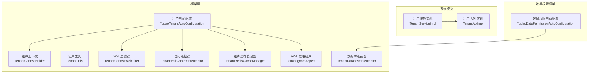
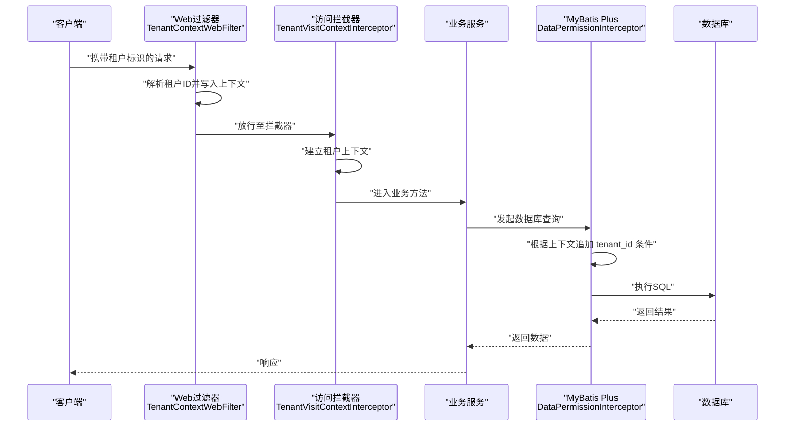
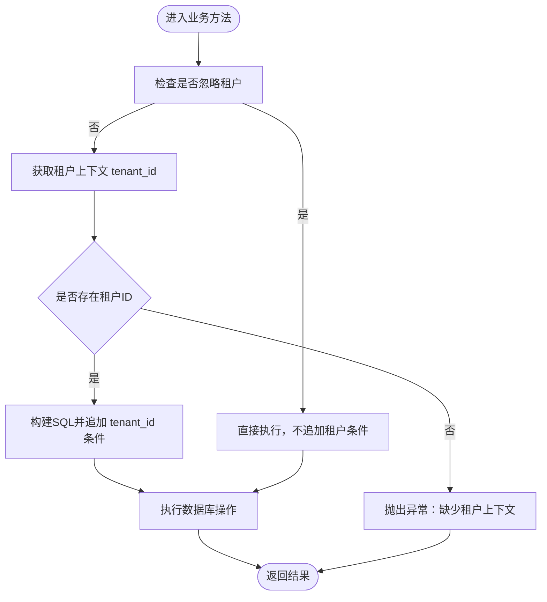
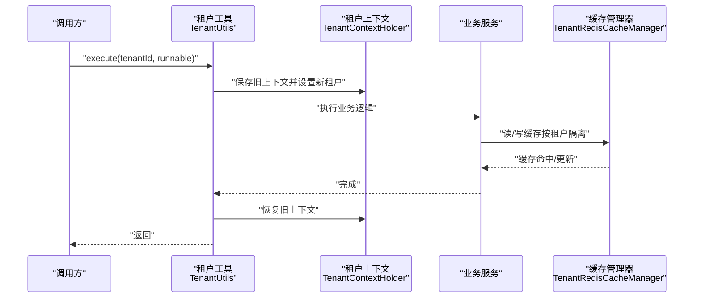
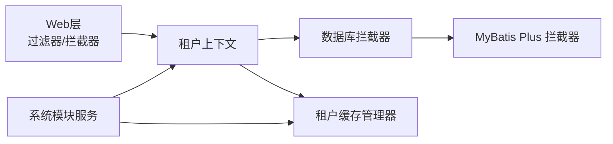

# 多租户权限隔离

<cite>
**本文引用的文件**
- [TenantContextHolder.java](file://yudao-framework/yudao-spring-boot-starter-biz-tenant/src/main/java/cn/iocoder/yudao/framework/tenant/core/context/TenantContextHolder.java)
- [TenantUtils.java](file://yudao-framework/yudao-spring-boot-starter-biz-tenant/src/main/java/cn/iocoder/yudao/framework/tenant/core/util/TenantUtils.java)
- [YudaoTenantAutoConfiguration.java](file://yudao-framework/yudao-spring-boot-starter-biz-tenant/src/main/java/cn/iocoder/yudao/framework/tenant/config/YudaoTenantAutoConfiguration.java)
- [TenantContextWebFilter.java](file://yudao-framework/yudao-spring-boot-starter-biz-tenant/src/main/java/cn/iocoder/yudao/framework/tenant/core/web/TenantContextWebFilter.java)
- [TenantVisitContextInterceptor.java](file://yudao-framework/yudao-spring-boot-starter-biz-tenant/src/main/java/cn/iocoder/yudao/framework/tenant/core/web/TenantVisitContextInterceptor.java)
- [TenantBaseDO.java](file://yudao-framework/yudao-spring-boot-starter-biz-tenant/src/main/java/cn/iocoder/yudao/framework/tenant/core/db/TenantBaseDO.java)
- [TenantDatabaseInterceptor.java](file://yudao-framework/yudao-spring-boot-starter-biz-tenant/src/main/java/cn/iocoder/yudao/framework/tenant/core/db/TenantDatabaseInterceptor.java)
- [TenantRedisCacheManager.java](file://yudao-framework/yudao-spring-boot-starter-biz-tenant/src/main/java/cn/iocoder/yudao/framework/tenant/core/redis/TenantRedisCacheManager.java)
- [TenantIgnoreAspect.java](file://yudao-framework/yudao-spring-boot-starter-biz-tenant/src/main/java/cn/iocoder/yudao/framework/tenant/core/aop/TenantIgnoreAspect.java)
- [YudaoDataPermissionAutoConfiguration.java](file://yudao-framework/yudao-spring-boot-starter-biz-data-permission/src/main/java/cn/iocoder/yudao/framework/datapermission/config/YudaoDataPermissionAutoConfiguration.java)
- [TenantApiImpl.java](file://yudao-module-system/src/main/java/cn/iocoder/yudao/module/system/api/tenant/TenantApiImpl.java)
- [TenantServiceImpl.java](file://yudao-module-system/src/main/java/cn/iocoder/yudao/module/system/service/tenant/TenantServiceImpl.java)
- [PRD-用户权限设计.md](file://docs/PRD-用户权限设计.md)
</cite>

## 目录
1. [简介](#简介)
2. [项目结构](#项目结构)
3. [核心组件](#核心组件)
4. [架构总览](#架构总览)
5. [详细组件分析](#详细组件分析)
6. [依赖关系分析](#依赖关系分析)
7. [性能考量](#性能考量)
8. [故障排查指南](#故障排查指南)
9. [结论](#结论)
10. [附录](#附录)

## 简介
本文件面向多租户权限隔离模块，系统化阐述在多租户架构下的数据隔离机制与权限控制策略，覆盖以下主题：
- 数据隔离方案：数据库级 Schema 隔离与表级 tenant_id 字段隔离的实现与取舍
- 租户维度权限控制：租户管理员、超级管理员、普通用户的权限差异与访问边界
- 自动隔离原理：AOP 切面拦截、MyBatis 插件拦截、SQL 自动追加租户条件的技术手段
- 租户切换机制：租户上下文管理、租户缓存策略、租户数据迁移与兼容策略
- 配置与排障：多租户权限配置要点与常见问题定位方法

## 项目结构
多租户能力主要由框架层 yudao-spring-boot-starter-biz-tenant 提供，系统模块 yudao-module-system 提供租户管理 API 与服务，数据权限框架 yudao-spring-boot-starter-biz-data-permission 提供数据权限规则与拦截器。

图表来源
- [YudaoTenantAutoConfiguration.java:83-203](file://yudao-framework/yudao-spring-boot-starter-biz-tenant/src/main/java/cn/iocoder/yudao/framework/tenant/config/YudaoTenantAutoConfiguration.java#L83-L203)
- [TenantContextHolder.java:1-68](file://yudao-framework/yudao-spring-boot-starter-biz-tenant/src/main/java/cn/iocoder/yudao/framework/tenant/core/context/TenantContextHolder.java#L1-L68)
- [TenantContextWebFilter.java](file://yudao-framework/yudao-spring-boot-starter-biz-tenant/src/main/java/cn/iocoder/yudao/framework/tenant/core/web/TenantContextWebFilter.java)
- [TenantVisitContextInterceptor.java](file://yudao-framework/yudao-spring-boot-starter-biz-tenant/src/main/java/cn/iocoder/yudao/framework/tenant/core/web/TenantVisitContextInterceptor.java)
- [TenantRedisCacheManager.java](file://yudao-framework/yudao-spring-boot-starter-biz-tenant/src/main/java/cn/iocoder/yudao/framework/tenant/core/redis/TenantRedisCacheManager.java)
- [TenantIgnoreAspect.java](file://yudao-framework/yudao-spring-boot-starter-biz-tenant/src/main/java/cn/iocoder/yudao/framework/tenant/core/aop/TenantIgnoreAspect.java)
- [YudaoDataPermissionAutoConfiguration.java:1-46](file://yudao-framework/yudao-spring-boot-starter-biz-data-permission/src/main/java/cn/iocoder/yudao/framework/datapermission/config/YudaoDataPermissionAutoConfiguration.java#L1-L46)
- [TenantServiceImpl.java:1-23](file://yudao-module-system/src/main/java/cn/iocoder/yudao/module/system/service/tenant/TenantServiceImpl.java#L1-L23)
- [TenantApiImpl.java:1-31](file://yudao-module-system/src/main/java/cn/iocoder/yudao/module/system/api/tenant/TenantApiImpl.java#L1-L31)

章节来源
- [YudaoTenantAutoConfiguration.java:83-203](file://yudao-framework/yudao-spring-boot-starter-biz-tenant/src/main/java/cn/iocoder/yudao/framework/tenant/config/YudaoTenantAutoConfiguration.java#L83-L203)
- [YudaoDataPermissionAutoConfiguration.java:1-46](file://yudao-framework/yudao-spring-boot-starter-biz-data-permission/src/main/java/cn/iocoder/yudao/framework/datapermission/config/YudaoDataPermissionAutoConfiguration.java#L1-L46)

## 核心组件
- 租户上下文与工具
  - 租户上下文持有器：提供线程安全的租户 ID 与“忽略租户”标记存储，并支持获取必需租户 ID 与清理
  - 租户工具：提供在指定租户上下文中执行逻辑的方法，确保执行前后上下文恢复
- Web 层接入
  - Web 过滤器：从请求头或会话中解析租户 ID，写入上下文
  - 访问拦截器：结合安全框架，识别访问来源并建立租户上下文
- 数据库与缓存
  - 数据库拦截器：在 SQL 执行前自动追加 tenant_id 条件
  - 缓存管理器：租户维度的缓存隔离与事务感知
- AOP 支持
  - 忽略租户的 AOP 切面：允许在特定场景临时忽略租户过滤
- 数据权限框架集成
  - 数据权限自动配置：注册数据权限规则工厂、规则处理器与 MyBatis Plus 拦截器

章节来源
- [TenantContextHolder.java:1-68](file://yudao-framework/yudao-spring-boot-starter-biz-tenant/src/main/java/cn/iocoder/yudao/framework/tenant/core/context/TenantContextHolder.java#L1-L68)
- [TenantUtils.java:1-38](file://yudao-framework/yudao-spring-boot-starter-biz-tenant/src/main/java/cn/iocoder/yudao/framework/tenant/core/util/TenantUtils.java#L1-L38)
- [TenantContextWebFilter.java](file://yudao-framework/yudao-spring-boot-starter-biz-tenant/src/main/java/cn/iocoder/yudao/framework/tenant/core/web/TenantContextWebFilter.java)
- [TenantVisitContextInterceptor.java](file://yudao-framework/yudao-spring-boot-starter-biz-tenant/src/main/java/cn/iocoder/yudao/framework/tenant/core/web/TenantVisitContextInterceptor.java)
- [TenantDatabaseInterceptor.java](file://yudao-framework/yudao-spring-boot-starter-biz-tenant/src/main/java/cn/iocoder/yudao/framework/tenant/core/db/TenantDatabaseInterceptor.java)
- [TenantRedisCacheManager.java](file://yudao-framework/yudao-spring-boot-starter-biz-tenant/src/main/java/cn/iocoder/yudao/framework/tenant/core/redis/TenantRedisCacheManager.java)
- [TenantIgnoreAspect.java](file://yudao-framework/yudao-spring-boot-starter-biz-tenant/src/main/java/cn/iocoder/yudao/framework/tenant/core/aop/TenantIgnoreAspect.java)
- [YudaoDataPermissionAutoConfiguration.java:1-46](file://yudao-framework/yudao-spring-boot-starter-biz-data-permission/src/main/java/cn/iocoder/yudao/framework/datapermission/config/YudaoDataPermissionAutoConfiguration.java#L1-L46)

## 架构总览
多租户权限隔离以“上下文驱动 + 拦截器增强”的方式实现：
- 请求进入 Web 层，通过过滤器与拦截器建立租户上下文
- MyBatis Plus 在执行 SQL 前由数据权限拦截器追加 tenant_id 条件
- 缓存层按租户维度隔离，保证跨租户数据不串扰
- 特殊场景可通过 AOP 忽略租户，但默认严格隔离

图表来源
- [TenantContextWebFilter.java](file://yudao-framework/yudao-spring-boot-starter-biz-tenant/src/main/java/cn/iocoder/yudao/framework/tenant/core/web/TenantContextWebFilter.java)
- [TenantVisitContextInterceptor.java](file://yudao-framework/yudao-spring-boot-starter-biz-tenant/src/main/java/cn/iocoder/yudao/framework/tenant/core/web/TenantVisitContextInterceptor.java)
- [YudaoDataPermissionAutoConfiguration.java:24-44](file://yudao-framework/yudao-spring-boot-starter-biz-data-permission/src/main/java/cn/iocoder/yudao/framework/datapermission/config/YudaoDataPermissionAutoConfiguration.java#L24-L44)

## 详细组件分析

### 数据隔离机制
- 表级 tenant_id 字段隔离
  - 所有业务 DO 继承租户基类，统一包含 tenant_id 字段，作为默认隔离键
  - 数据库拦截器在 SQL 构建阶段自动追加 tenant_id 条件，避免越权访问
- 数据库级 Schema 隔离
  - 框架提供按租户拆分 Schema 的能力，便于更强隔离与资源配额控制
  - 与表级隔离可并行存在，具体启用取决于租户属性配置与部署策略

章节来源
- [TenantBaseDO.java](file://yudao-framework/yudao-spring-boot-starter-biz-tenant/src/main/java/cn/iocoder/yudao/framework/tenant/core/db/TenantBaseDO.java)
- [TenantDatabaseInterceptor.java](file://yudao-framework/yudao-spring-boot-starter-biz-tenant/src/main/java/cn/iocoder/yudao/framework/tenant/core/db/TenantDatabaseInterceptor.java)
- [PRD-用户权限设计.md:314-350](file://docs/PRD-用户权限设计.md#L314-L350)

### 租户维度权限控制
- 角色与权限差异
  - 超级管理员：无租户限制，可访问全部数据
  - 租户管理员：仅能访问其所属租户的数据
  - 普通用户：受数据权限规则约束，按角色与授权范围过滤
- 数据权限规则
  - 通过注解启用/禁用数据权限，或精确选择规则
  - 系统管理模块与业务模块分别采用不同规则，避免冲突

章节来源
- [PRD-用户权限设计.md:314-350](file://docs/PRD-用户权限设计.md#L314-L350)
- [PRD-用户权限设计.md:337-343](file://docs/PRD-用户权限设计.md#L337-L343)

### 自动隔离原理
- AOP 切面拦截
  - 忽略租户的 AOP 切面允许在必要时临时关闭租户过滤，适用于系统运维或批量任务
- MyBatis 插件拦截
  - 数据权限自动配置注册拦截器，将规则处理器插入首个位置，确保在分页之前生效
  - 规则处理器根据上下文动态拼接 WHERE 条件，实现透明隔离

图表来源
- [TenantIgnoreAspect.java](file://yudao-framework/yudao-spring-boot-starter-biz-tenant/src/main/java/cn/iocoder/yudao/framework/tenant/core/aop/TenantIgnoreAspect.java)
- [YudaoDataPermissionAutoConfiguration.java:24-44](file://yudao-framework/yudao-spring-boot-starter-biz-data-permission/src/main/java/cn/iocoder/yudao/framework/datapermission/config/YudaoDataPermissionAutoConfiguration.java#L24-L44)

章节来源
- [TenantIgnoreAspect.java](file://yudao-framework/yudao-spring-boot-starter-biz-tenant/src/main/java/cn/iocoder/yudao/framework/tenant/core/aop/TenantIgnoreAspect.java)
- [YudaoDataPermissionAutoConfiguration.java:24-44](file://yudao-framework/yudao-spring-boot-starter-biz-data-permission/src/main/java/cn/iocoder/yudao/framework/datapermission/config/YudaoDataPermissionAutoConfiguration.java#L24-L44)

### 租户切换机制
- 租户上下文管理
  - Web 层通过过滤器与拦截器建立上下文；也可通过工具方法在代码中切换租户
  - 上下文包含租户 ID 与“忽略租户”标记，支持线程本地存储与传播
- 租户缓存策略
  - 缓存管理器按租户维度隔离键空间，避免跨租户污染
  - 支持事务感知，确保事务提交后再执行缓存失效，降低并发风险
- 租户数据迁移
  - 通过工具方法在指定租户上下文中执行迁移任务，保证数据归属正确
  - 迁移完成后恢复原有上下文，避免影响后续请求

图表来源
- [TenantUtils.java:1-38](file://yudao-framework/yudao-spring-boot-starter-biz-tenant/src/main/java/cn/iocoder/yudao/framework/tenant/core/util/TenantUtils.java#L1-L38)
- [TenantContextHolder.java:1-68](file://yudao-framework/yudao-spring-boot-starter-biz-tenant/src/main/java/cn/iocoder/yudao/framework/tenant/core/context/TenantContextHolder.java#L1-L68)
- [TenantRedisCacheManager.java](file://yudao-framework/yudao-spring-boot-starter-biz-tenant/src/main/java/cn/iocoder/yudao/framework/tenant/core/redis/TenantRedisCacheManager.java)

章节来源
- [TenantUtils.java:1-38](file://yudao-framework/yudao-spring-boot-starter-biz-tenant/src/main/java/cn/iocoder/yudao/framework/tenant/core/util/TenantUtils.java#L1-L38)
- [TenantContextHolder.java:1-68](file://yudao-framework/yudao-spring-boot-starter-biz-tenant/src/main/java/cn/iocoder/yudao/framework/tenant/core/context/TenantContextHolder.java#L1-L68)
- [TenantRedisCacheManager.java](file://yudao-framework/yudao-spring-boot-starter-biz-tenant/src/main/java/cn/iocoder/yudao/framework/tenant/core/redis/TenantRedisCacheManager.java)

### 租户管理 API 与服务
- 租户 API
  - 提供获取租户列表与校验租户合法性的能力，供其他模块调用
- 租户服务
  - 实现租户管理相关业务，结合租户上下文与数据权限规则保障操作安全

章节来源
- [TenantApiImpl.java:1-31](file://yudao-module-system/src/main/java/cn/iocoder/yudao/module/system/api/tenant/TenantApiImpl.java#L1-L31)
- [TenantServiceImpl.java:1-23](file://yudao-module-system/src/main/java/cn/iocoder/yudao/module/system/service/tenant/TenantServiceImpl.java#L1-L23)

## 依赖关系分析
- 框架层依赖
  - Web 层：过滤器与拦截器负责建立租户上下文
  - 数据层：数据库拦截器与 MyBatis Plus 拦截器共同实现 SQL 自动追加
  - 缓存层：租户维度缓存隔离与事务感知
- 模块层依赖
  - 系统模块提供租户管理 API 与服务，依赖框架层的租户能力

图表来源
- [YudaoTenantAutoConfiguration.java:83-203](file://yudao-framework/yudao-spring-boot-starter-biz-tenant/src/main/java/cn/iocoder/yudao/framework/tenant/config/YudaoTenantAutoConfiguration.java#L83-L203)
- [YudaoDataPermissionAutoConfiguration.java:24-44](file://yudao-framework/yudao-spring-boot-starter-biz-data-permission/src/main/java/cn/iocoder/yudao/framework/datapermission/config/YudaoDataPermissionAutoConfiguration.java#L24-L44)
- [TenantRedisCacheManager.java](file://yudao-framework/yudao-spring-boot-starter-biz-tenant/src/main/java/cn/iocoder/yudao/framework/tenant/core/redis/TenantRedisCacheManager.java)

章节来源
- [YudaoTenantAutoConfiguration.java:83-203](file://yudao-framework/yudao-spring-boot-starter-biz-tenant/src/main/java/cn/iocoder/yudao/framework/tenant/config/YudaoTenantAutoConfiguration.java#L83-L203)
- [YudaoDataPermissionAutoConfiguration.java:24-44](file://yudao-framework/yudao-spring-boot-starter-biz-data-permission/src/main/java/cn/iocoder/yudao/framework/datapermission/config/YudaoDataPermissionAutoConfiguration.java#L24-L44)

## 性能考量
- 拦截器顺序
  - 数据权限拦截器需置于分页等插件之前，避免重复扫描与无效计算
- 缓存隔离
  - 租户维度缓存可显著降低跨租户查询成本，建议对热点数据开启缓存
- 事务感知
  - 缓存失效延迟到事务提交后执行，减少并发读写冲突与脏值风险
- Schema 隔离
  - 多 Schema 场景下需评估连接数与路由开销，结合业务规模选择最优方案

## 故障排查指南
- 缺少租户上下文
  - 现象：访问报错提示缺失租户上下文
  - 排查：确认请求是否携带租户标识、过滤器与拦截器是否正确初始化
- SQL 未追加 tenant_id
  - 现象：跨租户数据泄露或越权
  - 排查：确认数据权限拦截器是否注册、拦截器顺序是否正确、上下文是否已设置
- 缓存串扰
  - 现象：不同租户间出现数据错乱
  - 排查：确认缓存管理器是否启用租户隔离、键空间是否按租户维度划分
- 忽略租户误用
  - 现象：本应隔离的场景出现越权
  - 排查：检查 AOP 忽略租户切面使用范围，避免在业务查询中误用
- 单租户兼容
  - 说明：系统创建固定租户以兼容单租户场景，业务无需额外处理
  - 排查：若出现异常，检查租户初始化与上下文传播

章节来源
- [TenantContextHolder.java:32-44](file://yudao-framework/yudao-spring-boot-starter-biz-tenant/src/main/java/cn/iocoder/yudao/framework/tenant/core/context/TenantContextHolder.java#L32-L44)
- [YudaoDataPermissionAutoConfiguration.java:24-44](file://yudao-framework/yudao-spring-boot-starter-biz-data-permission/src/main/java/cn/iocoder/yudao/framework/datapermission/config/YudaoDataPermissionAutoConfiguration.java#L24-L44)
- [PRD-用户权限设计.md:744-754](file://docs/PRD-用户权限设计.md#L744-L754)

## 结论
本多租户权限隔离方案通过“上下文驱动 + 拦截器增强”的组合，实现了数据库级与表级的灵活隔离，并辅以缓存隔离与事务感知，满足多租户场景下的数据安全与性能要求。配合租户切换工具与 API，可在保证安全的前提下支持运维与迁移等特殊场景。

## 附录
- 配置要点
  - 启用租户：在租户自动配置中注册过滤器、拦截器与缓存管理器
  - 启用数据权限：确保数据权限自动配置生效，拦截器顺序正确
  - 缓存隔离：确认租户缓存管理器启用并配置事务感知
- 最佳实践
  - 默认开启租户隔离，谨慎使用忽略租户切面
  - 对热点数据开启缓存，按租户维度隔离键空间
  - 在 Schema 隔离与表级隔离之间按业务与合规需求选择