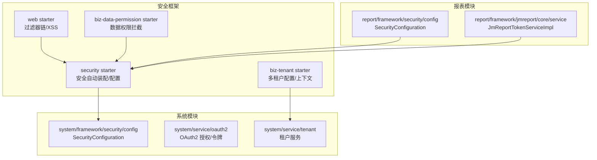
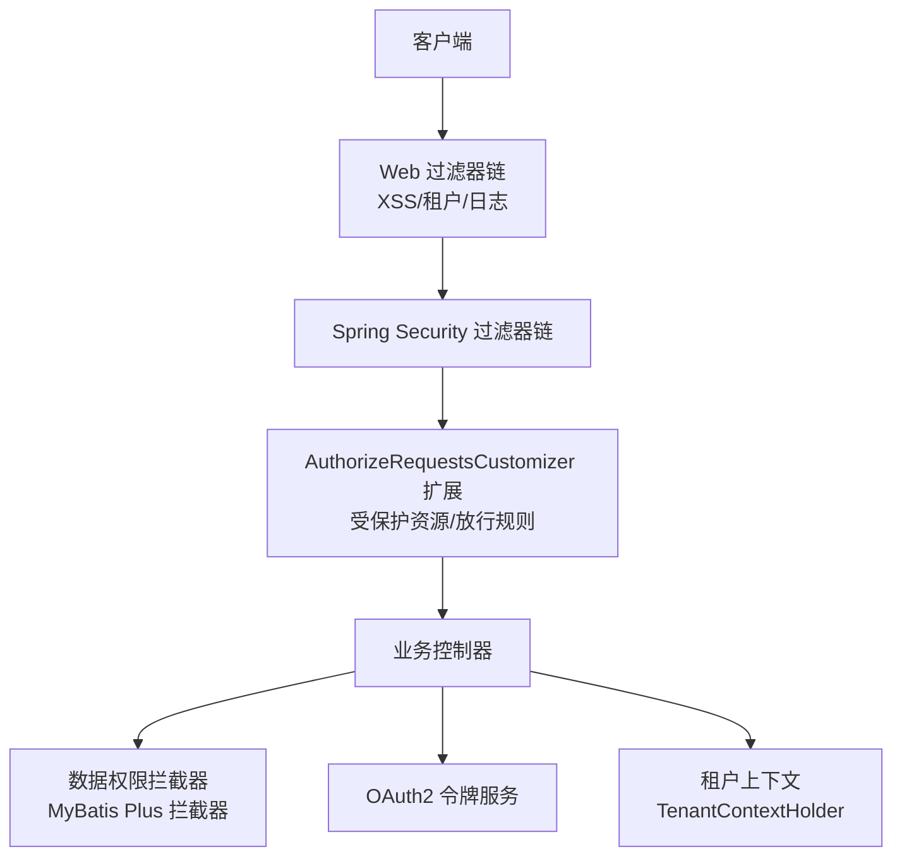
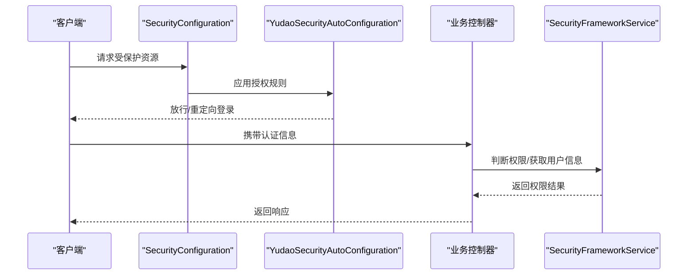
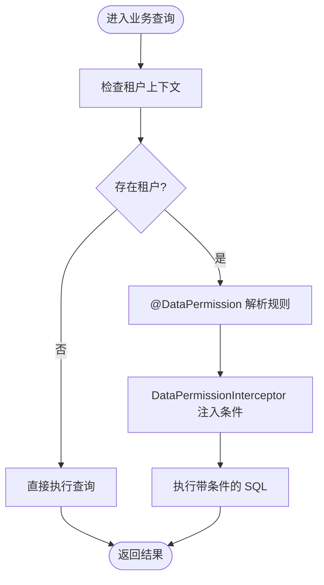
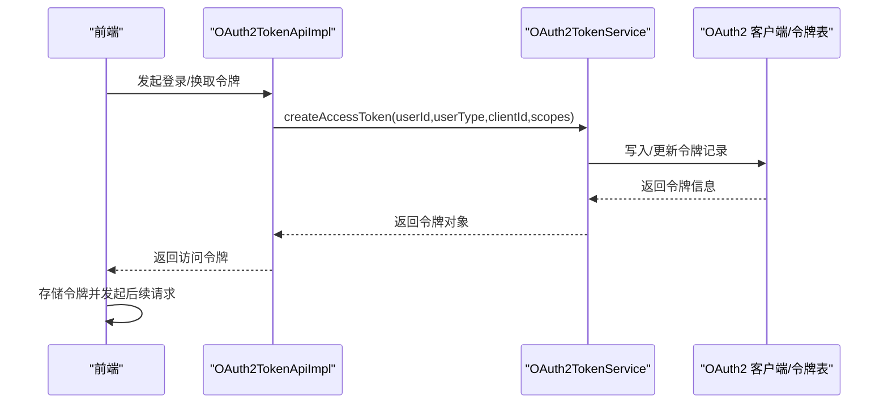
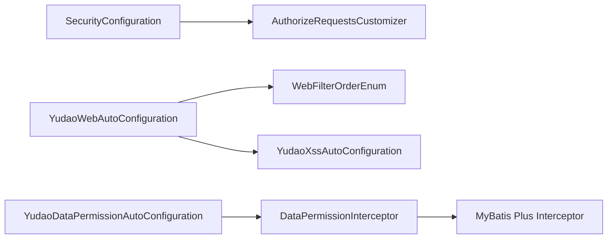

# 安全认证

<cite>
**本文引用的文件**
- [SecurityConfiguration.java](file://yudao-module-system/src/main/java/cn/iocoder/yudao/module/system/framework/security/config/SecurityConfiguration.java)
- [AuthorizeRequestsCustomizer.java](file://yudao-framework/yudao-spring-boot-starter-security/src/main/java/cn/iocoder/yudao/framework/security/config/AuthorizeRequestsCustomizer.java)
- [YudaoSecurityAutoConfiguration.java](file://yudao-framework/yudao-spring-boot-starter-security/src/main/java/cn/iocoder/yudao/framework/security/config/YudaoSecurityAutoConfiguration.java)
- [SecurityFrameworkService.java](file://yudao-framework/yudao-spring-boot-starter-security/src/main/java/cn/iocoder/yudao/framework/security/core/SecurityFrameworkService.java)
- [SecurityFrameworkUtils.java](file://yudao-framework/yudao-spring-boot-starter-security/src/main/java/cn/iocoder/yudao/framework/security/core/SecurityFrameworkUtils.java)
- [SecurityProperties.java](file://yudao-framework/yudao-spring-boot-starter-security/src/main/java/cn/iocoder/yudao/framework/security/core/SecurityProperties.java)
- [TenantProperties.java](file://yudao-framework/yudao-spring-boot-starter-biz-tenant/src/main/java/cn/iocoder/yudao/framework/tenant/config/TenantProperties.java)
- [TenantContextHolder.java](file://yudao-framework/yudao-spring-boot-starter-biz-tenant/src/main/java/cn/iocoder/yudao/framework/tenant/core/context/TenantContextHolder.java)
- [TenantUtils.java](file://yudao-framework/yudao-spring-boot-starter-biz-tenant/src/main/java/cn/iocoder/yudao/framework/tenant/core/util/TenantUtils.java)
- [TenantServiceImpl.java](file://yudao-module-system/src/main/java/cn/iocoder/yudao/module/system/service/tenant/TenantServiceImpl.java)
- [DataPermission.java](file://yudao-framework/yudao-spring-boot-starter-biz-data-permission/src/main/java/cn/iocoder/yudao/framework/datapermission/core/annotation/DataPermission.java)
- [YudaoDataPermissionAutoConfiguration.java](file://yudao-framework/yudao-spring-boot-starter-biz-data-permission/src/main/java/cn/iocoder/yudao/framework/datapermission/config/YudaoDataPermissionAutoConfiguration.java)
- [DataPermissionRule.java](file://yudao-framework/yudao-spring-boot-starter-biz-data-permission/src/main/java/cn/iocoder/yudao/framework/datapermission/core/rule/DataPermissionRule.java)
- [DataPermissionRuleHandler.java](file://yudao-framework/yudao-spring-boot-starter-biz-data-permission/src/main/java/cn/iocoder/yudao/framework/datapermission/core/handler/DataPermissionRuleHandler.java)
- [DataPermissionInterceptor.java](file://yudao-framework/yudao-spring-boot-starter-biz-data-permission/src/main/java/cn/iocoder/yudao/framework/datapermission/core/handler/DataPermissionInterceptor.java)
- [YudaoXssAutoConfiguration.java](file://yudao-framework/yudao-spring-boot-starter-web/src/main/java/cn/iocoder/yudao/framework/xss/config/YudaoXssAutoConfiguration.java)
- [WebFilterOrderEnum.java](file://yudao-framework/yudao-common/src/main/java/cn/iocoder/yudao/framework/common/enums/WebFilterOrderEnum.java)
- [YudaoWebAutoConfiguration.java](file://yudao-framework/yudao-spring-boot-starter-web/src/main/java/cn/iocoder/yudao/framework/web/config/YudaoWebAutoConfiguration.java)
- [OAuth2TokenApiImpl.java](file://yudao-module-system/src/main/java/cn/iocoder/yudao/module/system/api/oauth2/OAuth2TokenApiImpl.java)
- [OAuth2GrantService.java](file://yudao-module-system/src/main/java/cn/iocoder/yudao/module/system/service/oauth2/OAuth2GrantService.java)
- [JmReportTokenServiceImpl.java](file://yudao-module-report/src/main/java/cn/iocoder/yudao/module/report/framework/jmreport/core/service/JmReportTokenServiceImpl.java)
- [permission.ts](file://yudao-ui/yudao-ui-admin-vue3/src/utils/permission.ts)
- [auth.ts](file://yudao-ui/yudao-ui-admin-vue3/src/utils/auth.ts)
- [login/index.ts](file://yudao-ui/yudao-ui-admin-vue3/src/views/Login/index.ts)
- [login/oauth2/index.ts](file://yudao-ui/yudao-ui-admin-vue3/src/views/Login/oauth2/index.ts)
- [create_tables.sql](file://yudao-module-system/src/test/resources/sql/create_tables.sql)
</cite>

## 目录
1. [引言](#引言)
2. [项目结构](#项目结构)
3. [核心组件](#核心组件)
4. [架构总览](#架构总览)
5. [详细组件分析](#详细组件分析)
6. [依赖关系分析](#依赖关系分析)
7. [性能考虑](#性能考虑)
8. [故障排查指南](#故障排查指南)
9. [结论](#结论)
10. [附录](#附录)

## 引言
本专题文档围绕“芋道 Ruoyi-Vue-Pro”的安全认证体系展开，系统性阐述基于 Spring Security 的 RBAC 权限控制模型，覆盖用户认证、角色授权、菜单权限、按钮权限等多层次权限体系；说明多租户架构下的权限隔离机制与数据权限控制；介绍 Token 认证（含 JWT）的生成、刷新与失效策略；解析数据权限过滤的实现方式（动态 SQL、注解式控制、AOP 切面拦截）；并给出 OAuth2 第三方认证（微信、钉钉等）的集成思路与最佳实践。

## 项目结构
后端采用模块化分层设计，安全相关能力主要分布在以下模块与包：
- 安全框架与通用能力：yudao-framework 下的 security、web、biz-tenant、biz-data-permission 等 starter
- 系统模块：yudao-module-system 提供用户、角色、菜单、权限、租户、OAuth2 等核心能力
- 报表模块：yudao-module-report 展示如何透传 Token 以对接第三方报表服务
- 前端：yudao-ui-admin-vue3 提供权限指令、鉴权工具与登录流程

图示来源
- [SecurityConfiguration.java:1-120](file://yudao-module-system/src/main/java/cn/iocoder/yudao/module/system/framework/security/config/SecurityConfiguration.java#L1-L120)
- [YudaoSecurityAutoConfiguration.java:1-200](file://yudao-framework/yudao-spring-boot-starter-security/src/main/java/cn/iocoder/yudao/framework/security/config/YudaoSecurityAutoConfiguration.java#L1-L200)
- [YudaoWebAutoConfiguration.java:101-155](file://yudao-framework/yudao-spring-boot-starter-web/src/main/java/cn/iocoder/yudao/framework/web/config/YudaoWebAutoConfiguration.java#L101-L155)
- [TenantProperties.java:1-200](file://yudao-framework/yudao-spring-boot-starter-biz-tenant/src/main/java/cn/iocoder/yudao/framework/tenant/config/TenantProperties.java#L1-L200)
- [YudaoDataPermissionAutoConfiguration.java:29-46](file://yudao-framework/yudao-spring-boot-starter-biz-data-permission/src/main/java/cn/iocoder/yudao/framework/datapermission/config/YudaoDataPermissionAutoConfiguration.java#L29-L46)
- [JmReportTokenServiceImpl.java:31-61](file://yudao-module-report/src/main/java/cn/iocoder/yudao/module/report/framework/jmreport/core/service/JmReportTokenServiceImpl.java#L31-L61)

章节来源
- [SecurityConfiguration.java:1-120](file://yudao-module-system/src/main/java/cn/iocoder/yudao/module/system/framework/security/config/SecurityConfiguration.java#L1-L120)
- [YudaoSecurityAutoConfiguration.java:1-200](file://yudao-framework/yudao-spring-boot-starter-security/src/main/java/cn/iocoder/yudao/framework/security/config/YudaoSecurityAutoConfiguration.java#L1-L200)
- [YudaoWebAutoConfiguration.java:101-155](file://yudao-framework/yudao-spring-boot-starter-web/src/main/java/cn/iocoder/yudao/framework/web/config/YudaoWebAutoConfiguration.java#L101-L155)

## 核心组件
- 基于 Spring Security 的 RBAC 权限控制
  - 通过 AuthorizeRequestsCustomizer 扩展受保护资源与放行规则
  - 通过 SecurityFrameworkService 提供认证上下文、权限判断等能力
- 多租户权限隔离
  - TenantProperties 控制租户开关与维度
  - TenantContextHolder/TenantUtils 维护租户上下文
  - 租户维度的数据权限与业务权限联动
- Token 认证与 OAuth2
  - OAuth2TokenApiImpl/OAuth2GrantService 提供令牌发放、刷新、撤销
  - 前端 login/oauth2 流程对接第三方平台
- 数据权限过滤
  - @DataPermission 注解 + DataPermissionInterceptor + 规则工厂
  - MyBatis Plus 拦截器在 SQL 层面注入条件
- 前端权限控制
  - v-permission 指令与权限工具函数控制按钮显隐
  - 登录与 Token 管理

章节来源
- [AuthorizeRequestsCustomizer.java:1-200](file://yudao-framework/yudao-spring-boot-starter-security/src/main/java/cn/iocoder/yudao/framework/security/config/AuthorizeRequestsCustomizer.java#L1-L200)
- [SecurityFrameworkService.java:1-200](file://yudao-framework/yudao-spring-boot-starter-security/src/main/java/cn/iocoder/yudao/framework/security/core/SecurityFrameworkService.java#L1-L200)
- [SecurityFrameworkUtils.java:1-200](file://yudao-framework/yudao-spring-boot-starter-security/src/main/java/cn/iocoder/yudao/framework/security/core/SecurityFrameworkUtils.java#L1-L200)
- [TenantProperties.java:1-200](file://yudao-framework/yudao-spring-boot-starter-biz-tenant/src/main/java/cn/iocoder/yudao/framework/tenant/config/TenantProperties.java#L1-L200)
- [TenantContextHolder.java:1-200](file://yudao-framework/yudao-spring-boot-starter-biz-tenant/src/main/java/cn/iocoder/yudao/framework/tenant/core/context/TenantContextHolder.java#L1-L200)
- [TenantUtils.java:1-200](file://yudao-framework/yudao-spring-boot-starter-biz-tenant/src/main/java/cn/iocoder/yudao/framework/tenant/core/util/TenantUtils.java#L1-L200)
- [DataPermission.java:1-35](file://yudao-framework/yudao-spring-boot-starter-biz-data-permission/src/main/java/cn/iocoder/yudao/framework/datapermission/core/annotation/DataPermission.java#L1-L35)
- [YudaoDataPermissionAutoConfiguration.java:29-46](file://yudao-framework/yudao-spring-boot-starter-biz-data-permission/src/main/java/cn/iocoder/yudao/framework/datapermission/config/YudaoDataPermissionAutoConfiguration.java#L29-L46)
- [DataPermissionRule.java:1-200](file://yudao-framework/yudao-spring-boot-starter-biz-data-permission/src/main/java/cn/iocoder/yudao/framework/datapermission/core/rule/DataPermissionRule.java#L1-L200)
- [DataPermissionRuleHandler.java:1-200](file://yudao-framework/yudao-spring-boot-starter-biz-data-permission/src/main/java/cn/iocoder/yudao/framework/datapermission/core/handler/DataPermissionRuleHandler.java#L1-L200)
- [DataPermissionInterceptor.java:1-200](file://yudao-framework/yudao-spring-boot-starter-biz-data-permission/src/main/java/cn/iocoder/yudao/framework/datapermission/core/handler/DataPermissionInterceptor.java#L1-L200)
- [OAuth2TokenApiImpl.java:1-120](file://yudao-module-system/src/main/java/cn/iocoder/yudao/module/system/api/oauth2/OAuth2TokenApiImpl.java#L1-L120)
- [OAuth2GrantService.java:1-113](file://yudao-module-system/src/main/java/cn/iocoder/yudao/module/system/service/oauth2/OAuth2GrantService.java#L1-L113)
- [permission.ts:1-200](file://yudao-ui/yudao-ui-admin-vue3/src/utils/permission.ts#L1-L200)
- [auth.ts:1-200](file://yudao-ui/yudao-ui-admin-vue3/src/utils/auth.ts#L1-L200)
- [login/index.ts:1-200](file://yudao-ui/yudao-ui-admin-vue3/src/views/Login/index.ts#L1-L200)
- [login/oauth2/index.ts:1-200](file://yudao-ui/yudao-ui-admin-vue3/src/views/Login/oauth2/index.ts#L1-L200)

## 架构总览
整体安全架构由“配置层 + 运行时拦截层 + 业务层”构成：
- 配置层：各模块的 SecurityConfiguration 扩展授权规则
- 运行时拦截层：Spring Security 过滤器链 + Web 过滤器链（XSS、租户上下文、日志）
- 业务层：RBAC 权限判断、数据权限拦截、OAuth2 令牌发放与校验

图示来源
- [SecurityConfiguration.java:1-120](file://yudao-module-system/src/main/java/cn/iocoder/yudao/module/system/framework/security/config/SecurityConfiguration.java#L1-L120)
- [YudaoSecurityAutoConfiguration.java:1-200](file://yudao-framework/yudao-spring-boot-starter-security/src/main/java/cn/iocoder/yudao/framework/security/config/YudaoSecurityAutoConfiguration.java#L1-L200)
- [YudaoWebAutoConfiguration.java:101-155](file://yudao-framework/yudao-spring-boot-starter-web/src/main/java/cn/iocoder/yudao/framework/web/config/YudaoWebAutoConfiguration.java#L101-L155)
- [WebFilterOrderEnum.java:1-36](file://yudao-framework/yudao-common/src/main/java/cn/iocoder/yudao/framework/common/enums/WebFilterOrderEnum.java#L1-L36)
- [YudaoXssAutoConfiguration.java:26-62](file://yudao-framework/yudao-spring-boot-starter-web/src/main/java/cn/iocoder/yudao/framework/xss/config/YudaoXssAutoConfiguration.java#L26-L62)
- [YudaoDataPermissionAutoConfiguration.java:29-46](file://yudao-framework/yudao-spring-boot-starter-biz-data-permission/src/main/java/cn/iocoder/yudao/framework/datapermission/config/YudaoDataPermissionAutoConfiguration.java#L29-L46)

## 详细组件分析

### 基于 Spring Security 的 RBAC 权限控制
- 授权扩展
  - 通过 AuthorizeRequestsCustomizer 在 HttpSecurity 上注册受保护路径与放行规则
  - 各模块可按需扩展，如 OpsHub/Report 模块提供各自的 AuthorizeRequestsCustomizer Bean
- 认证上下文
  - SecurityFrameworkService 提供获取当前用户、判断权限等能力
  - SecurityFrameworkUtils 提供统一的 Authorization 头格式与常量
- 前端权限控制
  - v-permission 指令与权限工具函数控制按钮显隐
  - 登录成功后根据用户权限动态渲染菜单与按钮

图示来源
- [SecurityConfiguration.java:1-120](file://yudao-module-system/src/main/java/cn/iocoder/yudao/module/system/framework/security/config/SecurityConfiguration.java#L1-L120)
- [YudaoSecurityAutoConfiguration.java:1-200](file://yudao-framework/yudao-spring-boot-starter-security/src/main/java/cn/iocoder/yudao/framework/security/config/YudaoSecurityAutoConfiguration.java#L1-L200)
- [SecurityFrameworkService.java:1-200](file://yudao-framework/yudao-spring-boot-starter-security/src/main/java/cn/iocoder/yudao/framework/security/core/SecurityFrameworkService.java#L1-L200)

章节来源
- [AuthorizeRequestsCustomizer.java:1-200](file://yudao-framework/yudao-spring-boot-starter-security/src/main/java/cn/iocoder/yudao/framework/security/config/AuthorizeRequestsCustomizer.java#L1-L200)
- [SecurityFrameworkService.java:1-200](file://yudao-framework/yudao-spring-boot-starter-security/src/main/java/cn/iocoder/yudao/framework/security/core/SecurityFrameworkService.java#L1-L200)
- [SecurityFrameworkUtils.java:1-200](file://yudao-framework/yudao-spring-boot-starter-security/src/main/java/cn/iocoder/yudao/framework/security/core/SecurityFrameworkUtils.java#L1-L200)
- [permission.ts:1-200](file://yudao-ui/yudao-ui-admin-vue3/src/utils/permission.ts#L1-L200)

### 多租户架构下的权限隔离与数据权限
- 租户上下文
  - TenantProperties 控制租户开关与维度
  - TenantContextHolder/TenantUtils 在请求链路中维护租户 ID
- 业务权限与租户联动
  - 租户维度的角色、菜单、数据权限相互约束
  - 租户服务实现中体现对租户维度的控制
- 数据权限过滤
  - @DataPermission 注解用于声明启用/排除特定规则
  - DataPermissionInterceptor 基于 MyBatis Plus 在 SQL 层注入条件
  - DataPermissionRuleFactory/RuleHandler 管理规则注册与执行

图示来源
- [TenantProperties.java:1-200](file://yudao-framework/yudao-spring-boot-starter-biz-tenant/src/main/java/cn/iocoder/yudao/framework/tenant/config/TenantProperties.java#L1-L200)
- [TenantContextHolder.java:1-200](file://yudao-framework/yudao-spring-boot-starter-biz-tenant/src/main/java/cn/iocoder/yudao/framework/tenant/core/context/TenantContextHolder.java#L1-L200)
- [TenantUtils.java:1-200](file://yudao-framework/yudao-spring-boot-starter-biz-tenant/src/main/java/cn/iocoder/yudao/framework/tenant/core/util/TenantUtils.java#L1-L200)
- [DataPermission.java:1-35](file://yudao-framework/yudao-spring-boot-starter-biz-data-permission/src/main/java/cn/iocoder/yudao/framework/datapermission/core/annotation/DataPermission.java#L1-L35)
- [YudaoDataPermissionAutoConfiguration.java:29-46](file://yudao-framework/yudao-spring-boot-starter-biz-data-permission/src/main/java/cn/iocoder/yudao/framework/datapermission/config/YudaoDataPermissionAutoConfiguration.java#L29-L46)
- [DataPermissionInterceptor.java:1-200](file://yudao-framework/yudao-spring-boot-starter-biz-data-permission/src/main/java/cn/iocoder/yudao/framework/datapermission/core/handler/DataPermissionInterceptor.java#L1-L200)

章节来源
- [TenantServiceImpl.java:1-200](file://yudao-module-system/src/main/java/cn/iocoder/yudao/module/system/service/tenant/TenantServiceImpl.java#L1-L200)
- [DataPermissionRule.java:1-200](file://yudao-framework/yudao-spring-boot-starter-biz-data-permission/src/main/java/cn/iocoder/yudao/framework/datapermission/core/rule/DataPermissionRule.java#L1-L200)
- [DataPermissionRuleHandler.java:1-200](file://yudao-framework/yudao-spring-boot-starter-biz-data-permission/src/main/java/cn/iocoder/yudao/framework/datapermission/core/handler/DataPermissionRuleHandler.java#L1-L200)

### Token 认证机制（JWT/令牌）
- 令牌发放与校验
  - OAuth2TokenApiImpl 调用 OAuth2TokenService 创建访问令牌
  - OAuth2GrantService 提供多种授权模式（简化、密码、刷新、客户端）与撤销
- 前端登录与存储
  - 登录页完成认证后，前端将 Token 存储在本地并携带在后续请求头中
  - v-permission 指令结合权限工具函数控制按钮显示
- 第三方报表透传
  - JmReportTokenServiceImpl 从请求头读取第三方 Token，并转换为系统所需的 Authorization 头格式

图示来源
- [OAuth2TokenApiImpl.java:1-120](file://yudao-module-system/src/main/java/cn/iocoder/yudao/module/system/api/oauth2/OAuth2TokenApiImpl.java#L1-L120)
- [OAuth2GrantService.java:1-113](file://yudao-module-system/src/main/java/cn/iocoder/yudao/module/system/service/oauth2/OAuth2GrantService.java#L1-L113)
- [create_tables.sql:420-443](file://yudao-module-system/src/test/resources/sql/create_tables.sql#L420-L443)
- [login/index.ts:1-200](file://yudao-ui/yudao-ui-admin-vue3/src/views/Login/index.ts#L1-L200)
- [auth.ts:1-200](file://yudao-ui/yudao-ui-admin-vue3/src/utils/auth.ts#L1-L200)
- [JmReportTokenServiceImpl.java:31-61](file://yudao-module-report/src/main/java/cn/iocoder/yudao/module/report/framework/jmreport/core/service/JmReportTokenServiceImpl.java#L31-L61)

章节来源
- [SecurityFrameworkUtils.java:1-200](file://yudao-framework/yudao-spring-boot-starter-security/src/main/java/cn/iocoder/yudao/framework/security/core/SecurityFrameworkUtils.java#L1-L200)
- [login/oauth2/index.ts:1-200](file://yudao-ui/yudao-ui-admin-vue3/src/views/Login/oauth2/index.ts#L1-L200)

### OAuth2 第三方认证集成（微信、钉钉等）
- 登录流程
  - 前端跳转至第三方 OAuth2 授权页面，回调后换取系统内部访问令牌
  - 后端通过 OAuth2 授权服务发放令牌并持久化
- 资源访问
  - 前端在请求头中携带系统令牌访问受保护资源
  - 第三方报表服务通过自定义 Header 透传 Token 并转换为系统所需格式

章节来源
- [login/oauth2/index.ts:1-200](file://yudao-ui/yudao-ui-admin-vue3/src/views/Login/oauth2/index.ts#L1-L200)
- [OAuth2TokenApiImpl.java:1-120](file://yudao-module-system/src/main/java/cn/iocoder/yudao/module/system/api/oauth2/OAuth2TokenApiImpl.java#L1-L120)
- [JmReportTokenServiceImpl.java:31-61](file://yudao-module-report/src/main/java/cn/iocoder/yudao/module/report/framework/jmreport/core/service/JmReportTokenServiceImpl.java#L31-L61)

### 前端权限控制（菜单/按钮）
- 指令与工具
  - v-permission 指令用于按钮级权限控制
  - 权限工具函数判断用户是否具备某项操作权限
- 菜单渲染
  - 登录成功后根据用户权限动态生成菜单树，避免加载无权限菜单

章节来源
- [permission.ts:1-200](file://yudao-ui/yudao-ui-admin-vue3/src/utils/permission.ts#L1-L200)

## 依赖关系分析
- 组件耦合
  - 各模块的 SecurityConfiguration 依赖 AuthorizeRequestsCustomizer
  - Web 过滤器链顺序由 WebFilterOrderEnum 统一管理，确保 XSS、租户上下文、日志等按序执行
  - 数据权限拦截器需位于分页插件之前，保证规则优先生效
- 外部依赖
  - Spring Security、MyBatis Plus Interceptor、Jackson 序列化器

图示来源
- [SecurityConfiguration.java:1-120](file://yudao-module-system/src/main/java/cn/iocoder/yudao/module/system/framework/security/config/SecurityConfiguration.java#L1-L120)
- [AuthorizeRequestsCustomizer.java:1-200](file://yudao-framework/yudao-spring-boot-starter-security/src/main/java/cn/iocoder/yudao/framework/security/config/AuthorizeRequestsCustomizer.java#L1-L200)
- [YudaoWebAutoConfiguration.java:101-155](file://yudao-framework/yudao-spring-boot-starter-web/src/main/java/cn/iocoder/yudao/framework/web/config/YudaoWebAutoConfiguration.java#L101-L155)
- [WebFilterOrderEnum.java:1-36](file://yudao-framework/yudao-common/src/main/java/cn/iocoder/yudao/framework/common/enums/WebFilterOrderEnum.java#L1-L36)
- [YudaoXssAutoConfiguration.java:26-62](file://yudao-framework/yudao-spring-boot-starter-web/src/main/java/cn/iocoder/yudao/framework/xss/config/YudaoXssAutoConfiguration.java#L26-L62)
- [YudaoDataPermissionAutoConfiguration.java:29-46](file://yudao-framework/yudao-spring-boot-starter-biz-data-permission/src/main/java/cn/iocoder/yudao/framework/datapermission/config/YudaoDataPermissionAutoConfiguration.java#L29-L46)

章节来源
- [WebFilterOrderEnum.java:1-36](file://yudao-framework/yudao-common/src/main/java/cn/iocoder/yudao/framework/common/enums/WebFilterOrderEnum.java#L1-L36)
- [YudaoDataPermissionAutoConfiguration.java:29-46](file://yudao-framework/yudao-spring-boot-starter-biz-data-permission/src/main/java/cn/iocoder/yudao/framework/datapermission/config/YudaoDataPermissionAutoConfiguration.java#L29-L46)

## 性能考虑
- 过滤器链顺序
  - 明确的执行顺序可避免重复处理与性能损耗
- 数据权限拦截
  - 将拦截器置于分页插件之前，减少无效查询
- Token 策略
  - 合理设置过期时间与刷新策略，降低频繁鉴权开销
- XSS 过滤
  - JSON 反序列化时进行清理，避免重复扫描

## 故障排查指南
- 登录后仍提示未登录
  - 检查前端是否正确存储 Token，请求头是否携带 Authorization
  - 核对 SecurityConfiguration 的放行规则与受保护路径
- 按钮/菜单显示异常
  - 检查权限工具函数与 v-permission 指令使用
  - 确认用户角色与权限映射正确
- 查询越权或无数据
  - 检查 @DataPermission 注解与规则是否生效
  - 确认租户上下文是否正确设置
- XSS 过滤导致字段异常
  - 检查 XssFilter 配置与路径匹配
  - 关注 Jackson 反序列化器的字符串清理行为

章节来源
- [SecurityConfiguration.java:1-120](file://yudao-module-system/src/main/java/cn/iocoder/yudao/module/system/framework/security/config/SecurityConfiguration.java#L1-L120)
- [YudaoXssAutoConfiguration.java:26-62](file://yudao-framework/yudao-spring-boot-starter-web/src/main/java/cn/iocoder/yudao/framework/xss/config/YudaoXssAutoConfiguration.java#L26-L62)
- [DataPermission.java:1-35](file://yudao-framework/yudao-spring-boot-starter-biz-data-permission/src/main/java/cn/iocoder/yudao/framework/datapermission/core/annotation/DataPermission.java#L1-L35)

## 结论
本项目通过 Spring Security 与自研安全框架，构建了完善的 RBAC 权限体系；结合多租户与数据权限拦截，实现了租户维度的权限隔离与数据安全；借助 OAuth2 令牌机制与前端权限指令，提供了灵活的第三方认证与细粒度的前端控制。建议在生产环境中严格遵循安全配置最佳实践，持续优化过滤器链顺序与数据权限规则，保障系统整体安全性与性能。

## 附录
- 安全配置最佳实践
  - 密码加密：使用强哈希算法与盐值，定期轮换密钥
  - 防暴力破解：限制登录尝试次数、引入验证码与滑动验证
  - XSS 防护：启用 XssFilter 与 Jackson 清理器，白名单策略
  - 令牌安全：短有效期 + 刷新令牌 + 网络传输加密
  - 日志审计：记录登录、权限变更、敏感操作日志
- 常见问题与解决方案
  - 令牌过期：前端自动刷新或引导重新登录
  - 权限不生效：检查规则优先级与租户上下文
  - 跨域问题：确认 CORS 配置与顺序