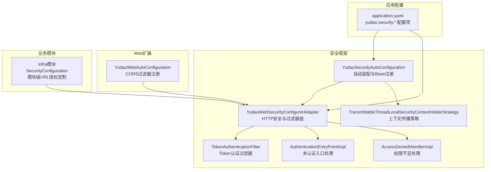
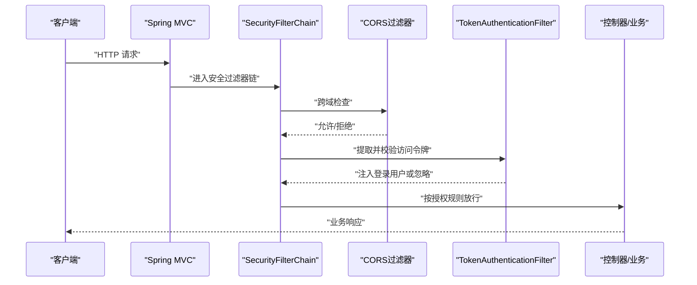
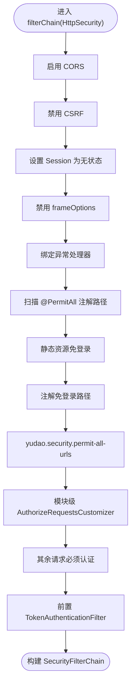
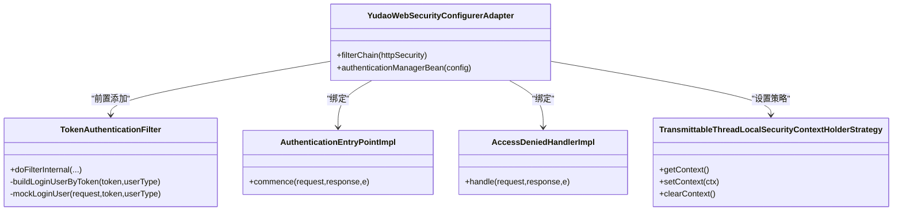
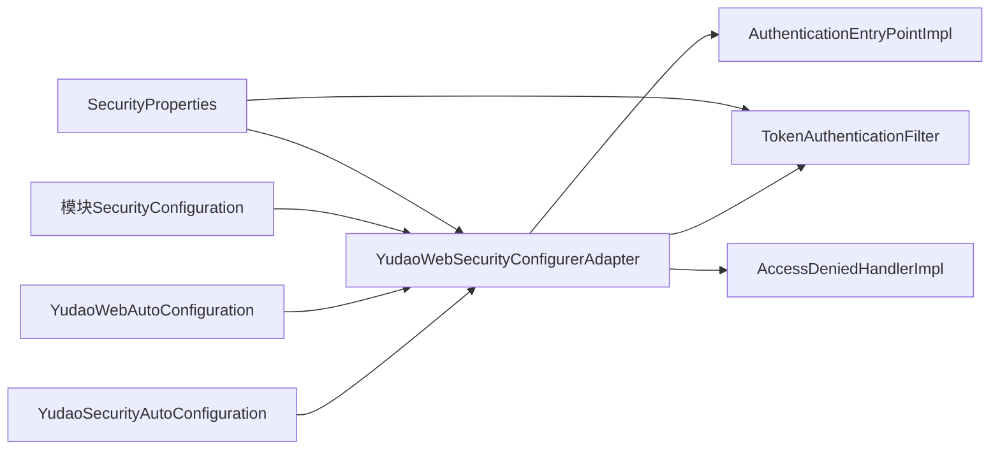

# 安全配置管理

<cite>
**本文引用的文件**
- [YudaoWebSecurityConfigurerAdapter.java](file://yudao-framework/yudao-spring-boot-starter-security/src/main/java/cn/iocoder/yudao/framework/security/config/YudaoWebSecurityConfigurerAdapter.java)
- [YudaoSecurityAutoConfiguration.java](file://yudao-framework/yudao-spring-boot-starter-security/src/main/java/cn/iocoder/yudao/framework/security/config/YudaoSecurityAutoConfiguration.java)
- [SecurityProperties.java](file://yudao-framework/yudao-spring-boot-starter-security/src/main/java/cn/iocoder/yudao/framework/security/config/SecurityProperties.java)
- [TokenAuthenticationFilter.java](file://yudao-framework/yudao-spring-boot-starter-security/src/main/java/cn/iocoder/yudao/framework/security/core/filter/TokenAuthenticationFilter.java)
- [AuthenticationEntryPointImpl.java](file://yudao-framework/yudao-spring-boot-starter-security/src/main/java/cn/iocoder/yudao/framework/security/core/handler/AuthenticationEntryPointImpl.java)
- [AccessDeniedHandlerImpl.java](file://yudao-framework/yudao-spring-boot-starter-security/src/main/java/cn/iocoder/yudao/framework/security/core/handler/AccessDeniedHandlerImpl.java)
- [TransmittableThreadLocalSecurityContextHolderStrategy.java](file://yudao-framework/yudao-spring-boot-starter-security/src/main/java/cn/iocoder/yudao/framework/security/core/context/TransmittableThreadLocalSecurityContextHolderStrategy.java)
- [YudaoWebAutoConfiguration.java](file://yudao-framework/yudao-spring-boot-starter-web/src/main/java/cn/iocoder/yudao/framework/web/config/YudaoWebAutoConfiguration.java)
- [SecurityConfiguration.java（infra模块）](file://yudao-module-infra/src/main/java/cn/iocoder/yudao/module/infra/framework/security/config/SecurityConfiguration.java)
- [application.yaml（主应用）](file://yudao-server/src/main/resources/application.yaml)
</cite>

## 目录
1. [简介](#简介)
2. [项目结构](#项目结构)
3. [核心组件](#核心组件)
4. [架构总览](#架构总览)
5. [详细组件分析](#详细组件分析)
6. [依赖分析](#依赖分析)
7. [性能考量](#性能考量)
8. [故障排查指南](#故障排查指南)
9. [结论](#结论)
10. [附录](#附录)

## 简介
本文件面向安全配置管理模块，系统性梳理并说明本项目中基于 Spring Security 的安全配置与扩展能力，覆盖以下主题：
- HTTP 安全配置、CORS 跨域配置、CSRF 防护配置
- 密码加密策略（BCrypt）、密码强度校验与密码历史记录（概念性说明）
- 会话管理配置（单点登录、会话超时、并发会话控制）
- 安全过滤器链的配置与自定义（登录过滤器、权限过滤器、跨域过滤器）
- 最佳实践与性能优化（安全日志、异常处理、安全审计）

## 项目结构
围绕安全配置的关键目录与文件如下：
- 安全自动装配与适配器：yudao-framework/yudao-spring-boot-starter-security
- Web 跨域自动装配：yudao-framework/yudao-spring-boot-starter-web
- 各业务模块安全定制：yudao-module-infra 等
- 主应用配置：yudao-server/src/main/resources/application.yaml

**图表来源**
- [YudaoSecurityAutoConfiguration.java:32-94](file://yudao-framework/yudao-spring-boot-starter-security/src/main/java/cn/iocoder/yudao/framework/security/config/YudaoSecurityAutoConfiguration.java#L32-L94)
- [YudaoWebSecurityConfigurerAdapter.java:46-153](file://yudao-framework/yudao-spring-boot-starter-security/src/main/java/cn/iocoder/yudao/framework/security/config/YudaoWebSecurityConfigurerAdapter.java#L46-L153)
- [TokenAuthenticationFilter.java:31-119](file://yudao-framework/yudao-spring-boot-starter-security/src/main/java/cn/iocoder/yudao/framework/security/core/filter/TokenAuthenticationFilter.java#L31-L119)
- [AuthenticationEntryPointImpl.java:24-35](file://yudao-framework/yudao-spring-boot-starter-security/src/main/java/cn/iocoder/yudao/framework/security/core/handler/AuthenticationEntryPointImpl.java#L24-L35)
- [AccessDeniedHandlerImpl.java:27-41](file://yudao-framework/yudao-spring-boot-starter-security/src/main/java/cn/iocoder/yudao/framework/security/core/handler/AccessDeniedHandlerImpl.java#L27-L41)
- [TransmittableThreadLocalSecurityContextHolderStrategy.java:15-48](file://yudao-framework/yudao-spring-boot-starter-security/src/main/java/cn/iocoder/yudao/framework/security/core/context/TransmittableThreadLocalSecurityContextHolderStrategy.java#L15-L48)
- [YudaoWebAutoConfiguration.java:106-119](file://yudao-framework/yudao-spring-boot-starter-web/src/main/java/cn/iocoder/yudao/framework/web/config/YudaoWebAutoConfiguration.java#L106-L119)
- [SecurityConfiguration.java（infra模块）:12-38](file://yudao-module-infra/src/main/java/cn/iocoder/yudao/module/infra/framework/security/config/SecurityConfiguration.java#L12-L38)
- [application.yaml（主应用）:272-281](file://yudao-server/src/main/resources/application.yaml#L272-L281)

**章节来源**
- [YudaoSecurityAutoConfiguration.java:32-94](file://yudao-framework/yudao-spring-boot-starter-security/src/main/java/cn/iocoder/yudao/framework/security/config/YudaoSecurityAutoConfiguration.java#L32-L94)
- [YudaoWebSecurityConfigurerAdapter.java:46-153](file://yudao-framework/yudao-spring-boot-starter-security/src/main/java/cn/iocoder/yudao/framework/security/config/YudaoWebSecurityConfigurerAdapter.java#L46-L153)
- [YudaoWebAutoConfiguration.java:106-119](file://yudao-framework/yudao-spring-boot-starter-web/src/main/java/cn/iocoder/yudao/framework/web/config/YudaoWebAutoConfiguration.java#L106-L119)
- [SecurityConfiguration.java（infra模块）:12-38](file://yudao-module-infra/src/main/java/cn/iocoder/yudao/module/infra/framework/security/config/SecurityConfiguration.java#L12-L38)
- [application.yaml（主应用）:272-281](file://yudao-server/src/main/resources/application.yaml#L272-L281)

## 核心组件
- 安全自动装配与Bean注册：负责认证入口、权限不足处理、密码编码器、Token认证过滤器、安全上下文策略等。
- HTTP 安全适配器：统一配置 CORS、CSRF、Session 策略、异常处理、URL 授权规则与过滤器链。
- Token 认证过滤器：从请求中提取访问令牌，校验有效性并注入当前登录用户上下文。
- 异常处理器：未认证与权限不足的统一响应。
- Web 跨域配置：全局 CORS 过滤器注册。
- 模块级授权定制：通过 AuthorizeRequestsCustomizer 为不同模块开放特定路径。

**章节来源**
- [YudaoSecurityAutoConfiguration.java:43-92](file://yudao-framework/yudao-spring-boot-starter-security/src/main/java/cn/iocoder/yudao/framework/security/config/YudaoSecurityAutoConfiguration.java#L43-L92)
- [YudaoWebSecurityConfigurerAdapter.java:110-153](file://yudao-framework/yudao-spring-boot-starter-security/src/main/java/cn/iocoder/yudao/framework/security/config/YudaoWebSecurityConfigurerAdapter.java#L110-L153)
- [TokenAuthenticationFilter.java:40-69](file://yudao-framework/yudao-spring-boot-starter-security/src/main/java/cn/iocoder/yudao/framework/security/core/filter/TokenAuthenticationFilter.java#L40-L69)
- [AuthenticationEntryPointImpl.java:28-33](file://yudao-framework/yudao-spring-boot-starter-security/src/main/java/cn/iocoder/yudao/framework/security/core/handler/AuthenticationEntryPointImpl.java#L28-L33)
- [AccessDeniedHandlerImpl.java:31-39](file://yudao-framework/yudao-spring-boot-starter-security/src/main/java/cn/iocoder/yudao/framework/security/core/handler/AccessDeniedHandlerImpl.java#L31-L39)
- [YudaoWebAutoConfiguration.java:106-119](file://yudao-framework/yudao-spring-boot-starter-web/src/main/java/cn/iocoder/yudao/framework/web/config/YudaoWebAutoConfiguration.java#L106-L119)
- [SecurityConfiguration.java（infra模块）:15-36](file://yudao-module-infra/src/main/java/cn/iocoder/yudao/module/infra/framework/security/config/SecurityConfiguration.java#L15-L36)

## 架构总览
整体安全架构由“自动装配 + HTTP 安全适配器 + 过滤器链 + 异常处理 + 跨域配置 + 模块定制”构成，形成从请求进入、鉴权放行、异常统一响应到跨域放通的闭环。

**图表来源**
- [YudaoWebSecurityConfigurerAdapter.java:110-153](file://yudao-framework/yudao-spring-boot-starter-security/src/main/java/cn/iocoder/yudao/framework/security/config/YudaoWebSecurityConfigurerAdapter.java#L110-L153)
- [YudaoWebAutoConfiguration.java:106-119](file://yudao-framework/yudao-spring-boot-starter-web/src/main/java/cn/iocoder/yudao/framework/web/config/YudaoWebAutoConfiguration.java#L106-L119)
- [TokenAuthenticationFilter.java:40-69](file://yudao-framework/yudao-spring-boot-starter-security/src/main/java/cn/iocoder/yudao/framework/security/core/filter/TokenAuthenticationFilter.java#L40-L69)

## 详细组件分析

### HTTP 安全配置
- CORS：启用 .cors() 并在 Web 自动装配中注册 CorsFilter，确保跨域配置生效。
- CSRF：禁用 .csrf()，配合 STATELESS 会话策略，适用于无状态令牌场景。
- Session：设置 SessionCreationPolicy.STATELESS，避免会话粘滞。
- Headers：禁用 frameOptions，便于嵌套场景（如某些监控页面）。
- 异常处理：绑定 AuthenticationEntryPoint 与 AccessDeniedHandler。
- URL 授权：
  - 通过扫描 @PermitAll 注解动态收集免登录路径；
  - 读取 yudao.security.permit-all-urls 配置；
  - 通过 AuthorizeRequestsCustomizer 注入模块级规则；
  - 任何未匹配请求均需认证。

**图表来源**
- [YudaoWebSecurityConfigurerAdapter.java:110-153](file://yudao-framework/yudao-spring-boot-starter-security/src/main/java/cn/iocoder/yudao/framework/security/config/YudaoWebSecurityConfigurerAdapter.java#L110-L153)

**章节来源**
- [YudaoWebSecurityConfigurerAdapter.java:110-153](file://yudao-framework/yudao-spring-boot-starter-security/src/main/java/cn/iocoder/yudao/framework/security/config/YudaoWebSecurityConfigurerAdapter.java#L110-L153)

### CORS 跨域配置
- 在 Web 自动装配中创建 CorsFilter，并设置 AllowCredentials、AllowedOriginPattern、AllowedHeader、AllowedMethod。
- 通过 FilterRegistrationBean 注册，设置执行顺序优先级，避免跨域配置不生效。

**章节来源**
- [YudaoWebAutoConfiguration.java:106-119](file://yudao-framework/yudao-spring-boot-starter-web/src/main/java/cn/iocoder/yudao/framework/web/config/YudaoWebAutoConfiguration.java#L106-L119)

### CSRF 防护配置
- 在 HTTP 安全适配器中显式禁用 .csrf()，与无状态令牌方案保持一致。
- 若未来引入基于 Session 的登录场景，应评估开启 CSRF 并配置相应的 CSRF Token 策略。

**章节来源**
- [YudaoWebSecurityConfigurerAdapter.java:115-116](file://yudao-framework/yudao-spring-boot-starter-security/src/main/java/cn/iocoder/yudao/framework/security/config/YudaoWebSecurityConfigurerAdapter.java#L115-L116)

### 会话管理配置
- 当前实现为无状态（STATELESS），不涉及传统会话超时与并发会话控制。
- 若需引入基于 Session 的登录：
  - 可调整 SessionCreationPolicy；
  - 可通过 Spring Session 或 Redis 实现分布式会话；
  - 可结合最大并发会话数、强制退出等策略实现并发控制。

**章节来源**
- [YudaoWebSecurityConfigurerAdapter.java:117-118](file://yudao-framework/yudao-spring-boot-starter-security/src/main/java/cn/iocoder/yudao/framework/security/config/YudaoWebSecurityConfigurerAdapter.java#L117-L118)

### 密码加密策略
- 采用 BCryptPasswordEncoder，复杂度由 yudao.security.password-encoder-length 控制。
- 建议：
  - 生产环境适当提高复杂度；
  - 与密码强度校验（最小长度、字符集要求）配合；
  - 密码历史记录建议通过业务层实现，防止重复使用历史密码。

**章节来源**
- [YudaoSecurityAutoConfiguration.java:62-65](file://yudao-framework/yudao-spring-boot-starter-security/src/main/java/cn/iocoder/yudao/framework/security/config/YudaoSecurityAutoConfiguration.java#L62-L65)
- [SecurityProperties.java:48-50](file://yudao-framework/yudao-spring-boot-starter-security/src/main/java/cn/iocoder/yudao/framework/security/config/SecurityProperties.java#L48-L50)

### 安全过滤器链与自定义
- TokenAuthenticationFilter：从请求头或参数中提取访问令牌，调用 OAuth2TokenCommonApi 校验，成功后将 LoginUser 写入安全上下文。
- 异常处理：
  - AuthenticationEntryPointImpl：未认证返回统一错误；
  - AccessDeniedHandlerImpl：权限不足返回统一错误。
- 安全上下文传播：使用 TransmittableThreadLocal 策略，保障异步场景下的上下文可用。

**图表来源**
- [YudaoWebSecurityConfigurerAdapter.java:46-153](file://yudao-framework/yudao-spring-boot-starter-security/src/main/java/cn/iocoder/yudao/framework/security/config/YudaoWebSecurityConfigurerAdapter.java#L46-L153)
- [TokenAuthenticationFilter.java:31-119](file://yudao-framework/yudao-spring-boot-starter-security/src/main/java/cn/iocoder/yudao/framework/security/core/filter/TokenAuthenticationFilter.java#L31-L119)
- [AuthenticationEntryPointImpl.java:24-35](file://yudao-framework/yudao-spring-boot-starter-security/src/main/java/cn/iocoder/yudao/framework/security/core/handler/AuthenticationEntryPointImpl.java#L24-L35)
- [AccessDeniedHandlerImpl.java:27-41](file://yudao-framework/yudao-spring-boot-starter-security/src/main/java/cn/iocoder/yudao/framework/security/core/handler/AccessDeniedHandlerImpl.java#L27-L41)
- [TransmittableThreadLocalSecurityContextHolderStrategy.java:15-48](file://yudao-framework/yudao-spring-boot-starter-security/src/main/java/cn/iocoder/yudao/framework/security/core/context/TransmittableThreadLocalSecurityContextHolderStrategy.java#L15-L48)

**章节来源**
- [TokenAuthenticationFilter.java:40-93](file://yudao-framework/yudao-spring-boot-starter-security/src/main/java/cn/iocoder/yudao/framework/security/core/filter/TokenAuthenticationFilter.java#L40-L93)
- [AuthenticationEntryPointImpl.java:28-33](file://yudao-framework/yudao-spring-boot-starter-security/src/main/java/cn/iocoder/yudao/framework/security/core/handler/AuthenticationEntryPointImpl.java#L28-L33)
- [AccessDeniedHandlerImpl.java:31-39](file://yudao-framework/yudao-spring-boot-starter-security/src/main/java/cn/iocoder/yudao/framework/security/core/handler/AccessDeniedHandlerImpl.java#L31-L39)
- [TransmittableThreadLocalSecurityContextHolderStrategy.java:15-48](file://yudao-framework/yudao-spring-boot-starter-security/src/main/java/cn/iocoder/yudao/framework/security/core/context/TransmittableThreadLocalSecurityContextHolderStrategy.java#L15-L48)

### 模块级授权定制
- 通过 AuthorizeRequestsCustomizer Bean 为模块开放特定路径（如 Swagger、Actuator、Druid、文件读取等）。
- 该机制与全局免登录列表互补，实现“全局共享规则 + 模块自定义规则 + 兜底必须认证”。

**章节来源**
- [SecurityConfiguration.java（infra模块）:15-36](file://yudao-module-infra/src/main/java/cn/iocoder/yudao/module/infra/framework/security/config/SecurityConfiguration.java#L15-L36)
- [YudaoWebSecurityConfigurerAdapter.java:128-148](file://yudao-framework/yudao-spring-boot-starter-security/src/main/java/cn/iocoder/yudao/framework/security/config/YudaoWebSecurityConfigurerAdapter.java#L128-L148)

## 依赖分析
- 自动装配与适配器解耦：YudaoSecurityAutoConfiguration 负责 Bean 注册，YudaoWebSecurityConfigurerAdapter 负责 HTTP 安全策略，避免初始化冲突。
- 过滤器链依赖：TokenAuthenticationFilter 依赖 SecurityProperties、GlobalExceptionHandler、OAuth2TokenCommonApi。
- 模块扩展：各模块通过 AuthorizeRequestsCustomizer 注入授权规则，增强可维护性。

**图表来源**
- [YudaoSecurityAutoConfiguration.java:32-94](file://yudao-framework/yudao-spring-boot-starter-security/src/main/java/cn/iocoder/yudao/framework/security/config/YudaoSecurityAutoConfiguration.java#L32-L94)
- [YudaoWebSecurityConfigurerAdapter.java:46-153](file://yudao-framework/yudao-spring-boot-starter-security/src/main/java/cn/iocoder/yudao/framework/security/config/YudaoWebSecurityConfigurerAdapter.java#L46-L153)
- [YudaoWebAutoConfiguration.java:106-119](file://yudao-framework/yudao-spring-boot-starter-web/src/main/java/cn/iocoder/yudao/framework/web/config/YudaoWebAutoConfiguration.java#L106-L119)
- [SecurityConfiguration.java（infra模块）:12-38](file://yudao-module-infra/src/main/java/cn/iocoder/yudao/module/infra/framework/security/config/SecurityConfiguration.java#L12-L38)
- [SecurityProperties.java:12-51](file://yudao-framework/yudao-spring-boot-starter-security/src/main/java/cn/iocoder/yudao/framework/security/config/SecurityProperties.java#L12-L51)

**章节来源**
- [YudaoSecurityAutoConfiguration.java:32-94](file://yudao-framework/yudao-spring-boot-starter-security/src/main/java/cn/iocoder/yudao/framework/security/config/YudaoSecurityAutoConfiguration.java#L32-L94)
- [YudaoWebSecurityConfigurerAdapter.java:46-153](file://yudao-framework/yudao-spring-boot-starter-security/src/main/java/cn/iocoder/yudao/framework/security/config/YudaoWebSecurityConfigurerAdapter.java#L46-L153)

## 性能考量
- 过滤器链顺序：CORS 过滤器需在安全链之前执行，避免跨域不生效。
- 无状态设计：禁用 CSRF 与 Session，降低服务器内存占用与会话管理开销。
- 密码编码复杂度：合理设置 password-encoder-length，在安全与性能间平衡。
- 异步上下文传播：使用 TransmittableThreadLocal 策略，避免异步丢失安全上下文带来的额外校验成本。

**章节来源**
- [YudaoWebAutoConfiguration.java:106-119](file://yudao-framework/yudao-spring-boot-starter-web/src/main/java/cn/iocoder/yudao/framework/web/config/YudaoWebAutoConfiguration.java#L106-L119)
- [YudaoWebSecurityConfigurerAdapter.java:115-118](file://yudao-framework/yudao-spring-boot-starter-security/src/main/java/cn/iocoder/yudao/framework/security/config/YudaoWebSecurityConfigurerAdapter.java#L115-L118)
- [YudaoSecurityAutoConfiguration.java:62-65](file://yudao-framework/yudao-spring-boot-starter-security/src/main/java/cn/iocoder/yudao/framework/security/config/YudaoSecurityAutoConfiguration.java#L62-L65)
- [TransmittableThreadLocalSecurityContextHolderStrategy.java:15-48](file://yudao-framework/yudao-spring-boot-starter-security/src/main/java/cn/iocoder/yudao/framework/security/core/context/TransmittableThreadLocalSecurityContextHolderStrategy.java#L15-L48)

## 故障排查指南
- 未认证跳转问题：确认 AuthenticationEntryPointImpl 是否正确返回统一错误码。
- 权限不足告警：AccessDeniedHandlerImpl 会输出警告日志，便于定位具体 URI 与用户。
- Token 校验失败：检查 TokenAuthenticationFilter 的异常处理与 OAuth2TokenCommonApi 返回值。
- 跨域不生效：检查 CORS 过滤器注册顺序与 AllowedOriginPattern/AllowedHeader/AllowedMethod 配置。
- 模块授权未生效：核对 AuthorizeRequestsCustomizer 的匹配路径与优先级。

**章节来源**
- [AuthenticationEntryPointImpl.java:28-33](file://yudao-framework/yudao-spring-boot-starter-security/src/main/java/cn/iocoder/yudao/framework/security/core/handler/AuthenticationEntryPointImpl.java#L28-L33)
- [AccessDeniedHandlerImpl.java:31-39](file://yudao-framework/yudao-spring-boot-starter-security/src/main/java/cn/iocoder/yudao/framework/security/core/handler/AccessDeniedHandlerImpl.java#L31-L39)
- [TokenAuthenticationFilter.java:40-69](file://yudao-framework/yudao-spring-boot-starter-security/src/main/java/cn/iocoder/yudao/framework/security/core/filter/TokenAuthenticationFilter.java#L40-L69)
- [YudaoWebAutoConfiguration.java:106-119](file://yudao-framework/yudao-spring-boot-starter-web/src/main/java/cn/iocoder/yudao/framework/web/config/YudaoWebAutoConfiguration.java#L106-L119)
- [SecurityConfiguration.java（infra模块）:15-36](file://yudao-module-infra/src/main/java/cn/iocoder/yudao/module/infra/framework/security/config/SecurityConfiguration.java#L15-L36)

## 结论
本项目通过“自动装配 + HTTP 安全适配器 + 过滤器链 + 异常处理 + 跨域 + 模块定制”的组合，实现了无状态、可扩展、易维护的安全体系。建议在后续演进中：
- 明确是否引入基于 Session 的登录场景，并配套 CSRF 与并发会话控制；
- 在密码策略上增加强度校验与历史记录；
- 持续完善安全日志与审计能力，提升可观测性与合规性。

## 附录
- 配置项参考（application.yaml 中的 yudao.security.*）：
  - tokenHeader、tokenParameter：访问令牌请求头与参数名
  - mockEnable、mockSecret：模拟登录开关与密钥
  - permit-all-urls：免登录 URL 列表
  - password-encoder-length：BCrypt 复杂度

**章节来源**
- [application.yaml（主应用）:272-281](file://yudao-server/src/main/resources/application.yaml#L272-L281)
- [SecurityProperties.java:12-51](file://yudao-framework/yudao-spring-boot-starter-security/src/main/java/cn/iocoder/yudao/framework/security/config/SecurityProperties.java#L12-L51)