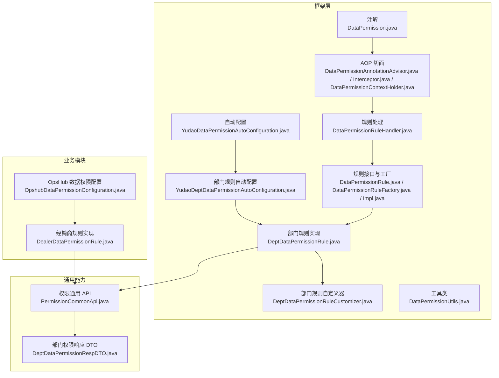
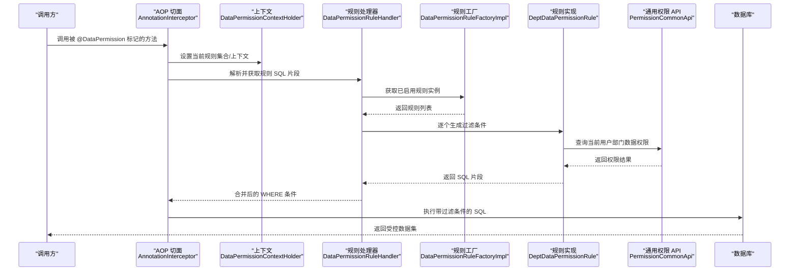
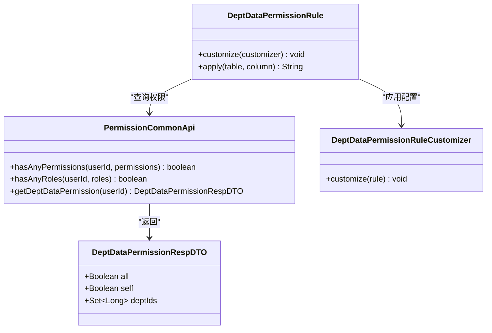
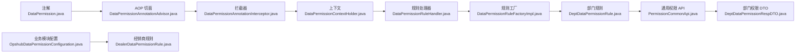

# 数据权限

<cite>
**本文引用的文件**
- [YudaoDataPermissionAutoConfiguration.java](file://yudao-framework/yudao-spring-boot-starter-biz-data-permission/src/main/java/cn/iocoder/yudao/framework/datapermission/config/YudaoDataPermissionAutoConfiguration.java)
- [YudaoDeptDataPermissionAutoConfiguration.java](file://yudao-framework/yudao-spring-boot-starter-biz-data-permission/src/main/java/cn/iocoder/yudao/framework/datapermission/config/YudaoDeptDataPermissionAutoConfiguration.java)
- [DataPermission.java](file://yudao-framework/yudao-spring-boot-starter-biz-data-permission/src/main/java/cn/iocoder/yudao/framework/datapermission/core/annotation/DataPermission.java)
- [DataPermissionAnnotationAdvisor.java](file://yudao-framework/yudao-spring-boot-starter-biz-data-permission/src/main/java/cn/iocoder/yudao/framework/datapermission/core/aop/DataPermissionAnnotationAdvisor.java)
- [DataPermissionAnnotationInterceptor.java](file://yudao-framework/yudao-spring-boot-starter-biz-data-permission/src/main/java/cn/iocoder/yudao/framework/datapermission/core/aop/DataPermissionAnnotationInterceptor.java)
- [DataPermissionContextHolder.java](file://yudao-framework/yudao-spring-boot-starter-biz-data-permission/src/main/java/cn/iocoder/yudao/framework/datapermission/core/aop/DataPermissionContextHolder.java)
- [DataPermissionRuleHandler.java](file://yudao-framework/yudao-spring-boot-starter-biz-data-permission/src/main/java/cn/iocoder/yudao/framework/datapermission/core/db/DataPermissionRuleHandler.java)
- [DeptDataPermissionRule.java](file://yudao-framework/yudao-spring-boot-starter-biz-data-permission/src/main/java/cn/iocoder/yudao/framework/datapermission/core/rule/dept/DeptDataPermissionRule.java)
- [DeptDataPermissionRuleCustomizer.java](file://yudao-framework/yudao-spring-boot-starter-biz-data-permission/src/main/java/cn/iocoder/yudao/framework/datapermission/core/rule/dept/DeptDataPermissionRuleCustomizer.java)
- [DataPermissionRule.java](file://yudao-framework/yudao-spring-boot-starter-biz-data-permission/src/main/java/cn/iocoder/yudao/framework/datapermission/core/rule/DataPermissionRule.java)
- [DataPermissionRuleFactory.java](file://yudao-framework/yudao-spring-boot-starter-biz-data-permission/src/main/java/cn/iocoder/yudao/framework/datapermission/core/rule/DataPermissionRuleFactory.java)
- [DataPermissionRuleFactoryImpl.java](file://yudao-framework/yudao-spring-boot-starter-biz-data-permission/src/main/java/cn/iocoder/yudao/framework/datapermission/core/rule/DataPermissionRuleFactoryImpl.java)
- [DataPermissionUtils.java](file://yudao-framework/yudao-spring-boot-starter-biz-data-permission/src/main/java/cn/iocoder/yudao/framework/datapermission/core/util/DataPermissionUtils.java)
- [PermissionCommonApi.java](file://yudao-framework/yudao-common/src/main/java/cn/iocoder/yudao/framework/common/biz/system/permission/PermissionCommonApi.java)
- [DeptDataPermissionRespDTO.java](file://yudao-framework/yudao-common/src/main/java/cn/iocoder/yudao/framework/common/biz/system/permission/dto/DeptDataPermissionRespDTO.java)
- [OpshubDataPermissionConfiguration.java](file://yudao-module-opshub/src/main/java/cn/iocoder/yudao/module/opshub/framework/datapermission/config/OpshubDataPermissionConfiguration.java)
- [DealerDataPermissionRule.java](file://yudao-module-opshub/src/main/java/cn/iocoder/yudao/module/opshub/framework/datapermission/rule/DealerDataPermissionRule.java)
</cite>

## 目录
1. [简介](#简介)
2. [项目结构](#项目结构)
3. [核心组件](#核心组件)
4. [架构总览](#架构总览)
5. [详细组件分析](#详细组件分析)
6. [依赖关系分析](#依赖关系分析)
7. [性能考量](#性能考量)
8. [故障排查指南](#故障排查指南)
9. [结论](#结论)
10. [附录](#附录)

## 简介
本文件系统性梳理“数据权限”模块的设计与实现，重点覆盖以下方面：
- 动态数据权限过滤的实现原理：注解式权限控制、AOP 切面拦截、SQL 动态拼接与合并策略
- 部门数据权限规则：子部门数据继承、跨部门数据隔离等业务场景
- 与业务逻辑的多层集成：Service 层权限控制、Controller 层权限验证
- 规则扩展与配置：基于规则工厂与自定义器的可插拔扩展
- 可视化管理与测试：规则编辑器与权限测试工具（概念性说明）
- 调试与性能优化最佳实践

## 项目结构
数据权限能力主要由框架侧的 starter 模块提供，业务模块按需启用并扩展规则。

图表来源
- [YudaoDataPermissionAutoConfiguration.java](file://yudao-framework/yudao-spring-boot-starter-biz-data-permission/src/main/java/cn/iocoder/yudao/framework/datapermission/config/YudaoDataPermissionAutoConfiguration.java)
- [YudaoDeptDataPermissionAutoConfiguration.java](file://yudao-framework/yudao-spring-boot-starter-biz-data-permission/src/main/java/cn/iocoder/yudao/framework/datapermission/config/YudaoDeptDataPermissionAutoConfiguration.java)
- [DataPermission.java](file://yudao-framework/yudao-spring-boot-starter-biz-data-permission/src/main/java/cn/iocoder/yudao/framework/datapermission/core/annotation/DataPermission.java)
- [DataPermissionAnnotationAdvisor.java](file://yudao-framework/yudao-spring-boot-starter-biz-data-permission/src/main/java/cn/iocoder/yudao/framework/datapermission/core/aop/DataPermissionAnnotationAdvisor.java)
- [DataPermissionAnnotationInterceptor.java](file://yudao-framework/yudao-spring-boot-starter-biz-data-permission/src/main/java/cn/iocoder/yudao/framework/datapermission/core/aop/DataPermissionAnnotationInterceptor.java)
- [DataPermissionContextHolder.java](file://yudao-framework/yudao-spring-boot-starter-biz-data-permission/src/main/java/cn/iocoder/yudao/framework/datapermission/core/aop/DataPermissionContextHolder.java)
- [DataPermissionRuleHandler.java](file://yudao-framework/yudao-spring-boot-starter-biz-data-permission/src/main/java/cn/iocoder/yudao/framework/datapermission/core/db/DataPermissionRuleHandler.java)
- [DataPermissionRule.java](file://yudao-framework/yudao-spring-boot-starter-biz-data-permission/src/main/java/cn/iocoder/yudao/framework/datapermission/core/rule/DataPermissionRule.java)
- [DataPermissionRuleFactory.java](file://yudao-framework/yudao-spring-boot-starter-biz-data-permission/src/main/java/cn/iocoder/yudao/framework/datapermission/core/rule/DataPermissionRuleFactory.java)
- [DataPermissionRuleFactoryImpl.java](file://yudao-framework/yudao-spring-boot-starter-biz-data-permission/src/main/java/cn/iocoder/yudao/framework/datapermission/core/rule/DataPermissionRuleFactoryImpl.java)
- [DeptDataPermissionRule.java](file://yudao-framework/yudao-spring-boot-starter-biz-data-permission/src/main/java/cn/iocoder/yudao/framework/datapermission/core/rule/dept/DeptDataPermissionRule.java)
- [DeptDataPermissionRuleCustomizer.java](file://yudao-framework/yudao-spring-boot-starter-biz-data-permission/src/main/java/cn/iocoder/yudao/framework/datapermission/core/rule/dept/DeptDataPermissionRuleCustomizer.java)
- [DataPermissionUtils.java](file://yudao-framework/yudao-spring-boot-starter-biz-data-permission/src/main/java/cn/iocoder/yudao/framework/datapermission/core/util/DataPermissionUtils.java)
- [PermissionCommonApi.java](file://yudao-framework/yudao-common/src/main/java/cn/iocoder/yudao/framework/common/biz/system/permission/PermissionCommonApi.java)
- [DeptDataPermissionRespDTO.java](file://yudao-framework/yudao-common/src/main/java/cn/iocoder/yudao/framework/common/biz/system/permission/dto/DeptDataPermissionRespDTO.java)
- [OpshubDataPermissionConfiguration.java](file://yudao-module-opshub/src/main/java/cn/iocoder/yudao/module/opshub/framework/datapermission/config/OpshubDataPermissionConfiguration.java)
- [DealerDataPermissionRule.java](file://yudao-module-opshub/src/main/java/cn/iocoder/yudao/module/opshub/framework/datapermission/rule/DealerDataPermissionRule.java)

章节来源
- [YudaoDataPermissionAutoConfiguration.java](file://yudao-framework/yudao-spring-boot-starter-biz-data-permission/src/main/java/cn/iocoder/yudao/framework/datapermission/config/YudaoDataPermissionAutoConfiguration.java)
- [YudaoDeptDataPermissionAutoConfiguration.java](file://yudao-framework/yudao-spring-boot-starter-biz-data-permission/src/main/java/cn/iocoder/yudao/framework/datapermission/config/YudaoDeptDataPermissionAutoConfiguration.java)

## 核心组件
- 注解驱动的权限控制：通过注解标记需要应用数据权限的方法或类，声明启用的规则集合
- AOP 切面拦截：在目标方法执行前后注入权限上下文、收集规则、合并 SQL 过滤条件
- 规则工厂与实现：统一管理多种规则（如部门、经销商），支持按需启用与组合
- 规则处理器：负责将规则转换为 SQL 片段，并与现有查询条件进行合并
- 部门规则与自定义器：从通用权限 API 获取当前用户的部门数据权限，支持“查看全部/仅自己/指定部门集合”的继承与合并
- 通用权限 API：提供角色/权限判断与部门数据权限查询能力

章节来源
- [DataPermission.java](file://yudao-framework/yudao-spring-boot-starter-biz-data-permission/src/main/java/cn/iocoder/yudao/framework/datapermission/core/annotation/DataPermission.java)
- [DataPermissionAnnotationAdvisor.java](file://yudao-framework/yudao-spring-boot-starter-biz-data-permission/src/main/java/cn/iocoder/yudao/framework/datapermission/core/aop/DataPermissionAnnotationAdvisor.java)
- [DataPermissionAnnotationInterceptor.java](file://yudao-framework/yudao-spring-boot-starter-biz-data-permission/src/main/java/cn/iocoder/yudao/framework/datapermission/core/aop/DataPermissionAnnotationInterceptor.java)
- [DataPermissionContextHolder.java](file://yudao-framework/yudao-spring-boot-starter-biz-data-permission/src/main/java/cn/iocoder/yudao/framework/datapermission/core/aop/DataPermissionContextHolder.java)
- [DataPermissionRuleHandler.java](file://yudao-framework/yudao-spring-boot-starter-biz-data-permission/src/main/java/cn/iocoder/yudao/framework/datapermission/core/db/DataPermissionRuleHandler.java)
- [DataPermissionRule.java](file://yudao-framework/yudao-spring-boot-starter-biz-data-permission/src/main/java/cn/iocoder/yudao/framework/datapermission/core/rule/DataPermissionRule.java)
- [DataPermissionRuleFactory.java](file://yudao-framework/yudao-spring-boot-starter-biz-data-permission/src/main/java/cn/iocoder/yudao/framework/datapermission/core/rule/DataPermissionRuleFactory.java)
- [DataPermissionRuleFactoryImpl.java](file://yudao-framework/yudao-spring-boot-starter-biz-data-permission/src/main/java/cn/iocoder/yudao/framework/datapermission/core/rule/DataPermissionRuleFactoryImpl.java)
- [DeptDataPermissionRule.java](file://yudao-framework/yudao-spring-boot-starter-biz-data-permission/src/main/java/cn/iocoder/yudao/framework/datapermission/core/rule/dept/DeptDataPermissionRule.java)
- [DeptDataPermissionRuleCustomizer.java](file://yudao-framework/yudao-spring-boot-starter-biz-data-permission/src/main/java/cn/iocoder/yudao/framework/datapermission/core/rule/dept/DeptDataPermissionRuleCustomizer.java)
- [DataPermissionUtils.java](file://yudao-framework/yudao-spring-boot-starter-biz-data-permission/src/main/java/cn/iocoder/yudao/framework/datapermission/core/util/DataPermissionUtils.java)
- [PermissionCommonApi.java](file://yudao-framework/yudao-common/src/main/java/cn/iocoder/yudao/framework/common/biz/system/permission/PermissionCommonApi.java)
- [DeptDataPermissionRespDTO.java](file://yudao-framework/yudao-common/src/main/java/cn/iocoder/yudao/framework/common/biz/system/permission/dto/DeptDataPermissionRespDTO.java)

## 架构总览
下图展示从注解到 SQL 合成的完整链路，以及与通用权限 API 的交互。

图表来源
- [DataPermissionAnnotationInterceptor.java](file://yudao-framework/yudao-spring-boot-starter-biz-data-permission/src/main/java/cn/iocoder/yudao/framework/datapermission/core/aop/DataPermissionAnnotationInterceptor.java)
- [DataPermissionContextHolder.java](file://yudao-framework/yudao-spring-boot-starter-biz-data-permission/src/main/java/cn/iocoder/yudao/framework/datapermission/core/aop/DataPermissionContextHolder.java)
- [DataPermissionRuleHandler.java](file://yudao-framework/yudao-spring-boot-starter-biz-data-permission/src/main/java/cn/iocoder/yudao/framework/datapermission/core/db/DataPermissionRuleHandler.java)
- [DataPermissionRuleFactoryImpl.java](file://yudao-framework/yudao-spring-boot-starter-biz-data-permission/src/main/java/cn/iocoder/yudao/framework/datapermission/core/rule/DataPermissionRuleFactoryImpl.java)
- [DeptDataPermissionRule.java](file://yudao-framework/yudao-spring-boot-starter-biz-data-permission/src/main/java/cn/iocoder/yudao/framework/datapermission/core/rule/dept/DeptDataPermissionRule.java)
- [PermissionCommonApi.java](file://yudao-framework/yudao-common/src/main/java/cn/iocoder/yudao/framework/common/biz/system/permission/PermissionCommonApi.java)

## 详细组件分析

### 注解式权限控制
- 作用域：方法级或类级，声明启用的规则类型集合
- 语义：结合 AOP 在进入目标方法前解析注解，设置上下文并触发规则处理

章节来源
- [DataPermission.java](file://yudao-framework/yudao-spring-boot-starter-biz-data-permission/src/main/java/cn/iocoder/yudao/framework/datapermission/core/annotation/DataPermission.java)

### AOP 切面拦截与上下文
- Advisor/Interceptor：识别带注解的方法，构建规则上下文，委托规则处理器生成 SQL 片段
- DataPermissionContextHolder：在线程上下文中保存当前请求的规则集合与状态，确保规则在 SQL 构建阶段可用

章节来源
- [DataPermissionAnnotationAdvisor.java](file://yudao-framework/yudao-spring-boot-starter-biz-data-permission/src/main/java/cn/iocoder/yudao/framework/datapermission/core/aop/DataPermissionAnnotationAdvisor.java)
- [DataPermissionAnnotationInterceptor.java](file://yudao-framework/yudao-spring-boot-starter-biz-data-permission/src/main/java/cn/iocoder/yudao/framework/datapermission/core/aop/DataPermissionAnnotationInterceptor.java)
- [DataPermissionContextHolder.java](file://yudao-framework/yudao-spring-boot-starter-biz-data-permission/src/main/java/cn/iocoder/yudao/framework/datapermission/core/aop/DataPermissionContextHolder.java)

### 规则工厂与实现
- 工厂接口与实现：集中管理规则实例，支持按需启用与组合
- 规则接口：定义统一的规则抽象，便于扩展新的维度（如部门、经销商、岗位等）

章节来源
- [DataPermissionRule.java](file://yudao-framework/yudao-spring-boot-starter-biz-data-permission/src/main/java/cn/iocoder/yudao/framework/datapermission/core/rule/DataPermissionRule.java)
- [DataPermissionRuleFactory.java](file://yudao-framework/yudao-spring-boot-starter-biz-data-permission/src/main/java/cn/iocoder/yudao/framework/datapermission/core/rule/DataPermissionRuleFactory.java)
- [DataPermissionRuleFactoryImpl.java](file://yudao-framework/yudao-spring-boot-starter-biz-data-permission/src/main/java/cn/iocoder/yudao/framework/datapermission/core/rule/DataPermissionRuleFactoryImpl.java)

### 部门数据权限规则
- 权限来源：通过通用权限 API 获取当前用户的部门数据权限（是否可查看全部、是否仅自己、可查看的部门集合）
- 继承与合并：支持“查看全部”优先、“仅自己”次之、“指定部门集合”最后合并；子部门数据继承遵循集合包含关系
- 配置扩展：通过自定义器为不同业务表配置对应的部门字段，实现按表粒度的过滤

图表来源
- [PermissionCommonApi.java](file://yudao-framework/yudao-common/src/main/java/cn/iocoder/yudao/framework/common/biz/system/permission/PermissionCommonApi.java)
- [DeptDataPermissionRespDTO.java](file://yudao-framework/yudao-common/src/main/java/cn/iocoder/yudao/framework/common/biz/system/permission/dto/DeptDataPermissionRespDTO.java)
- [DeptDataPermissionRule.java](file://yudao-framework/yudao-spring-boot-starter-biz-data-permission/src/main/java/cn/iocoder/yudao/framework/datapermission/core/rule/dept/DeptDataPermissionRule.java)
- [DeptDataPermissionRuleCustomizer.java](file://yudao-framework/yudao-spring-boot-starter-biz-data-permission/src/main/java/cn/iocoder/yudao/framework/datapermission/core/rule/dept/DeptDataPermissionRuleCustomizer.java)

章节来源
- [DeptDataPermissionRule.java](file://yudao-framework/yudao-spring-boot-starter-biz-data-permission/src/main/java/cn/iocoder/yudao/framework/datapermission/core/rule/dept/DeptDataPermissionRule.java)
- [DeptDataPermissionRuleCustomizer.java](file://yudao-framework/yudao-spring-boot-starter-biz-data-permission/src/main/java/cn/iocoder/yudao/framework/datapermission/core/rule/dept/DeptDataPermissionRuleCustomizer.java)
- [PermissionCommonApi.java](file://yudao-framework/yudao-common/src/main/java/cn/iocoder/yudao/framework/common/biz/system/permission/PermissionCommonApi.java)
- [DeptDataPermissionRespDTO.java](file://yudao-framework/yudao-common/src/main/java/cn/iocoder/yudao/framework/common/biz/system/permission/dto/DeptDataPermissionRespDTO.java)

### 经销商/产品线数据权限规则（业务扩展）
- 规则实现：根据用户角色（品牌管理员、销售、服务执行人、经销商）分别按产品线或经销商维度过滤
- 与部门规则共存：通过注解选择启用的规则集合，实现多维组合过滤
- 配置方式：在业务模块中注册规则 Bean，并按需补充表字段映射

章节来源
- [OpshubDataPermissionConfiguration.java](file://yudao-module-opshub/src/main/java/cn/iocoder/yudao/module/opshub/framework/datapermission/config/OpshubDataPermissionConfiguration.java)
- [DealerDataPermissionRule.java](file://yudao-module-opshub/src/main/java/cn/iocoder/yudao/module/opshub/framework/datapermission/rule/DealerDataPermissionRule.java)

### SQL 动态拼接与合并
- 规则处理器：遍历启用的规则，生成各维度的过滤条件
- 合并策略：将多个维度的过滤条件以 AND 方式合并，避免跨部门越权访问
- 上下文传递：通过上下文在拦截阶段完成 SQL 片段的收集与合并

章节来源
- [DataPermissionRuleHandler.java](file://yudao-framework/yudao-spring-boot-starter-biz-data-permission/src/main/java/cn/iocoder/yudao/framework/datapermission/core/db/DataPermissionRuleHandler.java)
- [DataPermissionUtils.java](file://yudao-framework/yudao-spring-boot-starter-biz-data-permission/src/main/java/cn/iocoder/yudao/framework/datapermission/core/util/DataPermissionUtils.java)

### 自动配置与规则装配
- 框架自动配置：在存在登录用户上下文与规则自定义器时，装配部门数据权限规则
- 业务模块扩展：通过注册自定义器或规则 Bean，实现按模块的差异化配置

章节来源
- [YudaoDataPermissionAutoConfiguration.java](file://yudao-framework/yudao-spring-boot-starter-biz-data-permission/src/main/java/cn/iocoder/yudao/framework/datapermission/config/YudaoDataPermissionAutoConfiguration.java)
- [YudaoDeptDataPermissionAutoConfiguration.java](file://yudao-framework/yudao-spring-boot-starter-biz-data-permission/src/main/java/cn/iocoder/yudao/framework/datapermission/config/YudaoDeptDataPermissionAutoConfiguration.java)

## 依赖关系分析
- 组件耦合
  - AOP 切面依赖规则工厂与规则处理器
  - 规则实现依赖通用权限 API 与自定义器
  - 业务模块通过配置类注册规则 Bean 并按需启用
- 外部依赖
  - 登录用户上下文（用于判定是否启用数据权限）
  - 数据库访问层（MyBatis/ORM）负责最终 SQL 的执行

图表来源
- [DataPermission.java](file://yudao-framework/yudao-spring-boot-starter-biz-data-permission/src/main/java/cn/iocoder/yudao/framework/datapermission/core/annotation/DataPermission.java)
- [DataPermissionAnnotationAdvisor.java](file://yudao-framework/yudao-spring-boot-starter-biz-data-permission/src/main/java/cn/iocoder/yudao/framework/datapermission/core/aop/DataPermissionAnnotationAdvisor.java)
- [DataPermissionAnnotationInterceptor.java](file://yudao-framework/yudao-spring-boot-starter-biz-data-permission/src/main/java/cn/iocoder/yudao/framework/datapermission/core/aop/DataPermissionAnnotationInterceptor.java)
- [DataPermissionContextHolder.java](file://yudao-framework/yudao-spring-boot-starter-biz-data-permission/src/main/java/cn/iocoder/yudao/framework/datapermission/core/aop/DataPermissionContextHolder.java)
- [DataPermissionRuleHandler.java](file://yudao-framework/yudao-spring-boot-starter-biz-data-permission/src/main/java/cn/iocoder/yudao/framework/datapermission/core/db/DataPermissionRuleHandler.java)
- [DataPermissionRuleFactoryImpl.java](file://yudao-framework/yudao-spring-boot-starter-biz-data-permission/src/main/java/cn/iocoder/yudao/framework/datapermission/core/rule/DataPermissionRuleFactoryImpl.java)
- [DeptDataPermissionRule.java](file://yudao-framework/yudao-spring-boot-starter-biz-data-permission/src/main/java/cn/iocoder/yudao/framework/datapermission/core/rule/dept/DeptDataPermissionRule.java)
- [PermissionCommonApi.java](file://yudao-framework/yudao-common/src/main/java/cn/iocoder/yudao/framework/common/biz/system/permission/PermissionCommonApi.java)
- [DeptDataPermissionRespDTO.java](file://yudao-framework/yudao-common/src/main/java/cn/iocoder/yudao/framework/common/biz/system/permission/dto/DeptDataPermissionRespDTO.java)
- [OpshubDataPermissionConfiguration.java](file://yudao-module-opshub/src/main/java/cn/iocoder/yudao/module/opshub/framework/datapermission/config/OpshubDataPermissionConfiguration.java)
- [DealerDataPermissionRule.java](file://yudao-module-opshub/src/main/java/cn/iocoder/yudao/module/opshub/framework/datapermission/rule/DealerDataPermissionRule.java)

章节来源
- [YudaoDataPermissionAutoConfiguration.java](file://yudao-framework/yudao-spring-boot-starter-biz-data-permission/src/main/java/cn/iocoder/yudao/framework/datapermission/config/YudaoDataPermissionAutoConfiguration.java)
- [YudaoDeptDataPermissionAutoConfiguration.java](file://yudao-framework/yudao-spring-boot-starter-biz-data-permission/src/main/java/cn/iocoder/yudao/framework/datapermission/config/YudaoDeptDataPermissionAutoConfiguration.java)

## 性能考量
- 规则缓存与复用：对同一请求内的规则片段进行缓存，减少重复计算
- SQL 合并优化：尽量将多维过滤条件合并为单一 WHERE 子句，避免多次扫描
- 分页与索引：建议在过滤字段上建立合适索引，配合分页提升查询效率
- 规则数量控制：避免在同一方法上启用过多规则，降低 AOP 拦截与 SQL 合成成本
- 上下文清理：确保请求结束时清理线程上下文，防止内存泄漏

## 故障排查指南
- 症状：查询结果为空或越权
  - 检查注解是否正确启用、规则是否生效
  - 核对通用权限 API 返回的部门权限是否符合预期
  - 确认规则自定义器是否正确配置了表与字段映射
- 症状：SQL 报错或执行异常
  - 检查规则生成的 SQL 片段是否与现有查询条件冲突
  - 确认字段名与表名大小写及转义是否一致
- 症状：性能下降
  - 关注规则数量与 SQL 合并复杂度
  - 检查是否存在不必要的全表扫描
- 调试建议
  - 开启相关日志，观察规则解析与 SQL 合成过程
  - 使用单元测试覆盖关键分支（如“查看全部/仅自己/指定部门集合”）
  - 提供权限测试工具，模拟不同角色与部门范围下的查询结果

## 结论
数据权限模块通过注解驱动、AOP 拦截与规则工厂实现了灵活、可扩展的动态过滤能力。部门规则与业务扩展规则（如经销商/产品线）可按需组合，既保证了多层防护，又兼顾了性能与可维护性。建议在实际落地时结合业务场景完善规则配置与测试流程，并持续关注日志与性能指标。

## 附录
- 规则可视化管理与测试工具（概念性说明）
  - 规则编辑器：提供图形化界面配置表与字段映射、角色与维度的对应关系
  - 权限测试工具：支持按用户/角色/部门范围模拟查询，输出 SQL 片段与结果集对比
  - 集成建议：将规则编辑器与测试工具嵌入后台管理页面，便于运营与开发协同