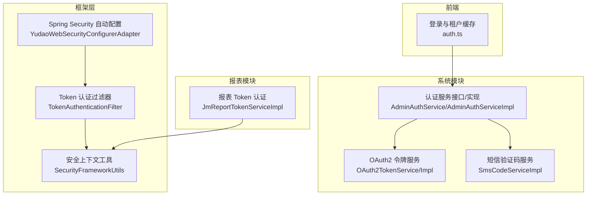
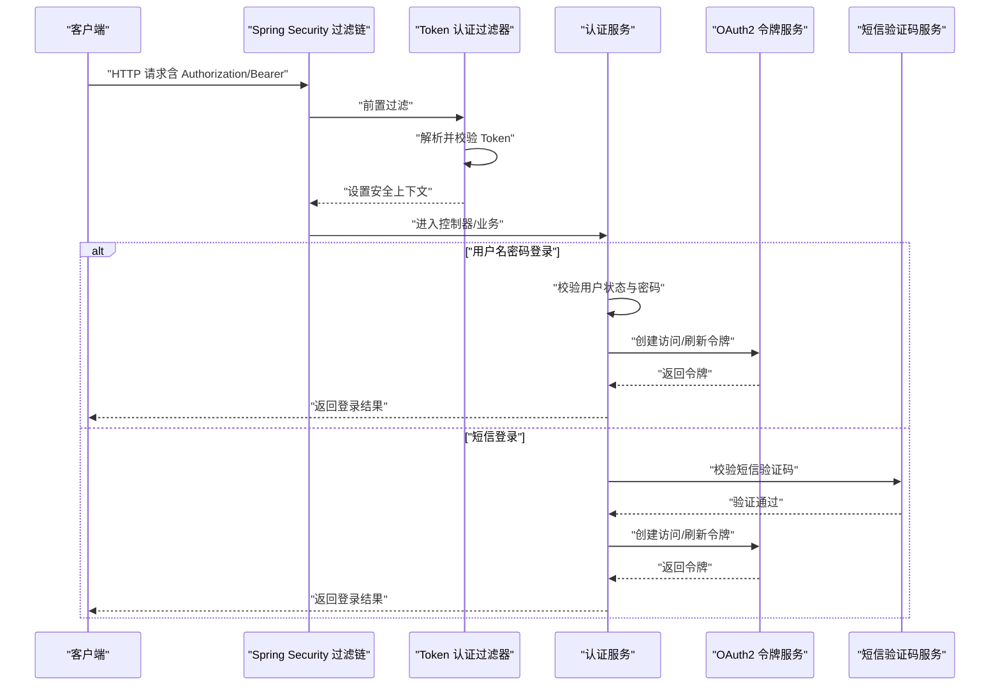
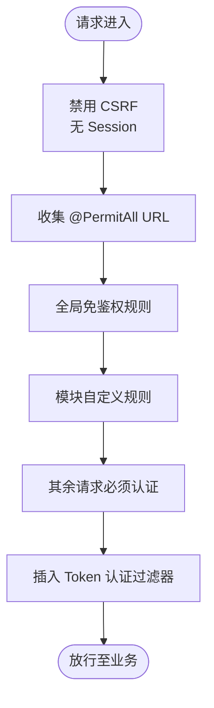
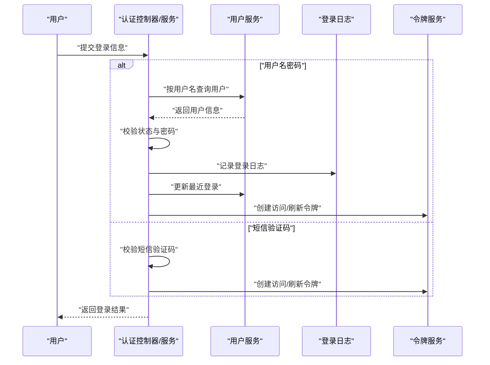
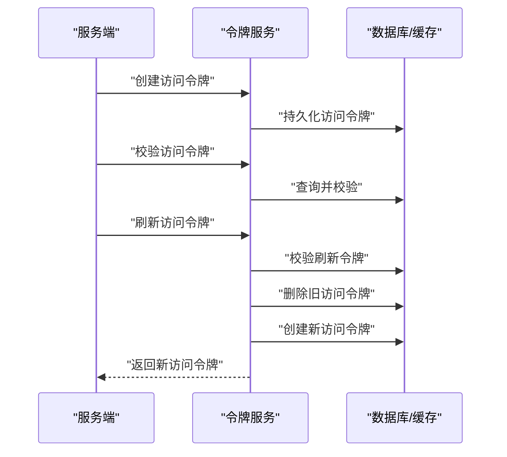
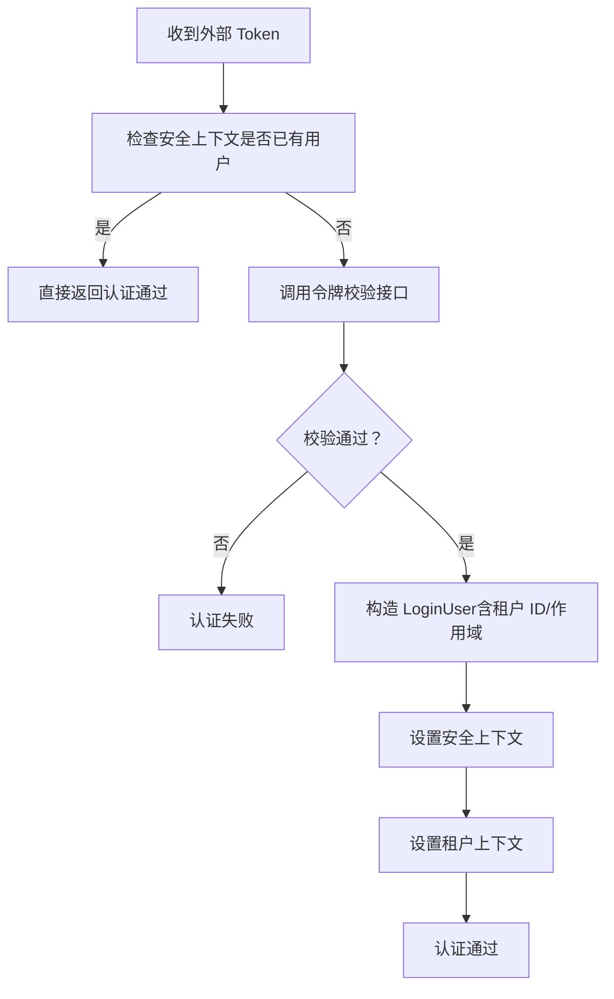
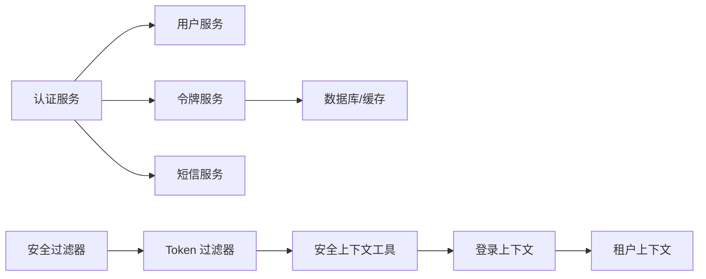

# 用户认证

<cite>
**本文引用的文件**
- [YudaoWebSecurityConfigurerAdapter.java](file://yudao-framework/yudao-spring-boot-starter-security/src/main/java/cn/iocoder/yudao/framework/security/config/YudaoWebSecurityConfigurerAdapter.java)
- [YudaoSecurityAutoConfiguration.java](file://yudao-framework/yudao-spring-boot-starter-security/src/main/java/cn/iocoder/yudao/framework/security/config/YudaoSecurityAutoConfiguration.java)
- [TokenAuthenticationFilter.java](file://yudao-framework/yudao-spring-boot-starter-security/src/main/java/cn/iocoder/yudao/framework/security/core/filter/TokenAuthenticationFilter.java)
- [SecurityFrameworkUtils.java](file://yudao-framework/yudao-spring-boot-starter-security/src/main/java/cn/iocoder/yudao/framework/security/core/util/SecurityFrameworkUtils.java)
- [AdminAuthService.java](file://yudao-module-system/src/main/java/cn/iocoder/yudao/module/system/service/auth/AdminAuthService.java)
- [AdminAuthServiceImpl.java](file://yudao-module-system/src/main/java/cn/iocoder/yudao/module/system/service/auth/AdminAuthServiceImpl.java)
- [AdminAuthServiceImplTest.java](file://yudao-module-system/src/test/java/cn/iocoder/yudao/module/system/service/auth/AdminAuthServiceImplTest.java)
- [OAuth2TokenService.java](file://yudao-module-system/src/main/java/cn/iocoder/yudao/module/system/service/oauth2/OAuth2TokenService.java)
- [OAuth2TokenServiceImpl.java](file://yudao-module-system/src/main/java/cn/iocoder/yudao/module/system/service/oauth2/OAuth2TokenServiceImpl.java)
- [OAuth2TokenServiceImplTest.java](file://yudao-module-system/src/test/java/cn/iocoder/yudao/module/system/service/oauth2/OAuth2TokenServiceImplTest.java)
- [OAuth2CodeService.java](file://yudao-module-system/src/main/java/cn/iocoder/yudao/module/system/service/oauth2/OAuth2CodeService.java)
- [OAuth2Utils.java](file://yudao-module-system/src/main/java/cn/iocoder/yudao/module/system/util/oauth2/OAuth2Utils.java)
- [SmsCodeServiceImpl.java](file://yudao-module-system/src/main/java/cn/iocoder/yudao/module/system/service/sms/SmsCodeServiceImpl.java)
- [SmsSceneEnum.java](file://yudao-module-system/src/main/java/cn/iocoder/yudao/module/system/enums/sms/SmsSceneEnum.java)
- [SmsTemplateTypeEnum.java](file://yudao-module-system/src/main/java/cn/iocoder/yudao/module/system/enums/sms/SmsTemplateTypeEnum.java)
- [SmsSendStatusEnum.java](file://yudao-module-system/src/main/java/cn/iocoder/yudao/module/system/enums/sms/SmsSendStatusEnum.java)
- [YudaoJustAuthConfiguration.java](file://yudao-module-system/src/main/java/cn/iocoder/yudao/module/system/framework/justauth/config/YudaoJustAuthConfiguration.java)
- [SocialClientServiceImpl.java](file://yudao-module-system/src/main/java/cn/iocoder/yudao/module/system/service/social/SocialClientServiceImpl.java)
- [JmReportTokenServiceImpl.java](file://yudao-module-report/src/main/java/cn/iocoder/yudao/module/report/framework/jmreport/core/service/JmReportTokenServiceImpl.java)
- [LoginResultEnum.java](file://yudao-module-system/src/main/java/cn/iocoder/yudao/module/system/enums/logger/LoginResultEnum.java)
- [LoginLogServiceImpl.java](file://yudao-module-system/src/main/java/cn/iocoder/yudao/module/system/service/logger/LoginLogService.java)
- [LoginLogServiceImplTest.java](file://yudao-module-system/src/test/java/cn/iocoder/yudao/module/system/service/logger/LoginLogServiceImplTest.java)
- [TenantService.java](file://yudao-module-system/src/main/java/cn/iocoder/yudao/module/system/service/tenant/TenantService.java)
- [TenantServiceImpl.java](file://yudao-module-system/src/main/java/cn/iocoder/yudao/module/system/service/tenant/TenantServiceImpl.java)
- [WebFilterOrderEnum.java](file://yudao-framework/yudao-common/src/main/java/cn/iocoder/yudao/framework/common/enums/WebFilterOrderEnum.java)
- [application.yaml](file://yudao-server/src/main/resources/application.yaml)
- [auth.ts](file://yudao-ui/yudao-ui-admin-vue3/src/utils/auth.ts)
- [PRD-用户权限设计.md](file://docs/PRD-用户权限设计.md)
</cite>

## 更新摘要
**所做更改**
- 删除了社交登录相关的集成认证机制内容
- 移除了 JustAuth 第三方登录的详细说明
- 简化了认证方式的描述，保留核心的用户名密码、验证码、短信登录
- 更新了相关章节以反映删除的内容

## 目录
1. [简介](#简介)
2. [项目结构](#项目结构)
3. [核心组件](#核心组件)
4. [架构总览](#架构总览)
5. [详细组件分析](#详细组件分析)
6. [依赖关系分析](#依赖关系分析)
7. [性能考量](#性能考量)
8. [故障排查指南](#故障排查指南)
9. [结论](#结论)
10. [附录](#附录)

## 简介
本文件面向"用户认证模块"，围绕基于 Spring Security 的登录认证体系，系统性说明以下能力与机制：
- 多种登录方式：用户名密码、验证码、手机短信
- JWT Token 的签发、校验与刷新，以及过期与黑名单策略
- 登录用户上下文管理：用户信息缓存、权限缓存、租户切换
- 认证失败处理：密码错误次数限制、账户锁定策略等防暴力破解
- 最佳实践与常见问题

## 项目结构
认证相关能力横跨"框架层"和"业务模块"：
- 框架层（yudao-framework）：Spring Security 自动装配、Token 过滤器、安全上下文工具
- 业务模块（yudao-module-system）：认证服务、OAuth2 令牌服务、短信验证码
- 报表模块（yudao-module-report）：基于 Token 的二次认证示例
- 前端（yudao-ui）：登录表单、租户选择与本地缓存

**图表来源**
- [YudaoWebSecurityConfigurerAdapter.java:110-153](file://yudao-framework/yudao-spring-boot-starter-security/src/main/java/cn/iocoder/yudao/framework/security/config/YudaoWebSecurityConfigurerAdapter.java#L110-L153)
- [TokenAuthenticationFilter.java](file://yudao-framework/yudao-spring-boot-starter-security/src/main/java/cn/iocoder/yudao/framework/security/core/filter/TokenAuthenticationFilter.java)
- [SecurityFrameworkUtils.java](file://yudao-framework/yudao-spring-boot-starter-security/src/main/java/cn/iocoder/yudao/framework/security/core/util/SecurityFrameworkUtils.java)
- [AdminAuthService.java:15-63](file://yudao-module-system/src/main/java/cn/iocoder/yudao/module/system/service/auth/AdminAuthService.java#L15-L63)
- [AdminAuthServiceImpl.java:152-178](file://yudao-module-system/src/main/java/cn/iocoder/yudao/module/system/service/auth/AdminAuthServiceImpl.java#L152-L178)
- [OAuth2TokenService.java:1-39](file://yudao-module-system/src/main/java/cn/iocoder/yudao/module/system/service/oauth2/OAuth2TokenService.java#L1-L39)
- [SmsCodeServiceImpl.java:69-91](file://yudao-module-system/src/main/java/cn/iocoder/yudao/module/system/service/sms/SmsCodeServiceImpl.java#L69-L91)
- [JmReportTokenServiceImpl.java:63-132](file://yudao-module-report/src/main/java/cn/iocoder/yudao/module/report/framework/jmreport/core/service/JmReportTokenServiceImpl.java#L63-L132)
- [auth.ts:46-86](file://yudao-ui/yudao-ui-admin-vue3/src/utils/auth.ts#L46-L86)

**章节来源**
- [YudaoWebSecurityConfigurerAdapter.java:110-153](file://yudao-framework/yudao-spring-boot-starter-security/src/main/java/cn/iocoder/yudao/framework/security/config/YudaoWebSecurityConfigurerAdapter.java#L110-L153)
- [YudaoSecurityAutoConfiguration.java:62-74](file://yudao-framework/yudao-spring-boot-starter-security/src/main/java/cn/iocoder/yudao/framework/security/config/YudaoSecurityAutoConfiguration.java#L62-L74)
- [AdminAuthService.java:15-63](file://yudao-module-system/src/main/java/cn/iocoder/yudao/module/system/service/auth/AdminAuthService.java#L15-L63)
- [OAuth2TokenService.java:1-39](file://yudao-module-system/src/main/java/cn/iocoder/yudao/module/system/service/oauth2/OAuth2TokenService.java#L1-L39)
- [SmsCodeServiceImpl.java:69-91](file://yudao-module-system/src/main/java/cn/iocoder/yudao/module/system/service/sms/SmsCodeServiceImpl.java#L69-L91)
- [JmReportTokenServiceImpl.java:63-132](file://yudao-module-report/src/main/java/cn/iocoder/yudao/module/report/framework/jmreport/core/service/JmReportTokenServiceImpl.java#L63-L132)
- [auth.ts:46-86](file://yudao-ui/yudao-ui-admin-vue3/src/utils/auth.ts#L46-L86)

## 核心组件
- Spring Security 配置与过滤链
  - 自动装配与过滤器注册：通过自动配置类注册认证入口、拒绝处理器、密码加密器、Token 过滤器与安全上下文策略
  - 安全过滤链：禁用 CSRF、无状态 Session、统一异常处理、按注解与配置的免鉴权 URL、全局拦截
- 认证服务
  - 用户名密码认证：校验用户状态、密码匹配，成功后记录登录日志并更新最近登录信息
  - 短信登录：发送/校验短信验证码，完成登录并发放 Token
- OAuth2 令牌服务
  - 创建访问令牌、刷新令牌、授权码；刷新访问令牌时回收旧令牌
- 上下文与租户
  - 安全上下文工具：设置/获取登录用户、用户类型、租户 ID、作用域
  - 租户服务：租户信息处理、菜单处理、租户列表与合法性校验
- 前端缓存
  - 登录表单、记住我、租户 ID、访问租户 ID 的本地缓存与加密存储

**章节来源**
- [YudaoSecurityAutoConfiguration.java:43-74](file://yudao-framework/yudao-spring-boot-starter-security/src/main/java/cn/iocoder/yudao/framework/security/config/YudaoSecurityAutoConfiguration.java#L43-L74)
- [YudaoWebSecurityConfigurerAdapter.java:110-153](file://yudao-framework/yudao-spring-boot-starter-security/src/main/java/cn/iocoder/yudao/framework/security/config/YudaoWebSecurityConfigurerAdapter.java#L110-L153)
- [AdminAuthService.java:15-63](file://yudao-module-system/src/main/java/cn/iocoder/yudao/module/system/service/auth/AdminAuthService.java#L15-L63)
- [AdminAuthServiceImpl.java:152-178](file://yudao-module-system/src/main/java/cn/iocoder/yudao/module/system/service/auth/AdminAuthServiceImpl.java#L152-L178)
- [OAuth2TokenService.java:1-39](file://yudao-module-system/src/main/java/cn/iocoder/yudao/module/system/service/oauth2/OAuth2TokenService.java#L1-L39)
- [TenantService.java:115-145](file://yudao-module-system/src/main/java/cn/iocoder/yudao/module/system/service/tenant/TenantService.java#L115-L145)
- [auth.ts:46-86](file://yudao-ui/yudao-ui-admin-vue3/src/utils/auth.ts#L46-L86)

## 架构总览
下图展示从客户端到服务端的关键交互：请求进入 Spring Security 过滤链，Token 过滤器解析并校验 Token，随后进入业务认证流程。

**图表来源**
- [YudaoWebSecurityConfigurerAdapter.java:110-153](file://yudao-framework/yudao-spring-boot-starter-security/src/main/java/cn/iocoder/yudao/framework/security/config/YudaoWebSecurityConfigurerAdapter.java#L110-L153)
- [TokenAuthenticationFilter.java](file://yudao-framework/yudao-spring-boot-starter-security/src/main/java/cn/iocoder/yudao/framework/security/core/filter/TokenAuthenticationFilter.java)
- [AdminAuthServiceImpl.java:152-178](file://yudao-module-system/src/main/java/cn/iocoder/yudao/module/system/service/auth/AdminAuthServiceImpl.java#L152-L178)
- [OAuth2TokenService.java:1-39](file://yudao-module-system/src/main/java/cn/iocoder/yudao/module/system/service/oauth2/OAuth2TokenService.java#L1-L39)
- [SmsCodeServiceImpl.java:69-91](file://yudao-module-system/src/main/java/cn/iocoder/yudao/module/system/service/sms/SmsCodeServiceImpl.java#L69-L91)

## 详细组件分析

### Spring Security 配置与过滤链
- 关键点
  - 禁用 CSRF、Session，启用无状态认证
  - 统一异常处理（认证失败/权限不足）
  - 基于注解与配置的免鉴权 URL 动态收集
  - 在用户名密码过滤器之前插入 Token 过滤器
- 安全上下文策略
  - 使用可在线程间传递的安全上下文策略，便于跨线程传播登录用户信息

**图表来源**
- [YudaoWebSecurityConfigurerAdapter.java:110-153](file://yudao-framework/yudao-spring-boot-starter-security/src/main/java/cn/iocoder/yudao/framework/security/config/YudaoWebSecurityConfigurerAdapter.java#L110-L153)
- [YudaoSecurityAutoConfiguration.java:85-92](file://yudao-framework/yudao-spring-boot-starter-security/src/main/java/cn/iocoder/yudao/framework/security/config/YudaoSecurityAutoConfiguration.java#L85-L92)

**章节来源**
- [YudaoWebSecurityConfigurerAdapter.java:110-153](file://yudao-framework/yudao-spring-boot-starter-security/src/main/java/cn/iocoder/yudao/framework/security/config/YudaoWebSecurityConfigurerAdapter.java#L110-L153)
- [YudaoSecurityAutoConfiguration.java:43-74](file://yudao-framework/yudao-spring-boot-starter-security/src/main/java/cn/iocoder/yudao/framework/security/config/YudaoSecurityAutoConfiguration.java#L43-L74)

### 认证服务（用户名密码/短信）
- 用户名密码认证
  - 校验用户是否存在、状态正常、密码匹配
  - 成功后记录登录日志、更新最近登录信息
- 短信登录
  - 发送验证码：生成随机数、入库、返回验证码
  - 校验验证码：检测有效期与使用状态
  - 登录成功后发放访问/刷新令牌

**图表来源**
- [AdminAuthServiceImpl.java:152-178](file://yudao-module-system/src/main/java/cn/iocoder/yudao/module/system/service/auth/AdminAuthServiceImpl.java#L152-L178)
- [SmsCodeServiceImpl.java:69-91](file://yudao-module-system/src/main/java/cn/iocoder/yudao/module/system/service/sms/SmsCodeServiceImpl.java#L69-L91)

**章节来源**
- [AdminAuthService.java:15-63](file://yudao-module-system/src/main/java/cn/iocoder/yudao/module/system/service/auth/AdminAuthService.java#L15-L63)
- [AdminAuthServiceImpl.java:152-178](file://yudao-module-system/src/main/java/cn/iocoder/yudao/module/system/service/auth/AdminAuthServiceImpl.java#L152-L178)
- [SmsCodeServiceImpl.java:69-91](file://yudao-module-system/src/main/java/cn/iocoder/yudao/module/system/service/sms/SmsCodeServiceImpl.java#L69-L91)

### OAuth2 令牌服务（签发/校验/刷新）
- 令牌生命周期
  - 创建访问令牌与刷新令牌，记录到数据库与缓存
  - 校验访问令牌有效性，用于接口保护
  - 刷新访问令牌：校验刷新令牌有效性，生成新访问令牌并回收旧令牌
- 黑名单与过期
  - 刷新令牌过期时拒绝刷新请求
  - 刷新成功后旧访问令牌被移除，防止重放

**图表来源**
- [OAuth2TokenService.java:1-39](file://yudao-module-system/src/main/java/cn/iocoder/yudao/module/system/service/oauth2/OAuth2TokenService.java#L1-L39)
- [OAuth2TokenServiceImplTest.java:130-192](file://yudao-module-system/src/test/java/cn/iocoder/yudao/module/system/service/oauth2/OAuth2TokenServiceImplTest.java#L130-L192)

**章节来源**
- [OAuth2TokenService.java:1-39](file://yudao-module-system/src/main/java/cn/iocoder/yudao/module/system/service/oauth2/OAuth2TokenService.java#L1-L39)
- [OAuth2TokenServiceImplTest.java:130-192](file://yudao-module-system/src/test/java/cn/iocoder/yudao/module/system/service/oauth2/OAuth2TokenServiceImplTest.java#L130-L192)

### 登录上下文与租户切换
- 安全上下文
  - 通过工具类设置/获取登录用户、用户类型、租户 ID、作用域
- 租户服务
  - 提供租户信息处理、菜单处理、租户列表与合法性校验
- 报表模块示例
  - 基于外部 Token 构建登录用户上下文，忽略租户查询以获取令牌信息，再设置租户上下文

**图表来源**
- [JmReportTokenServiceImpl.java:63-132](file://yudao-module-report/src/main/java/cn/iocoder/yudao/module/report/framework/jmreport/core/service/JmReportTokenServiceImpl.java#L63-L132)
- [SecurityFrameworkUtils.java](file://yudao-framework/yudao-spring-boot-starter-security/src/main/java/cn/iocoder/yudao/framework/security/core/util/SecurityFrameworkUtils.java)
- [TenantService.java:115-145](file://yudao-module-system/src/main/java/cn/iocoder/yudao/module/system/service/tenant/TenantService.java#L115-L145)

**章节来源**
- [JmReportTokenServiceImpl.java:63-132](file://yudao-module-report/src/main/java/cn/iocoder/yudao/module/report/framework/jmreport/core/service/JmReportTokenServiceImpl.java#L63-L132)
- [SecurityFrameworkUtils.java](file://yudao-framework/yudao-spring-boot-starter-security/src/main/java/cn/iocoder/yudao/framework/security/core/util/SecurityFrameworkUtils.java)
- [TenantService.java:115-145](file://yudao-module-system/src/main/java/cn/iocoder/yudao/module/system/service/tenant/TenantService.java#L115-L145)

### 前端登录与租户缓存
- 登录表单缓存：用户名、密码（加密存储）、记住我
- 租户相关：当前租户 ID、访问租户 ID 的本地缓存
- 与后端配合：登录成功后根据返回的租户信息切换上下文

**章节来源**
- [auth.ts:46-86](file://yudao-ui/yudao-ui-admin-vue3/src/utils/auth.ts#L46-L86)

## 依赖关系分析
- 组件耦合
  - 认证服务依赖用户服务、令牌服务、短信服务
  - 令牌服务依赖数据库与缓存，支撑访问/刷新令牌
  - 安全上下文工具贯穿认证与业务层，降低耦合
- 外部集成
  - 验证码服务（aj-captcha）提供滑块/点选等验证码能力
- 过滤器顺序
  - 保证跨域、请求体缓存、安全上下文、租户上下文、安全过滤器的正确顺序

**图表来源**
- [AdminAuthServiceImpl.java:152-178](file://yudao-module-system/src/main/java/cn/iocoder/yudao/module/system/service/auth/AdminAuthServiceImpl.java#L152-L178)
- [OAuth2TokenService.java:1-39](file://yudao-module-system/src/main/java/cn/iocoder/yudao/module/system/service/oauth2/OAuth2TokenService.java#L1-L39)
- [WebFilterOrderEnum.java:10-36](file://yudao-framework/yudao-common/src/main/java/cn/iocoder/yudao/framework/common/enums/WebFilterOrderEnum.java#L10-L36)

**章节来源**
- [AdminAuthServiceImpl.java:152-178](file://yudao-module-system/src/main/java/cn/iocoder/yudao/module/system/service/auth/AdminAuthServiceImpl.java#L152-L178)
- [OAuth2TokenService.java:1-39](file://yudao-module-system/src/main/java/cn/iocoder/yudao/module/system/service/oauth2/OAuth2TokenService.java#L1-L39)
- [WebFilterOrderEnum.java:10-36](file://yudao-framework/yudao-common/src/main/java/cn/iocoder/yudao/framework/common/enums/WebFilterOrderEnum.java#L10-L36)

## 性能考量
- 无状态认证：基于 Token 的无状态设计减少 Session 存储开销
- 缓存利用：令牌与验证码等高频数据放入缓存，降低数据库压力
- 过滤器顺序：合理的过滤器顺序避免重复处理与不必要的开销
- 日志与审计：登录日志异步化与批量写入，减少对主流程的影响

## 故障排查指南
- 认证失败原因
  - 用户名或密码错误：返回相应错误码并记录登录日志
  - 账户被禁用：禁止登录并记录日志
  - 验证码错误/过期：校验失败时拒绝登录
- 防暴力破解
  - 验证码接口频率限制：失败次数过多临时锁定
  - 登录尝试限制：结合登录日志统计与账户策略
- 令牌刷新失败
  - 刷新令牌过期：需重新登录获取新的刷新令牌
  - 旧令牌回收：确保刷新后旧令牌失效
- 租户上下文异常
  - 忽略租户查询：在需要跨租户获取令牌信息时临时忽略
  - 设置租户上下文：根据用户租户 ID 正确设置

**章节来源**
- [LoginResultEnum.java:1-26](file://yudao-module-system/src/main/java/cn/iocoder/yudao/module/system/enums/logger/LoginResultEnum.java#L1-L26)
- [AdminAuthServiceImplTest.java:91-147](file://yudao-module-system/src/test/java/cn/iocoder/yudao/module/system/service/auth/AdminAuthServiceImplTest.java#L91-L147)
- [OAuth2TokenServiceImplTest.java:130-192](file://yudao-module-system/src/test/java/cn/iocoder/yudao/module/system/service/oauth2/OAuth2TokenServiceImplTest.java#L130-L192)
- [application.yaml:101-118](file://yudao-server/src/main/resources/application.yaml#L101-L118)
- [JmReportTokenServiceImpl.java:63-132](file://yudao-module-report/src/main/java/cn/iocoder/yudao/module/report/framework/jmreport/core/service/JmReportTokenServiceImpl.java#L63-L132)

## 结论
本认证体系以 Spring Security 为基础，结合 OAuth2 令牌机制与多样的登录方式，提供了高可用、可扩展、可运维的用户认证方案。通过安全上下文与租户上下文的协同，满足多租户场景下的权限隔离与个性化需求；通过验证码与登录日志等风控手段，有效抵御暴力破解攻击。

## 附录
- 最佳实践
  - 使用 HTTPS 传输，严格管理密钥与环境变量
  - 合理设置 Token 过期时间与刷新窗口
  - 对高频接口启用缓存与限流
  - 定期轮换密钥与清理过期令牌
- 常见问题
  - Token 过期：引导用户刷新或重新登录
  - 刷新失败：检查刷新令牌是否过期或被撤销
  - 验证码异常：确认缓存配置与接口频率限制
  - 租户切换：确保租户上下文在请求链路中正确设置