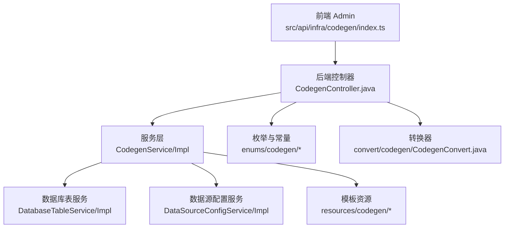
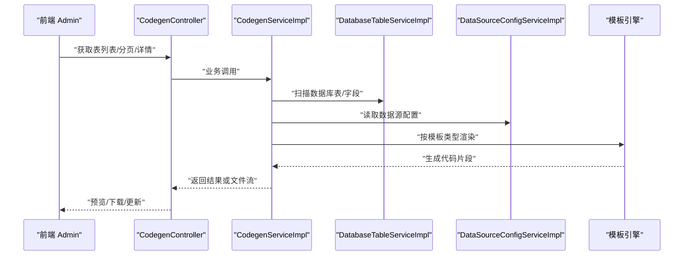
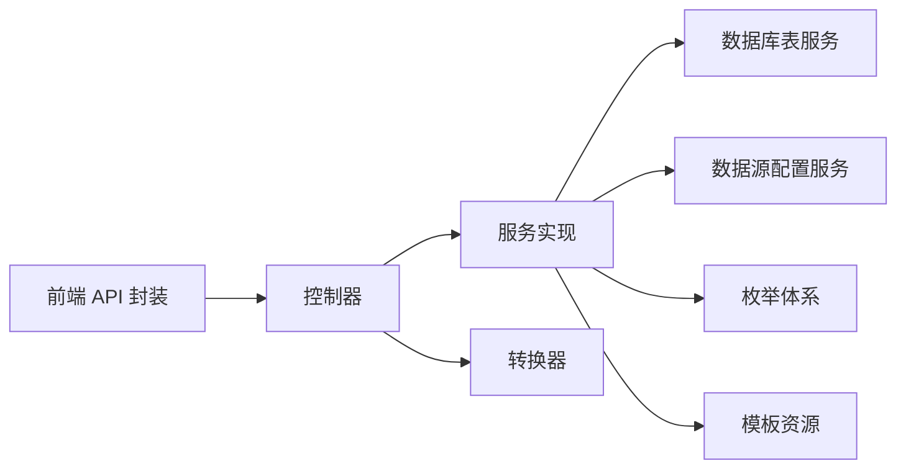
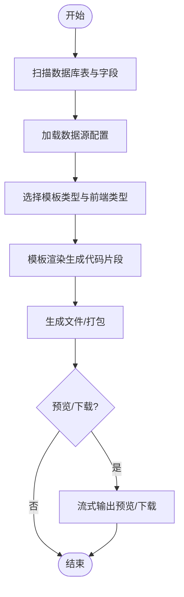

# 代码生成

<cite>
**本文引用的文件**
- [前端接口定义 index.ts](file://yudao-ui/yudao-ui-admin-vue3/src/api/infra/codegen/index.ts)
- [常量定义 constants.ts](file://yudao-ui/yudao-ui-admin-vue3/src/utils/constants.ts)
- [Infra 模块包说明 package-info.java](file://yudao-module-infra/src/main/java/cn/iocoder/yudao/module/infra/package-info.java)
- [代码生成控制器 CodegenController.java](file://yudao-module-infra/src/main/java/cn/iocoder/yudao/module/infra/controller/admin/codegen/CodegenController.java)
- [代码生成服务接口 CodegenService.java](file://yudao-module-infra/src/main/java/cn/iocoder/yudao/module/infra/service/codegen/CodegenService.java)
- [代码生成服务实现 CodegenServiceImpl.java](file://yudao-module-infra/src/main/java/cn/iocoder/yudao/module/infra/service/codegen/CodegenServiceImpl.java)
- [代码生成枚举 CodegenTemplateTypeEnum.java](file://yudao-module-infra/src/main/java/cn/iocoder/yudao/module/infra/enums/codegen/CodegenTemplateTypeEnum.java)
- [代码生成枚举 CodegenFrontTypeEnum.java](file://yudao-module-infra/src/main/java/cn/iocoder/yudao/module/infra/enums/codegen/CodegenFrontTypeEnum.java)
- [代码生成枚举 CodegenSceneEnum.java](file://yudao-module-infra/src/main/java/cn/iocoder/yudao/module/infra/enums/codegen/CodegenSceneEnum.java)
- [代码生成枚举 CodegenColumnHtmlTypeEnum.java](file://yudao-module-infra/src/main/java/cn/iocoder/yudao/module/infra/enums/codegen/CodegenColumnHtmlTypeEnum.java)
- [代码生成枚举 CodegenColumnListConditionEnum.java](file://yudao-module-infra/src/main/java/cn/iocoder/yudao/module/infra/enums/codegen/CodegenColumnListConditionEnum.java)
- [代码生成枚举 CodegenVOTypeEnum.java](file://yudao-module-infra/src/main/java/cn/iocoder/yudao/module/infra/enums/codegen/CodegenVOTypeEnum.java)
- [代码生成转换 CodegenConvert.java](file://yudao-module-infra/src/main/java/cn/iocoder/yudao/module/infra/convert/codegen/CodegenConvert.java)
- [数据库表服务接口 DatabaseTableService.java](file://yudao-module-infra/src/main/java/cn/iocoder/yudao/module/infra/service/db/DatabaseTableService.java)
- [数据库表服务实现 DatabaseTableServiceImpl.java](file://yudao-module-infra/src/main/java/cn/iocoder/yudao/module/infra/service/db/DatabaseTableServiceImpl.java)
- [数据源配置服务接口 DataSourceConfigService.java](file://yudao-module-infra/src/main/java/cn/iocoder/yudao/module/infra/service/db/DataSourceConfigService.java)
- [数据源配置服务实现 DataSourceConfigServiceImpl.java](file://yudao-module-infra/src/main/java/cn/iocoder/yudao/module/infra/service/db/DataSourceConfigServiceImpl.java)
- [代码生成表定义 infra_codegen_table.sql](file://yudao-module-infra/src/test/resources/sql/create_tables.sql)
- [代码生成模板目录结构](file://yudao-module-infra/src/main/resources/codegen/)
- [示例 SQL 模板 h2.vm](file://yudao-module-infra/src/main/resources/codegen/sql/h2.vm)
- [示例 SQL 模板 sql.vm](file://yudao-module-infra/src/main/resources/codegen/sql/sql.vm)
- [示例 Vue3 模板 api.ts.vm](file://yudao-module-infra/src/main/resources/codegen/vue3/api/api.ts.vm)
- [示例 Vue3 模板 index.vue.vm](file://yudao-module-infra/src/main/resources/codegen/vue3/views/index.vue.vm)
- [示例 Java 控制器模板 controller.vm](file://yudao-module-infra/src/main/resources/codegen/java/controller/controller.vm)
- [示例 Java DO 模板 do.vm](file://yudao-module-infra/src/main/resources/codegen/java/dal/do.vm)
- [示例 Java Mapper XML 模板 mapper.xml.vm](file://yudao-module-infra/src/main/resources/codegen/java/dal/mapper.xml.vm)
</cite>

## 目录
1. [简介](#简介)
2. [项目结构](#项目结构)
3. [核心组件](#核心组件)
4. [架构总览](#架构总览)
5. [详细组件分析](#详细组件分析)
6. [依赖分析](#依赖分析)
7. [性能考虑](#性能考虑)
8. [故障排查指南](#故障排查指南)
9. [结论](#结论)
10. [附录](#附录)

## 简介
本文件系统性介绍芋道 Ruoyi-Vue-Pro 的代码生成能力，覆盖从数据库表扫描、模板渲染、文件生成到下载预览的完整流程；并提供配置项说明、最佳实践、自定义模板开发指引以及生成后处理建议。该能力由后端 Infra 模块提供，前端通过统一 API 调用完成交互。

## 项目结构
代码生成相关能力分布在以下位置：
- 后端 Infra 模块：控制器、服务、枚举、转换、数据库表/数据源配置服务、模板资源
- 前端 Admin 管理端：统一的代码生成 API 封装与常量定义
- 模板资源：Java、SQL、Vue/Vue3、Admin UniApp、Vben 系列等多套模板

图表来源
- [前端接口定义 index.ts:1-112](file://yudao-ui/yudao-ui-admin-vue3/src/api/infra/codegen/index.ts#L1-L112)
- [代码生成控制器 CodegenController.java](file://yudao-module-infra/src/main/java/cn/iocoder/yudao/module/infra/controller/admin/codegen/CodegenController.java)
- [代码生成服务实现 CodegenServiceImpl.java](file://yudao-module-infra/src/main/java/cn/iocoder/yudao/module/infra/service/codegen/CodegenServiceImpl.java)
- [数据库表服务实现 DatabaseTableServiceImpl.java](file://yudao-module-infra/src/main/java/cn/iocoder/yudao/module/infra/service/db/DatabaseTableServiceImpl.java)
- [数据源配置服务实现 DataSourceConfigServiceImpl.java](file://yudao-module-infra/src/main/java/cn/iocoder/yudao/module/infra/service/db/DataSourceConfigServiceImpl.java)
- [代码生成模板目录结构](file://yudao-module-infra/src/main/resources/codegen/)

章节来源
- [Infra 模块包说明 package-info.java:1-9](file://yudao-module-infra/src/main/java/cn/iocoder/yudao/module/infra/package-info.java#L1-L9)
- [前端接口定义 index.ts:1-112](file://yudao-ui/yudao-ui-admin-vue3/src/api/infra/codegen/index.ts#L1-L112)

## 核心组件
- 前端 API 封装：提供查询列表、分页、详情、更新、从数据库同步、预览、下载、基于数据库创建、删除等接口
- 后端控制器：暴露 /infra/codegen 下的 REST 接口，负责参数接收与响应
- 服务层：封装生成逻辑、模板渲染、文件生成、下载打包等
- 枚举体系：模板类型、前端类型、场景、字段 HTML 类型、列表条件、VO 类型等
- 数据库表/数据源服务：负责扫描数据库表结构、字段信息
- 模板资源：多套 Velocity/Freemarker 模板，覆盖 Java、SQL、Vue/Vue3、Admin UniApp、Vben 系列

章节来源
- [前端接口定义 index.ts:1-112](file://yudao-ui/yudao-ui-admin-vue3/src/api/infra/codegen/index.ts#L1-L112)
- [代码生成服务接口 CodegenService.java](file://yudao-module-infra/src/main/java/cn/iocoder/yudao/module/infra/service/codegen/CodegenService.java)
- [代码生成服务实现 CodegenServiceImpl.java](file://yudao-module-infra/src/main/java/cn/iocoder/yudao/module/infra/service/codegen/CodegenServiceImpl.java)
- [代码生成枚举 CodegenTemplateTypeEnum.java](file://yudao-module-infra/src/main/java/cn/iocoder/yudao/module/infra/enums/codegen/CodegenTemplateTypeEnum.java)
- [代码生成枚举 CodegenFrontTypeEnum.java](file://yudao-module-infra/src/main/java/cn/iocoder/yudao/module/infra/enums/codegen/CodegenFrontTypeEnum.java)
- [代码生成枚举 CodegenSceneEnum.java](file://yudao-module-infra/src/main/java/cn/iocoder/yudao/module/infra/enums/codegen/CodegenSceneEnum.java)
- [代码生成枚举 CodegenColumnHtmlTypeEnum.java](file://yudao-module-infra/src/main/java/cn/iocoder/yudao/module/infra/enums/codegen/CodegenColumnHtmlTypeEnum.java)
- [代码生成枚举 CodegenColumnListConditionEnum.java](file://yudao-module-infra/src/main/java/cn/iocoder/yudao/module/infra/enums/codegen/CodegenColumnListConditionEnum.java)
- [代码生成枚举 CodegenVOTypeEnum.java](file://yudao-module-infra/src/main/java/cn/iocoder/yudao/module/infra/enums/codegen/CodegenVOTypeEnum.java)
- [数据库表服务接口 DatabaseTableService.java](file://yudao-module-infra/src/main/java/cn/iocoder/yudao/module/infra/service/db/DatabaseTableService.java)
- [数据源配置服务接口 DataSourceConfigService.java](file://yudao-module-infra/src/main/java/cn/iocoder/yudao/module/infra/service/db/DataSourceConfigService.java)

## 架构总览
下图展示从前端调用到后端处理、模板渲染与文件生成的整体流程：

图表来源
- [前端接口定义 index.ts:59-112](file://yudao-ui/yudao-ui-admin-vue3/src/api/infra/codegen/index.ts#L59-L112)
- [代码生成控制器 CodegenController.java](file://yudao-module-infra/src/main/java/cn/iocoder/yudao/module/infra/controller/admin/codegen/CodegenController.java)
- [代码生成服务实现 CodegenServiceImpl.java](file://yudao-module-infra/src/main/java/cn/iocoder/yudao/module/infra/service/codegen/CodegenServiceImpl.java)
- [数据库表服务实现 DatabaseTableServiceImpl.java](file://yudao-module-infra/src/main/java/cn/iocoder/yudao/module/infra/service/db/DatabaseTableServiceImpl.java)
- [数据源配置服务实现 DataSourceConfigServiceImpl.java](file://yudao-module-infra/src/main/java/cn/iocoder/yudao/module/infra/service/db/DataSourceConfigServiceImpl.java)

## 详细组件分析

### 前端 API 与交互
- 列表/分页/详情/更新：支持按数据源配置筛选、分页查询、获取详情
- 同步数据库：将数据库表/字段信息同步到代码生成表定义
- 预览/下载：支持预览生成代码与打包下载
- 基于数据库创建：根据数据库表批量创建代码生成定义
- 删除/批量删除：支持单个与批量删除

章节来源
- [前端接口定义 index.ts:1-112](file://yudao-ui/yudao-ui-admin-vue3/src/api/infra/codegen/index.ts#L1-L112)

### 后端控制器与服务
- 控制器：集中暴露 /infra/codegen/* 接口，负责参数解析与响应包装
- 服务：实现核心生成逻辑，包括模板选择、渲染、文件生成、打包下载
- 数据库表服务：扫描数据库表与字段元数据
- 数据源配置服务：提供数据源连接信息与可用表清单

章节来源
- [代码生成控制器 CodegenController.java](file://yudao-module-infra/src/main/java/cn/iocoder/yudao/module/infra/controller/admin/codegen/CodegenController.java)
- [代码生成服务接口 CodegenService.java](file://yudao-module-infra/src/main/java/cn/iocoder/yudao/module/infra/service/codegen/CodegenService.java)
- [代码生成服务实现 CodegenServiceImpl.java](file://yudao-module-infra/src/main/java/cn/iocoder/yudao/module/infra/service/codegen/CodegenServiceImpl.java)
- [数据库表服务接口 DatabaseTableService.java](file://yudao-module-infra/src/main/java/cn/iocoder/yudao/module/infra/service/db/DatabaseTableService.java)
- [数据库表服务实现 DatabaseTableServiceImpl.java](file://yudao-module-infra/src/main/java/cn/iocoder/yudao/module/infra/service/db/DatabaseTableServiceImpl.java)
- [数据源配置服务接口 DataSourceConfigService.java](file://yudao-module-infra/src/main/java/cn/iocoder/yudao/module/infra/service/db/DataSourceConfigService.java)
- [数据源配置服务实现 DataSourceConfigServiceImpl.java](file://yudao-module-infra/src/main/java/cn/iocoder/yudao/module/infra/service/db/DataSourceConfigServiceImpl.java)

### 模板体系与渲染
- 模板类型：CRUD、树形、主子表等
- 前端类型：Vue、Vue3、Admin UniApp、Vben 系列等
- 场景：常规、树结构、主子表等
- 字段 HTML 类型：输入框、选择器、日期等
- 列表条件：等于、模糊、范围等
- VO 类型：请求/响应/导入/导出等
- 模板资源：Java 控制器、DO、Mapper XML、Service、枚举、测试；SQL 脚本；Vue/Vue3 页面与 API

章节来源
- [代码生成枚举 CodegenTemplateTypeEnum.java](file://yudao-module-infra/src/main/java/cn/iocoder/yudao/module/infra/enums/codegen/CodegenTemplateTypeEnum.java)
- [代码生成枚举 CodegenFrontTypeEnum.java](file://yudao-module-infra/src/main/java/cn/iocoder/yudao/module/infra/enums/codegen/CodegenFrontTypeEnum.java)
- [代码生成枚举 CodegenSceneEnum.java](file://yudao-module-infra/src/main/java/cn/iocoder/yudao/module/infra/enums/codegen/CodegenSceneEnum.java)
- [代码生成枚举 CodegenColumnHtmlTypeEnum.java](file://yudao-module-infra/src/main/java/cn/iocoder/yudao/module/infra/enums/codegen/CodegenColumnHtmlTypeEnum.java)
- [代码生成枚举 CodegenColumnListConditionEnum.java](file://yudao-module-infra/src/main/java/cn/iocoder/yudao/module/infra/enums/codegen/CodegenColumnListConditionEnum.java)
- [代码生成枚举 CodegenVOTypeEnum.java](file://yudao-module-infra/src/main/java/cn/iocoder/yudao/module/infra/enums/codegen/CodegenVOTypeEnum.java)
- [代码生成模板目录结构](file://yudao-module-infra/src/main/resources/codegen/)
- [示例 Java 控制器模板 controller.vm](file://yudao-module-infra/src/main/resources/codegen/java/controller/controller.vm)
- [示例 Java DO 模板 do.vm](file://yudao-module-infra/src/main/resources/codegen/java/dal/do.vm)
- [示例 Java Mapper XML 模板 mapper.xml.vm](file://yudao-module-infra/src/main/resources/codegen/java/dal/mapper.xml.vm)
- [示例 Vue3 模板 api.ts.vm](file://yudao-module-infra/src/main/resources/codegen/vue3/api/api.ts.vm)
- [示例 Vue3 模板 index.vue.vm](file://yudao-module-infra/src/main/resources/codegen/vue3/views/index.vue.vm)
- [示例 SQL 模板 h2.vm](file://yudao-module-infra/src/main/resources/codegen/sql/h2.vm)
- [示例 SQL 模板 sql.vm](file://yudao-module-infra/src/main/resources/codegen/sql/sql.vm)

### 数据模型与表结构
- 代码生成表定义表：记录模板类型、模块名、业务名、类名、作者、父菜单、树形字段、主子关联等
- 代码生成字段定义表：记录字段元数据、Java 映射、字典类型、HTML 类型、列表条件与操作开关等

章节来源
- [代码生成表定义 infra_codegen_table.sql:163-189](file://yudao-module-infra/src/test/resources/sql/create_tables.sql#L163-L189)
- [代码生成表定义 infra_codegen_table.sql:191-216](file://yudao-module-infra/src/test/resources/sql/create_tables.sql#L191-L216)

### 前端常量与模板类型
- 模板类型常量：CRUD、树形、主子表
- 前端类型常量：Vue、Vue3、Admin UniApp、Vben 系列
- 场景常量：常规、树结构、主子表
- 字段 HTML 类型、列表条件、VO 类型等常量

章节来源
- [常量定义 constants.ts:76-102](file://yudao-ui/yudao-ui-admin-vue3/src/utils/constants.ts#L76-L102)

## 依赖分析
- 前端依赖后端接口：通过统一 axios 请求封装调用
- 控制器依赖服务层：解耦业务逻辑与接口层
- 服务层依赖数据库表/数据源服务：获取元数据
- 服务层依赖模板资源：按模板类型渲染
- 枚举与转换器：保证前后端一致的数据语义

图表来源
- [前端接口定义 index.ts:1-112](file://yudao-ui/yudao-ui-admin-vue3/src/api/infra/codegen/index.ts#L1-L112)
- [代码生成服务实现 CodegenServiceImpl.java](file://yudao-module-infra/src/main/java/cn/iocoder/yudao/module/infra/service/codegen/CodegenServiceImpl.java)
- [数据库表服务实现 DatabaseTableServiceImpl.java](file://yudao-module-infra/src/main/java/cn/iocoder/yudao/module/infra/service/db/DatabaseTableServiceImpl.java)
- [数据源配置服务实现 DataSourceConfigServiceImpl.java](file://yudao-module-infra/src/main/java/cn/iocoder/yudao/module/infra/service/db/DataSourceConfigServiceImpl.java)
- [代码生成转换 CodegenConvert.java](file://yudao-module-infra/src/main/java/cn/iocoder/yudao/module/infra/convert/codegen/CodegenConvert.java)

## 性能考虑
- 模板渲染：优先使用轻量模板，避免复杂嵌套与重复计算
- 数据库扫描：按需扫描，限制表数量，使用分页与缓存
- 文件生成：大文件采用流式输出，避免一次性加载至内存
- 并发控制：生成任务排队或限流，防止数据库与磁盘 IO 抖动
- 预览与下载：预览走内存流，下载走临时文件或压缩包流

## 故障排查指南
- 数据源不可用：检查数据源配置服务中的连接信息与可用表清单
- 模板缺失：确认模板类型与前端类型匹配，模板资源目录完整
- 权限问题：确保生成目录可写，下载路径可访问
- 字段映射异常：核对字段 HTML 类型与列表条件是否合理
- 预览为空：检查模板渲染上下文与字段定义是否完整

章节来源
- [数据源配置服务实现 DataSourceConfigServiceImpl.java](file://yudao-module-infra/src/main/java/cn/iocoder/yudao/module/infra/service/db/DataSourceConfigServiceImpl.java)
- [数据库表服务实现 DatabaseTableServiceImpl.java](file://yudao-module-infra/src/main/java/cn/iocoder/yudao/module/infra/service/db/DatabaseTableServiceImpl.java)
- [代码生成服务实现 CodegenServiceImpl.java](file://yudao-module-infra/src/main/java/cn/iocoder/yudao/module/infra/service/codegen/CodegenServiceImpl.java)

## 结论
该代码生成器提供了从数据库表到前后端代码与 SQL 脚本的自动化能力，配合多模板体系与完善的枚举配置，能够显著提升研发效率。建议在实际使用中结合最佳实践进行表设计与字段映射，以获得更高质量的生成结果。

## 附录

### 配置选项速查
- 模板类型：CRUD、树形、主子表
- 前端类型：Vue、Vue3、Admin UniApp、Vben 系列
- 场景：常规、树结构、主子表
- 字段 HTML 类型：输入框、选择器、日期等
- 列表条件：等于、模糊、范围等
- VO 类型：请求/响应/导入/导出等

章节来源
- [常量定义 constants.ts:76-102](file://yudao-ui/yudao-ui-admin-vue3/src/utils/constants.ts#L76-L102)
- [代码生成枚举 CodegenTemplateTypeEnum.java](file://yudao-module-infra/src/main/java/cn/iocoder/yudao/module/infra/enums/codegen/CodegenTemplateTypeEnum.java)
- [代码生成枚举 CodegenFrontTypeEnum.java](file://yudao-module-infra/src/main/java/cn/iocoder/yudao/module/infra/enums/codegen/CodegenFrontTypeEnum.java)
- [代码生成枚举 CodegenSceneEnum.java](file://yudao-module-infra/src/main/java/cn/iocoder/yudao/module/infra/enums/codegen/CodegenSceneEnum.java)
- [代码生成枚举 CodegenColumnHtmlTypeEnum.java](file://yudao-module-infra/src/main/java/cn/iocoder/yudao/module/infra/enums/codegen/CodegenColumnHtmlTypeEnum.java)
- [代码生成枚举 CodegenColumnListConditionEnum.java](file://yudao-module-infra/src/main/java/cn/iocoder/yudao/module/infra/enums/codegen/CodegenColumnListConditionEnum.java)
- [代码生成枚举 CodegenVOTypeEnum.java](file://yudao-module-infra/src/main/java/cn/iocoder/yudao/module/infra/enums/codegen/CodegenVOTypeEnum.java)

### 执行流程（算法）

图表来源
- [数据库表服务实现 DatabaseTableServiceImpl.java](file://yudao-module-infra/src/main/java/cn/iocoder/yudao/module/infra/service/db/DatabaseTableServiceImpl.java)
- [数据源配置服务实现 DataSourceConfigServiceImpl.java](file://yudao-module-infra/src/main/java/cn/iocoder/yudao/module/infra/service/db/DataSourceConfigServiceImpl.java)
- [代码生成服务实现 CodegenServiceImpl.java](file://yudao-module-infra/src/main/java/cn/iocoder/yudao/module/infra/service/codegen/CodegenServiceImpl.java)

### 最佳实践
- 表设计规范：主键、非空、注释清晰、索引合理
- 字段命名约定：下划线转驼峰、前缀后缀统一
- 主外键关系：明确关系与级联策略
- 索引优化：常见查询条件建立索引，避免冗余索引
- 模板选择：根据业务形态选择 CRUD/树形/主子表模板
- 字段映射：合理设置 HTML 类型与列表条件，减少二次调整

### 自定义模板开发
- 模板语法：支持 Velocity 与 Freemarker（依据模板扩展）
- 模板位置：resources/codegen/{java|vue|vue3|sql|...}
- 自定义生成逻辑：在服务层扩展模板渲染与文件生成逻辑
- 批量替换与代码重构：生成后统一替换包名、模块名、业务名等

章节来源
- [代码生成模板目录结构](file://yudao-module-infra/src/main/resources/codegen/)
- [代码生成服务实现 CodegenServiceImpl.java](file://yudao-module-infra/src/main/java/cn/iocoder/yudao/module/infra/service/codegen/CodegenServiceImpl.java)

### 生成后处理
- 二次开发：生成代码作为起点，按团队规范补充校验、日志、异常处理
- 模板优化：持续迭代模板，提升生成质量与一致性
- 批量替换：统一替换包名、模块名、业务名、作者、时间戳等
- 代码重构：合并重复逻辑、抽取公共组件、优化命名与注释