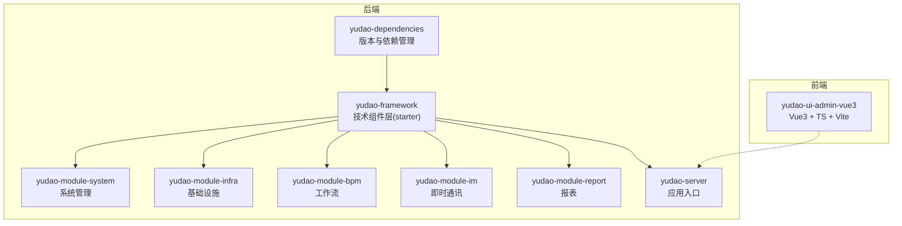
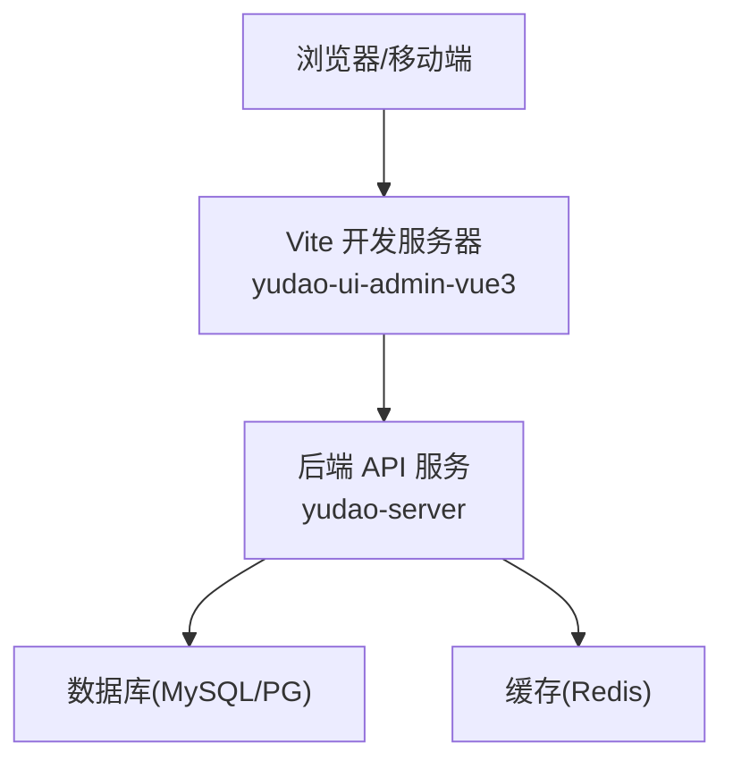
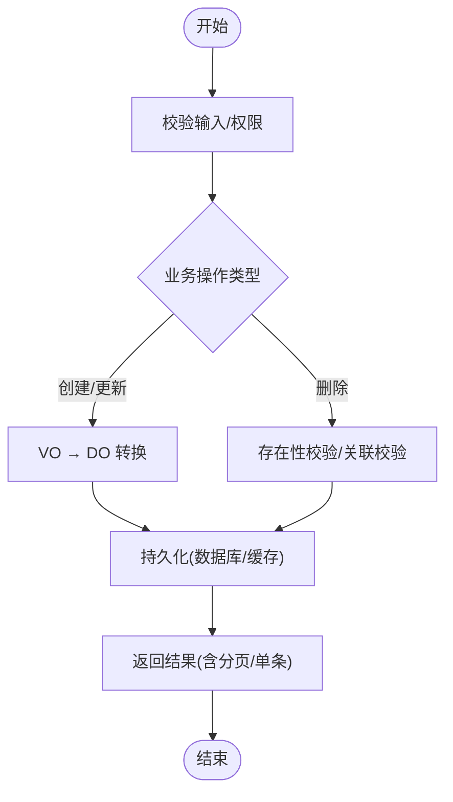
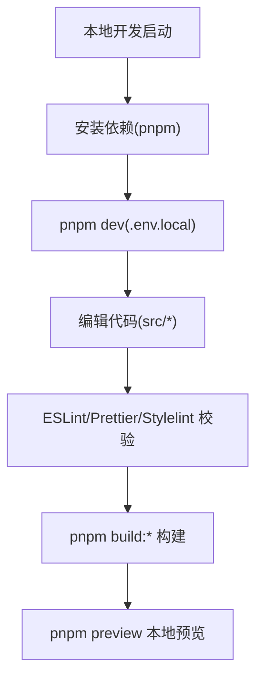
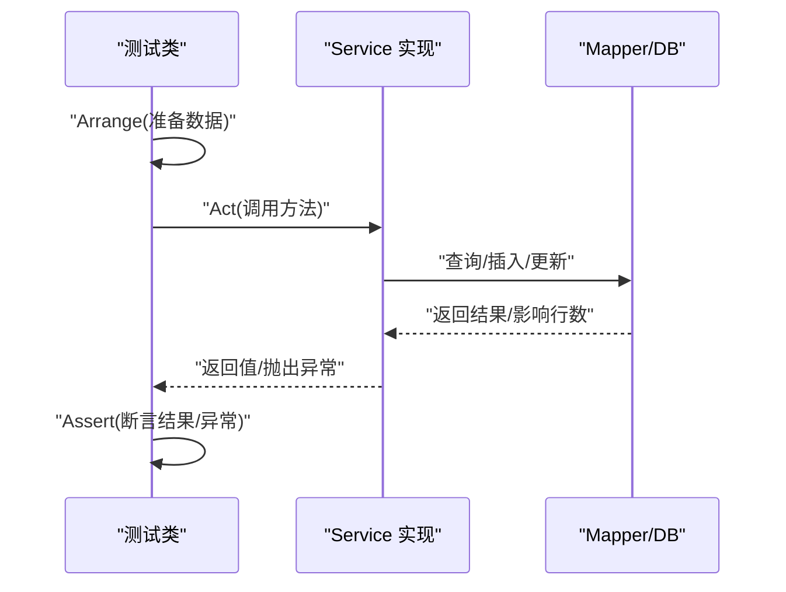
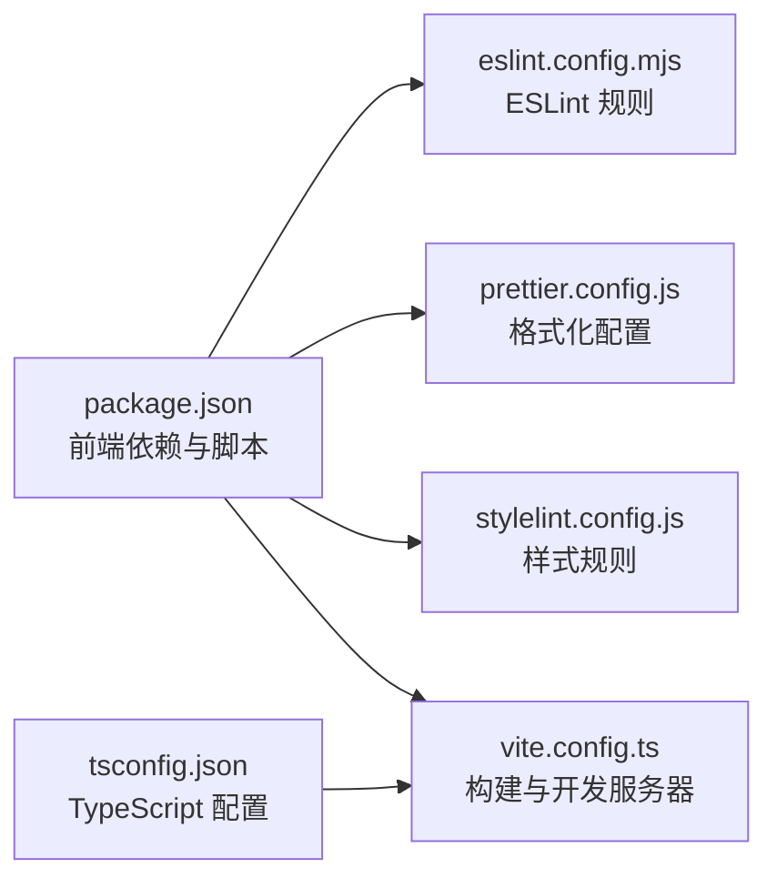

# 开发指南

<cite>
**本文引用的文件**
- [DEVELOPMENT-GUIDE.md](file://DEVELOPMENT-GUIDE.md)
- [README.md](file://README.md)
- [STARTUP.md](file://STARTUP.md)
- [eslint.config.mjs](file://yudao-ui/yudao-ui-admin-vue3/eslint.config.mjs)
- [prettier.config.js](file://yudao-ui/yudao-ui-admin-vue3/prettier.config.js)
- [stylelint.config.js](file://yudao-ui/yudao-ui-admin-vue3/stylelint.config.js)
- [tsconfig.json](file://yudao-ui/yudao-ui-admin-vue3/tsconfig.json)
- [vite.config.ts](file://yudao-ui/yudao-ui-admin-vue3/vite.config.ts)
- [package.json](file://yudao-ui/yudao-ui-admin-vue3/package.json)
</cite>

## 目录
1. [简介](#简介)
2. [项目结构](#项目结构)
3. [核心组件](#核心组件)
4. [架构总览](#架构总览)
5. [详细组件分析](#详细组件分析)
6. [依赖分析](#依赖分析)
7. [性能考虑](#性能考虑)
8. [故障排查指南](#故障排查指南)
9. [结论](#结论)
10. [附录](#附录)

## 简介
本开发指南面向“芋道 Ruoyi-Vue-Pro”项目，系统化阐述后端 Java 与前端 Vue 的开发规范、编码标准、测试与调试技巧、代码生成器使用、模块扩展流程以及常见问题处理。文档内容来源于项目官方开发规范与前端工程化配置，确保读者能够快速、一致地开展开发工作。

## 项目结构
- 后端采用多模块 Maven 架构，包含依赖版本管理、技术组件层（starter）、业务模块（system、infra、bpm、im、report 等）、服务聚合模块（server）。
- 前端采用 Vue3 + TypeScript + Vite + Element Plus + Pinia + UnoCSS 技术栈，工程化配置覆盖 ESLint、Prettier、Stylelint、TypeScript、Vite 等。

**章节来源**
- [README.md: 324-348:324-348](file://README.md#L324-L348)
- [DEVELOPMENT-GUIDE.md: 22-46:22-46](file://DEVELOPMENT-GUIDE.md#L22-L46)

## 核心组件
- 后端分层与依赖方向：Controller → Service → DAL，严禁反向依赖。
- 核心基类与约定：BaseDO、BaseMapperX、CommonResult、PageParam/PageResult、ErrorCode。
- 前端工程化：ESLint、Prettier、Stylelint、TypeScript、Vite、包脚本与环境变量。

**章节来源**
- [DEVELOPMENT-GUIDE.md: 64-83:64-83](file://DEVELOPMENT-GUIDE.md#L64-L83)
- [eslint.config.mjs: 1-116:1-116](file://yudao-ui/yudao-ui-admin-vue3/eslint.config.mjs#L1-L116)
- [prettier.config.js: 1-23:1-23](file://yudao-ui/yudao-ui-admin-vue3/prettier.config.js#L1-L23)
- [stylelint.config.js: 1-236:1-236](file://yudao-ui/yudao-ui-admin-vue3/stylelint.config.js#L1-L236)
- [tsconfig.json: 1-45:1-45](file://yudao-ui/yudao-ui-admin-vue3/tsconfig.json#L1-L45)
- [vite.config.ts: 1-102:1-102](file://yudao-ui/yudao-ui-admin-vue3/vite.config.ts#L1-L102)
- [package.json: 1-158:1-158](file://yudao-ui/yudao-ui-admin-vue3/package.json#L1-L158)

## 架构总览
后端通过 yudao-server 聚合各模块，前端通过 Vite 开发服务器与后端 API 交互；基础设施模块提供代码生成、文件存储、定时任务、监控与链路追踪等能力。

**图表来源**
- [README.md: 46-59:46-59](file://README.md#L46-L59)
- [STARTUP.md: 56-58:56-58](file://STARTUP.md#L56-L58)

**章节来源**
- [README.md: 46-59:46-59](file://README.md#L46-L59)
- [STARTUP.md: 56-58:56-58](file://STARTUP.md#L56-L58)

## 详细组件分析

### 后端开发规范与编码标准
- 分层与命名
  - 控制器、服务、Mapper、DO、VO、枚举、转换器、错误码常量等命名规范明确，便于团队协作与代码一致性。
  - 包命名统一为 `cn.iocoder.yudao.module.{moduleCode}.{layer}.{domain}`。
- API 设计
  - RESTful 风格，URL 使用小写短横线；统一响应包装为 CommonResult；分页使用 PageParam/PageResult。
  - 权限控制使用 @PreAuthorize 注解，配合统一权限表达式。
- 数据库与 ORM
  - 表命名统一为 `{module}_{domain}`；DO 继承 BaseDO/TenantBaseDO；Mapper 继承 BaseMapperX，查询使用 LambdaQueryWrapperX 的 ifPresent 方法。
- VO/DTO 设计
  - SaveReqVO 用于创建/修改；PageReqVO 继承 PageParam；RespVO 作为响应对象；校验注解覆盖常见场景。
- 异常与错误码
  - 每个模块定义 ErrorCodeConstants；Service 层通过私有校验方法统一抛异常；支持参数化错误提示。
- Service 层规范
  - 接口定义核心方法并提供默认便捷方法；写操作遵循“校验 → 转换 → 持久化 → 返回”的固定步骤；缓存策略使用 @Cacheable/@CacheEvict。
- 测试规范
  - 基类选择：BaseMockitoUnitTest、BaseDbUnitTest、BaseRedisUnitTest；测试方法采用 AAA 模式；异常断言使用 assertServiceException；测试数据准备使用 randomPojo 等工具；支持按模块与类/方法粒度运行测试。

**图表来源**
- [DEVELOPMENT-GUIDE.md: 500-542:500-542](file://DEVELOPMENT-GUIDE.md#L500-L542)

**章节来源**
- [DEVELOPMENT-GUIDE.md: 86-140:86-140](file://DEVELOPMENT-GUIDE.md#L86-L140)
- [DEVELOPMENT-GUIDE.md: 143-250:143-250](file://DEVELOPMENT-GUIDE.md#L143-L250)
- [DEVELOPMENT-GUIDE.md: 252-323:252-323](file://DEVELOPMENT-GUIDE.md#L252-L323)
- [DEVELOPMENT-GUIDE.md: 325-412:325-412](file://DEVELOPMENT-GUIDE.md#L325-L412)
- [DEVELOPMENT-GUIDE.md: 414-470:414-470](file://DEVELOPMENT-GUIDE.md#L414-L470)
- [DEVELOPMENT-GUIDE.md: 472-571:472-571](file://DEVELOPMENT-GUIDE.md#L472-L571)
- [DEVELOPMENT-GUIDE.md: 574-650:574-650](file://DEVELOPMENT-GUIDE.md#L574-L650)

### 前端开发规范与编码标准
- 技术栈：Vue3 + TypeScript + Element Plus + Vite + Pinia + UnoCSS。
- API 文件组织：统一放置在 `src/api/{module}/{domain}/index.ts`，方法命名与后端 API 对应。
- 页面组件结构：主页面 index.vue + components/{Domain}Form.vue 表单弹窗。
- 编码风格与工具链：
  - ESLint：Flat 配置，禁用部分 Vue/TS 规则以适配项目风格。
  - Prettier：统一缩进、引号、尾逗号、箭头函数括号等。
  - Stylelint：CSS/SCSS/HTML 规则与顺序，忽略部分未知伪类/伪元素。
  - TypeScript：严格模式、路径别名 @/*、类型声明文件纳入 include。
  - Vite：环境变量加载、代理关闭（服务端已支持 CORS）、构建优化与代码分割。
- 包脚本：dev/dev-server、build:*、lint:*、预览等，便于本地与 CI 使用。

**图表来源**
- [STARTUP.md: 62-88:62-88](file://STARTUP.md#L62-L88)
- [eslint.config.mjs: 1-116:1-116](file://yudao-ui/yudao-ui-admin-vue3/eslint.config.mjs#L1-L116)
- [prettier.config.js: 1-23:1-23](file://yudao-ui/yudao-ui-admin-vue3/prettier.config.js#L1-L23)
- [stylelint.config.js: 1-236:1-236](file://yudao-ui/yudao-ui-admin-vue3/stylelint.config.js#L1-L236)
- [tsconfig.json: 1-45:1-45](file://yudao-ui/yudao-ui-admin-vue3/tsconfig.json#L1-L45)
- [vite.config.ts: 14-102:14-102](file://yudao-ui/yudao-ui-admin-vue3/vite.config.ts#L14-L102)
- [package.json: 7-26:7-26](file://yudao-ui/yudao-ui-admin-vue3/package.json#L7-L26)

**章节来源**
- [DEVELOPMENT-GUIDE.md: 653-778:653-778](file://DEVELOPMENT-GUIDE.md#L653-L778)
- [STARTUP.md: 62-88:62-88](file://STARTUP.md#L62-L88)
- [eslint.config.mjs: 1-116:1-116](file://yudao-ui/yudao-ui-admin-vue3/eslint.config.mjs#L1-L116)
- [prettier.config.js: 1-23:1-23](file://yudao-ui/yudao-ui-admin-vue3/prettier.config.js#L1-L23)
- [stylelint.config.js: 1-236:1-236](file://yudao-ui/yudao-ui-admin-vue3/stylelint.config.js#L1-L236)
- [tsconfig.json: 1-45:1-45](file://yudao-ui/yudao-ui-admin-vue3/tsconfig.json#L1-L45)
- [vite.config.ts: 14-102:14-102](file://yudao-ui/yudao-ui-admin-vue3/vite.config.ts#L14-L102)
- [package.json: 1-158:1-158](file://yudao-ui/yudao-ui-admin-vue3/package.json#L1-L158)

### 单元测试编写指南
- 测试基类选择
  - BaseMockitoUnitTest：纯 Mockito 单元测试，不启动 Spring 容器。
  - BaseDbUnitTest：内存数据库（H2）自动建表与清理，适合数据库相关测试。
  - BaseRedisUnitTest：内嵌 jedis-mock，适合 Redis 相关测试。
- 测试方法模式（AAA）
  - Arrange：准备随机测试数据与上下文。
  - Act：调用被测方法。
  - Assert：断言结果与异常。
- 异常断言
  - 使用 assertServiceException 验证业务异常码。
- 测试数据准备
  - randomPojo、randomCommonStatus、randomEmail 等工具方法。
- 运行测试
  - 全量：mvn test；按模块：-pl yudao-module-xxx；按类/方法：-Dtest=...#...

**图表来源**
- [DEVELOPMENT-GUIDE.md: 584-604:584-604](file://DEVELOPMENT-GUIDE.md#L584-L604)
- [DEVELOPMENT-GUIDE.md: 606-627:606-627](file://DEVELOPMENT-GUIDE.md#L606-L627)

**章节来源**
- [DEVELOPMENT-GUIDE.md: 574-650:574-650](file://DEVELOPMENT-GUIDE.md#L574-L650)

### 调试技巧与开发工具
- 后端
  - 使用 Spring Boot DevTools（如启用）热重启；通过 application-local.yaml 调整日志级别与数据库/Redis 连接。
  - Swagger 文档：http://localhost:48080/swagger-ui。
- 前端
  - Vite 开发服务器默认端口与自动打开浏览器；.env.local/.env.dev/.env.prod 切换后端地址。
  - ESLint/Prettier/Stylelint 脚本在 package.json 中提供 lint:* 命令，可在提交前统一格式。
- 常见问题
  - 模块未启用导致依赖缺失：检查根 pom.xml 与 yudao-server/pom.xml 的模块启用状态。
  - 前端依赖安装报错：确认 .npmrc 中 onlyBuiltDependencies 设置，必要时追加包名。

**章节来源**
- [STARTUP.md: 56-58:56-58](file://STARTUP.md#L56-L58)
- [STARTUP.md: 89-96:89-96](file://STARTUP.md#L89-L96)
- [STARTUP.md: 144-157:144-157](file://STARTUP.md#L144-L157)
- [package.json: 22-25:22-25](file://yudao-ui/yudao-ui-admin-vue3/package.json#L22-L25)

### 代码生成器使用指南
- 基础设施模块提供代码生成能力，支持：
  - 前后端代码生成（Java、Vue、SQL、单元测试）。
  - CRUD 下载与 API 文档生成。
- 使用场景
  - 快速落地新模块：先设计表结构，再一键生成 Java/前端/SQL/测试/文档，减少重复劳动。
  - 统一规范：生成物遵循项目命名、分层、VO/DTO、异常与测试规范。

**章节来源**
- [README.md: 205-207:205-207](file://README.md#L205-L207)
- [DEVELOPMENT-GUIDE.md: 472-571:472-571](file://DEVELOPMENT-GUIDE.md#L472-L571)

### 模块扩展开发指南
- 新模块创建
  - 在 yudao-framework 下新增 starter 或在 yudao-module-* 下创建新模块，遵循统一包结构与分层。
  - 在 yudao-server 中引入模块依赖，确保根 pom.xml 与 yudao-server/pom.xml 同步启用。
- 接口设计
  - 遵循 RESTful 风格与统一响应包装；权限注解与错误码常量按模块定义。
- 数据库表设计
  - 表名采用 {module}_{domain}；DO 继承 BaseDO/TenantBaseDO；Mapper 继承 BaseMapperX。
- 前端页面开发
  - API 文件组织与方法命名遵循规范；页面结构采用 index.vue + 表单组件；使用 Composition API 与 Element Plus。

**章节来源**
- [DEVELOPMENT-GUIDE.md: 47-63:47-63](file://DEVELOPMENT-GUIDE.md#L47-L63)
- [DEVELOPMENT-GUIDE.md: 143-250:143-250](file://DEVELOPMENT-GUIDE.md#L143-L250)
- [DEVELOPMENT-GUIDE.md: 252-323:252-323](file://DEVELOPMENT-GUIDE.md#L252-L323)
- [DEVELOPMENT-GUIDE.md: 653-778:653-778](file://DEVELOPMENT-GUIDE.md#L653-L778)
- [STARTUP.md: 789-796:789-796](file://STARTUP.md#L789-L796)

## 依赖分析
- 后端模块依赖
  - yudao-dependencies 统一版本；yudao-framework 封装通用能力；业务模块依赖框架层；yudao-server 聚合模块。
- 前端依赖
  - Vue3、Element Plus、Pinia、UnoCSS、Axios、Vite 等；通过 package.json 管理脚本与开发依赖。

**图表来源**
- [package.json: 1-158:1-158](file://yudao-ui/yudao-ui-admin-vue3/package.json#L1-L158)
- [tsconfig.json: 1-45:1-45](file://yudao-ui/yudao-ui-admin-vue3/tsconfig.json#L1-L45)
- [eslint.config.mjs: 1-116:1-116](file://yudao-ui/yudao-ui-admin-vue3/eslint.config.mjs#L1-L116)
- [prettier.config.js: 1-23:1-23](file://yudao-ui/yudao-ui-admin-vue3/prettier.config.js#L1-L23)
- [stylelint.config.js: 1-236:1-236](file://yudao-ui/yudao-ui-admin-vue3/stylelint.config.js#L1-L236)
- [vite.config.ts: 14-102:14-102](file://yudao-ui/yudao-ui-admin-vue3/vite.config.ts#L14-L102)

**章节来源**
- [package.json: 1-158:1-158](file://yudao-ui/yudao-ui-admin-vue3/package.json#L1-L158)
- [tsconfig.json: 1-45:1-45](file://yudao-ui/yudao-ui-admin-vue3/tsconfig.json#L1-L45)
- [eslint.config.mjs: 1-116:1-116](file://yudao-ui/yudao-ui-admin-vue3/eslint.config.mjs#L1-L116)
- [prettier.config.js: 1-23:1-23](file://yudao-ui/yudao-ui-admin-vue3/prettier.config.js#L1-L23)
- [stylelint.config.js: 1-236:1-236](file://yudao-ui/yudao-ui-admin-vue3/stylelint.config.js#L1-L236)
- [vite.config.ts: 14-102:14-102](file://yudao-ui/yudao-ui-admin-vue3/vite.config.ts#L14-L102)

## 性能考虑
- 后端
  - 使用 BaseMapperX 的分页与批量能力；合理使用缓存注解；避免 N+1 查询；参数校验与 DTO 转换减少冗余。
- 前端
  - Vite 构建开启 Terser 压缩与按需拆分；UnoCSS 与 LightningCSS 提升样式处理性能；合理使用懒加载与组件缓存。
- 监控与追踪
  - 基础设施模块提供 Java 监控、链路追踪、日志中心等能力，便于定位性能瓶颈。

**章节来源**
- [DEVELOPMENT-GUIDE.md: 544-554:544-554](file://DEVELOPMENT-GUIDE.md#L544-L554)
- [README.md: 217-222:217-222](file://README.md#L217-L222)
- [vite.config.ts: 76-98:76-98](file://yudao-ui/yudao-ui-admin-vue3/vite.config.ts#L76-L98)

## 故障排查指南
- 后端启动失败（找不到模块）
  - 检查根 pom.xml 与 yudao-server/pom.xml 的模块启用状态是否一致。
- 前端依赖安装报错
  - 确认 .npmrc 中 onlyBuiltDependencies 配置，必要时追加包名。
- Redis/数据库连接失败
  - 检查 application-local.yaml 中的连接地址、用户名、密码，以及远程服务器端口是否开放。
- Swagger 文档访问
  - 启动后端访问 http://localhost:48080/swagger-ui。

**章节来源**
- [STARTUP.md: 144-157:144-157](file://STARTUP.md#L144-L157)

## 结论
本指南总结了芋道 Ruoyi-Vue-Pro 的开发规范、前后端工程化配置、测试与调试方法、代码生成器使用与模块扩展流程。遵循统一的命名、分层与 API 设计规范，结合前端工程化工具链与后端基础设施能力，可显著提升开发效率与代码质量。

## 附录
- 启动与环境
  - 后端：初始化数据库、配置 application-local.yaml、mvn spring-boot:run 或 IDE 启动。
  - 前端：pnpm install、pnpm dev、切换 .env.* 指向不同后端环境。
- 版本与模块
  - 项目版本与模块清单详见 README；模块启用需两处同步配置。

**章节来源**
- [STARTUP.md: 17-58:17-58](file://STARTUP.md#L17-L58)
- [README.md: 24-35:24-35](file://README.md#L24-L35)
- [README.md: 324-348:324-348](file://README.md#L324-L348)