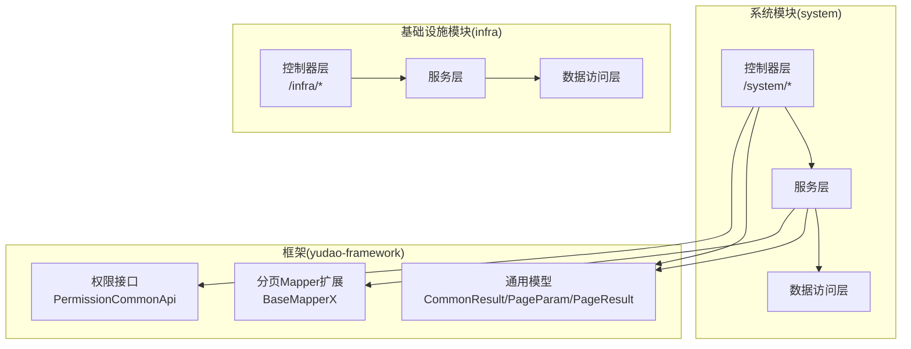
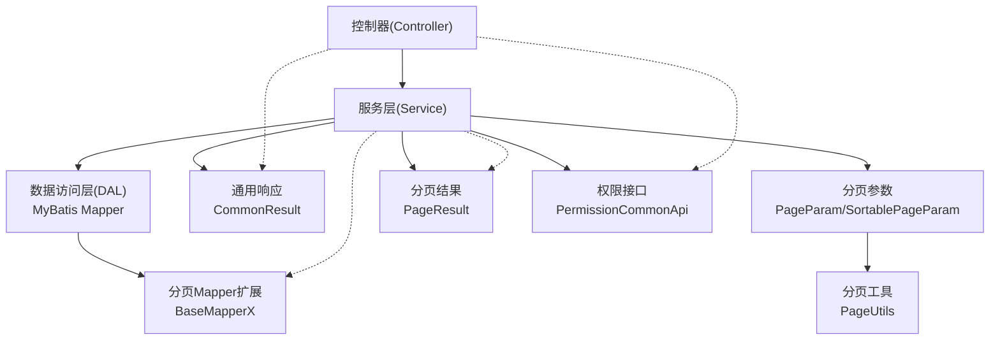
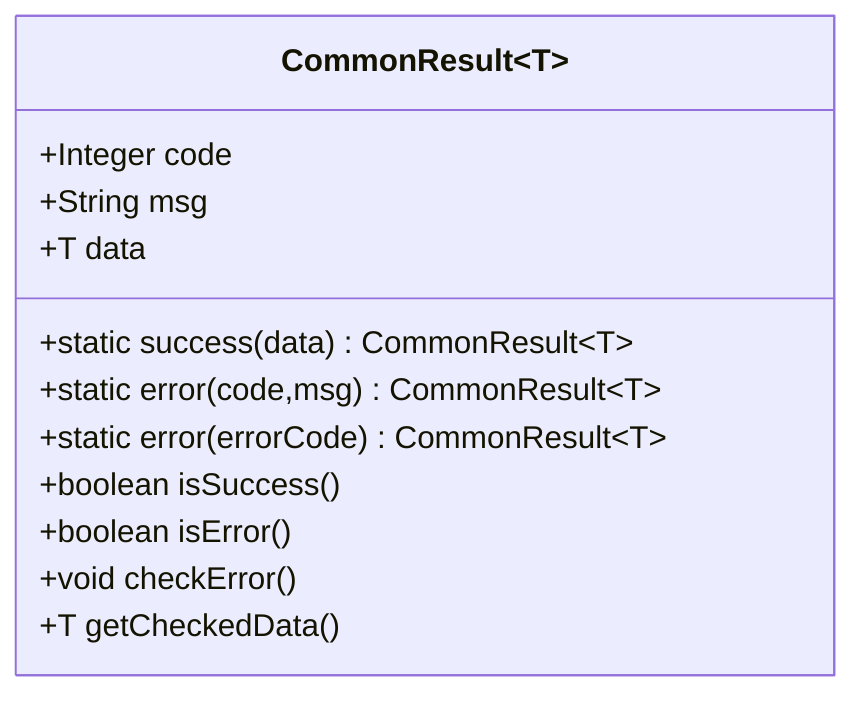
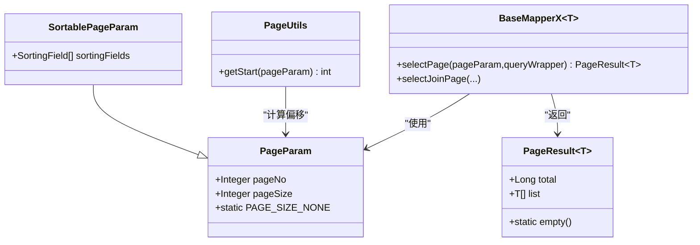
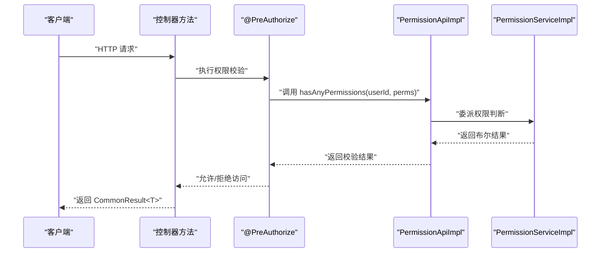
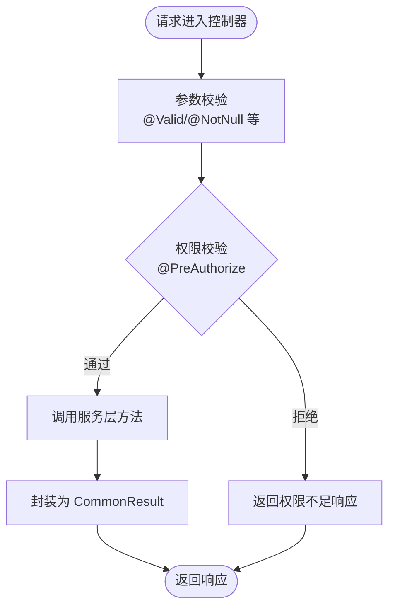
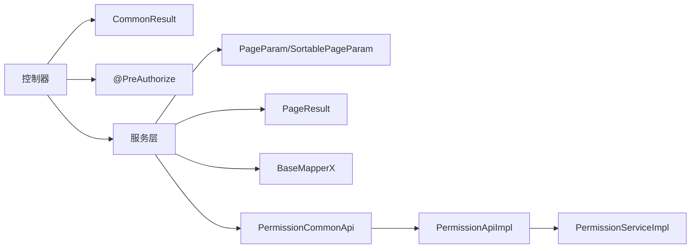

# REST API设计规范

<cite>
**本文档引用的文件**
- [DEVELOPMENT-GUIDE.md](file://DEVELOPMENT-GUIDE.md)
- [CommonResult.java](file://yudao-framework/yudao-common/src/main/java/cn/iocoder/yudao/framework/common/pojo/CommonResult.java)
- [PageParam.java](file://yudao-framework/yudao-common/src/main/java/cn/iocoder/yudao/framework/common/pojo/PageParam.java)
- [PageResult.java](file://yudao-framework/yudao-common/src/main/java/cn/iocoder/yudao/framework/common/pojo/PageResult.java)
- [SortablePageParam.java](file://yudao-framework/yudao-common/src/main/java/cn/iocoder/yudao/framework/common/pojo/SortablePageParam.java)
- [PageUtils.java](file://yudao-framework/yudao-common/src/main/java/cn/iocoder/yudao/framework/common/util/object/PageUtils.java)
- [BaseMapperX.java](file://yudao-framework/yudao-spring-boot-starter-mybatis/src/main/java/cn/iocoder/yudao/framework/mybatis/core/mapper/BaseMapperX.java)
- [PermissionCommonApi.java](file://yudao-framework/yudao-common/src/main/java/cn/iocoder/yudao/framework/common/biz/system/permission/PermissionCommonApi.java)
- [PermissionApi.java](file://yudao-module-system/src/main/java/cn/iocoder/yudao/module/system/api/permission/PermissionApi.java)
- [PermissionApiImpl.java](file://yudao-module-system/src/main/java/cn/iocoder/yudao/module/system/api/permission/PermissionApiImpl.java)
- [PermissionServiceImpl.java](file://yudao-module-system/src/main/java/cn/iocoder/yudao/module/system/service/permission/PermissionServiceImpl.java)
- [controller.vm](file://yudao-module-infra/src/main/resources/codegen/java/controller/controller.vm)
- [package-info.java](file://yudao-module-system/src/main/java/cn/iocoder/yudao/module/system/package-info.java)
</cite>

## 目录
1. [简介](#简介)
2. [项目结构](#项目结构)
3. [核心组件](#核心组件)
4. [架构概览](#架构概览)
5. [详细组件分析](#详细组件分析)
6. [依赖关系分析](#依赖关系分析)
7. [性能考虑](#性能考虑)
8. [故障排查指南](#故障排查指南)
9. [结论](#结论)

## 简介
本规范面向芋道 Ruoyi-Vue-Pro 项目的 REST API 设计与实现，统一接口风格、响应格式、分页约定与权限控制方式，确保前后端协作一致、可维护性强。规范内容来源于项目开发指南与核心框架实现，覆盖 URL 路径设计、统一响应格式、分页参数与结果、权限注解使用以及控制器方法示例。

## 项目结构
- 后端采用模块化分层架构，系统模块（system）、基础设施模块（infra）、工作流模块（bpm）、即时通讯模块（im）等分别位于独立子模块中。
- 控制器层（Controller）统一以模块名开头的路径前缀组织，避免不同模块间 URL 冲突。
- 通用响应、分页参数、权限接口等位于 yudao-framework 模块，供各业务模块复用。

图表来源
- [package-info.java:1-8](file://yudao-module-system/src/main/java/cn/iocoder/yudao/module/system/package-info.java#L1-L8)
- [CommonResult.java:1-121](file://yudao-framework/yudao-common/src/main/java/cn/iocoder/yudao/framework/common/pojo/CommonResult.java#L1-L121)
- [PageParam.java:1-36](file://yudao-framework/yudao-common/src/main/java/cn/iocoder/yudao/framework/common/pojo/PageParam.java#L1-L36)
- [PageResult.java:1-41](file://yudao-framework/yudao-common/src/main/java/cn/iocoder/yudao/framework/common/pojo/PageResult.java#L1-L41)
- [PermissionCommonApi.java:1-38](file://yudao-framework/yudao-common/src/main/java/cn/iocoder/yudao/framework/common/biz/system/permission/PermissionCommonApi.java#L1-L38)
- [BaseMapperX.java:23-92](file://yudao-framework/yudao-spring-boot-starter-mybatis/src/main/java/cn/iocoder/yudao/framework/mybatis/core/mapper/BaseMapperX.java#L23-L92)

章节来源
- [package-info.java:1-8](file://yudao-module-system/src/main/java/cn/iocoder/yudao/module/system/package-info.java#L1-L8)

## 核心组件
- 统一响应格式：所有接口统一返回 CommonResult<T>，包含 code、msg、data 字段，成功时 code 为 0，msg 为空字符串，data 为业务数据。
- 分页约定：请求参数 PageParam（pageNo、pageSize），响应格式 PageResult<T>（total、list）。支持不分页导出场景（pageSize=-1）。
- 权限注解：使用 @PreAuthorize 进行接口级权限控制，权限表达式通过 @ss.hasPermission(...) 调用。
- 控制器示例：提供创建、更新、删除、查询等标准实现模式，路径采用小写短横线分隔。

章节来源
- [DEVELOPMENT-GUIDE.md:143-251](file://DEVELOPMENT-GUIDE.md#L143-L251)
- [CommonResult.java:1-121](file://yudao-framework/yudao-common/src/main/java/cn/iocoder/yudao/framework/common/pojo/CommonResult.java#L1-L121)
- [PageParam.java:1-36](file://yudao-framework/yudao-common/src/main/java/cn/iocoder/yudao/framework/common/pojo/PageParam.java#L1-L36)
- [PageResult.java:1-41](file://yudao-framework/yudao-common/src/main/java/cn/iocoder/yudao/framework/common/pojo/PageResult.java#L1-L41)
- [PermissionCommonApi.java:1-38](file://yudao-framework/yudao-common/src/main/java/cn/iocoder/yudao/framework/common/biz/system/permission/PermissionCommonApi.java#L1-L38)

## 架构概览
下图展示了控制器到服务层、数据访问层以及通用框架组件之间的交互关系，体现统一响应、分页与权限控制的贯穿性。

图表来源
- [CommonResult.java:1-121](file://yudao-framework/yudao-common/src/main/java/cn/iocoder/yudao/framework/common/pojo/CommonResult.java#L1-L121)
- [PageParam.java:1-36](file://yudao-framework/yudao-common/src/main/java/cn/iocoder/yudao/framework/common/pojo/PageParam.java#L1-L36)
- [PageResult.java:1-41](file://yudao-framework/yudao-common/src/main/java/cn/iocoder/yudao/framework/common/pojo/PageResult.java#L1-L41)
- [SortablePageParam.java:1-19](file://yudao-framework/yudao-common/src/main/java/cn/iocoder/yudao/framework/common/pojo/SortablePageParam.java#L1-L19)
- [PageUtils.java:1-36](file://yudao-framework/yudao-common/src/main/java/cn/iocoder/yudao/framework/common/util/object/PageUtils.java#L1-L36)
- [BaseMapperX.java:23-92](file://yudao-framework/yudao-spring-boot-starter-mybatis/src/main/java/cn/iocoder/yudao/framework/mybatis/core/mapper/BaseMapperX.java#L23-L92)
- [PermissionCommonApi.java:1-38](file://yudao-framework/yudao-common/src/main/java/cn/iocoder/yudao/framework/common/biz/system/permission/PermissionCommonApi.java#L1-L38)

## 详细组件分析

### 统一响应格式 CommonResult<T>
- 字段定义
  - code：整型错误码；成功为全局成功码，失败为具体错误码。
  - msg：错误提示信息，用户可阅读。
  - data：实际业务数据。
- 成功与失败构造
  - success(data)：构造成功响应。
  - error(code, message) / error(errorCode)：构造失败响应。
- 辅助方法
  - isSuccess(code)：判断是否成功。
  - checkError()/getCheckedData()：将响应转为异常或安全取 data。

图表来源
- [CommonResult.java:1-121](file://yudao-framework/yudao-common/src/main/java/cn/iocoder/yudao/framework/common/pojo/CommonResult.java#L1-L121)

章节来源
- [CommonResult.java:1-121](file://yudao-framework/yudao-common/src/main/java/cn/iocoder/yudao/framework/common/pojo/CommonResult.java#L1-L121)

### 分页约定
- 请求参数 PageParam
  - pageNo：页码，从 1 开始，默认 1；最小值为 1。
  - pageSize：每页条数，默认 10；最小值为 1，最大值为 200。
  - PAGE_SIZE_NONE：特殊值 -1，表示不分页，查询全部数据。
- 响应格式 PageResult<T>
  - total：总数。
  - list：当前页数据列表。
- 可排序分页参数 SortablePageParam
  - 在 PageParam 基础上增加排序字段列表 sortingFields。
- 分页工具 PageUtils
  - getStart(pageParam)：计算 MySQL 语法的偏移量。
- 分页 Mapper 扩展 BaseMapperX
  - selectPage(pageParam, queryWrapper)：执行分页查询并返回 PageResult。
  - 支持不分页场景（pageSize=-1）直接查询全部。
  - 支持排序字段注入与 MyBatis Plus 分页对象转换。

图表来源
- [PageParam.java:1-36](file://yudao-framework/yudao-common/src/main/java/cn/iocoder/yudao/framework/common/pojo/PageParam.java#L1-L36)
- [SortablePageParam.java:1-19](file://yudao-framework/yudao-common/src/main/java/cn/iocoder/yudao/framework/common/pojo/SortablePageParam.java#L1-L19)
- [PageResult.java:1-41](file://yudao-framework/yudao-common/src/main/java/cn/iocoder/yudao/framework/common/pojo/PageResult.java#L1-L41)
- [PageUtils.java:1-36](file://yudao-framework/yudao-common/src/main/java/cn/iocoder/yudao/framework/common/util/object/PageUtils.java#L1-L36)
- [BaseMapperX.java:23-92](file://yudao-framework/yudao-spring-boot-starter-mybatis/src/main/java/cn/iocoder/yudao/framework/mybatis/core/mapper/BaseMapperX.java#L23-L92)

章节来源
- [PageParam.java:1-36](file://yudao-framework/yudao-common/src/main/java/cn/iocoder/yudao/framework/common/pojo/PageParam.java#L1-L36)
- [PageResult.java:1-41](file://yudao-framework/yudao-common/src/main/java/cn/iocoder/yudao/framework/common/pojo/PageResult.java#L1-L41)
- [SortablePageParam.java:1-19](file://yudao-framework/yudao-common/src/main/java/cn/iocoder/yudao/framework/common/pojo/SortablePageParam.java#L1-L19)
- [PageUtils.java:1-36](file://yudao-framework/yudao-common/src/main/java/cn/iocoder/yudao/framework/common/util/object/PageUtils.java#L1-L36)
- [BaseMapperX.java:23-92](file://yudao-framework/yudao-spring-boot-starter-mybatis/src/main/java/cn/iocoder/yudao/framework/mybatis/core/mapper/BaseMapperX.java#L23-L92)

### 权限注解与权限接口
- 权限注解使用
  - 在控制器方法上使用 @PreAuthorize("@ss.hasPermission('模块:领域:动作')") 进行权限校验。
  - 生成模板中根据场景自动生成权限注解与权限表达式。
- 权限接口
  - PermissionCommonApi：提供 hasAnyPermissions(userId, permissions...)、hasAnyRoles(userId, roles...)、getDeptDataPermission(userId) 等能力。
  - PermissionApi/PermissionApiImpl：系统模块权限 API 的实现，委托给 PermissionServiceImpl。
  - PermissionServiceImpl：基于角色、菜单、部门等维度判断用户是否具备某项权限或角色。

图表来源
- [controller.vm:59-91](file://yudao-module-infra/src/main/resources/codegen/java/controller/controller.vm#L59-L91)
- [PermissionApi.java:1-23](file://yudao-module-system/src/main/java/cn/iocoder/yudao/module/system/api/permission/PermissionApi.java#L1-L23)
- [PermissionApiImpl.java:1-42](file://yudao-module-system/src/main/java/cn/iocoder/yudao/module/system/api/permission/PermissionApiImpl.java#L1-L42)
- [PermissionServiceImpl.java:62-118](file://yudao-module-system/src/main/java/cn/iocoder/yudao/module/system/service/permission/PermissionServiceImpl.java#L62-L118)
- [PermissionCommonApi.java:1-38](file://yudao-framework/yudao-common/src/main/java/cn/iocoder/yudao/framework/common/biz/system/permission/PermissionCommonApi.java#L1-L38)

章节来源
- [DEVELOPMENT-GUIDE.md:193-201](file://DEVELOPMENT-GUIDE.md#L193-L201)
- [controller.vm:59-91](file://yudao-module-infra/src/main/resources/codegen/java/controller/controller.vm#L59-L91)
- [PermissionApi.java:1-23](file://yudao-module-system/src/main/java/cn/iocoder/yudao/module/system/api/permission/PermissionApi.java#L1-L23)
- [PermissionApiImpl.java:1-42](file://yudao-module-system/src/main/java/cn/iocoder/yudao/module/system/api/permission/PermissionApiImpl.java#L1-L42)
- [PermissionServiceImpl.java:62-118](file://yudao-module-system/src/main/java/cn/iocoder/yudao/module/system/service/permission/PermissionServiceImpl.java#L62-L118)
- [PermissionCommonApi.java:1-38](file://yudao-framework/yudao-common/src/main/java/cn/iocoder/yudao/framework/common/biz/system/permission/PermissionCommonApi.java#L1-L38)

### 控制器方法示例与最佳实践
- URL 路径设计
  - 使用小写短横线分隔，遵循 RESTful 风格，常见模式：
    - /module/domain/list：获取列表
    - /module/domain/page：分页查询
    - /module/domain/get：获取单个
    - /module/domain/simple-list：获取精简列表
    - /module/domain/create：创建
    - /module/domain/update：更新
    - /module/domain/delete：删除
- 控制器方法标准模式
  - 创建：POST /module/domain/create，返回 CommonResult<主键类型>。
  - 更新：PUT /module/domain/update，返回 CommonResult<Boolean>。
  - 删除：DELETE /module/domain/delete，返回 CommonResult<Boolean>。
  - 查询：GET /module/domain/get、/module/domain/list、/module/domain/page。
- 权限控制
  - 每个需要鉴权的接口使用 @PreAuthorize，权限表达式形如 "@ss.hasPermission('system:dept:create')"。
- 生成模板
  - 代码生成器会自动生成权限注解与标准 CRUD 方法，减少重复代码。

图表来源
- [DEVELOPMENT-GUIDE.md:143-251](file://DEVELOPMENT-GUIDE.md#L143-L251)
- [controller.vm:59-91](file://yudao-module-infra/src/main/resources/codegen/java/controller/controller.vm#L59-L91)

章节来源
- [DEVELOPMENT-GUIDE.md:143-251](file://DEVELOPMENT-GUIDE.md#L143-L251)
- [controller.vm:59-91](file://yudao-module-infra/src/main/resources/codegen/java/controller/controller.vm#L59-L91)

## 依赖关系分析
- 控制器依赖通用响应与权限接口，服务层依赖分页 Mapper 扩展与权限实现。
- BaseMapperX 将 PageParam/SortablePageParam 与 MyBatis Plus 分页结合，统一输出 PageResult。
- 权限接口 PermissionCommonApi 抽象了权限判断能力，系统模块通过 PermissionApiImpl 委托实现。

图表来源
- [CommonResult.java:1-121](file://yudao-framework/yudao-common/src/main/java/cn/iocoder/yudao/framework/common/pojo/CommonResult.java#L1-L121)
- [PageParam.java:1-36](file://yudao-framework/yudao-common/src/main/java/cn/iocoder/yudao/framework/common/pojo/PageParam.java#L1-L36)
- [PageResult.java:1-41](file://yudao-framework/yudao-common/src/main/java/cn/iocoder/yudao/framework/common/pojo/PageResult.java#L1-L41)
- [BaseMapperX.java:23-92](file://yudao-framework/yudao-spring-boot-starter-mybatis/src/main/java/cn/iocoder/yudao/framework/mybatis/core/mapper/BaseMapperX.java#L23-L92)
- [PermissionCommonApi.java:1-38](file://yudao-framework/yudao-common/src/main/java/cn/iocoder/yudao/framework/common/biz/system/permission/PermissionCommonApi.java#L1-L38)
- [PermissionApiImpl.java:1-42](file://yudao-module-system/src/main/java/cn/iocoder/yudao/module/system/api/permission/PermissionApiImpl.java#L1-L42)
- [PermissionServiceImpl.java:62-118](file://yudao-module-system/src/main/java/cn/iocoder/yudao/module/system/service/permission/PermissionServiceImpl.java#L62-L118)

章节来源
- [BaseMapperX.java:23-92](file://yudao-framework/yudao-spring-boot-starter-mybatis/src/main/java/cn/iocoder/yudao/framework/mybatis/core/mapper/BaseMapperX.java#L23-L92)
- [PermissionCommonApi.java:1-38](file://yudao-framework/yudao-common/src/main/java/cn/iocoder/yudao/framework/common/biz/system/permission/PermissionCommonApi.java#L1-L38)

## 性能考虑
- 分页参数限制：pageSize 最大 200，避免一次性返回过多数据导致内存压力。
- 不分页导出：当 pageSize 设置为 -1 时，直接查询全部，适合导出场景，但需注意数据量过大时的性能与内存占用。
- 排序字段：通过 SortablePageParam 注入排序，建议仅对必要字段排序，避免复杂排序影响查询性能。
- 权限判断：权限判断涉及多表关联与缓存，应尽量减少不必要的权限校验层级，合理利用缓存。

## 故障排查指南
- 统一响应检查
  - 使用 CommonResult.isSuccess(code) 或响应对象的 isSuccess() 判断是否成功。
  - 使用 checkError()/getCheckedData() 将响应转为异常或安全取 data，便于统一处理。
- 分页问题
  - 确认 pageNo 从 1 开始，pageSize 在 1~200 范围内；导出场景使用 -1。
  - 若排序无效，检查 SortablePageParam.sortingFields 是否正确传入。
- 权限问题
  - 确认权限表达式格式正确，如 'system:dept:create'。
  - 检查用户是否具备对应角色或菜单权限，必要时查看 PermissionServiceImpl 的权限判断逻辑。

章节来源
- [CommonResult.java:80-121](file://yudao-framework/yudao-common/src/main/java/cn/iocoder/yudao/framework/common/pojo/CommonResult.java#L80-L121)
- [PageParam.java:25-34](file://yudao-framework/yudao-common/src/main/java/cn/iocoder/yudao/framework/common/pojo/PageParam.java#L25-L34)
- [PermissionServiceImpl.java:62-118](file://yudao-module-system/src/main/java/cn/iocoder/yudao/module/system/service/permission/PermissionServiceImpl.java#L62-L118)

## 结论
本规范明确了 Ruoyi-Vue-Pro 项目的 REST API 设计与实现标准：URL 路径采用小写短横线分隔、统一使用 CommonResult<T> 响应、分页参数与结果标准化、权限注解规范化以及控制器方法的最佳实践。通过框架层的通用模型与服务层的权限实现，确保接口一致性与可维护性，提升团队协作效率。