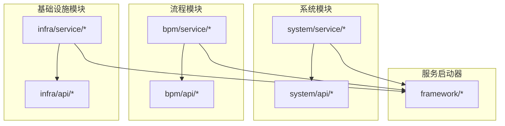
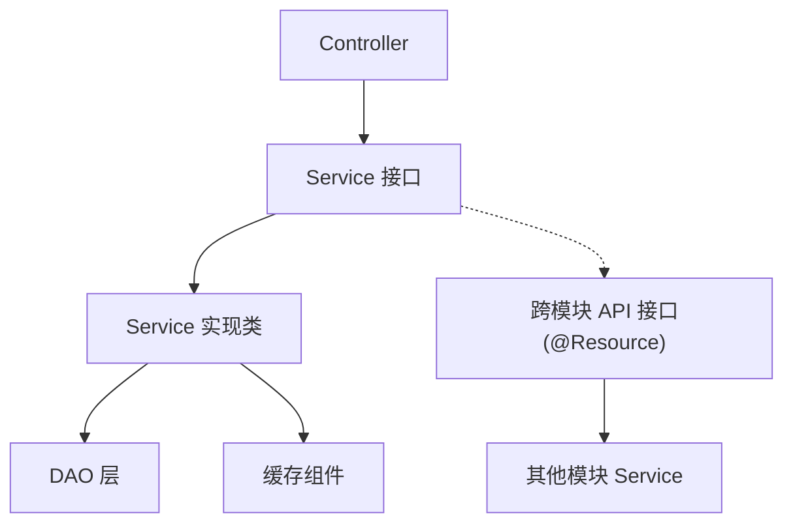
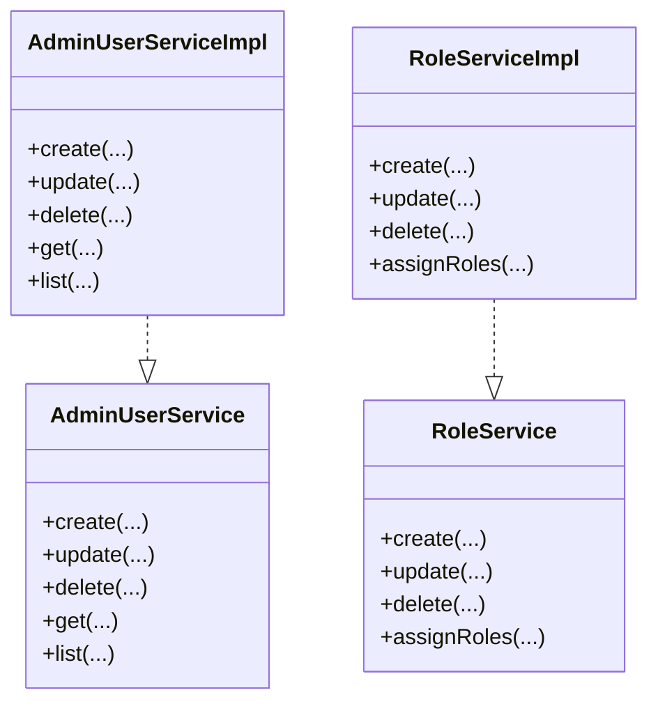
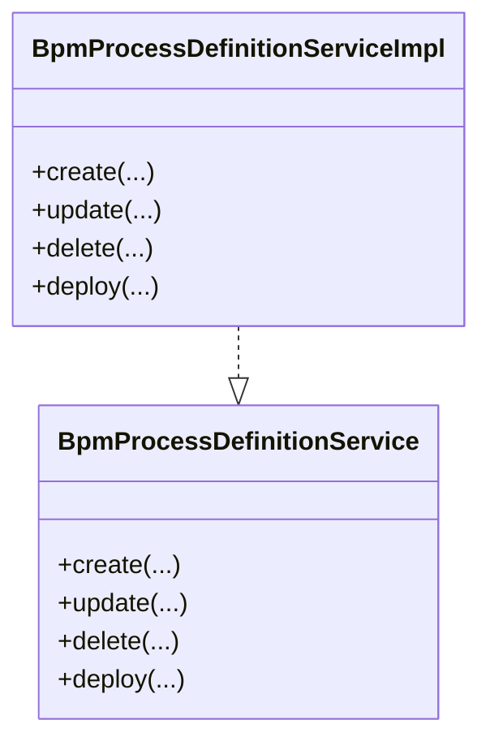
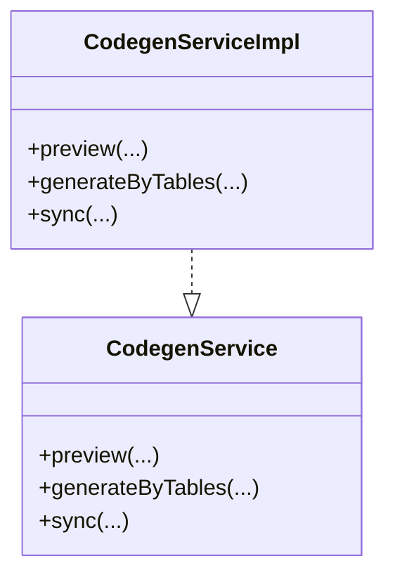
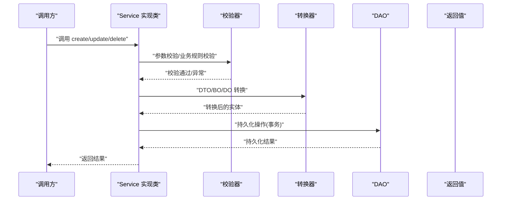
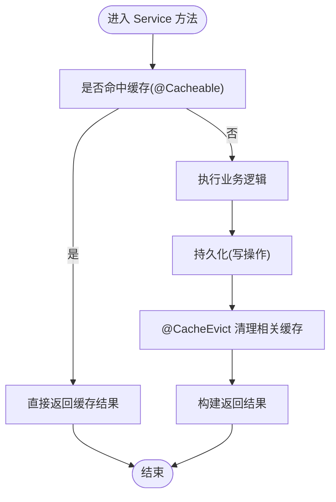
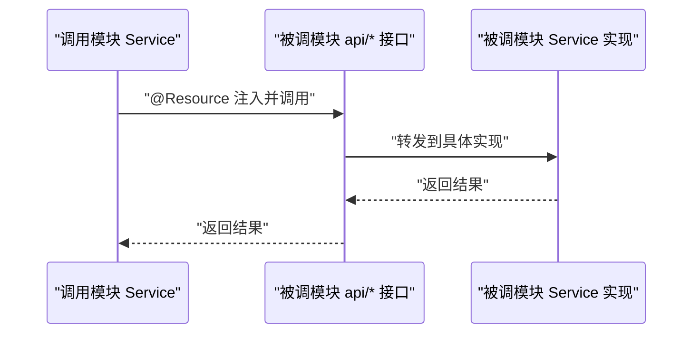
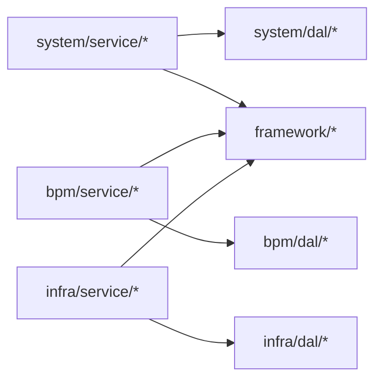

# Service层规范

<cite>
**本文引用的文件**
- [AdminUserService.java](file://yudao-module-system/src/main/java/cn/iocoder/yudao/module/system/service/user/AdminUserService.java)
- [AdminUserServiceImpl.java](file://yudao-module-system/src/main/java/cn/iocoder/yudao/module/system/service/user/AdminUserServiceImpl.java)
- [RoleService.java](file://yudao-module-system/src/main/java/cn/iocoder/yudao/module/system/service/permission/RoleService.java)
- [RoleServiceImpl.java](file://yudao-module-system/src/main/java/cn/iocoder/yudao/module/system/service/permission/RoleServiceImpl.java)
- [DeptService.java](file://yudao-module-system/src/main/java/cn/iocoder/yudao/module/system/service/dept/DeptService.java)
- [DeptServiceImpl.java](file://yudao-module-system/src/main/java/cn/iocoder/yudao/module/system/service/dept/DeptServiceImpl.java)
- [DictTypeService.java](file://yudao-module-system/src/main/java/cn/iocoder/yudao/module/system/service/dict/DictTypeService.java)
- [DictTypeServiceImpl.java](file://yudao-module-system/src/main/java/cn/iocoder/yudao/module/system/service/dict/DictTypeServiceImpl.java)
- [BpmProcessDefinitionService.java](file://yudao-module-bpm/src/main/java/cn/iocoder/yudao/module/bpm/service/definition/BpmProcessDefinitionService.java)
- [BpmProcessDefinitionServiceImpl.java](file://yudao-module-bpm/src/main/java/cn/iocoder/yudao/module/bpm/service/definition/BpmProcessDefinitionServiceImpl.java)
- [CodegenService.java](file://yudao-module-infra/src/main/java/cn/iocoder/yudao/module/infra/service/codegen/CodegenService.java)
- [CodegenServiceImpl.java](file://yudao-module-infra/src/main/java/cn/iocoder/yudao/module/infra/service/codegen/CodegenServiceImpl.java)
- [YudaoServerApplication.java](file://yudao-server/src/main/java/cn/iocoder/yudao/server/YudaoServerApplication.java)
- [SecurityFrameworkService.java](file://yudao-framework/yudao-spring-boot-starter-security/src/main/java/cn/iocoder/yudao/framework/security/core/service/SecurityFrameworkService.java)
- [TenantFrameworkService.java](file://yudao-framework/yudao-spring-boot-starter-biz-tenant/src/main/java/cn/iocoder/yudao/framework/tenant/core/service/TenantFrameworkService.java)
- [JobLogFrameworkService.java](file://yudao-framework/yudao-spring-boot-starter-job/src/main/java/cn/iocoder/yudao/framework/quartz/core/service/JobLogFrameworkService.java)
</cite>

## 目录
1. [引言](#引言)
2. [项目结构](#项目结构)
3. [核心组件](#核心组件)
4. [架构总览](#架构总览)
5. [详细组件分析](#详细组件分析)
6. [依赖分析](#依赖分析)
7. [性能考虑](#性能考虑)
8. [故障排查指南](#故障排查指南)
9. [结论](#结论)
10. [附录](#附录)

## 引言
本规范面向“芋道 Ruoyi-Vue-Pro”后端工程，系统性阐述Service层的接口定义、实现编写、缓存策略、跨模块API调用以及与DAO层协作的数据流转。目标是统一各业务模块的Service层开发标准，提升可维护性、可扩展性和一致性。

## 项目结构
Service层遵循“按业务域分包”的组织方式，每个业务域在各自模块内提供：
- 接口层：以Service结尾的接口，声明领域能力
- 实现层：以ServiceImpl结尾的实现类，承载业务逻辑
- API层（跨模块调用）：在被调用模块的api包下定义接口，调用方通过@Resource注入使用

图示来源
- [YudaoServerApplication.java:1-200](file://yudao-server/src/main/java/cn/iocoder/yudao/server/YudaoServerApplication.java#L1-L200)

章节来源
- [YudaoServerApplication.java:1-200](file://yudao-server/src/main/java/cn/iocoder/yudao/server/YudaoServerApplication.java#L1-L200)

## 核心组件
- 接口定义规范
  - 命名：以Service结尾，如AdminUserService、RoleService、DeptService、DictTypeService、BpmProcessDefinitionService、CodegenService
  - 方法职责：聚焦领域操作，避免混杂DAO查询或控制器逻辑
  - 默认方法：可提供default便捷方法，封装常用组合逻辑，便于调用方复用
- 实现类编写步骤（写操作）
  - 步骤一：参数校验（入参合法性、业务规则校验）
  - 步骤二：对象转换（DTO/BO/DO之间的映射与转换）
  - 步骤三：持久化（调用DAO执行数据库操作，事务边界明确）
  - 步骤四：返回结果（构造返回值，必要时触发缓存更新或消息通知）
- 缓存策略
  - @Cacheable：对只读或稳定数据进行缓存，提升查询性能
  - @CacheEvict：在写操作成功后主动清理相关缓存，保证一致性
  - 注意：缓存键设计要唯一且稳定，避免脏读
- 跨模块API调用
  - 在被调用模块的api包下定义接口，声明对外暴露的能力
  - 调用方通过@Resource注入使用，解耦模块边界，降低直接依赖

章节来源
- [AdminUserService.java:1-200](file://yudao-module-system/src/main/java/cn/iocoder/yudao/module/system/service/user/AdminUserService.java#L1-L200)
- [RoleService.java:1-200](file://yudao-module-system/src/main/java/cn/iocoder/yudao/module/system/service/permission/RoleService.java#L1-L200)
- [DeptService.java:1-200](file://yudao-module-system/src/main/java/cn/iocoder/yudao/module/system/service/dept/DeptService.java#L1-L200)
- [DictTypeService.java:1-200](file://yudao-module-system/src/main/java/cn/iocoder/yudao/module/system/service/dict/DictTypeService.java#L1-L200)
- [BpmProcessDefinitionService.java:1-200](file://yudao-module-bpm/src/main/java/cn/iocoder/yudao/module/bpm/service/definition/BpmProcessDefinitionService.java#L1-L200)
- [CodegenService.java:1-200](file://yudao-module-infra/src/main/java/cn/iocoder/yudao/module/infra/service/codegen/CodegenService.java#L1-L200)

## 架构总览
Service层位于Controller与DAO之间，承担业务编排、校验、转换与事务控制。跨模块调用通过api接口抽象，结合Spring资源注入实现低耦合协作。

图示来源
- [AdminUserServiceImpl.java:1-200](file://yudao-module-system/src/main/java/cn/iocoder/yudao/module/system/service/user/AdminUserServiceImpl.java#L1-L200)
- [RoleServiceImpl.java:1-200](file://yudao-module-system/src/main/java/cn/iocoder/yudao/module/system/service/permission/RoleServiceImpl.java#L1-L200)
- [BpmProcessDefinitionServiceImpl.java:1-200](file://yudao-module-bpm/src/main/java/cn/iocoder/yudao/module/bpm/service/definition/BpmProcessDefinitionServiceImpl.java#L1-L200)
- [CodegenServiceImpl.java:1-200](file://yudao-module-infra/src/main/java/cn/iocoder/yudao/module/infra/service/codegen/CodegenServiceImpl.java#L1-L200)

## 详细组件分析

### 系统模块 Service 组件
- 用户管理（AdminUserService/Impl）
  - 关注用户增删改查、密码处理、状态变更等
  - 写操作遵循“校验→转换→持久化→返回结果”
- 角色管理（RoleService/Impl）
  - 关注角色授权、菜单权限、数据范围等
- 部门与岗位（DeptService/Impl）
  - 关注组织架构树、岗位关联等
- 字典类型（DictTypeService/Impl）
  - 关注字典类型定义、字典数据联动

图示来源
- [AdminUserService.java:1-200](file://yudao-module-system/src/main/java/cn/iocoder/yudao/module/system/service/user/AdminUserService.java#L1-L200)
- [AdminUserServiceImpl.java:1-200](file://yudao-module-system/src/main/java/cn/iocoder/yudao/module/system/service/user/AdminUserServiceImpl.java#L1-L200)
- [RoleService.java:1-200](file://yudao-module-system/src/main/java/cn/iocoder/yudao/module/system/service/permission/RoleService.java#L1-L200)
- [RoleServiceImpl.java:1-200](file://yudao-module-system/src/main/java/cn/iocoder/yudao/module/system/service/permission/RoleServiceImpl.java#L1-L200)

章节来源
- [AdminUserService.java:1-200](file://yudao-module-system/src/main/java/cn/iocoder/yudao/module/system/service/user/AdminUserService.java#L1-L200)
- [AdminUserServiceImpl.java:1-200](file://yudao-module-system/src/main/java/cn/iocoder/yudao/module/system/service/user/AdminUserServiceImpl.java#L1-L200)
- [RoleService.java:1-200](file://yudao-module-system/src/main/java/cn/iocoder/yudao/module/system/service/permission/RoleService.java#L1-L200)
- [RoleServiceImpl.java:1-200](file://yudao-module-system/src/main/java/cn/iocoder/yudao/module/system/service/permission/RoleServiceImpl.java#L1-L200)

### 流程模块 Service 组件
- 流程定义（BpmProcessDefinitionService/Impl）
  - 关注流程模型创建、部署、监听器配置等
  - 写操作遵循统一流程：校验→转换→持久化→返回结果

图示来源
- [BpmProcessDefinitionService.java:1-200](file://yudao-module-bpm/src/main/java/cn/iocoder/yudao/module/bpm/service/definition/BpmProcessDefinitionService.java#L1-L200)
- [BpmProcessDefinitionServiceImpl.java:1-200](file://yudao-module-bpm/src/main/java/cn/iocoder/yudao/module/bpm/service/definition/BpmProcessDefinitionServiceImpl.java#L1-L200)

章节来源
- [BpmProcessDefinitionService.java:1-200](file://yudao-module-bpm/src/main/java/cn/iocoder/yudao/module/bpm/service/definition/BpmProcessDefinitionService.java#L1-L200)
- [BpmProcessDefinitionServiceImpl.java:1-200](file://yudao-module-bpm/src/main/java/cn/iocoder/yudao/module/bpm/service/definition/BpmProcessDefinitionServiceImpl.java#L1-L200)

### 基础设施模块 Service 组件
- 代码生成（CodegenService/Impl）
  - 关注模板解析、表结构生成、文件输出等
  - 写操作遵循统一流程：校验→转换→持久化→返回结果

图示来源
- [CodegenService.java:1-200](file://yudao-module-infra/src/main/java/cn/iocoder/yudao/module/infra/service/codegen/CodegenService.java#L1-L200)
- [CodegenServiceImpl.java:1-200](file://yudao-module-infra/src/main/java/cn/iocoder/yudao/module/infra/service/codegen/CodegenServiceImpl.java#L1-L200)

章节来源
- [CodegenService.java:1-200](file://yudao-module-infra/src/main/java/cn/iocoder/yudao/module/infra/service/codegen/CodegenService.java#L1-L200)
- [CodegenServiceImpl.java:1-200](file://yudao-module-infra/src/main/java/cn/iocoder/yudao/module/infra/service/codegen/CodegenServiceImpl.java#L1-L200)

### Service 写操作标准流程（序列图）

图示来源
- [AdminUserServiceImpl.java:1-200](file://yudao-module-system/src/main/java/cn/iocoder/yudao/module/system/service/user/AdminUserServiceImpl.java#L1-L200)
- [RoleServiceImpl.java:1-200](file://yudao-module-system/src/main/java/cn/iocoder/yudao/module/system/service/permission/RoleServiceImpl.java#L1-L200)
- [BpmProcessDefinitionServiceImpl.java:1-200](file://yudao-module-bpm/src/main/java/cn/iocoder/yudao/module/bpm/service/definition/BpmProcessDefinitionServiceImpl.java#L1-L200)
- [CodegenServiceImpl.java:1-200](file://yudao-module-infra/src/main/java/cn/iocoder/yudao/module/infra/service/codegen/CodegenServiceImpl.java#L1-L200)

### 缓存策略使用规范（流程图）

图示来源
- [AdminUserServiceImpl.java:1-200](file://yudao-module-system/src/main/java/cn/iocoder/yudao/module/system/service/user/AdminUserServiceImpl.java#L1-L200)
- [RoleServiceImpl.java:1-200](file://yudao-module-system/src/main/java/cn/iocoder/yudao/module/system/service/permission/RoleServiceImpl.java#L1-L200)

### 跨模块API调用规范（序列图）

图示来源
- [SecurityFrameworkService.java:1-200](file://yudao-framework/yudao-spring-boot-starter-security/src/main/java/cn/iocoder/yudao/framework/security/core/service/SecurityFrameworkService.java#L1-L200)
- [TenantFrameworkService.java:1-200](file://yudao-framework/yudao-spring-boot-starter-biz-tenant/src/main/java/cn/iocoder/yudao/framework/tenant/core/service/TenantFrameworkService.java#L1-L200)
- [JobLogFrameworkService.java:1-200](file://yudao-framework/yudao-spring-boot-starter-job/src/main/java/cn/iocoder/yudao/framework/quartz/core/service/JobLogFrameworkService.java#L1-L200)

## 依赖分析
- 模块内依赖：Service实现类依赖DAO与工具组件，保持高内聚低耦合
- 跨模块依赖：通过api接口+@Resource注入，避免直接引入实现类
- 外部依赖：Spring Cache、MyBatis、Quartz等框架组件

图示来源
- [YudaoServerApplication.java:1-200](file://yudao-server/src/main/java/cn/iocoder/yudao/server/YudaoServerApplication.java#L1-L200)

章节来源
- [YudaoServerApplication.java:1-200](file://yudao-server/src/main/java/cn/iocoder/yudao/server/YudaoServerApplication.java#L1-L200)

## 性能考虑
- 查询优化：优先使用@Cacheable缓存热点数据；对复杂查询使用分页与索引
- 写操作优化：批量插入/更新减少往返；合理拆分事务边界
- 缓存策略：写多读少场景谨慎使用缓存；确保缓存键唯一性与失效策略一致
- 跨模块调用：尽量合并请求，避免链式调用导致延迟放大

## 故障排查指南
- 常见问题
  - 缓存不一致：检查@CacheEvict是否覆盖所有相关键
  - 事务未生效：确认方法可见性与调用上下文
  - 跨模块调用失败：检查@Resource注入与接口版本兼容性
- 排查建议
  - 打印关键参数与返回值，定位异常环节
  - 使用单元测试覆盖边界条件与异常分支
  - 结合日志与监控定位性能瓶颈

## 结论
通过统一Service接口定义、标准化写操作流程、规范缓存策略与跨模块调用，可以显著提升系统的可维护性与扩展性。建议在新功能开发中严格遵循本规范，并在团队内持续推广最佳实践。

## 附录
- 示例参考
  - 用户管理：AdminUserService/Impl 的create、update、delete实现流程
  - 角色管理：RoleService/Impl 的授权与分配流程
  - 流程定义：BpmProcessDefinitionService/Impl 的部署与更新流程
  - 代码生成：CodegenService/Impl 的预览与生成流程
- 参考文件
  - [AdminUserServiceImpl.java:1-200](file://yudao-module-system/src/main/java/cn/iocoder/yudao/module/system/service/user/AdminUserServiceImpl.java#L1-L200)
  - [RoleServiceImpl.java:1-200](file://yudao-module-system/src/main/java/cn/iocoder/yudao/module/system/service/permission/RoleServiceImpl.java#L1-L200)
  - [BpmProcessDefinitionServiceImpl.java:1-200](file://yudao-module-bpm/src/main/java/cn/iocoder/yudao/module/bpm/service/definition/BpmProcessDefinitionServiceImpl.java#L1-L200)
  - [CodegenServiceImpl.java:1-200](file://yudao-module-infra/src/main/java/cn/iocoder/yudao/module/infra/service/codegen/CodegenServiceImpl.java#L1-L200)