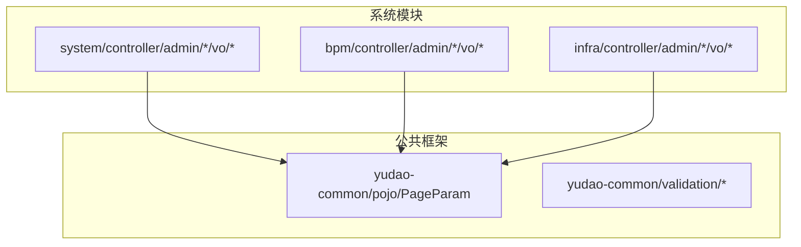
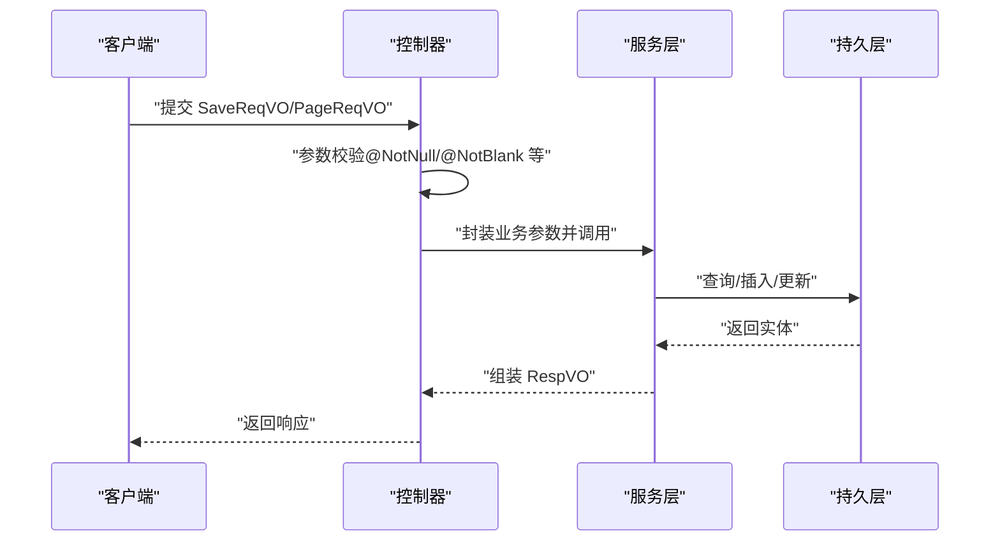
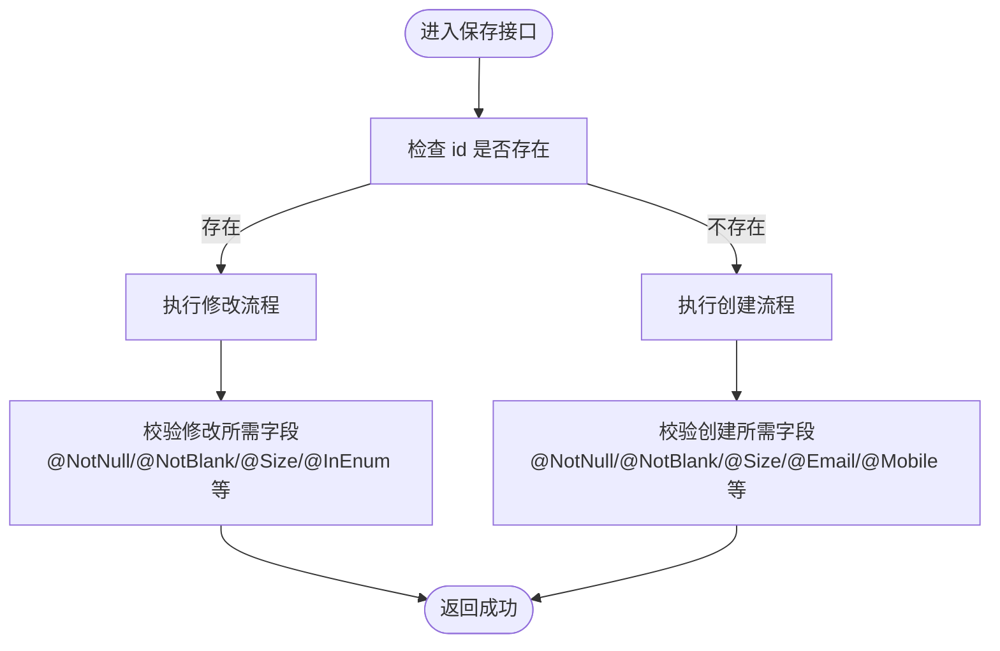
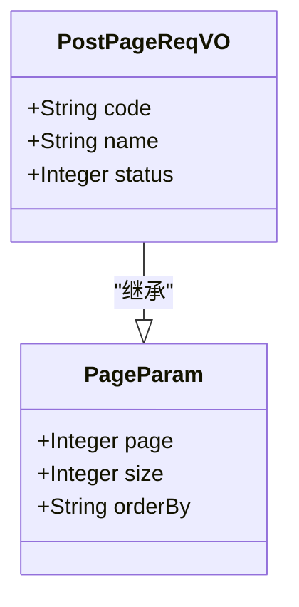
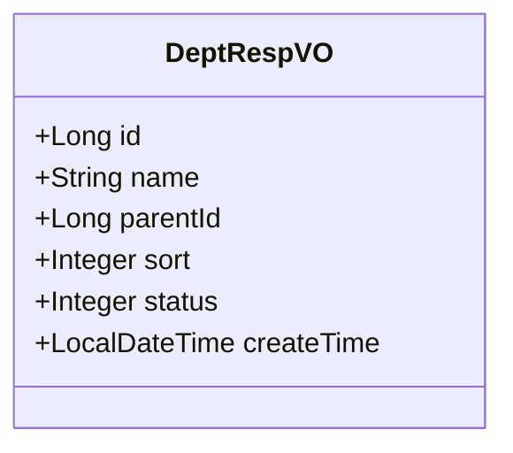
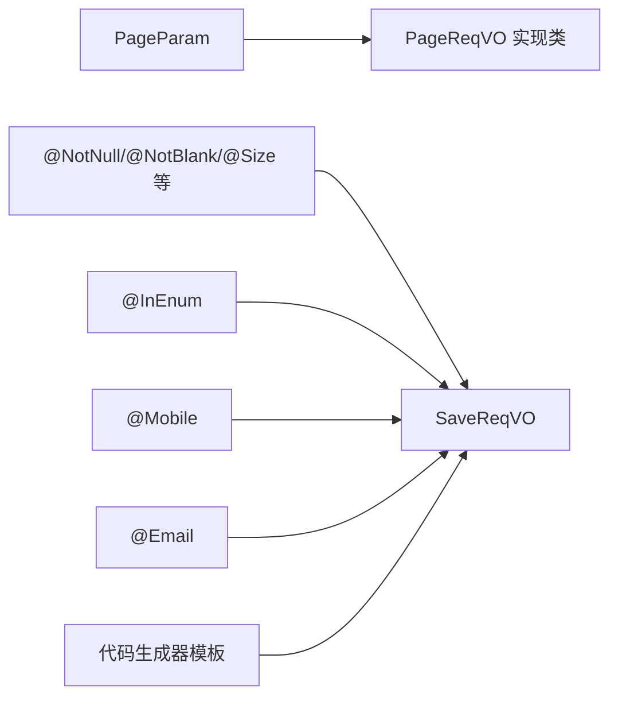

# VO/DTO设计规范

<cite>
**本文引用的文件**
- [DEVELOPMENT-GUIDE.md](file://DEVELOPMENT-GUIDE.md)
- [DeptSaveReqVO.java](file://yudao-module-system/src/main/java/cn/iocoder/yudao/module/system/controller/admin/dept/vo/dept/DeptSaveReqVO.java)
- [DeptRespVO.java](file://yudao-module-system/src/main/java/cn/iocoder/yudao/module/system/controller/admin/dept/vo/dept/DeptRespVO.java)
- [PageParam.java](file://yudao-framework/yudao-common/src/main/java/cn/iocoder/yudao/framework/common/pojo/PageParam.java)
- [BpmCategoryPageReqVO.java](file://yudao-module-bpm/src/main/java/cn/iocoder/yudao/module/bpm/controller/admin/definition/vo/category/BpmCategoryPageReqVO.java)
- [ApiAccessLogCreateReqDTO.java](file://yudao-framework/yudao-common/src/main/java/cn/iocoder/yudao/framework/common/biz/infra/logger/dto/ApiAccessLogCreateReqDTO.java)
- [ApiErrorLogCreateReqDTO.java](file://yudao-framework/yudao-common/src/main/java/cn/iocoder/yudao/framework/common/biz/infra/logger/dto/ApiErrorLogCreateReqDTO.java)
- [OperateLogCreateReqDTO.java](file://yudao-framework/yudao-common/src/main/java/cn/iocoder/yudao/framework/common/biz/system/logger/dto/OperateLogCreateReqDTO.java)
- [saveReqVO.vm](file://yudao-module-infra/src/main/resources/codegen/java/controller/vo/saveReqVO.vm)
</cite>

## 目录
1. [引言](#引言)
2. [项目结构](#项目结构)
3. [核心组件](#核心组件)
4. [架构总览](#架构总览)
5. [详细组件分析](#详细组件分析)
6. [依赖分析](#依赖分析)
7. [性能考虑](#性能考虑)
8. [故障排查指南](#故障排查指南)
9. [结论](#结论)
10. [附录](#附录)

## 引言
本规范旨在统一 Ruoyi-Vue-Pro 后端在 VO/DTO 设计上的风格与约束，确保接口契约清晰、可维护性强，并提升前后端协作效率。重点覆盖以下方面：
- SaveReqVO 的创建与修改复用设计，通过 id 字段区分操作类型
- PageReqVO 分页请求对象的设计，基于 PageParam 的分页参数规范
- RespVO 响应对象的设计原则，包括字段映射、数据展示、时间格式等标准化处理
- 校验注解的使用规则与最佳实践，涵盖 @NotNull、@NotBlank、@Size、@Email、@InEnum、@Min/@Max、@Mobile 等
- 提供完整的设计示例与校验注解与业务逻辑的结合模式

## 项目结构
围绕 VO/DTO 的代码分布主要集中在各模块的 controller 子包下，系统公共分页参数位于 yudao-common 模块中，开发指南对整体规范有明确要求。

图示来源
- [PageParam.java](file://yudao-framework/yudao-common/src/main/java/cn/iocoder/yudao/framework/common/pojo/PageParam.java)
- [BpmCategoryPageReqVO.java](file://yudao-module-bpm/src/main/java/cn/iocoder/yudao/module/bpm/controller/admin/definition/vo/category/BpmCategoryPageReqVO.java)

章节来源
- [DEVELOPMENT-GUIDE.md](file://DEVELOPMENT-GUIDE.md)
- [PageParam.java](file://yudao-framework/yudao-common/src/main/java/cn/iocoder/yudao/framework/common/pojo/PageParam.java)

## 核心组件
- SaveReqVO（创建与修改复用）：通过 id 字段是否为空区分创建或修改；修改时 id 必填，创建时 id 置空由后端生成
- PageReqVO（分页请求）：继承 PageParam，统一 page、size 等分页参数
- RespVO（响应对象）：面向前端的数据传输载体，字段命名与展示遵循统一风格，时间字段按需序列化为字符串或数值
- 校验注解：在 SaveReqVO 中广泛使用，保证入参合法性与业务一致性

章节来源
- [DEVELOPMENT-GUIDE.md](file://DEVELOPMENT-GUIDE.md)
- [DeptSaveReqVO.java](file://yudao-module-system/src/main/java/cn/iocoder/yudao/module/system/controller/admin/dept/vo/dept/DeptSaveReqVO.java)
- [DeptRespVO.java](file://yudao-module-system/src/main/java/cn/iocoder/yudao/module/system/controller/admin/dept/vo/dept/DeptRespVO.java)
- [PageParam.java](file://yudao-framework/yudao-common/src/main/java/cn/iocoder/yudao/framework/common/pojo/PageParam.java)

## 架构总览
从调用链看，控制器接收 SaveReqVO/ PageReqVO，经服务层处理后返回 RespVO 或分页结果；校验在进入业务前完成，确保数据质量。

图示来源
- [DeptSaveReqVO.java](file://yudao-module-system/src/main/java/cn/iocoder/yudao/module/system/controller/admin/dept/vo/dept/DeptSaveReqVO.java)
- [DeptRespVO.java](file://yudao-module-system/src/main/java/cn/iocoder/yudao/module/system/controller/admin/dept/vo/dept/DeptRespVO.java)

## 详细组件分析

### SaveReqVO 创建与修改复用规范
设计理念
- 使用同一 VO 承载“创建”和“修改”两个操作，通过 id 是否存在决定操作类型
- 修改时 id 必须传入，创建时 id 置空交由后端生成
- 在 VO 上对关键字段进行显式校验，避免脏数据进入业务流程

字段与校验要点
- id：修改必填，创建为空
- 名称类字段：使用 @NotBlank + @Size 控制长度
- 数值类字段：使用 @NotNull + @Min/@Max 控制范围
- 枚举类字段：使用 @InEnum 约束取值范围
- 邮箱/手机号：使用 @Email、@Mobile 进行格式校验

图示来源
- [DeptSaveReqVO.java](file://yudao-module-system/src/main/java/cn/iocoder/yudao/module/system/controller/admin/dept/vo/dept/DeptSaveReqVO.java)
- [DEVELOPMENT-GUIDE.md](file://DEVELOPMENT-GUIDE.md)

章节来源
- [DEVELOPMENT-GUIDE.md](file://DEVELOPMENT-GUIDE.md)
- [DeptSaveReqVO.java](file://yudao-module-system/src/main/java/cn/iocoder/yudao/module/system/controller/admin/dept/vo/dept/DeptSaveReqVO.java)

### PageReqVO 分页请求对象设计
分页参数规范
- PageReqVO 继承 PageParam，统一 page、size 等分页参数
- 业务筛选条件以非分页字段形式存在，如 code、name、status 等

图示来源
- [PageParam.java](file://yudao-framework/yudao-common/src/main/java/cn/iocoder/yudao/framework/common/pojo/PageParam.java)
- [BpmCategoryPageReqVO.java](file://yudao-module-bpm/src/main/java/cn/iocoder/yudao/module/bpm/controller/admin/definition/vo/category/BpmCategoryPageReqVO.java)

章节来源
- [DEVELOPMENT-GUIDE.md](file://DEVELOPMENT-GUIDE.md)
- [PageParam.java](file://yudao-framework/yudao-common/src/main/java/cn/iocoder/yudao/framework/common/pojo/PageParam.java)
- [BpmCategoryPageReqVO.java](file://yudao-module-bpm/src/main/java/cn/iocoder/yudao/module/bpm/controller/admin/definition/vo/category/BpmCategoryPageReqVO.java)

### RespVO 响应对象设计原则
设计原则
- 字段命名采用后端风格，保持与数据库/实体一致
- 时间字段建议序列化为字符串（yyyy-MM-dd HH:mm:ss），便于前端解析与展示
- 不暴露敏感字段，必要时进行脱敏或过滤
- 响应体包含业务所需全部字段，避免二次查询

图示来源
- [DeptRespVO.java](file://yudao-module-system/src/main/java/cn/iocoder/yudao/module/system/controller/admin/dept/vo/dept/DeptRespVO.java)

章节来源
- [DEVELOPMENT-GUIDE.md](file://DEVELOPMENT-GUIDE.md)
- [DeptRespVO.java](file://yudao-module-system/src/main/java/cn/iocoder/yudao/module/system/controller/admin/dept/vo/dept/DeptRespVO.java)

### 校验注解使用规则与最佳实践
注解适用场景与用法
- @NotNull：适用于任何类型，确保非空
- @NotBlank：仅适用于 String，确保非空且非空白
- @Size：适用于 String/Collection，控制长度范围
- @Email：适用于 String，邮箱格式校验
- @InEnum：适用于 Integer/String，限定枚举取值范围
- @Min/@Max：适用于数值类型，限定取值范围
- @Mobile：适用于 String，手机号格式校验（自定义注解）

示例参考
- 日志相关 DTO 对 @NotNull 的大量使用，体现强约束
- 通用日志创建请求 DTO 的字段均标注 @NotNull，确保关键信息不缺失

章节来源
- [DEVELOPMENT-GUIDE.md](file://DEVELOPMENT-GUIDE.md)
- [ApiAccessLogCreateReqDTO.java](file://yudao-framework/yudao-common/src/main/java/cn/iocoder/yudao/framework/common/biz/infra/logger/dto/ApiAccessLogCreateReqDTO.java)
- [ApiErrorLogCreateReqDTO.java](file://yudao-framework/yudao-common/src/main/java/cn/iocoder/yudao/framework/common/biz/infra/logger/dto/ApiErrorLogCreateReqDTO.java)
- [OperateLogCreateReqDTO.java](file://yudao-framework/yudao-common/src/main/java/cn/iocoder/yudao/framework/common/biz/system/logger/dto/OperateLogCreateReqDTO.java)

### 生成器模板与注解注入
代码生成器模板会根据字段类型自动引入必要的注解与时间格式化注解，确保 SaveReqVO 的注解配置与字段类型匹配。

章节来源
- [saveReqVO.vm](file://yudao-module-infra/src/main/resources/codegen/java/controller/vo/saveReqVO.vm)

## 依赖分析
- VO/DTO 与 PageParam 的依赖关系清晰，所有 PageReqVO 均通过继承获得分页能力
- 校验注解依赖 Jakarta Validation API，部分自定义注解（如 @InEnum、@Mobile）在框架中提供
- 生成器模板负责注解与类型导入的自动化，降低手写错误概率

图示来源
- [PageParam.java](file://yudao-framework/yudao-common/src/main/java/cn/iocoder/yudao/framework/common/pojo/PageParam.java)
- [saveReqVO.vm](file://yudao-module-infra/src/main/resources/codegen/java/controller/vo/saveReqVO.vm)

章节来源
- [PageParam.java](file://yudao-framework/yudao-common/src/main/java/cn/iocoder/yudao/framework/common/pojo/PageParam.java)
- [saveReqVO.vm](file://yudao-module-infra/src/main/resources/codegen/java/controller/vo/saveReqVO.vm)

## 性能考虑
- 校验前置：在控制器层尽早进行参数校验，减少无效请求进入业务层
- 分页参数限制：对 page、size 设置合理上限，防止超大分页导致数据库压力
- 响应字段裁剪：RespVO 仅包含前端需要的字段，避免多余序列化开销
- 时间字段格式：统一时间格式，减少前端解析成本

## 故障排查指南
常见问题与定位
- 创建/修改误判：检查 SaveReqVO 的 id 是否正确传递
- 校验失败：核对字段注解与输入值是否匹配，关注 @NotNull/@NotBlank/@Size/@Email/@InEnum/@Min/@Max/@Mobile 的约束
- 分页异常：确认 PageReqVO 的 page、size 是否在允许范围内
- 响应格式异常：检查时间字段的序列化策略与前端约定

章节来源
- [DeptSaveReqVO.java](file://yudao-module-system/src/main/java/cn/iocoder/yudao/module/system/controller/admin/dept/vo/dept/DeptSaveReqVO.java)
- [PageParam.java](file://yudao-framework/yudao-common/src/main/java/cn/iocoder/yudao/framework/common/pojo/PageParam.java)
- [ApiAccessLogCreateReqDTO.java](file://yudao-framework/yudao-common/src/main/java/cn/iocoder/yudao/framework/common/biz/infra/logger/dto/ApiAccessLogCreateReqDTO.java)
- [ApiErrorLogCreateReqDTO.java](file://yudao-framework/yudao-common/src/main/java/cn/iocoder/yudao/framework/common/biz/infra/logger/dto/ApiErrorLogCreateReqDTO.java)
- [OperateLogCreateReqDTO.java](file://yudao-framework/yudao-common/src/main/java/cn/iocoder/yudao/framework/common/biz/system/logger/dto/OperateLogCreateReqDTO.java)

## 结论
通过统一的 SaveReqVO 创建/修改复用、PageReqVO 分页参数规范、RespVO 响应对象设计以及严格的校验注解使用，Ruoyi-Vue-Pro 实现了清晰、稳定、易维护的接口契约。建议在后续开发中持续遵循本规范，并结合生成器模板提升一致性与效率。

## 附录
- 开发指南中的具体示例与规范条目可作为实施依据
- 各模块 VO/DTO 的实际实现可作为参考范式

章节来源
- [DEVELOPMENT-GUIDE.md](file://DEVELOPMENT-GUIDE.md)