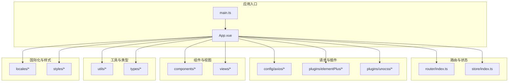
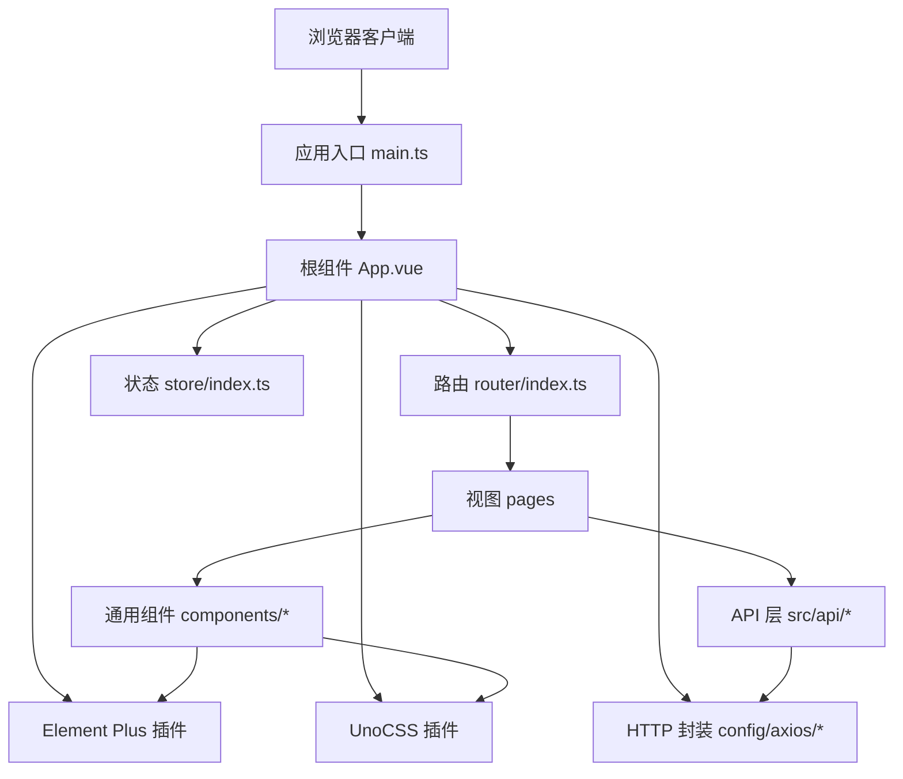
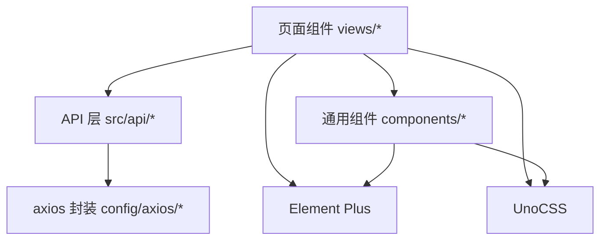

# 前端开发规范

<cite>
**本文引用的文件**
- [package.json](file://yudao-ui/yudao-ui-admin-vue3/package.json)
- [vite.config.ts](file://yudao-ui/yudao-ui-admin-vue3/vite.config.ts)
- [uno.config.ts](file://yudao-ui/yudao-ui-admin-vue3/uno.config.ts)
- [tsconfig.json](file://yudao-ui/yudao-ui-admin-vue3/tsconfig.json)
- [eslint.config.mjs](file://yudao-ui/yudao-ui-admin-vue3/eslint.config.mjs)
- [prettier.config.js](file://yudao-ui/yudao-ui-admin-vue3/prettier.config.js)
- [stylelint.config.js](file://yudao-ui/yudao-ui-admin-vue3/stylelint.config.js)
- [main.ts](file://yudao-ui/yudao-ui-admin-vue3/src/main.ts)
- [App.vue](file://yudao-ui/yudao-ui-admin-vue3/src/App.vue)
- [Layout.vue](file://yudao-ui/yudao-ui-admin-vue3/src/layout/Layout.vue)
- [router/index.ts](file://yudao-ui/yudao-ui-admin-vue3/src/router/index.ts)
- [store/index.ts](file://yudao-ui/yudao-ui-admin-vue3/src/store/index.ts)
- [config/axios/index.ts](file://yudao-ui/yudao-ui-admin-vue3/src/config/axios/index.ts)
- [config/axios/service.ts](file://yudao-ui/yudao-ui-admin-vue3/src/config/axios/service.ts)
- [config/axios/errorCode.ts](file://yudao-ui/yudao-ui-admin-vue3/src/config/axios/errorCode.ts)
- [hooks/web/useWebTypes.ts](file://yudao-ui/yudao-ui-admin-vue3/src/hooks/web/useWebTypes.ts)
- [types/elementPlus.d.ts](file://yudao-ui/yudao-ui-admin-vue3/src/types/elementPlus.d.ts)
- [plugins/elementPlus/index.ts](file://yudao-ui/yudao-ui-admin-vue3/src/plugins/elementPlus/index.ts)
- [plugins/unocss/index.ts](file://yudao-ui/yudao-ui-admin-vue3/src/plugins/unocss/index.ts)
- [components/Form/src/index.tsx](file://yudao-ui/yudao-ui-admin-vue3/src/components/Form/src/index.tsx)
- [components/Table/src/index.tsx](file://yudao-ui/yudao-ui-admin-vue3/src/components/Table/src/index.tsx)
- [components/Pagination/index.vue](file://yudao-ui/yudao-ui-admin-vue3/src/components/Pagination/index.vue)
- [components/Dialog/index.ts](file://yudao-ui/yudao-ui-admin-vue3/src/components/Dialog/index.ts)
- [components/DeptSelectForm/index.vue](file://yudao-ui/yudao-ui-admin-vue3/src/components/DeptSelectForm/index.vue)
- [components/UserSelectForm/index.vue](file://yudao-ui/yudao-ui-admin-vue3/src/components/UserSelectForm/index.vue)
- [api/system/dept/index.ts](file://yudao-ui/yudao-ui-admin-vue3/src/api/system/dept/index.ts)
- [api/system/user/index.ts](file://yudao-ui/yudao-ui-admin-vue3/src/api/system/user/index.ts)
- [api/system/menu/index.ts](file://yudao-ui/yudao-ui-admin-vue3/src/api/system/menu/index.ts)
- [api/system/post/index.ts](file://yudao-ui/yudao-ui-admin-vue3/src/api/system/post/index.ts)
- [api/system/role/index.ts](file://yudao-ui/yudao-ui-admin-vue3/src/api/system/role/index.ts)
- [api/system/dict/index.ts](file://yudao-ui/yudao-ui-admin-vue3/src/api/system/dict/index.ts)
- [api/system/area/index.ts](file://yudao-ui/yudao-ui-admin-vue3/src/api/system/area/index.ts)
- [api/system/permission/index.ts](file://yudao-ui/yudao-ui-admin-vue3/src/api/system/permission/index.ts)
- [api/system/tenant/index.ts](file://yudao-ui/yudao-ui-admin-vue3/src/api/system/tenant/index.ts)
- [api/system/tenantPackage/index.ts](file://yudao-ui/yudao-ui-admin-vue3/src/api/system/tenantPackage/index.ts)
- [api/system/operatelog/index.ts](file://yudao-ui/yudao-ui-admin-vue3/src/api/system/operatelog/index.ts)
- [api/system/loginLog/index.ts](file://yudao-ui/yudao-ui-admin-vue3/src/api/system/loginLog/index.ts)
- [api/system/notice/index.ts](file://yudao-ui/yudao-ui-admin-vue3/src/api/system/notice/index.ts)
- [api/system/notify/index.ts](file://yudao-ui/yudao-ui-admin-vue3/src/api/system/notify/index.ts)
- [api/system/mail/index.ts](file://yudao-ui/yudao-ui-admin-vue3/src/api/system/mail/index.ts)
- [api/system/social/index.ts](file://yudao-ui/yudao-ui-admin-vue3/src/api/system/social/index.ts)
- [api/system/sms/index.ts](file://yudao-ui/yudao-ui-admin-vue3/src/api/system/sms/index.ts)
- [api/system/oauth2/index.ts](file://yudao-ui/yudao-ui-admin-vue3/src/api/system/oauth2/index.ts)
- [api/system/area/index.ts](file://yudao-ui/yudao-ui-admin-vue3/src/api/system/area/index.ts)
- [api/system/menu/index.ts](file://yudao-ui/yudao-ui-admin-vue3/src/api/system/menu/index.ts)
- [api/system/user/index.ts](file://yudao-ui/yudao-ui-admin-vue3/src/api/system/user/index.ts)
- [api/system/post/index.ts](file://yudao-ui/yudao-ui-admin-vue3/src/api/system/post/index.ts)
- [api/system/role/index.ts](file://yudao-ui/yudao-ui-admin-vue3/src/api/system/role/index.ts)
- [api/system/dict/index.ts](file://yudao-ui/yudao-ui-admin-vue3/src/api/system/dict/index.ts)
- [api/system/area/index.ts](file://yudao-ui/yudao-ui-admin-vue3/src/api/system/area/index.ts)
- [api/system/permission/index.ts](file://yudao-ui/yudao-ui-admin-vue3/src/api/system/permission/index.ts)
- [api/system/tenant/index.ts](file://yudao-ui/yudao-ui-admin-vue3/src/api/system/tenant/index.ts)
- [api/system/tenantPackage/index.ts](file://yudao-ui/yudao-ui-admin-vue3/src/api/system/tenantPackage/index.ts)
- [api/system/operatelog/index.ts](file://yudao-ui/yudao-ui-admin-vue3/src/api/system/operatelog/index.ts)
- [api/system/loginLog/index.ts](file://yudao-ui/yudao-ui-admin-vue3/src/api/system/loginLog/index.ts)
- [api/system/notice/index.ts](file://yudao-ui/yudao-ui-admin-vue3/src/api/system/notice/index.ts)
- [api/system/notify/index.ts](file://yudao-ui/yudao-ui-admin-vue3/src/api/system/notify/index.ts)
- [api/system/mail/index.ts](file://yudao-ui/yudao-ui-admin-vue3/src/api/system/mail/index.ts)
- [api/system/social/index.ts](file://yudao-ui/yudao-ui-admin-vue3/src/api/system/social/index.ts)
- [api/system/sms/index.ts](file://yudao-ui/yudao-ui-admin-vue3/src/api/system/sms/index.ts)
- [api/system/oauth2/index.ts](file://yudao-ui/yudao-ui-admin-vue3/src/api/system/oauth2/index.ts)
- [views/system/user/index.vue](file://yudao-ui/yudao-ui-admin-vue3/src/views/system/user/index.vue)
- [views/system/dept/index.vue](file://yudao-ui/yudao-ui-admin-vue3/src/views/system/dept/index.vue)
- [views/system/menu/index.vue](file://yudao-ui/yudao-ui-admin-vue3/src/views/system/menu/index.vue)
- [views/system/post/index.vue](file://yudao-ui/yudao-ui-admin-vue3/src/views/system/post/index.vue)
- [views/system/role/index.vue](file://yudao-ui/yudao-ui-admin-vue3/src/views/system/role/index.vue)
- [views/system/dict/index.vue](file://yudao-ui/yudao-ui-admin-vue3/src/views/system/dict/index.vue)
- [views/system/area/index.vue](file://yudao-ui/yudao-ui-admin-vue3/src/views/system/area/index.vue)
- [views/system/permission/index.vue](file://yudao-ui/yudao-ui-admin-vue3/src/views/system/permission/index.vue)
- [views/system/tenant/index.vue](file://yudao-ui/yudao-ui-admin-vue3/src/views/system/tenant/index.vue)
- [views/system/tenantPackage/index.vue](file://yudao-ui/yudao-ui-admin-vue3/src/views/system/tenantPackage/index.vue)
- [views/system/operatelog/index.vue](file://yudao-ui/yudao-ui-admin-vue3/src/views/system/operatelog/index.vue)
- [views/system/loginLog/index.vue](file://yudao-ui/yudao-ui-admin-vue3/src/views/system/loginLog/index.vue)
- [views/system/notice/index.vue](file://yudao-ui/yudao-ui-admin-vue3/src/views/system/notice/index.vue)
- [views/system/notify/index.vue](file://yudao-ui/yudao-ui-admin-vue3/src/views/system/notify/index.vue)
- [views/system/mail/index.vue](file://yudao-ui/yudao-ui-admin-vue3/src/views/system/mail/index.vue)
- [views/system/social/index.vue](file://yudao-ui/yudao-ui-admin-vue3/src/views/system/social/index.vue)
- [views/system/sms/index.vue](file://yudao-ui/yudao-ui-admin-vue3/src/views/system/sms/index.vue)
- [views/system/oauth2/index.vue](file://yudao-ui/yudao-ui-admin-vue3/src/views/system/oauth2/index.vue)
- [utils/tree.ts](file://yudao-ui/yudao-ui-admin-vue3/src/utils/tree.ts)
- [utils/formatTime.ts](file://yudao-ui/yudao-ui-admin-vue3/src/utils/formatTime.ts)
- [utils/formRules.ts](file://yudao-ui/yudao-ui-admin-vue3/src/utils/formRules.ts)
- [utils/url.ts](file://yudao-ui/yudao-ui-admin-vue3/src/utils/url.ts)
- [utils/constants.ts](file://yudao-ui/yudao-ui-admin-vue3/src/utils/constants.ts)
- [directives/permission/index.ts](file://yudao-ui/yudao-ui-admin-vue3/src/directives/permission/index.ts)
- [styles/index.scss](file://yudao-ui/yudao-ui-admin-vue3/src/styles/index.scss)
- [styles/global.module.scss](file://yudao-ui/yudao-ui-admin-vue3/src/styles/global.module.scss)
- [locales/zh-CN.ts](file://yudao-ui/yudao-ui-admin-vue3/src/locales/zh-CN.ts)
- [locales/en.ts](file://yudao-ui/yudao-ui-admin-vue3/src/locales/en.ts)
</cite>

## 目录
1. [引言](#引言)
2. [项目结构](#项目结构)
3. [核心组件](#核心组件)
4. [架构总览](#架构总览)
5. [详细组件分析](#详细组件分析)
6. [依赖关系分析](#依赖关系分析)
7. [性能考虑](#性能考虑)
8. [故障排查指南](#故障排查指南)
9. [结论](#结论)
10. [附录](#附录)

## 引言
本规范面向芋道 Ruoyi-Vue-Pro 前端团队，系统化阐述技术栈选型与工程化标准，涵盖 Vue3 + TypeScript + Element Plus + Vite + Pinia + UnoCSS 的组合实践；明确 API 文件组织规范与命名约定；统一 TypeScript 接口定义与类型约束；规范页面组件结构与编写范式（Composition API、响应式状态管理、Element Plus 组件使用等），并提供可复用的页面组件示例路径，帮助开发者快速构建高质量、可维护的前端界面。

## 项目结构
前端工程位于 yudao-ui/yudao-ui-admin-vue3，采用多模块分层组织：
- 根配置：package.json、vite.config.ts、uno.config.ts、tsconfig.json 等
- 应用入口：main.ts、App.vue
- 路由与状态：router/index.ts、store/index.ts
- 请求封装：config/axios/*
- 插件体系：plugins/elementPlus、plugins/unocss
- 组件库：components/*（通用组件与业务组件）
- 视图页面：views/*（按业务域划分）
- 工具与类型：utils/*、types/*
- 国际化与样式：locales/*、styles/*

图表来源
- [main.ts:1-200](file://yudao-ui/yudao-ui-admin-vue3/src/main.ts#L1-L200)
- [App.vue:1-200](file://yudao-ui/yudao-ui-admin-vue3/src/App.vue#L1-L200)
- [router/index.ts:1-200](file://yudao-ui/yudao-ui-admin-vue3/src/router/index.ts#L1-L200)
- [store/index.ts:1-200](file://yudao-ui/yudao-ui-admin-vue3/src/store/index.ts#L1-L200)
- [config/axios/index.ts:1-200](file://yudao-ui/yudao-ui-admin-vue3/src/config/axios/index.ts#L1-L200)
- [plugins/elementPlus/index.ts:1-200](file://yudao-ui/yudao-ui-admin-vue3/src/plugins/elementPlus/index.ts#L1-L200)
- [plugins/unocss/index.ts:1-200](file://yudao-ui/yudao-ui-admin-vue3/src/plugins/unocss/index.ts#L1-L200)
- [components/Form/src/index.tsx:1-200](file://yudao-ui/yudao-ui-admin-vue3/src/components/Form/src/index.tsx#L1-L200)
- [components/Table/src/index.tsx:1-200](file://yudao-ui/yudao-ui-admin-vue3/src/components/Table/src/index.tsx#L1-L200)
- [views/system/user/index.vue:1-200](file://yudao-ui/yudao-ui-admin-vue3/src/views/system/user/index.vue#L1-L200)

章节来源
- [package.json:1-200](file://yudao-ui/yudao-ui-admin-vue3/package.json#L1-L200)
- [vite.config.ts:1-200](file://yudao-ui/yudao-ui-admin-vue3/vite.config.ts#L1-L200)
- [uno.config.ts:1-200](file://yudao-ui/yudao-ui-admin-vue3/uno.config.ts#L1-L200)
- [tsconfig.json:1-200](file://yudao-ui/yudao-ui-admin-vue3/tsconfig.json#L1-L200)

## 核心组件
- 技术栈与版本
  - Vue3：基于 Composition API 的现代前端框架
  - TypeScript：强类型语言，提升代码质量与可维护性
  - Element Plus：桌面端组件库，提供丰富的 UI 组件
  - Vite：极速构建工具，支持热更新与按需编译
  - Pinia：官方推荐的状态管理库
  - UnoCSS：原子化 CSS 引擎，提供高效样式方案
- 工程化工具链
  - ESLint、Prettier、Stylelint：代码风格与格式化
  - PostCSS、UnoCSS：样式处理与原子化样式
  - 国际化：vue-i18n
- 插件与扩展
  - Element Plus 插件注册与全局配置
  - UnoCSS 原子化样式按需加载
  - axios 封装与错误码映射

章节来源
- [package.json:1-200](file://yudao-ui/yudao-ui-admin-vue3/package.json#L1-L200)
- [eslint.config.mjs:1-200](file://yudao-ui/yudao-ui-admin-vue3/eslint.config.mjs#L1-L200)
- [prettier.config.js:1-200](file://yudao-ui/yudao-ui-admin-vue3/prettier.config.js#L1-L200)
- [stylelint.config.js:1-200](file://yudao-ui/yudao-ui-admin-vue3/stylelint.config.js#L1-L200)
- [plugins/elementPlus/index.ts:1-200](file://yudao-ui/yudao-ui-admin-vue3/src/plugins/elementPlus/index.ts#L1-L200)
- [plugins/unocss/index.ts:1-200](file://yudao-ui/yudao-ui-admin-vue3/src/plugins/unocss/index.ts#L1-L200)
- [config/axios/index.ts:1-200](file://yudao-ui/yudao-ui-admin-vue3/src/config/axios/index.ts#L1-L200)

## 架构总览
整体架构围绕“入口 -> 路由 -> 视图 -> 组件 -> API -> 状态”的数据流展开，结合 Element Plus 组件与 UnoCSS 原子化样式，形成清晰的职责边界与可扩展性。

图表来源
- [main.ts:1-200](file://yudao-ui/yudao-ui-admin-vue3/src/main.ts#L1-L200)
- [App.vue:1-200](file://yudao-ui/yudao-ui-admin-vue3/src/App.vue#L1-L200)
- [router/index.ts:1-200](file://yudao-ui/yudao-ui-admin-vue3/src/router/index.ts#L1-L200)
- [store/index.ts:1-200](file://yudao-ui/yudao-ui-admin-vue3/src/store/index.ts#L1-L200)
- [config/axios/index.ts:1-200](file://yudao-ui/yudao-ui-admin-vue3/src/config/axios/index.ts#L1-L200)
- [plugins/elementPlus/index.ts:1-200](file://yudao-ui/yudao-ui-admin-vue3/src/plugins/elementPlus/index.ts#L1-L200)
- [plugins/unocss/index.ts:1-200](file://yudao-ui/yudao-ui-admin-vue3/src/plugins/unocss/index.ts#L1-L200)

## 详细组件分析

### API 文件组织规范
- 组织路径：src/api/{module}/{domain}/index.ts
  - module：业务模块，如 system、infra、bpm、im、ai、opshub、report
  - domain：具体领域对象，如 dept、user、menu、post、role、dict、area、permission、tenant、tenantPackage、operatelog、loginLog、notice、notify、mail、social、sms、oauth2
- 方法命名规范
  - 列表查询：list{Domain}、page{Domain}
  - 获取详情：get{Domain}ById
  - 创建：create{Domain}
  - 更新：update{Domain}
  - 删除：delete{Domain}ById
  - 导出：export{Domain}
  - 启用/禁用：enable/disable{Domain}ById
  - 其他：如 updateStatus{Domain}ById
- 返回值约定
  - 列表类：返回分页结果或数组
  - 单条：返回实体对象
  - 操作：返回布尔或受影响行数
- 示例路径
  - 用户：[api/system/user/index.ts:1-200](file://yudao-ui/yudao-ui-admin-vue3/src/api/system/user/index.ts#L1-L200)
  - 部门：[api/system/dept/index.ts:1-200](file://yudao-ui/yudao-ui-admin-vue3/src/api/system/dept/index.ts#L1-L200)
  - 菜单：[api/system/menu/index.ts:1-200](file://yudao-ui/yudao-ui-admin-vue3/src/api/system/menu/index.ts#L1-L200)
  - 角色：[api/system/role/index.ts:1-200](file://yudao-ui/yudao-ui-admin-vue3/src/api/system/role/index.ts#L1-L200)
  - 字典：[api/system/dict/index.ts:1-200](file://yudao-ui/yudao-ui-admin-vue3/src/api/system/dict/index.ts#L1-L200)
  - 地区：[api/system/area/index.ts:1-200](file://yudao-ui/yudao-ui-admin-vue3/src/api/system/area/index.ts#L1-L200)
  - 权限：[api/system/permission/index.ts:1-200](file://yudao-ui/yudao-ui-admin-vue3/src/api/system/permission/index.ts#L1-L200)
  - 租户：[api/system/tenant/index.ts:1-200](file://yudao-ui/yudao-ui-admin-vue3/src/api/system/tenant/index.ts#L1-L200)
  - 租户套餐：[api/system/tenantPackage/index.ts:1-200](file://yudao-ui/yudao-ui-admin-vue3/src/api/system/tenantPackage/index.ts#L1-L200)
  - 操作日志：[api/system/operatelog/index.ts:1-200](file://yudao-ui/yudao-ui-admin-vue3/src/api/system/operatelog/index.ts#L1-L200)
  - 登录日志：[api/system/loginLog/index.ts:1-200](file://yudao-ui/yudao-ui-admin-vue3/src/api/system/loginLog/index.ts#L1-L200)
  - 通知公告：[api/system/notice/index.ts:1-200](file://yudao-ui/yudao-ui-admin-vue3/src/api/system/notice/index.ts#L1-L200)
  - 通知发送：[api/system/notify/index.ts:1-200](file://yudao-ui/yudao-ui-admin-vue3/src/api/system/notify/index.ts#L1-L200)
  - 邮件：[api/system/mail/index.ts:1-200](file://yudao-ui/yudao-ui-admin-vue3/src/api/system/mail/index.ts#L1-L200)
  - 社交：[api/system/social/index.ts:1-200](file://yudao-ui/yudao-ui-admin-vue3/src/api/system/social/index.ts#L1-L200)
  - 短信：[api/system/sms/index.ts:1-200](file://yudao-ui/yudao-ui-admin-vue3/src/api/system/sms/index.ts#L1-L200)
  - OAuth2：[api/system/oauth2/index.ts:1-200](file://yudao-ui/yudao-ui-admin-vue3/src/api/system/oauth2/index.ts#L1-L200)

章节来源
- [api/system/user/index.ts:1-200](file://yudao-ui/yudao-ui-admin-vue3/src/api/system/user/index.ts#L1-L200)
- [api/system/dept/index.ts:1-200](file://yudao-ui/yudao-ui-admin-vue3/src/api/system/dept/index.ts#L1-L200)
- [api/system/menu/index.ts:1-200](file://yudao-ui/yudao-ui-admin-vue3/src/api/system/menu/index.ts#L1-L200)
- [api/system/role/index.ts:1-200](file://yudao-ui/yudao-ui-admin-vue3/src/api/system/role/index.ts#L1-L200)
- [api/system/dict/index.ts:1-200](file://yudao-ui/yudao-ui-admin-vue3/src/api/system/dict/index.ts#L1-L200)
- [api/system/area/index.ts:1-200](file://yudao-ui/yudao-ui-admin-vue3/src/api/system/area/index.ts#L1-L200)
- [api/system/permission/index.ts:1-200](file://yudao-ui/yudao-ui-admin-vue3/src/api/system/permission/index.ts#L1-L200)
- [api/system/tenant/index.ts:1-200](file://yudao-ui/yudao-ui-admin-vue3/src/api/system/tenant/index.ts#L1-L200)
- [api/system/tenantPackage/index.ts:1-200](file://yudao-ui/yudao-ui-admin-vue3/src/api/system/tenantPackage/index.ts#L1-L200)
- [api/system/operatelog/index.ts:1-200](file://yudao-ui/yudao-ui-admin-vue3/src/api/system/operatelog/index.ts#L1-L200)
- [api/system/loginLog/index.ts:1-200](file://yudao-ui/yudao-ui-admin-vue3/src/api/system/loginLog/index.ts#L1-L200)
- [api/system/notice/index.ts:1-200](file://yudao-ui/yudao-ui-admin-vue3/src/api/system/notice/index.ts#L1-L200)
- [api/system/notify/index.ts:1-200](file://yudao-ui/yudao-ui-admin-vue3/src/api/system/notify/index.ts#L1-L200)
- [api/system/mail/index.ts:1-200](file://yudao-ui/yudao-ui-admin-vue3/src/api/system/mail/index.ts#L1-L200)
- [api/system/social/index.ts:1-200](file://yudao-ui/yudao-ui-admin-vue3/src/api/system/social/index.ts#L1-L200)
- [api/system/sms/index.ts:1-200](file://yudao-ui/yudao-ui-admin-vue3/src/api/system/sms/index.ts#L1-L200)
- [api/system/oauth2/index.ts:1-200](file://yudao-ui/yudao-ui-admin-vue3/src/api/system/oauth2/index.ts#L1-L200)

### TypeScript 接口定义规范
- 命名约定
  - 实体接口以 VO 结尾，如 DeptVO、UserVO、MenuVO
  - 分页参数 PageParam，分页结果 PageResult
  - 状态枚举以 Enum 结尾，如 StatusEnum
- 字段定义与约束
  - 必填字段直接声明，可选字段使用 ? 后缀
  - 使用联合类型表达互斥关系，如启用/禁用
  - 时间字段统一使用字符串或日期类型，并在工具中进行格式化
  - ID 字段统一使用数字或字符串类型，保持一致性
- 类型导出
  - 在 types 目录下集中导出公共类型，避免重复定义
- 示例参考
  - 部门接口：[api/system/dept/index.ts:1-200](file://yudao-ui/yudao-ui-admin-vue3/src/api/system/dept/index.ts#L1-L200)
  - 用户接口：[api/system/user/index.ts:1-200](file://yudao-ui/yudao-ui-admin-vue3/src/api/system/user/index.ts#L1-L200)
  - 菜单接口：[api/system/menu/index.ts:1-200](file://yudao-ui/yudao-ui-admin-vue3/src/api/system/menu/index.ts#L1-L200)
  - 角色接口：[api/system/role/index.ts:1-200](file://yudao-ui/yudao-ui-admin-vue3/src/api/system/role/index.ts#L1-L200)
  - 字典接口：[api/system/dict/index.ts:1-200](file://yudao-ui/yudao-ui-admin-vue3/src/api/system/dict/index.ts#L1-L200)
  - 地区接口：[api/system/area/index.ts:1-200](file://yudao-ui/yudao-ui-admin-vue3/src/api/system/area/index.ts#L1-L200)
  - 权限接口：[api/system/permission/index.ts:1-200](file://yudao-ui/yudao-ui-admin-vue3/src/api/system/permission/index.ts#L1-L200)
  - 租户接口：[api/system/tenant/index.ts:1-200](file://yudao-ui/yudao-ui-admin-vue3/src/api/system/tenant/index.ts#L1-L200)
  - 租户套餐接口：[api/system/tenantPackage/index.ts:1-200](file://yudao-ui/yudao-ui-admin-vue3/src/api/system/tenantPackage/index.ts#L1-L200)
  - 操作日志接口：[api/system/operatelog/index.ts:1-200](file://yudao-ui/yudao-ui-admin-vue3/src/api/system/operatelog/index.ts#L1-L200)
  - 登录日志接口：[api/system/loginLog/index.ts:1-200](file://yudao-ui/yudao-ui-admin-vue3/src/api/system/loginLog/index.ts#L1-L200)
  - 通知公告接口：[api/system/notice/index.ts:1-200](file://yudao-ui/yudao-ui-admin-vue3/src/api/system/notice/index.ts#L1-L200)
  - 通知发送接口：[api/system/notify/index.ts:1-200](file://yudao-ui/yudao-ui-admin-vue3/src/api/system/notify/index.ts#L1-L200)
  - 邮件接口：[api/system/mail/index.ts:1-200](file://yudao-ui/yudao-ui-admin-vue3/src/api/system/mail/index.ts#L1-L200)
  - 社交接口：[api/system/social/index.ts:1-200](file://yudao-ui/yudao-ui-admin-vue3/src/api/system/social/index.ts#L1-L200)
  - 短信接口：[api/system/sms/index.ts:1-200](file://yudao-ui/yudao-ui-admin-vue3/src/api/system/sms/index.ts#L1-L200)
  - OAuth2 接口：[api/system/oauth2/index.ts:1-200](file://yudao-ui/yudao-ui-admin-vue3/src/api/system/oauth2/index.ts#L1-L200)

章节来源
- [api/system/dept/index.ts:1-200](file://yudao-ui/yudao-ui-admin-vue3/src/api/system/dept/index.ts#L1-L200)
- [api/system/user/index.ts:1-200](file://yudao-ui/yudao-ui-admin-vue3/src/api/system/user/index.ts#L1-L200)
- [api/system/menu/index.ts:1-200](file://yudao-ui/yudao-ui-admin-vue3/src/api/system/menu/index.ts#L1-L200)
- [api/system/role/index.ts:1-200](file://yudao-ui/yudao-ui-admin-vue3/src/api/system/role/index.ts#L1-L200)
- [api/system/dict/index.ts:1-200](file://yudao-ui/yudao-ui-admin-vue3/src/api/system/dict/index.ts#L1-L200)
- [api/system/area/index.ts:1-200](file://yudao-ui/yudao-ui-admin-vue3/src/api/system/area/index.ts#L1-L200)
- [api/system/permission/index.ts:1-200](file://yudao-ui/yudao-ui-admin-vue3/src/api/system/permission/index.ts#L1-L200)
- [api/system/tenant/index.ts:1-200](file://yudao-ui/yudao-ui-admin-vue3/src/api/system/tenant/index.ts#L1-L200)
- [api/system/tenantPackage/index.ts:1-200](file://yudao-ui/yudao-ui-admin-vue3/src/api/system/tenantPackage/index.ts#L1-L200)
- [api/system/operatelog/index.ts:1-200](file://yudao-ui/yudao-ui-admin-vue3/src/api/system/operatelog/index.ts#L1-L200)
- [api/system/loginLog/index.ts:1-200](file://yudao-ui/yudao-ui-admin-vue3/src/api/system/loginLog/index.ts#L1-L200)
- [api/system/notice/index.ts:1-200](file://yudao-ui/yudao-ui-admin-vue3/src/api/system/notice/index.ts#L1-L200)
- [api/system/notify/index.ts:1-200](file://yudao-ui/yudao-ui-admin-vue3/src/api/system/notify/index.ts#L1-L200)
- [api/system/mail/index.ts:1-200](file://yudao-ui/yudao-ui-admin-vue3/src/api/system/mail/index.ts#L1-L200)
- [api/system/social/index.ts:1-200](file://yudao-ui/yudao-ui-admin-vue3/src/api/system/social/index.ts#L1-L200)
- [api/system/sms/index.ts:1-200](file://yudao-ui/yudao-ui-admin-vue3/src/api/system/sms/index.ts#L1-L200)
- [api/system/oauth2/index.ts:1-200](file://yudao-ui/yudao-ui-admin-vue3/src/api/system/oauth2/index.ts#L1-L200)

### 页面组件结构规范
- 主页面 index.vue
  - 使用 <script setup> 语法，引入必要的 API、状态与工具
  - 查询参数使用 reactive 管理，列表数据使用 ref 管理
  - 使用 Element Plus 表格、分页、表单等组件
  - 操作按钮遵循“新增、编辑、删除、导出”等标准动作
- components 目录下的表单组件
  - 通用表单组件：Form、FormCreate
  - 业务表单组件：DeptSelectForm、UserSelectForm 等
  - 组件通过 props 接收数据，通过 emits 传递事件
- 示例页面
  - 用户管理：[views/system/user/index.vue:1-200](file://yudao-ui/yudao-ui-admin-vue3/src/views/system/user/index.vue#L1-L200)
  - 部门管理：[views/system/dept/index.vue:1-200](file://yudao-ui/yudao-ui-admin-vue3/src/views/system/dept/index.vue#L1-L200)
  - 菜单管理：[views/system/menu/index.vue:1-200](file://yudao-ui/yudao-ui-admin-vue3/src/views/system/menu/index.vue#L1-L200)
  - 角色管理：[views/system/role/index.vue:1-200](file://yudao-ui/yudao-ui-admin-vue3/src/views/system/role/index.vue#L1-L200)
  - 字典管理：[views/system/dict/index.vue:1-200](file://yudao-ui/yudao-ui-admin-vue3/src/views/system/dict/index.vue#L1-L200)
  - 地区管理：[views/system/area/index.vue:1-200](file://yudao-ui/yudao-ui-admin-vue3/src/views/system/area/index.vue#L1-L200)
  - 权限管理：[views/system/permission/index.vue:1-200](file://yudao-ui/yudao-ui-admin-vue3/src/views/system/permission/index.vue#L1-L200)
  - 租户管理：[views/system/tenant/index.vue:1-200](file://yudao-ui/yudao-ui-admin-vue3/src/views/system/tenant/index.vue#L1-L200)
  - 租户套餐管理：[views/system/tenantPackage/index.vue:1-200](file://yudao-ui/yudao-ui-admin-vue3/src/views/system/tenantPackage/index.vue#L1-L200)
  - 操作日志管理：[views/system/operatelog/index.vue:1-200](file://yudao-ui/yudao-ui-admin-vue3/src/views/system/operatelog/index.vue#L1-L200)
  - 登录日志管理：[views/system/loginLog/index.vue:1-200](file://yudao-ui/yudao-ui-admin-vue3/src/views/system/loginLog/index.vue#L1-L200)
  - 通知公告管理：[views/system/notice/index.vue:1-200](file://yudao-ui/yudao-ui-admin-vue3/src/views/system/notice/index.vue#L1-L200)
  - 通知发送管理：[views/system/notify/index.vue:1-200](file://yudao-ui/yudao-ui-admin-vue3/src/views/system/notify/index.vue#L1-L200)
  - 邮件管理：[views/system/mail/index.vue:1-200](file://yudao-ui/yudao-ui-admin-vue3/src/views/system/mail/index.vue#L1-L200)
  - 社交管理：[views/system/social/index.vue:1-200](file://yudao-ui/yudao-ui-admin-vue3/src/views/system/social/index.vue#L1-L200)
  - 短信管理：[views/system/sms/index.vue:1-200](file://yudao-ui/yudao-ui-admin-vue3/src/views/system/sms/index.vue#L1-L200)
  - OAuth2 管理：[views/system/oauth2/index.vue:1-200](file://yudao-ui/yudao-ui-admin-vue3/src/views/system/oauth2/index.vue#L1-L200)

章节来源
- [views/system/user/index.vue:1-200](file://yudao-ui/yudao-ui-admin-vue3/src/views/system/user/index.vue#L1-L200)
- [views/system/dept/index.vue:1-200](file://yudao-ui/yudao-ui-admin-vue3/src/views/system/dept/index.vue#L1-L200)
- [views/system/menu/index.vue:1-200](file://yudao-ui/yudao-ui-admin-vue3/src/views/system/menu/index.vue#L1-L200)
- [views/system/role/index.vue:1-200](file://yudao-ui/yudao-ui-admin-vue3/src/views/system/role/index.vue#L1-L200)
- [views/system/dict/index.vue:1-200](file://yudao-ui/yudao-ui-admin-vue3/src/views/system/dict/index.vue#L1-L200)
- [views/system/area/index.vue:1-200](file://yudao-ui/yudao-ui-admin-vue3/src/views/system/area/index.vue#L1-L200)
- [views/system/permission/index.vue:1-200](file://yudao-ui/yudao-ui-admin-vue3/src/views/system/permission/index.vue#L1-L200)
- [views/system/tenant/index.vue:1-200](file://yudao-ui/yudao-ui-admin-vue3/src/views/system/tenant/index.vue#L1-L200)
- [views/system/tenantPackage/index.vue:1-200](file://yudao-ui/yudao-ui-admin-vue3/src/views/system/tenantPackage/index.vue#L1-L200)
- [views/system/operatelog/index.vue:1-200](file://yudao-ui/yudao-ui-admin-vue3/src/views/system/operatelog/index.vue#L1-L200)
- [views/system/loginLog/index.vue:1-200](file://yudao-ui/yudao-ui-admin-vue3/src/views/system/loginLog/index.vue#L1-L200)
- [views/system/notice/index.vue:1-200](file://yudao-ui/yudao-ui-admin-vue3/src/views/system/notice/index.vue#L1-L200)
- [views/system/notify/index.vue:1-200](file://yudao-ui/yudao-ui-admin-vue3/src/views/system/notify/index.vue#L1-L200)
- [views/system/mail/index.vue:1-200](file://yudao-ui/yudao-ui-admin-vue3/src/views/system/mail/index.vue#L1-L200)
- [views/system/social/index.vue:1-200](file://yudao-ui/yudao-ui-admin-vue3/src/views/system/social/index.vue#L1-L200)
- [views/system/sms/index.vue:1-200](file://yudao-ui/yudao-ui-admin-vue3/src/views/system/sms/index.vue#L1-L200)
- [views/system/oauth2/index.vue:1-200](file://yudao-ui/yudao-ui-admin-vue3/src/views/system/oauth2/index.vue#L1-L200)

### 页面编写规范（Composition API 与 Element Plus）
- 使用 <script setup> 语法，减少样板代码
- 查询参数使用 reactive 管理，便于表单重置与条件筛选
- 列表数据使用 ref 管理，配合分页组件实现无刷新切换
- Element Plus 组件使用建议
  - 表格：el-table + el-table-column，支持排序、筛选、固定列
  - 表单：el-form + el-form-item，配合校验规则
  - 分页：el-pagination，绑定 total、page、pageSize
  - 对话框：el-dialog，控制 visible 状态
  - 按钮组：el-button-group 或自定义按钮组组件
- 最佳实践
  - 将 API 调用封装为独立函数，便于复用与测试
  - 使用 v-loading 控制加载态，提升用户体验
  - 对错误进行统一处理，结合错误码映射提示
  - 使用 v-permission 指令控制按钮可见性
- 示例页面
  - 用户管理：[views/system/user/index.vue:1-200](file://yudao-ui/yudao-ui-admin-vue3/src/views/system/user/index.vue#L1-L200)
  - 部门管理：[views/system/dept/index.vue:1-200](file://yudao-ui/yudao-ui-admin-vue3/src/views/system/dept/index.vue#L1-L200)
  - 菜单管理：[views/system/menu/index.vue:1-200](file://yudao-ui/yudao-ui-admin-vue3/src/views/system/menu/index.vue#L1-L200)
  - 角色管理：[views/system/role/index.vue:1-200](file://yudao-ui/yudao-ui-admin-vue3/src/views/system/role/index.vue#L1-L200)
  - 字典管理：[views/system/dict/index.vue:1-200](file://yudao-ui/yudao-ui-admin-vue3/src/views/system/dict/index.vue#L1-L200)
  - 地区管理：[views/system/area/index.vue:1-200](file://yudao-ui/yudao-ui-admin-vue3/src/views/system/area/index.vue#L1-L200)
  - 权限管理：[views/system/permission/index.vue:1-200](file://yudao-ui/yudao-ui-admin-vue3/src/views/system/permission/index.vue#L1-L200)
  - 租户管理：[views/system/tenant/index.vue:1-200](file://yudao-ui/yudao-ui-admin-vue3/src/views/system/tenant/index.vue#L1-L200)
  - 租户套餐管理：[views/system/tenantPackage/index.vue:1-200](file://yudao-ui/yudao-ui-admin-vue3/src/views/system/tenantPackage/index.vue#L1-L200)
  - 操作日志管理：[views/system/operatelog/index.vue:1-200](file://yudao-ui/yudao-ui-admin-vue3/src/views/system/operatelog/index.vue#L1-L200)
  - 登录日志管理：[views/system/loginLog/index.vue:1-200](file://yudao-ui/yudao-ui-admin-vue3/src/views/system/loginLog/index.vue#L1-L200)
  - 通知公告管理：[views/system/notice/index.vue:1-200](file://yudao-ui/yudao-ui-admin-vue3/src/views/system/notice/index.vue#L1-L200)
  - 通知发送管理：[views/system/notify/index.vue:1-200](file://yudao-ui/yudao-ui-admin-vue3/src/views/system/notify/index.vue#L1-L200)
  - 邮件管理：[views/system/mail/index.vue:1-200](file://yudao-ui/yudao-ui-admin-vue3/src/views/system/mail/index.vue#L1-L200)
  - 社交管理：[views/system/social/index.vue:1-200](file://yudao-ui/yudao-ui-admin-vue3/src/views/system/social/index.vue#L1-L200)
  - 短信管理：[views/system/sms/index.vue:1-200](file://yudao-ui/yudao-ui-admin-vue3/src/views/system/sms/index.vue#L1-L200)
  - OAuth2 管理：[views/system/oauth2/index.vue:1-200](file://yudao-ui/yudao-ui-admin-vue3/src/views/system/oauth2/index.vue#L1-L200)

章节来源
- [views/system/user/index.vue:1-200](file://yudao-ui/yudao-ui-admin-vue3/src/views/system/user/index.vue#L1-L200)
- [views/system/dept/index.vue:1-200](file://yudao-ui/yudao-ui-admin-vue3/src/views/system/dept/index.vue#L1-L200)
- [views/system/menu/index.vue:1-200](file://yudao-ui/yudao-ui-admin-vue3/src/views/system/menu/index.vue#L1-L200)
- [views/system/role/index.vue:1-200](file://yudao-ui/yudao-ui-admin-vue3/src/views/system/role/index.vue#L1-L200)
- [views/system/dict/index.vue:1-200](file://yudao-ui/yudao-ui-admin-vue3/src/views/system/dict/index.vue#L1-L200)
- [views/system/area/index.vue:1-200](file://yudao-ui/yudao-ui-admin-vue3/src/views/system/area/index.vue#L1-L200)
- [views/system/permission/index.vue:1-200](file://yudao-ui/yudao-ui-admin-vue3/src/views/system/permission/index.vue#L1-L200)
- [views/system/tenant/index.vue:1-200](file://yudao-ui/yudao-ui-admin-vue3/src/views/system/tenant/index.vue#L1-L200)
- [views/system/tenantPackage/index.vue:1-200](file://yudao-ui/yudao-ui-admin-vue3/src/views/system/tenantPackage/index.vue#L1-L200)
- [views/system/operatelog/index.vue:1-200](file://yudao-ui/yudao-ui-admin-vue3/src/views/system/operatelog/index.vue#L1-L200)
- [views/system/loginLog/index.vue:1-200](file://yudao-ui/yudao-ui-admin-vue3/src/views/system/loginLog/index.vue#L1-L200)
- [views/system/notice/index.vue:1-200](file://yudao-ui/yudao-ui-admin-vue3/src/views/system/notice/index.vue#L1-L200)
- [views/system/notify/index.vue:1-200](file://yudao-ui/yudao-ui-admin-vue3/src/views/system/notify/index.vue#L1-L200)
- [views/system/mail/index.vue:1-200](file://yudao-ui/yudao-ui-admin-vue3/src/views/system/mail/index.vue#L1-L200)
- [views/system/social/index.vue:1-200](file://yudao-ui/yudao-ui-admin-vue3/src/views/system/social/index.vue#L1-L200)
- [views/system/sms/index.vue:1-200](file://yudao-ui/yudao-ui-admin-vue3/src/views/system/sms/index.vue#L1-L200)
- [views/system/oauth2/index.vue:1-200](file://yudao-ui/yudao-ui-admin-vue3/src/views/system/oauth2/index.vue#L1-L200)

### 通用组件与业务组件
- 通用组件
  - Form：通用表单容器，支持校验与重置
  - Table：通用表格容器，支持排序、筛选、固定列
  - Pagination：分页组件，统一分页交互
  - Dialog：对话框组件，统一弹窗交互
- 业务组件
  - DeptSelectForm：部门选择表单
  - UserSelectForm：用户选择表单
- 组件使用建议
  - 通过 props 传入数据，通过 emits 传递事件
  - 统一使用 Element Plus 组件，保持视觉一致
  - 使用 UnoCSS 提供的原子化样式，减少重复样式定义
- 示例路径
  - Form 组件：[components/Form/src/index.tsx:1-200](file://yudao-ui/yudao-ui-admin-vue3/src/components/Form/src/index.tsx#L1-L200)
  - Table 组件：[components/Table/src/index.tsx:1-200](file://yudao-ui/yudao-ui-admin-vue3/src/components/Table/src/index.tsx#L1-L200)
  - Pagination 组件：[components/Pagination/index.vue:1-200](file://yudao-ui/yudao-ui-admin-vue3/src/components/Pagination/index.vue#L1-L200)
  - Dialog 组件：[components/Dialog/index.ts:1-200](file://yudao-ui/yudao-ui-admin-vue3/src/components/Dialog/index.ts#L1-L200)
  - DeptSelectForm 组件：[components/DeptSelectForm/index.vue:1-200](file://yudao-ui/yudao-ui-admin-vue3/src/components/DeptSelectForm/index.vue#L1-L200)
  - UserSelectForm 组件：[components/UserSelectForm/index.vue:1-200](file://yudao-ui/yudao-ui-admin-vue3/src/components/UserSelectForm/index.vue#L1-L200)

章节来源
- [components/Form/src/index.tsx:1-200](file://yudao-ui/yudao-ui-admin-vue3/src/components/Form/src/index.tsx#L1-L200)
- [components/Table/src/index.tsx:1-200](file://yudao-ui/yudao-ui-admin-vue3/src/components/Table/src/index.tsx#L1-L200)
- [components/Pagination/index.vue:1-200](file://yudao-ui/yudao-ui-admin-vue3/src/components/Pagination/index.vue#L1-L200)
- [components/Dialog/index.ts:1-200](file://yudao-ui/yudao-ui-admin-vue3/src/components/Dialog/index.ts#L1-L200)
- [components/DeptSelectForm/index.vue:1-200](file://yudao-ui/yudao-ui-admin-vue3/src/components/DeptSelectForm/index.vue#L1-L200)
- [components/UserSelectForm/index.vue:1-200](file://yudao-ui/yudao-ui-admin-vue3/src/components/UserSelectForm/index.vue#L1-L200)

### HTTP 请求与错误处理
- axios 封装
  - 统一请求拦截器、响应拦截器与错误处理
  - 错误码映射到用户可读提示
- 使用方式
  - 在 API 层调用封装好的服务方法
  - 在页面中捕获异常并提示
- 示例路径
  - axios 配置：[config/axios/index.ts:1-200](file://yudao-ui/yudao-ui-admin-vue3/src/config/axios/index.ts#L1-L200)
  - axios 服务：[config/axios/service.ts:1-200](file://yudao-ui/yudao-ui-admin-vue3/src/config/axios/service.ts#L1-L200)
  - 错误码映射：[config/axios/errorCode.ts:1-200](file://yudao-ui/yudao-ui-admin-vue3/src/config/axios/errorCode.ts#L1-L200)

章节来源
- [config/axios/index.ts:1-200](file://yudao-ui/yudao-ui-admin-vue3/src/config/axios/index.ts#L1-L200)
- [config/axios/service.ts:1-200](file://yudao-ui/yudao-ui-admin-vue3/src/config/axios/service.ts#L1-L200)
- [config/axios/errorCode.ts:1-200](file://yudao-ui/yudao-ui-admin-vue3/src/config/axios/errorCode.ts#L1-L200)

### 国际化与样式
- 国际化
  - 使用 vue-i18n，支持中文与英文
  - 在组件中使用 $t 进行文本翻译
- 样式
  - UnoCSS 原子化样式，按需加载
  - 全局样式在 styles 中集中管理
- 示例路径
  - 中文语言包：[locales/zh-CN.ts:1-200](file://yudao-ui/yudao-ui-admin-vue3/src/locales/zh-CN.ts#L1-L200)
  - 英文语言包：[locales/en.ts:1-200](file://yudao-ui/yudao-ui-admin-vue3/src/locales/en.ts#L1-L200)
  - 全局样式：[styles/index.scss:1-200](file://yudao-ui/yudao-ui-admin-vue3/src/styles/index.scss#L1-L200)
  - 全局模块样式：[styles/global.module.scss:1-200](file://yudao-ui/yudao-ui-admin-vue3/src/styles/global.module.scss#L1-L200)

章节来源
- [locales/zh-CN.ts:1-200](file://yudao-ui/yudao-ui-admin-vue3/src/locales/zh-CN.ts#L1-L200)
- [locales/en.ts:1-200](file://yudao-ui/yudao-ui-admin-vue3/src/locales/en.ts#L1-L200)
- [styles/index.scss:1-200](file://yudao-ui/yudao-ui-admin-vue3/src/styles/index.scss#L1-L200)
- [styles/global.module.scss:1-200](file://yudao-ui/yudao-ui-admin-vue3/src/styles/global.module.scss#L1-L200)

## 依赖关系分析
- 组件耦合与内聚
  - 页面组件依赖 API 层与通用组件，保持高内聚低耦合
  - 通用组件通过 props 与 emits 与页面解耦
- 直接与间接依赖
  - 页面 -> API -> axios -> 后端服务
  - 页面 -> Element Plus -> UnoCSS
- 外部依赖与集成点
  - Element Plus 提供 UI 组件生态
  - UnoCSS 提供原子化样式能力
  - axios 提供网络请求能力
- 接口契约与实现细节
  - API 层统一方法命名与返回值约定
  - 页面层通过 ref 与 reactive 管理状态

图表来源
- [views/system/user/index.vue:1-200](file://yudao-ui/yudao-ui-admin-vue3/src/views/system/user/index.vue#L1-L200)
- [api/system/user/index.ts:1-200](file://yudao-ui/yudao-ui-admin-vue3/src/api/system/user/index.ts#L1-L200)
- [config/axios/index.ts:1-200](file://yudao-ui/yudao-ui-admin-vue3/src/config/axios/index.ts#L1-L200)
- [components/Form/src/index.tsx:1-200](file://yudao-ui/yudao-ui-admin-vue3/src/components/Form/src/index.tsx#L1-L200)

章节来源
- [views/system/user/index.vue:1-200](file://yudao-ui/yudao-ui-admin-vue3/src/views/system/user/index.vue#L1-L200)
- [api/system/user/index.ts:1-200](file://yudao-ui/yudao-ui-admin-vue3/src/api/system/user/index.ts#L1-L200)
- [config/axios/index.ts:1-200](file://yudao-ui/yudao-ui-admin-vue3/src/config/axios/index.ts#L1-L200)
- [components/Form/src/index.tsx:1-200](file://yudao-ui/yudao-ui-admin-vue3/src/components/Form/src/index.tsx#L1-L200)

## 性能考虑
- 按需加载
  - Element Plus 与 UnoCSS 按需引入，减少首屏体积
- 组件懒加载
  - 路由级组件使用动态导入，提升首屏渲染速度
- 状态管理
  - 使用 ref 管理列表数据，reactive 管理查询参数，避免不必要的响应式开销
- 图标与资源
  - SVG 图标按需引入，图片资源压缩与懒加载
- 缓存策略
  - 合理使用浏览器缓存与服务端缓存，减少重复请求

## 故障排查指南
- 常见问题
  - API 调用失败：检查 axios 配置与错误码映射
  - 表单校验不生效：确认表单组件 props 与校验规则
  - 样式异常：检查 UnoCSS 配置与组件样式类名
  - 国际化文本未翻译：确认语言包与 $t 使用
- 调试工具
  - 浏览器开发者工具 Network 面板检查请求
  - Vue DevTools 检查组件状态与 props
- 参考路径
  - axios 配置：[config/axios/index.ts:1-200](file://yudao-ui/yudao-ui-admin-vue3/src/config/axios/index.ts#L1-L200)
  - 错误码映射：[config/axios/errorCode.ts:1-200](file://yudao-ui/yudao-ui-admin-vue3/src/config/axios/errorCode.ts#L1-L200)
  - 表单校验：[utils/formRules.ts:1-200](file://yudao-ui/yudao-ui-admin-vue3/src/utils/formRules.ts#L1-L200)
  - 国际化：[locales/zh-CN.ts:1-200](file://yudao-ui/yudao-ui-admin-vue3/src/locales/zh-CN.ts#L1-L200)

章节来源
- [config/axios/index.ts:1-200](file://yudao-ui/yudao-ui-admin-vue3/src/config/axios/index.ts#L1-L200)
- [config/axios/errorCode.ts:1-200](file://yudao-ui/yudao-ui-admin-vue3/src/config/axios/errorCode.ts#L1-L200)
- [utils/formRules.ts:1-200](file://yudao-ui/yudao-ui-admin-vue3/src/utils/formRules.ts#L1-L200)
- [locales/zh-CN.ts:1-200](file://yudao-ui/yudao-ui-admin-vue3/src/locales/zh-CN.ts#L1-L200)

## 结论
本规范总结了 Ruoyi-Vue-Pro 前端的技术栈与工程化标准，明确了 API 组织与命名、TypeScript 接口定义、页面组件结构与编写范式，并提供了可复用的组件与页面示例路径。遵循本规范有助于提升开发效率、保证代码质量与可维护性，同时确保团队协作的一致性。

## 附录
- 工程配置参考
  - 包管理与脚本：[package.json:1-200](file://yudao-ui/yudao-ui-admin-vue3/package.json#L1-L200)
  - 构建配置：[vite.config.ts:1-200](file://yudao-ui/yudao-ui-admin-vue3/vite.config.ts#L1-L200)
  - UnoCSS 配置：[uno.config.ts:1-200](file://yudao-ui/yudao-ui-admin-vue3/uno.config.ts#L1-L200)
  - TypeScript 配置：[tsconfig.json:1-200](file://yudao-ui/yudao-ui-admin-vue3/tsconfig.json#L1-L200)
  - 代码风格：ESLint、Prettier、Stylelint 配置文件
- 类型与钩子
  - Element Plus 类型增强：[types/elementPlus.d.ts:1-200](file://yudao-ui/yudao-ui-admin-vue3/src/types/elementPlus.d.ts#L1-L200)
  - Web 类型钩子：[hooks/web/useWebTypes.ts:1-200](file://yudao-ui/yudao-ui-admin-vue3/src/hooks/web/useWebTypes.ts#L1-L200)
- 布局与主题
  - 布局组件：[layout/Layout.vue:1-200](file://yudao-ui/yudao-ui-admin-vue3/src/layout/Layout.vue#L1-L200)
  - 主题样式：[styles/theme.scss:1-200](file://yudao-ui/yudao-ui-admin-vue3/src/styles/theme.scss#L1-L200)

章节来源
- [package.json:1-200](file://yudao-ui/yudao-ui-admin-vue3/package.json#L1-L200)
- [vite.config.ts:1-200](file://yudao-ui/yudao-ui-admin-vue3/vite.config.ts#L1-L200)
- [uno.config.ts:1-200](file://yudao-ui/yudao-ui-admin-vue3/uno.config.ts#L1-L200)
- [tsconfig.json:1-200](file://yudao-ui/yudao-ui-admin-vue3/tsconfig.json#L1-L200)
- [types/elementPlus.d.ts:1-200](file://yudao-ui/yudao-ui-admin-vue3/src/types/elementPlus.d.ts#L1-L200)
- [hooks/web/useWebTypes.ts:1-200](file://yudao-ui/yudao-ui-admin-vue3/src/hooks/web/useWebTypes.ts#L1-L200)
- [layout/Layout.vue:1-200](file://yudao-ui/yudao-ui-admin-vue3/src/layout/Layout.vue#L1-L200)
- [styles/theme.scss:1-200](file://yudao-ui/yudao-ui-admin-vue3/src/styles/theme.scss#L1-L200)