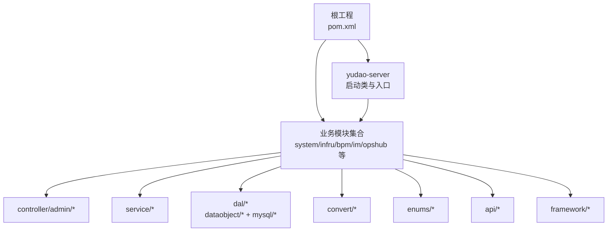
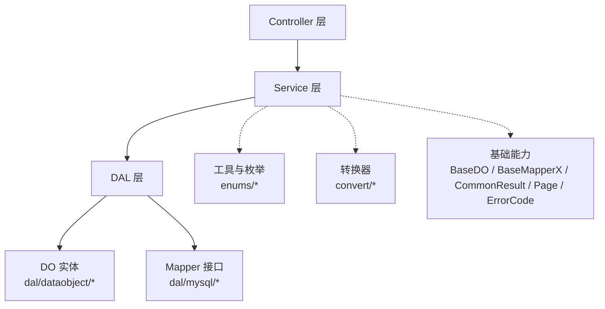
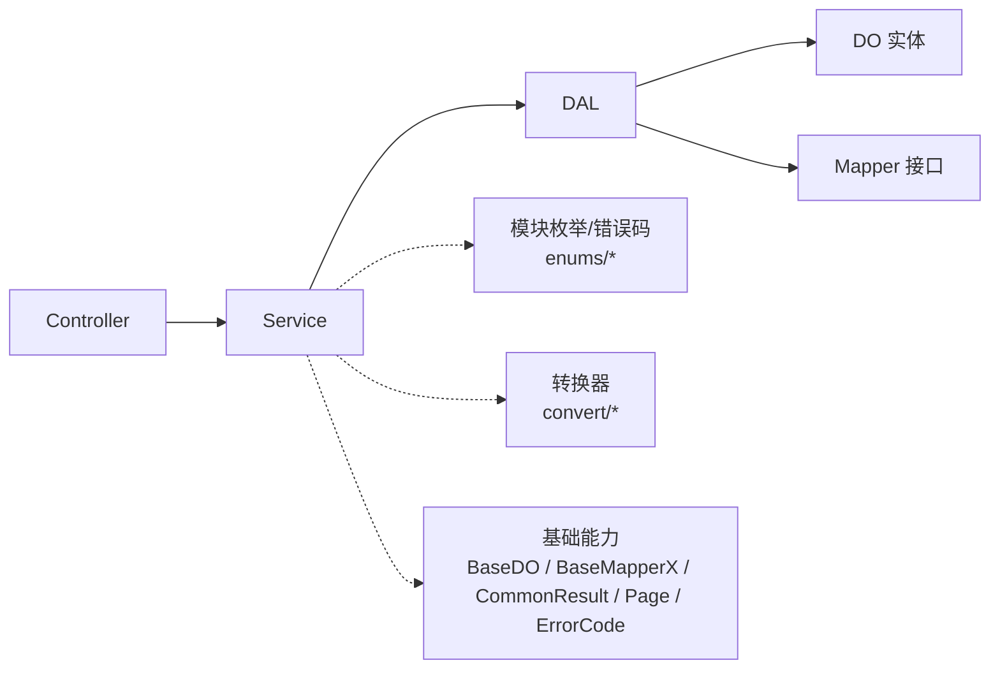

# 命名规范

<cite>
**本文引用的文件**
- [DEVELOPMENT-GUIDE.md](file://DEVELOPMENT-GUIDE.md)
- [AGENTS.md](file://AGENTS.md)
- [pom.xml](file://pom.xml)
- [YudaoServerApplication.java](file://yudao-server/src/main/java/cn/iocoder/yudao/server/YudaoServerApplication.java)
- [ErrorCodeConstants.java（系统模块）](file://yudao-module-system/src/main/java/cn/iocoder/yudao/module/system/enums/ErrorCodeConstants.java)
- [ErrorCodeConstants.java（IM模块）](file://yudao-module-im/src/main/java/cn/iocoder/yudao/module/im/enums/ErrorCodeConstants.java)
- [GlobalErrorCodeConstants.java](file://yudao-framework/yudao-common/src/main/java/cn/iocoder/yudao/framework/common/exception/enums/GlobalErrorCodeConstants.java)
- [serviceImpl.vm](file://yudao-module-infra/src/main/resources/codegen/java/service/serviceImpl.vm)
- [serviceTest.vm](file://yudao-module-infra/src/main/resources/codegen/java/test/serviceTest.vm)
- [BaseDO.java](file://yudao-framework/yudao-spring-boot-starter-mybatis/src/main/java/cn/iocoder/yudao/framework/mybatis/core/dataobject/BaseDO.java)
- [BaseMapperX.java](file://yudao-framework/yudao-spring-boot-starter-mybatis/src/main/java/cn/iocoder/yudao/framework/mybatis/core/mapper/BaseMapperX.java)
- [CommonResult.java](file://yudao-framework/yudao-common/src/main/java/cn/iocoder/yudao/framework/common/pojo/CommonResult.java)
- [PageParam.java](file://yudao-framework/yudao-common/src/main/java/cn/iocoder/yudao/framework/common/pojo/PageParam.java)
- [PageResult.java](file://yudao-framework/yudao-common/src/main/java/cn/iocoder/yudao/framework/common/pojo/PageResult.java)
- [ErrorCode.java](file://yudao-framework/yudao-common/src/main/java/cn/iocoder/yudao/framework/common/exception/enums/ErrorCode.java)
</cite>

## 目录
1. [简介](#简介)
2. [项目结构](#项目结构)
3. [核心组件](#核心组件)
4. [架构总览](#架构总览)
5. [详细组件分析](#详细组件分析)
6. [依赖分析](#依赖分析)
7. [性能考虑](#性能考虑)
8. [故障排查指南](#故障排查指南)
9. [结论](#结论)
10. [附录](#附录)

## 简介
本文件系统化梳理“芋道 Ruoyi-Vue-Pro”项目的命名规范，覆盖 Java 类命名、方法命名、包命名以及错误码编号规则，帮助开发者在统一规范下高效协作与维护。

## 项目结构
- 采用多模块 Maven 结构，根 POM 统一管理模块清单与版本。
- 服务器启动类位于 yudao-server，扫描 base-packages 下的 server 与 module 包，确保模块按约定包结构被加载。
- 每个业务模块遵循统一的包层级：controller/admin、service、dal/dataobject、dal/mysql、convert、enums、api、framework 等。

图示来源
- [pom.xml:10-33](file://pom.xml#L10-L33)
- [YudaoServerApplication.java:16](file://yudao-server/src/main/java/cn/iocoder/yudao/server/YudaoServerApplication.java#L16)
- [AGENTS.md:91-106](file://AGENTS.md#L91-L106)

章节来源
- [pom.xml:10-33](file://pom.xml#L10-L33)
- [YudaoServerApplication.java:16](file://yudao-server/src/main/java/cn/iocoder/yudao/server/YudaoServerApplication.java#L16)
- [AGENTS.md:91-106](file://AGENTS.md#L91-L106)

## 核心组件
- 类命名规范：统一以领域名称 Domain 为核心，结合职责后缀形成类名，如 Controller、Service、ServiceImpl、Mapper、DO、VO、Convert 等。
- 方法命名规范：围绕 CRUD 与查询场景，采用 create/update/delete/get 等动词 + Domain 的组合，返回值与语义明确。
- 包命名规范：统一格式为 cn.iocoder.yudao.module.{moduleCode}.{layer}.{domain}，确保跨模块可读性与隔离性。
- 错误码编号规则：采用 1_ABC_DEF_GHI 格式，其中模块编码、功能域编码、序列编号三段式清晰划分错误来源与类型。

章节来源
- [DEVELOPMENT-GUIDE.md:86-126](file://DEVELOPMENT-GUIDE.md#L86-L126)
- [DEVELOPMENT-GUIDE.md:105-118](file://DEVELOPMENT-GUIDE.md#L105-L118)
- [DEVELOPMENT-GUIDE.md:119-126](file://DEVELOPMENT-GUIDE.md#L119-L126)

## 架构总览
- 层次关系：Controller → Service → DAL，严格禁止反向依赖。
- 统一基础设施：BaseDO、BaseMapperX、CommonResult、PageParam/Result、ErrorCode 等基类与工具类贯穿各模块。

图示来源
- [DEVELOPMENT-GUIDE.md:64-85](file://DEVELOPMENT-GUIDE.md#L64-L85)
- [BaseDO.java](file://yudao-framework/yudao-spring-boot-starter-mybatis/src/main/java/cn/iocoder/yudao/framework/mybatis/core/dataobject/BaseDO.java)
- [BaseMapperX.java](file://yudao-framework/yudao-spring-boot-starter-mybatis/src/main/java/cn/iocoder/yudao/framework/mybatis/core/mapper/BaseMapperX.java)
- [CommonResult.java](file://yudao-framework/yudao-common/src/main/java/cn/iocoder/yudao/framework/common/pojo/CommonResult.java)
- [PageParam.java](file://yudao-framework/yudao-common/src/main/java/cn/iocoder/yudao/framework/common/pojo/PageParam.java)
- [PageResult.java](file://yudao-framework/yudao-common/src/main/java/cn/iocoder/yudao/framework/common/pojo/PageResult.java)
- [ErrorCode.java](file://yudao-framework/yudao-common/src/main/java/cn/iocoder/yudao/framework/common/exception/enums/ErrorCode.java)

章节来源
- [DEVELOPMENT-GUIDE.md:64-85](file://DEVELOPMENT-GUIDE.md#L64-L85)

## 详细组件分析

### 类命名规范
- Controller：{Domain}Controller
- Service 接口：{Domain}Service
- Service 实现：{Domain}ServiceImpl
- Mapper：{Domain}Mapper
- DO 对象：{Domain}DO
- 保存请求 VO：{Domain}SaveReqVO
- 分页请求 VO：{Domain}PageReqVO
- 列表请求 VO：{Domain}ListReqVO
- 响应 VO：{Domain}RespVO
- 精简响应 VO：{Domain}SimpleRespVO
- 转换器：{Domain}Convert
- 错误码常量：ErrorCodeConstants（模块内）

示例来源
- [DEVELOPMENT-GUIDE.md:90-103](file://DEVELOPMENT-GUIDE.md#L90-L103)

章节来源
- [DEVELOPMENT-GUIDE.md:88-103](file://DEVELOPMENT-GUIDE.md#L88-L103)

### 方法命名规范
- 创建：create{Domain}，返回 Long（ID）
- 修改：update{Domain}，返回 void
- 删除单个：delete{Domain}，返回 void
- 删除多个：delete{Domain}List，返回 void
- 获取单个：get{Domain}，返回 {Domain}DO
- 获取多个：get{Domain}List，返回 List<{Domain}DO>
- 获取 Map：get{Domain}Map，返回 Map<Long, {Domain}DO>
- 分页查询：get{Domain}Page，返回 PageResult<{Domain}DO>
- 校验存在：validate{Domain}Exists，返回 void（不存在抛异常）

示例来源
- [DEVELOPMENT-GUIDE.md:107-118](file://DEVELOPMENT-GUIDE.md#L107-L118)

章节来源
- [DEVELOPMENT-GUIDE.md:105-118](file://DEVELOPMENT-GUIDE.md#L105-L118)

### 包命名规范
- 统一格式：cn.iocoder.yudao.module.{moduleCode}.{layer}.{domain}
- 示例：
  - 控制器：cn.iocoder.yudao.module.system.controller.admin.dept
  - 服务：cn.iocoder.yudao.module.system.service.dept
  - 数据访问：cn.iocoder.yudao.module.system.dal.dataobject

示例来源
- [DEVELOPMENT-GUIDE.md:121-126](file://DEVELOPMENT-GUIDE.md#L121-L126)

章节来源
- [DEVELOPMENT-GUIDE.md:119-126](file://DEVELOPMENT-GUIDE.md#L119-L126)

### 错误码编号规则
- 编号格式：1_ABC_DEF_GHI
  - 1：固定前缀，表示自定义错误段
  - ABC：模块编码（两位或三位），用于区分业务模块
  - DEF：功能域编码（三位），用于区分模块内的功能域
  - GHI：序列编号（三位），用于功能域内的具体错误类型或序号
- 示例（节选）：
  - 系统模块：部门相关错误码以 1_002_004_ 开头
  - IM 模块：好友申请、敏感词、实时通话等分别以不同 DEF 段落区分
- 全局错误码：如 500、900、999 等，由全局错误常量定义

示例来源
- [DEVELOPMENT-GUIDE.md:121-126](file://DEVELOPMENT-GUIDE.md#L121-L126)
- [ErrorCodeConstants.java（系统模块）:50-103](file://yudao-module-system/src/main/java/cn/iocoder/yudao/module/system/enums/ErrorCodeConstants.java#L50-L103)
- [ErrorCodeConstants.java（IM模块）:66-108](file://yudao-module-im/src/main/java/cn/iocoder/yudao/module/im/enums/ErrorCodeConstants.java#L66-L108)
- [GlobalErrorCodeConstants.java:29-41](file://yudao-framework/yudao-common/src/main/java/cn/iocoder/yudao/framework/common/exception/enums/GlobalErrorCodeConstants.java#L29-L41)

章节来源
- [DEVELOPMENT-GUIDE.md:121-126](file://DEVELOPMENT-GUIDE.md#L121-L126)
- [ErrorCodeConstants.java（系统模块）:50-103](file://yudao-module-system/src/main/java/cn/iocoder/yudao/module/system/enums/ErrorCodeConstants.java#L50-L103)
- [ErrorCodeConstants.java（IM模块）:66-108](file://yudao-module-im/src/main/java/cn/iocoder/yudao/module/im/enums/ErrorCodeConstants.java#L66-L108)
- [GlobalErrorCodeConstants.java:29-41](file://yudao-framework/yudao-common/src/main/java/cn/iocoder/yudao/framework/common/exception/enums/GlobalErrorCodeConstants.java#L29-L41)

### Service 层规范（方法命名与实现流程）
- 接口定义：提供核心 CRUD 与便捷方法（如 get{Domain}Map）
- 实现流程：校验 → 转换 → 持久化 → 返回
- 测试命名：testCreate{SimpleClass}_success、testUpdate{SimpleClass}_success 等

示例来源
- [DEVELOPMENT-GUIDE.md:474-542](file://DEVELOPMENT-GUIDE.md#L474-L542)
- [serviceTest.vm:77-98](file://yudao-module-infra/src/main/resources/codegen/java/test/serviceTest.vm#L77-L98)

章节来源
- [DEVELOPMENT-GUIDE.md:474-542](file://DEVELOPMENT-GUIDE.md#L474-L542)
- [serviceTest.vm:77-98](file://yudao-module-infra/src/main/resources/codegen/java/test/serviceTest.vm#L77-L98)

### 生成器与命名一致性
- 代码生成器模板中，Service 实现类名采用 {Domain}ServiceImpl，Mapper 名称采用 {Domain}Mapper，确保与规范一致。
- 生成器导入模块错误码常量，便于统一错误码管理。

示例来源
- [serviceImpl.vm:44-60](file://yudao-module-infra/src/main/resources/codegen/java/service/serviceImpl.vm#L44-L60)

章节来源
- [serviceImpl.vm:44-60](file://yudao-module-infra/src/main/resources/codegen/java/service/serviceImpl.vm#L44-L60)

## 依赖分析
- 依赖方向：Controller → Service → DAL，严禁反向依赖。
- 基础设施依赖：所有模块共享 BaseDO、BaseMapperX、CommonResult、PageParam/Result、ErrorCode 等。

图示来源
- [DEVELOPMENT-GUIDE.md:64-85](file://DEVELOPMENT-GUIDE.md#L64-L85)
- [BaseDO.java](file://yudao-framework/yudao-spring-boot-starter-mybatis/src/main/java/cn/iocoder/yudao/framework/mybatis/core/dataobject/BaseDO.java)
- [BaseMapperX.java](file://yudao-framework/yudao-spring-boot-starter-mybatis/src/main/java/cn/iocoder/yudao/framework/mybatis/core/mapper/BaseMapperX.java)
- [CommonResult.java](file://yudao-framework/yudao-common/src/main/java/cn/iocoder/yudao/framework/common/pojo/CommonResult.java)
- [PageParam.java](file://yudao-framework/yudao-common/src/main/java/cn/iocoder/yudao/framework/common/pojo/PageParam.java)
- [PageResult.java](file://yudao-framework/yudao-common/src/main/java/cn/iocoder/yudao/framework/common/pojo/PageResult.java)
- [ErrorCode.java](file://yudao-framework/yudao-common/src/main/java/cn/iocoder/yudao/framework/common/exception/enums/ErrorCode.java)

章节来源
- [DEVELOPMENT-GUIDE.md:64-85](file://DEVELOPMENT-GUIDE.md#L64-L85)

## 性能考虑
- 命名规范本身不直接影响性能，但统一的命名与分层有助于提升可读性与可维护性，间接降低重构成本与引入 Bug 的概率。
- 使用分页查询（get{Domain}Page）与 Map 查询（get{Domain}Map）可减少不必要的数据传输与内存占用。

## 故障排查指南
- 错误码定位：优先查看模块内 ErrorCodeConstants，确认编号段落与含义；若为全局错误，参考 GlobalErrorCodeConstants。
- 常见问题：
  - 依赖缺失：检查根 pom 与 yudao-server 的模块依赖是否同步启用。
  - 包路径不匹配：核对包命名是否符合 cn.iocoder.yudao.module.{moduleCode}.{layer}.{domain}。
  - 方法命名不一致：确保 CRUD 与查询方法遵循 create/update/delete/get 规范。

章节来源
- [pom.xml:10-33](file://pom.xml#L10-L33)
- [YudaoServerApplication.java:16](file://yudao-server/src/main/java/cn/iocoder/yudao/server/YudaoServerApplication.java#L16)
- [DEVELOPMENT-GUIDE.md:119-126](file://DEVELOPMENT-GUIDE.md#L119-L126)
- [GlobalErrorCodeConstants.java:29-41](file://yudao-framework/yudao-common/src/main/java/cn/iocoder/yudao/framework/common/exception/enums/GlobalErrorCodeConstants.java#L29-L41)

## 结论
通过统一的类命名、方法命名、包命名与错误码编号规则，项目实现了高内聚、低耦合与强一致性的开发体验。建议在新增模块或重构时严格遵循本文规范，确保团队协作效率与长期演进能力。

## 附录
- 关键基类与工具
  - BaseDO：统一字段与自动填充
  - BaseMapperX：增强的 MyBatis Mapper
  - CommonResult：统一返回结构
  - PageParam/PageResult：分页请求与响应
  - ErrorCode：错误码模型

章节来源
- [DEVELOPMENT-GUIDE.md:72-84](file://DEVELOPMENT-GUIDE.md#L72-L84)
- [BaseDO.java](file://yudao-framework/yudao-spring-boot-starter-mybatis/src/main/java/cn/iocoder/yudao/framework/mybatis/core/dataobject/BaseDO.java)
- [BaseMapperX.java](file://yudao-framework/yudao-spring-boot-starter-mybatis/src/main/java/cn/iocoder/yudao/framework/mybatis/core/mapper/BaseMapperX.java)
- [CommonResult.java](file://yudao-framework/yudao-common/src/main/java/cn/iocoder/yudao/framework/common/pojo/CommonResult.java)
- [PageParam.java](file://yudao-framework/yudao-common/src/main/java/cn/iocoder/yudao/framework/common/pojo/PageParam.java)
- [PageResult.java](file://yudao-framework/yudao-common/src/main/java/cn/iocoder/yudao/framework/common/pojo/PageResult.java)
- [ErrorCode.java](file://yudao-framework/yudao-common/src/main/java/cn/iocoder/yudao/framework/common/exception/enums/ErrorCode.java)