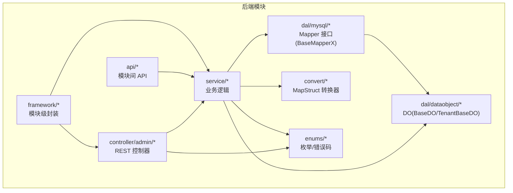
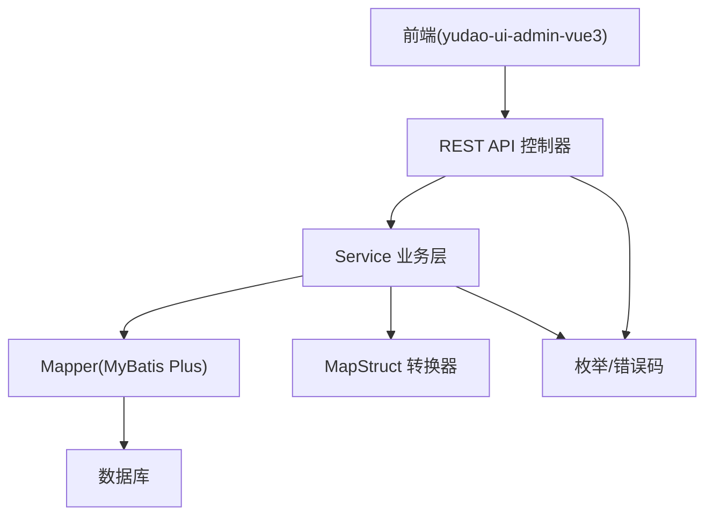
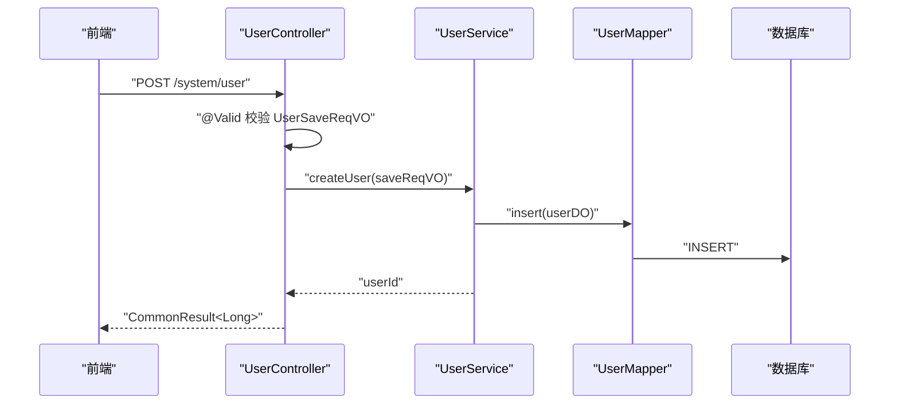
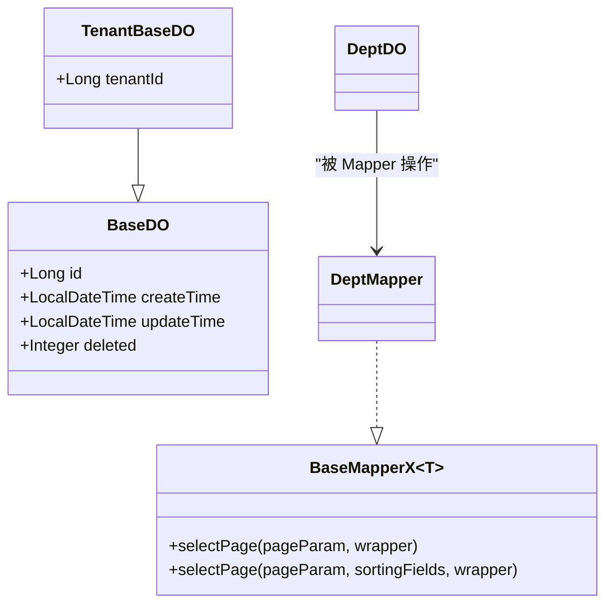
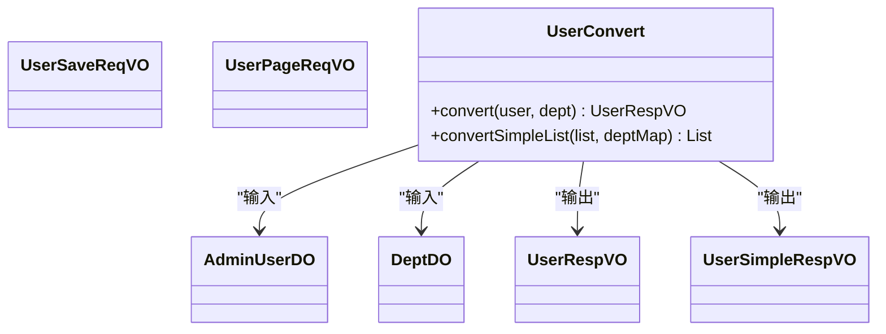
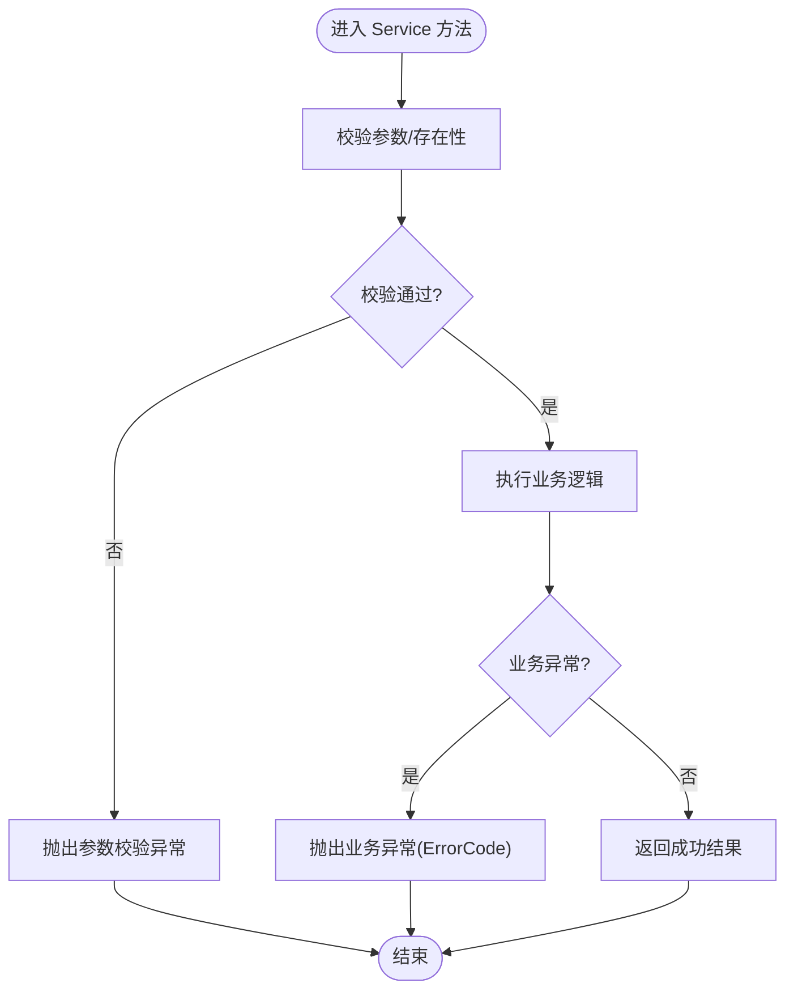
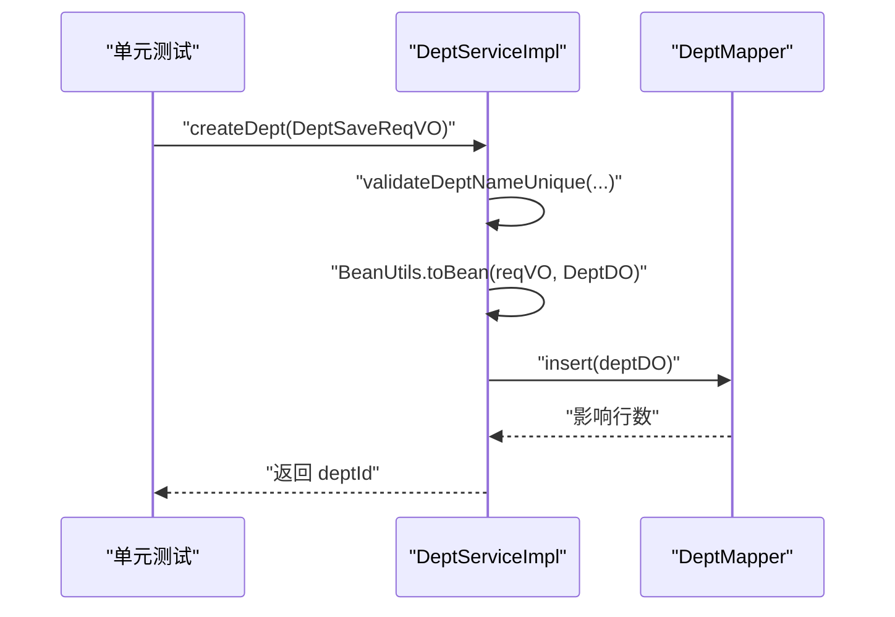
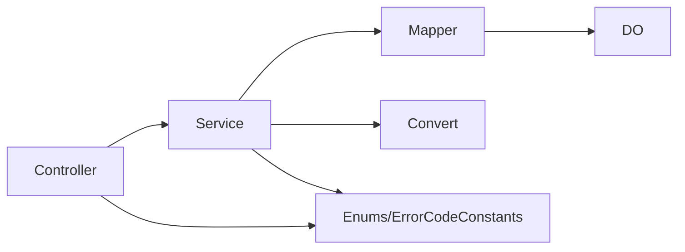

# 开发规范

<cite>
**本文引用的文件列表**
- [package-info.java](file://yudao-framework/yudao-common/src/main/java/cn/iocoder/yudao/framework/common/package-info.java)
- [package-info.java](file://yudao-framework/yudao-spring-boot-starter-web/src/main/java/cn/iocoder/yudao/framework/package-info.java)
- [package-info.java](file://yudao-module-system/src/main/java/cn/iocoder/yudao/module/system/controller/package-info.java)
- [package-info.java](file://yudao-module-infra/src/main/java/cn/iocoder/yudao/module/infra/controller/package-info.java)
- [package-info.java](file://yudao-module-report/src/main/java/cn/iocoder/yudao/module/report/controller/package-info.java)
- [package-info.java](file://yudao-module-system/src/main/java/cn/iocoder/yudao/module/system/framework/package-info.java)
- [package-info.java](file://yudao-module-report/src/main/java/cn/iocoder/yudao/module/report/framework/package-info.java)
- [AGENTS.md](file://AGENTS.md)
- [DEVELOPMENT-GUIDE.md](file://DEVELOPMENT-GUIDE.md)
- [UserSaveReqVO.java](file://yudao-module-system/src/main/java/cn/iocoder/yudao/module/system/controller/admin/user/vo/user/UserSaveReqVO.java)
- [UserPageReqVO.java](file://yudao-module-system/src/main/java/cn/iocoder/yudao/module/system/controller/admin/user/vo/user/UserPageReqVO.java)
- [UserRespVO.java](file://yudao-module-system/src/main/java/cn/iocoder/yudao/module/system/controller/admin/user/vo/user/UserRespVO.java)
- [UserSimpleRespVO.java](file://yudao-module-system/src/main/java/cn/iocoder/yudao/module/system/controller/admin/user/vo/user/UserSimpleRespVO.java)
- [AdminUserApiImpl.java](file://yudao-module-system/src/main/java/cn/iocoder/yudao/module/system/api/user/AdminUserApiImpl.java)
- [UserConvert.java](file://yudao-module-system/src/main/java/cn/iocoder/yudao/module/system/convert/user/UserConvert.java)
- [BaseMapperX.java](file://yudao-framework/yudao-spring-boot-starter-mybatis/src/main/java/cn/iocoder/yudao/framework/mybatis/core/mapper/BaseMapperX.java)
- [BaseDO.java](file://yudao-framework/yudao-spring-boot-starter-mybatis/src/main/java/cn/iocoder/yudao/framework/mybatis/core/dataobject/BaseDO.java)
- [TenantBaseDO.java](file://yudao-framework/yudao-spring-boot-starter-biz-tenant/src/main/java/cn/iocoder/yudao/framework/tenant/core/db/TenantBaseDO.java)
- [PageResult.java](file://yudao-framework/yudao-common/src/main/java/cn/iocoder/yudao/framework/common/pojo/PageResult.java)
- [PageParam.java](file://yudao-framework/yudao-common/src/main/java/cn/iocoder/yudao/framework/common/pojo/PageParam.java)
- [CommonStatusEnum.java](file://yudao-framework/yudao-common/src/main/java/cn/iocoder/yudao/framework/common/enums/CommonStatusEnum.java)
- [DictTypeConstants.java](file://yudao-module-system/src/main/java/cn/iocoder/yudao/module/system/enums/DictTypeConstants.java)
- [ErrorCodeConstants.java](file://yudao-module-system/src/main/java/cn/iocoder/yudao/module/system/enums/ErrorCodeConstants.java)
- [GlobalErrorCodeConstants.java](file://yudao-framework/yudao-common/src/main/java/cn/iocoder/yudao/framework/common/exception/enums/GlobalErrorCodeConstants.java)
- [ErrorCodeConstants.java](file://yudao-module-im/src/main/java/cn/iocoder/yudao/module/im/enums/ErrorCodeConstants.java)
- [ErrorCodeConstants.java](file://yudao-module-bpm/src/main/java/cn/iocoder/yudao/module/bpm/enums/ErrorCodeConstants.java)
- [constants.ts](file://yudao-ui/yudao-ui-admin-vue3/src/utils/constants.ts)
- [Mobile.java](file://yudao-framework/yudao-common/src/main/java/cn/iocoder/yudao/framework/common/validation/Mobile.java)
- [MobileValidator.java](file://yudao-framework/yudao-common/src/main/java/cn/iocoder/yudao/framework/common/validation/MobileValidator.java)
- [Telephone.java](file://yudao-framework/yudao-common/src/main/java/cn/iocoder/yudao/framework/common/validation/Telephone.java)
- [TelephoneValidator.java](file://yudao-framework/yudao-common/src/main/java/cn/iocoder/yudao/framework/common/validation/TelephoneValidator.java)
- [InEnum.java](file://yudao-framework/yudao-common/src/main/java/cn/iocoder/yudao/framework/common/validation/InEnum.java)
- [InEnumValidator.java](file://yudao-framework/yudao-common/src/main/java/cn/iocoder/yudao/framework/common/validation/InEnumValidator.java)
- [InEnumCollectionValidator.java](file://yudao-framework/yudao-common/src/main/java/cn/iocoder/yudao/framework/common/validation/InEnumCollectionValidator.java)
- [ValidationUtils.java](file://yudao-framework/yudao-common/src/main/java/cn/iocoder/yudao/framework/common/util/validation/ValidationUtils.java)
- [DeptServiceImplTest.java](file://yudao-module-system/src/test/java/cn/iocoder/yudao/module/system/service/dept/DeptServiceImplTest.java)
- [serviceImpl.vm](file://yudao-module-infra/src/main/resources/codegen/java/service/serviceImpl.vm)
- [index.ts](file://yudao-ui/yudao-ui-admin-vue3/src/plugins/formCreate/index.ts)
- [index.ts](file://yudao-ui/yudao-ui-admin-vue3/src/api/system/area/index.ts)
- [index.vue](file://yudao-ui/yudao-ui-admin-vue3/src/components/DiyEditor/index.vue)
- [util.ts](file://yudao-ui/yudao-ui-admin-vue3/src/components/DiyEditor/util.ts)
- [en.ts](file://yudao-ui/yudao-ui-admin-vue3/src/locales/en.ts)
</cite>

## 更新摘要
**所做更改**
- 移除了关于使用规范、配置与使用、处理组件、地址组件等已删除内容的相关章节
- 重新组织了开发标准，聚焦于核心的代码规范、架构设计和最佳实践
- 更新了前端组件相关的内容，反映当前实际使用的组件体系

## 目录
1. [引言](#引言)
2. [项目结构](#项目结构)
3. [核心组件](#核心组件)
4. [架构总览](#架构总览)
5. [详细组件分析](#详细组件分析)
6. [依赖关系分析](#依赖关系分析)
7. [性能考虑](#性能考虑)
8. [故障排查指南](#故障排查指南)
9. [结论](#结论)
10. [附录](#附录)

## 引言
本规范面向芋道 Ruoyi-Vue-Pro 的 Java 后端开发，统一项目架构分层、包结构、类命名、方法命名、枚举常量、REST API 设计、数据库与 ORM、VO/DTO 设计、异常与错误码等代码风格与工程实践，确保团队协作一致性与长期可维护性。

## 项目结构
- 采用多模块 Maven 结构，根 pom 统一版本与依赖管理，各业务模块遵循一致的包结构与职责划分。
- 业务模块通用结构（以 cn.iocoder.yudao.module.xxx 为根包）：
  - controller/admin/：管理后台 REST API 控制器，配套 VO（XxxSaveReqVO、XxxRespVO、XxxPageReqVO）
  - service/：业务逻辑层
  - dal/：数据访问层
    - dataobject/：DO 对象（继承 BaseDO 或扩展类如 TenantBaseDO）
    - mysql/：MyBatis Mapper 接口（继承 BaseMapperX）
  - convert/：MapStruct 转换器（DO ↔ VO）
  - enums/：枚举常量与错误码常量
  - api/：模块间 API 接口定义
  - framework/：模块级配置与封装
- 前后端分离：后端提供 REST API，前端根据 admin/app 前缀区分管理后台与 APP 接口。

**图表来源**
- [AGENTS.md:91-106](file://AGENTS.md#L91-L106)
- [package-info.java:1-6](file://yudao-module-system/src/main/java/cn/iocoder/yudao/module/system/controller/package-info.java#L1-L6)

**章节来源**
- [AGENTS.md:91-106](file://AGENTS.md#L91-L106)
- [package-info.java:1-6](file://yudao-module-system/src/main/java/cn/iocoder/yudao/module/system/controller/package-info.java#L1-L6)
- [package-info.java:1-6](file://yudao-module-infra/src/main/java/cn/iocoder/yudao/module/infra/controller/package-info.java#L1-L6)
- [package-info.java:1-6](file://yudao-module-report/src/main/java/cn/iocoder/yudao/module/report/controller/package-info.java#L1-L6)

## 核心组件
- 分层与职责
  - 表现层（Controller）：负责 REST 接口、参数校验、调用 Service、组装响应。
  - 业务层（Service）：编排领域逻辑、事务控制、调用 Mapper/DO、转换 VO。
  - 数据访问层（Mapper/DO）：基于 MyBatis Plus 扩展 BaseMapperX，提供分页、排序、条件查询。
  - 转换层（Convert）：MapStruct 统一 DO/DTO/VO 转换。
  - 错误码与枚举：统一错误码定义与通用枚举。
- 统一基类
  - DO 基类：提供通用字段与逻辑删除标记。
  - Mapper 基类：提供分页查询、排序、Wrapper 构建等能力。
  - 多租户扩展：TenantBaseDO 提供 tenantId 字段。

**章节来源**
- [BaseDO.java:1-24](file://yudao-framework/yudao-spring-boot-starter-mybatis/src/main/java/cn/iocoder/yudao/framework/mybatis/core/dataobject/BaseDO.java#L1-L24)
- [BaseMapperX.java:23-55](file://yudao-framework/yudao-spring-boot-starter-mybatis/src/main/java/cn/iocoder/yudao/framework/mybatis/core/mapper/BaseMapperX.java#L23-L55)
- [TenantBaseDO.java:1-21](file://yudao-framework/yudao-spring-boot-starter-biz-tenant/src/main/java/cn/iocoder/yudao/framework/tenant/core/db/TenantBaseDO.java#L1-L21)

## 架构总览
后端整体采用"表现层-业务层-数据访问层"三层架构，结合模块化与统一的 VO/DTO、错误码、校验与分页约定，形成清晰的边界与稳定的契约。

## 详细组件分析

### 代码风格与命名规范
- 包命名
  - 通用框架与公共类：yudao-common
  - Web 框架：yudao-spring-boot-starter-web
  - 业务模块：yudao-module-xxx
- 类命名
  - 控制器：XxxController（管理后台以 admin 包组织）
  - 业务接口：XxxService；实现类：XxxServiceImpl
  - Mapper 接口：XxxMapper；DO 类：XxxDO
  - 转换器：XxxConvert
  - DTO/VO：XxxSaveReqVO、XxxUpdateReqVO、XxxRespVO、XxxPageReqVO、XxxSimpleRespVO
  - API 接口：XxxApi；实现类：XxxApiImpl
  - 枚举常量：ErrorCodeConstants（模块内）、GlobalErrorCodeConstants（全局）
- 方法命名
  - Service 方法：createXxx、updateXxx、deleteXxx、getXxx、getXxxList、getXxxMap
  - Mapper 方法：selectXxx、selectPage、selectList（使用 BaseMapperX 默认方法）
- 注解与权限
  - 使用数据权限注解 DataPermission 限制查询范围
  - 使用 Validated、@Valid 进行参数校验

**章节来源**
- [AGENTS.md:91-106](file://AGENTS.md#L91-L106)
- [UserSaveReqVO.java](file://yudao-module-system/src/main/java/cn/iocoder/yudao/module/system/controller/admin/user/vo/user/UserSaveReqVO.java)
- [UserPageReqVO.java](file://yudao-module-system/src/main/java/cn/iocoder/yudao/module/system/controller/admin/user/vo/user/UserPageReqVO.java)
- [UserRespVO.java](file://yudao-module-system/src/main/java/cn/iocoder/yudao/module/system/controller/admin/user/vo/user/UserRespVO.java)
- [UserSimpleRespVO.java](file://yudao-module-system/src/main/java/cn/iocoder/yudao/module/system/controller/admin/user/vo/user/UserSimpleRespVO.java)
- [AdminUserApiImpl.java:1-94](file://yudao-module-system/src/main/java/cn/iocoder/yudao/module/system/api/user/AdminUserApiImpl.java#L1-L94)
- [UserConvert.java:1-56](file://yudao-module-system/src/main/java/cn/iocoder/yudao/module/system/convert/user/UserConvert.java#L1-L56)

### REST API 设计规范
- URL 路径设计
  - 采用资源化路径，动词使用名词化，如 /system/user/{id}
  - 管理后台与 APP 接口通过包前缀区分（admin/app），避免命名冲突
- HTTP 方法
  - GET：查询单个或分页列表
  - POST：创建
  - PUT：更新
  - DELETE：删除
- 请求/响应格式
  - 统一使用 CommonResult 包裹（由 yudao-common 提供）
  - 分页响应使用 PageResult，包含 total 与 list
- 分页约定
  - 分页参数：pageNo、pageSize（最大 200，特殊场景可用 -1 不分页）
  - 排序：SortablePageParam 支持多字段排序
- 权限注解
  - 使用 DataPermission 注解控制数据可见范围
- 示例参考
  - 管理后台控制器包说明
  - APP 接口包说明（以 App 前缀区分）

**图表来源**
- [package-info.java:1-6](file://yudao-module-system/src/main/java/cn/iocoder/yudao/module/system/controller/package-info.java#L1-L6)
- [UserSaveReqVO.java](file://yudao-module-system/src/main/java/cn/iocoder/yudao/module/system/controller/admin/user/vo/user/UserSaveReqVO.java)
- [PageResult.java:1-41](file://yudao-framework/yudao-common/src/main/java/cn/iocoder/yudao/framework/common/pojo/PageResult.java#L1-L41)
- [PageParam.java:1-36](file://yudao-framework/yudao-common/src/main/java/cn/iocoder/yudao/framework/common/pojo/PageParam.java#L1-L36)

**章节来源**
- [package-info.java:1-6](file://yudao-module-system/src/main/java/cn/iocoder/yudao/module/system/controller/package-info.java#L1-L6)
- [package-info.java:1-6](file://yudao-module-infra/src/main/java/cn/iocoder/yudao/module/infra/controller/package-info.java#L1-L6)
- [package-info.java:1-6](file://yudao-module-report/src/main/java/cn/iocoder/yudao/module/report/controller/package-info.java#L1-L6)
- [PageResult.java:1-41](file://yudao-framework/yudao-common/src/main/java/cn/iocoder/yudao/framework/common/pojo/PageResult.java#L1-L41)
- [PageParam.java:1-36](file://yudao-framework/yudao-common/src/main/java/cn/iocoder/yudao/framework/common/pojo/PageParam.java#L1-L36)

### 数据库与 ORM 规范
- 表命名规则
  - 采用模块名_业务名_表名 的命名策略，便于识别与维护
- DO 实体类设计
  - 继承 BaseDO（或 TenantBaseDO），统一创建时间、更新时间、逻辑删除等字段
  - 多租户场景使用 TenantBaseDO，增加 tenantId 字段
- Mapper 接口实现
  - 继承 BaseMapperX，使用 selectPage、selectList 等默认方法
  - 查询条件使用 LambdaQueryWrapperX 的 xxxIfPresent 方法，自动忽略 null/空串
- 查询条件构建
  - 使用 Wrapper 构建查询，支持排序、分页、条件过滤
- 生成器与模板
  - 代码生成器模板中引入 PageResult、PageParam、BeanUtils 等常用类型

**图表来源**
- [BaseDO.java:1-24](file://yudao-framework/yudao-spring-boot-starter-mybatis/src/main/java/cn/iocoder/yudao/framework/mybatis/core/dataobject/BaseDO.java#L1-L24)
- [TenantBaseDO.java:1-21](file://yudao-framework/yudao-spring-boot-starter-biz-tenant/src/main/java/cn/iocoder/yudao/framework/tenant/core/db/TenantBaseDO.java#L1-L21)
- [BaseMapperX.java:23-55](file://yudao-framework/yudao-spring-boot-starter-mybatis/src/main/java/cn/iocoder/yudao/framework/mybatis/core/mapper/BaseMapperX.java#L23-L55)

**章节来源**
- [BaseDO.java:1-24](file://yudao-framework/yudao-spring-boot-starter-mybatis/src/main/java/cn/iocoder/yudao/framework/mybatis/core/dataobject/BaseDO.java#L1-L24)
- [TenantBaseDO.java:1-21](file://yudao-framework/yudao-spring-boot-starter-biz-tenant/src/main/java/cn/iocoder/yudao/framework/tenant/core/db/TenantBaseDO.java#L1-L21)
- [BaseMapperX.java:23-55](file://yudao-framework/yudao-spring-boot-starter-mybatis/src/main/java/cn/iocoder/yudao/framework/mybatis/core/mapper/BaseMapperX.java#L23-L55)
- [serviceImpl.vm:1-60](file://yudao-module-infra/src/main/resources/codegen/java/service/serviceImpl.vm#L1-L60)

### VO/DTO 设计规范
- SaveReqVO：创建/修改请求参数，包含必填与选填字段，配合 @Valid 校验
- RespVO：响应对象，展示完整或部分字段
- PageReqVO：分页查询请求参数，结合 PageParam
- SimpleRespVO：精简响应对象，用于列表或关联对象的轻量展示
- 转换器（Convert）
  - 使用 MapStruct 将 DO 转为 VO，支持复杂对象与集合转换
  - 提供默认方法组合多个对象（如用户+部门）的转换

**图表来源**
- [UserSaveReqVO.java](file://yudao-module-system/src/main/java/cn/iocoder/yudao/module/system/controller/admin/user/vo/user/UserSaveReqVO.java)
- [UserRespVO.java:1-30](file://yudao-module-system/src/main/java/cn/iocoder/yudao/module/system/controller/admin/user/vo/user/UserRespVO.java#L1-L30)
- [UserSimpleRespVO.java:1-30](file://yudao-module-system/src/main/java/cn/iocoder/yudao/module/system/controller/admin/user/vo/user/UserSimpleRespVO.java#L1-L30)
- [UserPageReqVO.java](file://yudao-module-system/src/main/java/cn/iocoder/yudao/module/system/controller/admin/user/vo/user/UserPageReqVO.java)
- [UserConvert.java:1-56](file://yudao-module-system/src/main/java/cn/iocoder/yudao/module/system/convert/user/UserConvert.java#L1-L56)

**章节来源**
- [UserSaveReqVO.java](file://yudao-module-system/src/main/java/cn/iocoder/yudao/module/system/controller/admin/user/vo/user/UserSaveReqVO.java)
- [UserRespVO.java:1-30](file://yudao-module-system/src/main/java/cn/iocoder/yudao/module/system/controller/admin/user/vo/user/UserRespVO.java#L1-L30)
- [UserSimpleRespVO.java:1-30](file://yudao-module-system/src/main/java/cn/iocoder/yudao/module/system/controller/admin/user/vo/user/UserSimpleRespVO.java#L1-L30)
- [UserPageReqVO.java](file://yudao-module-system/src/main/java/cn/iocoder/yudao/module/system/controller/admin/user/vo/user/UserPageReqVO.java)
- [UserConvert.java:1-56](file://yudao-module-system/src/main/java/cn/iocoder/yudao/module/system/convert/user/UserConvert.java#L1-L56)

### 异常与错误码规范
- 错误码定义规则
  - 模块内错误码：在各模块 enums 下定义 ErrorCodeConstants
  - 全局错误码：在 yudao-common 中定义 GlobalErrorCodeConstants
  - 错误码命名：模块段-子模块段-业务段-序号，保证唯一性与可读性
- 异常抛出方式
  - 业务异常：使用 ServiceExceptionUtil.exception(...) 抛出
  - 参数校验异常：使用 ValidationUtils.validate(...) 抛出 ConstraintViolationException
- 校验方法模式
  - 使用 @Valid 与 @Validated 对请求参数进行分组校验
  - 自定义校验注解：@Mobile、@Telephone、@InEnum 等
- 枚举与前端常量
  - 后端通用枚举：CommonStatusEnum 等
  - 前端常量：yudao-ui-admin-vue3 中 constants.ts 定义前端枚举

**图表来源**
- [ErrorCodeConstants.java:50-148](file://yudao-module-system/src/main/java/cn/iocoder/yudao/module/system/enums/ErrorCodeConstants.java#L50-L148)
- [GlobalErrorCodeConstants.java:29-41](file://yudao-framework/yudao-common/src/main/java/cn/iocoder/yudao/framework/common/exception/enums/GlobalErrorCodeConstants.java#L29-L41)
- [ValidationUtils.java:1-55](file://yudao-framework/yudao-common/src/main/java/cn/iocoder/yudao/framework/common/util/validation/ValidationUtils.java#L1-L55)
- [Mobile.java:1-28](file://yudao-framework/yudao-common/src/main/java/cn/iocoder/yudao/framework/common/validation/Mobile.java#L1-L28)
- [Telephone.java:1-28](file://yudao-framework/yudao-common/src/main/java/cn/iocoder/yudao/framework/common/validation/Telephone.java#L1-L28)
- [InEnum.java:1-35](file://yudao-framework/yudao-common/src/main/java/cn/iocoder/yudao/framework/common/validation/InEnum.java#L1-L35)
- [constants.ts:1-74](file://yudao-ui/yudao-ui-admin-vue3/src/utils/constants.ts#L1-L74)

**章节来源**
- [ErrorCodeConstants.java:50-148](file://yudao-module-system/src/main/java/cn/iocoder/yudao/module/system/enums/ErrorCodeConstants.java#L50-L148)
- [GlobalErrorCodeConstants.java:29-41](file://yudao-framework/yudao-common/src/main/java/cn/iocoder/yudao/framework/common/exception/enums/GlobalErrorCodeConstants.java#L29-L41)
- [ValidationUtils.java:1-55](file://yudao-framework/yudao-common/src/main/java/cn/iocoder/yudao/framework/common/util/validation/ValidationUtils.java#L1-L55)
- [Mobile.java:1-28](file://yudao-framework/yudao-common/src/main/java/cn/iocoder/yudao/framework/common/validation/Mobile.java#L1-L28)
- [Telephone.java:1-28](file://yudao-framework/yudao-common/src/main/java/cn/iocoder/yudao/framework/common/validation/Telephone.java#L1-L28)
- [InEnum.java:1-35](file://yudao-framework/yudao-common/src/main/java/cn/iocoder/yudao/framework/common/validation/InEnum.java#L1-L35)
- [constants.ts:1-74](file://yudao-ui/yudao-ui-admin-vue3/src/utils/constants.ts#L1-L74)

### Service 层规范
- 接口定义
  - 提供核心 CRUD 与业务方法，必要时提供 default 便捷方法（如 Map 转换）
- 实现步骤
  - 校验：参数/存在性/业务规则
  - 转换：VO → DO
  - 持久化：Mapper 操作
  - 返回：主键或聚合结果
- 测试参考
  - 使用随机 VO 与断言工具验证创建/更新行为

**图表来源**
- [DEVELOPMENT-GUIDE.md:472-542](file://DEVELOPMENT-GUIDE.md#L472-L542)
- [DeptServiceImplTest.java:33-74](file://yudao-module-system/src/test/java/cn/iocoder/yudao/module/system/service/dept/DeptServiceImplTest.java#L33-L74)

**章节来源**
- [DEVELOPMENT-GUIDE.md:472-542](file://DEVELOPMENT-GUIDE.md#L472-L542)
- [DeptServiceImplTest.java:33-74](file://yudao-module-system/src/test/java/cn/iocoder/yudao/module/system/service/dept/DeptServiceImplTest.java#L33-L74)

### 前端组件与表单规范
- 表单组件集成
  - 通过 formCreate 插件统一注册各类表单组件
  - 支持上传组件（UploadFile、UploadImg、UploadImgs）
  - 集成字典选择、部门选择、用户选择等专用组件
  - 内置富文本编辑器、iframe 组件等
- 地区组件
  - 提供地区树形选择组件
  - 支持按 IP 获取地区信息的 API 接口
  - 地区数据处理工具函数
- DIY 编辑器
  - 移动端页面设计器，支持组件拖拽、配置
  - 内置多种组件库（基础组件、图文组件、商品组件、用户组件、营销组件）
  - 支持预览、保存、重置等功能
- 国际化支持
  - 完整的英文国际化文案
  - 支持多语言切换的基础框架

**章节来源**
- [index.ts:66-134](file://yudao-ui/yudao-ui-admin-vue3/src/plugins/formCreate/index.ts#L66-L134)
- [index.ts:1-11](file://yudao-ui/yudao-ui-admin-vue3/src/api/system/area/index.ts#L1-L11)
- [index.vue:31-234](file://yudao-ui/yudao-ui-admin-vue3/src/components/DiyEditor/index.vue#L31-L234)
- [util.ts:80-125](file://yudao-ui/yudao-ui-admin-vue3/src/components/DiyEditor/util.ts#L80-L125)
- [en.ts:1-47](file://yudao-ui/yudao-ui-admin-vue3/src/locales/en.ts#L1-L47)

## 依赖关系分析
- 模块间依赖
  - 各业务模块通过 api 接口对外暴露能力，避免直接耦合
  - 通用框架模块（yudao-common、yudao-spring-boot-starter-*）被业务模块依赖
- 关键依赖链
  - Controller → Service → Mapper → DO
  - Service → Convert → VO/DTO
  - Controller/Service → Enums/ErrorCodeConstants

## 性能考虑
- 分页与排序
  - 使用 BaseMapperX 的分页能力，避免一次性加载大量数据
  - 合理设置 pageSize 上限，防止超大数据量查询
- 查询优化
  - 使用 LambdaQueryWrapperX 的条件构建，避免空值参与查询
  - 通过索引与覆盖查询减少扫描
- 缓存与序列化
  - 注意 BaseDO 中对 Easy-Trans 的 Jackson 序列化兼容处理
- 并发与幂等
  - 使用重复请求保护与幂等键设计，避免重复提交

## 故障排查指南
- 参数校验失败
  - 检查 @Valid/@Validated 是否正确使用
  - 查看自定义校验注解（@Mobile、@Telephone、@InEnum）的约束消息
- 业务异常
  - 根据模块错误码定位问题，确认异常抛出位置与提示信息
- 分页异常
  - 确认 pageNo/pageSize 合法范围，检查排序字段是否存在
- 数据权限问题
  - 检查 DataPermission 注解使用与数据范围配置
- 前端组件问题
  - 表单组件未注册：检查 formCreate 插件初始化
  - 地区组件数据为空：确认 API 接口调用和数据格式
  - DIY 编辑器组件缺失：检查组件库配置和导入路径

**章节来源**
- [ValidationUtils.java:1-55](file://yudao-framework/yudao-common/src/main/java/cn/iocoder/yudao/framework/common/util/validation/ValidationUtils.java#L1-L55)
- [MobileValidator.java:1-25](file://yudao-framework/yudao-common/src/main/java/cn/iocoder/yudao/framework/common/validation/MobileValidator.java#L1-L25)
- [TelephoneValidator.java:1-25](file://yudao-framework/yudao-common/src/main/java/cn/iocoder/yudao/framework/common/validation/TelephoneValidator.java#L1-L25)
- [InEnumValidator.java:1-42](file://yudao-framework/yudao-common/src/main/java/cn/iocoder/yudao/framework/common/validation/InEnumValidator.java#L1-L42)
- [InEnumCollectionValidator.java:1-43](file://yudao-framework/yudao-common/src/main/java/cn/iocoder/yudao/framework/common/validation/InEnumCollectionValidator.java#L1-L43)
- [ErrorCodeConstants.java:50-148](file://yudao-module-system/src/main/java/cn/iocoder/yudao/module/system/enums/ErrorCodeConstants.java#L50-L148)

## 结论
本规范总结了芋道 Ruoyi-Vue-Pro 的后端开发最佳实践，涵盖分层、包结构、命名、API、ORM、VO/DTO、异常与错误码等方面。建议在日常开发中严格遵循，以提升代码质量、可维护性与协作效率。

## 附录
- 通用枚举与前端常量
  - CommonStatusEnum：通用状态（启用/禁用）
  - 前端常量：yudao-ui-admin-vue3 中 constants.ts 定义的枚举值
- 字典类型常量
  - DictTypeConstants：系统字典类型键值
- 前端组件生态
  - 表单组件：UploadFile、UploadImg、UploadImgs、DictSelect、DeptSelect、UserSelect、ApiSelect、Editor、IframeComponent、AreaSelect
  - 编辑器组件：DiyEditor 提供的移动端页面设计器
  - 地区组件：area 组件库和相关 API 接口

**章节来源**
- [CommonStatusEnum.java:1-46](file://yudao-framework/yudao-common/src/main/java/cn/iocoder/yudao/framework/common/enums/CommonStatusEnum.java#L1-L46)
- [DictTypeConstants.java:1-26](file://yudao-module-system/src/main/java/cn/iocoder/yudao/module/system/enums/DictTypeConstants.java#L1-L26)
- [constants.ts:1-74](file://yudao-ui/yudao-ui-admin-vue3/src/utils/constants.ts#L1-L74)
- [index.ts:66-134](file://yudao-ui/yudao-ui-admin-vue3/src/plugins/formCreate/index.ts#L66-L134)
- [index.vue:31-234](file://yudao-ui/yudao-ui-admin-vue3/src/components/DiyEditor/index.vue#L31-L234)
- [index.ts:1-11](file://yudao-ui/yudao-ui-admin-vue3/src/api/system/area/index.ts#L1-L11)