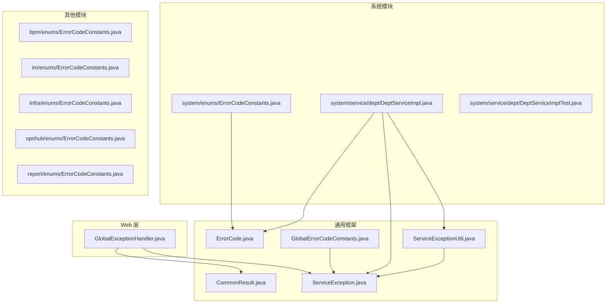
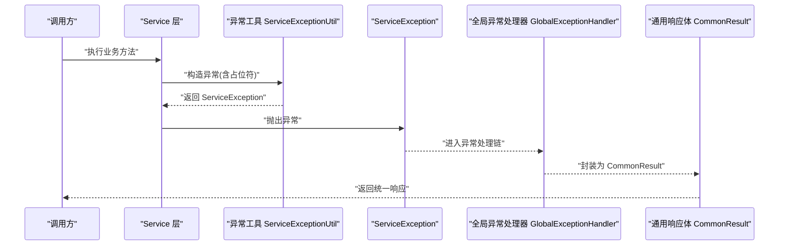
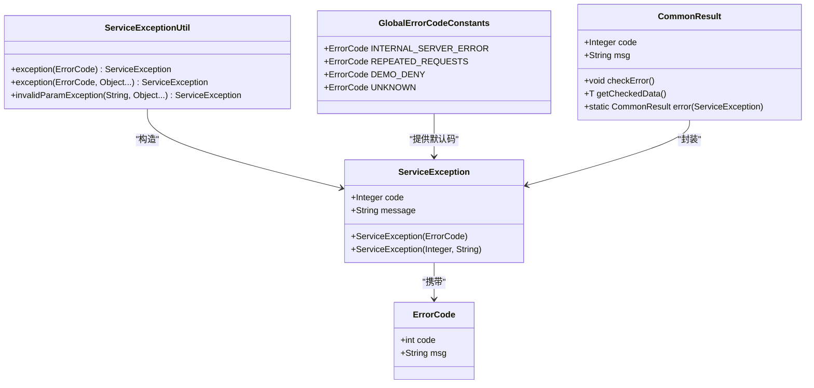
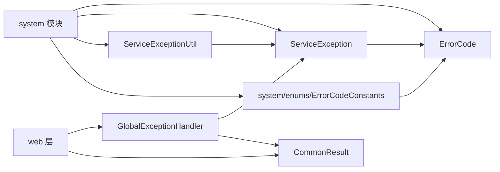

# 异常与错误码规范

<cite>
**本文引用的文件**
- [yudao-framework/yudao-common/src/main/java/cn/iocoder/yudao/framework/common/exception/ErrorCode.java](file://yudao-framework/yudao-common/src/main/java/cn/iocoder/yudao/framework/common/exception/ErrorCode.java)
- [yudao-framework/yudao-common/src/main/java/cn/iocoder/yudao/framework/common/exception/ServiceException.java](file://yudao-framework/yudao-common/src/main/java/cn/iocoder/yudao/framework/common/exception/ServiceException.java)
- [yudao-framework/yudao-common/src/main/java/cn/iocoder/yudao/framework/common/exception/enums/GlobalErrorCodeConstants.java](file://yudao-framework/yudao-common/src/main/java/cn/iocoder/yudao/framework/common/exception/enums/GlobalErrorCodeConstants.java)
- [yudao-framework/yudao-common/src/main/java/cn/iocoder/yudao/framework/common/exception/util/ServiceExceptionUtil.java](file://yudao-framework/yudao-common/src/main/java/cn/iocoder/yudao/framework/common/exception/util/ServiceExceptionUtil.java)
- [yudao-framework/yudao-spring-boot-starter-web/src/main/java/cn/iocoder/yudao/framework/web/core/handler/GlobalExceptionHandler.java](file://yudao-framework/yudao-spring-boot-starter-web/src/main/java/cn/iocoder/yudao/framework/web/core/handler/GlobalExceptionHandler.java)
- [yudao-framework/yudao-common/src/main/java/cn/iocoder/yudao/framework/common/pojo/CommonResult.java](file://yudao-framework/yudao-common/src/main/java/cn/iocoder/yudao/framework/common/pojo/CommonResult.java)
- [yudao-module-system/src/main/java/cn/iocoder/yudao/module/system/enums/ErrorCodeConstants.java](file://yudao-module-system/src/main/java/cn/iocoder/yudao/module/system/enums/ErrorCodeConstants.java)
- [yudao-module-system/src/main/java/cn/iocoder/yudao/module/system/service/dept/DeptServiceImpl.java](file://yudao-module-system/src/main/java/cn/iocoder/yudao/module/system/service/dept/DeptServiceImpl.java)
- [yudao-module-system/src/test/java/cn/iocoder/yudao/module/system/service/dept/DeptServiceImplTest.java](file://yudao-module-system/src/test/java/cn/iocoder/yudao/module/system/service/dept/DeptServiceImplTest.java)
- [yudao-module-bpm/src/main/java/cn/iocoder/yudao/module/bpm/enums/ErrorCodeConstants.java](file://yudao-module-bpm/src/main/java/cn/iocoder/yudao/module/bpm/enums/ErrorCodeConstants.java)
- [yudao-module-im/src/main/java/cn/iocoder/yudao/module/im/enums/ErrorCodeConstants.java](file://yudao-module-im/src/main/java/cn/iocoder/yudao/module/im/enums/ErrorCodeConstants.java)
- [yudao-module-infra/src/main/java/cn/iocoder/yudao/module/infra/enums/ErrorCodeConstants.java](file://yudao-module-infra/src/main/java/cn/iocoder/yudao/module/infra/enums/ErrorCodeConstants.java)
- [yudao-module-opshub/src/main/java/cn/iocoder/yudao/module/opshub/enums/ErrorCodeConstants.java](file://yudao-module-opshub/src/main/java/cn/iocoder/yudao/module/opshub/enums/ErrorCodeConstants.java)
- [yudao-module-report/src/main/java/cn/iocoder/yudao/module/report/enums/ErrorCodeConstants.java](file://yudao-module-report/src/main/java/cn/iocoder/yudao/module/report/enums/ErrorCodeConstants.java)
</cite>

## 目录
1. [引言](#引言)
2. [项目结构](#项目结构)
3. [核心组件](#核心组件)
4. [架构总览](#架构总览)
5. [详细组件分析](#详细组件分析)
6. [依赖分析](#依赖分析)
7. [性能考量](#性能考量)
8. [故障排查指南](#故障排查指南)
9. [结论](#结论)
10. [附录](#附录)

## 引言
本规范面向“芋道 Ruoyi-Vue-Pro”项目的开发者，系统性阐述异常与错误码的设计与使用规范。重点包括：
- 模块级错误码常量定义方式（在各模块 enums/ 包下定义 ErrorCodeConstants 接口）
- 错误码编号 1_ABC_DEF_GHI 的分配规则与命名约定
- 异常抛出的三种方式：直接 new ServiceException、便捷工具方法 exception()、带参数填充的异常抛出
- 校验方法的私有化设计模式：在 Service 层以 private 校验方法统一抛异常
- 完整的异常处理示例：validateDeptExists、validateDeptNameUnique 等
- 异常与错误码的对应关系及参数化错误码的使用
- 最佳实践与常见问题解决方案

## 项目结构
围绕异常与错误码的关键目录与文件如下：
- 异常与错误码通用能力位于 yudao-framework/yudao-common 中，包含 ErrorCode、ServiceException、全局错误码常量与异常工具类
- 各业务模块在各自 module 下的 enums/ 包内定义 ErrorCodeConstants 接口，集中声明本模块的错误码
- Web 层通过 GlobalExceptionHandler 统一捕获 ServiceException 并返回 CommonResult
- Service 层通过私有校验方法统一抛出异常，保证校验逻辑内聚与一致性

图表来源
- [yudao-framework/yudao-common/src/main/java/cn/iocoder/yudao/framework/common/exception/ErrorCode.java](file://yudao-framework/yudao-common/src/main/java/cn/iocoder/yudao/framework/common/exception/ErrorCode.java)
- [yudao-framework/yudao-common/src/main/java/cn/iocoder/yudao/framework/common/exception/ServiceException.java](file://yudao-framework/yudao-common/src/main/java/cn/iocoder/yudao/framework/common/exception/ServiceException.java)
- [yudao-framework/yudao-common/src/main/java/cn/iocoder/yudao/framework/common/exception/enums/GlobalErrorCodeConstants.java](file://yudao-framework/yudao-common/src/main/java/cn/iocoder/yudao/framework/common/exception/enums/GlobalErrorCodeConstants.java)
- [yudao-framework/yudao-common/src/main/java/cn/iocoder/yudao/framework/common/exception/util/ServiceExceptionUtil.java](file://yudao-framework/yudao-common/src/main/java/cn/iocoder/yudao/framework/common/exception/util/ServiceExceptionUtil.java)
- [yudao-framework/yudao-spring-boot-starter-web/src/main/java/cn/iocoder/yudao/framework/web/core/handler/GlobalExceptionHandler.java](file://yudao-framework/yudao-spring-boot-starter-web/src/main/java/cn/iocoder/yudao/framework/web/core/handler/GlobalExceptionHandler.java)
- [yudao-framework/yudao-common/src/main/java/cn/iocoder/yudao/framework/common/pojo/CommonResult.java](file://yudao-framework/yudao-common/src/main/java/cn/iocoder/yudao/framework/common/pojo/CommonResult.java)
- [yudao-module-system/src/main/java/cn/iocoder/yudao/module/system/enums/ErrorCodeConstants.java](file://yudao-module-system/src/main/java/cn/iocoder/yudao/module/system/enums/ErrorCodeConstants.java)
- [yudao-module-system/src/main/java/cn/iocoder/yudao/module/system/service/dept/DeptServiceImpl.java](file://yudao-module-system/src/main/java/cn/iocoder/yudao/module/system/service/dept/DeptServiceImpl.java)
- [yudao-module-system/src/test/java/cn/iocoder/yudao/module/system/service/dept/DeptServiceImplTest.java](file://yudao-module-system/src/test/java/cn/iocoder/yudao/module/system/service/dept/DeptServiceImplTest.java)

章节来源
- [yudao-framework/yudao-common/src/main/java/cn/iocoder/yudao/framework/common/exception/ErrorCode.java](file://yudao-framework/yudao-common/src/main/java/cn/iocoder/yudao/framework/common/exception/ErrorCode.java)
- [yudao-framework/yudao-common/src/main/java/cn/iocoder/yudao/framework/common/exception/ServiceException.java](file://yudao-framework/yudao-common/src/main/java/cn/iocoder/yudao/framework/common/exception/ServiceException.java)
- [yudao-framework/yudao-common/src/main/java/cn/iocoder/yudao/framework/common/exception/enums/GlobalErrorCodeConstants.java](file://yudao-framework/yudao-common/src/main/java/cn/iocoder/yudao/framework/common/exception/enums/GlobalErrorCodeConstants.java)
- [yudao-framework/yudao-common/src/main/java/cn/iocoder/yudao/framework/common/exception/util/ServiceExceptionUtil.java](file://yudao-framework/yudao-common/src/main/java/cn/iocoder/yudao/framework/common/exception/util/ServiceExceptionUtil.java)
- [yudao-framework/yudao-spring-boot-starter-web/src/main/java/cn/iocoder/yudao/framework/web/core/handler/GlobalExceptionHandler.java](file://yudao-framework/yudao-spring-boot-starter-web/src/main/java/cn/iocoder/yudao/framework/web/core/handler/GlobalExceptionHandler.java)
- [yudao-framework/yudao-common/src/main/java/cn/iocoder/yudao/framework/common/pojo/CommonResult.java](file://yudao-framework/yudao-common/src/main/java/cn/iocoder/yudao/framework/common/pojo/CommonResult.java)
- [yudao-module-system/src/main/java/cn/iocoder/yudao/module/system/enums/ErrorCodeConstants.java](file://yudao-module-system/src/main/java/cn/iocoder/yudao/module/system/enums/ErrorCodeConstants.java)
- [yudao-module-system/src/main/java/cn/iocoder/yudao/module/system/service/dept/DeptServiceImpl.java](file://yudao-module-system/src/main/java/cn/iocoder/yudao/module/system/service/dept/DeptServiceImpl.java)
- [yudao-module-system/src/test/java/cn/iocoder/yudao/module/system/service/dept/DeptServiceImplTest.java](file://yudao-module-system/src/test/java/cn/iocoder/yudao/module/system/service/dept/DeptServiceImplTest.java)

## 核心组件
- 错误码对象：ErrorCode，封装 code 与 msg，用于模块内统一定义错误码常量
- 业务异常：ServiceException，承载 code 与 message，用于在业务层抛出
- 全局错误码：GlobalErrorCodeConstants，定义通用的 5xx、9xx 等全局错误码
- 异常工具：ServiceExceptionUtil，提供 exception(...) 与带参数的异常构造方法，支持占位符填充
- 全局异常处理器：GlobalExceptionHandler，统一捕获 ServiceException 并返回 CommonResult
- 通用响应体：CommonResult，提供 checkError()/getCheckedData() 等与异常体系的集成方法

章节来源
- [yudao-framework/yudao-common/src/main/java/cn/iocoder/yudao/framework/common/exception/ErrorCode.java](file://yudao-framework/yudao-common/src/main/java/cn/iocoder/yudao/framework/common/exception/ErrorCode.java)
- [yudao-framework/yudao-common/src/main/java/cn/iocoder/yudao/framework/common/exception/ServiceException.java](file://yudao-framework/yudao-common/src/main/java/cn/iocoder/yudao/framework/common/exception/ServiceException.java)
- [yudao-framework/yudao-common/src/main/java/cn/iocoder/yudao/framework/common/exception/enums/GlobalErrorCodeConstants.java](file://yudao-framework/yudao-common/src/main/java/cn/iocoder/yudao/framework/common/exception/enums/GlobalErrorCodeConstants.java)
- [yudao-framework/yudao-common/src/main/java/cn/iocoder/yudao/framework/common/exception/util/ServiceExceptionUtil.java](file://yudao-framework/yudao-common/src/main/java/cn/iocoder/yudao/framework/common/exception/util/ServiceExceptionUtil.java)
- [yudao-framework/yudao-spring-boot-starter-web/src/main/java/cn/iocoder/yudao/framework/web/core/handler/GlobalExceptionHandler.java](file://yudao-framework/yudao-spring-boot-starter-web/src/main/java/cn/iocoder/yudao/framework/web/core/handler/GlobalExceptionHandler.java)
- [yudao-framework/yudao-common/src/main/java/cn/iocoder/yudao/framework/common/pojo/CommonResult.java](file://yudao-framework/yudao-common/src/main/java/cn/iocoder/yudao/framework/common/pojo/CommonResult.java)

## 架构总览
异常与错误码在系统中的流转路径如下：
- 业务层 Service 抛出 ServiceException 或通过 ServiceExceptionUtil 构造并抛出
- Web 层 GlobalExceptionHandler 捕获 ServiceException，统一包装为 CommonResult 返回
- 模块内通过 ErrorCodeConstants 集中定义错误码，确保 code 唯一且语义清晰

图表来源
- [yudao-framework/yudao-common/src/main/java/cn/iocoder/yudao/framework/common/exception/util/ServiceExceptionUtil.java](file://yudao-framework/yudao-common/src/main/java/cn/iocoder/yudao/framework/common/exception/util/ServiceExceptionUtil.java)
- [yudao-framework/yudao-common/src/main/java/cn/iocoder/yudao/framework/common/exception/ServiceException.java](file://yudao-framework/yudao-common/src/main/java/cn/iocoder/yudao/framework/common/exception/ServiceException.java)
- [yudao-framework/yudao-spring-boot-starter-web/src/main/java/cn/iocoder/yudao/framework/web/core/handler/GlobalExceptionHandler.java](file://yudao-framework/yudao-spring-boot-starter-web/src/main/java/cn/iocoder/yudao/framework/web/core/handler/GlobalExceptionHandler.java)
- [yudao-framework/yudao-common/src/main/java/cn/iocoder/yudao/framework/common/pojo/CommonResult.java](file://yudao-framework/yudao-common/src/main/java/cn/iocoder/yudao/framework/common/pojo/CommonResult.java)

## 详细组件分析

### 错误码定义规范
- 模块级错误码常量接口：各模块在 enums/ 包下定义 ErrorCodeConstants 接口，集中声明本模块的错误码常量
- 编号格式：1_ABC_DEF_GHI
  - 1：固定前缀，表示“业务错误码”
  - ABC：模块分组编号（如 001 表示系统模块、040 表示即时通讯模块等）
  - DEF：业务域编号（如 001 表示用户、002 表示部门、003 表示角色等）
  - GHI：具体错误序号（从 000 开始递增）
- 示例来源：
  - 系统模块 OAuth2 客户端相关错误码：[yudao-module-system/src/main/java/cn/iocoder/yudao/module/system/enums/ErrorCodeConstants.java](file://yudao-module-system/src/main/java/cn/iocoder/yudao/module/system/enums/ErrorCodeConstants.java)
  - 即时通讯模块敏感词相关错误码：[yudao-module-im/src/main/java/cn/iocoder/yudao/module/im/enums/ErrorCodeConstants.java](file://yudao-module-im/src/main/java/cn/iocoder/yudao/module/im/enums/ErrorCodeConstants.java)
  - 运维 Hub 模块签约相关错误码：[yudao-module-opshub/src/main/java/cn/iocoder/yudao/module/opshub/enums/ErrorCodeConstants.java](file://yudao-module-opshub/src/main/java/cn/iocoder/yudao/module/opshub/enums/ErrorCodeConstants.java)
  - 流程模块、基础设施模块、报表模块等亦遵循相同规范

章节来源
- [yudao-module-system/src/main/java/cn/iocoder/yudao/module/system/enums/ErrorCodeConstants.java](file://yudao-module-system/src/main/java/cn/iocoder/yudao/module/system/enums/ErrorCodeConstants.java)
- [yudao-module-im/src/main/java/cn/iocoder/yudao/module/im/enums/ErrorCodeConstants.java](file://yudao-module-im/src/main/java/cn/iocoder/yudao/module/im/enums/ErrorCodeConstants.java)
- [yudao-module-opshub/src/main/java/cn/iocoder/yudao/module/opshub/enums/ErrorCodeConstants.java](file://yudao-module-opshub/src/main/java/cn/iocoder/yudao/module/opshub/enums/ErrorCodeConstants.java)
- [yudao-module-bpm/src/main/java/cn/iocoder/yudao/module/bpm/enums/ErrorCodeConstants.java](file://yudao-module-bpm/src/main/java/cn/iocoder/yudao/module/bpm/enums/ErrorCodeConstants.java)
- [yudao-module-infra/src/main/java/cn/iocoder/yudao/module/infra/enums/ErrorCodeConstants.java](file://yudao-module-infra/src/main/java/cn/iocoder/yudao/module/infra/enums/ErrorCodeConstants.java)
- [yudao-module-report/src/main/java/cn/iocoder/yudao/module/report/enums/ErrorCodeConstants.java](file://yudao-module-report/src/main/java/cn/iocoder/yudao/module/report/enums/ErrorCodeConstants.java)

### 异常抛出的三种方式
- 直接 new ServiceException：适用于已有 code 与 message 的场景
- 便捷工具方法 exception()：通过 ServiceExceptionUtil.exception(errorCode) 构造 ServiceException
- 带参数填充的异常抛出：通过 ServiceExceptionUtil.exception(errorCode, params...) 支持占位符自动填充

章节来源
- [yudao-framework/yudao-common/src/main/java/cn/iocoder/yudao/framework/common/exception/ServiceException.java](file://yudao-framework/yudao-common/src/main/java/cn/iocoder/yudao/framework/common/exception/ServiceException.java)
- [yudao-framework/yudao-common/src/main/java/cn/iocoder/yudao/framework/common/exception/util/ServiceExceptionUtil.java](file://yudao-framework/yudao-common/src/main/java/cn/iocoder/yudao/framework/common/exception/util/ServiceExceptionUtil.java)

### 校验方法的私有化设计模式
- 设计思想：在 Service 层以 private 校验方法统一完成参数校验与异常抛出，避免分散的校验逻辑
- 典型流程：先进行业务校验，若不满足条件则抛出 ServiceException；调用方无需关心具体异常类型，只需处理统一的异常流
- 示例参考：
  - validateParentDept：校验父部门合法性、避免环路等，不符合条件即抛异常
  - validateDeptNameUnique：校验部门名称唯一性
  - validateDeptList：批量校验部门存在性与启用状态

章节来源
- [yudao-module-system/src/main/java/cn/iocoder/yudao/module/system/service/dept/DeptServiceImpl.java](file://yudao-module-system/src/main/java/cn/iocoder/yudao/module/system/service/dept/DeptServiceImpl.java)
- [yudao-module-system/src/test/java/cn/iocoder/yudao/module/system/service/dept/DeptServiceImplTest.java](file://yudao-module-system/src/test/java/cn/iocoder/yudao/module/system/service/dept/DeptServiceImplTest.java)

### 异常与错误码的对应关系
- ServiceException 持有 code 与 message，分别来自 ErrorCodeConstants 中的错误码与描述
- GlobalExceptionHandler 将 ServiceException 映射为 CommonResult，前端统一消费
- GlobalErrorCodeConstants 提供通用错误码（如 500、900、999），用于系统级异常

章节来源
- [yudao-framework/yudao-common/src/main/java/cn/iocoder/yudao/framework/common/exception/ServiceException.java](file://yudao-framework/yudao-common/src/main/java/cn/iocoder/yudao/framework/common/exception/ServiceException.java)
- [yudao-framework/yudao-common/src/main/java/cn/iocoder/yudao/framework/common/exception/enums/GlobalErrorCodeConstants.java](file://yudao-framework/yudao-common/src/main/java/cn/iocoder/yudao/framework/common/exception/enums/GlobalErrorCodeConstants.java)
- [yudao-framework/yudao-spring-boot-starter-web/src/main/java/cn/iocoder/yudao/framework/web/core/handler/GlobalExceptionHandler.java](file://yudao-framework/yudao-spring-boot-starter-web/src/main/java/cn/iocoder/yudao/framework/web/core/handler/GlobalExceptionHandler.java)
- [yudao-framework/yudao-common/src/main/java/cn/iocoder/yudao/framework/common/pojo/CommonResult.java](file://yudao-framework/yudao-common/src/main/java/cn/iocoder/yudao/framework/common/pojo/CommonResult.java)

### 参数化错误码的使用方法
- 使用占位符 {} 的错误码描述，通过 ServiceExceptionUtil.exception(errorCode, params...) 自动填充
- 适用于需要动态注入参数（如 ID、名称、数量等）的错误提示
- 示例来源：
  - 即时通讯模块敏感词已存在错误码，消息模板包含占位符：[yudao-module-im/src/main/java/cn/iocoder/yudao/module/im/enums/ErrorCodeConstants.java](file://yudao-module-im/src/main/java/cn/iocoder/yudao/module/im/enums/ErrorCodeConstants.java)
  - 系统模块部门启用状态错误码，测试中传入部门名称参数：[yudao-module-system/src/test/java/cn/iocoder/yudao/module/system/service/dept/DeptServiceImplTest.java](file://yudao-module-system/src/test/java/cn/iocoder/yudao/module/system/service/dept/DeptServiceImplTest.java)

章节来源
- [yudao-framework/yudao-common/src/main/java/cn/iocoder/yudao/framework/common/exception/util/ServiceExceptionUtil.java](file://yudao-framework/yudao-common/src/main/java/cn/iocoder/yudao/framework/common/exception/util/ServiceExceptionUtil.java)
- [yudao-module-im/src/main/java/cn/iocoder/yudao/module/im/enums/ErrorCodeConstants.java](file://yudao-module-im/src/main/java/cn/iocoder/yudao/module/im/enums/ErrorCodeConstants.java)
- [yudao-module-system/src/test/java/cn/iocoder/yudao/module/system/service/dept/DeptServiceImplTest.java](file://yudao-module-system/src/test/java/cn/iocoder/yudao/module/system/service/dept/DeptServiceImplTest.java)

### 完整异常处理示例
以下示例展示在 Service 层如何通过私有校验方法统一抛出异常，以及在测试中如何断言异常：

- validateParentDept 示例
  - 校验逻辑：父部门为空或根节点直接返回；不能设置自己为父部门；父部门不存在；递归检查避免环路
  - 异常抛出：任一条件不满足即抛出 ServiceException
  - 参考路径：[yudao-module-system/src/main/java/cn/iocoder/yudao/module/system/service/dept/DeptServiceImpl.java](file://yudao-module-system/src/main/java/cn/iocoder/yudao/module/system/service/dept/DeptServiceImpl.java)

- validateDeptNameUnique 示例
  - 校验逻辑：当部门名称重复时抛出异常
  - 参数化错误码：可在错误码描述中使用占位符，配合 ServiceExceptionUtil 填充
  - 参考路径：[yudao-module-system/src/test/java/cn/iocoder/yudao/module/system/service/dept/DeptServiceImplTest.java](file://yudao-module-system/src/test/java/cn/iocoder/yudao/module/system/service/dept/DeptServiceImplTest.java)

- validateDeptList 批量校验
  - 校验逻辑：校验部门列表存在性与启用状态，不满足条件抛异常
  - 参数化错误码：在启用状态校验中传入部门名称参数
  - 参考路径：[yudao-module-system/src/test/java/cn/iocoder/yudao/module/system/service/dept/DeptServiceImplTest.java](file://yudao-module-system/src/test/java/cn/iocoder/yudao/module/system/service/dept/DeptServiceImplTest.java)

章节来源
- [yudao-module-system/src/main/java/cn/iocoder/yudao/module/system/service/dept/DeptServiceImpl.java](file://yudao-module-system/src/main/java/cn/iocoder/yudao/module/system/service/dept/DeptServiceImpl.java)
- [yudao-module-system/src/test/java/cn/iocoder/yudao/module/system/service/dept/DeptServiceImplTest.java](file://yudao-module-system/src/test/java/cn/iocoder/yudao/module/system/service/dept/DeptServiceImplTest.java)

### 类关系图（代码级）

图表来源
- [yudao-framework/yudao-common/src/main/java/cn/iocoder/yudao/framework/common/exception/ErrorCode.java](file://yudao-framework/yudao-common/src/main/java/cn/iocoder/yudao/framework/common/exception/ErrorCode.java)
- [yudao-framework/yudao-common/src/main/java/cn/iocoder/yudao/framework/common/exception/ServiceException.java](file://yudao-framework/yudao-common/src/main/java/cn/iocoder/yudao/framework/common/exception/ServiceException.java)
- [yudao-framework/yudao-common/src/main/java/cn/iocoder/yudao/framework/common/exception/enums/GlobalErrorCodeConstants.java](file://yudao-framework/yudao-common/src/main/java/cn/iocoder/yudao/framework/common/exception/enums/GlobalErrorCodeConstants.java)
- [yudao-framework/yudao-common/src/main/java/cn/iocoder/yudao/framework/common/exception/util/ServiceExceptionUtil.java](file://yudao-framework/yudao-common/src/main/java/cn/iocoder/yudao/framework/common/exception/util/ServiceExceptionUtil.java)
- [yudao-framework/yudao-common/src/main/java/cn/iocoder/yudao/framework/common/pojo/CommonResult.java](file://yudao-framework/yudao-common/src/main/java/cn/iocoder/yudao/framework/common/pojo/CommonResult.java)

## 依赖分析
- 模块间耦合
  - 各模块仅依赖 yudao-common 的 ErrorCode 与 ServiceException，不直接依赖其他模块的错误码常量
  - 通过 GlobalErrorCodeConstants 提供通用错误码，避免重复定义
- 直接依赖
  - Service 层依赖 ServiceExceptionUtil 与模块内的 ErrorCodeConstants
  - Web 层依赖 GlobalExceptionHandler 与 CommonResult
- 循环依赖
  - 无循环依赖：模块错误码常量仅被 Service 层使用，不反向依赖 Service 层

图表来源
- [yudao-module-system/src/main/java/cn/iocoder/yudao/module/system/enums/ErrorCodeConstants.java](file://yudao-module-system/src/main/java/cn/iocoder/yudao/module/system/enums/ErrorCodeConstants.java)
- [yudao-module-system/src/main/java/cn/iocoder/yudao/module/system/service/dept/DeptServiceImpl.java](file://yudao-module-system/src/main/java/cn/iocoder/yudao/module/system/service/dept/DeptServiceImpl.java)
- [yudao-framework/yudao-common/src/main/java/cn/iocoder/yudao/framework/common/exception/ErrorCode.java](file://yudao-framework/yudao-common/src/main/java/cn/iocoder/yudao/framework/common/exception/ErrorCode.java)
- [yudao-framework/yudao-common/src/main/java/cn/iocoder/yudao/framework/common/exception/ServiceException.java](file://yudao-framework/yudao-common/src/main/java/cn/iocoder/yudao/framework/common/exception/ServiceException.java)
- [yudao-framework/yudao-common/src/main/java/cn/iocoder/yudao/framework/common/exception/util/ServiceExceptionUtil.java](file://yudao-framework/yudao-common/src/main/java/cn/iocoder/yudao/framework/common/exception/util/ServiceExceptionUtil.java)
- [yudao-framework/yudao-spring-boot-starter-web/src/main/java/cn/iocoder/yudao/framework/web/core/handler/GlobalExceptionHandler.java](file://yudao-framework/yudao-spring-boot-starter-web/src/main/java/cn/iocoder/yudao/framework/web/core/handler/GlobalExceptionHandler.java)
- [yudao-framework/yudao-common/src/main/java/cn/iocoder/yudao/framework/common/pojo/CommonResult.java](file://yudao-framework/yudao-common/src/main/java/cn/iocoder/yudao/framework/common/pojo/CommonResult.java)

章节来源
- [yudao-module-system/src/main/java/cn/iocoder/yudao/module/system/enums/ErrorCodeConstants.java](file://yudao-module-system/src/main/java/cn/iocoder/yudao/module/system/enums/ErrorCodeConstants.java)
- [yudao-module-system/src/main/java/cn/iocoder/yudao/module/system/service/dept/DeptServiceImpl.java](file://yudao-module-system/src/main/java/cn/iocoder/yudao/module/system/service/dept/DeptServiceImpl.java)
- [yudao-framework/yudao-common/src/main/java/cn/iocoder/yudao/framework/common/exception/ErrorCode.java](file://yudao-framework/yudao-common/src/main/java/cn/iocoder/yudao/framework/common/exception/ErrorCode.java)
- [yudao-framework/yudao-common/src/main/java/cn/iocoder/yudao/framework/common/exception/ServiceException.java](file://yudao-framework/yudao-common/src/main/java/cn/iocoder/yudao/framework/common/exception/ServiceException.java)
- [yudao-framework/yudao-common/src/main/java/cn/iocoder/yudao/framework/common/exception/util/ServiceExceptionUtil.java](file://yudao-framework/yudao-common/src/main/java/cn/iocoder/yudao/framework/common/exception/util/ServiceExceptionUtil.java)
- [yudao-framework/yudao-spring-boot-starter-web/src/main/java/cn/iocoder/yudao/framework/web/core/handler/GlobalExceptionHandler.java](file://yudao-framework/yudao-spring-boot-starter-web/src/main/java/cn/iocoder/yudao/framework/web/core/handler/GlobalExceptionHandler.java)
- [yudao-framework/yudao-common/src/main/java/cn/iocoder/yudao/framework/common/pojo/CommonResult.java](file://yudao-framework/yudao-common/src/main/java/cn/iocoder/yudao/framework/common/pojo/CommonResult.java)

## 性能考量
- 异常构造与格式化成本：参数化错误码使用占位符与工具类进行格式化，避免频繁字符串拼接
- 日志输出优化：GlobalExceptionHandler 仅对非忽略的消息进行精简堆栈输出，降低日志开销
- 建议
  - 在高频路径中尽量通过快速失败减少异常抛出次数
  - 对于可预期的业务异常，优先使用 validateXxx 私有方法集中处理，避免分散判断

## 故障排查指南
- 常见问题
  - 错误码重复：确保模块内 ABC_DEF_GHI 唯一，避免跨模块冲突
  - 占位符未填充：确认错误码描述使用 {} 占位符，并在 ServiceExceptionUtil.exception(...) 传入对应参数
  - 异常未被捕获：确认 GlobalExceptionHandler 是否注册并生效
- 排查步骤
  - 检查 ServiceExceptionUtil.exception(...) 调用是否正确传参
  - 校验模块 ErrorCodeConstants 是否正确定义并导出
  - 查看 GlobalExceptionHandler 是否返回 CommonResult.error(code, message)
- 相关实现参考
  - 异常工具与参数化填充：[yudao-framework/yudao-common/src/main/java/cn/iocoder/yudao/framework/common/exception/util/ServiceExceptionUtil.java](file://yudao-framework/yudao-common/src/main/java/cn/iocoder/yudao/framework/common/exception/util/ServiceExceptionUtil.java)
  - 全局异常处理：[yudao-framework/yudao-spring-boot-starter-web/src/main/java/cn/iocoder/yudao/framework/web/core/handler/GlobalExceptionHandler.java](file://yudao-framework/yudao-spring-boot-starter-web/src/main/java/cn/iocoder/yudao/framework/web/core/handler/GlobalExceptionHandler.java)
  - 通用响应体集成：[yudao-framework/yudao-common/src/main/java/cn/iocoder/yudao/framework/common/pojo/CommonResult.java](file://yudao-framework/yudao-common/src/main/java/cn/iocoder/yudao/framework/common/pojo/CommonResult.java)

章节来源
- [yudao-framework/yudao-common/src/main/java/cn/iocoder/yudao/framework/common/exception/util/ServiceExceptionUtil.java](file://yudao-framework/yudao-common/src/main/java/cn/iocoder/yudao/framework/common/exception/util/ServiceExceptionUtil.java)
- [yudao-framework/yudao-spring-boot-starter-web/src/main/java/cn/iocoder/yudao/framework/web/core/handler/GlobalExceptionHandler.java](file://yudao-framework/yudao-spring-boot-starter-web/src/main/java/cn/iocoder/yudao/framework/web/core/handler/GlobalExceptionHandler.java)
- [yudao-framework/yudao-common/src/main/java/cn/iocoder/yudao/framework/common/pojo/CommonResult.java](file://yudao-framework/yudao-common/src/main/java/cn/iocoder/yudao/framework/common/pojo/CommonResult.java)

## 结论
本规范明确了“芋道 Ruoyi-Vue-Pro”项目中异常与错误码的设计与使用方法。通过模块化的错误码常量定义、统一的异常抛出方式、私有化校验方法与全局异常处理，实现了高内聚、低耦合、易维护的异常处理体系。建议在后续开发中严格遵循本规范，确保错误码编号唯一、语义清晰，异常处理一致可靠。

## 附录
- 关键实现路径索引
  - 错误码对象定义：[yudao-framework/yudao-common/src/main/java/cn/iocoder/yudao/framework/common/exception/ErrorCode.java](file://yudao-framework/yudao-common/src/main/java/cn/iocoder/yudao/framework/common/exception/ErrorCode.java)
  - 业务异常定义：[yudao-framework/yudao-common/src/main/java/cn/iocoder/yudao/framework/common/exception/ServiceException.java](file://yudao-framework/yudao-common/src/main/java/cn/iocoder/yudao/framework/common/exception/ServiceException.java)
  - 全局错误码常量：[yudao-framework/yudao-common/src/main/java/cn/iocoder/yudao/framework/common/exception/enums/GlobalErrorCodeConstants.java](file://yudao-framework/yudao-common/src/main/java/cn/iocoder/yudao/framework/common/exception/enums/GlobalErrorCodeConstants.java)
  - 异常工具与参数化填充：[yudao-framework/yudao-common/src/main/java/cn/iocoder/yudao/framework/common/exception/util/ServiceExceptionUtil.java](file://yudao-framework/yudao-common/src/main/java/cn/iocoder/yudao/framework/common/exception/util/ServiceExceptionUtil.java)
  - 全局异常处理器：[yudao-framework/yudao-spring-boot-starter-web/src/main/java/cn/iocoder/yudao/framework/web/core/handler/GlobalExceptionHandler.java](file://yudao-framework/yudao-spring-boot-starter-web/src/main/java/cn/iocoder/yudao/framework/web/core/handler/GlobalExceptionHandler.java)
  - 通用响应体集成：[yudao-framework/yudao-common/src/main/java/cn/iocoder/yudao/framework/common/pojo/CommonResult.java](file://yudao-framework/yudao-common/src/main/java/cn/iocoder/yudao/framework/common/pojo/CommonResult.java)
  - 模块错误码常量示例（系统模块）：[yudao-module-system/src/main/java/cn/iocoder/yudao/module/system/enums/ErrorCodeConstants.java](file://yudao-module-system/src/main/java/cn/iocoder/yudao/module/system/enums/ErrorCodeConstants.java)
  - Service 层校验方法示例（部门模块）：[yudao-module-system/src/main/java/cn/iocoder/yudao/module/system/service/dept/DeptServiceImpl.java](file://yudao-module-system/src/main/java/cn/iocoder/yudao/module/system/service/dept/DeptServiceImpl.java)
  - 测试断言示例（部门模块）：[yudao-module-system/src/test/java/cn/iocoder/yudao/module/system/service/dept/DeptServiceImplTest.java](file://yudao-module-system/src/test/java/cn/iocoder/yudao/module/system/service/dept/DeptServiceImplTest.java)