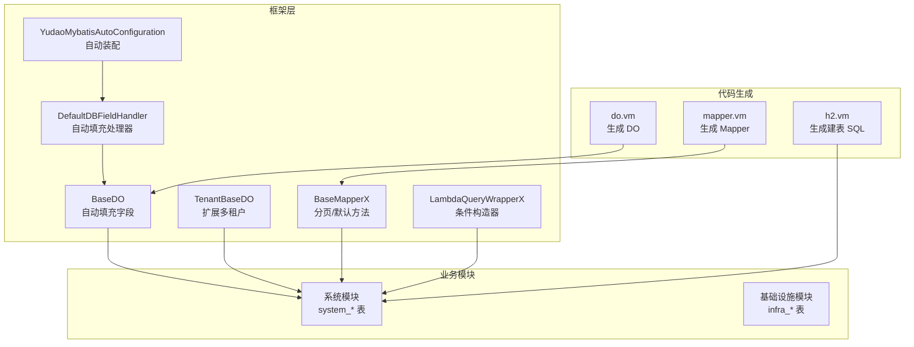
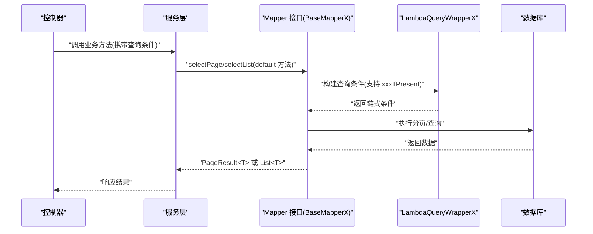
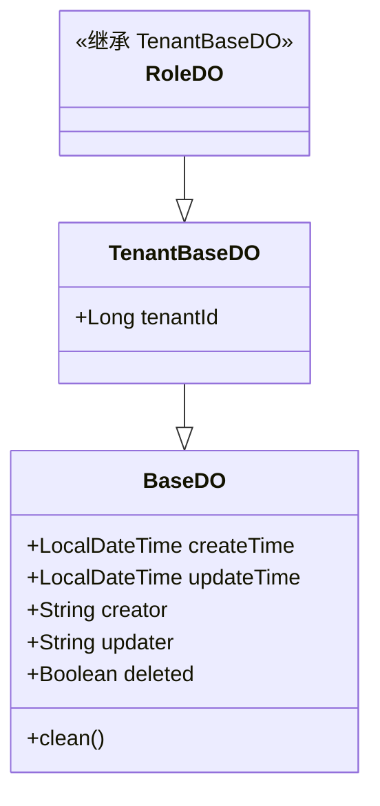
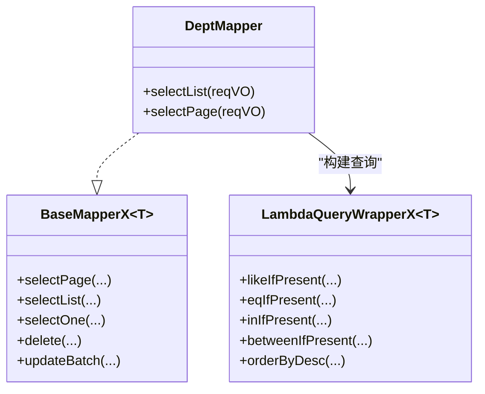
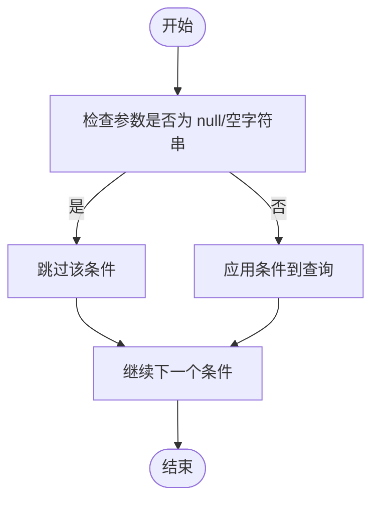
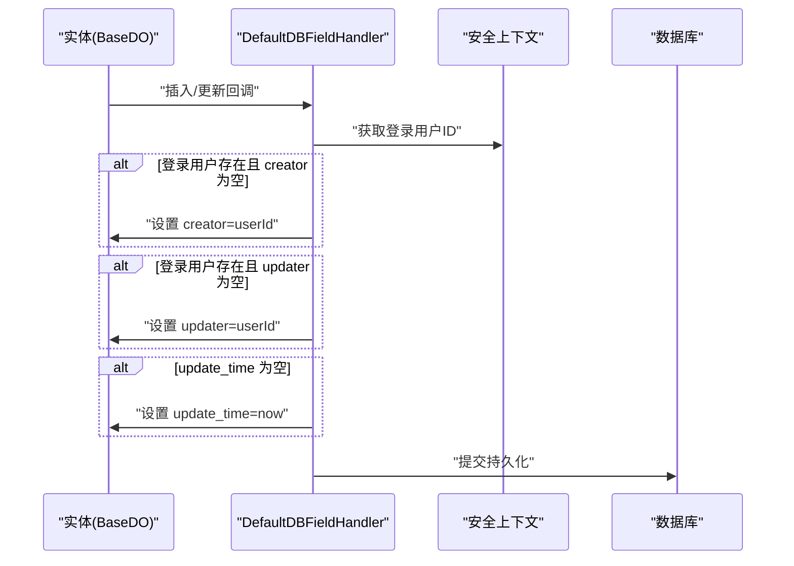
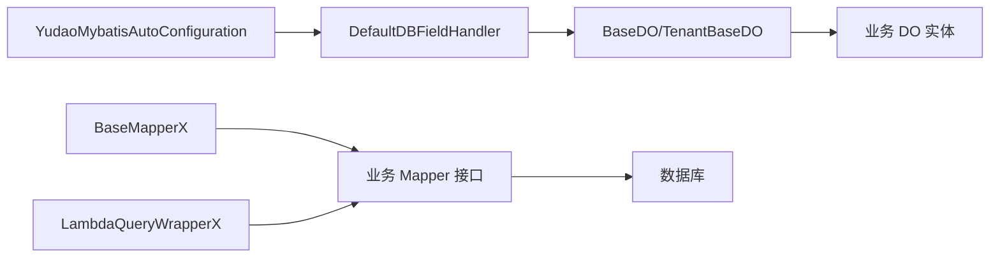

# 数据库与ORM规范

<cite>
**本文引用的文件**
- [BaseDO.java](file://yudao-framework/yudao-spring-boot-starter-mybatis/src/main/java/cn/iocoder/yudao/framework/mybatis/core/dataobject/BaseDO.java)
- [TenantBaseDO.java](file://yudao-framework/yudao-spring-boot-starter-biz-tenant/src/main/java/cn/iocoder/yudao/framework/tenant/core/db/TenantBaseDO.java)
- [BaseMapperX.java](file://yudao-framework/yudao-spring-boot-starter-mybatis/src/main/java/cn/iocoder/yudao/framework/mybatis/core/mapper/BaseMapperX.java)
- [LambdaQueryWrapperX.java](file://yudao-framework/yudao-spring-boot-starter-mybatis/src/main/java/cn/iocoder/yudao/framework/mybatis/core/query/LambdaQueryWrapperX.java)
- [DefaultDBFieldHandler.java](file://yudao-framework/yudao-spring-boot-starter-mybatis/src/main/java/cn/iocoder/yudao/framework/mybatis/core/handler/DefaultDBFieldHandler.java)
- [do.vm](file://yudao-module-infra/src/main/resources/codegen/java/dal/do.vm)
- [mapper.vm](file://yudao-module-infra/src/main/resources/codegen/java/dal/mapper.vm)
- [h2.vm](file://yudao-module-infra/src/main/resources/codegen/sql/h2.vm)
- [system_dept 表建表脚本](file://yudao-module-system/src/test/resources/sql/create_tables.sql)
- [system_users 表建表脚本](file://yudao-module-system/src/test/resources/sql/create_tables.sql)
- [RoleDO.java](file://yudao-module-system/src/main/java/cn/iocoder/yudao/module/system/dal/dataobject/permission/RoleDO.java)
- [DeptMapper.java](file://yudao-module-system/src/main/java/cn/iocoder/yudao/module/system/dal/mysql/dept/DeptMapper.java)
- [UserPostMapper.java](file://yudao-module-system/src/main/java/cn/iocoder/yudao/module/system/dal/mysql/dept/UserPostMapper.java)
- [YudaoMybatisAutoConfiguration.java](file://yudao-framework/yudao-spring-boot-starter-mybatis/src/main/java/cn/iocoder/yudao/framework/mybatis/config/YudaoMybatisAutoConfiguration.java)
- [DEVELOPMENT-GUIDE.md](file://DEVELOPMENT-GUIDE.md)
</cite>

## 目录
1. [引言](#引言)
2. [项目结构](#项目结构)
3. [核心组件](#核心组件)
4. [架构总览](#架构总览)
5. [详细组件分析](#详细组件分析)
6. [依赖关系分析](#依赖关系分析)
7. [性能考量](#性能考量)
8. [故障排查指南](#故障排查指南)
9. [结论](#结论)
10. [附录](#附录)

## 引言
本规范面向芋道 Ruoyi-Vue-Pro 的数据库与 ORM 设计，统一表命名、实体类设计、Mapper 接口实现与查询封装，确保跨模块一致性与可维护性。核心目标如下：
- 表命名采用 {module}_{domain} 的小写下划线格式，如 system_dept、system_user。
- 实体类统一继承 BaseDO 或 TenantBaseDO，自动填充 createTime、updateTime、creator、updater、deleted。
- Mapper 接口统一继承 BaseMapperX<T>，使用 default 方法与 LambdaQueryWrapperX 构建查询条件。
- LambdaQueryWrapperX 的 xxxIfPresent 方法自动忽略 null 与空字符串，简化查询构造。

## 项目结构
围绕数据库与 ORM 的关键目录与文件：
- 框架层（yudao-framework）提供 DO 基类、Mapper 扩展、查询封装与自动填充。
- 业务模块（yudao-module-system 等）遵循命名与实体/映射规范。
- 代码生成模板（yudao-module-infra/resources/codegen）输出 DO、Mapper、SQL 等文件。

图示来源
- [BaseDO.java:26-66](file://yudao-framework/yudao-spring-boot-starter-mybatis/src/main/java/cn/iocoder/yudao/framework/mybatis/core/dataobject/BaseDO.java#L26-L66)
- [TenantBaseDO.java:14-21](file://yudao-framework/yudao-spring-boot-starter-biz-tenant/src/main/java/cn/iocoder/yudao/framework/tenant/core/db/TenantBaseDO.java#L14-L21)
- [BaseMapperX.java:32-55](file://yudao-framework/yudao-spring-boot-starter-mybatis/src/main/java/cn/iocoder/yudao/framework/mybatis/core/mapper/BaseMapperX.java#L32-L55)
- [LambdaQueryWrapperX.java:19-142](file://yudao-framework/yudao-spring-boot-starter-mybatis/src/main/java/cn/iocoder/yudao/framework/mybatis/core/query/LambdaQueryWrapperX.java#L19-L142)
- [DefaultDBFieldHandler.java:36-63](file://yudao-framework/yudao-spring-boot-starter-mybatis/src/main/java/cn/iocoder/yudao/framework/mybatis/core/handler/DefaultDBFieldHandler.java#L36-L63)
- [YudaoMybatisAutoConfiguration.java:56-95](file://yudao-framework/yudao-spring-boot-starter-mybatis/src/main/java/cn/iocoder/yudao/framework/mybatis/config/YudaoMybatisAutoConfiguration.java#L56-L95)
- [do.vm:33-46](file://yudao-module-infra/src/main/resources/codegen/java/dal/do.vm#L33-L46)
- [mapper.vm:49-50](file://yudao-module-infra/src/main/resources/codegen/java/dal/mapper.vm#L49-L50)
- [h2.vm:1-37](file://yudao-module-infra/src/main/resources/codegen/sql/h2.vm#L1-L37)

章节来源
- [BaseDO.java:26-66](file://yudao-framework/yudao-spring-boot-starter-mybatis/src/main/java/cn/iocoder/yudao/framework/mybatis/core/dataobject/BaseDO.java#L26-L66)
- [BaseMapperX.java:32-55](file://yudao-framework/yudao-spring-boot-starter-mybatis/src/main/java/cn/iocoder/yudao/framework/mybatis/core/mapper/BaseMapperX.java#L32-L55)
- [LambdaQueryWrapperX.java:19-142](file://yudao-framework/yudao-spring-boot-starter-mybatis/src/main/java/cn/iocoder/yudao/framework/mybatis/core/query/LambdaQueryWrapperX.java#L19-L142)
- [do.vm:33-46](file://yudao-module-infra/src/main/resources/codegen/java/dal/do.vm#L33-L46)
- [mapper.vm:49-50](file://yudao-module-infra/src/main/resources/codegen/java/dal/mapper.vm#L49-L50)
- [h2.vm:1-37](file://yudao-module-infra/src/main/resources/codegen/sql/h2.vm#L1-L37)

## 核心组件
- 实体基类
  - BaseDO：统一声明 createTime、updateTime、creator、updater、deleted 字段，并提供 clean 清理方法，避免前端直接传入受保护字段。
  - TenantBaseDO：继承 BaseDO，扩展 tenantId 字段，支持多租户场景。
- Mapper 扩展
  - BaseMapperX<T>：在 MyBatis Plus 基础上提供分页、默认查询/计数/删除等便捷方法，统一返回 PageResult<T>。
- 查询封装
  - LambdaQueryWrapperX：在 LambdaQueryWrapper 基础上新增 xxxIfPresent 系列方法，自动忽略 null 与空字符串，简化条件拼装。
- 自动填充
  - DefaultDBFieldHandler：在插入/更新时自动填充 creator、updater、updateTime，结合安全上下文注入当前登录用户。

章节来源
- [BaseDO.java:26-66](file://yudao-framework/yudao-spring-boot-starter-mybatis/src/main/java/cn/iocoder/yudao/framework/mybatis/core/dataobject/BaseDO.java#L26-L66)
- [TenantBaseDO.java:14-21](file://yudao-framework/yudao-spring-boot-starter-biz-tenant/src/main/java/cn/iocoder/yudao/framework/tenant/core/db/TenantBaseDO.java#L14-L21)
- [BaseMapperX.java:32-55](file://yudao-framework/yudao-spring-boot-starter-mybatis/src/main/java/cn/iocoder/yudao/framework/mybatis/core/mapper/BaseMapperX.java#L32-L55)
- [LambdaQueryWrapperX.java:19-142](file://yudao-framework/yudao-spring-boot-starter-mybatis/src/main/java/cn/iocoder/yudao/framework/mybatis/core/query/LambdaQueryWrapperX.java#L19-L142)
- [DefaultDBFieldHandler.java:36-63](file://yudao-framework/yudao-spring-boot-starter-mybatis/src/main/java/cn/iocoder/yudao/framework/mybatis/core/handler/DefaultDBFieldHandler.java#L36-L63)

## 架构总览
ORM 层与业务层交互流程如下：

图示来源
- [BaseMapperX.java:34-55](file://yudao-framework/yudao-spring-boot-starter-mybatis/src/main/java/cn/iocoder/yudao/framework/mybatis/core/mapper/BaseMapperX.java#L34-L55)
- [LambdaQueryWrapperX.java:19-142](file://yudao-framework/yudao-spring-boot-starter-mybatis/src/main/java/cn/iocoder/yudao/framework/mybatis/core/query/LambdaQueryWrapperX.java#L19-L142)
- [DeptMapper.java:15-19](file://yudao-module-system/src/main/java/cn/iocoder/yudao/module/system/dal/mysql/dept/DeptMapper.java#L15-L19)

章节来源
- [BaseMapperX.java:34-55](file://yudao-framework/yudao-spring-boot-starter-mybatis/src/main/java/cn/iocoder/yudao/framework/mybatis/core/mapper/BaseMapperX.java#L34-L55)
- [LambdaQueryWrapperX.java:19-142](file://yudao-framework/yudao-spring-boot-starter-mybatis/src/main/java/cn/iocoder/yudao/framework/mybatis/core/query/LambdaQueryWrapperX.java#L19-L142)
- [DeptMapper.java:15-19](file://yudao-module-system/src/main/java/cn/iocoder/yudao/module/system/dal/mysql/dept/DeptMapper.java#L15-L19)

## 详细组件分析

### 表命名规范
- 统一采用 {module}_{domain} 的小写下划线命名，如 system_dept、system_user。
- 代码生成模板 h2.vm 中对表名与字段名均使用小写，确保跨数据库一致性。
- 示例：系统模块的部门表与用户表建表脚本均符合该规范。

章节来源
- [h2.vm:1-37](file://yudao-module-infra/src/main/resources/codegen/sql/h2.vm#L1-L37)
- [system_dept 表建表脚本:1-17](file://yudao-module-system/src/test/resources/sql/create_tables.sql#L1-L17)
- [system_users 表建表脚本:223-245](file://yudao-module-system/src/test/resources/sql/create_tables.sql#L223-L245)

### 实体类设计规范
- 必须继承 BaseDO 或 TenantBaseDO，确保自动填充字段可用。
- @TableName 指定小写表名，@KeySequence 用于 Oracle/PG/DM/H2 等数据库的序列主键。
- BaseDO.clean() 可清理受保护字段，防止前端误传导致脏数据。

图示来源
- [BaseDO.java:26-66](file://yudao-framework/yudao-spring-boot-starter-mybatis/src/main/java/cn/iocoder/yudao/framework/mybatis/core/dataobject/BaseDO.java#L26-L66)
- [TenantBaseDO.java:14-21](file://yudao-framework/yudao-spring-boot-starter-biz-tenant/src/main/java/cn/iocoder/yudao/framework/tenant/core/db/TenantBaseDO.java#L14-L21)
- [RoleDO.java:22-26](file://yudao-module-system/src/main/java/cn/iocoder/yudao/module/system/dal/dataobject/permission/RoleDO.java#L22-L26)

章节来源
- [do.vm:33-46](file://yudao-module-infra/src/main/resources/codegen/java/dal/do.vm#L33-L46)
- [BaseDO.java:26-66](file://yudao-framework/yudao-spring-boot-starter-mybatis/src/main/java/cn/iocoder/yudao/framework/mybatis/core/dataobject/BaseDO.java#L26-L66)
- [TenantBaseDO.java:14-21](file://yudao-framework/yudao-spring-boot-starter-biz-tenant/src/main/java/cn/iocoder/yudao/framework/tenant/core/db/TenantBaseDO.java#L14-L21)
- [RoleDO.java:22-26](file://yudao-module-system/src/main/java/cn/iocoder/yudao/module/system/dal/dataobject/permission/RoleDO.java#L22-L26)

### Mapper 接口实现规范
- 统一继承 BaseMapperX<T>，使用 default 方法进行分页与列表查询。
- 查询条件统一使用 LambdaQueryWrapperX，优先使用 xxxIfPresent 方法自动忽略 null/空字符串。
- 支持链式排序、分页、批量操作与条件删除。

图示来源
- [BaseMapperX.java:32-55](file://yudao-framework/yudao-spring-boot-starter-mybatis/src/main/java/cn/iocoder/yudao/framework/mybatis/core/mapper/BaseMapperX.java#L32-L55)
- [LambdaQueryWrapperX.java:19-142](file://yudao-framework/yudao-spring-boot-starter-mybatis/src/main/java/cn/iocoder/yudao/framework/mybatis/core/query/LambdaQueryWrapperX.java#L19-L142)
- [DeptMapper.java:13-37](file://yudao-module-system/src/main/java/cn/iocoder/yudao/module/system/dal/mysql/dept/DeptMapper.java#L13-L37)

章节来源
- [BaseMapperX.java:32-55](file://yudao-framework/yudao-spring-boot-starter-mybatis/src/main/java/cn/iocoder/yudao/framework/mybatis/core/mapper/BaseMapperX.java#L32-L55)
- [LambdaQueryWrapperX.java:19-142](file://yudao-framework/yudao-spring-boot-starter-mybatis/src/main/java/cn/iocoder/yudao/framework/mybatis/core/query/LambdaQueryWrapperX.java#L19-L142)
- [mapper.vm:49-50](file://yudao-module-infra/src/main/resources/codegen/java/dal/mapper.vm#L49-L50)
- [DeptMapper.java:15-19](file://yudao-module-system/src/main/java/cn/iocoder/yudao/module/system/dal/mysql/dept/DeptMapper.java#L15-L19)
- [UserPostMapper.java:19-23](file://yudao-module-system/src/main/java/cn/iocoder/yudao/module/system/dal/mysql/dept/UserPostMapper.java#L19-L23)

### 查询条件智能过滤（xxxIfPresent）
- likeIfPresent、eqIfPresent、inIfPresent、betweenIfPresent 等方法在参数为 null 或空字符串时自动跳过，无需手写判空。
- betweenIfPresent 支持单边区间补全，提升灵活性。

图示来源
- [LambdaQueryWrapperX.java:19-142](file://yudao-framework/yudao-spring-boot-starter-mybatis/src/main/java/cn/iocoder/yudao/framework/mybatis/core/query/LambdaQueryWrapperX.java#L19-L142)

章节来源
- [LambdaQueryWrapperX.java:19-142](file://yudao-framework/yudao-spring-boot-starter-mybatis/src/main/java/cn/iocoder/yudao/framework/mybatis/core/query/LambdaQueryWrapperX.java#L19-L142)
- [DEVELOPMENT-GUIDE.md:297-324](file://DEVELOPMENT-GUIDE.md#L297-L324)

### 自动填充与安全上下文
- DefaultDBFieldHandler 在插入/更新时自动填充 creator、updater、updateTime。
- 若当前登录用户存在且字段为空，则注入当前用户编号；若 update_time 为空则设为当前时间。

图示来源
- [DefaultDBFieldHandler.java:36-63](file://yudao-framework/yudao-spring-boot-starter-mybatis/src/main/java/cn/iocoder/yudao/framework/mybatis/core/handler/DefaultDBFieldHandler.java#L36-L63)
- [BaseDO.java:26-66](file://yudao-framework/yudao-spring-boot-starter-mybatis/src/main/java/cn/iocoder/yudao/framework/mybatis/core/dataobject/BaseDO.java#L26-L66)
- [YudaoMybatisAutoConfiguration.java:56-95](file://yudao-framework/yudao-spring-boot-starter-mybatis/src/main/java/cn/iocoder/yudao/framework/mybatis/config/YudaoMybatisAutoConfiguration.java#L56-L95)

章节来源
- [DefaultDBFieldHandler.java:36-63](file://yudao-framework/yudao-spring-boot-starter-mybatis/src/main/java/cn/iocoder/yudao/framework/mybatis/core/handler/DefaultDBFieldHandler.java#L36-L63)
- [YudaoMybatisAutoConfiguration.java:56-95](file://yudao-framework/yudao-spring-boot-starter-mybatis/src/main/java/cn/iocoder/yudao/framework/mybatis/config/YudaoMybatisAutoConfiguration.java#L56-L95)

## 依赖关系分析
- 实体类依赖 BaseDO/TenantBaseDO 提供的字段与清理能力。
- Mapper 依赖 BaseMapperX 提供的分页与默认查询方法。
- 查询条件依赖 LambdaQueryWrapperX 的智能过滤。
- 自动填充由 DefaultDBFieldHandler 与 MyBatis 元对象处理器协作完成。

图示来源
- [BaseDO.java:26-66](file://yudao-framework/yudao-spring-boot-starter-mybatis/src/main/java/cn/iocoder/yudao/framework/mybatis/core/dataobject/BaseDO.java#L26-L66)
- [TenantBaseDO.java:14-21](file://yudao-framework/yudao-spring-boot-starter-biz-tenant/src/main/java/cn/iocoder/yudao/framework/tenant/core/db/TenantBaseDO.java#L14-L21)
- [BaseMapperX.java:32-55](file://yudao-framework/yudao-spring-boot-starter-mybatis/src/main/java/cn/iocoder/yudao/framework/mybatis/core/mapper/BaseMapperX.java#L32-L55)
- [LambdaQueryWrapperX.java:19-142](file://yudao-framework/yudao-spring-boot-starter-mybatis/src/main/java/cn/iocoder/yudao/framework/mybatis/core/query/LambdaQueryWrapperX.java#L19-L142)
- [DefaultDBFieldHandler.java:36-63](file://yudao-framework/yudao-spring-boot-starter-mybatis/src/main/java/cn/iocoder/yudao/framework/mybatis/core/handler/DefaultDBFieldHandler.java#L36-L63)
- [YudaoMybatisAutoConfiguration.java:56-95](file://yudao-framework/yudao-spring-boot-starter-mybatis/src/main/java/cn/iocoder/yudao/framework/mybatis/config/YudaoMybatisAutoConfiguration.java#L56-L95)

章节来源
- [BaseDO.java:26-66](file://yudao-framework/yudao-spring-boot-starter-mybatis/src/main/java/cn/iocoder/yudao/framework/mybatis/core/dataobject/BaseDO.java#L26-L66)
- [BaseMapperX.java:32-55](file://yudao-framework/yudao-spring-boot-starter-mybatis/src/main/java/cn/iocoder/yudao/framework/mybatis/core/mapper/BaseMapperX.java#L32-L55)
- [LambdaQueryWrapperX.java:19-142](file://yudao-framework/yudao-spring-boot-starter-mybatis/src/main/java/cn/iocoder/yudao/framework/mybatis/core/query/LambdaQueryWrapperX.java#L19-L142)
- [DefaultDBFieldHandler.java:36-63](file://yudao-framework/yudao-spring-boot-starter-mybatis/src/main/java/cn/iocoder/yudao/framework/mybatis/core/handler/DefaultDBFieldHandler.java#L36-L63)
- [YudaoMybatisAutoConfiguration.java:56-95](file://yudao-framework/yudao-spring-boot-starter-mybatis/src/main/java/cn/iocoder/yudao/framework/mybatis/config/YudaoMybatisAutoConfiguration.java#L56-L95)

## 性能考量
- 分页查询：BaseMapperX.selectPage 支持排序字段与无分页直返全量，避免不必要的分页开销。
- 批量操作：insertBatch/updateBatch 提供批量插入/更新能力，默认按数据库类型选择最优策略。
- 条件构造：LambdaQueryWrapperX.xxxIfPresent 自动跳过空值，减少无效条件带来的索引失效风险。
- 自动填充：仅在必要时写入，避免重复更新 update_time 导致的索引抖动。

章节来源
- [BaseMapperX.java:34-55](file://yudao-framework/yudao-spring-boot-starter-mybatis/src/main/java/cn/iocoder/yudao/framework/mybatis/core/mapper/BaseMapperX.java#L34-L55)
- [LambdaQueryWrapperX.java:19-142](file://yudao-framework/yudao-spring-boot-starter-mybatis/src/main/java/cn/iocoder/yudao/framework/mybatis/core/query/LambdaQueryWrapperX.java#L19-L142)
- [DefaultDBFieldHandler.java:36-63](file://yudao-framework/yudao-spring-boot-starter-mybatis/src/main/java/cn/iocoder/yudao/framework/mybatis/core/handler/DefaultDBFieldHandler.java#L36-L63)

## 故障排查指南
- 查询条件未生效
  - 检查是否使用 xxxIfPresent 并传入 null/空字符串；这些值会被自动忽略。
  - 确认排序字段与查询字段正确映射。
- 自动填充异常
  - 确保 DefaultDBFieldHandler 已被 MyBatis 自动装配。
  - 检查安全上下文中是否存在登录用户，否则 creator/updater 不会注入。
- 主键生成问题
  - Oracle/PG/DM/H2 等数据库需使用 @KeySequence；MySQL 等可省略。
- 多租户数据隔离
  - 实体需继承 TenantBaseDO 并确保 tenantId 字段参与查询条件。

章节来源
- [LambdaQueryWrapperX.java:19-142](file://yudao-framework/yudao-spring-boot-starter-mybatis/src/main/java/cn/iocoder/yudao/framework/mybatis/core/query/LambdaQueryWrapperX.java#L19-L142)
- [DefaultDBFieldHandler.java:36-63](file://yudao-framework/yudao-spring-boot-starter-mybatis/src/main/java/cn/iocoder/yudao/framework/mybatis/core/handler/DefaultDBFieldHandler.java#L36-L63)
- [YudaoMybatisAutoConfiguration.java:56-95](file://yudao-framework/yudao-spring-boot-starter-mybatis/src/main/java/cn/iocoder/yudao/framework/mybatis/config/YudaoMybatisAutoConfiguration.java#L56-L95)
- [do.vm:33-46](file://yudao-module-infra/src/main/resources/codegen/java/dal/do.vm#L33-L46)
- [RoleDO.java:22-26](file://yudao-module-system/src/main/java/cn/iocoder/yudao/module/system/dal/dataobject/permission/RoleDO.java#L22-L26)

## 结论
通过统一表命名、实体基类与 Mapper 扩展、查询条件智能过滤与自动填充机制，Ruoyi-Vue-Pro 的数据库与 ORM 规范实现了高内聚、低耦合与强一致性的工程实践。遵循本规范可显著降低跨模块差异带来的维护成本，提升开发效率与系统稳定性。

## 附录
- 示例参考
  - DO 实体类：见 RoleDO 继承 TenantBaseDO 的示例。
  - Mapper 接口：见 DeptMapper、UserPostMapper 的 default 查询方法与 LambdaQueryWrapperX 使用。
  - 查询智能过滤：见 LambdaQueryWrapperX 的 xxxIfPresent 方法族。
  - 自动填充：见 DefaultDBFieldHandler 的插入/更新填充逻辑。

章节来源
- [RoleDO.java:22-26](file://yudao-module-system/src/main/java/cn/iocoder/yudao/module/system/dal/dataobject/permission/RoleDO.java#L22-L26)
- [DeptMapper.java:15-19](file://yudao-module-system/src/main/java/cn/iocoder/yudao/module/system/dal/mysql/dept/DeptMapper.java#L15-L19)
- [UserPostMapper.java:19-23](file://yudao-module-system/src/main/java/cn/iocoder/yudao/module/system/dal/mysql/dept/UserPostMapper.java#L19-L23)
- [LambdaQueryWrapperX.java:19-142](file://yudao-framework/yudao-spring-boot-starter-mybatis/src/main/java/cn/iocoder/yudao/framework/mybatis/core/query/LambdaQueryWrapperX.java#L19-L142)
- [DefaultDBFieldHandler.java:36-63](file://yudao-framework/yudao-spring-boot-starter-mybatis/src/main/java/cn/iocoder/yudao/framework/mybatis/core/handler/DefaultDBFieldHandler.java#L36-L63)