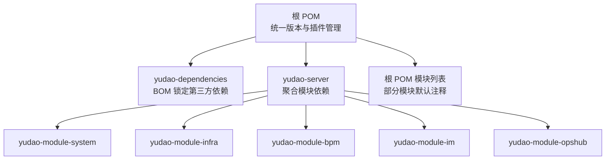
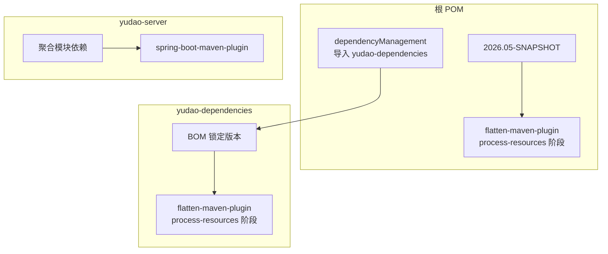
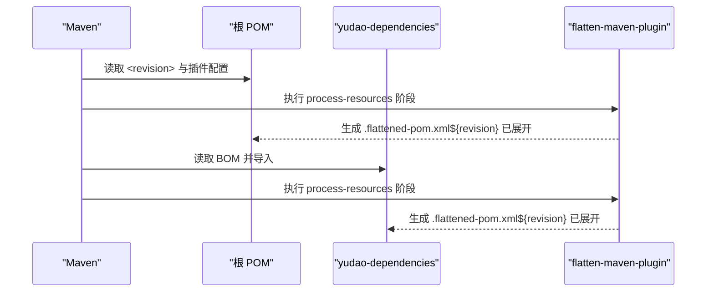
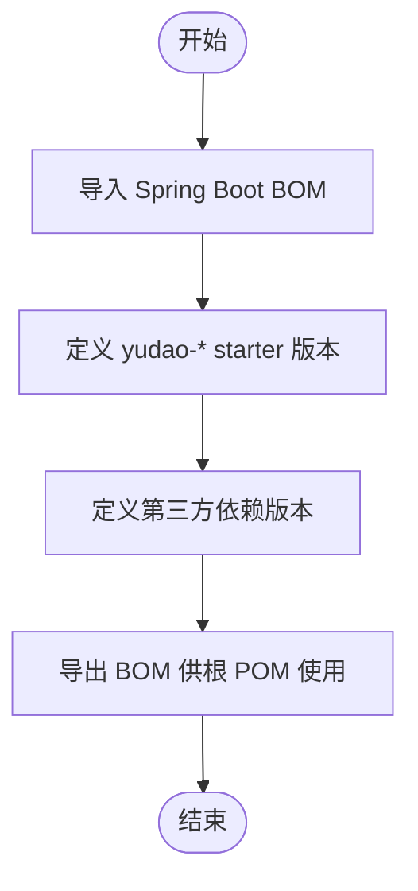
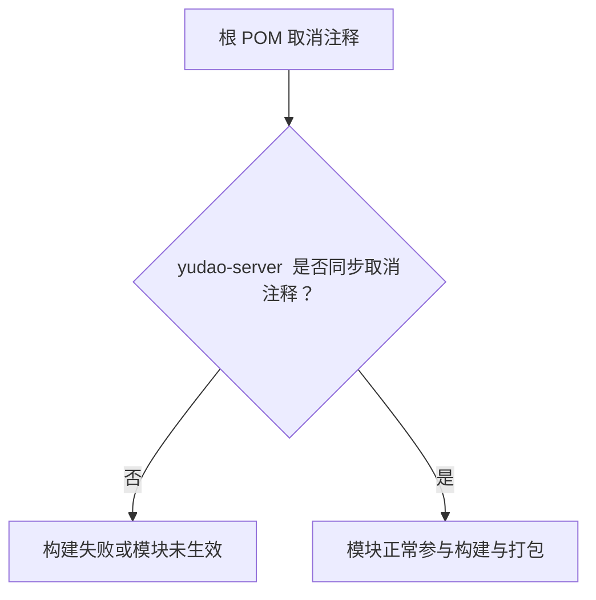
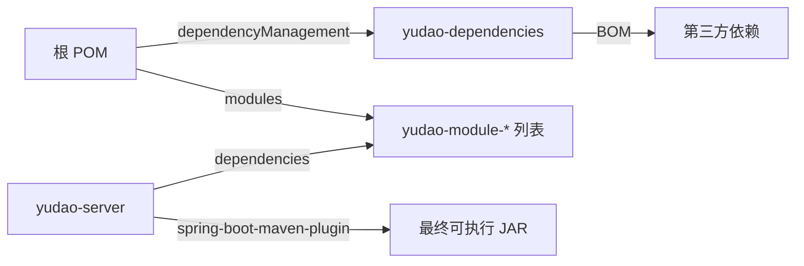

# 构建与版本管理

<cite>
**本文引用的文件**
- [根 POM（pom.xml）](file://pom.xml)
- [依赖版本锁定（yudao-dependencies/pom.xml）](file://yudao-dependencies/pom.xml)
- [后端服务聚合（yudao-server/pom.xml）](file://yudao-server/pom.xml)
- [构建命令与模块启用示例（AGENTS.md）](file://AGENTS.md)
- [开发指南与构建命令（DEVELOPMENT-GUIDE.md）](file://DEVELOPMENT-GUIDE.md)
- [启动与常见问题（STARTUP.md）](file://STARTUP.md)
</cite>

## 目录
1. [引言](#引言)
2. [项目结构](#项目结构)
3. [核心组件](#核心组件)
4. [架构总览](#架构总览)
5. [详细组件分析](#详细组件分析)
6. [依赖关系分析](#依赖关系分析)
7. [性能考虑](#性能考虑)
8. [故障排查指南](#故障排查指南)
9. [结论](#结论)
10. [附录](#附录)

## 引言
本文件面向 Ruoyi-Vue-Pro 后端工程，系统化阐述项目的构建与版本管理规范，重点覆盖以下主题：
- 项目版本通过根 POM 的 <revision> 属性统一管理
- flatten-maven-plugin 在 process-resources 阶段将 ${revision} 展开至 .flattened-pom.xml 的工作原理
- 第三方依赖版本集中由 yudao-dependencies/pom.xml 的 BOM 方式统一锁定
- 模块启用的“双配置规则”：根 POM 的 <modules> 中取消注释与 yudao-server/pom.xml 的 <dependencies> 中取消注释需同步
- 完整的后端构建命令示例：完整构建（跳过测试）、单模块构建、单个测试类运行等
- 模块启用的重要性与遗漏配置可能导致的 Maven 构建失败问题

## 项目结构
Ruoyi-Vue-Pro 采用多模块 Maven 结构，根 POM 负责统一版本与插件管理；yudao-dependencies 提供 BOM 锁定第三方依赖；yudao-server 聚合各 yudao-module-* 模块形成最终可运行的后端服务。

图表来源
- [根 POM（pom.xml）:10-33](file://pom.xml#L10-L33)
- [后端服务聚合（yudao-server/pom.xml）:23-165](file://yudao-server/pom.xml#L23-L165)

章节来源
- [根 POM（pom.xml）:10-33](file://pom.xml#L10-L33)
- [依赖版本锁定（yudao-dependencies/pom.xml）:16-86](file://yudao-dependencies/pom.xml#L16-L86)
- [后端服务聚合（yudao-server/pom.xml）:23-165](file://yudao-server/pom.xml#L23-L165)

## 核心组件
- 根 POM（cn.iocoder.boot:yudao）
  - 通过 <revision> 统一版本号，使用 flatten-maven-plugin 在 process-resources 阶段展开为 .flattened-pom.xml
  - 通过 dependencyManagement 导入 yudao-dependencies，实现对 yudao-* 子模块与第三方依赖的统一版本
- yudao-dependencies（cn.iocoder.boot:yudao-dependencies）
  - 以 BOM 形式集中管理 yudao-* starter 与第三方依赖版本，确保一致性
  - 同样配置 flatten-maven-plugin，在 process-resources 阶段生成 .flattened-pom.xml
- yudao-server（cn.iocoder.boot:yudao-server）
  - 作为后端聚合模块，按需引入 yudao-module-* 依赖，形成最终可打包的可执行 JAR
  - 通过注释/取消注释的方式控制模块启用，体现“双配置规则”

章节来源
- [根 POM（pom.xml）:39-65](file://pom.xml#L39-L65)
- [依赖版本锁定（yudao-dependencies/pom.xml）:16-86](file://yudao-dependencies/pom.xml#L16-L86)
- [后端服务聚合（yudao-server/pom.xml）:23-165](file://yudao-server/pom.xml#L23-L165)

## 架构总览
下图展示版本与构建插件在多模块中的流转关系，以及 flatten-maven-plugin 的执行时机。

图表来源
- [根 POM（pom.xml）:39-65](file://pom.xml#L39-L65)
- [根 POM（pom.xml）:122-149](file://pom.xml#L122-L149)
- [依赖版本锁定（yudao-dependencies/pom.xml）:728-757](file://yudao-dependencies/pom.xml#L728-L757)
- [后端服务聚合（yudao-server/pom.xml）:167-185](file://yudao-server/pom.xml#L167-L185)

## 详细组件分析

### 组件 A：版本统一与 flatten-maven-plugin 展开机制
- 根 POM 与 yudao-dependencies 均在 build/plugins 中配置 flatten-maven-plugin
- flattenMode 分别为 oss 与 bom，作用于根 POM 与 BOM
- 执行阶段均为 process-resources，目标是将 ${revision} 展开为 .flattened-pom.xml，便于发布与依赖解析
- 该机制确保所有模块（含 yudao-* starter 与第三方依赖）在构建过程中使用一致的版本号

图表来源
- [根 POM（pom.xml）:122-149](file://pom.xml#L122-L149)
- [依赖版本锁定（yudao-dependencies/pom.xml）:728-757](file://yudao-dependencies/pom.xml#L728-L757)

章节来源
- [根 POM（pom.xml）:39-65](file://pom.xml#L39-L65)
- [根 POM（pom.xml）:122-149](file://pom.xml#L122-L149)
- [依赖版本锁定（yudao-dependencies/pom.xml）:728-757](file://yudao-dependencies/pom.xml#L728-L757)

### 组件 B：第三方依赖版本集中管理（BOM）
- yudao-dependencies 以 BOM 形式集中管理 yudao-* starter 与第三方依赖版本
- 通过 dependencyManagement 导入 Spring Boot BOM 与其他关键组件 BOM，确保版本对齐
- 该机制避免“版本漂移”，减少因传递依赖导致的冲突

图表来源
- [依赖版本锁定（yudao-dependencies/pom.xml）:88-726](file://yudao-dependencies/pom.xml#L88-L726)

章节来源
- [依赖版本锁定（yudao-dependencies/pom.xml）:88-726](file://yudao-dependencies/pom.xml#L88-L726)

### 组件 C：模块启用的“双配置规则”
- 根 POM 的 <modules> 中取消注释某模块，表示在多模块构建时包含该模块
- yudao-server/pom.xml 的 <dependencies> 中取消注释对应模块依赖，表示在 yudao-server 聚合模块中启用该模块
- 两者必须保持同步：若仅取消注释 <modules> 而未在 yudao-server/pom.xml 添加依赖，会导致构建失败或模块未生效

图表来源
- [根 POM（pom.xml）:10-33](file://pom.xml#L10-L33)
- [后端服务聚合（yudao-server/pom.xml）:23-165](file://yudao-server/pom.xml#L23-L165)

章节来源
- [根 POM（pom.xml）:10-33](file://pom.xml#L10-L33)
- [后端服务聚合（yudao-server/pom.xml）:23-165](file://yudao-server/pom.xml#L23-L165)

### 组件 D：后端构建命令示例
以下命令来自项目文档，涵盖完整构建、单模块构建与单个测试类运行等常用场景。建议在项目根目录执行。

- 完整构建（跳过测试）
  - 示例：mvn clean install -DskipTests
- 单模块构建
  - 示例：mvn clean compile -pl yudao-module-system
- 单个测试类运行
  - 示例：mvn test -pl yudao-module-im -Dtest=ImWebSocketServiceImplTest
  - 示例：mvn test -pl yudao-module-im -Dtest=ImWebSocketServiceImplTest#testSendPrivateMessageAsync_exceptionSwallowed
- 修复性重试（跳过测试并强制重建某模块）
  - 示例：mvn install -DskipTests -rf :yudao-server

章节来源
- [构建命令与模块启用示例（AGENTS.md）:14-32](file://AGENTS.md#L14-L32)
- [开发指南与构建命令（DEVELOPMENT-GUIDE.md）:638-818](file://DEVELOPMENT-GUIDE.md#L638-L818)
- [启动与常见问题（STARTUP.md）:47-145](file://STARTUP.md#L47-L145)

## 依赖关系分析
- 根 POM 通过 dependencyManagement 导入 yudao-dependencies，形成“父-子 BOM”关系
- yudao-server 作为聚合模块，显式引入 yudao-module-* 依赖，决定最终打包内容
- flatten-maven-plugin 在 process-resources 阶段统一展开版本，确保发布与依赖解析的一致性

图表来源
- [根 POM（pom.xml）:55-65](file://pom.xml#L55-L65)
- [后端服务聚合（yudao-server/pom.xml）:23-165](file://yudao-server/pom.xml#L23-L165)

章节来源
- [根 POM（pom.xml）:55-65](file://pom.xml#L55-L65)
- [后端服务聚合（yudao-server/pom.xml）:23-165](file://yudao-server/pom.xml#L23-L165)

## 性能考虑
- 默认注释掉非必要模块依赖（如 yudao-module-member、yudao-module-report 等），有助于缩短编译时间
- 在本地开发时优先使用单模块构建与单个测试类运行，减少不必要的全量构建
- 使用 -DskipTests 跳过测试进行快速验证，但建议在 CI 或发布前补齐测试

## 故障排查指南
- 现象：mvn install 报找不到 yudao-module-xxx
  - 原因：根 POM 的 <modules> 未取消注释，或 yudao-server/pom.xml 的 <dependencies> 未同步取消注释
  - 处理：同时在根 POM 与 yudao-server/pom.xml 中取消注释对应模块条目
- 现象：构建失败或模块未生效
  - 原因：未遵循“双配置规则”，仅启用其一
  - 处理：确保根 POM 与 yudao-server/pom.xml 的模块启用状态一致
- 现象：版本不一致或依赖冲突
  - 原因：未通过 yudao-dependencies 的 BOM 管理版本
  - 处理：在子模块中仅声明依赖而不指定版本，由 BOM 统一锁定

章节来源
- [启动与常见问题（STARTUP.md）:145-145](file://STARTUP.md#L145-L145)
- [根 POM（pom.xml）:10-33](file://pom.xml#L10-L33)
- [后端服务聚合（yudao-server/pom.xml）:23-165](file://yudao-server/pom.xml#L23-L165)

## 结论
Ruoyi-Vue-Pro 的构建与版本管理以“根 POM + BOM + flatten 展开 + 双配置规则”为核心，既保证了版本一致性，又提供了灵活的模块启用能力。遵循本文规范可有效避免构建失败与版本冲突，提升团队协作效率与构建稳定性。

## 附录
- 常用构建命令参考
  - 完整构建（跳过测试）：mvn clean install -DskipTests
  - 单模块构建：mvn clean compile -pl yudao-module-system
  - 单个测试类运行：mvn test -pl yudao-module-im -Dtest=ImWebSocketServiceImplTest
  - 修复性重试：mvn install -DskipTests -rf :yudao-server

章节来源
- [构建命令与模块启用示例（AGENTS.md）:14-32](file://AGENTS.md#L14-L32)
- [开发指南与构建命令（DEVELOPMENT-GUIDE.md）:638-818](file://DEVELOPMENT-GUIDE.md#L638-L818)
- [启动与常见问题（STARTUP.md）:47-145](file://STARTUP.md#L47-L145)