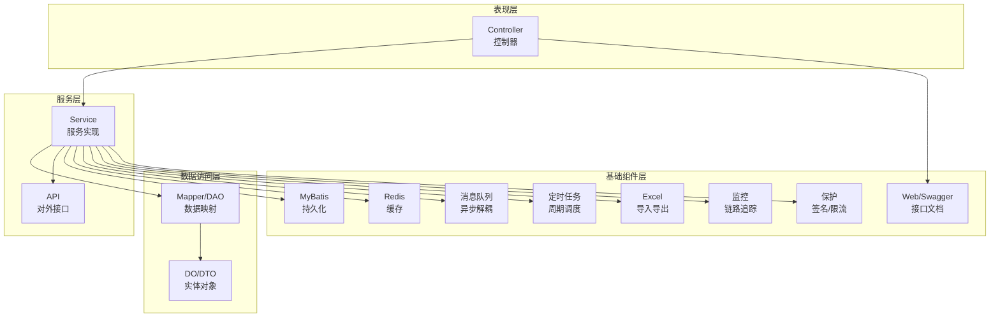
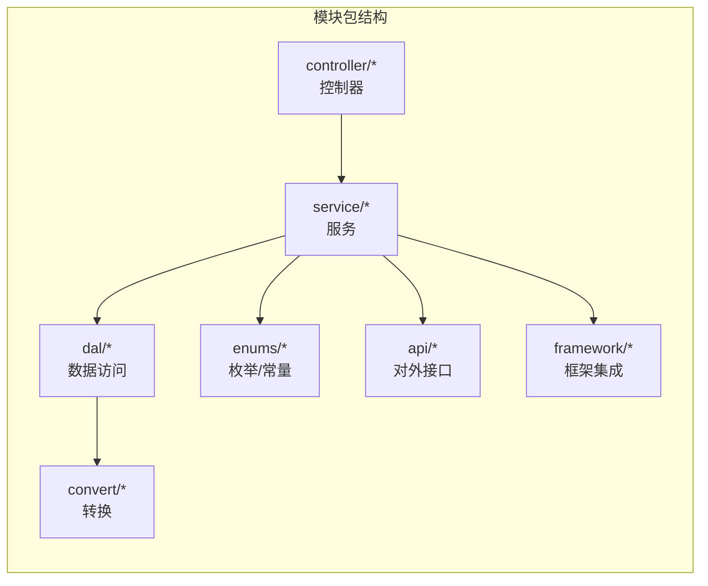
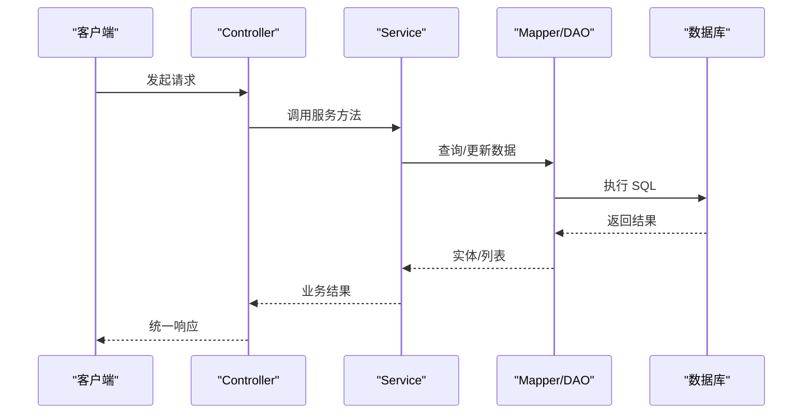
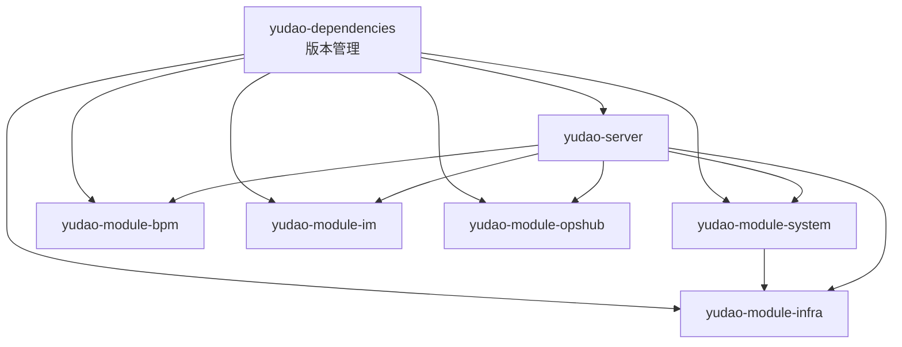

# 架构分层规范

<cite>
**本文引用的文件**
- [根聚合 POM](file://pom.xml)
- [yudao-dependencies 依赖管理 POM](file://yudao-dependencies/pom.xml)
- [yudao-framework 聚合 POM](file://yudao-framework/pom.xml)
- [yudao-server 服务聚合 POM](file://yudao-server/pom.xml)
- [yudao-module-system 模块 POM](file://yudao-module-system/pom.xml)
- [yudao-module-infra 模块 POM](file://yudao-module-infra/pom.xml)
- [yudao-framework/yudao-common 基础通用模块 POM](file://yudao-framework/yudao-common/pom.xml)
- [yudao-framework/yudao-spring-boot-starter-web Web 组件 POM](file://yudao-framework/yudao-spring-boot-starter-web/pom.xml)
- [yudao-framework/yudao-spring-boot-starter-mybatis MyBatis 组件 POM](file://yudao-framework/yudao-spring-boot-starter-mybatis/pom.xml)
- [yudao-framework/yudao-spring-boot-starter-mybatis BaseDO 实体基类](file://yudao-framework/yudao-spring-boot-starter-mybatis/src/main/java/cn/iocoder/yudao/framework/mybatis/core/dataobject/BaseDO.java)
- [yudao-framework/yudao-spring-boot-starter-mybatis BaseMapperX 数据访问基类](file://yudao-framework/yudao-spring-boot-starter-mybatis/src/main/java/cn/iocoder/yudao/framework/mybatis/core/mapper/BaseMapperX.java)
- [yudao-framework/yudao-common CommonResult 统一响应](file://yudao-framework/yudao-common/src/main/java/cn/iocoder/yudao/framework/common/pojo/CommonResult.java)
- [yudao-framework/yudao-common PageParam 分页参数](file://yudao-framework/yudao-common/src/main/java/cn/iocoder/yudao/framework/common/pojo/PageParam.java)
- [yudao-framework/yudao-common PageResult 分页结果](file://yudao-framework/yudao-common/src/main/java/cn/iocoder/yudao/framework/common/pojo/PageResult.java)
- [yudao-framework/yudao-common ErrorCode 错误码常量](file://yudao-framework/yudao-common/src/main/java/cn/iocoder/yudao/framework/common/enums/ErrorCodeConstants.java)
- [yudao-module-system 控制器示例](file://yudao-module-system/src/main/java/cn/iocoder/yudao/module/system/controller/admin/user/UserController.java)
- [yudao-module-system 服务示例](file://yudao-module-system/src/main/java/cn/iocoder/yudao/module/system/service/user/UserServiceImpl.java)
- [yudao-module-system DAL 示例](file://yudao-module-system/src/main/java/cn/iocoder/yudao/module/system/dal/mysql/user/UserMapper.java)
- [yudao-module-system Convert 示例](file://yudao-module-system/src/main/java/cn/iocoder/yudao/module/system/convert/user/UserConvert.java)
- [yudao-module-system 枚举示例](file://yudao-module-system/src/main/java/cn/iocoder/yudao/module/system/enums/user/UserStatusEnum.java)
- [yudao-module-system API 示例](file://yudao-module-system/src/main/java/cn/iocoder/yudao/module/system/api/user/AdminUserApi.java)
- [yudao-module-system 框架示例](file://yudao-module-system/src/main/java/cn/iocoder/yudao/module/system/framework/security/config/SystemSecurityConfig.java)
</cite>

## 目录
1. [引言](#引言)
2. [项目结构](#项目结构)
3. [核心组件](#核心组件)
4. [架构总览](#架构总览)
5. [详细组件分析](#详细组件分析)
6. [依赖分析](#依赖分析)
7. [性能考虑](#性能考虑)
8. [故障排查指南](#故障排查指南)
9. [结论](#结论)

## 引言
本规范旨在建立并固化芋道 Ruoyi-Vue-Pro 的分层架构标准，确保团队协作一致性、可维护性与扩展性。内容覆盖 Maven 多模块架构、yudao-dependencies 依赖管理、yudao-framework 技术组件层、yudao-module 业务模块层的层次结构；明确业务模块内部统一包结构与调用关系；制定模块间依赖方向规范；并总结核心基类与约定（如 BaseDO、BaseMapperX、CommonResult、PageParam/PageResult、ErrorCode 等）。

## 项目结构
项目采用 Maven 聚合工程组织，顶层 POM 声明模块集合，yudao-dependencies 提供统一依赖版本管理，yudao-framework 聚合技术组件，yudao-server 作为后端服务聚合入口，yudao-module-* 为各业务域模块。

```mermaid
graph TB
Root["根聚合 POM<br/>声明模块与依赖管理"] --> Deps["yudao-dependencies<br/>统一依赖版本"]
Root --> FW["yudao-framework<br/>技术组件聚合"]
Root --> Server["yudao-server<br/>服务聚合入口"]
Root --> MSystem["yudao-module-system<br/>系统域"]
Root --> MInfra["yudao-module-infra<br/>基础设施域"]
Root --> MBpm["yudao-module-bpm<br/>流程域"]
Root --> MIm["yudao-module-im<br/>即时通讯域"]
Root --> MOps["yudao-module-opshub<br/>运营域"]
FW --> FWCommon["yudao-common<br/>基础通用"]
FW --> FWMyBatis["yudao-spring-boot-starter-mybatis"]
FW --> FWRedis["yudao-spring-boot-starter-redis"]
FW --> FWWeb["yudao-spring-boot-starter-web"]
FW --> FWSecurity["yudao-spring-boot-starter-security"]
FW --> FWMQ["yudao-spring-boot-starter-mq"]
FW --> FWJob["yudao-spring-boot-starter-job"]
FW --> FWExcel["yudao-spring-boot-starter-excel"]
FW --> FWTest["yudao-spring-boot-starter-test"]
FW --> FWBizTenant["yudao-spring-boot-starter-biz-tenant"]
FW --> FWBizDP["yudao-spring-boot-starter-biz-data-permission"]
FW --> FWBizIP["yudao-spring-boot-starter-biz-ip"]
```

图表来源
- [根聚合 POM:10-33](file://pom.xml#L10-L33)
- [yudao-dependencies 依赖管理 POM:88-120](file://yudao-dependencies/pom.xml#L88-L120)
- [yudao-framework 聚合 POM:12-31](file://yudao-framework/pom.xml#L12-L31)
- [yudao-server 服务聚合 POM:23-144](file://yudao-server/pom.xml#L23-L144)

章节来源
- [根聚合 POM:10-33](file://pom.xml#L10-L33)
- [yudao-dependencies 依赖管理 POM:88-120](file://yudao-dependencies/pom.xml#L88-L120)
- [yudao-framework 聚合 POM:12-31](file://yudao-framework/pom.xml#L12-L31)
- [yudao-server 服务聚合 POM:23-144](file://yudao-server/pom.xml#L23-L144)

## 核心组件
- yudao-dependencies：集中管理所有第三方依赖版本，避免版本漂移，统一由 yudao-dependencies 导入。
- yudao-framework：技术组件层，按“框架组件”和“业务组件”两类划分，提供 MyBatis、Redis、Web、安全、消息队列、定时任务、Excel、监控、保护等能力。
- yudao-module-*：业务模块层，按领域拆分，每个模块内部遵循统一包结构与调用链。
- yudao-server：服务聚合入口，按需引入各业务模块，打包为可执行服务。

章节来源
- [yudao-dependencies 依赖管理 POM:88-120](file://yudao-dependencies/pom.xml#L88-L120)
- [yudao-framework 聚合 POM:33-43](file://yudao-framework/pom.xml#L33-L43)
- [yudao-server 服务聚合 POM:16-21](file://yudao-server/pom.xml#L16-L21)

## 架构总览
整体采用“依赖倒置”的分层思想：
- 表现层（Controller）只依赖服务接口（Service），不直接依赖数据访问层（DAL）
- 服务层（Service）只依赖数据访问接口（Mapper/DAO），不直接依赖数据库
- 数据访问层（DAL）只依赖基础组件（MyBatis、Redis 等），不依赖上层
- 基础组件（Framework）向上提供能力，向下不依赖业务

图表来源
- [yudao-module-system 控制器示例](file://yudao-module-system/src/main/java/cn/iocoder/yudao/module/system/controller/admin/user/UserController.java)
- [yudao-module-system 服务示例](file://yudao-module-system/src/main/java/cn/iocoder/yudao/module/system/service/user/UserServiceImpl.java)
- [yudao-module-system DAL 示例](file://yudao-module-system/src/main/java/cn/iocoder/yudao/module/system/dal/mysql/user/UserMapper.java)
- [yudao-framework/yudao-spring-boot-starter-web Web 组件 POM:18-48](file://yudao-framework/yudao-spring-boot-starter-web/pom.xml#L18-L48)
- [yudao-framework/yudao-spring-boot-starter-mybatis MyBatis 组件 POM](file://yudao-framework/yudao-spring-boot-starter-mybatis/pom.xml)

## 详细组件分析

### 业务模块内部统一包结构
以 yudao-module-system 为例，模块内统一采用以下包结构：
- controller/admin：管理端控制器
- controller/app：应用端控制器
- service：服务接口与实现
- dal/dataobject：实体对象
- dal/mysql：MyBatis 映射
- dal/redis：Redis 访问（如存在）
- convert：对象转换（MapStruct）
- enums：枚举与错误码常量
- api：对外接口（如存在）
- framework：框架集成（如安全、验证码、短信等）

图表来源
- [yudao-module-system 控制器示例](file://yudao-module-system/src/main/java/cn/iocoder/yudao/module/system/controller/admin/user/UserController.java)
- [yudao-module-system 服务示例](file://yudao-module-system/src/main/java/cn/iocoder/yudao/module/system/service/user/UserServiceImpl.java)
- [yudao-module-system DAL 示例](file://yudao-module-system/src/main/java/cn/iocoder/yudao/module/system/dal/mysql/user/UserMapper.java)
- [yudao-module-system Convert 示例](file://yudao-module-system/src/main/java/cn/iocoder/yudao/module/system/convert/user/UserConvert.java)
- [yudao-module-system 枚举示例](file://yudao-module-system/src/main/java/cn/iocoder/yudao/module/system/enums/user/UserStatusEnum.java)
- [yudao-module-system API 示例](file://yudao-module-system/src/main/java/cn/iocoder/yudao/module/system/api/user/AdminUserApi.java)
- [yudao-module-system 框架示例](file://yudao-module-system/src/main/java/cn/iocoder/yudao/module/system/framework/security/config/SystemSecurityConfig.java)

章节来源
- [yudao-module-system 控制器示例](file://yudao-module-system/src/main/java/cn/iocoder/yudao/module/system/controller/admin/user/UserController.java)
- [yudao-module-system 服务示例](file://yudao-module-system/src/main/java/cn/iocoder/yudao/module/system/service/user/UserServiceImpl.java)
- [yudao-module-system DAL 示例](file://yudao-module-system/src/main/java/cn/iocoder/yudao/module/system/dal/mysql/user/UserMapper.java)
- [yudao-module-system Convert 示例](file://yudao-module-system/src/main/java/cn/iocoder/yudao/module/system/convert/user/UserConvert.java)
- [yudao-module-system 枚举示例](file://yudao-module-system/src/main/java/cn/iocoder/yudao/module/system/enums/user/UserStatusEnum.java)
- [yudao-module-system API 示例](file://yudao-module-system/src/main/java/cn/iocoder/yudao/module/system/api/user/AdminUserApi.java)
- [yudao-module-system 框架示例](file://yudao-module-system/src/main/java/cn/iocoder/yudao/module/system/framework/security/config/SystemSecurityConfig.java)

### 核心基类与约定

#### BaseDO 实体基类
- 作用：统一实体字段（如主键、创建时间、更新时间、删除标记等），减少重复代码
- 使用建议：所有实体继承该基类，保持字段命名与类型一致

章节来源
- [yudao-framework/yudao-spring-boot-starter-mybatis BaseDO 实体基类](file://yudao-framework/yudao-spring-boot-starter-mybatis/src/main/java/cn/iocoder/yudao/framework/mybatis/core/dataobject/BaseDO.java)

#### BaseMapperX 数据访问基类
- 作用：提供通用 CRUD 能力，简化 Mapper 开发
- 使用建议：Mapper 继承该基类，复用分页、条件构造等能力

章节来源
- [yudao-framework/yudao-spring-boot-starter-mybatis BaseMapperX 数据访问基类](file://yudao-framework/yudao-spring-boot-starter-mybatis/src/main/java/cn/iocoder/yudao/framework/mybatis/core/mapper/BaseMapperX.java)

#### CommonResult 统一响应格式
- 作用：统一接口返回结构（状态码、消息、数据）
- 使用建议：所有 Controller 返回值使用该包装类

章节来源
- [yudao-framework/yudao-common CommonResult 统一响应](file://yudao-framework/yudao-common/src/main/java/cn/iocoder/yudao/framework/common/pojo/CommonResult.java)

#### PageParam/PageResult 分页规范
- 作用：统一分页请求参数与响应结构
- 使用建议：列表查询统一使用 PageParam，服务层返回 PageResult

章节来源
- [yudao-framework/yudao-common PageParam 分页参数](file://yudao-framework/yudao-common/src/main/java/cn/iocoder/yudao/framework/common/pojo/PageParam.java)
- [yudao-framework/yudao-common PageResult 分页结果](file://yudao-framework/yudao-common/src/main/java/cn/iocoder/yudao/framework/common/pojo/PageResult.java)

#### ErrorCode 错误码体系
- 作用：统一错误码常量，便于前端与日志定位问题
- 使用建议：业务异常抛出时使用对应错误码常量

章节来源
- [yudao-framework/yudao-common ErrorCode 错误码常量](file://yudao-framework/yudao-common/src/main/java/cn/iocoder/yudao/framework/common/enums/ErrorCodeConstants.java)

### 调用关系与依赖方向规范
- 严格禁止反向依赖：Controller → Service → Mapper/DAO
- 模块间依赖方向：低层模块（infra、common）向高层模块（system、bpm、im 等）暴露能力，不允许高层模块反向依赖低层模块
- 依赖注入：通过接口编程，避免硬编码具体实现

图表来源
- [yudao-module-system 控制器示例](file://yudao-module-system/src/main/java/cn/iocoder/yudao/module/system/controller/admin/user/UserController.java)
- [yudao-module-system 服务示例](file://yudao-module-system/src/main/java/cn/iocoder/yudao/module/system/service/user/UserServiceImpl.java)
- [yudao-module-system DAL 示例](file://yudao-module-system/src/main/java/cn/iocoder/yudao/module/system/dal/mysql/user/UserMapper.java)

章节来源
- [yudao-module-system 控制器示例](file://yudao-module-system/src/main/java/cn/iocoder/yudao/module/system/controller/admin/user/UserController.java)
- [yudao-module-system 服务示例](file://yudao-module-system/src/main/java/cn/iocoder/yudao/module/system/service/user/UserServiceImpl.java)
- [yudao-module-system DAL 示例](file://yudao-module-system/src/main/java/cn/iocoder/yudao/module/system/dal/mysql/user/UserMapper.java)

## 依赖分析
- 依赖管理：yudao-dependencies 通过 dependencyManagement 统一版本，yudao-server 与各模块通过 artifactId 引入对应 starter 或组件
- 模块依赖：yudao-module-system 依赖 yudao-module-infra 以复用基础设施能力；yudao-server 动态引入各业务模块

图表来源
- [yudao-dependencies 依赖管理 POM:88-120](file://yudao-dependencies/pom.xml#L88-L120)
- [yudao-server 服务聚合 POM:23-144](file://yudao-server/pom.xml#L23-L144)
- [yudao-module-system 模块 POM:20-80](file://yudao-module-system/pom.xml#L20-L80)
- [yudao-module-infra 模块 POM:21-118](file://yudao-module-infra/pom.xml#L21-L118)

章节来源
- [yudao-dependencies 依赖管理 POM:88-120](file://yudao-dependencies/pom.xml#L88-L120)
- [yudao-server 服务聚合 POM:23-144](file://yudao-server/pom.xml#L23-L144)
- [yudao-module-system 模块 POM:20-80](file://yudao-module-system/pom.xml#L20-L80)
- [yudao-module-infra 模块 POM:21-118](file://yudao-module-infra/pom.xml#L21-L118)

## 性能考虑
- 分页查询：优先使用 PageParam/PageResult，避免一次性加载大结果集
- 缓存策略：合理使用 Redis 缓存热点数据，降低数据库压力
- 并发控制：对高并发接口启用限流与降级策略
- 数据库优化：使用索引、分表分库、读写分离等手段提升吞吐
- 序列化：统一响应格式，避免冗余字段，减少网络传输

## 故障排查指南
- 统一响应：通过 CommonResult 的状态码与消息快速定位问题
- 分页异常：检查 PageParam 参数是否正确，服务层是否返回 PageResult
- 错误码：根据 ErrorCode 常量快速定位业务异常类型
- 日志：结合监控与链路追踪，定位调用链路中的异常节点

章节来源
- [yudao-framework/yudao-common CommonResult 统一响应](file://yudao-framework/yudao-common/src/main/java/cn/iocoder/yudao/framework/common/pojo/CommonResult.java)
- [yudao-framework/yudao-common PageParam 分页参数](file://yudao-framework/yudao-common/src/main/java/cn/iocoder/yudao/framework/common/pojo/PageParam.java)
- [yudao-framework/yudao-common PageResult 分页结果](file://yudao-framework/yudao-common/src/main/java/cn/iocoder/yudao/framework/common/pojo/PageResult.java)
- [yudao-framework/yudao-common ErrorCode 错误码常量](file://yudao-framework/yudao-common/src/main/java/cn/iocoder/yudao/framework/common/enums/ErrorCodeConstants.java)

## 结论
通过 yudao-dependencies 的统一依赖管理、yudao-framework 的技术组件封装、以及 yudao-module-* 的领域化拆分，项目实现了清晰的分层与稳定的扩展边界。配合统一包结构、严格的调用方向与核心基类约定，能够有效提升开发效率、降低维护成本，并为后续演进奠定坚实基础。