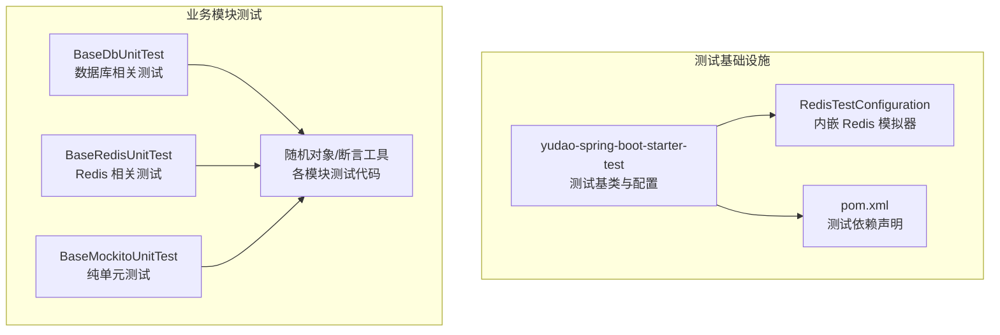
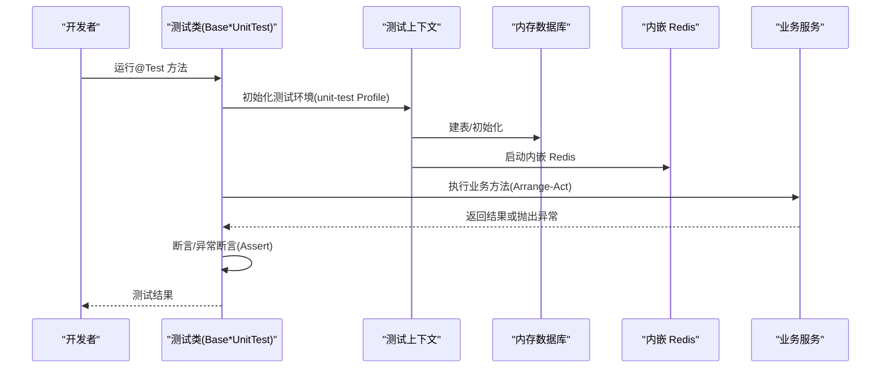
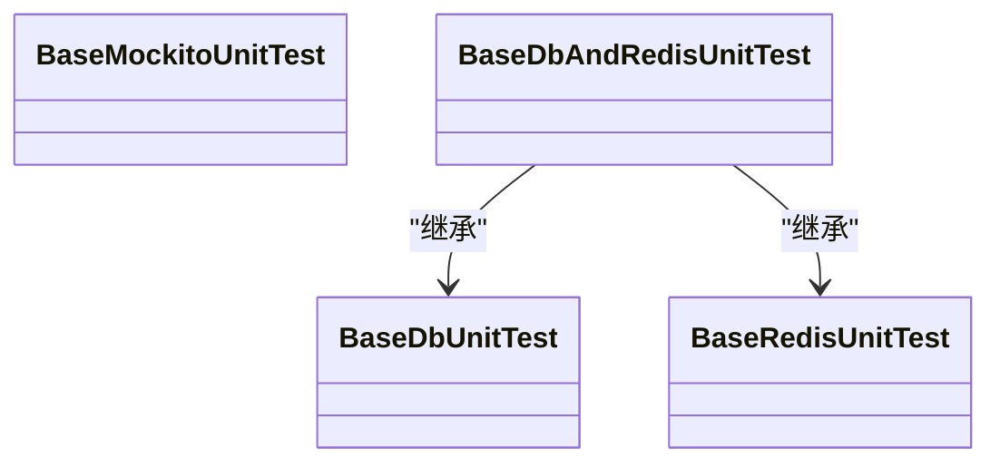
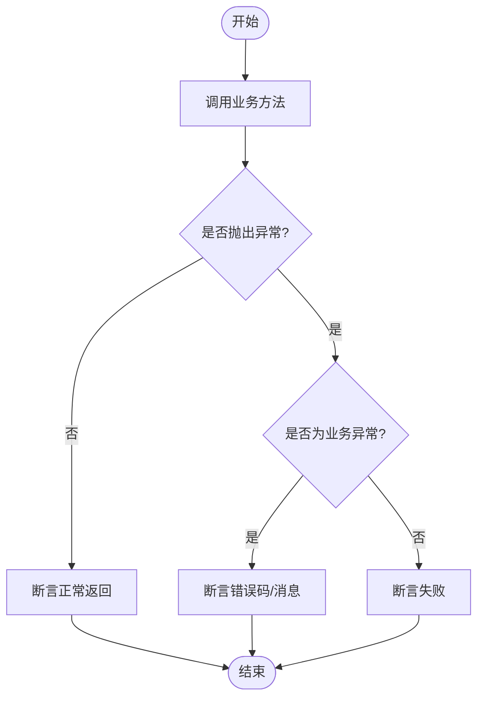
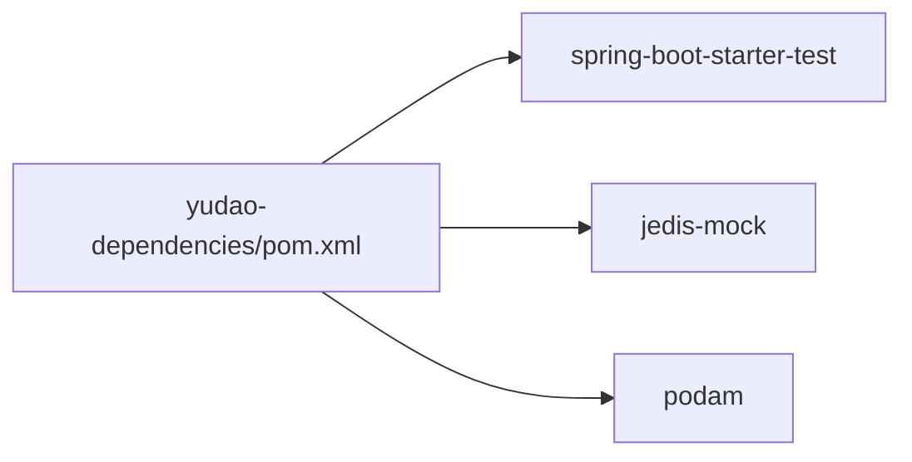

# 测试规范

<cite>
**本文引用的文件**
- [RedisTestConfiguration.java](file://yudao-framework/yudao-spring-boot-starter-test/src/main/java/cn/iocoder/yudao/framework/test/config/RedisTestConfiguration.java)
- [pom.xml](file://yudao-dependencies/pom.xml)
- [AGENTS.md](file://AGENTS.md)
- [ServiceExceptionUtil.java](file://yudao-framework/yudao-common/src/main/java/cn/iocoder/yudao/framework/common/exception/util/ServiceExceptionUtil.java)
- [DictDataServiceImplTest.java](file://yudao-module-system/src/test/java/cn/iocoder/yudao/module/system/service/dict/DictDataServiceImplTest.java)
- [test/serviceTest.vm](file://yudao-module-infra/src/main/resources/codegen/java/test/serviceTest.vm)
- [MyBatisUtilsTest.java](file://yudao-framework/yudao-spring-boot-starter-mybatis/src/test/java/cn/iocoder/yudao/framework/mybatis/core/util/MyBatisUtilsTest.java)
- [ValidationUtils.java](file://yudao-framework/yudao-common/src/main/java/cn/iocoder/yudao/framework/common/util/validation/ValidationUtils.java)
</cite>

## 目录
1. [简介](#简介)
2. [项目结构](#项目结构)
3. [核心组件](#核心组件)
4. [架构总览](#架构总览)
5. [详细组件分析](#详细组件分析)
6. [依赖分析](#依赖分析)
7. [性能考虑](#性能考虑)
8. [故障排查指南](#故障排查指南)
9. [结论](#结论)
10. [附录](#附录)

## 简介
本规范面向芋道 Ruoyi-Vue-Pro 的测试实践，系统性阐述测试基类的选择与使用策略，覆盖纯单元测试、数据库相关测试与 Redis 相关测试三类场景；同时给出 AAA 模式（准备-执行-断言）的完整测试用例编写范式、异常断言的最佳实践（使用断言工具验证业务异常）、测试数据准备方法（随机对象生成、lambda 回调设置特定字段、通用状态枚举等），并提供 Maven 测试运行命令与配置建议，帮助开发者高效、稳定地编写与执行测试。

## 项目结构
- 测试基类集中于 yudao-spring-boot-starter-test 模块，提供三类测试基类以适配不同测试场景：
  - BaseMockitoUnitTest：纯 Mockito 单元测试，不启动 Spring 容器，适合快速验证业务逻辑与边界条件
  - BaseDbUnitTest：依赖数据库的测试，使用内存数据库与自动建表/清理机制
  - BaseRedisUnitTest：依赖 Redis 的测试，使用内嵌 Redis 模拟器
- 各模块在 src/test/java 下按包结构组织测试代码，测试配置通过 unit-test Profile 与 application-unit-test 配置文件加载
- 测试模板与工具方法广泛存在于各模块中，如随机对象生成、断言工具、异常工具等

图表来源
- [RedisTestConfiguration.java:1-35](file://yudao-framework/yudao-spring-boot-starter-test/src/main/java/cn/iocoder/yudao/framework/test/config/RedisTestConfiguration.java#L1-L35)
- [pom.xml:407-433](file://yudao-dependencies/pom.xml#L407-L433)

章节来源
- [AGENTS.md:122-138](file://AGENTS.md#L122-L138)

## 核心组件
- 测试基类选择与适用场景
  - BaseMockitoUnitTest：无容器、无外部依赖，适合纯逻辑单元测试，速度最快
  - BaseDbUnitTest：需要数据库交互（如 Mapper/Service 层），使用内存数据库与自动清理
  - BaseRedisUnitTest：需要 Redis 交互，使用内嵌 Redis 模拟器，避免真实 Redis 依赖
- 测试配置与环境
  - 测试 Profile：unit-test
  - 配置文件：application-unit-test
  - 依赖：spring-boot-starter-test、jedis-mock、podam（随机对象）

章节来源
- [AGENTS.md:126-132](file://AGENTS.md#L126-L132)
- [RedisTestConfiguration.java:22-33](file://yudao-framework/yudao-spring-boot-starter-test/src/main/java/cn/iocoder/yudao/framework/test/config/RedisTestConfiguration.java#L22-L33)
- [pom.xml:407-433](file://yudao-dependencies/pom.xml#L407-L433)

## 架构总览
下图展示了测试运行的整体流程：测试基类负责装配测试环境（容器、数据库、Redis），业务测试类编写 AAA 模式用例，断言工具与异常工具用于结果验证。

图表来源
- [RedisTestConfiguration.java:22-33](file://yudao-framework/yudao-spring-boot-starter-test/src/main/java/cn/iocoder/yudao/framework/test/config/RedisTestConfiguration.java#L22-L33)
- [pom.xml:407-433](file://yudao-dependencies/pom.xml#L407-L433)

## 详细组件分析

### 测试基类与使用场景
- BaseMockitoUnitTest：适用于纯逻辑单元测试，无需数据库与 Redis，启动快、隔离性强
- BaseDbUnitTest：适用于需要数据库交互的场景，自动建表与清理，确保测试隔离
- BaseRedisUnitTest：适用于需要 Redis 交互的场景，使用内嵌 Redis 模拟器，避免真实环境依赖

图表来源
- [AGENTS.md:126-132](file://AGENTS.md#L126-L132)

章节来源
- [AGENTS.md:126-132](file://AGENTS.md#L126-L132)

### AAA 模式与完整用例示例
- AAA 模式
  - Arrange：准备测试数据与上下文（随机对象、预置数据、桩/替身）
  - Act：调用被测方法（可含断言/异常断言）
  - Assert：断言返回值、副作用、异常等
- 示例参考
  - 服务层测试模板：包含更新、删除、分页等典型场景的断言与异常断言
  - 字典数据测试：展示如何通过 lambda 回调设置状态字段，保证数据有效性

章节来源
- [test/serviceTest.vm:100-167](file://yudao-module-infra/src/main/resources/codegen/java/test/serviceTest.vm#L100-L167)
- [DictDataServiceImplTest.java:329-352](file://yudao-module-system/src/test/java/cn/iocoder/yudao/module/system/service/dict/DictDataServiceImplTest.java#L329-L352)

### 异常断言与业务异常验证
- 使用断言工具验证业务异常（如“记录不存在”、“参数校验失败”等），确保服务层异常路径被覆盖
- 异常工具：通过统一异常工具构造 ServiceException，便于断言与格式化消息

图表来源
- [ServiceExceptionUtil.java:21-36](file://yudao-framework/yudao-common/src/main/java/cn/iocoder/yudao/framework/common/exception/util/ServiceExceptionUtil.java#L21-L36)
- [test/serviceTest.vm:108-114](file://yudao-module-infra/src/main/resources/codegen/java/test/serviceTest.vm#L108-L114)

章节来源
- [ServiceExceptionUtil.java:21-36](file://yudao-framework/yudao-common/src/main/java/cn/iocoder/yudao/framework/common/exception/util/ServiceExceptionUtil.java#L21-L36)
- [test/serviceTest.vm:108-114](file://yudao-module-infra/src/main/resources/codegen/java/test/serviceTest.vm#L108-L114)

### 测试数据准备方法
- 随机对象生成：使用随机对象生成器快速构建测试数据，减少手工构造成本
- Lambda 回调设置特定字段：通过回调函数对生成对象进行定制（如状态、类型等），保证数据合法性
- 通用状态枚举：使用通用状态工具方法生成有效状态值，避免无效状态导致断言失败
- 参数校验：必要时使用参数校验工具对输入进行校验，提前暴露非法参数

章节来源
- [DictDataServiceImplTest.java:329-352](file://yudao-module-system/src/test/java/cn/iocoder/yudao/module/system/service/dict/DictDataServiceImplTest.java#L329-L352)
- [ValidationUtils.java:42-55](file://yudao-framework/yudao-common/src/main/java/cn/iocoder/yudao/framework/common/util/validation/ValidationUtils.java#L42-L55)

### Redis 测试环境与配置
- 内嵌 Redis：通过测试配置启动内嵌 Redis 服务器，避免真实 Redis 依赖
- 端口与生命周期：注意多测试容器并发时的端口占用问题，必要时调整端口或处理启动异常

章节来源
- [RedisTestConfiguration.java:22-33](file://yudao-framework/yudao-spring-boot-starter-test/src/main/java/cn/iocoder/yudao/framework/test/config/RedisTestConfiguration.java#L22-L33)

### 数据库测试与 MyBatis 工具
- 数据库测试：使用内存数据库与自动建表/清理，确保测试隔离与可重复性
- MyBatis 工具：在测试中辅助 SQL/映射验证，提升数据库层测试效率

章节来源
- [MyBatisUtilsTest.java](file://yudao-framework/yudao-spring-boot-starter-mybatis/src/test/java/cn/iocoder/yudao/framework/mybatis/core/util/MyBatisUtilsTest.java)

## 依赖分析
- 测试依赖
  - spring-boot-starter-test：提供测试框架能力
  - jedis-mock：内嵌 Redis 模拟器
  - podam：随机对象生成
- 作用域与排除
  - 排除某些冲突依赖，确保测试环境稳定

图表来源
- [pom.xml:407-433](file://yudao-dependencies/pom.xml#L407-L433)

章节来源
- [pom.xml:407-433](file://yudao-dependencies/pom.xml#L407-L433)

## 性能考虑
- 优先选择 BaseMockitoUnitTest 进行纯逻辑单元测试，避免数据库与 Redis 开销
- 数据库测试尽量复用预置数据与批量插入，减少重复初始化
- Redis 测试避免频繁重启内嵌实例，合理复用测试上下文
- 使用随机对象生成器减少手工构造成本，提高测试编写效率

## 故障排查指南
- 内嵌 Redis 端口占用
  - 现象：启动内嵌 Redis 报端口占用
  - 处理：检查是否存在多个 Spring 容器未正确停止；调整端口或捕获并忽略启动异常
- 测试数据状态不合法
  - 现象：断言失败或业务异常
  - 处理：使用 lambda 回调设置状态字段；使用通用状态工具生成有效状态
- 参数校验失败
  - 现象：入参非法导致断言失败
  - 处理：在测试前使用参数校验工具进行校验，提前暴露问题

章节来源
- [RedisTestConfiguration.java:22-33](file://yudao-framework/yudao-spring-boot-starter-test/src/main/java/cn/iocoder/yudao/framework/test/config/RedisTestConfiguration.java#L22-L33)
- [DictDataServiceImplTest.java:329-352](file://yudao-module-system/src/test/java/cn/iocoder/yudao/module/system/service/dict/DictDataServiceImplTest.java#L329-L352)
- [ValidationUtils.java:42-55](file://yudao-framework/yudao-common/src/main/java/cn/iocoder/yudao/framework/common/util/validation/ValidationUtils.java#L42-L55)

## 结论
通过合理选择测试基类、遵循 AAA 模式、使用断言与异常断言工具、结合随机对象与状态工具准备测试数据，并配合内嵌 Redis 与内存数据库，可以构建高效、稳定、可维护的测试体系。建议在日常开发中优先使用纯单元测试，逐步扩展到数据库与 Redis 场景，确保测试覆盖面与执行效率的平衡。

## 附录
- 测试运行命令与 Maven 配置建议
  - 全量测试：在项目根目录执行测试命令，触发所有模块测试
  - 单模块测试：进入目标模块目录，执行该模块测试
  - 单个测试类：指定测试类运行
  - 单个测试方法：指定测试类与方法运行
- 配置要点
  - Profile：unit-test
  - 配置文件：application-unit-test
  - 依赖：spring-boot-starter-test、jedis-mock、podam

章节来源
- [AGENTS.md:134-138](file://AGENTS.md#L134-L138)