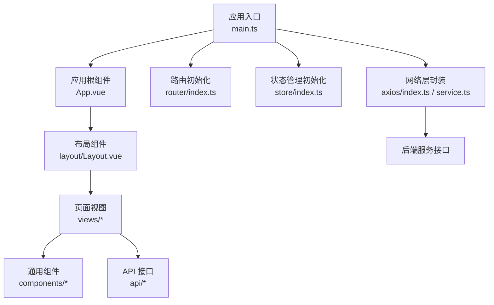
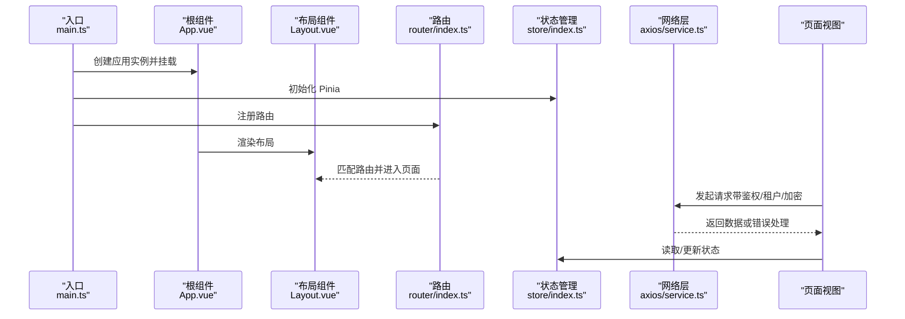
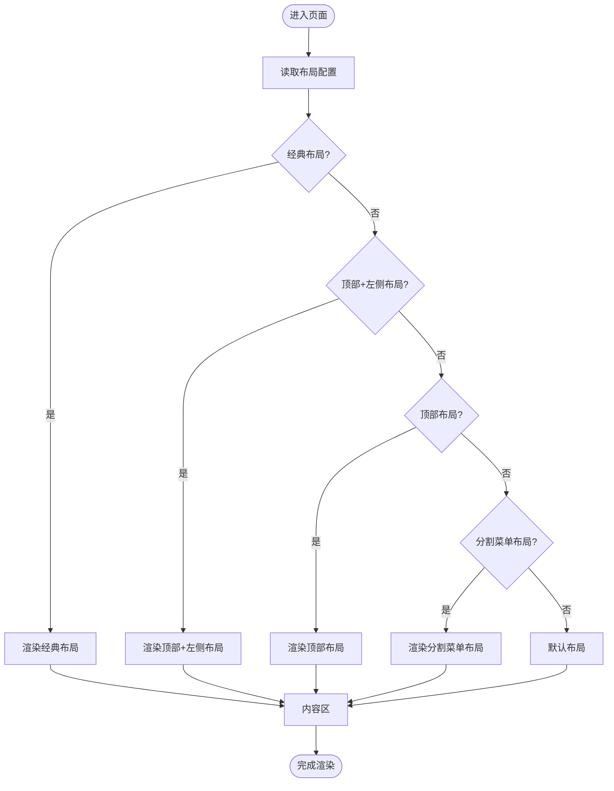
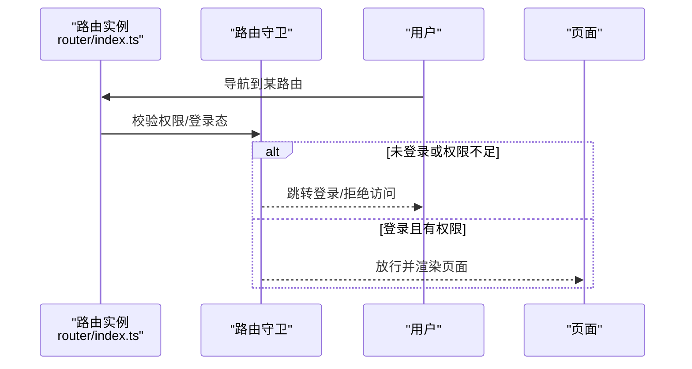
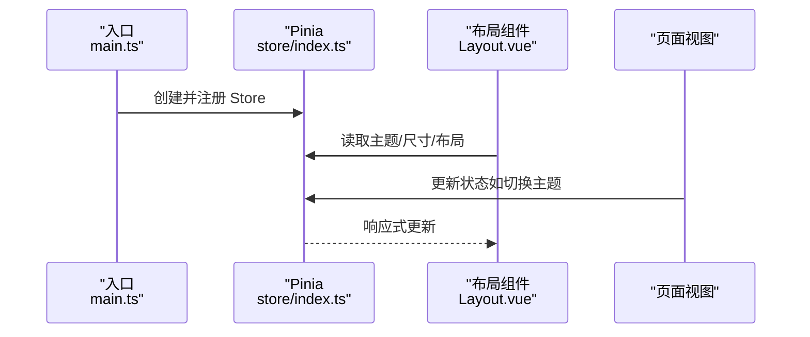
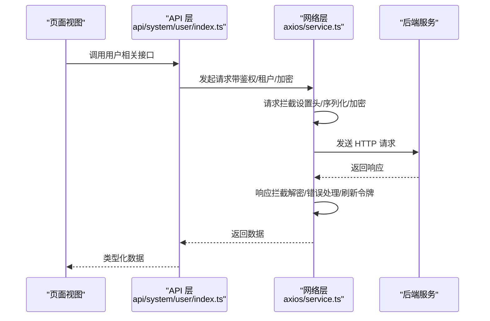
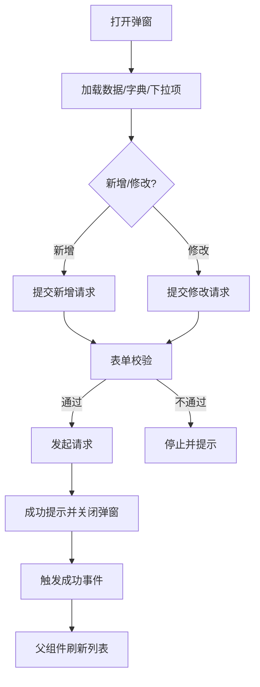
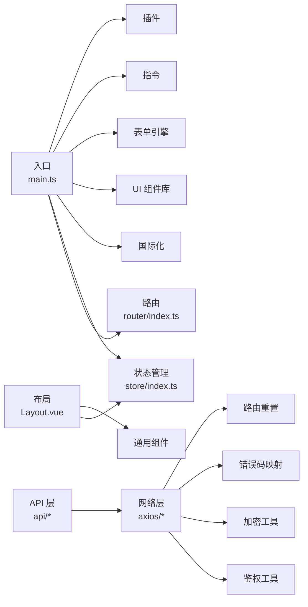

# 前端页面开发

<cite>
**本文引用的文件**
- [main.ts](file://yudao-ui/yudao-ui-admin-vue3/src/main.ts)
- [App.vue](file://yudao-ui/yudao-ui-admin-vue3/src/App.vue)
- [Layout.vue](file://yudao-ui/yudao-ui-admin-vue3/src/layout/Layout.vue)
- [router/index.ts](file://yudao-ui/yudao-ui-admin-vue3/src/router/index.ts)
- [store/index.ts](file://yudao-ui/yudao-ui-admin-vue3/src/store/index.ts)
- [axios/index.ts](file://yudao-ui/yudao-ui-admin-vue3/src/config/axios/index.ts)
- [axios/service.ts](file://yudao-ui/yudao-ui-admin-vue3/src/config/axios/service.ts)
- [axios/errorCode.ts](file://yudao-ui/yudao-ui-admin-vue3/src/config/axios/errorCode.ts)
- [api/system/user/index.ts](file://yudao-ui/yudao-ui-admin-vue3/src/api/system/user/index.ts)
- [api/system/menu/index.ts](file://yudao-ui/yudao-ui-admin-vue3/src/api/system/menu/index.ts)
- [views/system/user/UserForm.vue](file://yudao-ui/yudao-ui-admin-vue3/src/views/system/user/UserForm.vue)
</cite>

## 目录
1. [简介](#简介)
2. [项目结构](#项目结构)
3. [核心组件](#核心组件)
4. [架构总览](#架构总览)
5. [详细组件分析](#详细组件分析)
6. [依赖关系分析](#依赖关系分析)
7. [性能考虑](#性能考虑)
8. [故障排查指南](#故障排查指南)
9. [结论](#结论)
10. [附录](#附录)

## 简介
本指南面向前端开发者，系统性阐述该前端工程的页面组织方式、路由与权限、状态管理、API 调用、表单与表格、弹窗对话框等开发规范与最佳实践。文档以仓库中的实际实现为依据，结合架构图与流程图帮助读者快速上手并规范化开发。

## 项目结构
该前端采用 Vue 3 + TypeScript + Vite 架构，核心入口在应用根组件与路由、状态管理、网络层、通用组件与视图层之间形成清晰分层：
- 应用入口与初始化：在入口文件中集中安装 i18n、状态管理、全局组件、UI 组件库、表单引擎、路由、指令、插件等。
- 布局与页面：通过布局组件统一渲染不同风格的页面结构，页面视图按模块划分。
- 路由与权限：路由实例集中配置，支持动态导入失败处理与路由重置；权限通过指令与守卫配合实现。
- 状态管理：基于 Pinia，启用持久化插件，便于跨页面状态共享与缓存。
- 网络层：统一封装 Axios 请求与响应拦截，内置鉴权、租户、加密、刷新令牌、错误提示等能力。
- API 层：按业务域拆分 API 文件，提供类型化接口与常用 CRUD 操作。
- 通用组件：包含表单、表格、弹窗、字典标签、富文本、图表等可复用组件。

**图表来源**
- [main.ts:1-92](file://yudao-ui/yudao-ui-admin-vue3/src/main.ts#L1-L92)
- [App.vue:1-58](file://yudao-ui/yudao-ui-admin-vue3/src/App.vue#L1-L58)
- [Layout.vue:1-84](file://yudao-ui/yudao-ui-admin-vue3/src/layout/Layout.vue#L1-L84)
- [router/index.ts:1-47](file://yudao-ui/yudao-ui-admin-vue3/src/router/index.ts#L1-L47)
- [store/index.ts:1-13](file://yudao-ui/yudao-ui-admin-vue3/src/store/index.ts#L1-L13)
- [axios/index.ts:1-48](file://yudao-ui/yudao-ui-admin-vue3/src/config/axios/index.ts#L1-L48)
- [axios/service.ts:1-272](file://yudao-ui/yudao-ui-admin-vue3/src/config/axios/service.ts#L1-L272)

**章节来源**
- [main.ts:1-92](file://yudao-ui/yudao-ui-admin-vue3/src/main.ts#L1-L92)
- [App.vue:1-58](file://yudao-ui/yudao-ui-admin-vue3/src/App.vue#L1-L58)
- [Layout.vue:1-84](file://yudao-ui/yudao-ui-admin-vue3/src/layout/Layout.vue#L1-L84)
- [router/index.ts:1-47](file://yudao-ui/yudao-ui-admin-vue3/src/router/index.ts#L1-L47)
- [store/index.ts:1-13](file://yudao-ui/yudao-ui-admin-vue3/src/store/index.ts#L1-L13)
- [axios/index.ts:1-48](file://yudao-ui/yudao-ui-admin-vue3/src/config/axios/index.ts#L1-L48)
- [axios/service.ts:1-272](file://yudao-ui/yudao-ui-admin-vue3/src/config/axios/service.ts#L1-L272)

## 核心组件
- 应用入口与初始化：集中安装 i18n、状态管理、全局组件、UI 组件库、表单引擎、路由、指令、插件等，确保应用启动时一次性完成装配。
- 布局组件：支持多种布局渲染模式，统一承载菜单、内容区、设置面板与回到顶部等交互。
- 路由：基于 History 模式，具备动态导入失败自动跳转、滚动行为控制、路由重置等能力。
- 状态管理：基于 Pinia，启用持久化插件，便于跨页面状态共享与缓存。
- 网络层：统一封装请求与响应拦截，内置鉴权、租户、加密、刷新令牌、错误提示等能力。

**章节来源**
- [main.ts:1-92](file://yudao-ui/yudao-ui-admin-vue3/src/main.ts#L1-L92)
- [Layout.vue:1-84](file://yudao-ui/yudao-ui-admin-vue3/src/layout/Layout.vue#L1-L84)
- [router/index.ts:1-47](file://yudao-ui/yudao-ui-admin-vue3/src/router/index.ts#L1-L47)
- [store/index.ts:1-13](file://yudao-ui/yudao-ui-admin-vue3/src/store/index.ts#L1-L13)
- [axios/index.ts:1-48](file://yudao-ui/yudao-ui-admin-vue3/src/config/axios/index.ts#L1-L48)
- [axios/service.ts:1-272](file://yudao-ui/yudao-ui-admin-vue3/src/config/axios/service.ts#L1-L272)

## 架构总览
下图展示了从应用入口到页面渲染、路由与状态管理、网络请求的整体流程：

**图表来源**
- [main.ts:1-92](file://yudao-ui/yudao-ui-admin-vue3/src/main.ts#L1-L92)
- [App.vue:1-58](file://yudao-ui/yudao-ui-admin-vue3/src/App.vue#L1-L58)
- [Layout.vue:1-84](file://yudao-ui/yudao-ui-admin-vue3/src/layout/Layout.vue#L1-L84)
- [router/index.ts:1-47](file://yudao-ui/yudao-ui-admin-vue3/src/router/index.ts#L1-L47)
- [store/index.ts:1-13](file://yudao-ui/yudao-ui-admin-vue3/src/store/index.ts#L1-L13)
- [axios/service.ts:1-272](file://yudao-ui/yudao-ui-admin-vue3/src/config/axios/service.ts#L1-L272)

## 详细组件分析

### 页面布局与组件层次
- 布局组件根据配置选择不同的渲染模式（经典、顶部、左侧、顶部左侧、分割菜单等），统一承载菜单、内容区、设置面板与回到顶部等交互。
- 根组件负责主题色、灰色模式、全局尺寸等配置，并通过布局组件承载页面内容。

**图表来源**
- [Layout.vue:28-45](file://yudao-ui/yudao-ui-admin-vue3/src/layout/Layout.vue#L28-L45)

**章节来源**
- [Layout.vue:1-84](file://yudao-ui/yudao-ui-admin-vue3/src/layout/Layout.vue#L1-L84)
- [App.vue:1-58](file://yudao-ui/yudao-ui-admin-vue3/src/App.vue#L1-L58)

### 路由配置与权限控制
- 路由采用 History 模式，支持严格模式与滚动行为控制；对动态导入失败进行捕获并自动跳转。
- 提供路由重置方法，白名单路由不会被移除，便于登录态切换与权限变更后的路由重建。
- 权限控制通过指令与路由守卫配合实现，结合后端菜单与权限资源进行页面级与功能级控制。

**图表来源**
- [router/index.ts:1-47](file://yudao-ui/yudao-ui-admin-vue3/src/router/index.ts#L1-L47)

**章节来源**
- [router/index.ts:1-47](file://yudao-ui/yudao-ui-admin-vue3/src/router/index.ts#L1-L47)

### 状态管理（Pinia）
- 在入口中创建并注册 Pinia，启用持久化插件，确保状态在刷新后仍可恢复。
- 布局组件与页面通过 Store 读取/更新主题、尺寸、布局等全局状态。

**图表来源**
- [store/index.ts:1-13](file://yudao-ui/yudao-ui-admin-vue3/src/store/index.ts#L1-L13)
- [main.ts:10-11](file://yudao-ui/yudao-ui-admin-vue3/src/main.ts#L10-L11)
- [Layout.vue:14-22](file://yudao-ui/yudao-ui-admin-vue3/src/layout/Layout.vue#L14-L22)

**章节来源**
- [store/index.ts:1-13](file://yudao-ui/yudao-ui-admin-vue3/src/store/index.ts#L1-L13)
- [main.ts:10-11](file://yudao-ui/yudao-ui-admin-vue3/src/main.ts#L10-L11)
- [Layout.vue:14-22](file://yudao-ui/yudao-ui-admin-vue3/src/layout/Layout.vue#L14-L22)

### API 调用方法与网络层
- 网络层统一封装请求与响应拦截，内置以下能力：
  - 请求头注入：鉴权令牌、租户 ID、访问租户 ID、Content-Type 控制。
  - 防缓存：GET 请求添加缓存控制头。
  - 参数序列化：支持 application/x-www-form-urlencoded。
  - API 加密：请求数据加密与响应解密。
  - 无感刷新令牌：并发请求排队与回放。
  - 错误处理：统一错误消息、超时、网络错误、401/500/901 等场景处理。
  - 二进制下载：Excel 导出等场景自动识别并返回 Blob。
- API 封装：按业务域拆分 API 文件，提供类型化接口与常用 CRUD 操作。

**图表来源**
- [axios/service.ts:49-106](file://yudao-ui/yudao-ui-admin-vue3/src/config/axios/service.ts#L49-L106)
- [axios/service.ts:108-239](file://yudao-ui/yudao-ui-admin-vue3/src/config/axios/service.ts#L108-L239)
- [api/system/user/index.ts:1-101](file://yudao-ui/yudao-ui-admin-vue3/src/api/system/user/index.ts#L1-L101)

**章节来源**
- [axios/index.ts:1-48](file://yudao-ui/yudao-ui-admin-vue3/src/config/axios/index.ts#L1-L48)
- [axios/service.ts:1-272](file://yudao-ui/yudao-ui-admin-vue3/src/config/axios/service.ts#L1-L272)
- [api/system/user/index.ts:1-101](file://yudao-ui/yudao-ui-admin-vue3/src/api/system/user/index.ts#L1-L101)
- [api/system/menu/index.ts:1-50](file://yudao-ui/yudao-ui-admin-vue3/src/api/system/menu/index.ts#L1-L50)

### 表单组件使用规范
- 表单弹窗：通过通用弹窗组件承载表单，支持加载中、标题、规则、字段映射、提交与重置。
- 表单验证：基于 Element Plus 的表单规则，提供必填、邮箱、手机号等常见校验。
- 字段映射：表单字段与 API 数据模型保持一致，避免手动映射。
- 提交处理：统一校验、统一 loading、成功提示、事件通知父组件刷新。
- 重置逻辑：清空表单字段并重置校验状态。

**图表来源**
- [views/system/user/UserForm.vue:155-177](file://yudao-ui/yudao-ui-admin-vue3/src/views/system/user/UserForm.vue#L155-L177)
- [views/system/user/UserForm.vue:179-203](file://yudao-ui/yudao-ui-admin-vue3/src/views/system/user/UserForm.vue#L179-L203)
- [views/system/user/UserForm.vue:205-222](file://yudao-ui/yudao-ui-admin-vue3/src/views/system/user/UserForm.vue#L205-L222)

**章节来源**
- [views/system/user/UserForm.vue:1-224](file://yudao-ui/yudao-ui-admin-vue3/src/views/system/user/UserForm.vue#L1-L224)

### 表格展示与交互
- 分页表格：通过分页组件与 API 分页参数配合，实现后端分页与前端展示。
- 排序与筛选：支持列排序与筛选条件传递至后端接口。
- 批量操作：提供勾选行集合，统一提交批量操作请求。
- 行内编辑：在表格中直接编辑字段并保存，注意校验与错误处理。
- 导出与下载：通过下载接口返回 Blob 并触发浏览器下载。

（本节为概念性说明，未直接分析具体文件）

### 弹窗对话框使用规范
- 表单弹窗：用于新增/编辑，包含表单验证、提交、重置与成功回调。
- 确认对话框：用于删除、停用等危险操作，二次确认防止误操作。
- 详情弹窗：用于查看详情，通常为只读展示。
- 尺寸控制：根据内容体量选择合适尺寸，保证可读性与可用性。

（本节为概念性说明，未直接分析具体文件）

### 路由组织与权限
- 路由定义：按模块划分，采用模块化路由文件组织。
- 权限路由：结合后端菜单与权限资源，动态生成可访问路由。
- 懒加载：页面组件按需加载，提升首屏性能。
- 嵌套路由：支持子路由与面包屑导航，保持层级清晰。

（本节为概念性说明，未直接分析具体文件）

## 依赖关系分析
- 入口依赖：入口文件依赖路由、状态管理、国际化、UI 组件库、表单引擎、指令与插件。
- 布局依赖：布局组件依赖状态管理与通用组件。
- 网络层依赖：网络层依赖鉴权工具、加密工具、错误码映射与路由重置。
- API 依赖：API 文件依赖网络层封装。

**图表来源**
- [main.ts:1-92](file://yudao-ui/yudao-ui-admin-vue3/src/main.ts#L1-L92)
- [Layout.vue:1-84](file://yudao-ui/yudao-ui-admin-vue3/src/layout/Layout.vue#L1-L84)
- [axios/service.ts:1-272](file://yudao-ui/yudao-ui-admin-vue3/src/config/axios/service.ts#L1-L272)
- [axios/errorCode.ts](file://yudao-ui/yudao-ui-admin-vue3/src/config/axios/errorCode.ts)

**章节来源**
- [main.ts:1-92](file://yudao-ui/yudao-ui-admin-vue3/src/main.ts#L1-L92)
- [Layout.vue:1-84](file://yudao-ui/yudao-ui-admin-vue3/src/layout/Layout.vue#L1-L84)
- [axios/service.ts:1-272](file://yudao-ui/yudao-ui-admin-vue3/src/config/axios/service.ts#L1-L272)

## 性能考虑
- 路由懒加载：页面组件按需加载，减少初始包体。
- 图标与样式：SVG 图标与全局样式按需引入，避免冗余。
- 缓存策略：状态持久化与缓存工具结合，减少重复请求。
- 请求防抖与去重：在高频操作中避免重复请求。
- 二进制下载：导出场景使用 Blob 直接下载，避免内存占用过高。

（本节为通用指导，未直接分析具体文件）

## 故障排查指南
- 动态导入失败：路由错误处理器自动跳转目标页面，检查打包产物与路径。
- 401 未认证：触发刷新令牌流程，若刷新失败则引导重新登录。
- 网络错误与超时：统一提示国际化文案，检查网络与后端服务状态。
- 响应解密失败：检查加密开关与密钥配置。
- 租户相关问题：确认租户 ID 与访问租户 ID 的设置逻辑。

**章节来源**
- [router/index.ts:22-30](file://yudao-ui/yudao-ui-admin-vue3/src/router/index.ts#L22-L30)
- [axios/service.ts:108-239](file://yudao-ui/yudao-ui-admin-vue3/src/config/axios/service.ts#L108-L239)
- [axios/service.ts:241-270](file://yudao-ui/yudao-ui-admin-vue3/src/config/axios/service.ts#L241-L270)

## 结论
本指南基于仓库现有实现，总结了页面组织、路由与权限、状态管理、网络请求、表单与弹窗等前端开发的关键规范。建议在新功能开发中遵循本文档的组织方式与最佳实践，确保代码一致性与可维护性。

## 附录
- 常用 API 接口：用户管理、菜单管理等按模块拆分，提供类型化接口与 CRUD 操作。
- 错误码映射：统一错误提示与国际化文案，便于用户理解与定位问题。

**章节来源**
- [api/system/user/index.ts:1-101](file://yudao-ui/yudao-ui-admin-vue3/src/api/system/user/index.ts#L1-L101)
- [api/system/menu/index.ts:1-50](file://yudao-ui/yudao-ui-admin-vue3/src/api/system/menu/index.ts#L1-L50)
- [axios/errorCode.ts](file://yudao-ui/yudao-ui-admin-vue3/src/config/axios/errorCode.ts)