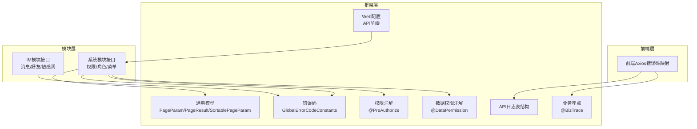
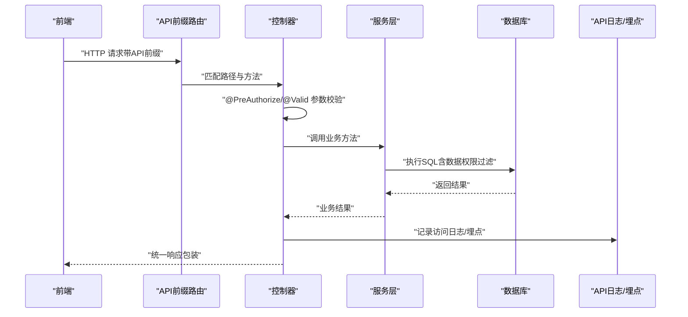
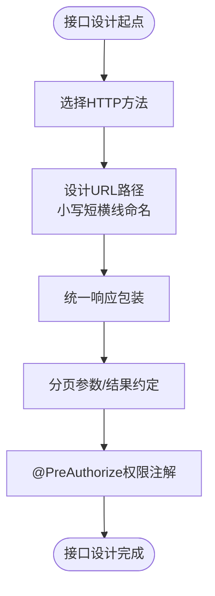
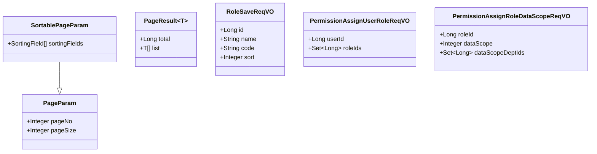
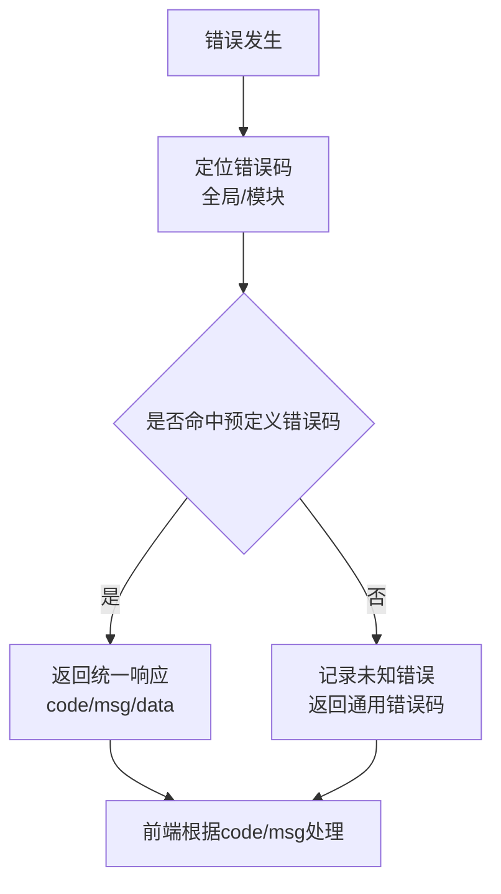
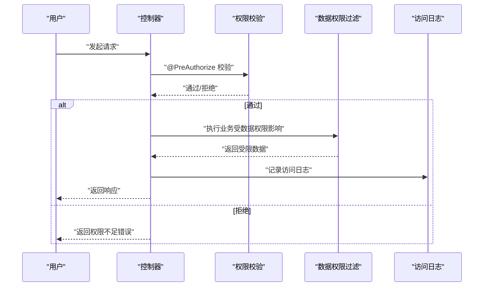
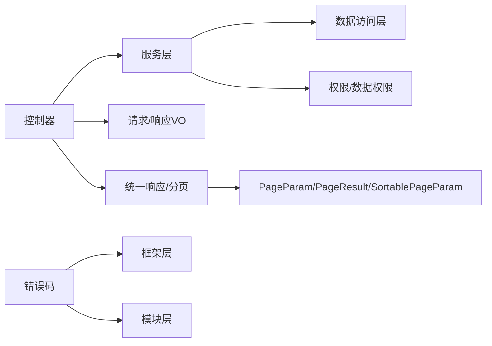
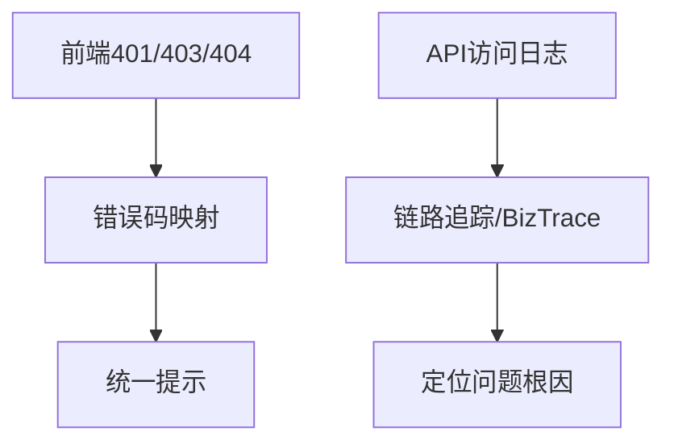

# 接口设计规范

<cite>
**本文引用的文件**   
- [DEVELOPMENT-GUIDE.md](file://DEVELOPMENT-GUIDE.md)
- [GlobalErrorCodeConstants.java](file://yudao-framework/yudao-common/src/main/java/cn/iocoder/yudao/framework/common/exception/enums/GlobalErrorCodeConstants.java)
- [ErrorCodeConstants.java（系统模块）](file://yudao-module-system/src/main/java/cn/iocoder/yudao/module/system/enums/ErrorCodeConstants.java)
- [ErrorCodeConstants.java（IM模块）](file://yudao-module-im/src/main/java/cn/iocoder/yudao/module/im/enums/ErrorCodeConstants.java)
- [PageParam.java](file://yudao-framework/yudao-common/src/main/java/cn/iocoder/yudao/framework/common/pojo/PageParam.java)
- [PageResult.java](file://yudao-framework/yudao-common/src/main/java/cn/iocoder/yudao/framework/common/pojo/PageResult.java)
- [SortablePageParam.java](file://yudao-framework/yudao-common/src/main/java/cn/iocoder/yudao/framework/common/pojo/SortablePageParam.java)
- [RoleSaveReqVO.java](file://yudao-module-system/src/main/java/cn/iocoder/yudao/module/system/controller/admin/permission/vo/role/RoleSaveReqVO.java)
- [PermissionAssignUserRoleReqVO.java](file://yudao-module-system/src/main/java/cn/iocoder/yudao/module/system/controller/admin/permission/vo/permission/PermissionAssignUserRoleReqVO.java)
- [PermissionAssignRoleDataScopeReqVO.java](file://yudao-module-system/src/main/java/cn/iocoder/yudao/module/system/controller/admin/permission/vo/permission/PermissionAssignRoleDataScopeReqVO.java)
- [DataPermission.java（注解）](file://yudao-framework/yudao-spring-boot-starter-biz-data-permission/src/main/java/cn/iocoder/yudao/framework/datapermission/core/annotation/DataPermission.java)
- [YudaoDataPermissionAutoConfiguration.java](file://yudao-framework/yudao-spring-boot-starter-biz-data-permission/src/main/java/cn/iocoder/yudao/framework/datapermission/config/YudaoDataPermissionAutoConfiguration.java)
- [PermissionApi.java](file://yudao-module-system/src/main/java/cn/iocoder/yudao/module/system/api/permission/PermissionApi.java)
- [PermissionServiceImpl.java](file://yudao-module-system/src/main/java/cn/iocoder/yudao/module/system/service/permission/PermissionServiceImpl.java)
- [errorCode.ts（前端错误码映射）](file://yudao-ui/yudao-ui-admin-vue3/src/config/axios/errorCode.ts)
- [WebProperties.java（API前缀配置）](file://yudao-framework/yudao-spring-boot-starter-web/src/main/java/cn/iocoder/yudao/framework/web/config/WebProperties.java)
- [create_tables.sql（API访问日志表结构）](file://yudao-module-infra/src/test/resources/sql/create_tables.sql)
- [BizTrace.java（业务埋点注解）](file://yudao-framework/yudao-spring-boot-starter-monitor/src/main/java/cn/iocoder/yudao/framework/tracer/core/annotation/BizTrace.java)
- [Swagger入门.md](file://yudao-framework/yudao-spring-boot-starter-web/《芋道 Spring Boot API 接口文档 Swagger 入门》.md)
- [开发指南-版本管理章节](file://DEVELOPMENT-GUIDE.md)
- [README（功能概览）](file://README.md)
- [listReqVO.vm（代码生成模板）](file://yudao-module-infra/src/main/resources/codegen/java/controller/vo/listReqVO.vm)
- [pageReqVO.vm（代码生成模板）](file://yudao-module-infra/src/main/resources/codegen/java/controller/vo/pageReqVO.vm)
</cite>

## 目录
1. [引言](#引言)
2. [项目结构](#项目结构)
3. [核心组件](#核心组件)
4. [架构总览](#架构总览)
5. [详细组件分析](#详细组件分析)
6. [依赖关系分析](#依赖关系分析)
7. [性能考量](#性能考量)
8. [故障排查指南](#故障排查指南)
9. [结论](#结论)
10. [附录](#附录)

## 引言
本规范面向后端接口设计与实现，基于现有代码库总结出统一的REST API设计原则、请求/响应VO设计、错误码体系、权限控制、接口版本管理以及接口文档规范。目标是提升接口一致性、可维护性与可扩展性，降低前后端协作成本。

## 项目结构
围绕接口设计相关的关键位置如下：
- 框架层：统一响应包装、分页参数、错误码枚举、权限与数据权限注解、Web前缀配置、API日志与监控埋点
- 模块层：以系统模块为代表，展示权限、角色、菜单等典型接口的VO与注解使用
- 前端层：Axios错误码映射，便于统一处理HTTP状态码与业务错误

**图表来源**
- [PageParam.java:1-36](file://yudao-framework/yudao-common/src/main/java/cn/iocoder/yudao/framework/common/pojo/PageParam.java#L1-L36)
- [PageResult.java:1-41](file://yudao-framework/yudao-common/src/main/java/cn/iocoder/yudao/framework/common/pojo/PageResult.java#L1-L41)
- [SortablePageParam.java:1-19](file://yudao-framework/yudao-common/src/main/java/cn/iocoder/yudao/framework/common/pojo/SortablePageParam.java#L1-L19)
- [GlobalErrorCodeConstants.java:29-41](file://yudao-framework/yudao-common/src/main/java/cn/iocoder/yudao/framework/common/exception/enums/GlobalErrorCodeConstants.java#L29-L41)
- [DataPermission.java（注解）:1-35](file://yudao-framework/yudao-spring-boot-starter-biz-data-permission/src/main/java/cn/iocoder/yudao/framework/datapermission/core/annotation/DataPermission.java#L1-L35)
- [WebProperties.java（API前缀配置）:27-66](file://yudao-framework/yudao-spring-boot-starter-web/src/main/java/cn/iocoder/yudao/framework/web/config/WebProperties.java#L27-L66)
- [create_tables.sql（API访问日志表结构）:88-115](file://yudao-module-infra/src/test/resources/sql/create_tables.sql#L88-L115)
- [BizTrace.java（业务埋点注解）:1-42](file://yudao-framework/yudao-spring-boot-starter-monitor/src/main/java/cn/iocoder/yudao/framework/tracer/core/annotation/BizTrace.java#L1-L42)

**章节来源**
- [WebProperties.java（API前缀配置）:27-66](file://yudao-framework/yudao-spring-boot-starter-web/src/main/java/cn/iocoder/yudao/framework/web/config/WebProperties.java#L27-L66)
- [create_tables.sql（API访问日志表结构）:88-115](file://yudao-module-infra/src/test/resources/sql/create_tables.sql#L88-L115)

## 核心组件
- 统一响应包装：所有接口返回统一结构，便于前端处理与错误收敛
- 分页参数与结果：标准化分页参数与分页结果结构，支持排序扩展
- 错误码体系：全局错误码与模块化错误码，明确编号规则与范围
- 权限与数据权限：接口级权限注解与数据维度权限控制
- API前缀与文档：统一API前缀，结合Swagger生成接口文档
- 前端错误码映射：HTTP状态码与业务错误的统一映射

**章节来源**
- [DEVELOPMENT-GUIDE.md:143-251](file://DEVELOPMENT-GUIDE.md#L143-L251)
- [PageParam.java:1-36](file://yudao-framework/yudao-common/src/main/java/cn/iocoder/yudao/framework/common/pojo/PageParam.java#L1-L36)
- [PageResult.java:1-41](file://yudao-framework/yudao-common/src/main/java/cn/iocoder/yudao/framework/common/pojo/PageResult.java#L1-L41)
- [SortablePageParam.java:1-19](file://yudao-framework/yudao-common/src/main/java/cn/iocoder/yudao/framework/common/pojo/SortablePageParam.java#L1-L19)
- [GlobalErrorCodeConstants.java:29-41](file://yudao-framework/yudao-common/src/main/java/cn/iocoder/yudao/framework/common/exception/enums/GlobalErrorCodeConstants.java#L29-L41)
- [ErrorCodeConstants.java（系统模块）:20-63](file://yudao-module-system/src/main/java/cn/iocoder/yudao/module/system/enums/ErrorCodeConstants.java#L20-L63)
- [ErrorCodeConstants.java（IM模块）:66-75](file://yudao-module-im/src/main/java/cn/iocoder/yudao/module/im/enums/ErrorCodeConstants.java#L66-L75)
- [WebProperties.java（API前缀配置）:27-66](file://yudao-framework/yudao-spring-boot-starter-web/src/main/java/cn/iocoder/yudao/framework/web/config/WebProperties.java#L27-L66)
- [errorCode.ts（前端错误码映射）:1-6](file://yudao-ui/yudao-ui-admin-vue3/src/config/axios/errorCode.ts#L1-L6)

## 架构总览
下图展示了接口调用链路中的关键节点：前端请求经由API前缀路由至控制器，控制器通过服务层完成业务处理，期间可能触发权限校验、数据权限过滤、参数校验与日志记录，最终统一返回响应。

**图表来源**
- [WebProperties.java（API前缀配置）:27-66](file://yudao-framework/yudao-spring-boot-starter-web/src/main/java/cn/iocoder/yudao/framework/web/config/WebProperties.java#L27-L66)
- [PermissionServiceImpl.java:1-25](file://yudao-module-system/src/main/java/cn/iocoder/yudao/module/system/service/permission/PermissionServiceImpl.java#L1-L25)
- [create_tables.sql（API访问日志表结构）:88-115](file://yudao-module-infra/src/test/resources/sql/create_tables.sql#L88-L115)
- [BizTrace.java（业务埋点注解）:1-42](file://yudao-framework/yudao-spring-boot-starter-monitor/src/main/java/cn/iocoder/yudao/framework/tracer/core/annotation/BizTrace.java#L1-L42)

## 详细组件分析

### REST API 设计原则
- HTTP方法选择：遵循REST语义，使用标准动词进行资源操作
- URL命名规范：统一使用小写短横线分隔，路径清晰表达资源与动作
- 统一响应格式：所有接口统一使用包装响应体，便于错误与数据统一处理
- 分页约定：请求参数继承分页基类，响应使用分页结果对象
- 权限注解：每个鉴权接口使用接口级权限注解进行授权控制

**图表来源**
- [DEVELOPMENT-GUIDE.md:143-251](file://DEVELOPMENT-GUIDE.md#L143-L251)
- [PageParam.java:1-36](file://yudao-framework/yudao-common/src/main/java/cn/iocoder/yudao/framework/common/pojo/PageParam.java#L1-L36)
- [PageResult.java:1-41](file://yudao-framework/yudao-common/src/main/java/cn/iocoder/yudao/framework/common/pojo/PageResult.java#L1-L41)

**章节来源**
- [DEVELOPMENT-GUIDE.md:143-251](file://DEVELOPMENT-GUIDE.md#L143-L251)

### 请求/响应VO设计规范
- 请求参数VO：用于接收请求参数，建议按业务场景拆分列表查询、分页查询等不同场景的VO
- 响应结果VO：承载具体业务数据，避免直接暴露领域对象
- 分页参数VO：继承分页基类，支持默认页码与最大页大小约束
- 排序参数VO：在分页基础上增加排序字段集合，支持多字段排序

**图表来源**
- [PageParam.java:1-36](file://yudao-framework/yudao-common/src/main/java/cn/iocoder/yudao/framework/common/pojo/PageParam.java#L1-L36)
- [SortablePageParam.java:1-19](file://yudao-framework/yudao-common/src/main/java/cn/iocoder/yudao/framework/common/pojo/SortablePageParam.java#L1-L19)
- [PageResult.java:1-41](file://yudao-framework/yudao-common/src/main/java/cn/iocoder/yudao/framework/common/pojo/PageResult.java#L1-L41)
- [RoleSaveReqVO.java:1-34](file://yudao-module-system/src/main/java/cn/iocoder/yudao/module/system/controller/admin/permission/vo/role/RoleSaveReqVO.java#L1-L34)
- [PermissionAssignUserRoleReqVO.java:1-21](file://yudao-module-system/src/main/java/cn/iocoder/yudao/module/system/controller/admin/permission/vo/permission/PermissionAssignUserRoleReqVO.java#L1-L21)
- [PermissionAssignRoleDataScopeReqVO.java:1-28](file://yudao-module-system/src/main/java/cn/iocoder/yudao/module/system/controller/admin/permission/vo/permission/PermissionAssignRoleDataScopeReqVO.java#L1-L28)

**章节来源**
- [RoleSaveReqVO.java:1-34](file://yudao-module-system/src/main/java/cn/iocoder/yudao/module/system/controller/admin/permission/vo/role/RoleSaveReqVO.java#L1-L34)
- [PermissionAssignUserRoleReqVO.java:1-21](file://yudao-module-system/src/main/java/cn/iocoder/yudao/module/system/controller/admin/permission/vo/permission/PermissionAssignUserRoleReqVO.java#L1-L21)
- [PermissionAssignRoleDataScopeReqVO.java:1-28](file://yudao-module-system/src/main/java/cn/iocoder/yudao/module/system/controller/admin/permission/vo/permission/PermissionAssignRoleDataScopeReqVO.java#L1-L28)
- [PageParam.java:1-36](file://yudao-framework/yudao-common/src/main/java/cn/iocoder/yudao/framework/common/pojo/PageParam.java#L1-L36)
- [SortablePageParam.java:1-19](file://yudao-framework/yudao-common/src/main/java/cn/iocoder/yudao/framework/common/pojo/SortablePageParam.java#L1-L19)
- [PageResult.java:1-41](file://yudao-framework/yudao-common/src/main/java/cn/iocoder/yudao/framework/common/pojo/PageResult.java#L1-L41)

### 错误码定义规范
- 全局错误码：覆盖服务端异常、未实现、配置错误等通用场景
- 模块错误码：按模块与功能域划分，确保编号唯一且可扩展
- 编号规则：固定前缀 + 模块编码 + 功能域编码 + 序列编号
- 国际化：错误信息支持占位符，便于多语言替换

**图表来源**
- [GlobalErrorCodeConstants.java:29-41](file://yudao-framework/yudao-common/src/main/java/cn/iocoder/yudao/framework/common/exception/enums/GlobalErrorCodeConstants.java#L29-L41)
- [ErrorCodeConstants.java（系统模块）:20-63](file://yudao-module-system/src/main/java/cn/iocoder/yudao/module/system/enums/ErrorCodeConstants.java#L20-L63)
- [ErrorCodeConstants.java（IM模块）:66-75](file://yudao-module-im/src/main/java/cn/iocoder/yudao/module/im/enums/ErrorCodeConstants.java#L66-L75)
- [DEVELOPMENT-GUIDE.md:128-140](file://DEVELOPMENT-GUIDE.md#L128-L140)

**章节来源**
- [GlobalErrorCodeConstants.java:29-41](file://yudao-framework/yudao-common/src/main/java/cn/iocoder/yudao/framework/common/exception/enums/GlobalErrorCodeConstants.java#L29-L41)
- [ErrorCodeConstants.java（系统模块）:20-63](file://yudao-module-system/src/main/java/cn/iocoder/yudao/module/system/enums/ErrorCodeConstants.java#L20-L63)
- [ErrorCodeConstants.java（IM模块）:66-75](file://yudao-module-im/src/main/java/cn/iocoder/yudao/module/im/enums/ErrorCodeConstants.java#L66-L75)
- [DEVELOPMENT-GUIDE.md:128-140](file://DEVELOPMENT-GUIDE.md#L128-L140)

### 权限控制设计
- 接口权限注解：使用接口级权限注解进行授权校验
- 参数校验：对请求参数进行必填、长度、取值范围等校验
- 数据权限：通过注解与拦截器在SQL层面限制可见数据
- 操作日志：记录API访问日志，便于审计与问题排查

**图表来源**
- [PermissionServiceImpl.java:62-118](file://yudao-module-system/src/main/java/cn/iocoder/yudao/module/system/service/permission/PermissionServiceImpl.java#L62-L118)
- [DataPermission.java（注解）:1-35](file://yudao-framework/yudao-spring-boot-starter-biz-data-permission/src/main/java/cn/iocoder/yudao/framework/datapermission/core/annotation/DataPermission.java#L1-L35)
- [YudaoDataPermissionAutoConfiguration.java:29-46](file://yudao-framework/yudao-spring-boot-starter-biz-data-permission/src/main/java/cn/iocoder/yudao/framework/datapermission/config/YudaoDataPermissionAutoConfiguration.java#L29-L46)
- [create_tables.sql（API访问日志表结构）:88-115](file://yudao-module-infra/src/test/resources/sql/create_tables.sql#L88-L115)

**章节来源**
- [PermissionApi.java:1-23](file://yudao-module-system/src/main/java/cn/iocoder/yudao/module/system/api/permission/PermissionApi.java#L1-L23)
- [PermissionServiceImpl.java:1-25](file://yudao-module-system/src/main/java/cn/iocoder/yudao/module/system/service/permission/PermissionServiceImpl.java#L1-L25)
- [DataPermission.java（注解）:1-35](file://yudao-framework/yudao-spring-boot-starter-biz-data-permission/src/main/java/cn/iocoder/yudao/framework/datapermission/core/annotation/DataPermission.java#L1-L35)
- [YudaoDataPermissionAutoConfiguration.java:29-46](file://yudao-framework/yudao-spring-boot-starter-biz-data-permission/src/main/java/cn/iocoder/yudao/framework/datapermission/config/YudaoDataPermissionAutoConfiguration.java#L29-L46)
- [create_tables.sql（API访问日志表结构）:88-115](file://yudao-module-infra/src/test/resources/sql/create_tables.sql#L88-L115)

### 接口版本管理
- 版本号规则：通过统一的版本管理策略与模块启用规则，确保版本演进可控
- 向后兼容：在保持接口语义不变的前提下进行扩展，避免破坏性变更
- 废弃接口处理：通过文档与注释明确废弃策略，并逐步迁移

**章节来源**
- [开发指南-版本管理章节:780-830](file://DEVELOPMENT-GUIDE.md#L780-L830)

### 接口文档规范
- Swagger注解使用：通过注解完善接口描述、参数说明与示例
- 接口描述：明确接口用途、请求/响应结构与业务含义
- 参数说明：使用注解标注参数类型、必填性与示例值
- 示例代码：结合模板与生成器，输出前后端对接示例

**章节来源**
- [Swagger入门.md:1-2](file://yudao-framework/yudao-spring-boot-starter-web/《芋道 Spring Boot API 接口文档 Swagger 入门》.md#L1-L2)
- [listReqVO.vm（代码生成模板）:1-45](file://yudao-module-infra/src/main/resources/codegen/java/controller/vo/listReqVO.vm#L1-L45)
- [pageReqVO.vm（代码生成模板）:1-45](file://yudao-module-infra/src/main/resources/codegen/java/controller/vo/pageReqVO.vm#L1-L45)

## 依赖关系分析
- 控制器依赖服务层与VO，服务层依赖数据访问层与权限/数据权限组件
- 统一响应与分页模型被广泛复用，降低耦合度
- 错误码枚举分布在框架与模块中，形成全局与局部的协同

**图表来源**
- [PageParam.java:1-36](file://yudao-framework/yudao-common/src/main/java/cn/iocoder/yudao/framework/common/pojo/PageParam.java#L1-L36)
- [PageResult.java:1-41](file://yudao-framework/yudao-common/src/main/java/cn/iocoder/yudao/framework/common/pojo/PageResult.java#L1-L41)
- [GlobalErrorCodeConstants.java:29-41](file://yudao-framework/yudao-common/src/main/java/cn/iocoder/yudao/framework/common/exception/enums/GlobalErrorCodeConstants.java#L29-L41)
- [ErrorCodeConstants.java（系统模块）:20-63](file://yudao-module-system/src/main/java/cn/iocoder/yudao/module/system/enums/ErrorCodeConstants.java#L20-L63)

**章节来源**
- [PageParam.java:1-36](file://yudao-framework/yudao-common/src/main/java/cn/iocoder/yudao/framework/common/pojo/PageParam.java#L1-L36)
- [PageResult.java:1-41](file://yudao-framework/yudao-common/src/main/java/cn/iocoder/yudao/framework/common/pojo/PageResult.java#L1-L41)
- [GlobalErrorCodeConstants.java:29-41](file://yudao-framework/yudao-common/src/main/java/cn/iocoder/yudao/framework/common/exception/enums/GlobalErrorCodeConstants.java#L29-L41)
- [ErrorCodeConstants.java（系统模块）:20-63](file://yudao-module-system/src/main/java/cn/iocoder/yudao/module/system/enums/ErrorCodeConstants.java#L20-L63)

## 性能考量
- 分页参数上限：通过最大页大小限制防止大页查询带来的性能压力
- 数据权限过滤：在SQL层面进行数据权限过滤，避免应用层二次筛选
- API前缀与路由：统一前缀有助于网关与反向代理的高效转发
- 日志与埋点：合理记录访问日志与业务埋点，平衡可观测性与性能

**章节来源**
- [PageParam.java:30-34](file://yudao-framework/yudao-common/src/main/java/cn/iocoder/yudao/framework/common/pojo/PageParam.java#L30-L34)
- [WebProperties.java（API前缀配置）:27-66](file://yudao-framework/yudao-spring-boot-starter-web/src/main/java/cn/iocoder/yudao/framework/web/config/WebProperties.java#L27-L66)
- [create_tables.sql（API访问日志表结构）:88-115](file://yudao-module-infra/src/test/resources/sql/create_tables.sql#L88-L115)

## 故障排查指南
- 前端错误码映射：针对常见HTTP状态码给出统一提示，辅助快速定位问题
- API访问日志：记录请求/响应、耗时与结果码，便于回溯与分析
- 业务埋点：通过业务埋点注解标记关键操作，结合链路追踪定位问题

**图表来源**
- [errorCode.ts（前端错误码映射）:1-6](file://yudao-ui/yudao-ui-admin-vue3/src/config/axios/errorCode.ts#L1-L6)
- [create_tables.sql（API访问日志表结构）:88-115](file://yudao-module-infra/src/test/resources/sql/create_tables.sql#L88-L115)
- [BizTrace.java（业务埋点注解）:1-42](file://yudao-framework/yudao-spring-boot-starter-monitor/src/main/java/cn/iocoder/yudao/framework/tracer/core/annotation/BizTrace.java#L1-L42)

**章节来源**
- [errorCode.ts（前端错误码映射）:1-6](file://yudao-ui/yudao-ui-admin-vue3/src/config/axios/errorCode.ts#L1-L6)
- [create_tables.sql（API访问日志表结构）:88-115](file://yudao-module-infra/src/test/resources/sql/create_tables.sql#L88-L115)
- [BizTrace.java（业务埋点注解）:1-42](file://yudao-framework/yudao-spring-boot-starter-monitor/src/main/java/cn/iocoder/yudao/framework/tracer/core/annotation/BizTrace.java#L1-L42)

## 结论
本规范总结了接口设计的核心要素：REST语义、统一响应、分页约定、权限与数据权限、错误码体系、版本管理与文档规范。通过在框架层与模块层的落地实践，能够显著提升接口的一致性、安全性与可维护性，同时降低前后端协作成本。

## 附录
- 功能概览与Swagger能力：项目具备基于Swagger自动生成RESTful API接口文档的能力，便于接口文档的持续维护与发布

**章节来源**
- [README（功能概览）:203-222](file://README.md#L203-L222)