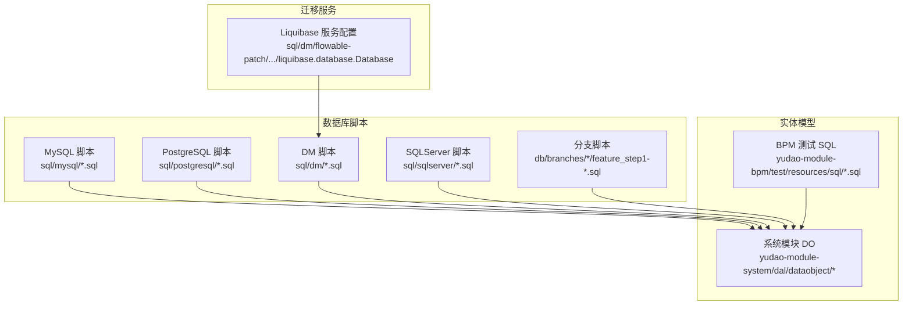
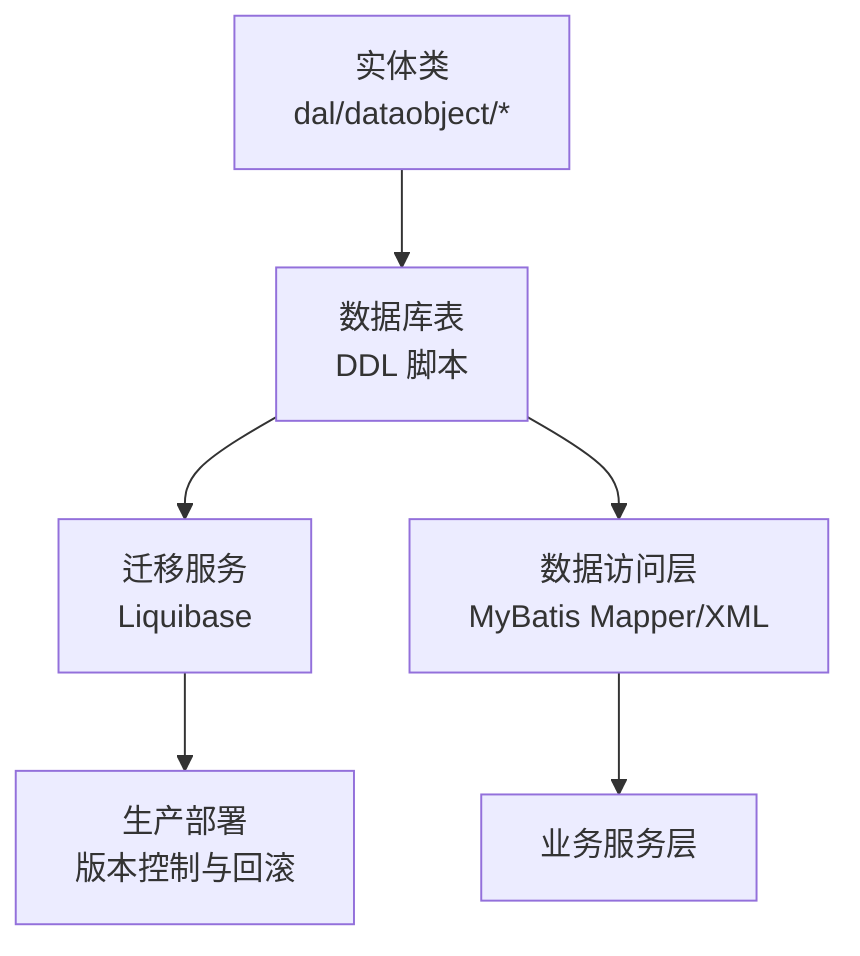
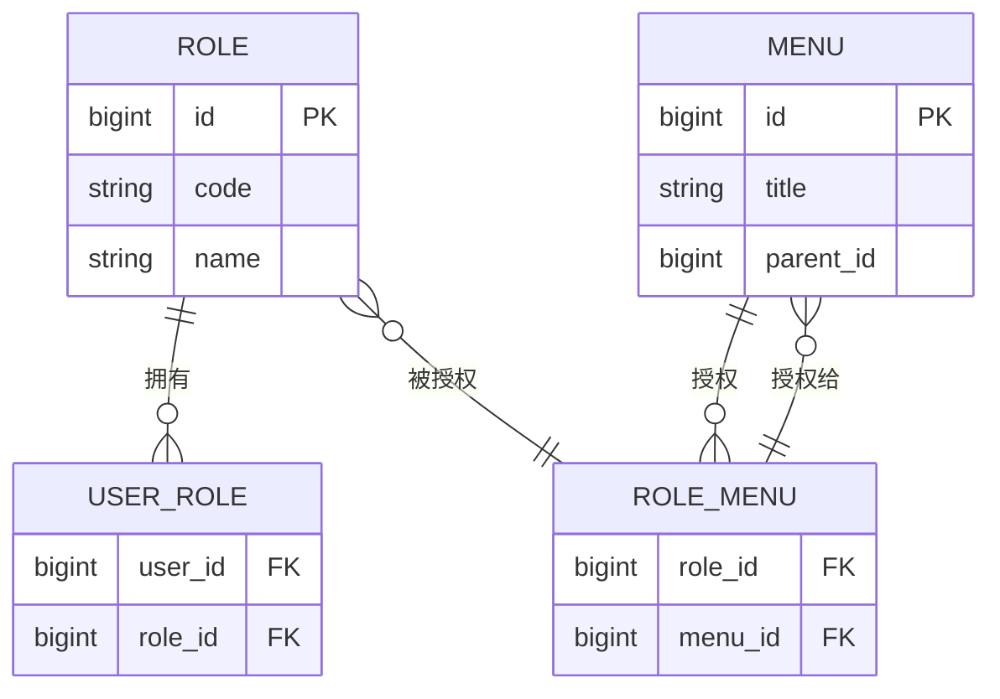
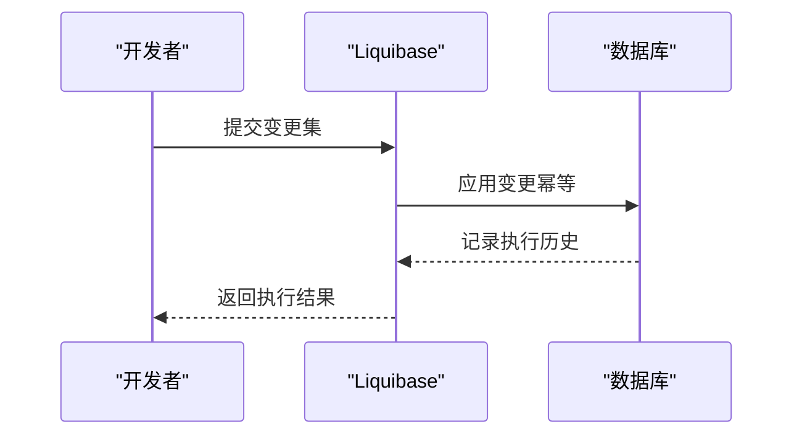
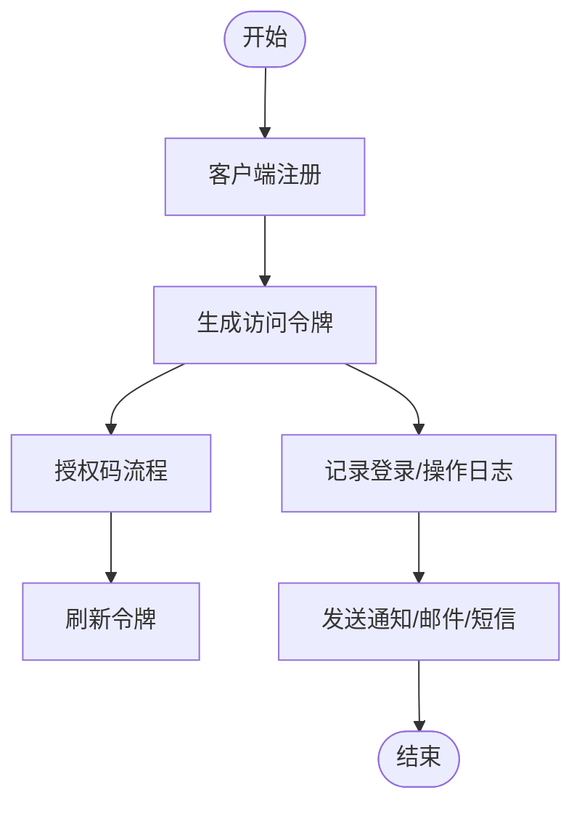
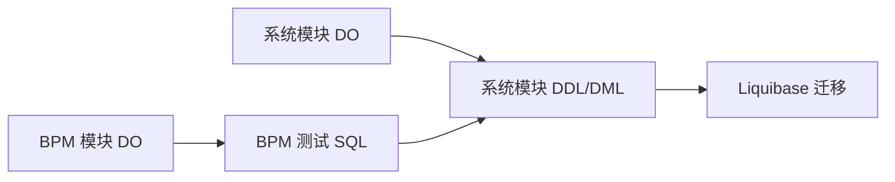

# 数据库表设计

<cite>
**本文引用的文件**
- [feature_step1-权限功能设计_ddl.sql](file://db/branches/feature_step1-权限功能设计/feature_step1-权限功能设计_ddl.sql)
- [feature_step1-权限功能设计_dml.sql](file://db/branches/feature_step1-权限功能设计/feature_step1-权限功能设计_dml.sql)
- [ruoyi-vue-pro.sql](file://sql/mysql/ruoyi-vue-pro.sql)
- [quartz.sql](file://sql/mysql/quartz.sql)
- [DeptDO.java](file://yudao-module-system/src/main/java/cn/iocoder/yudao/module/system/dal/dataobject/dept/DeptDO.java)
- [RoleDO.java](file://yudao-module-system/src/main/java/cn/iocoder/yudao/module/system/dal/dataobject/permission/RoleDO.java)
- [MenuDO.java](file://yudao-module-system/src/main/java/cn/iocoder/yudao/module/system/dal/dataobject/permission/MenuDO.java)
- [UserRoleDO.java](file://yudao-module-system/src/main/java/cn/iocoder/yudao/module/system/dal/dataobject/permission/UserRoleDO.java)
- [RoleMenuDO.java](file://yudao-module-system/src/main/java/cn/iocoder/yudao/module/system/dal/dataobject/permission/RoleMenuDO.java)
- [DictTypeDO.java](file://yudao-module-system/src/main/java/cn/iocoder/yudao/module/system/dal/dataobject/dict/DictTypeDO.java)
- [DictDataDO.java](file://yudao-module-system/src/main/java/cn/iocoder/yudao/module/system/dal/dataobject/dict/DictDataDO.java)
- [AdminUserDO.java](file://yudao-module-system/src/main/java/cn/iocoder/yudao/module/system/dal/dataobject/user/AdminUserDO.java)
- [TenantDO.java](file://yudao-module-system/src/main/java/cn/iocoder/yudao/module/system/dal/dataobject/tenant/TenantDO.java)
- [TenantPackageDO.java](file://yudao-module-system/src/main/java/cn/iocoder/yudao/module/system/dal/dataobject/tenant/TenantPackageDO.java)
- [OAuth2ClientDO.java](file://yudao-module-system/src/main/java/cn/iocoder/yudao/module/system/dal/dataobject/oauth2/OAuth2ClientDO.java)
- [OAuth2AccessTokenDO.java](file://yudao-module-system/src/main/java/cn/iocoder/yudao/module/system/dal/dataobject/oauth2/OAuth2AccessTokenDO.java)
- [OAuth2CodeDO.java](file://yudao-module-system/src/main/java/cn/iocoder/yudao/module/system/dal/dataobject/oauth2/OAuth2CodeDO.java)
- [OAuth2RefreshTokenDO.java](file://yudao-module-system/src/main/java/cn/iocoder/yudao/module/system/dal/dataobject/oauth2/OAuth2RefreshTokenDO.java)
- [MailAccountDO.java](file://yudao-module-system/src/main/java/cn/iocoder/yudao/module/system/dal/dataobject/mail/MailAccountDO.java)
- [MailTemplateDO.java](file://yudao-module-system/src/main/java/cn/iocoder/yudao/module/system/dal/dataobject/mail/MailTemplateDO.java)
- [MailLogDO.java](file://yudao-module-system/src/main/java/cn/iocoder/yudao/module/system/dal/dataobject/mail/MailLogDO.java)
- [SmsChannelDO.java](file://yudao-module-system/src/main/java/cn/iocoder/yudao/module/system/dal/dataobject/sms/SmsChannelDO.java)
- [SmsTemplateDO.java](file://yudao-module-system/src/main/java/cn/iocoder/yudao/module/system/dal/dataobject/sms/SmsTemplateDO.java)
- [SmsCodeDO.java](file://yudao-module-system/src/main/java/cn/iocoder/yudao/module/system/dal/dataobject/sms/SmsCodeDO.java)
- [SocialClientDO.java](file://yudao-module-system/src/main/java/cn/iocoder/yudao/module/system/dal/dataobject/social/SocialClientDO.java)
- [SocialUserDO.java](file://yudao-module-system/src/main/java/cn/iocoder/yudao/module/system/dal/dataobject/social/SocialUserDO.java)
- [NoticeDO.java](file://yudao-module-system/src/main/java/cn/iocoder/yudao/module/system/dal/dataobject/notice/NoticeDO.java)
- [NotifyTemplateDO.java](file://yudao-module-system/src/main/java/cn/iocoder/yudao/module/system/dal/dataobject/notify/NotifyTemplateDO.java)
- [NotifyMessageDO.java](file://yudao-module-system/src/main/java/cn/iocoder/yudao/module/system/dal/dataobject/notify/NotifyMessageDO.java)
- [LoginLogDO.java](file://yudao-module-system/src/main/java/cn/iocoder/yudao/module/system/dal/dataobject/logger/LoginLogDO.java)
- [OperateLogDO.java](file://yudao-module-system/src/main/java/cn/iocoder/yudao/module/system/dal/dataobject/logger/OperateLogDO.java)
- [create_tables.sql](file://yudao-module-bpm/src/test/resources/sql/create_tables.sql)
- [clean.sql](file://yudao-module-bpm/src/test/resources/sql/clean.sql)
- [create_tables_pg.sql](file://yudao-module-bpm/src/test/resources/sql/create_tables_pg.sql)
- [liquibase.database.Database](file://sql/dm/flowable-patch/src/main/resources/META-INF/services/liquibase.database.Database)
</cite>

## 目录
1. [简介](#简介)
2. [项目结构](#项目结构)
3. [核心组件](#核心组件)
4. [架构总览](#架构总览)
5. [详细组件分析](#详细组件分析)
6. [依赖分析](#依赖分析)
7. [性能考虑](#性能考虑)
8. [故障排查指南](#故障排查指南)
9. [结论](#结论)
10. [附录](#附录)

## 简介
本规范面向数据库表设计与数据访问层实践，结合代码库中的实体模型、DDL 示例与迁移服务配置，系统化总结表结构设计原则、字段定义规范、外键关系建模、索引规划策略、数据库迁移管理以及 MyBatis 使用规范。目标是为团队提供统一、可维护、高性能的数据库设计与实现标准。

## 项目结构
本仓库包含多数据库方言的 DDL/DML 脚本、系统模块的实体类、以及 Liquibase 迁移服务配置。数据库脚本位于 sql/* 与 db/branches/*，实体类位于各模块的 dal/dataobject 包中，迁移服务位于 DM 方言的 flowable-patch 中。

图示来源
- [ruoyi-vue-pro.sql](file://sql/mysql/ruoyi-vue-pro.sql)
- [feature_step1-权限功能设计_ddl.sql](file://db/branches/feature_step1-权限功能设计/feature_step1-权限功能设计_ddl.sql)
- [liquibase.database.Database](file://sql/dm/flowable-patch/src/main/resources/META-INF/services/liquibase.database.Database)

章节来源
- [ruoyi-vue-pro.sql](file://sql/mysql/ruoyi-vue-pro.sql)
- [feature_step1-权限功能设计_ddl.sql](file://db/branches/feature_step1-权限功能设计/feature_step1-权限功能设计_ddl.sql)
- [liquibase.database.Database](file://sql/dm/flowable-patch/src/main/resources/META-INF/services/liquibase.database.Database)

## 核心组件
- 表结构设计原则：统一命名、明确主键、合理索引、清晰外键、约束完整。
- 字段定义规范：数据类型、长度、默认值、空值约束、枚举值。
- 关系建模：一对一、一对多、多对多；外键约束与级联策略。
- 索引规划：主键、唯一、普通、复合索引及使用场景。
- 迁移管理：Liquibase 使用、版本控制、回滚策略、生产部署。
- 数据访问层：Entity 映射、Mapper 接口、XML 配置、动态 SQL 规范。

## 架构总览
下图展示从实体到数据库表再到迁移服务的整体关系，体现“实体驱动表设计、表驱动迁移”的闭环。

图示来源
- [DeptDO.java](file://yudao-module-system/src/main/java/cn/iocoder/yudao/module/system/dal/dataobject/dept/DeptDO.java)
- [RoleDO.java](file://yudao-module-system/src/main/java/cn/iocoder/yudao/module/system/dal/dataobject/permission/RoleDO.java)
- [liquibase.database.Database](file://sql/dm/flowable-patch/src/main/resources/META-INF/services/liquibase.database.Database)

## 详细组件分析

### 表结构设计原则
- 表名命名规范
  - 建议采用名词复数或派生词，语义清晰，避免缩写。
  - 与模块职责对应，如系统模块以 system_ 前缀，权限相关以 perm_ 前缀。
- 字段命名约定
  - 使用小写下划线分隔，如 create_time、update_by。
  - 主键统一命名为 id，逻辑删除统一 deleted、版本号统一 version。
- 主键设计策略
  - 优先自增主键或 UUID，确保全局唯一且有序性可控。
  - 复合主键仅在强关联且不可拆分时使用。
- 索引设计原则
  - 主键自动建立聚簇索引；高频查询字段建立普通或复合索引。
  - 唯一性字段建立唯一索引；枚举字段建立索引提升过滤效率。
- 外键设计
  - 明确外键关系，保持参照完整性；非强一致场景可考虑应用层校验。
  - 级联操作谨慎使用，优先 NO ACTION 或 SET NULL。

章节来源
- [DeptDO.java](file://yudao-module-system/src/main/java/cn/iocoder/yudao/module/system/dal/dataobject/dept/DeptDO.java)
- [RoleDO.java](file://yudao-module-system/src/main/java/cn/iocoder/yudao/module/system/dal/dataobject/permission/RoleDO.java)
- [MenuDO.java](file://yudao-module-system/src/main/java/cn/iocoder/yudao/module/system/dal/dataobject/permission/MenuDO.java)

### 字段定义规范
- 数据类型选择
  - 时间字段使用 DATETIME/TIMESTAMP；金额使用 DECIMAL；文本使用 VARCHAR/TEXT。
  - 布尔使用 TINYINT/BOOLEAN；枚举使用 SMALLINT/INT 存储码值。
- 长度限制
  - 用户名、手机号等建议不超过 50；邮箱不超过 128；超长文本使用 TEXT。
- 默认值设置
  - 逻辑删除默认 0；状态枚举默认初始值；时间字段默认 CURRENT_TIMESTAMP。
- 空值约束
  - 业务关键字段禁止为空；可选字段允许为空并给出注释。
- 枚举值定义
  - 枚举值集中定义于字典表或常量，避免魔法值；数据库存储码值，应用侧映射描述。

章节来源
- [DictTypeDO.java](file://yudao-module-system/src/main/java/cn/iocoder/yudao/module/system/dal/dataobject/dict/DictTypeDO.java)
- [DictDataDO.java](file://yudao-module-system/src/main/java/cn/iocoder/yudao/module/system/dal/dataobject/dict/DictDataDO.java)
- [AdminUserDO.java](file://yudao-module-system/src/main/java/cn/iocoder/yudao/module/system/dal/dataobject/user/AdminUserDO.java)

### 外键关系设计
- 一对一
  - 通过唯一外键或共享主键实现；适用于强绑定的扩展信息表。
- 一对多
  - 在“多”方保存“一”方主键；典型如用户与角色、部门与员工。
- 多对多
  - 通过中间表关联；典型如角色与菜单、用户与岗位。
- 外键约束与级联
  - 删除/更新策略根据业务选择 RESTRICT、CASCADE、SET NULL；谨慎使用 CASCADE。

图示来源
- [RoleDO.java](file://yudao-module-system/src/main/java/cn/iocoder/yudao/module/system/dal/dataobject/permission/RoleDO.java)
- [MenuDO.java](file://yudao-module-system/src/main/java/cn/iocoder/yudao/module/system/dal/dataobject/permission/MenuDO.java)
- [UserRoleDO.java](file://yudao-module-system/src/main/java/cn/iocoder/yudao/module/system/dal/dataobject/permission/UserRoleDO.java)
- [RoleMenuDO.java](file://yudao-module-system/src/main/java/cn/iocoder/yudao/module/system/dal/dataobject/permission/RoleMenuDO.java)

章节来源
- [UserRoleDO.java](file://yudao-module-system/src/main/java/cn/iocoder/yudao/module/system/dal/dataobject/permission/UserRoleDO.java)
- [RoleMenuDO.java](file://yudao-module-system/src/main/java/cn/iocoder/yudao/module/system/dal/dataobject/permission/RoleMenuDO.java)

### 索引规划策略
- 主键索引
  - 所有表必须有主键；自增主键优先；复合主键仅用于强关联。
- 唯一索引
  - 唯一标识字段（如账号、编码、唯一键）建立唯一索引。
- 普通索引
  - 高频过滤字段（如状态、类型、租户 ID）建立普通索引。
- 复合索引
  - 经常一起过滤的字段组合建立复合索引；注意最左前缀原则。
- 使用场景
  - 查询频繁、范围查询、排序字段、连接字段均需评估是否加索引。

章节来源
- [TenantDO.java](file://yudao-module-system/src/main/java/cn/iocoder/yudao/module/system/dal/dataobject/tenant/TenantDO.java)
- [TenantPackageDO.java](file://yudao-module-system/src/main/java/cn/iocoder/yudao/module/system/dal/dataobject/tenant/TenantPackageDO.java)

### 数据库迁移管理
- Liquibase 使用
  - 通过服务注册文件声明数据库类型，配合变更日志进行版本化迁移。
- 版本控制
  - 变更集按模块/功能拆分，保证幂等与可回滚。
- 回滚策略
  - 设计可逆变更；复杂变更提供回滚脚本；生产环境严格审批。
- 生产部署
  - 部署前预演；记录变更集执行历史；失败快速回滚。

图示来源
- [liquibase.database.Database](file://sql/dm/flowable-patch/src/main/resources/META-INF/services/liquibase.database.Database)

章节来源
- [liquibase.database.Database](file://sql/dm/flowable-patch/src/main/resources/META-INF/services/liquibase.database.Database)

### 数据访问层设计（MyBatis）
- Entity 映射
  - 实体类字段与数据库列一一对应；驼峰映射开启；枚举使用码值存储。
- Mapper 接口
  - 按 CRUD 与业务查询划分接口；方法命名语义化。
- XML 配置
  - SQL 分离维护；参数命名与实体属性一致；批量插入/更新使用 foreach。
- 动态 SQL
  - 条件查询使用 trim/where/choose/when；分页使用 limit/offset 或分页插件。
- 最佳实践
  - 避免 N+1；合理使用缓存；事务边界清晰；异常处理统一。

章节来源
- [OAuth2ClientDO.java](file://yudao-module-system/src/main/java/cn/iocoder/yudao/module/system/dal/dataobject/oauth2/OAuth2ClientDO.java)
- [OAuth2AccessTokenDO.java](file://yudao-module-system/src/main/java/cn/iocoder/yudao/module/system/dal/dataobject/oauth2/OAuth2AccessTokenDO.java)
- [OAuth2CodeDO.java](file://yudao-module-system/src/main/java/cn/iocoder/yudao/module/system/dal/dataobject/oauth2/OAuth2CodeDO.java)
- [OAuth2RefreshTokenDO.java](file://yudao-module-system/src/main/java/cn/iocoder/yudao/module/system/dal/dataobject/oauth2/OAuth2RefreshTokenDO.java)

### 权限与认证相关表设计
- OAuth2 相关
  - 客户端、访问令牌、授权码、刷新令牌等表，遵循 OAuth2 标准字段与生命周期管理。
- 日志与通知
  - 登录日志、操作日志、站内信模板与消息表，支持审计与运营分析。
- 邮件与短信
  - 账号、模板、验证码、发送日志表，区分渠道与状态。

图示来源
- [OAuth2ClientDO.java](file://yudao-module-system/src/main/java/cn/iocoder/yudao/module/system/dal/dataobject/oauth2/OAuth2ClientDO.java)
- [OAuth2AccessTokenDO.java](file://yudao-module-system/src/main/java/cn/iocoder/yudao/module/system/dal/dataobject/oauth2/OAuth2AccessTokenDO.java)
- [OAuth2CodeDO.java](file://yudao-module-system/src/main/java/cn/iocoder/yudao/module/system/dal/dataobject/oauth2/OAuth2CodeDO.java)
- [OAuth2RefreshTokenDO.java](file://yudao-module-system/src/main/java/cn/iocoder/yudao/module/system/dal/dataobject/oauth2/OAuth2RefreshTokenDO.java)
- [LoginLogDO.java](file://yudao-module-system/src/main/java/cn/iocoder/yudao/module/system/dal/dataobject/logger/LoginLogDO.java)
- [OperateLogDO.java](file://yudao-module-system/src/main/java/cn/iocoder/yudao/module/system/dal/dataobject/logger/OperateLogDO.java)
- [NotifyTemplateDO.java](file://yudao-module-system/src/main/java/cn/iocoder/yudao/module/system/dal/dataobject/notify/NotifyTemplateDO.java)
- [NotifyMessageDO.java](file://yudao-module-system/src/main/java/cn/iocoder/yudao/module/system/dal/dataobject/notify/NotifyMessageDO.java)
- [MailAccountDO.java](file://yudao-module-system/src/main/java/cn/iocoder/yudao/module/system/dal/dataobject/mail/MailAccountDO.java)
- [MailTemplateDO.java](file://yudao-module-system/src/main/java/cn/iocoder/yudao/module/system/dal/dataobject/mail/MailTemplateDO.java)
- [MailLogDO.java](file://yudao-module-system/src/main/java/cn/iocoder/yudao/module/system/dal/dataobject/mail/MailLogDO.java)
- [SmsChannelDO.java](file://yudao-module-system/src/main/java/cn/iocoder/yudao/module/system/dal/dataobject/sms/SmsChannelDO.java)
- [SmsTemplateDO.java](file://yudao-module-system/src/main/java/cn/iocoder/yudao/module/system/dal/dataobject/sms/SmsTemplateDO.java)
- [SmsCodeDO.java](file://yudao-module-system/src/main/java/cn/iocoder/yudao/module/system/dal/dataobject/sms/SmsCodeDO.java)

章节来源
- [feature_step1-权限功能设计_ddl.sql](file://db/branches/feature_step1-权限功能设计/feature_step1-权限功能设计_ddl.sql)
- [feature_step1-权限功能设计_dml.sql](file://db/branches/feature_step1-权限功能设计/feature_step1-权限功能设计_dml.sql)

## 依赖分析
- 实体类与表结构
  - 实体类字段与表列一一对应，遵循统一命名与类型规范。
- 表与迁移服务
  - DDL 脚本与 Liquibase 服务共同保障表结构演进与版本控制。
- 测试 SQL 与实体
  - 测试脚本用于初始化与清理，确保实体映射与查询正确性。

图示来源
- [DeptDO.java](file://yudao-module-system/src/main/java/cn/iocoder/yudao/module/system/dal/dataobject/dept/DeptDO.java)
- [create_tables.sql](file://yudao-module-bpm/src/test/resources/sql/create_tables.sql)
- [clean.sql](file://yudao-module-bpm/src/test/resources/sql/clean.sql)
- [liquibase.database.Database](file://sql/dm/flowable-patch/src/main/resources/META-INF/services/liquibase.database.Database)

章节来源
- [create_tables.sql](file://yudao-module-bpm/src/test/resources/sql/create_tables.sql)
- [clean.sql](file://yudao-module-bpm/src/test/resources/sql/clean.sql)
- [liquibase.database.Database](file://sql/dm/flowable-patch/src/main/resources/META-INF/services/liquibase.database.Database)

## 性能考虑
- 索引优化
  - 避免冗余索引；定期分析慢查询；热点表增加缓存层。
- 查询优化
  - 使用覆盖索引；避免 select *；分页查询使用 id 游标。
- 写入优化
  - 批量插入/更新；减少锁竞争；异步处理非关键路径。
- 迁移性能
  - 大表重做索引时分批执行；锁定最小化；备份先行。

## 故障排查指南
- 迁移失败
  - 检查变更集幂等性；查看执行历史；必要时手动回滚到上一个版本。
- 索引失效
  - 分析执行计划；确认统计信息；重建或调整索引。
- 查询缓慢
  - 检查 where 条件是否命中索引；避免函数包裹字段；使用 explain 分析。
- 实体映射异常
  - 核对字段命名与注解；检查驼峰映射配置；核对枚举码值。

章节来源
- [liquibase.database.Database](file://sql/dm/flowable-patch/src/main/resources/META-INF/services/liquibase.database.Database)

## 结论
本规范基于现有实体与脚本总结出一套可落地的数据库表设计与迁移实践，建议在新需求设计阶段即引入实体驱动表设计，并配套完善的索引与迁移策略，确保系统长期可维护与高性能。

## 附录
- 参考脚本
  - MySQL 主库脚本：[ruoyi-vue-pro.sql](file://sql/mysql/ruoyi-vue-pro.sql)
  - Quartz 调度脚本：[quartz.sql](file://sql/mysql/quartz.sql)
  - 权限功能分支 DDL：[feature_step1-权限功能设计_ddl.sql](file://db/branches/feature_step1-权限功能设计/feature_step1-权限功能设计_ddl.sql)
  - 权限功能分支 DML：[feature_step1-权限功能设计_dml.sql](file://db/branches/feature_step1-权限功能设计/feature_step1-权限功能设计_dml.sql)
- 测试 SQL
  - BPM 创建表：[create_tables.sql](file://yudao-module-bpm/src/test/resources/sql/create_tables.sql)
  - BPM 清理：[clean.sql](file://yudao-module-bpm/src/test/resources/sql/clean.sql)
  - PostgreSQL 创建表：[create_tables_pg.sql](file://yudao-module-bpm/src/test/resources/sql/create_tables_pg.sql)
- 迁移服务
  - Liquibase 服务注册：[liquibase.database.Database](file://sql/dm/flowable-patch/src/main/resources/META-INF/services/liquibase.database.Database)