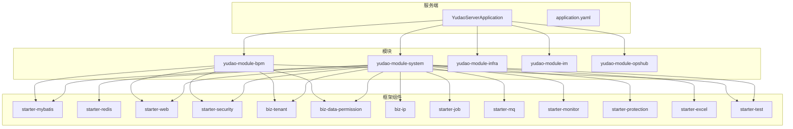
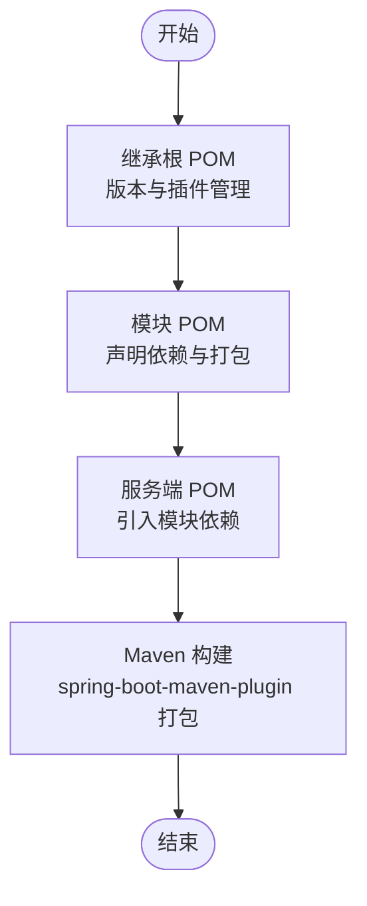
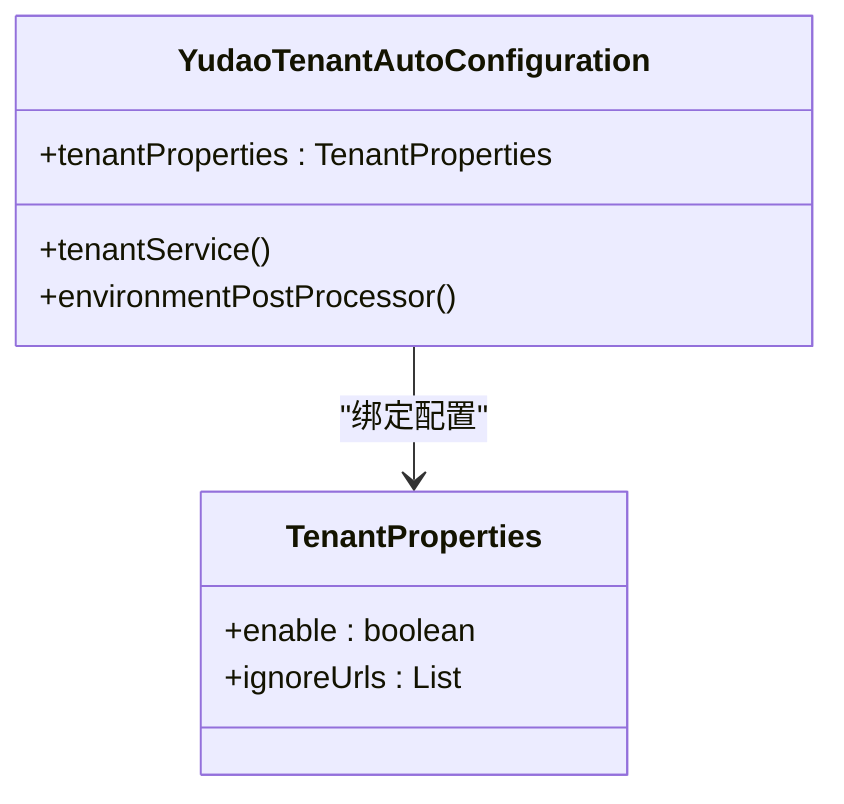
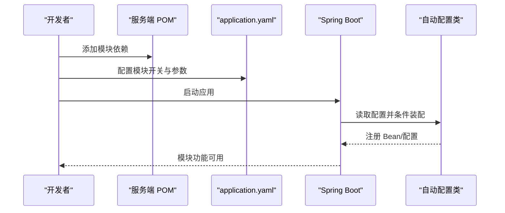
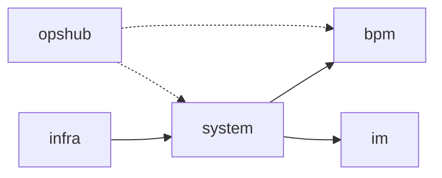
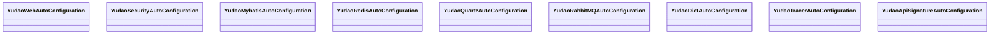

# 新模块创建

<cite>
**本文引用的文件**
- [根 POM（pom.xml）](file://pom.xml)
- [框架聚合 POM（yudao-framework/pom.xml）](file://yudao-framework/pom.xml)
- [服务端聚合 POM（yudao-server/pom.xml）](file://yudao-server/pom.xml)
- [系统模块 POM（yudao-module-system/pom.xml）](file://yudao-module-system/pom.xml)
- [流程模块 POM（yudao-module-bpm/pom.xml）](file://yudao-module-bpm/pom.xml)
- [服务端应用配置（application.yaml）](file://yudao-server/src/main/resources/application.yaml)
- [多租户自动配置（YudaoTenantAutoConfiguration.java）](file://yudao-framework/yudao-spring-boot-starter-biz-tenant/src/main/java/cn/iocoder/yudao/framework/tenant/config/YudaoTenantAutoConfiguration.java)
- [多租户配置属性（TenantProperties.java）](file://yudao-framework/yudao-spring-boot-starter-biz-tenant/src/main/java/cn/iocoder/yudao/framework/tenant/config/TenantProperties.java)
- [Web 自动配置（YudaoWebAutoConfiguration.java）](file://yudao-framework/yudao-spring-boot-starter-web/src/main/java/cn/iocoder/yudao/framework/web/config/YudaoWebAutoConfiguration.java)
- [安全自动配置（YudaoSecurityAutoConfiguration.java）](file://yudao-framework/yudao-spring-boot-starter-security/src/main/java/cn/iocoder/yudao/framework/security/config/YudaoSecurityAutoConfiguration.java)
- [MyBatis 自动配置（YudaoMybatisAutoConfiguration.java）](file://yudao-framework/yudao-spring-boot-starter-mybatis/src/main/java/cn/iocoder/yudao/framework/mybatis/config/YudaoMybatisAutoConfiguration.java)
- [Redis 自动配置（YudaoRedisAutoConfiguration.java）](file://yudao-framework/yudao-spring-boot-starter-redis/src/main/java/cn/iocoder/yudao/framework/redis/config/YudaoRedisAutoConfiguration.java)
- [作业自动配置（YudaoQuartzAutoConfiguration.java）](file://yudao-framework/yudao-spring-boot-starter-job/src/main/java/cn/iocoder/yudao/framework/quartz/config/YudaoQuartzAutoConfiguration.java)
- [消息队列自动配置（YudaoRabbitMQAutoConfiguration.java）](file://yudao-framework/yudao-spring-boot-starter-mq/src/main/java/cn/iocoder/yudao/framework/mq/rabbitmq/config/YudaoRabbitMQAutoConfiguration.java)
- [Excel 自动配置（YudaoDictAutoConfiguration.java）](file://yudao-framework/yudao-spring-boot-starter-excel/src/main/java/cn/iocoder/yudao/framework/dict/config/YudaoDictAutoConfiguration.java)
- [链路追踪自动配置（YudaoTracerAutoConfiguration.java）](file://yudao-framework/yudao-spring-boot-starter-monitor/src/main/java/cn/iocoder/yudao/framework/tracer/config/YudaoTracerAutoConfiguration.java)
- [API 签名自动配置（YudaoApiSignatureAutoConfiguration.java）](file://yudao-framework/yudao-spring-boot-starter-protection/src/main/java/cn/iocoder/yudao/framework/signature/config/YudaoApiSignatureAutoConfiguration.java)
</cite>

## 目录
1. [简介](#简介)
2. [项目结构](#项目结构)
3. [核心组件](#核心组件)
4. [架构总览](#架构总览)
5. [详细组件分析](#详细组件分析)
6. [依赖分析](#依赖分析)
7. [性能考虑](#性能考虑)
8. [故障排查指南](#故障排查指南)
9. [结论](#结论)
10. [附录](#附录)

## 简介
本指南面向希望在现有多模块工程中新增业务模块的开发者，提供从目录结构、Maven 配置、Spring Boot 自动配置到模块启用与命名规范的完整实践路径。文档结合仓库中已有的模块与框架组件，给出可复用的模板与最佳实践，帮助你快速、规范地创建新模块。

## 项目结构
- 根工程采用父子层级的多模块结构，顶层 POM 负责版本与插件统一管理，yudao-framework 聚合框架组件，yudao-server 聚合业务模块并作为最终可执行的运行容器。
- 业务模块遵循统一的包前缀与目录规范：模块以 yudao-module-xxx 命名，内部按 src/main/java、src/main/resources、src/test 组织代码与资源。
- 服务端通过引入 yudao-module-xxx 依赖实现模块化启用，便于按需裁剪编译与运行体积。

```mermaid
graph TB
Root["根工程<br/>yudao (pom)"] --> Framework["框架聚合<br/>yudao-framework (pom)"]
Root --> Server["服务端聚合<br/>yudao-server (pom)"]
Root --> ModuleSystem["系统模块<br/>yudao-module-system (pom)"]
Root --> ModuleBpm["流程模块<br/>yudao-module-bpm (pom)"]
Framework --> StarterMybatis["MyBatis 组件<br/>yudao-spring-boot-starter-mybatis"]
Framework --> StarterRedis["Redis 组件<br/>yudao-spring-boot-starter-redis"]
Framework --> StarterWeb["Web 组件<br/>yudao-spring-boot-starter-web"]
Framework --> StarterSecurity["安全组件<br/>yudao-spring-boot-starter-security"]
Framework --> StarterBizTenant["业务组件-多租户<br/>yudao-spring-boot-starter-biz-tenant"]
Framework --> StarterBizDataPerm["业务组件-数据权限<br/>yudao-spring-boot-starter-biz-data-permission"]
Framework --> StarterBizIp["业务组件-IP<br/>yudao-spring-boot-starter-biz-ip"]
Framework --> StarterJob["作业组件<br/>yudao-spring-boot-starter-job"]
Framework --> StarterMq["消息队列组件<br/>yudao-spring-boot-starter-mq"]
Framework --> StarterMonitor["监控组件<br/>yudao-spring-boot-starter-monitor"]
Framework --> StarterProtection["防护组件<br/>yudao-spring-boot-starter-protection"]
Framework --> StarterExcel["Excel 组件<br/>yudao-spring-boot-starter-excel"]
Framework --> StarterTest["测试组件<br/>yudao-spring-boot-starter-test"]
```

**图表来源**
- [根 POM（pom.xml）:1-167](file://pom.xml#L1-L167)
- [框架聚合 POM（yudao-framework/pom.xml）:1-47](file://yudao-framework/pom.xml#L1-L47)
- [服务端聚合 POM（yudao-server/pom.xml）:1-188](file://yudao-server/pom.xml#L1-L188)
- [系统模块 POM（yudao-module-system/pom.xml）:1-125](file://yudao-module-system/pom.xml#L1-L125)
- [流程模块 POM（yudao-module-bpm/pom.xml）:1-80](file://yudao-module-bpm/pom.xml#L1-L80)

**章节来源**
- [根 POM（pom.xml）:1-167](file://pom.xml#L1-L167)
- [框架聚合 POM（yudao-framework/pom.xml）:1-47](file://yudao-framework/pom.xml#L1-L47)
- [服务端聚合 POM（yudao-server/pom.xml）:1-188](file://yudao-server/pom.xml#L1-L188)
- [系统模块 POM（yudao-module-system/pom.xml）:1-125](file://yudao-module-system/pom.xml#L1-L125)
- [流程模块 POM（yudao-module-bpm/pom.xml）:1-80](file://yudao-module-bpm/pom.xml#L1-L80)

## 核心组件
- 父 POM 统一版本与插件：集中管理 Java 版本、Spring Boot 版本、MapStruct、Lombok 等，并通过 flatten-maven-plugin 统一修订版本号。
- 框架聚合 POM：聚合各类框架与业务组件，形成可复用的 starter 生态。
- 服务端聚合 POM：按需引入 yudao-module-xxx，作为最终打包运行的容器。
- 业务模块 POM：声明对框架组件与其它模块的依赖，保持最小必要依赖集。

**章节来源**
- [根 POM（pom.xml）:39-65](file://pom.xml#L39-L65)
- [框架聚合 POM（yudao-framework/pom.xml）:12-31](file://yudao-framework/pom.xml#L12-L31)
- [服务端聚合 POM（yudao-server/pom.xml）:23-165](file://yudao-server/pom.xml#L23-L165)
- [系统模块 POM（yudao-module-system/pom.xml）:20-122](file://yudao-module-system/pom.xml#L20-L122)

## 架构总览
新模块应遵循以下架构原则：
- 模块边界清晰：按业务域划分，避免跨模块循环依赖。
- 依赖方向单一：模块仅向上游依赖，下游模块通过服务端聚合引入。
- 自动配置就地：框架组件通过 Spring Boot 自动配置实现零样板代码接入。
- 配置可开关：通过 application.yaml 控制模块功能开关与运行环境差异。

**图表来源**
- [服务端聚合 POM（yudao-server/pom.xml）:23-165](file://yudao-server/pom.xml#L23-L165)
- [系统模块 POM（yudao-module-system/pom.xml）:20-122](file://yudao-module-system/pom.xml#L20-L122)
- [流程模块 POM（yudao-module-bpm/pom.xml）:23-78](file://yudao-module-bpm/pom.xml#L23-L78)
- [框架聚合 POM（yudao-framework/pom.xml）:12-31](file://yudao-framework/pom.xml#L12-L31)

## 详细组件分析

### 目录结构规范
- 模块目录建议
  - src/main/java：Java 源码
  - src/main/resources：配置文件、SQL、静态资源
  - src/test/java：单元测试
- 包命名建议
  - 模块包前缀：cn.iocoder.yudao.module.<modulename>
  - 控制器、服务、持久层、枚举、转换器等按职责分包
- 资源组织
  - 配置文件按环境拆分，如 application-dev.yaml
  - SQL 放置于模块 resources/sql 下，便于单元测试与初始化

**章节来源**
- [系统模块 POM（yudao-module-system/pom.xml）:1-125](file://yudao-module-system/pom.xml#L1-L125)
- [流程模块 POM（yudao-module-bpm/pom.xml）:1-80](file://yudao-module-bpm/pom.xml#L1-L80)

### Maven 依赖配置要点
- 父 POM 继承
  - 子模块继承根 POM，自动获得版本与插件管理
- 依赖声明
  - 在模块 POM 中声明对 yudao-spring-boot-starter-* 与其它 yudao-module-* 的依赖
  - 服务端 POM 通过依赖引入模块，实现按需启用
- 版本管理
  - 使用 ${revision} 统一版本，确保模块间一致性
- 打包配置
  - 模块打包为 jar，服务端通过 spring-boot-maven-plugin 打包可执行 fat jar

**图表来源**
- [根 POM（pom.xml）:6-10](file://pom.xml#L6-L10)
- [系统模块 POM（yudao-module-system/pom.xml）:20-122](file://yudao-module-system/pom.xml#L20-L122)
- [服务端聚合 POM（yudao-server/pom.xml）:23-165](file://yudao-server/pom.xml#L23-L165)

**章节来源**
- [根 POM（pom.xml）:6-10](file://pom.xml#L6-L10)
- [系统模块 POM（yudao-module-system/pom.xml）:20-122](file://yudao-module-system/pom.xml#L20-L122)
- [服务端聚合 POM（yudao-server/pom.xml）:167-185](file://yudao-server/pom.xml#L167-L185)

### Spring Boot 自动配置开发
- 自动配置类位置
  - 位于 yudao-spring-boot-starter-* 模块的 config 包下，命名规则为 YudaoXxxAutoConfiguration
- 关键注解与机制
  - @ConditionalOnProperty：根据配置开关条件装配
  - @EnableConfigurationProperties：绑定配置属性类
  - @Import：导入额外的配置类或注册 Bean
- 典型实现步骤
  - 定义配置属性类（如 TenantProperties）
  - 编写自动配置类（如 YudaoTenantAutoConfiguration），在 META-INF/spring 或 spring.factories 中声明
  - 在模块 POM 中引入对应 starter，即可自动生效

**图表来源**
- [多租户配置属性（TenantProperties.java）](file://yudao-framework/yudao-spring-boot-starter-biz-tenant/src/main/java/cn/iocoder/yudao/framework/tenant/config/TenantProperties.java)
- [多租户自动配置（YudaoTenantAutoConfiguration.java）](file://yudao-framework/yudao-spring-boot-starter-biz-tenant/src/main/java/cn/iocoder/yudao/framework/tenant/config/YudaoTenantAutoConfiguration.java)

**章节来源**
- [多租户自动配置（YudaoTenantAutoConfiguration.java）](file://yudao-framework/yudao-spring-boot-starter-biz-tenant/src/main/java/cn/iocoder/yudao/framework/tenant/config/YudaoTenantAutoConfiguration.java)
- [多租户配置属性（TenantProperties.java）](file://yudao-framework/yudao-spring-boot-starter-biz-tenant/src/main/java/cn/iocoder/yudao/framework/tenant/config/TenantProperties.java)

### 模块启用配置
- application.yaml 中的模块开关
  - 通过 yudao.tenant.enable、yudao.websocket.enable 等键控制功能开关
  - 通过 profiles.active 切换开发/本地/生产环境
- 包扫描与条件注解
  - 服务端通过 @ComponentScan 或自动配置的 @Import 实现包扫描
  - 条件注解如 @ConditionalOnProperty、@ConditionalOnMissingBean 控制 Bean 注册
- 启用流程
  - 在服务端 POM 中引入目标模块依赖
  - 在 application.yaml 中开启相关配置项
  - 启动服务端应用，模块自动装配生效

**图表来源**
- [服务端聚合 POM（yudao-server/pom.xml）:23-165](file://yudao-server/pom.xml#L23-L165)
- [服务端应用配置（application.yaml）:1-354](file://yudao-server/src/main/resources/application.yaml#L1-L354)
- [多租户自动配置（YudaoTenantAutoConfiguration.java）](file://yudao-framework/yudao-spring-boot-starter-biz-tenant/src/main/java/cn/iocoder/yudao/framework/tenant/config/YudaoTenantAutoConfiguration.java)

**章节来源**
- [服务端应用配置（application.yaml）:1-354](file://yudao-server/src/main/resources/application.yaml#L1-L354)
- [服务端聚合 POM（yudao-server/pom.xml）:23-165](file://yudao-server/pom.xml#L23-L165)

### 模块命名规范
- 模块前缀
  - yudao-module-<业务域>，如 yudao-module-system、yudao-module-bpm
- 包名结构
  - cn.iocoder.yudao.module.<modulename>
  - 按层次分包：controller、service、dal、enums、convert、framework 等
- 类名规范
  - 自动配置类：YudaoXxxAutoConfiguration
  - 配置属性类：XxxProperties
  - 业务服务类：XxxServiceImpl
  - 控制器：XxxController
  - 转换器：XxxConvert

**章节来源**
- [系统模块 POM（yudao-module-system/pom.xml）:1-125](file://yudao-module-system/pom.xml#L1-L125)
- [流程模块 POM（yudao-module-bpm/pom.xml）:1-80](file://yudao-module-bpm/pom.xml#L1-L80)
- [多租户自动配置（YudaoTenantAutoConfiguration.java）](file://yudao-framework/yudao-spring-boot-starter-biz-tenant/src/main/java/cn/iocoder/yudao/framework/tenant/config/YudaoTenantAutoConfiguration.java)
- [多租户配置属性（TenantProperties.java）](file://yudao-framework/yudao-spring-boot-starter-biz-tenant/src/main/java/cn/iocoder/yudao/framework/tenant/config/TenantProperties.java)

### 模块间依赖关系
- 依赖方向
  - yudao-module-system 依赖 yudao-module-infra 与多个 starter
  - yudao-module-bpm 依赖 system 与多个 starter
- 循环依赖避免
  - 通过抽象接口与事件解耦，避免直接互相引用
  - 使用消息队列或异步事件降低耦合
- 接口契约设计
  - 明确对外暴露的 API 与 DTO，避免内部实现泄露
  - 使用统一的异常与响应模型

**图表来源**
- [系统模块 POM（yudao-module-system/pom.xml）:20-122](file://yudao-module-system/pom.xml#L20-L122)
- [流程模块 POM（yudao-module-bpm/pom.xml）:23-78](file://yudao-module-bpm/pom.xml#L23-L78)
- [服务端聚合 POM（yudao-server/pom.xml）:23-165](file://yudao-server/pom.xml#L23-L165)

**章节来源**
- [系统模块 POM（yudao-module-system/pom.xml）:20-122](file://yudao-module-system/pom.xml#L20-L122)
- [流程模块 POM（yudao-module-bpm/pom.xml）:23-78](file://yudao-module-bpm/pom.xml#L23-L78)
- [服务端聚合 POM（yudao-server/pom.xml）:23-165](file://yudao-server/pom.xml#L23-L165)

## 依赖分析
- 依赖注入与装配
  - 自动配置类通过 @EnableConfigurationProperties 绑定配置属性
  - 通过 @ConditionalOnProperty 控制 Bean 注册
- 典型组件样例
  - Web：YudaoWebAutoConfiguration
  - 安全：YudaoSecurityAutoConfiguration
  - MyBatis：YudaoMybatisAutoConfiguration
  - Redis：YudaoRedisAutoConfiguration
  - 作业：YudaoQuartzAutoConfiguration
  - MQ：YudaoRabbitMQAutoConfiguration
  - Excel：YudaoDictAutoConfiguration
  - 链路追踪：YudaoTracerAutoConfiguration
  - API 签名：YudaoApiSignatureAutoConfiguration

**图表来源**
- [Web 自动配置（YudaoWebAutoConfiguration.java）](file://yudao-framework/yudao-spring-boot-starter-web/src/main/java/cn/iocoder/yudao/framework/web/config/YudaoWebAutoConfiguration.java)
- [安全自动配置（YudaoSecurityAutoConfiguration.java）](file://yudao-framework/yudao-spring-boot-starter-security/src/main/java/cn/iocoder/yudao/framework/security/config/YudaoSecurityAutoConfiguration.java)
- [MyBatis 自动配置（YudaoMybatisAutoConfiguration.java）](file://yudao-framework/yudao-spring-boot-starter-mybatis/src/main/java/cn/iocoder/yudao/framework/mybatis/config/YudaoMybatisAutoConfiguration.java)
- [Redis 自动配置（YudaoRedisAutoConfiguration.java）](file://yudao-framework/yudao-spring-boot-starter-redis/src/main/java/cn/iocoder/yudao/framework/redis/config/YudaoRedisAutoConfiguration.java)
- [作业自动配置（YudaoQuartzAutoConfiguration.java）](file://yudao-framework/yudao-spring-boot-starter-job/src/main/java/cn/iocoder/yudao/framework/quartz/config/YudaoQuartzAutoConfiguration.java)
- [消息队列自动配置（YudaoRabbitMQAutoConfiguration.java）](file://yudao-framework/yudao-spring-boot-starter-mq/src/main/java/cn/iocoder/yudao/framework/mq/rabbitmq/config/YudaoRabbitMQAutoConfiguration.java)
- [Excel 自动配置（YudaoDictAutoConfiguration.java）](file://yudao-framework/yudao-spring-boot-starter-excel/src/main/java/cn/iocoder/yudao/framework/dict/config/YudaoDictAutoConfiguration.java)
- [链路追踪自动配置（YudaoTracerAutoConfiguration.java）](file://yudao-framework/yudao-spring-boot-starter-monitor/src/main/java/cn/iocoder/yudao/framework/tracer/config/YudaoTracerAutoConfiguration.java)
- [API 签名自动配置（YudaoApiSignatureAutoConfiguration.java）](file://yudao-framework/yudao-spring-boot-starter-protection/src/main/java/cn/iocoder/yudao/framework/signature/config/YudaoApiSignatureAutoConfiguration.java)

**章节来源**
- [Web 自动配置（YudaoWebAutoConfiguration.java）](file://yudao-framework/yudao-spring-boot-starter-web/src/main/java/cn/iocoder/yudao/framework/web/config/YudaoWebAutoConfiguration.java)
- [安全自动配置（YudaoSecurityAutoConfiguration.java）](file://yudao-framework/yudao-spring-boot-starter-security/src/main/java/cn/iocoder/yudao/framework/security/config/YudaoSecurityAutoConfiguration.java)
- [MyBatis 自动配置（YudaoMybatisAutoConfiguration.java）](file://yudao-framework/yudao-spring-boot-starter-mybatis/src/main/java/cn/iocoder/yudao/framework/mybatis/config/YudaoMybatisAutoConfiguration.java)
- [Redis 自动配置（YudaoRedisAutoConfiguration.java）](file://yudao-framework/yudao-spring-boot-starter-redis/src/main/java/cn/iocoder/yudao/framework/redis/config/YudaoRedisAutoConfiguration.java)
- [作业自动配置（YudaoQuartzAutoConfiguration.java）](file://yudao-framework/yudao-spring-boot-starter-job/src/main/java/cn/iocoder/yudao/framework/quartz/config/YudaoQuartzAutoConfiguration.java)
- [消息队列自动配置（YudaoRabbitMQAutoConfiguration.java）](file://yudao-framework/yudao-spring-boot-starter-mq/src/main/java/cn/iocoder/yudao/framework/mq/rabbitmq/config/YudaoRabbitMQAutoConfiguration.java)
- [Excel 自动配置（YudaoDictAutoConfiguration.java）](file://yudao-framework/yudao-spring-boot-starter-excel/src/main/java/cn/iocoder/yudao/framework/dict/config/YudaoDictAutoConfiguration.java)
- [链路追踪自动配置（YudaoTracerAutoConfiguration.java）](file://yudao-framework/yudao-spring-boot-starter-monitor/src/main/java/cn/iocoder/yudao/framework/tracer/config/YudaoTracerAutoConfiguration.java)
- [API 签名自动配置（YudaoApiSignatureAutoConfiguration.java）](file://yudao-framework/yudao-spring-boot-starter-protection/src/main/java/cn/iocoder/yudao/framework/signature/config/YudaoApiSignatureAutoConfiguration.java)

## 性能考虑
- 启动性能
  - 通过注释掉非必要模块依赖，减少编译与启动时间
  - 合理使用 @ConditionalOnProperty 控制非关键功能加载
- 运行性能
  - 使用 Redis 缓存与连接池配置，避免频繁 IO
  - 启用必要的异步任务与消息队列，降低请求延迟
- 监控与可观测性
  - 启用链路追踪与指标采集，定位性能瓶颈

**章节来源**
- [服务端聚合 POM（yudao-server/pom.xml）:35-144](file://yudao-server/pom.xml#L35-L144)
- [链路追踪自动配置（YudaoTracerAutoConfiguration.java）](file://yudao-framework/yudao-spring-boot-starter-monitor/src/main/java/cn/iocoder/yudao/framework/tracer/config/YudaoTracerAutoConfiguration.java)

## 故障排查指南
- 自动配置未生效
  - 检查 application.yaml 中的开关配置
  - 确认模块 starter 已正确引入
- Bean 注册冲突
  - 使用 @Primary、@ConditionalOnMissingBean 控制优先级
  - 检查是否存在重复定义
- 配置属性未绑定
  - 确认 @EnableConfigurationProperties 已声明
  - 检查配置键名与驼峰命名一致

**章节来源**
- [服务端应用配置（application.yaml）:1-354](file://yudao-server/src/main/resources/application.yaml#L1-L354)
- [多租户自动配置（YudaoTenantAutoConfiguration.java）](file://yudao-framework/yudao-spring-boot-starter-biz-tenant/src/main/java/cn/iocoder/yudao/framework/tenant/config/YudaoTenantAutoConfiguration.java)

## 结论
通过遵循本指南的目录结构、Maven 配置、自动配置与启用流程，以及模块命名与依赖约束，你可以高效、规范地在现有工程中创建新模块。建议先以最小可行模块起步，逐步引入框架组件与依赖，确保模块边界清晰、配置可开关、依赖无环。

## 附录
- 快速检查清单
  - 目录结构：src/main/java、src/main/resources、src/test
  - POM 继承与依赖：继承根 POM，声明对 starter 与其它模块的依赖
  - 自动配置：编写 YudaoXxxAutoConfiguration 与 XxxProperties
  - 启用配置：在 application.yaml 中开启相关开关
  - 依赖关系：避免循环依赖，明确接口契约