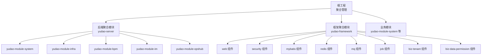
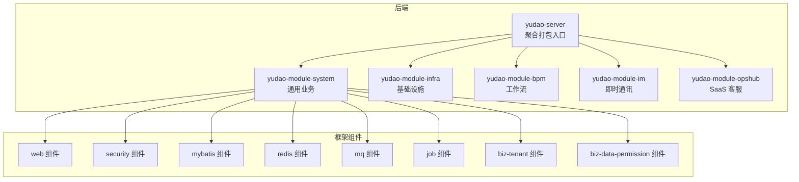
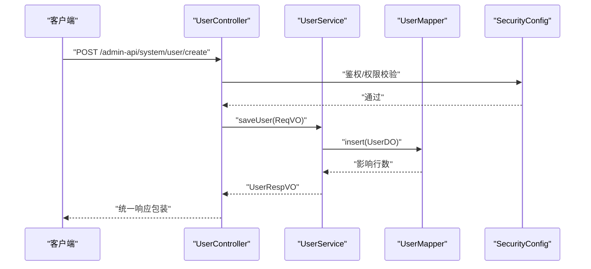
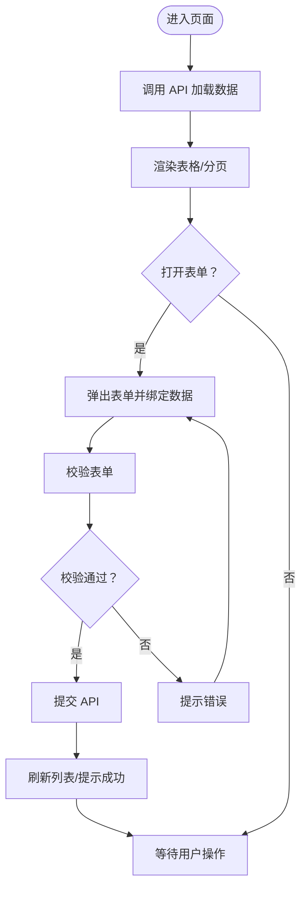
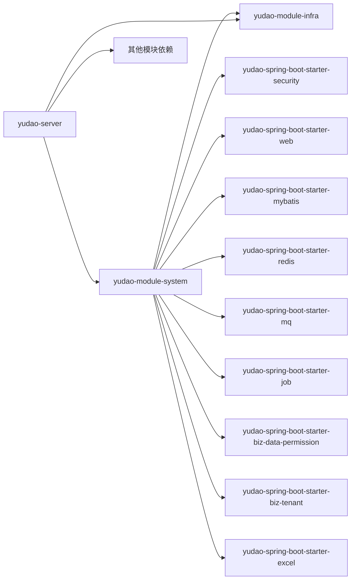

# 模块扩展

<cite>
**本文引用的文件**
- [根 POM（聚合）](file://pom.xml)
- [后端聚合模块 POM（yudao-server）](file://yudao-server/pom.xml)
- [后端应用配置（application.yaml）](file://yudao-server/src/main/resources/application.yaml)
- [框架聚合模块 POM（yudao-framework）](file://yudao-framework/pom.xml)
- [系统模块 POM（yudao-module-system）](file://yudao-module-system/pom.xml)
- [系统模块控制器示例（用户管理）](file://yudao-module-system/src/main/java/cn/iocoder/yudao/module/system/controller/admin/UserController.java)
- [系统模块服务示例（用户服务）](file://yudao-module-system/src/main/java/cn/iocoder/yudao/module/system/service/user/UserServiceImpl.java)
- [系统模块数据访问对象示例（用户 DO）](file://yudao-module-system/src/main/java/cn/iocoder/yudao/module/system/dal/dataobject/user/UserDO.java)
- [系统模块枚举与错误码示例（ErrorCodeConstants）](file://yudao-module-system/src/main/java/cn/iocoder/yudao/module/system/enums/ErrorCodeConstants.java)
- [系统模块安全配置（SecurityConfig）](file://yudao-module-system/src/main/java/cn/iocoder/yudao/module/system/framework/security/config/SecurityConfig.java)
- [系统模块 Web 配置（WebMvcConfig）](file://yudao-module-system/src/main/java/cn/iocoder/yudao/module/system/framework/web/WebMvcConfig.java)
- [系统模块数据权限组件（AutoConfiguration.imports）](file://yudao-framework/yudao-spring-boot-starter-biz-data-permission/src/main/resources/META-INF/spring/org.springframework.boot.autoconfigure.AutoConfiguration.imports)
- [系统模块 Web 组件（AutoConfiguration.imports）](file://yudao-framework/yudao-spring-boot-starter-web/src/main/resources/META-INF/spring/org.springframework.boot.autoconfigure.AutoConfiguration.imports)
- [系统模块安全组件（AutoConfiguration.imports）](file://yudao-framework/yudao-spring-boot-starter-security/src/main/resources/META-INF/spring/org.springframework.boot.autoconfigure.AutoConfiguration.imports)
- [系统模块定时任务组件（AutoConfiguration.imports）](file://yudao-framework/yudao-spring-boot-starter-job/src/main/resources/META-INF/spring/org.springframework.boot.autoconfigure.AutoConfiguration.imports)
- [系统模块消息队列组件（AutoConfiguration.imports）](file://yudao-framework/yudao-spring-boot-starter-mq/src/main/resources/META-INF/spring/org.springframework.boot.autoconfigure.AutoConfiguration.imports)
- [系统模块 MyBatis 组件（AutoConfiguration.imports）](file://yudao-framework/yudao-spring-boot-starter-mybatis/src/main/resources/META-INF/spring/org.springframework.boot.autoconfigure.AutoConfiguration.imports)
- [系统模块 Redis 组件（AutoConfiguration.imports）](file://yudao-framework/yudao-spring-boot-starter-redis/src/main/resources/META-INF/spring/org.springframework.boot.autoconfigure.AutoConfiguration.imports)
- [前端路由与 API（yudao-ui-admin-vue3）](file://yudao-ui/yudao-ui-admin-vue3/src/router/index.ts)
- [前端 Axios 配置（yudao-ui-admin-vue3）](file://yudao-ui/yudao-ui-admin-vue3/src/config/axios/config.ts)
- [前端权限指令（yudao-ui-admin-vue3）](file://yudao-ui/yudao-ui-admin-vue3/src/directives/permission/index.ts)
- [前端页面示例（用户列表）](file://yudao-ui/yudao-ui-admin-vue3/src/views/system/user/UserList.vue)
- [前端 API 封装（用户 API）](file://yudao-ui/yudao-ui-admin-vue3/src/api/system/user/index.ts)
</cite>

## 目录
1. [简介](#简介)
2. [项目结构](#项目结构)
3. [核心组件](#核心组件)
4. [架构总览](#架构总览)
5. [详细组件分析](#详细组件分析)
6. [依赖分析](#依赖分析)
7. [性能考虑](#性能考虑)
8. [故障排查指南](#故障排查指南)
9. [结论](#结论)
10. [附录](#附录)

## 简介
本文件面向希望在芋道 Ruoyi-Vue-Pro 基础上新增模块的开发者，提供从“模块创建—POM 依赖—Spring Boot 自动配置—模块启用—接口设计—数据库表—前端页面—模块间通信—配置管理—测试策略”的全流程指导。文档结合现有 yudao-module-system、yudao-server、yudao-framework 等模块的实际实现，给出可复用的最佳实践。

## 项目结构
- 根级聚合工程统一管理版本与插件，模块按领域拆分，后端通过 yudao-server 聚合打包对外提供 API。
- yudao-framework 提供通用技术组件（Web、Security、MyBatis、Redis、MQ、Job、Excel、测试等），模块按需引入。
- yudao-module-system 作为通用业务模块，依赖 infra 与多个 framework starter，体现“业务组件 + 技术组件”的组合模式。

图表来源
- [根 POM（聚合）:10-33](file://pom.xml#L10-L33)
- [后端聚合模块 POM（yudao-server）:23-144](file://yudao-server/pom.xml#L23-L144)
- [框架聚合模块 POM（yudao-framework）:12-31](file://yudao-framework/pom.xml#L12-L31)

章节来源
- [根 POM（聚合）:1-167](file://pom.xml#L1-L167)
- [后端聚合模块 POM（yudao-server）:1-188](file://yudao-server/pom.xml#L1-L188)
- [框架聚合模块 POM（yudao-framework）:1-47](file://yudao-framework/pom.xml#L1-L47)

## 核心组件
- 技术组件（starter）：封装常见能力，通过 AutoConfiguration.imports 自动装配，模块仅需引入依赖即可生效。
- 业务模块：围绕具体领域建模，复用 framework starter，形成“业务服务 + 数据访问 + 控制器 + API/VO”的完整闭环。
- 后端聚合：yudao-server 通过依赖声明选择性启用模块，实现“按需装配”。

章节来源
- [系统模块 POM（yudao-module-system）:20-122](file://yudao-module-system/pom.xml#L20-L122)
- [系统模块安全组件（AutoConfiguration.imports）](file://yudao-framework/yudao-spring-boot-starter-security/src/main/resources/META-INF/spring/org.springframework.boot.autoconfigure.AutoConfiguration.imports)
- [系统模块 Web 组件（AutoConfiguration.imports）](file://yudao-framework/yudao-spring-boot-starter-web/src/main/resources/META-INF/spring/org.springframework.boot.autoconfigure.AutoConfiguration.imports)
- [系统模块 MyBatis 组件（AutoConfiguration.imports）](file://yudao-framework/yudao-spring-boot-starter-mybatis/src/main/resources/META-INF/spring/org.springframework.boot.autoconfigure.AutoConfiguration.imports)
- [系统模块 Redis 组件（AutoConfiguration.imports）](file://yudao-framework/yudao-spring-boot-starter-redis/src/main/resources/META-INF/spring/org.springframework.boot.autoconfigure.AutoConfiguration.imports)
- [系统模块消息队列组件（AutoConfiguration.imports）](file://yudao-framework/yudao-spring-boot-starter-mq/src/main/resources/META-INF/spring/org.springframework.boot.autoconfigure.AutoConfiguration.imports)
- [系统模块定时任务组件（AutoConfiguration.imports）](file://yudao-framework/yudao-spring-boot-starter-job/src/main/resources/META-INF/spring/org.springframework.boot.autoconfigure.AutoConfiguration.imports)
- [系统模块数据权限组件（AutoConfiguration.imports）](file://yudao-framework/yudao-spring-boot-starter-biz-data-permission/src/main/resources/META-INF/spring/org.springframework.boot.autoconfigure.AutoConfiguration.imports)

## 架构总览
后端采用“多模块 + starter 组件 + 聚合打包”的架构。模块通过引入 framework starter 获取通用能力，yudao-server 通过依赖声明决定启用哪些模块。

图表来源
- [后端聚合模块 POM（yudao-server）:23-144](file://yudao-server/pom.xml#L23-L144)
- [系统模块 POM（yudao-module-system）:20-122](file://yudao-module-system/pom.xml#L20-L122)
- [框架聚合模块 POM（yudao-framework）:12-31](file://yudao-framework/pom.xml#L12-L31)

## 详细组件分析

### 新模块创建流程（目录结构、POM、自动配置、启用）
- 目录结构建议
  - 模块根 pom.xml：声明 artifactId、描述、依赖 yudao-module-infra 与所需 framework starter。
  - src/main/java：controller、service、dal、convert、enums、framework 等包按层次划分。
  - src/main/resources：SQL、Mapper XML、META-INF/spring/*.imports（如需自动配置）。
  - src/test：单元测试与测试资源。
- POM 依赖
  - 优先引入 yudao-module-infra 与业务/技术组件（如 security、mybatis、redis、mq、job、excel、biz-*）。
  - 在 yudao-server 中以依赖形式启用模块（见“模块启用配置”）。
- Spring Boot 自动配置
  - 若模块需要自动装配，可在 META-INF/spring 添加 AutoConfiguration.imports，声明自动配置类。
  - 也可通过 @Import 或 @Enable* 注解在模块内暴露能力。
- 模块启用配置
  - 在 yudao-server 的 pom.xml 中增加对新模块的依赖，即可在启动时加载。
  - 若模块包含定时任务/消息队列等，确保相应 starter 已引入且配置正确。

章节来源
- [系统模块 POM（yudao-module-system）:20-122](file://yudao-module-system/pom.xml#L20-L122)
- [后端聚合模块 POM（yudao-server）:23-144](file://yudao-server/pom.xml#L23-L144)
- [系统模块安全组件（AutoConfiguration.imports）](file://yudao-framework/yudao-spring-boot-starter-security/src/main/resources/META-INF/spring/org.springframework.boot.autoconfigure.AutoConfiguration.imports)
- [系统模块 Web 组件（AutoConfiguration.imports）](file://yudao-framework/yudao-spring-boot-starter-web/src/main/resources/META-INF/spring/org.springframework.boot.autoconfigure.AutoConfiguration.imports)
- [系统模块 MyBatis 组件（AutoConfiguration.imports）](file://yudao-framework/yudao-spring-boot-starter-mybatis/src/main/resources/META-INF/spring/org.springframework.boot.autoconfigure.AutoConfiguration.imports)
- [系统模块 Redis 组件（AutoConfiguration.imports）](file://yudao-framework/yudao-spring-boot-starter-redis/src/main/resources/META-INF/spring/org.springframework.boot.autoconfigure.AutoConfiguration.imports)
- [系统模块消息队列组件（AutoConfiguration.imports）](file://yudao-framework/yudao-spring-boot-starter-mq/src/main/resources/META-INF/spring/org.springframework.boot.autoconfigure.AutoConfiguration.imports)
- [系统模块定时任务组件（AutoConfiguration.imports）](file://yudao-framework/yudao-spring-boot-starter-job/src/main/resources/META-INF/spring/org.springframework.boot.autoconfigure.AutoConfiguration.imports)
- [系统模块数据权限组件（AutoConfiguration.imports）](file://yudao-framework/yudao-spring-boot-starter-biz-data-permission/src/main/resources/META-INF/spring/org.springframework.boot.autoconfigure.AutoConfiguration.imports)

### 接口设计规范（REST API、请求响应 VO、错误码、权限）
- REST API 设计
  - 控制器按 admin/app 分层，路径前缀统一为 /admin-api/{模块}/{业务}，遵循现有 UserController 的风格。
  - 请求参数使用 VO/DTO，响应统一使用统一响应包装（参考 yudao-server 的全局异常与响应约定）。
- 请求响应 VO
  - 输入/输出 VO 与 DO 映射使用 MapStruct（模块已引入 yudao-spring-boot-starter-mybatis，内部包含 MapStruct 依赖）。
  - VO 层只暴露必要字段，避免泄露敏感信息。
- 错误码定义
  - 按模块定义 ErrorCodeConstants，集中管理错误码与提示语，便于前端统一处理。
- 权限控制
  - 基于 yudao-spring-boot-starter-security，通过 SecurityConfig 配置放行规则与鉴权策略。
  - 控制器方法上使用注解（如 @PreAuthorize）或统一拦截器实现细粒度权限。

图表来源
- [系统模块控制器示例（用户管理）](file://yudao-module-system/src/main/java/cn/iocoder/yudao/module/system/controller/admin/UserController.java)
- [系统模块服务示例（用户服务）](file://yudao-module-system/src/main/java/cn/iocoder/yudao/module/system/service/user/UserServiceImpl.java)
- [系统模块安全配置（SecurityConfig）](file://yudao-module-system/src/main/java/cn/iocoder/yudao/module/system/framework/security/config/SecurityConfig.java)

章节来源
- [系统模块控制器示例（用户管理）](file://yudao-module-system/src/main/java/cn/iocoder/yudao/module/system/controller/admin/UserController.java)
- [系统模块服务示例（用户服务）](file://yudao-module-system/src/main/java/cn/iocoder/yudao/module/system/service/user/UserServiceImpl.java)
- [系统模块枚举与错误码示例（ErrorCodeConstants）](file://yudao-module-system/src/main/java/cn/iocoder/yudao/module/system/enums/ErrorCodeConstants.java)
- [系统模块安全配置（SecurityConfig）](file://yudao-module-system/src/main/java/cn/iocoder/yudao/module/system/framework/security/config/SecurityConfig.java)

### 数据库表设计（表结构、字段、索引、外键）
- 表命名与字段
  - 表名使用小写下划线，字段同名映射驼峰（MyBatis 已开启下划线转驼峰）。
  - 建议统一字段：id、creator、createTime、updater、updateTime、deleted（逻辑删除）。
- 索引规划
  - 唯一索引：保证业务唯一性（如账号、唯一编码）。
  - 普通索引：高频查询字段（如状态、创建时间、租户号）。
- 外键关系
  - 优先使用业务键而非物理外键，配合服务层校验与事务保证一致性。
- 生成与迁移
  - 使用 MyBatis Generator 或代码生成器生成 CRUD 与 Mapper，结合 SQL 脚本维护变更。

章节来源
- [系统模块数据访问对象示例（用户 DO）](file://yudao-module-system/src/main/java/cn/iocoder/yudao/module/system/dal/dataobject/user/UserDO.java)
- [后端应用配置（application.yaml）:66-89](file://yudao-server/src/main/resources/application.yaml#L66-L89)

### 前端页面开发指南（组件结构、API 调用、表单/表格）
- 页面组件结构
  - 采用 Vue 3 + Element Plus，页面位于 views/{module}/{business}，组件位于 components。
- API 调用
  - 通过 axios 封装统一处理请求/响应、错误码、拦截器等。
  - API 文件按模块组织，调用时注入到页面组件中。
- 表单与表格
  - 表单使用 Form 组件，结合校验规则；表格使用 Table 组件，支持分页、排序、筛选。
- 权限与菜单
  - 路由按模块划分，权限通过指令或路由守卫控制。

图表来源
- [前端路由与 API（yudao-ui-admin-vue3）](file://yudao-ui/yudao-ui-admin-vue3/src/router/index.ts)
- [前端 Axios 配置（yudao-ui-admin-vue3）](file://yudao-ui/yudao-ui-admin-vue3/src/config/axios/config.ts)
- [前端页面示例（用户列表）](file://yudao-ui/yudao-ui-admin-vue3/src/views/system/user/UserList.vue)
- [前端 API 封装（用户 API）](file://yudao-ui/yudao-ui-admin-vue3/src/api/system/user/index.ts)

章节来源
- [前端路由与 API（yudao-ui-admin-vue3）](file://yudao-ui/yudao-ui-admin-vue3/src/router/index.ts)
- [前端 Axios 配置（yudao-ui-admin-vue3）](file://yudao-ui/yudao-ui-admin-vue3/src/config/axios/config.ts)
- [前端权限指令（yudao-ui-admin-vue3）](file://yudao-ui/yudao-ui-admin-vue3/src/directives/permission/index.ts)
- [前端页面示例（用户列表）](file://yudao-ui/yudao-ui-admin-vue3/src/views/system/user/UserList.vue)
- [前端 API 封装（用户 API）](file://yudao-ui/yudao-ui-admin-vue3/src/api/system/user/index.ts)

### 模块间通信机制（跨模块 API、事件发布订阅、消息队列）
- 跨模块 API
  - 通过 yudao-module-infra 提供的公共 API/Service 与 DTO，在模块间传递数据。
- 事件发布订阅
  - 使用 Spring 事件机制或消息队列组件（RabbitMQ/Kafka/RocketMQ）实现异步解耦。
- 消息队列集成
  - 在 yudao-server 的 application.yaml 中配置 MQ，模块按需引入 yudao-spring-boot-starter-mq 并编写生产者/消费者。

章节来源
- [后端应用配置（application.yaml）:120-145](file://yudao-server/src/main/resources/application.yaml#L120-L145)
- [系统模块消息队列组件（AutoConfiguration.imports）](file://yudao-framework/yudao-spring-boot-starter-mq/src/main/resources/META-INF/spring/org.springframework.boot.autoconfigure.AutoConfiguration.imports)

### 模块配置管理（配置文件、环境变量、动态配置）
- 配置文件结构
  - application.yaml 下按功能域分段（如 mybatis-plus、rocketmq、kafka、yudao.*），便于维护。
- 环境变量
  - 通过 profiles 切换环境（local/dev/prod），在 yudao-server 中统一管理。
- 动态配置
  - 可结合 Redis/数据库/配置中心实现动态刷新（模块内按需引入）。

章节来源
- [后端应用配置（application.yaml）:1-354](file://yudao-server/src/main/resources/application.yaml#L1-L354)
- [后端聚合模块 POM（yudao-server）:5-6](file://yudao-server/pom.xml#L5-L6)

### 模块测试策略（单元测试、集成测试、性能测试）
- 单元测试
  - 使用 yudao-spring-boot-starter-test 提供的测试配置与工具，覆盖 Service/Controller。
- 集成测试
  - 在模块 test/resources 下提供 application-unit-test.yaml，初始化数据库与依赖。
- 性能测试
  - 使用压测工具对关键接口进行并发与吞吐评估，关注数据库连接池、缓存命中率、MQ 吞吐。

章节来源
- [系统模块 POM（yudao-module-system）:75-81](file://yudao-module-system/pom.xml#L75-L81)
- [系统模块测试资源（application-unit-test.yaml）](file://yudao-module-system/src/test/resources/application-unit-test.yaml)

## 依赖分析
模块依赖遵循“业务模块依赖 infra + 所需 starter”的原则，yudao-server 通过依赖声明控制模块启用范围，降低启动成本。

图表来源
- [系统模块 POM（yudao-module-system）:20-122](file://yudao-module-system/pom.xml#L20-L122)
- [后端聚合模块 POM（yudao-server）:23-144](file://yudao-server/pom.xml#L23-L144)

章节来源
- [系统模块 POM（yudao-module-system）:20-122](file://yudao-module-system/pom.xml#L20-L122)
- [后端聚合模块 POM（yudao-server）:23-144](file://yudao-server/pom.xml#L23-L144)

## 性能考虑
- 启动优化
  - 通过 yudao-server 的依赖选择性启用模块，避免不必要的自动配置与 Bean 创建。
- 数据访问
  - 合理使用缓存（Redis）、分页查询、索引优化；避免 N+1 查询。
- 接口性能
  - 控制响应体大小，必要时使用分页/懒加载；对热点接口做限流与降级。
- 消息队列
  - 合理设置分区/副本与批处理大小，避免阻塞与堆积。

## 故障排查指南
- 启动失败
  - 检查 yudao-server 的依赖是否齐全，模块 POM 依赖是否正确引入。
- 数据库问题
  - 核对 application.yaml 中 mybatis-plus 配置与数据库驱动，确认 Mapper/SQL 是否匹配。
- 权限问题
  - 检查 SecurityConfig 的放行规则与鉴权链路，确认用户角色与菜单权限。
- MQ/事件
  - 校验 application.yaml 中 MQ 配置与消费者组，确认主题/队列是否存在。

章节来源
- [后端应用配置（application.yaml）:66-145](file://yudao-server/src/main/resources/application.yaml#L66-L145)
- [系统模块安全配置（SecurityConfig）](file://yudao-module-system/src/main/java/cn/iocoder/yudao/module/system/framework/security/config/SecurityConfig.java)

## 结论
通过遵循“模块化 + starter 组件 + 聚合打包”的架构，新增模块可以快速复用通用能力并保持一致的开发体验。建议严格遵守接口设计、数据库设计、前端开发与测试规范，确保模块质量与可维护性。

## 附录
- 新模块创建清单
  - 创建模块目录与 pom.xml，引入 yudao-module-infra 与所需 starter。
  - 在 yudao-server 中增加依赖以启用模块。
  - 实现 controller/service/dal/convert/enums，按需引入自动配置。
  - 编写单元测试与集成测试，完善 API 文档与前端页面。
  - 在 application.yaml 中补充模块相关配置，按需启用 MQ/缓存/定时任务等。