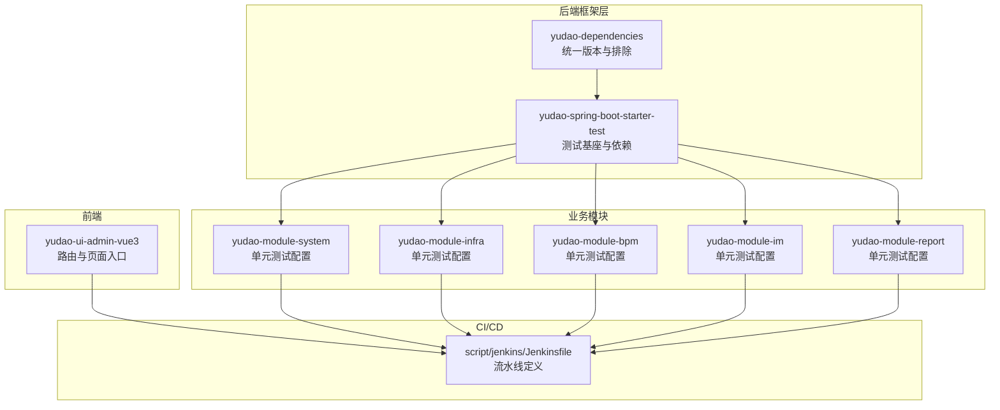
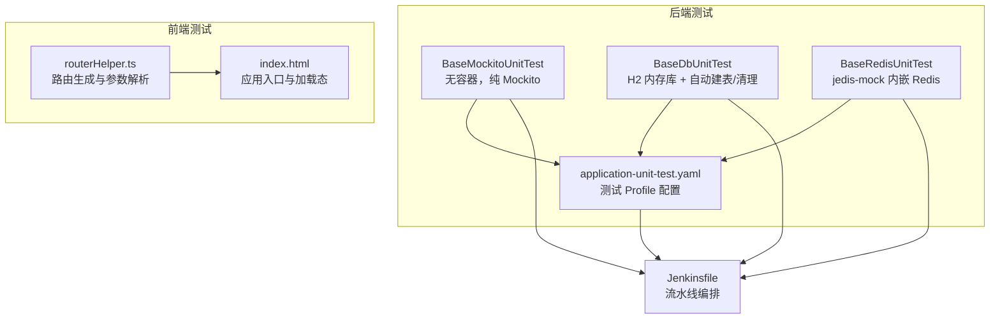
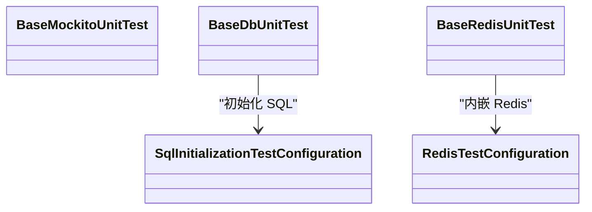
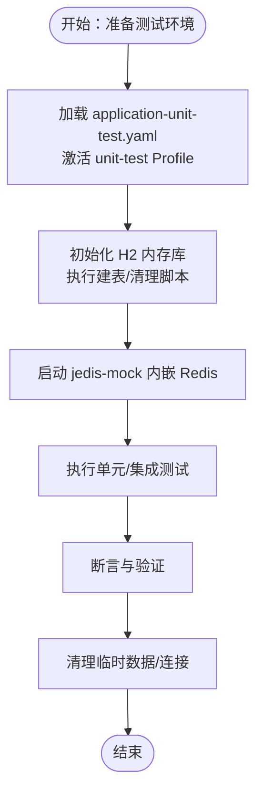
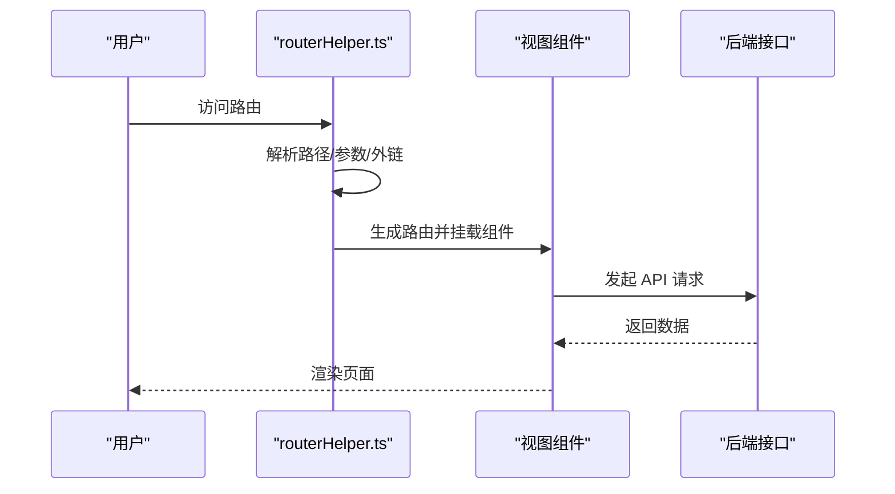
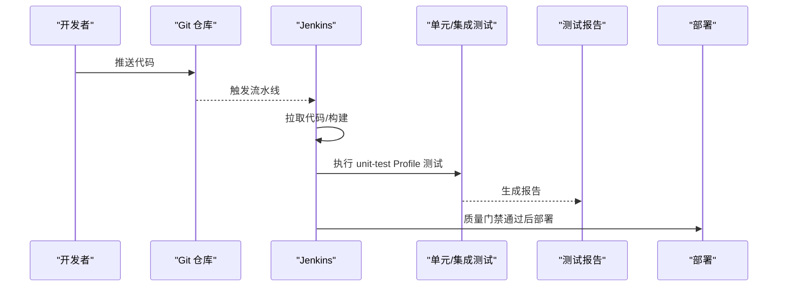
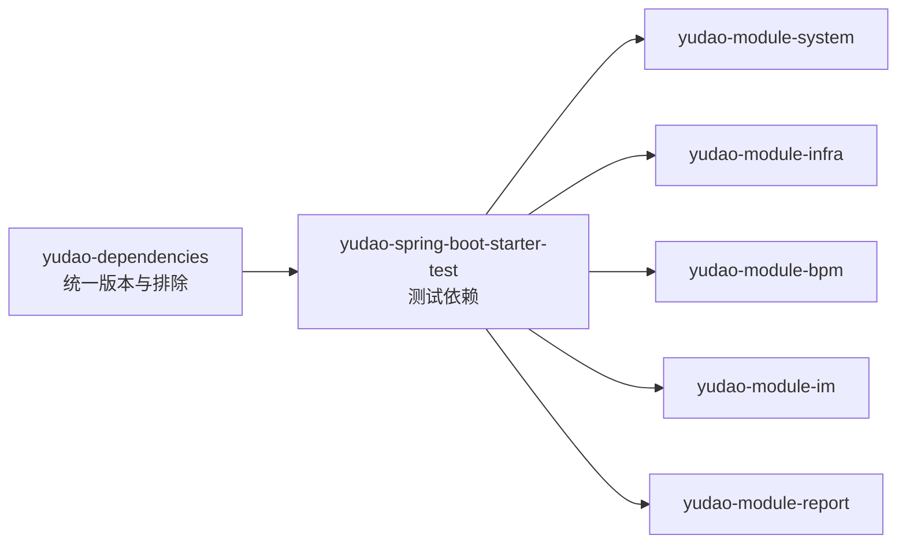

# 模块测试策略

<cite>
**本文引用的文件**
- [RedisTestConfiguration.java](file://yudao-framework/yudao-spring-boot-starter-test/src/main/java/cn/iocoder/yudao/framework/test/config/RedisTestConfiguration.java)
- [pom.xml（yudao-dependencies）](file://yudao-dependencies/pom.xml)
- [AGENTS.md](file://AGENTS.md)
- [pom.xml（yudao-spring-boot-starter-test）](file://yudao-framework/yudao-spring-boot-starter-test/pom.xml)
- [test/serviceTest.vm](file://yudao-module-infra/src/main/resources/codegen/java/test/serviceTest.vm)
- [Jenkinsfile](file://script/jenkins/Jenkinsfile)
- [routerHelper.ts](file://yudao-ui/yudao-ui-admin-vue3/src/utils/routerHelper.ts)
- [index.html](file://yudao-ui/yudao-ui-admin-vue3/index.html)
- [application-unit-test.yaml（系统模块）](file://yudao-module-system/src/test/resources/application-unit-test.yaml)
- [application-unit-test.yaml（基础设施模块）](file://yudao-module-infra/src/test/resources/application-unit-test.yaml)
- [application-unit-test.yaml（流程模块）](file://yudao-module-bpm/src/test/resources/application-unit-test.yaml)
- [application-unit-test.yaml（即时通讯模块）](file://yudao-module-im/src/test/resources/application-unit-test.yaml)
- [application-unit-test.yaml（报表模块）](file://yudao-module-report/src/test/resources/application-unit-test.yaml)
</cite>

## 目录
1. [引言](#引言)
2. [项目结构](#项目结构)
3. [核心组件](#核心组件)
4. [架构总览](#架构总览)
5. [详细组件分析](#详细组件分析)
6. [依赖分析](#依赖分析)
7. [性能考虑](#性能考虑)
8. [故障排查指南](#故障排查指南)
9. [结论](#结论)
10. [附录](#附录)

## 引言
本文件面向后端与前端团队，系统化阐述本项目的测试策略与落地方法，覆盖单元测试、集成测试、前端测试、性能测试、测试数据管理以及持续集成测试流程。目标是统一测试规范、提升测试效率与质量，确保模块在开发与交付过程中的稳定性。

## 项目结构
项目采用多模块 Maven 结构，测试相关能力集中在 yudao-spring-boot-starter-test 模块，并在各业务模块（如系统、基础设施、流程、IM、报表等）中以 unit-test Profile 和测试资源（application-unit-test.yaml、日志配置、SQL 清理脚本）配合执行。

图表来源
- [pom.xml（yudao-spring-boot-starter-test）:35-60](file://yudao-framework/yudao-spring-boot-starter-test/pom.xml#L35-L60)
- [pom.xml（yudao-dependencies）:407-433](file://yudao-dependencies/pom.xml#L407-L433)
- [application-unit-test.yaml（系统模块）](file://yudao-module-system/src/test/resources/application-unit-test.yaml)
- [application-unit-test.yaml（基础设施模块）](file://yudao-module-infra/src/test/resources/application-unit-test.yaml)
- [application-unit-test.yaml（流程模块）](file://yudao-module-bpm/src/test/resources/application-unit-test.yaml)
- [application-unit-test.yaml（即时通讯模块）](file://yudao-module-im/src/test/resources/application-unit-test.yaml)
- [application-unit-test.yaml（报表模块）](file://yudao-module-report/src/test/resources/application-unit-test.yaml)
- [Jenkinsfile:1-35](file://script/jenkins/Jenkinsfile#L1-L35)

章节来源
- [pom.xml（yudao-dependencies）:407-433](file://yudao-dependencies/pom.xml#L407-L433)
- [pom.xml（yudao-spring-boot-starter-test）:35-60](file://yudao-framework/yudao-spring-boot-starter-test/pom.xml#L35-L60)
- [AGENTS.md:122-138](file://AGENTS.md#L122-L138)

## 核心组件
- 测试基座与依赖
  - yudao-spring-boot-starter-test 提供三种测试基类：纯 Mockito 单元测试、依赖数据库的测试（H2 内存库）、依赖 Redis 的测试（jedis-mock）。统一排除 ASM 与 Mockito 版本冲突，引入 H2、jedis-mock、Podam（随机 POJO）等依赖。
  - yudao-dependencies 统一管理 spring-boot-starter-test 版本，并显式排除冲突依赖，保证测试环境一致性。
- 测试 Profile 与配置
  - 各模块测试资源目录包含 application-unit-test.yaml，配合 unit-test Profile 使用，实现最小化测试上下文启动。
- 前端测试基础
  - 前端工程提供路由生成与页面入口，为组件测试、路由测试、UI 测试奠定基础。

章节来源
- [pom.xml（yudao-spring-boot-starter-test）:35-60](file://yudao-framework/yudao-spring-boot-starter-test/pom.xml#L35-L60)
- [pom.xml（yudao-dependencies）:407-433](file://yudao-dependencies/pom.xml#L407-L433)
- [AGENTS.md:122-138](file://AGENTS.md#L122-L138)
- [application-unit-test.yaml（系统模块）](file://yudao-module-system/src/test/resources/application-unit-test.yaml)
- [application-unit-test.yaml（基础设施模块）](file://yudao-module-infra/src/test/resources/application-unit-test.yaml)
- [application-unit-test.yaml（流程模块）](file://yudao-module-bpm/src/test/resources/application-unit-test.yaml)
- [application-unit-test.yaml（即时通讯模块）](file://yudao-module-im/src/test/resources/application-unit-test.yaml)
- [application-unit-test.yaml（报表模块）](file://yudao-module-report/src/test/resources/application-unit-test.yaml)

## 架构总览
后端测试架构围绕“测试基座 + 模块配置”的组合展开，前端测试围绕“路由与页面”展开，CI/CD 通过 Jenkinsfile 统一编排。

图表来源
- [AGENTS.md:122-138](file://AGENTS.md#L122-L138)
- [application-unit-test.yaml（系统模块）](file://yudao-module-system/src/test/resources/application-unit-test.yaml)
- [routerHelper.ts:73-186](file://yudao-ui/yudao-ui-admin-vue3/src/utils/routerHelper.ts#L73-L186)
- [index.html:1-48](file://yudao-ui/yudao-ui-admin-vue3/index.html#L1-L48)
- [Jenkinsfile:1-35](file://script/jenkins/Jenkinsfile#L1-L35)

## 详细组件分析

### 后端单元测试策略（JUnit + Mock + 断言）
- 测试基类选择
  - BaseMockitoUnitTest：无需启动 Spring 容器，适合纯逻辑与工具类测试，速度快。
  - BaseDbUnitTest：需要数据库交互时使用，自动建表与清理，避免跨测试污染。
  - BaseRedisUnitTest：需要缓存交互时使用，使用 jedis-mock 内嵌 Redis。
- JUnit 与 Mockito 使用
  - 使用 Mockito Inline 以支持 final 类与静态方法的 mock。
  - 使用 Podam 随机生成 POJO，提高测试数据准备效率。
- 断言与期望
  - 使用 JUnit 断言与 Mockito verify 验证交互次数与入参。
  - 对返回值与副作用进行断言，确保边界与异常场景覆盖。
- 测试用例设计
  - 正向用例、边界用例、异常用例三层次覆盖。
  - 使用参数化测试与随机数据生成，提升覆盖率。

图表来源
- [pom.xml（yudao-spring-boot-starter-test）:35-60](file://yudao-framework/yudao-spring-boot-starter-test/pom.xml#L35-L60)
- [RedisTestConfiguration.java:12-35](file://yudao-framework/yudao-spring-boot-starter-test/src/main/java/cn/iocoder/yudao/framework/test/config/RedisTestConfiguration.java#L12-L35)

章节来源
- [AGENTS.md:122-138](file://AGENTS.md#L122-L138)
- [pom.xml（yudao-spring-boot-starter-test）:35-60](file://yudao-framework/yudao-spring-boot-starter-test/pom.xml#L35-L60)
- [RedisTestConfiguration.java:12-35](file://yudao-framework/yudao-spring-boot-starter-test/src/main/java/cn/iocoder/yudao/framework/test/config/RedisTestConfiguration.java#L12-L35)

### 集成测试策略（数据库、外部服务、端到端）
- 数据库测试
  - 使用 H2 内存库与自动建表/清理脚本，确保每个测试隔离且可重复。
  - 在 application-unit-test.yaml 中配置最小化数据源与事务策略。
- 外部服务测试
  - 使用内嵌或模拟服务（如 RedisTestConfiguration）替代真实外部依赖，保证测试稳定性。
- 端到端测试
  - 基于前端路由与页面入口，结合后端接口进行端到端验证，确保用户路径闭环。
- 测试环境搭建
  - 通过 unit-test Profile 与 application-unit-test.yaml 快速启动最小化测试环境。

图表来源
- [application-unit-test.yaml（系统模块）](file://yudao-module-system/src/test/resources/application-unit-test.yaml)
- [application-unit-test.yaml（基础设施模块）](file://yudao-module-infra/src/test/resources/application-unit-test.yaml)
- [application-unit-test.yaml（流程模块）](file://yudao-module-bpm/src/test/resources/application-unit-test.yaml)
- [application-unit-test.yaml（即时通讯模块）](file://yudao-module-im/src/test/resources/application-unit-test.yaml)
- [application-unit-test.yaml（报表模块）](file://yudao-module-report/src/test/resources/application-unit-test.yaml)
- [RedisTestConfiguration.java:12-35](file://yudao-framework/yudao-spring-boot-starter-test/src/main/java/cn/iocoder/yudao/framework/test/config/RedisTestConfiguration.java#L12-L35)

章节来源
- [AGENTS.md:122-138](file://AGENTS.md#L122-L138)
- [application-unit-test.yaml（系统模块）](file://yudao-module-system/src/test/resources/application-unit-test.yaml)
- [application-unit-test.yaml（基础设施模块）](file://yudao-module-infra/src/test/resources/application-unit-test.yaml)
- [application-unit-test.yaml（流程模块）](file://yudao-module-bpm/src/test/resources/application-unit-test.yaml)
- [application-unit-test.yaml（即时通讯模块）](file://yudao-module-im/src/test/resources/application-unit-test.yaml)
- [application-unit-test.yaml（报表模块）](file://yudao-module-report/src/test/resources/application-unit-test.yaml)
- [RedisTestConfiguration.java:12-35](file://yudao-framework/yudao-spring-boot-starter-test/src/main/java/cn/iocoder/yudao/framework/test/config/RedisTestConfiguration.java#L12-L35)

### 前端测试实践（组件、路由、API、UI）
- 路由测试
  - 基于 routerHelper.ts 的路由生成逻辑，验证菜单到组件映射、外链与 iframe 场景、动态参数解析等。
- 组件测试
  - 基于组件导出与 props 输入，构造最小化渲染场景，验证 UI 行为与状态变化。
- API 测试
  - 前端通过 axios 服务调用后端接口，可在本地联调阶段结合后端单元测试结果进行契约验证。
- UI 测试
  - 页面入口 index.html 提供加载态与基础样式，确保首屏渲染与错误兜底可见性。

图表来源
- [routerHelper.ts:73-186](file://yudao-ui/yudao-ui-admin-vue3/src/utils/routerHelper.ts#L73-L186)
- [index.html:1-48](file://yudao-ui/yudao-ui-admin-vue3/index.html#L1-L48)

章节来源
- [routerHelper.ts:73-186](file://yudao-ui/yudao-ui-admin-vue3/src/utils/routerHelper.ts#L73-L186)
- [index.html:1-48](file://yudao-ui/yudao-ui-admin-vue3/index.html#L1-L48)

### 性能测试实施（压力、并发、内存、基准）
- 压力与并发
  - 使用压测工具对关键接口进行并发与吞吐测试，观察线程池、连接池与数据库瓶颈。
- 内存泄漏检测
  - 在长时间运行场景下监控堆内存与 GC 行为，结合单元测试中的资源释放验证。
- 性能基准
  - 建立关键路径的基准指标（如平均响应时间、P95/P99），纳入 CI 质量门禁。

[本节为通用指导，不直接分析具体文件]

### 测试数据管理（准备、清理、隔离、同步）
- 测试数据准备
  - 使用 Podam 随机生成 POJO，或在 BaseDbUnitTest 中通过 Mapper 插入样例数据。
- 数据清理
  - application-unit-test.yaml 配合自动建表/清理脚本，确保测试前后数据隔离。
- 数据隔离
  - H2 内存库与 jedis-mock 内嵌 Redis，避免跨进程干扰。
- 环境数据同步
  - 开发/测试环境与测试配置保持一致，避免因配置差异导致的数据行为偏差。

章节来源
- [pom.xml（yudao-spring-boot-starter-test）:35-60](file://yudao-framework/yudao-spring-boot-starter-test/pom.xml#L35-L60)
- [AGENTS.md:122-138](file://AGENTS.md#L122-L138)
- [application-unit-test.yaml（系统模块）](file://yudao-module-system/src/test/resources/application-unit-test.yaml)
- [application-unit-test.yaml（基础设施模块）](file://yudao-module-infra/src/test/resources/application-unit-test.yaml)

### 持续集成测试（流水线、自动化、报告、质量门禁）
- 流水线
  - Jenkinsfile 定义构建、测试与部署步骤，参数化 TAG_NAME，支持多模块统一编排。
- 自动化测试
  - 各模块在 unit-test Profile 下执行测试，确保最小化启动与高并发执行。
- 测试报告
  - 建议输出 JUnit XML 与覆盖率报告，供 CI 查看与归档。
- 质量门禁
  - 设置失败阈值（如测试失败数、覆盖率阈值），未达标则阻断合并与发布。

图表来源
- [Jenkinsfile:1-35](file://script/jenkins/Jenkinsfile#L1-L35)

章节来源
- [Jenkinsfile:1-35](file://script/jenkins/Jenkinsfile#L1-L35)

## 依赖分析
- 测试依赖统一管理
  - yudao-dependencies 排除 spring-boot-starter-test 中的 ASM 与 Mockito 冲突，确保测试稳定。
  - yudao-spring-boot-starter-test 引入 H2、jedis-mock、Podam，支撑各类测试场景。
- 模块间耦合
  - 各业务模块共享测试基座，降低重复配置成本；通过 application-unit-test.yaml 控制测试上下文。

图表来源
- [pom.xml（yudao-dependencies）:407-433](file://yudao-dependencies/pom.xml#L407-L433)
- [pom.xml（yudao-spring-boot-starter-test）:35-60](file://yudao-framework/yudao-spring-boot-starter-test/pom.xml#L35-L60)

章节来源
- [pom.xml（yudao-dependencies）:407-433](file://yudao-dependencies/pom.xml#L407-L433)
- [pom.xml（yudao-spring-boot-starter-test）:35-60](file://yudao-framework/yudao-spring-boot-starter-test/pom.xml#L35-L60)

## 性能考虑
- 测试执行性能
  - 优先使用 BaseMockitoUnitTest 与 H2/jedis-mock，缩短测试时长。
- 数据准备性能
  - 使用 Podam 与批量插入，减少测试准备时间。
- CI 性能
  - 合理拆分模块并行执行，避免串行阻塞。

[本节为通用指导，不直接分析具体文件]

## 故障排查指南
- Redis 启动端口占用
  - RedisTestConfiguration 已处理端口占用问题，若仍失败，检查是否存在多个 Spring 容器未正确停止。
- H2 建表/清理异常
  - 检查 application-unit-test.yaml 中的 SQL 初始化配置与建表脚本是否匹配。
- Mock 行为不符合预期
  - 确认 Mockito Inline 版本与被测类是否为 final，必要时调整测试策略。

章节来源
- [RedisTestConfiguration.java:12-35](file://yudao-framework/yudao-spring-boot-starter-test/src/main/java/cn/iocoder/yudao/framework/test/config/RedisTestConfiguration.java#L12-L35)
- [application-unit-test.yaml（系统模块）](file://yudao-module-system/src/test/resources/application-unit-test.yaml)
- [application-unit-test.yaml（基础设施模块）](file://yudao-module-infra/src/test/resources/application-unit-test.yaml)

## 结论
本项目通过统一的测试基座、标准化的测试 Profile 与完善的依赖管理，实现了后端单元与集成测试的高效落地；前端围绕路由与页面入口形成可验证的测试路径；CI/CD 通过 Jenkinsfile 将测试纳入流水线，形成质量门禁闭环。建议在现有基础上进一步完善性能基准与覆盖率报告，持续提升测试体系成熟度。

## 附录
- 代码生成测试模板
  - 基于 test/serviceTest.vm 自动生成服务层单元测试骨架，结合随机数据与清理逻辑，提升测试一致性与可维护性。

章节来源
- [test/serviceTest.vm:30-68](file://yudao-module-infra/src/main/resources/codegen/java/test/serviceTest.vm#L30-L68)