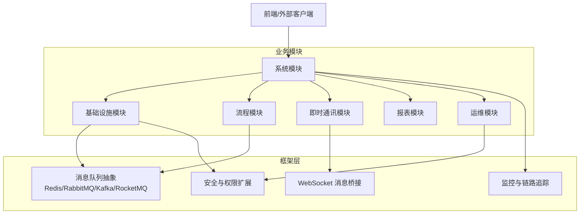
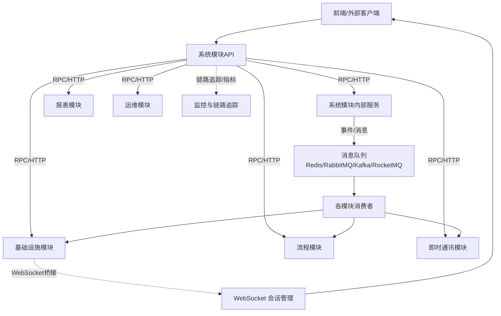
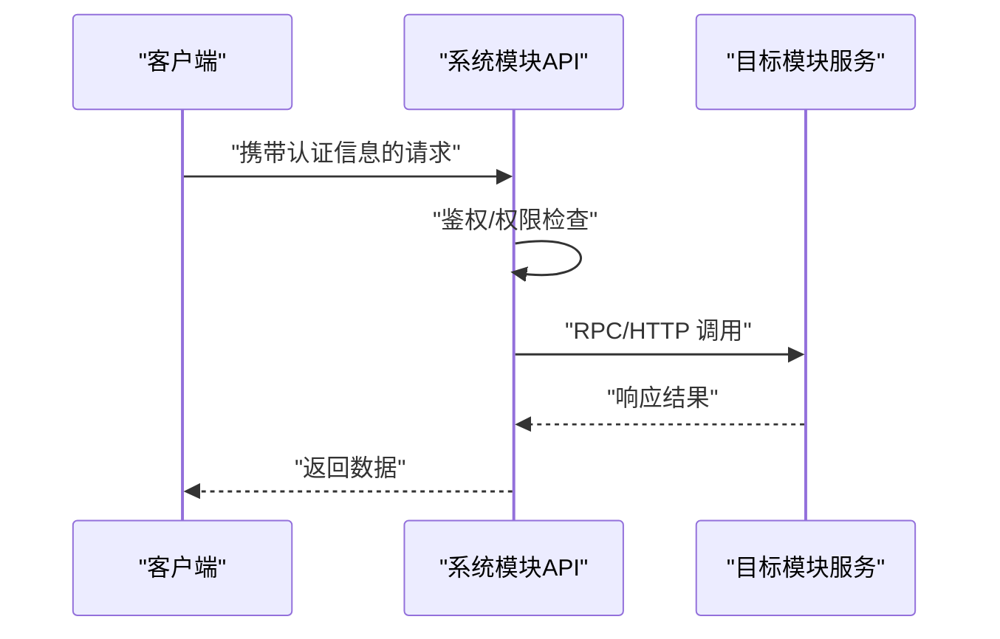
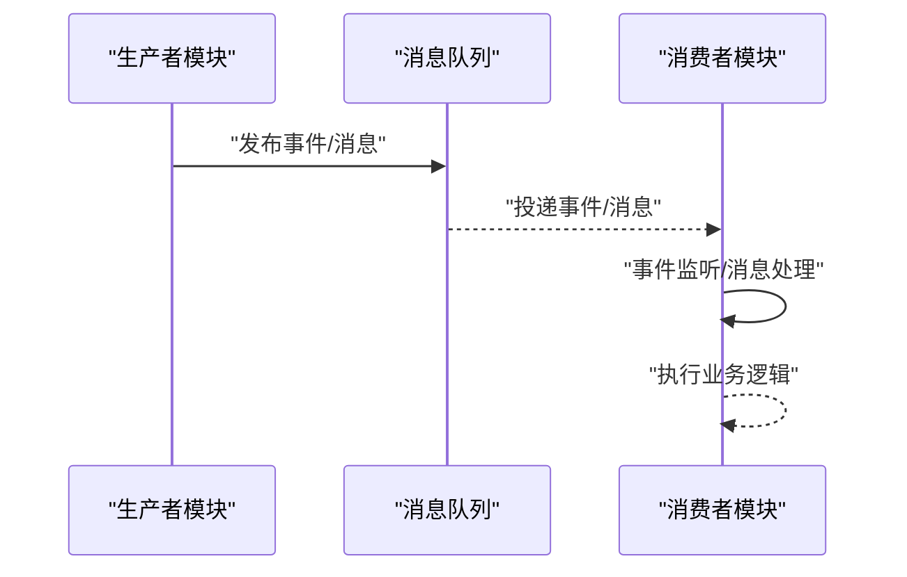
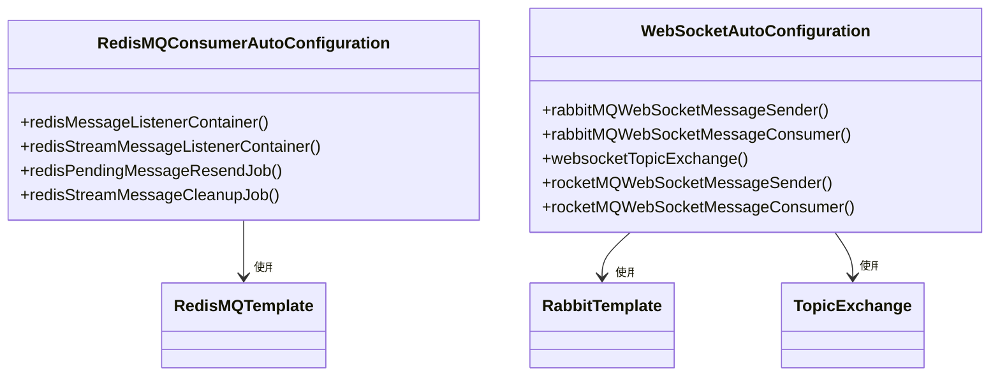
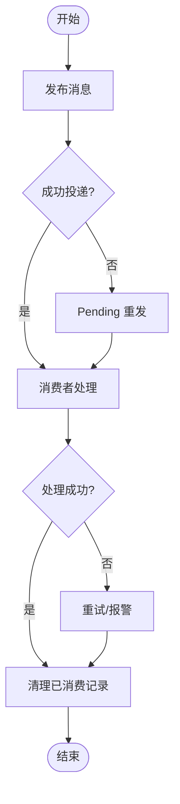
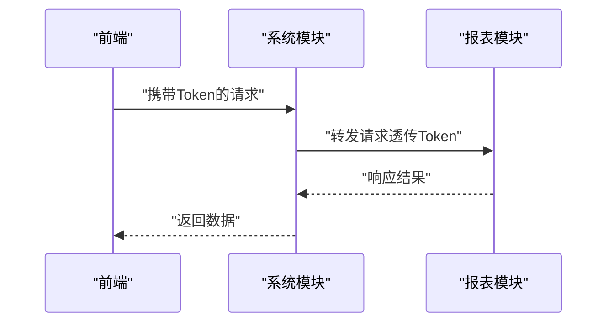
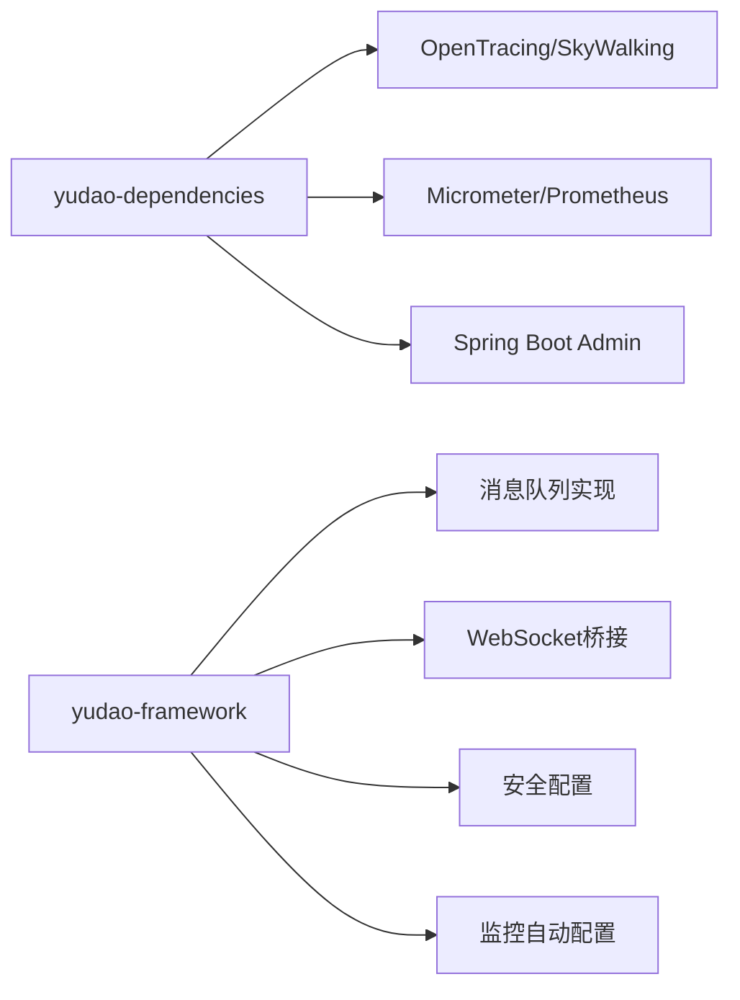

# 模块通信机制

<cite>
**本文引用的文件**
- [RpcConstants.java](file://yudao-framework/yudao-common/src/main/java/cn/iocoder/yudao/framework/common/enums/RpcConstants.java)
- [YudaoRedisMQConsumerAutoConfiguration.java](file://yudao-framework/yudao-spring-boot-starter-mq/src/main/java/cn/iocoder/yudao/framework/mq/redis/config/YudaoRedisMQConsumerAutoConfiguration.java)
- [YudaoWebSocketAutoConfiguration.java](file://yudao-framework/yudao-spring-boot-starter-websocket/src/main/java/cn/iocoder/yudao/framework/websocket/config/YudaoWebSocketAutoConfiguration.java)
- [SecurityConfiguration.java（OpsHub）](file://yudao-module-opshub/src/main/java/cn/iocoder/yudao/module/opshub/framework/security/config/SecurityConfiguration.java)
- [SecurityConfiguration.java（Infra）](file://yudao-module-infra/src/main/java/cn/iocoder/yudao/module/infra/framework/security/config/SecurityConfiguration.java)
- [JmReportTokenServiceImpl.java](file://yudao-module-report/src/main/java/cn/iocoder/yudao/module/report/framework/jmreport/core/service/JmReportTokenServiceImpl.java)
- [pom.xml（yudao-dependencies）](file://yudao-dependencies/pom.xml)
- [pom.xml（yudao-spring-boot-starter-monitor）](file://yudao-framework/yudao-spring-boot-starter-monitor/pom.xml)
- [AbstractEngineConfiguration.java](file://sql/dm/flowable-patch/src/main/java/org/flowable/common/engine/impl/AbstractEngineConfiguration.java)
</cite>

## 目录
1. [引言](#引言)
2. [项目结构](#项目结构)
3. [核心组件](#核心组件)
4. [架构总览](#架构总览)
5. [详细组件分析](#详细组件分析)
6. [依赖关系分析](#依赖关系分析)
7. [性能考量](#性能考量)
8. [故障排查指南](#故障排查指南)
9. [结论](#结论)
10. [附录](#附录)

## 引言
本文件系统化梳理本仓库的模块通信机制，覆盖跨模块API调用（RPC/HTTP）、事件发布订阅（Spring Event与消息队列）、消息队列集成（Redis、RabbitMQ、Kafka、RocketMQ）、模块间数据同步（分布式事务、最终一致、补偿与幂等）、权限控制（跨模块鉴权、Token传递、权限继承）、以及监控追踪（链路追踪、日志聚合、指标采集）。内容以实际代码为依据，配合图示帮助读者快速建立整体认知。

## 项目结构
- 框架层（yudao-framework）提供通用能力：消息队列抽象与多实现（Redis/RabbitMQ/Kafka/RocketMQ）、Websocket消息桥接、监控与链路追踪、安全与权限扩展等。
- 业务模块（如 system、infra、bpm、im、report、opshub 等）基于框架能力进行业务编排，通过API或事件实现跨模块协作。
- 依赖聚合（yudao-dependencies）统一版本与可选依赖（如 OpenTracing/SkyWalking、Micrometer/Prometheus、Spring Boot Admin），便于按需启用。

## 核心组件
- RPC/HTTP 调用约定
  - 统一RPC前缀常量，规范跨模块API路径前缀，便于网关路由与治理。
  - 参考：[RpcConstants.java:15](file://yudao-framework/yudao-common/src/main/java/cn/iocoder/yudao/framework/common/enums/RpcConstants.java#L15)

- 事件与消息队列
  - Redis 消息队列消费者自动装配：注册 Pub/Sub 与 Stream 监听容器，支持广播与分组消费、Pending 重发与清理作业。
  - 参考：[YudaoRedisMQConsumerAutoConfiguration.java:46-62](file://yudao-framework/yudao-spring-boot-starter-mq/src/main/java/cn/iocoder/yudao/framework/mq/redis/config/YudaoRedisMQConsumerAutoConfiguration.java#L46-L62)，[YudaoRedisMQConsumerAutoConfiguration.java:93-129](file://yudao-framework/yudao-spring-boot-starter-mq/src/main/java/cn/iocoder/yudao/framework/mq/redis/config/YudaoRedisMQConsumerAutoConfiguration.java#L93-L129)

- WebSocket 与消息桥接
  - 支持将消息通过 RabbitMQ 或 RocketMQ 发送到 WebSocket，实现跨模块实时通知。
  - 参考：[YudaoWebSocketAutoConfiguration.java:127-162](file://yudao-framework/yudao-spring-boot-starter-websocket/src/main/java/cn/iocoder/yudao/framework/websocket/config/YudaoWebSocketAutoConfiguration.java#L127-L162)

- 权限与安全
  - 各模块安全配置 Bean，统一授权规则定制器；报表模块示例展示如何透传第三方Token到下游API。
  - 参考：[SecurityConfiguration.java（OpsHub）:15-26](file://yudao-module-opshub/src/main/java/cn/iocoder/yudao/module/opshub/framework/security/config/SecurityConfiguration.java#L15-L26)，[SecurityConfiguration.java（Infra）:1-28](file://yudao-module-infra/src/main/java/cn/iocoder/yudao/module/infra/framework/security/config/SecurityConfiguration.java#L1-L28)，[JmReportTokenServiceImpl.java:52-61](file://yudao-module-report/src/main/java/cn/iocoder/yudao/module/report/framework/jmreport/core/service/JmReportTokenServiceImpl.java#L52-L61)

- 监控与链路追踪
  - 依赖项包含 OpenTracing/SkyWalking/Micrometer/Prometheus/SBA 等，按需启用。
  - 参考：[pom.xml（yudao-dependencies）:360-374](file://yudao-dependencies/pom.xml#L360-L374)，[pom.xml（yudao-spring-boot-starter-monitor）:44-76](file://yudao-framework/yudao-spring-boot-starter-monitor/pom.xml#L44-L76)

- 流程引擎事件（概念）
  - Flowable 引擎配置中包含事件分发器初始化逻辑，体现事件驱动思想。
  - 参考：[AbstractEngineConfiguration.java:1828-1866](file://sql/dm/flowable-patch/src/main/java/org/flowable/common/engine/impl/AbstractEngineConfiguration.java#L1828-L1866)

**章节来源**
- [RpcConstants.java:15](file://yudao-framework/yudao-common/src/main/java/cn/iocoder/yudao/framework/common/enums/RpcConstants.java#L15)
- [YudaoRedisMQConsumerAutoConfiguration.java:46-62](file://yudao-framework/yudao-spring-boot-starter-mq/src/main/java/cn/iocoder/yudao/framework/mq/redis/config/YudaoRedisMQConsumerAutoConfiguration.java#L46-L62)
- [YudaoRedisMQConsumerAutoConfiguration.java:93-129](file://yudao-framework/yudao-spring-boot-starter-mq/src/main/java/cn/iocoder/yudao/framework/mq/redis/config/YudaoRedisMQConsumerAutoConfiguration.java#L93-L129)
- [YudaoWebSocketAutoConfiguration.java:127-162](file://yudao-framework/yudao-spring-boot-starter-websocket/src/main/java/cn/iocoder/yudao/framework/websocket/config/YudaoWebSocketAutoConfiguration.java#L127-L162)
- [SecurityConfiguration.java（OpsHub）:15-26](file://yudao-module-opshub/src/main/java/cn/iocoder/yudao/module/opshub/framework/security/config/SecurityConfiguration.java#L15-L26)
- [SecurityConfiguration.java（Infra）:1-28](file://yudao-module-infra/src/main/java/cn/iocoder/yudao/module/infra/framework/security/config/SecurityConfiguration.java#L1-L28)
- [JmReportTokenServiceImpl.java:52-61](file://yudao-module-report/src/main/java/cn/iocoder/yudao/module/report/framework/jmreport/core/service/JmReportTokenServiceImpl.java#L52-L61)
- [pom.xml（yudao-dependencies）:360-374](file://yudao-dependencies/pom.xml#L360-L374)
- [pom.xml（yudao-spring-boot-starter-monitor）:44-76](file://yudao-framework/yudao-spring-boot-starter-monitor/pom.xml#L44-L76)
- [AbstractEngineConfiguration.java:1828-1866](file://sql/dm/flowable-patch/src/main/java/org/flowable/common/engine/impl/AbstractEngineConfiguration.java#L1828-L1866)

## 架构总览
下图展示模块间通信的关键路径：前端/外部客户端通过系统模块发起请求；系统模块调用其他模块API或发布事件；消息队列承载异步解耦；WebSocket 实现实时推送；监控体系贯穿全链路。

**图表来源**
- [YudaoRedisMQConsumerAutoConfiguration.java:46-62](file://yudao-framework/yudao-spring-boot-starter-mq/src/main/java/cn/iocoder/yudao/framework/mq/redis/config/YudaoRedisMQConsumerAutoConfiguration.java#L46-L62)
- [YudaoWebSocketAutoConfiguration.java:127-162](file://yudao-framework/yudao-spring-boot-starter-websocket/src/main/java/cn/iocoder/yudao/framework/websocket/config/YudaoWebSocketAutoConfiguration.java#L127-L162)

## 详细组件分析

### 跨模块API调用（RPC/HTTP）
- 统一前缀
  - 所有RPC API采用统一前缀，便于路由与治理。
  - 参考：[RpcConstants.java:15](file://yudao-framework/yudao-common/src/main/java/cn/iocoder/yudao/framework/common/enums/RpcConstants.java#L15)
- 调用模式
  - 通过HTTP或RPC前缀访问其他模块服务，结合安全配置与权限拦截器完成鉴权与授权。
  - 参考：[SecurityConfiguration.java（OpsHub）:15-26](file://yudao-module-opshub/src/main/java/cn/iocoder/yudao/module/opshub/framework/security/config/SecurityConfiguration.java#L15-L26)

**章节来源**
- [RpcConstants.java:15](file://yudao-framework/yudao-common/src/main/java/cn/iocoder/yudao/framework/common/enums/RpcConstants.java#L15)
- [SecurityConfiguration.java（OpsHub）:15-26](file://yudao-module-opshub/src/main/java/cn/iocoder/yudao/module/opshub/framework/security/config/SecurityConfiguration.java#L15-L26)

### 事件发布与订阅（Spring Event 与消息队列）
- Spring Event
  - 通过事件分发器初始化，支持事件监听与类型化事件绑定，体现事件驱动架构。
  - 参考：[AbstractEngineConfiguration.java:1828-1866](file://sql/dm/flowable-patch/src/main/java/org/flowable/common/engine/impl/AbstractEngineConfiguration.java#L1828-L1866)
- 消息队列
  - Redis 消费者自动装配：注册 Pub/Sub 广播与 Stream 分组消费容器，支持 Pending 重发与清理。
  - 参考：[YudaoRedisMQConsumerAutoConfiguration.java:46-62](file://yudao-framework/yudao-spring-boot-starter-mq/src/main/java/cn/iocoder/yudao/framework/mq/redis/config/YudaoRedisMQConsumerAutoConfiguration.java#L46-L62)，[YudaoRedisMQConsumerAutoConfiguration.java:93-129](file://yudao-framework/yudao-spring-boot-starter-mq/src/main/java/cn/iocoder/yudao/framework/mq/redis/config/YudaoRedisMQConsumerAutoConfiguration.java#L93-L129)

**章节来源**
- [AbstractEngineConfiguration.java:1828-1866](file://sql/dm/flowable-patch/src/main/java/org/flowable/common/engine/impl/AbstractEngineConfiguration.java#L1828-L1866)
- [YudaoRedisMQConsumerAutoConfiguration.java:46-62](file://yudao-framework/yudao-spring-boot-starter-mq/src/main/java/cn/iocoder/yudao/framework/mq/redis/config/YudaoRedisMQConsumerAutoConfiguration.java#L46-L62)
- [YudaoRedisMQConsumerAutoConfiguration.java:93-129](file://yudao-framework/yudao-spring-boot-starter-mq/src/main/java/cn/iocoder/yudao/framework/mq/redis/config/YudaoRedisMQConsumerAutoConfiguration.java#L93-L129)

### 消息队列集成（Redis/RabbitMQ/Kafka/RocketMQ）
- Redis
  - 支持 Pub/Sub 广播与 Stream 分组消费，具备 Pending 重发与清理作业，保障可靠性。
  - 参考：[YudaoRedisMQConsumerAutoConfiguration.java:46-62](file://yudao-framework/yudao-spring-boot-starter-mq/src/main/java/cn/iocoder/yudao/framework/mq/redis/config/YudaoRedisMQConsumerAutoConfiguration.java#L46-L62)，[YudaoRedisMQConsumerAutoConfiguration.java:93-129](file://yudao-framework/yudao-spring-boot-starter-mq/src/main/java/cn/iocoder/yudao/framework/mq/redis/config/YudaoRedisMQConsumerAutoConfiguration.java#L93-L129)
- RabbitMQ/WebSocket
  - WebSocket 消息发送器与接收器基于 RabbitMQ，实现跨模块实时消息桥接。
  - 参考：[YudaoWebSocketAutoConfiguration.java:135-162](file://yudao-framework/yudao-spring-boot-starter-websocket/src/main/java/cn/iocoder/yudao/framework/websocket/config/YudaoWebSocketAutoConfiguration.java#L135-L162)
- Kafka/RocketMQ
  - 框架声明支持 Kafka 与 RocketMQ，具体接入需在业务模块按需引入与配置。

**图表来源**
- [YudaoRedisMQConsumerAutoConfiguration.java:46-62](file://yudao-framework/yudao-spring-boot-starter-mq/src/main/java/cn/iocoder/yudao/framework/mq/redis/config/YudaoRedisMQConsumerAutoConfiguration.java#L46-L62)
- [YudaoRedisMQConsumerAutoConfiguration.java:93-129](file://yudao-framework/yudao-spring-boot-starter-mq/src/main/java/cn/iocoder/yudao/framework/mq/redis/config/YudaoRedisMQConsumerAutoConfiguration.java#L93-L129)
- [YudaoWebSocketAutoConfiguration.java:127-162](file://yudao-framework/yudao-spring-boot-starter-websocket/src/main/java/cn/iocoder/yudao/framework/websocket/config/YudaoWebSocketAutoConfiguration.java#L127-L162)

**章节来源**
- [YudaoRedisMQConsumerAutoConfiguration.java:46-62](file://yudao-framework/yudao-spring-boot-starter-mq/src/main/java/cn/iocoder/yudao/framework/mq/redis/config/YudaoRedisMQConsumerAutoConfiguration.java#L46-L62)
- [YudaoRedisMQConsumerAutoConfiguration.java:93-129](file://yudao-framework/yudao-spring-boot-starter-mq/src/main/java/cn/iocoder/yudao/framework/mq/redis/config/YudaoRedisMQConsumerAutoConfiguration.java#L93-L129)
- [YudaoWebSocketAutoConfiguration.java:127-162](file://yudao-framework/yudao-spring-boot-starter-websocket/src/main/java/cn/iocoder/yudao/framework/websocket/config/YudaoWebSocketAutoConfiguration.java#L127-L162)

### 模块间数据同步（分布式事务、最终一致、补偿与幂等）
- 最终一致性
  - 通过消息队列实现跨模块异步解耦，确保数据在一段时间后达到一致状态。
  - 参考：[YudaoRedisMQConsumerAutoConfiguration.java:46-62](file://yudao-framework/yudao-spring-boot-starter-mq/src/main/java/cn/iocoder/yudao/framework/mq/redis/config/YudaoRedisMQConsumerAutoConfiguration.java#L46-L62)
- 补偿机制
  - Redis Stream Pending 重发与清理作业，降低消息丢失风险，支撑补偿与重试策略。
  - 参考：[YudaoRedisMQConsumerAutoConfiguration.java:67-86](file://yudao-framework/yudao-spring-boot-starter-mq/src/main/java/cn/iocoder/yudao/framework/mq/redis/config/YudaoRedisMQConsumerAutoConfiguration.java#L67-L86)
- 幂等性
  - 建议在消费者侧基于业务主键或去重表实现幂等，避免重复处理造成副作用。

**章节来源**
- [YudaoRedisMQConsumerAutoConfiguration.java:67-86](file://yudao-framework/yudao-spring-boot-starter-mq/src/main/java/cn/iocoder/yudao/framework/mq/redis/config/YudaoRedisMQConsumerAutoConfiguration.java#L67-L86)
- [YudaoRedisMQConsumerAutoConfiguration.java:46-62](file://yudao-framework/yudao-spring-boot-starter-mq/src/main/java/cn/iocoder/yudao/framework/mq/redis/config/YudaoRedisMQConsumerAutoConfiguration.java#L46-L62)

### 权限控制（跨模块鉴权、Token传递、权限继承）
- 跨模块权限验证
  - 各模块提供 AuthorizeRequestsCustomizer Bean，集中定义放行与保护规则。
  - 参考：[SecurityConfiguration.java（OpsHub）:15-26](file://yudao-module-opshub/src/main/java/cn/iocoder/yudao/module/opshub/framework/security/config/SecurityConfiguration.java#L15-L26)，[SecurityConfiguration.java（Infra）:1-28](file://yudao-module-infra/src/main/java/cn/iocoder/yudao/module/infra/framework/security/config/SecurityConfiguration.java#L1-L28)
- Token传递
  - 报表模块示例：从请求头读取第三方Token，并设置到下游API的认证头，实现跨模块Token透传。
  - 参考：[JmReportTokenServiceImpl.java:52-61](file://yudao-module-report/src/main/java/cn/iocoder/yudao/module/report/framework/jmreport/core/service/JmReportTokenServiceImpl.java#L52-L61)

**章节来源**
- [SecurityConfiguration.java（OpsHub）:15-26](file://yudao-module-opshub/src/main/java/cn/iocoder/yudao/module/opshub/framework/security/config/SecurityConfiguration.java#L15-L26)
- [SecurityConfiguration.java（Infra）:1-28](file://yudao-module-infra/src/main/java/cn/iocoder/yudao/module/infra/framework/security/config/SecurityConfiguration.java#L1-L28)
- [JmReportTokenServiceImpl.java:52-61](file://yudao-module-report/src/main/java/cn/iocoder/yudao/module/report/framework/jmreport/core/service/JmReportTokenServiceImpl.java#L52-L61)

### 监控追踪（链路追踪、日志聚合、性能监控、异常告警）
- 依赖与能力
  - 提供 OpenTracing、SkyWalking、Micrometer/Prometheus、Spring Boot Admin 等可选依赖，按需启用。
  - 参考：[pom.xml（yudao-dependencies）:360-374](file://yudao-dependencies/pom.xml#L360-L374)，[pom.xml（yudao-spring-boot-starter-monitor）:44-76](file://yudao-framework/yudao-spring-boot-starter-monitor/pom.xml#L44-L76)
- 建议实践
  - 在网关与各模块统一注入 TraceId，串联请求链路；对关键接口埋点指标，结合告警策略实现异常告警。

**章节来源**
- [pom.xml（yudao-dependencies）:360-374](file://yudao-dependencies/pom.xml#L360-L374)
- [pom.xml（yudao-spring-boot-starter-monitor）:44-76](file://yudao-framework/yudao-spring-boot-starter-monitor/pom.xml#L44-L76)

## 依赖关系分析
- 组件耦合
  - 框架层提供统一抽象（消息队列、WebSocket、监控、安全），业务模块仅关注自身领域逻辑，降低耦合度。
- 外部依赖
  - 通过 yudao-dependencies 统一管理版本，按需引入 SkyWalking、Micrometer、SBA 等生态组件。

**图表来源**
- [pom.xml（yudao-dependencies）:360-374](file://yudao-dependencies/pom.xml#L360-L374)
- [pom.xml（yudao-spring-boot-starter-monitor）:44-76](file://yudao-framework/yudao-spring-boot-starter-monitor/pom.xml#L44-L76)

**章节来源**
- [pom.xml（yudao-dependencies）:360-374](file://yudao-dependencies/pom.xml#L360-L374)
- [pom.xml（yudao-spring-boot-starter-monitor）:44-76](file://yudao-framework/yudao-spring-boot-starter-monitor/pom.xml#L44-L76)

## 性能考量
- 消息消费批大小与并发
  - Redis Stream 消费批大小可调，建议根据消息体大小与处理耗时进行压测优化。
  - 参考：[YudaoRedisMQConsumerAutoConfiguration.java:101-105](file://yudao-framework/yudao-spring-boot-starter-mq/src/main/java/cn/iocoder/yudao/framework/mq/redis/config/YudaoRedisMQConsumerAutoConfiguration.java#L101-L105)
- 监控指标
  - 结合 Micrometer 与 Prometheus 导出关键指标（QPS、延迟、错误率、消息堆积数），建立告警阈值。
  - 参考：[pom.xml（yudao-spring-boot-starter-monitor）:65-70](file://yudao-framework/yudao-spring-boot-starter-monitor/pom.xml#L65-L70)

**章节来源**
- [YudaoRedisMQConsumerAutoConfiguration.java:101-105](file://yudao-framework/yudao-spring-boot-starter-mq/src/main/java/cn/iocoder/yudao/framework/mq/redis/config/YudaoRedisMQConsumerAutoConfiguration.java#L101-L105)
- [pom.xml（yudao-spring-boot-starter-monitor）:65-70](file://yudao-framework/yudao-spring-boot-starter-monitor/pom.xml#L65-L70)

## 故障排查指南
- 消息未消费/堆积
  - 检查 Redis Stream 消费组是否创建成功、消费者名称是否冲突；确认 Pending 重发与清理作业是否运行。
  - 参考：[YudaoRedisMQConsumerAutoConfiguration.java:116-129](file://yudao-framework/yudao-spring-boot-starter-mq/src/main/java/cn/iocoder/yudao/framework/mq/redis/config/YudaoRedisMQConsumerAutoConfiguration.java#L116-L129)
- WebSocket 无法接收消息
  - 校验 RabbitMQ 交换机配置与消息发送器/接收器是否正确注册。
  - 参考：[YudaoWebSocketAutoConfiguration.java:135-162](file://yudao-framework/yudao-spring-boot-starter-websocket/src/main/java/cn/iocoder/yudao/framework/websocket/config/YudaoWebSocketAutoConfiguration.java#L135-L162)
- 权限被拒绝
  - 检查各模块 AuthorizeRequestsCustomizer 是否正确配置放行规则与保护路径。
  - 参考：[SecurityConfiguration.java（OpsHub）:15-26](file://yudao-module-opshub/src/main/java/cn/iocoder/yudao/module/opshub/framework/security/config/SecurityConfiguration.java#L15-L26)，[SecurityConfiguration.java（Infra）:1-28](file://yudao-module-infra/src/main/java/cn/iocoder/yudao/module/infra/framework/security/config/SecurityConfiguration.java#L1-L28)
- 链路追踪缺失
  - 确认 SkyWalking/Micrometer/SBA 依赖已引入且配置生效。
  - 参考：[pom.xml（yudao-dependencies）:360-374](file://yudao-dependencies/pom.xml#L360-L374)，[pom.xml（yudao-spring-boot-starter-monitor）:44-76](file://yudao-framework/yudao-spring-boot-starter-monitor/pom.xml#L44-L76)

**章节来源**
- [YudaoRedisMQConsumerAutoConfiguration.java:116-129](file://yudao-framework/yudao-spring-boot-starter-mq/src/main/java/cn/iocoder/yudao/framework/mq/redis/config/YudaoRedisMQConsumerAutoConfiguration.java#L116-L129)
- [YudaoWebSocketAutoConfiguration.java:135-162](file://yudao-framework/yudao-spring-boot-starter-websocket/src/main/java/cn/iocoder/yudao/framework/websocket/config/YudaoWebSocketAutoConfiguration.java#L135-L162)
- [SecurityConfiguration.java（OpsHub）:15-26](file://yudao-module-opshub/src/main/java/cn/iocoder/yudao/module/opshub/framework/security/config/SecurityConfiguration.java#L15-L26)
- [SecurityConfiguration.java（Infra）:1-28](file://yudao-module-infra/src/main/java/cn/iocoder/yudao/module/infra/framework/security/config/SecurityConfiguration.java#L1-L28)
- [pom.xml（yudao-dependencies）:360-374](file://yudao-dependencies/pom.xml#L360-L374)
- [pom.xml（yudao-spring-boot-starter-monitor）:44-76](file://yudao-framework/yudao-spring-boot-starter-monitor/pom.xml#L44-L76)

## 结论
本项目通过“框架抽象 + 业务模块”的分层设计，实现了高内聚低耦合的模块通信体系：统一RPC前缀、事件驱动与消息队列、WebSocket桥接、完善的权限与监控能力。在工程实践中，建议结合压测与告警策略持续优化消息批大小、消费组与幂等设计，确保跨模块协作的稳定性与可观测性。

## 附录
- 关键实现位置速览
  - RPC前缀：[RpcConstants.java:15](file://yudao-framework/yudao-common/src/main/java/cn/iocoder/yudao/framework/common/enums/RpcConstants.java#L15)
  - Redis消费者容器：[YudaoRedisMQConsumerAutoConfiguration.java:46-62](file://yudao-framework/yudao-spring-boot-starter-mq/src/main/java/cn/iocoder/yudao/framework/mq/redis/config/YudaoRedisMQConsumerAutoConfiguration.java#L46-L62)，[YudaoRedisMQConsumerAutoConfiguration.java:93-129](file://yudao-framework/yudao-spring-boot-starter-mq/src/main/java/cn/iocoder/yudao/framework/mq/redis/config/YudaoRedisMQConsumerAutoConfiguration.java#L93-L129)
  - WebSocket桥接：[YudaoWebSocketAutoConfiguration.java:127-162](file://yudao-framework/yudao-spring-boot-starter-websocket/src/main/java/cn/iocoder/yudao/framework/websocket/config/YudaoWebSocketAutoConfiguration.java#L127-L162)
  - 权限配置：[SecurityConfiguration.java（OpsHub）:15-26](file://yudao-module-opshub/src/main/java/cn/iocoder/yudao/module/opshub/framework/security/config/SecurityConfiguration.java#L15-L26)，[SecurityConfiguration.java（Infra）:1-28](file://yudao-module-infra/src/main/java/cn/iocoder/yudao/module/infra/framework/security/config/SecurityConfiguration.java#L1-L28)
  - Token透传：[JmReportTokenServiceImpl.java:52-61](file://yudao-module-report/src/main/java/cn/iocoder/yudao/module/report/framework/jmreport/core/service/JmReportTokenServiceImpl.java#L52-L61)
  - 监控依赖：[pom.xml（yudao-dependencies）:360-374](file://yudao-dependencies/pom.xml#L360-L374)，[pom.xml（yudao-spring-boot-starter-monitor）:44-76](file://yudao-framework/yudao-spring-boot-starter-monitor/pom.xml#L44-L76)
  - 事件分发：[AbstractEngineConfiguration.java:1828-1866](file://sql/dm/flowable-patch/src/main/java/org/flowable/common/engine/impl/AbstractEngineConfiguration.java#L1828-L1866)