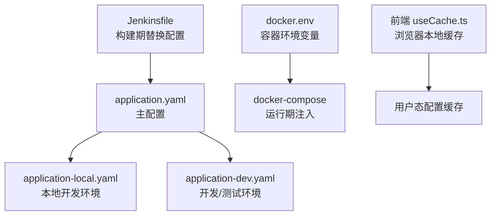
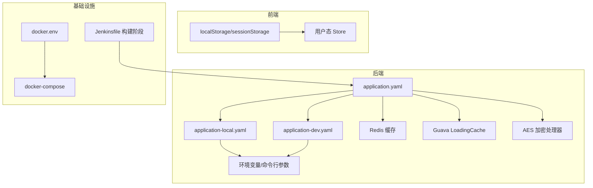
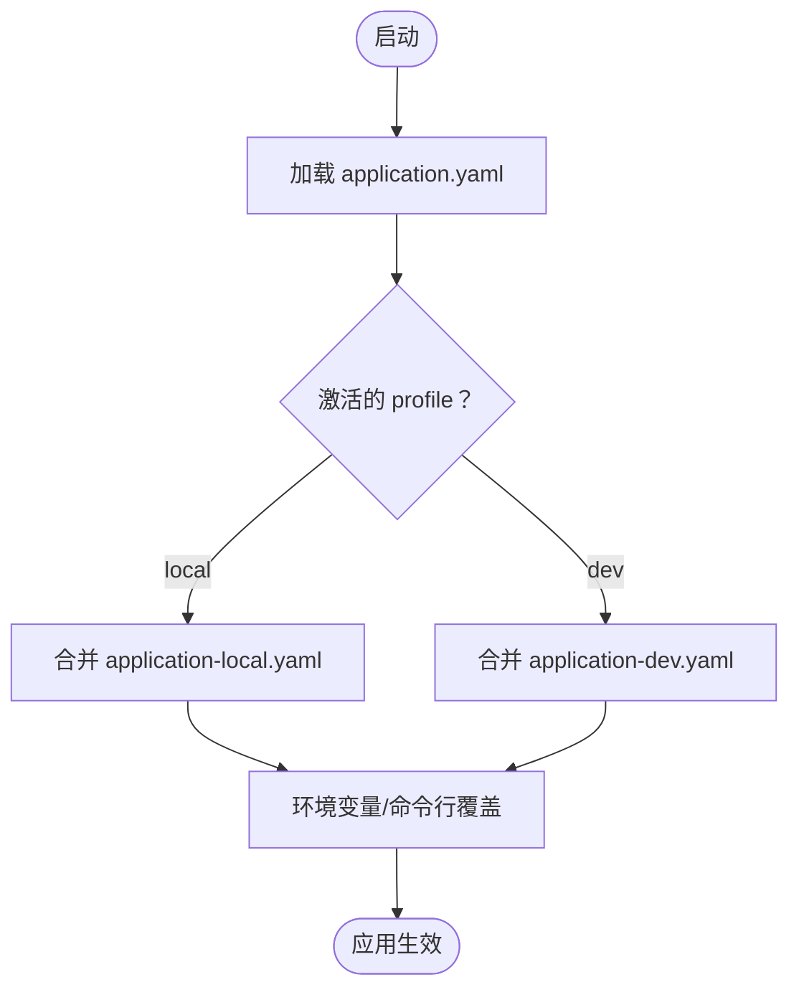
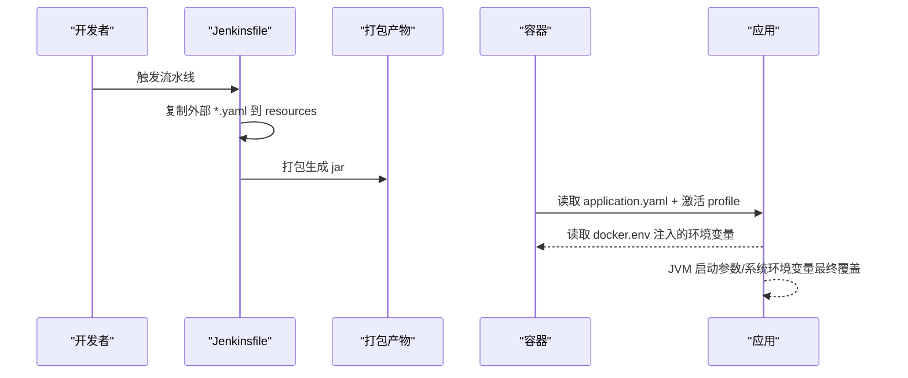
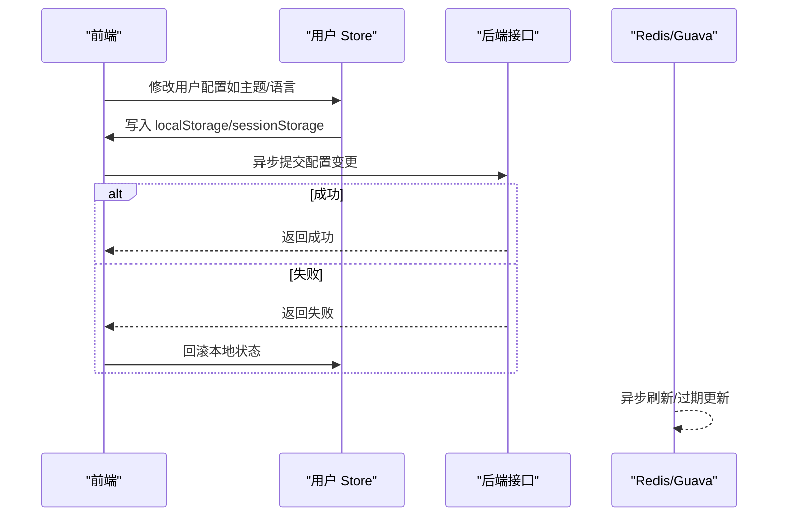
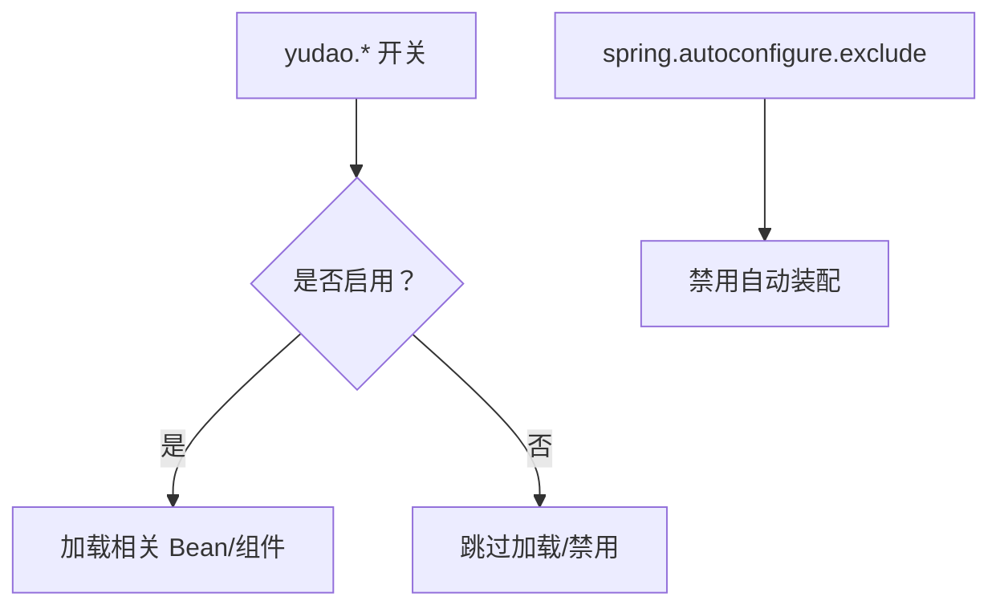
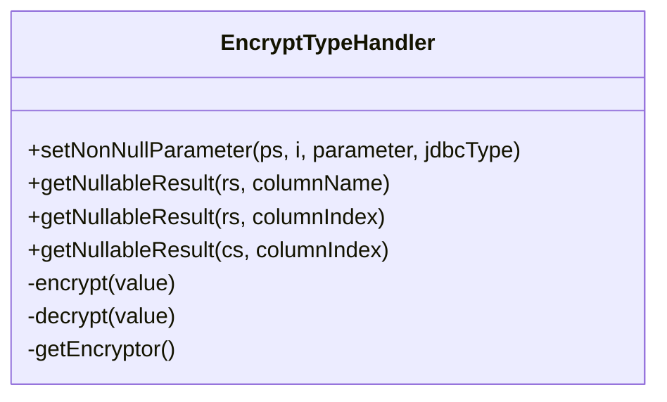
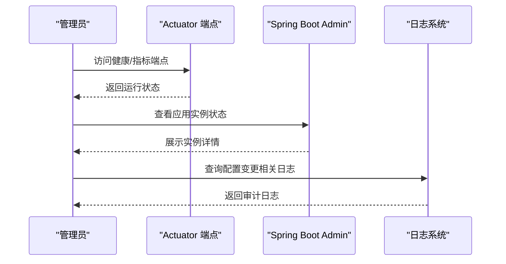
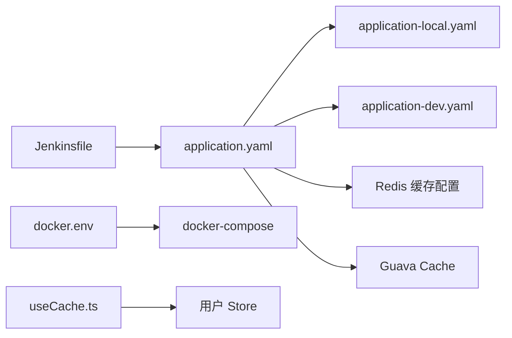

# 模块配置管理

<cite>
**本文引用的文件**
- [application.yaml](file://yudao-server/src/main/resources/application.yaml)
- [application-dev.yaml](file://yudao-server/src/main/resources/application-dev.yaml)
- [application-local.yaml](file://yudao-server/src/main/resources/application-local.yaml)
- [SpringUtils.java](file://yudao-framework/yudao-common/src/main/java/cn/iocoder/yudao/framework/common/util/spring/SpringUtils.java)
- [EncryptTypeHandler.java](file://yudao-framework/yudao-spring-boot-starter-mybatis/src/main/java/cn/iocoder/yudao/framework/mybatis/core/type/EncryptTypeHandler.java)
- [YudaoCacheAutoConfiguration.java](file://yudao-framework/yudao-spring-boot-starter-redis/src/main/java/cn/iocoder/yudao/framework/redis/config/YudaoCacheAutoConfiguration.java)
- [CacheUtils.java](file://yudao-framework/yudao-common/src/main/java/cn/iocoder/yudao/framework/common/util/cache/CacheUtils.java)
- [Jenkinsfile](file://script/jenkins/Jenkinsfile)
- [Docker-HOWTO.md](file://script/docker/Docker-HOWTO.md)
- [docker.env](file://script/docker/docker.env)
- [useCache.ts](file://yudao-ui/yudao-ui-admin-vue3/src/hooks/web/useCache.ts)
- [user.ts](file://yudao-ui/yudao-ui-admin-vue3/src/store/modules/user.ts)
- [ConversationGroupSide.vue](file://yudao-ui/yudao-ui-admin-vue3/src/views/im/home/pages/conversation/components/conversation/ConversationGroupSide.vue)
</cite>

## 目录
1. [简介](#简介)
2. [项目结构](#项目结构)
3. [核心组件](#核心组件)
4. [架构总览](#架构总览)
5. [详细组件分析](#详细组件分析)
6. [依赖分析](#依赖分析)
7. [性能考虑](#性能考虑)
8. [故障排查指南](#故障排查指南)
9. [结论](#结论)
10. [附录](#附录)

## 简介
本文件面向“模块配置管理”，系统性阐述本项目的配置文件结构、环境配置分离策略、配置优先级与继承关系、环境变量注入、动态配置更新与广播、模块开关控制、配置加密解密、以及配置监控与告警治理方法。内容覆盖后端 Spring Boot YAML 配置、前端浏览器本地缓存、CI/CD 部署中的配置注入与覆盖、以及基于 Redis 的缓存与广播能力。

## 项目结构
- 后端配置集中在 yudao-server 的 resources 目录，采用 profiles 分离不同环境，并通过 spring.profiles.active 激活当前环境。
- 前端在 yudao-ui-admin-vue3 中通过浏览器本地存储实现用户态配置缓存。
- CI/CD 通过 Jenkinsfile 在构建阶段动态替换资源目录下的 YAML 配置，实现多环境差异化注入。
- Docker 部署通过 docker.env 提供容器启动的环境变量，配合 docker-compose 使用。

**图表来源**
- [application.yaml:1-354](file://yudao-server/src/main/resources/application.yaml#L1-L354)
- [application-local.yaml:1-285](file://yudao-server/src/main/resources/application-local.yaml#L1-L285)
- [application-dev.yaml:1-212](file://yudao-server/src/main/resources/application-dev.yaml#L1-L212)
- [Jenkinsfile:37-46](file://script/jenkins/Jenkinsfile#L37-L46)
- [Docker-HOWTO.md:1-50](file://script/docker/Docker-HOWTO.md#L1-L50)
- [docker.env](file://script/docker/docker.env)

**章节来源**
- [application.yaml:1-354](file://yudao-server/src/main/resources/application.yaml#L1-L354)
- [application-local.yaml:1-285](file://yudao-server/src/main/resources/application-local.yaml#L1-L285)
- [application-dev.yaml:1-212](file://yudao-server/src/main/resources/application-dev.yaml#L1-L212)
- [Jenkinsfile:37-46](file://script/jenkins/Jenkinsfile#L37-L46)
- [Docker-HOWTO.md:1-50](file://script/docker/Docker-HOWTO.md#L1-L50)

## 核心组件
- 配置文件组织与优先级
  - 主配置 application.yaml 定义应用名、激活的 profile、通用组件配置（如 Jackson、Cache、MyBatis Plus、AI、Yudao 自定义配置等）。
  - 环境配置 application-local.yaml 与 application-dev.yaml 通过 Spring Profiles 机制按需覆盖主配置。
  - 激活顺序：application.yaml（基础）< 激活的 profile（如 application-local.yaml）< 环境变量/命令行参数（最终覆盖）。
- 环境变量注入
  - 通过 docker.env 提供容器环境变量，docker-compose 读取并注入到容器进程。
  - CI/CD 构建阶段通过 Jenkinsfile 将外部 YAML 覆盖到 resources 目录，实现“环境隔离 + 多环境配置注入”。
- 动态配置与缓存
  - 后端：Redis 缓存配置（JSON 序列化、key 前缀规则），Guava LoadingCache 异步刷新，支持过期时间与并发刷新。
  - 前端：浏览器 localStorage/sessionStorage 缓存用户态配置，如角色路由、主题、语言等。
- 模块开关控制
  - 通过 yudao.* 命名空间下的 enable/disable 字段控制功能模块开关（如 WebSocket、AI 平台、短信验证码等）。
  - 通过 Spring Profiles 激活/禁用 Quartz、AI VectorStore 等自动装配。
- 配置加密解密
  - MyBatis Plus 字段加密通过 AES TypeHandler，密钥来自 mybatis-plus.encryptor.password。
- 监控与治理
  - Actuator 暴露端点、Spring Boot Admin 客户端注册、日志文件输出、前端网络状态监听等。

**章节来源**
- [application.yaml:1-354](file://yudao-server/src/main/resources/application.yaml#L1-L354)
- [application-local.yaml:1-285](file://yudao-server/src/main/resources/application-local.yaml#L1-L285)
- [application-dev.yaml:1-212](file://yudao-server/src/main/resources/application-dev.yaml#L1-L212)
- [YudaoCacheAutoConfiguration.java:32-54](file://yudao-framework/yudao-spring-boot-starter-redis/src/main/java/cn/iocoder/yudao/framework/redis/config/YudaoCacheAutoConfiguration.java#L32-L54)
- [CacheUtils.java:1-61](file://yudao-framework/yudao-common/src/main/java/cn/iocoder/yudao/framework/common/util/cache/CacheUtils.java#L1-L61)
- [EncryptTypeHandler.java:1-75](file://yudao-framework/yudao-spring-boot-starter-mybatis/src/main/java/cn/iocoder/yudao/framework/mybatis/core/type/EncryptTypeHandler.java#L1-L75)
- [useCache.ts:1-41](file://yudao-ui/yudao-ui-admin-vue3/src/hooks/web/useCache.ts#L1-L41)
- [user.ts:70-108](file://yudao-ui/yudao-ui-admin-vue3/src/store/modules/user.ts#L70-L108)

## 架构总览
下图展示配置在不同层次的来源与流向：主配置文件、环境配置、环境变量/命令行、容器环境变量、前端本地缓存，以及 CI/CD 构建期注入。

**图表来源**
- [application.yaml:1-354](file://yudao-server/src/main/resources/application.yaml#L1-L354)
- [application-local.yaml:1-285](file://yudao-server/src/main/resources/application-local.yaml#L1-L285)
- [application-dev.yaml:1-212](file://yudao-server/src/main/resources/application-dev.yaml#L1-L212)
- [docker.env](file://script/docker/docker.env)
- [Docker-HOWTO.md:1-50](file://script/docker/Docker-HOWTO.md#L1-L50)
- [Jenkinsfile:37-46](file://script/jenkins/Jenkinsfile#L37-L46)
- [useCache.ts:1-41](file://yudao-ui/yudao-ui-admin-vue3/src/hooks/web/useCache.ts#L1-L41)
- [YudaoCacheAutoConfiguration.java:32-54](file://yudao-framework/yudao-spring-boot-starter-redis/src/main/java/cn/iocoder/yudao/framework/redis/config/YudaoCacheAutoConfiguration.java#L32-L54)
- [CacheUtils.java:1-61](file://yudao-framework/yudao-common/src/main/java/cn/iocoder/yudao/framework/common/util/cache/CacheUtils.java#L1-L61)
- [EncryptTypeHandler.java:1-75](file://yudao-framework/yudao-spring-boot-starter-mybatis/src/main/java/cn/iocoder/yudao/framework/mybatis/core/type/EncryptTypeHandler.java#L1-L75)

## 详细组件分析

### 配置文件结构与环境分离
- 主配置 application.yaml
  - 定义应用名、激活的 profile、Servlet 编码、Jackson 序列化、Cache 类型与 TTL、接口文档（springdoc/knife4j）、工作流 Flowable、MyBatis Plus、AI 平台、Yudao 自定义配置（WebSocket、API 加密、租户、短信验证码、交易、IoT 消息总线等）。
- 环境配置
  - application-local.yaml：本地开发环境，包含数据库（PostgreSQL 示例）、Redis、Quartz、Actuator、Spring Boot Admin、日志级别、微信公众号/小程序测试号等。
  - application-dev.yaml：开发/测试环境，包含 Druid 监控、多数据源、RocketMQ/RabbitMQ/Kafka、Lock4j、Actuator、Spring Boot Admin、日志文件、微信公众号/小程序配置等。
- 激活与优先级
  - spring.profiles.active: local → 本地开发；dev → 开发/测试。
  - 同名键后者覆盖前者；最终可被 JVM 启动参数或操作系统环境变量覆盖。

**图表来源**
- [application.yaml:1-354](file://yudao-server/src/main/resources/application.yaml#L1-L354)
- [application-local.yaml:1-285](file://yudao-server/src/main/resources/application-local.yaml#L1-L285)
- [application-dev.yaml:1-212](file://yudao-server/src/main/resources/application-dev.yaml#L1-L212)

**章节来源**
- [application.yaml:1-354](file://yudao-server/src/main/resources/application.yaml#L1-L354)
- [application-local.yaml:1-285](file://yudao-server/src/main/resources/application-local.yaml#L1-L285)
- [application-dev.yaml:1-212](file://yudao-server/src/main/resources/application-dev.yaml#L1-L212)

### 环境变量配置与注入
- 容器环境变量
  - docker.env 提供容器启动所需的基础环境变量，docker-compose 通过 --env-file 读取并注入到容器。
- 构建期注入
  - Jenkinsfile 在构建阶段将外部资源目录中的 *.yaml 替换到 yudao-server/src/main/resources，实现“多环境配置注入”。
- 运行期覆盖
  - JVM 启动参数与操作系统环境变量可覆盖 YAML 中的同名键，确保生产环境敏感信息不落盘。

**图表来源**
- [Jenkinsfile:37-46](file://script/jenkins/Jenkinsfile#L37-L46)
- [Docker-HOWTO.md:1-50](file://script/docker/Docker-HOWTO.md#L1-L50)
- [docker.env](file://script/docker/docker.env)

**章节来源**
- [Jenkinsfile:37-46](file://script/jenkins/Jenkinsfile#L37-L46)
- [Docker-HOWTO.md:1-50](file://script/docker/Docker-HOWTO.md#L1-L50)
- [docker.env](file://script/docker/docker.env)

### 动态配置更新与广播
- 后端缓存与刷新
  - Redis 缓存配置：JSON 序列化、key 前缀计算，避免多冒号导致可视化工具兼容问题。
  - Guava LoadingCache：异步刷新与同步刷新两种策略，支持过期时间与并发刷新，适用于全局/系统级配置缓存。
- 前端缓存与回滚
  - 浏览器本地缓存（localStorage/sessionStorage）用于用户态配置持久化。
  - IM 会话免打扰开关：本地立即切换，后端异步同步，失败时回滚本地状态，保证一致性与用户体验。

**图表来源**
- [YudaoCacheAutoConfiguration.java:32-54](file://yudao-framework/yudao-spring-boot-starter-redis/src/main/java/cn/iocoder/yudao/framework/redis/config/YudaoCacheAutoConfiguration.java#L32-L54)
- [CacheUtils.java:1-61](file://yudao-framework/yudao-common/src/main/java/cn/iocoder/yudao/framework/common/util/cache/CacheUtils.java#L1-L61)
- [useCache.ts:1-41](file://yudao-ui/yudao-ui-admin-vue3/src/hooks/web/useCache.ts#L1-L41)
- [user.ts:70-108](file://yudao-ui/yudao-ui-admin-vue3/src/store/modules/user.ts#L70-L108)
- [ConversationGroupSide.vue:606-642](file://yudao-ui/yudao-ui-admin-vue3/src/views/im/home/pages/conversation/components/conversation/ConversationGroupSide.vue#L606-L642)

**章节来源**
- [YudaoCacheAutoConfiguration.java:32-54](file://yudao-framework/yudao-spring-boot-starter-redis/src/main/java/cn/iocoder/yudao/framework/redis/config/YudaoCacheAutoConfiguration.java#L32-L54)
- [CacheUtils.java:1-61](file://yudao-framework/yudao-common/src/main/java/cn/iocoder/yudao/framework/common/util/cache/CacheUtils.java#L1-L61)
- [useCache.ts:1-41](file://yudao-ui/yudao-ui-admin-vue3/src/hooks/web/useCache.ts#L1-L41)
- [user.ts:70-108](file://yudao-ui/yudao-ui-admin-vue3/src/store/modules/user.ts#L70-L108)
- [ConversationGroupSide.vue:606-642](file://yudao-ui/yudao-ui-admin-vue3/src/views/im/home/pages/conversation/components/conversation/ConversationGroupSide.vue#L606-L642)

### 模块开关控制
- 后端
  - 通过 yudao.* 命名空间下的 enable/disable 字段控制功能模块开关（如 WebSocket、AI 平台、短信验证码等）。
  - 通过 spring.autoconfigure.exclude 禁用特定自动装配（如 Quartz、AI VectorStore），实现按环境启用/禁用。
- 前端
  - 通过浏览器本地缓存存储用户态配置（如主题、布局、语言），实现 UI 层面的功能开关与个性化。

**图表来源**
- [application.yaml:217-354](file://yudao-server/src/main/resources/application.yaml#L217-L354)
- [application-local.yaml:1-285](file://yudao-server/src/main/resources/application-local.yaml#L1-L285)
- [application-dev.yaml:1-212](file://yudao-server/src/main/resources/application-dev.yaml#L1-L212)
- [useCache.ts:1-41](file://yudao-ui/yudao-ui-admin-vue3/src/hooks/web/useCache.ts#L1-L41)

**章节来源**
- [application.yaml:217-354](file://yudao-server/src/main/resources/application.yaml#L217-L354)
- [application-local.yaml:1-285](file://yudao-server/src/main/resources/application-local.yaml#L1-L285)
- [application-dev.yaml:1-212](file://yudao-server/src/main/resources/application-dev.yaml#L1-L212)
- [useCache.ts:1-41](file://yudao-ui/yudao-ui-admin-vue3/src/hooks/web/useCache.ts#L1-L41)

### 配置加密解密
- 敏感字段加密
  - MyBatis Plus 字段加密：通过 AES TypeHandler 对字段进行加密存储与解密读取，密钥来源于 mybatis-plus.encryptor.password。
- 密钥管理
  - 建议通过环境变量注入密钥，避免硬编码在 YAML 中；生产环境务必启用密码保护与密钥轮换策略。

**图表来源**
- [EncryptTypeHandler.java:1-75](file://yudao-framework/yudao-spring-boot-starter-mybatis/src/main/java/cn/iocoder/yudao/framework/mybatis/core/type/EncryptTypeHandler.java#L1-L75)
- [application.yaml:80-81](file://yudao-server/src/main/resources/application.yaml#L80-L81)

**章节来源**
- [EncryptTypeHandler.java:1-75](file://yudao-framework/yudao-spring-boot-starter-mybatis/src/main/java/cn/iocoder/yudao/framework/mybatis/core/type/EncryptTypeHandler.java#L1-L75)
- [application.yaml:80-81](file://yudao-server/src/main/resources/application.yaml#L80-L81)

### 配置监控与告警
- 后端监控
  - Actuator 暴露端点，开放所有端点以便运维观察。
  - Spring Boot Admin 客户端注册与上下文路径配置，便于集中监控。
  - 日志文件输出路径可配置，便于采集与分析。
- 前端监控
  - 监听浏览器在线/离线状态，辅助判断网络异常与配置加载失败。
- 建议
  - 配置变更应纳入变更管理流程，记录变更人、时间、内容与影响范围；结合日志审计与回滚预案。

**图表来源**
- [application-dev.yaml:124-149](file://yudao-server/src/main/resources/application-dev.yaml#L124-L149)
- [application-local.yaml:147-174](file://yudao-server/src/main/resources/application-local.yaml#L147-L174)
- [useNetwork.ts:1-21](file://yudao-ui/yudao-ui-admin-vue3/src/hooks/web/useNetwork.ts#L1-L21)

**章节来源**
- [application-dev.yaml:124-149](file://yudao-server/src/main/resources/application-dev.yaml#L124-L149)
- [application-local.yaml:147-174](file://yudao-server/src/main/resources/application-local.yaml#L147-L174)
- [useNetwork.ts:1-21](file://yudao-ui/yudao-ui-admin-vue3/src/hooks/web/useNetwork.ts#L1-L21)

## 依赖分析
- 配置来源依赖
  - application.yaml 为主，application-local.yaml 与 application-dev.yaml 为环境覆盖。
  - docker.env 与 Jenkinsfile 为运行期与构建期注入点。
- 组件耦合
  - Redis 缓存配置与序列化策略由 YudaoCacheAutoConfiguration 统一管理。
  - Guava Cache 提供异步刷新能力，减少热点配置的抖动。
  - 前端 useCache.ts 与用户 Store 协同，保障用户态配置的一致性与回滚。

**图表来源**
- [application.yaml:1-354](file://yudao-server/src/main/resources/application.yaml#L1-L354)
- [application-local.yaml:1-285](file://yudao-server/src/main/resources/application-local.yaml#L1-L285)
- [application-dev.yaml:1-212](file://yudao-server/src/main/resources/application-dev.yaml#L1-L212)
- [docker.env](file://script/docker/docker.env)
- [Docker-HOWTO.md:1-50](file://script/docker/Docker-HOWTO.md#L1-L50)
- [Jenkinsfile:37-46](file://script/jenkins/Jenkinsfile#L37-L46)
- [YudaoCacheAutoConfiguration.java:32-54](file://yudao-framework/yudao-spring-boot-starter-redis/src/main/java/cn/iocoder/yudao/framework/redis/config/YudaoCacheAutoConfiguration.java#L32-L54)
- [CacheUtils.java:1-61](file://yudao-framework/yudao-common/src/main/java/cn/iocoder/yudao/framework/common/util/cache/CacheUtils.java#L1-L61)
- [useCache.ts:1-41](file://yudao-ui/yudao-ui-admin-vue3/src/hooks/web/useCache.ts#L1-L41)

**章节来源**
- [YudaoCacheAutoConfiguration.java:32-54](file://yudao-framework/yudao-spring-boot-starter-redis/src/main/java/cn/iocoder/yudao/framework/redis/config/YudaoCacheAutoConfiguration.java#L32-L54)
- [CacheUtils.java:1-61](file://yudao-framework/yudao-common/src/main/java/cn/iocoder/yudao/framework/common/util/cache/CacheUtils.java#L1-L61)
- [useCache.ts:1-41](file://yudao-ui/yudao-ui-admin-vue3/src/hooks/web/useCache.ts#L1-L41)

## 性能考虑
- 缓存策略
  - Redis 缓存采用 JSON 序列化，避免复杂对象序列化开销；合理设置 key 前缀与 TTL。
  - Guava LoadingCache 异步刷新，减少热点键并发刷新带来的抖动；设置合适的过期时间与最大容量。
- 数据库与连接池
  - application-local.yaml 中提供 PostgreSQL 连接示例与 Druid 连接池参数，建议根据业务峰值调整初始/最大连接数与超时时间。
- 日志级别
  - application-local.yaml 中针对多个模块设置了 debug/INFO 级别，便于定位问题但需避免在生产环境过度打印。

**章节来源**
- [application-local.yaml:1-285](file://yudao-server/src/main/resources/application-local.yaml#L1-L285)
- [YudaoCacheAutoConfiguration.java:32-54](file://yudao-framework/yudao-spring-boot-starter-redis/src/main/java/cn/iocoder/yudao/framework/redis/config/YudaoCacheAutoConfiguration.java#L32-L54)
- [CacheUtils.java:1-61](file://yudao-framework/yudao-common/src/main/java/cn/iocoder/yudao/framework/common/util/cache/CacheUtils.java#L1-L61)

## 故障排查指南
- 配置未生效
  - 检查 spring.profiles.active 是否正确；确认 application-local.yaml 或 application-dev.yaml 是否被构建阶段替换。
  - 使用 JVM 启动参数或系统环境变量覆盖 YAML 键，验证最终生效值。
- 缓存异常
  - Redis 序列化异常：确认 RedisCacheConfiguration 使用 JSON 序列化。
  - Guava Cache 刷新失败：检查 CacheLoader 与异步刷新线程池配置。
- 前端配置丢失
  - 检查 localStorage/sessionStorage 是否被清空；用户登出时会清理用户相关缓存，属于预期行为。
- 网络相关问题
  - 使用 useNetwork.ts 监听在线/离线事件，辅助判断配置加载失败原因。

**章节来源**
- [Jenkinsfile:37-46](file://script/jenkins/Jenkinsfile#L37-L46)
- [YudaoCacheAutoConfiguration.java:32-54](file://yudao-framework/yudao-spring-boot-starter-redis/src/main/java/cn/iocoder/yudao/framework/redis/config/YudaoCacheAutoConfiguration.java#L32-L54)
- [CacheUtils.java:1-61](file://yudao-framework/yudao-common/src/main/java/cn/iocoder/yudao/framework/common/util/cache/CacheUtils.java#L1-L61)
- [useCache.ts:1-41](file://yudao-ui/yudao-ui-admin-vue3/src/hooks/web/useCache.ts#L1-L41)
- [user.ts:70-108](file://yudao-ui/yudao-ui-admin-vue3/src/store/modules/user.ts#L70-L108)
- [useNetwork.ts:1-21](file://yudao-ui/yudao-ui-admin-vue3/src/hooks/web/useNetwork.ts#L1-L21)

## 结论
本项目通过“主配置 + 环境配置 + 环境变量/命令行 + 构建期注入 + 容器环境变量”的多层配置体系，实现了灵活的环境隔离与动态配置管理。后端以 Redis 与 Guava Cache 提供高性能缓存与异步刷新，前端以浏览器本地存储实现用户态配置持久化与回滚。配合 Actuator、Spring Boot Admin 与日志系统，形成完整的配置监控与治理闭环。建议在生产环境强化密钥管理、审计与回滚机制，确保配置变更的安全与可控。

## 附录
- 环境判断工具
  - SpringUtils 提供 isProd 判断生产环境，便于在代码中按环境分支处理。

**章节来源**
- [SpringUtils.java:1-24](file://yudao-framework/yudao-common/src/main/java/cn/iocoder/yudao/framework/common/util/spring/SpringUtils.java#L1-L24)