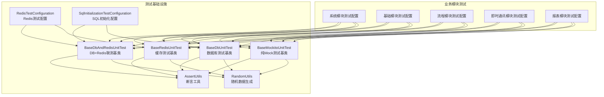
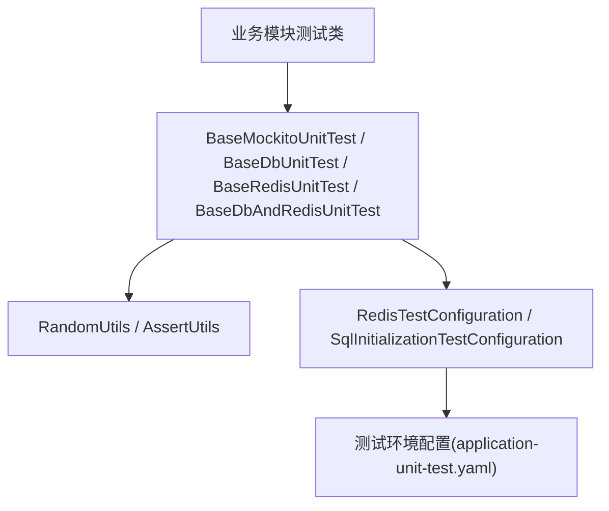
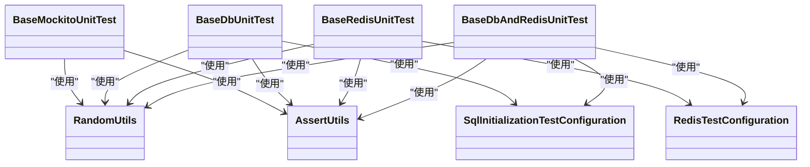
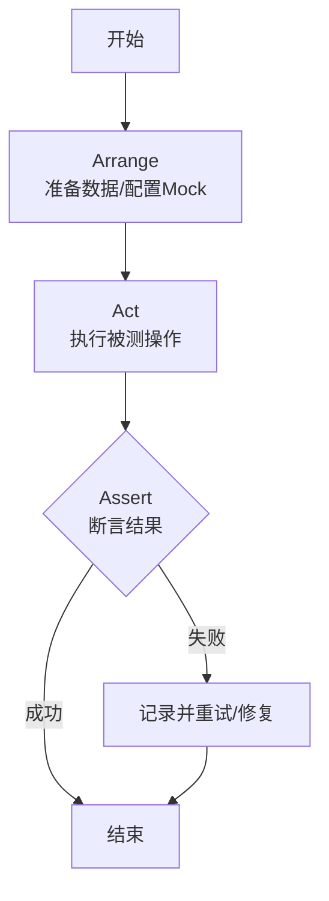
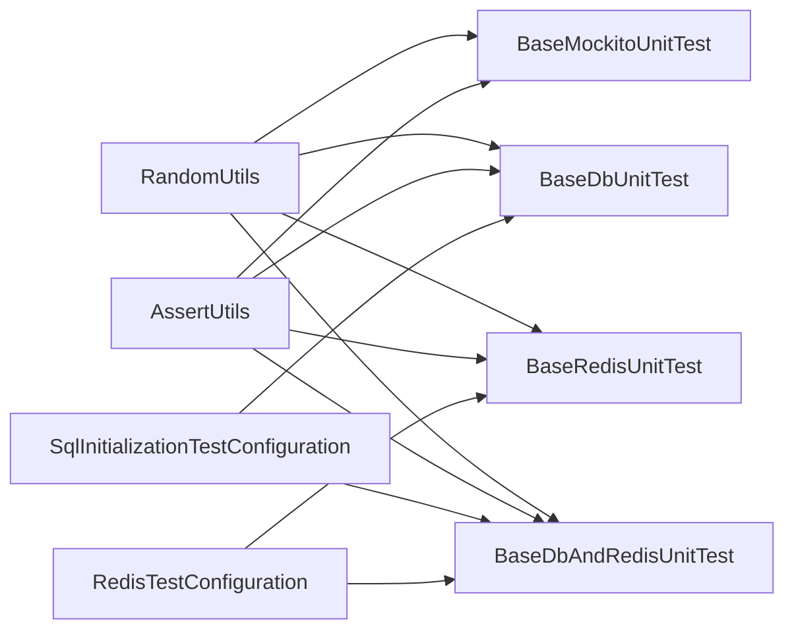

# 测试策略

<cite>
**本文引用的文件**
- [BaseMockitoUnitTest.java](file://yudao-framework/yudao-spring-boot-starter-test/src/main/java/cn/iocoder/yudao/framework/test/core/ut/BaseMockitoUnitTest.java)
- [BaseDbUnitTest.java](file://yudao-framework/yudao-spring-boot-starter-test/src/main/java/cn/iocoder/yudao/framework/test/core/ut/BaseDbUnitTest.java)
- [BaseRedisUnitTest.java](file://yudao-framework/yudao-spring-boot-starter-test/src/main/java/cn/iocoder/yudao/framework/test/core/ut/BaseRedisUnitTest.java)
- [BaseDbAndRedisUnitTest.java](file://yudao-framework/yudao-spring-boot-starter-test/src/main/java/cn/iocoder/yudao/framework/test/core/ut/BaseDbAndRedisUnitTest.java)
- [RandomUtils.java](file://yudao-framework/yudao-spring-boot-starter-test/src/main/java/cn/iocoder/yudao/framework/test/core/util/RandomUtils.java)
- [AssertUtils.java](file://yudao-framework/yudao-spring-boot-starter-test/src/main/java/cn/iocoder/yudao/framework/test/core/util/AssertUtils.java)
- [RedisTestConfiguration.java](file://yudao-framework/yudao-spring-boot-starter-test/src/main/java/cn/iocoder/yudao/framework/test/config/RedisTestConfiguration.java)
- [SqlInitializationTestConfiguration.java](file://yudao-framework/yudao-spring-boot-starter-test/src/main/java/cn/iocoder/yudao/framework/test/config/SqlInitializationTestConfiguration.java)
- [application-unit-test.yaml（系统模块）](file://yudao-module-system/src/test/resources/application-unit-test.yaml)
- [application-unit-test.yaml（基础模块）](file://yudao-module-infra/src/test/resources/application-unit-test.yaml)
- [application-unit-test.yaml（流程模块）](file://yudao-module-bpm/src/test/resources/application-unit-test.yaml)
- [application-unit-test.yaml（即时通讯模块）](file://yudao-module-im/src/test/resources/application-unit-test.yaml)
- [application-unit-test.yaml（报表模块）](file://yudao-module-report/src/test/resources/application-unit-test.yaml)
</cite>

## 目录
1. [引言](#引言)
2. [项目结构](#项目结构)
3. [核心组件](#核心组件)
4. [架构总览](#架构总览)
5. [详细组件分析](#详细组件分析)
6. [依赖分析](#依赖分析)
7. [性能考虑](#性能考虑)
8. [故障排查指南](#故障排查指南)
9. [结论](#结论)
10. [附录](#附录)

## 引言
本文件面向芋道Ruoyi-Vue-Pro后端工程，系统化阐述单元测试策略与最佳实践，覆盖测试框架与Mock使用、测试基类选择、测试方法模式（AAA）、异常断言技巧、测试数据准备方法以及测试运行命令等关键主题。目标是帮助开发者在不同模块中快速落地高质量的单元测试，确保代码质量与可维护性。

## 项目结构
- 测试基础设施集中在 yudao-framework/yudao-spring-boot-starter-test 模块，提供统一的测试基类、配置与工具类。
- 各业务模块（如 system、infra、bpm、im、report 等）在 test/resources 下提供 application-unit-test.yaml，用于单元测试环境的配置覆盖。
- 测试用例分布在各模块的 test/java 目录下，遵循模块内按功能分层组织。

图表来源
- [BaseMockitoUnitTest.java:1-200](file://yudao-framework/yudao-spring-boot-starter-test/src/main/java/cn/iocoder/yudao/framework/test/core/ut/BaseMockitoUnitTest.java#L1-L200)
- [BaseDbUnitTest.java:1-200](file://yudao-framework/yudao-spring-boot-starter-test/src/main/java/cn/iocoder/yudao/framework/test/core/ut/BaseDbUnitTest.java#L1-L200)
- [BaseRedisUnitTest.java:1-200](file://yudao-framework/yudao-spring-boot-starter-test/src/main/java/cn/iocoder/yudao/framework/test/core/ut/BaseRedisUnitTest.java#L1-L200)
- [BaseDbAndRedisUnitTest.java:1-200](file://yudao-framework/yudao-spring-boot-starter-test/src/main/java/cn/iocoder/yudao/framework/test/core/ut/BaseDbAndRedisUnitTest.java#L1-L200)
- [RandomUtils.java:1-200](file://yudao-framework/yudao-spring-boot-starter-test/src/main/java/cn/iocoder/yudao/framework/test/core/util/RandomUtils.java#L1-L200)
- [AssertUtils.java:1-200](file://yudao-framework/yudao-spring-boot-starter-test/src/main/java/cn/iocoder/yudao/framework/test/core/util/AssertUtils.java#L1-L200)
- [RedisTestConfiguration.java:1-200](file://yudao-framework/yudao-spring-boot-starter-test/src/main/java/cn/iocoder/yudao/framework/test/config/RedisTestConfiguration.java#L1-L200)
- [SqlInitializationTestConfiguration.java:1-200](file://yudao-framework/yudao-spring-boot-starter-test/src/main/java/cn/iocoder/yudao/framework/test/config/SqlInitializationTestConfiguration.java#L1-L200)
- [application-unit-test.yaml（系统模块）:1-200](file://yudao-module-system/src/test/resources/application-unit-test.yaml#L1-L200)
- [application-unit-test.yaml（基础模块）:1-200](file://yudao-module-infra/src/test/resources/application-unit-test.yaml#L1-L200)
- [application-unit-test.yaml（流程模块）:1-200](file://yudao-module-bpm/src/test/resources/application-unit-test.yaml#L1-L200)
- [application-unit-test.yaml（即时通讯模块）:1-200](file://yudao-module-im/src/test/resources/application-unit-test.yaml#L1-L200)
- [application-unit-test.yaml（报表模块）:1-200](file://yudao-module-report/src/test/resources/application-unit-test.yaml#L1-L200)

章节来源
- [BaseMockitoUnitTest.java:1-200](file://yudao-framework/yudao-spring-boot-starter-test/src/main/java/cn/iocoder/yudao/framework/test/core/ut/BaseMockitoUnitTest.java#L1-L200)
- [BaseDbUnitTest.java:1-200](file://yudao-framework/yudao-spring-boot-starter-test/src/main/java/cn/iocoder/yudao/framework/test/core/ut/BaseDbUnitTest.java#L1-L200)
- [BaseRedisUnitTest.java:1-200](file://yudao-framework/yudao-spring-boot-starter-test/src/main/java/cn/iocoder/yudao/framework/test/core/ut/BaseRedisUnitTest.java#L1-L200)
- [BaseDbAndRedisUnitTest.java:1-200](file://yudao-framework/yudao-spring-boot-starter-test/src/main/java/cn/iocoder/yudao/framework/test/core/ut/BaseDbAndRedisUnitTest.java#L1-L200)
- [RandomUtils.java:1-200](file://yudao-framework/yudao-spring-boot-starter-test/src/main/java/cn/iocoder/yudao/framework/test/core/util/RandomUtils.java#L1-L200)
- [AssertUtils.java:1-200](file://yudao-framework/yudao-spring-boot-starter-test/src/main/java/cn/iocoder/yudao/framework/test/core/util/AssertUtils.java#L1-L200)
- [RedisTestConfiguration.java:1-200](file://yudao-framework/yudao-spring-boot-starter-test/src/main/java/cn/iocoder/yudao/framework/test/config/RedisTestConfiguration.java#L1-L200)
- [SqlInitializationTestConfiguration.java:1-200](file://yudao-framework/yudao-spring-boot-starter-test/src/main/java/cn/iocoder/yudao/framework/test/config/SqlInitializationTestConfiguration.java#L1-L200)
- [application-unit-test.yaml（系统模块）:1-200](file://yudao-module-system/src/test/resources/application-unit-test.yaml#L1-L200)
- [application-unit-test.yaml（基础模块）:1-200](file://yudao-module-infra/src/test/resources/application-unit-test.yaml#L1-L200)
- [application-unit-test.yaml（流程模块）:1-200](file://yudao-module-bpm/src/test/resources/application-unit-test.yaml#L1-L200)
- [application-unit-test.yaml（即时通讯模块）:1-200](file://yudao-module-im/src/test/resources/application-unit-test.yaml#L1-L200)
- [application-unit-test.yaml（报表模块）:1-200](file://yudao-module-report/src/test/resources/application-unit-test.yaml#L1-L200)

## 核心组件
- 测试基类
  - BaseMockitoUnitTest：基于 Mockito 的纯 Mock 测试基类，适合不依赖数据库或缓存的纯逻辑单元测试。
  - BaseDbUnitTest：集成 SQL 初始化与事务回滚，适合需要真实数据库交互的单元测试。
  - BaseRedisUnitTest：集成 Redis 测试容器或配置，适合缓存相关逻辑的单元测试。
  - BaseDbAndRedisUnitTest：同时启用数据库与缓存的联合测试基类，适合跨存储层的集成场景。
- 测试工具
  - RandomUtils：提供随机数据生成能力，支持 POJO 随机填充与 lambda 回调定制字段。
  - AssertUtils：封装常用断言方法，便于统一风格的断言表达。
- 测试配置
  - RedisTestConfiguration：为 Redis 测试提供专用配置（如嵌入式Redis或测试容器）。
  - SqlInitializationTestConfiguration：为数据库测试提供 SQL 初始化能力（DDL/DML）。

章节来源
- [BaseMockitoUnitTest.java:1-200](file://yudao-framework/yudao-spring-boot-starter-test/src/main/java/cn/iocoder/yudao/framework/test/core/ut/BaseMockitoUnitTest.java#L1-L200)
- [BaseDbUnitTest.java:1-200](file://yudao-framework/yudao-spring-boot-starter-test/src/main/java/cn/iocoder/yudao/framework/test/core/ut/BaseDbUnitTest.java#L1-L200)
- [BaseRedisUnitTest.java:1-200](file://yudao-framework/yudao-spring-boot-starter-test/src/main/java/cn/iocoder/yudao/framework/test/core/ut/BaseRedisUnitTest.java#L1-L200)
- [BaseDbAndRedisUnitTest.java:1-200](file://yudao-framework/yudao-spring-boot-starter-test/src/main/java/cn/iocoder/yudao/framework/test/core/ut/BaseDbAndRedisUnitTest.java#L1-L200)
- [RandomUtils.java:1-200](file://yudao-framework/yudao-spring-boot-starter-test/src/main/java/cn/iocoder/yudao/framework/test/core/util/RandomUtils.java#L1-L200)
- [AssertUtils.java:1-200](file://yudao-framework/yudao-spring-boot-starter-test/src/main/java/cn/iocoder/yudao/framework/test/core/util/AssertUtils.java#L1-L200)
- [RedisTestConfiguration.java:1-200](file://yudao-framework/yudao-spring-boot-starter-test/src/main/java/cn/iocoder/yudao/framework/test/config/RedisTestConfiguration.java#L1-L200)
- [SqlInitializationTestConfiguration.java:1-200](file://yudao-framework/yudao-spring-boot-starter-test/src/main/java/cn/iocoder/yudao/framework/test/config/SqlInitializationTestConfiguration.java#L1-L200)

## 架构总览
测试架构围绕“测试基类 + 工具 + 配置”的分层设计，通过模块化的 application-unit-test.yaml 覆盖不同环境需求，确保测试隔离与可重复性。

图表来源
- [BaseMockitoUnitTest.java:1-200](file://yudao-framework/yudao-spring-boot-starter-test/src/main/java/cn/iocoder/yudao/framework/test/core/ut/BaseMockitoUnitTest.java#L1-L200)
- [BaseDbUnitTest.java:1-200](file://yudao-framework/yudao-spring-boot-starter-test/src/main/java/cn/iocoder/yudao/framework/test/core/ut/BaseDbUnitTest.java#L1-L200)
- [BaseRedisUnitTest.java:1-200](file://yudao-framework/yudao-spring-boot-starter-test/src/main/java/cn/iocoder/yudao/framework/test/core/ut/BaseRedisUnitTest.java#L1-L200)
- [BaseDbAndRedisUnitTest.java:1-200](file://yudao-framework/yudao-spring-boot-starter-test/src/main/java/cn/iocoder/yudao/framework/test/core/ut/BaseDbAndRedisUnitTest.java#L1-L200)
- [RandomUtils.java:1-200](file://yudao-framework/yudao-spring-boot-starter-test/src/main/java/cn/iocoder/yudao/framework/test/core/util/RandomUtils.java#L1-L200)
- [AssertUtils.java:1-200](file://yudao-framework/yudao-spring-boot-starter-test/src/main/java/cn/iocoder/yudao/framework/test/core/util/AssertUtils.java#L1-L200)
- [RedisTestConfiguration.java:1-200](file://yudao-framework/yudao-spring-boot-starter-test/src/main/java/cn/iocoder/yudao/framework/test/config/RedisTestConfiguration.java#L1-L200)
- [SqlInitializationTestConfiguration.java:1-200](file://yudao-framework/yudao-spring-boot-starter-test/src/main/java/cn/iocoder/yudao/framework/test/config/SqlInitializationTestConfiguration.java#L1-L200)
- [application-unit-test.yaml（系统模块）:1-200](file://yudao-module-system/src/test/resources/application-unit-test.yaml#L1-L200)

## 详细组件分析

### 测试基类选择与适用场景
- BaseMockitoUnitTest：适用于纯逻辑单元测试，避免外部依赖，提升执行速度与稳定性。
- BaseDbUnitTest：适用于需要真实数据库交互的场景，配合 SQL 初始化与事务回滚，保证测试隔离。
- BaseRedisUnitTest：适用于缓存相关逻辑，如分布式锁、缓存读写一致性等。
- BaseDbAndRedisUnitTest：适用于跨存储层的复杂场景，如缓存+DB一致性校验。

图表来源
- [BaseMockitoUnitTest.java:1-200](file://yudao-framework/yudao-spring-boot-starter-test/src/main/java/cn/iocoder/yudao/framework/test/core/ut/BaseMockitoUnitTest.java#L1-L200)
- [BaseDbUnitTest.java:1-200](file://yudao-framework/yudao-spring-boot-starter-test/src/main/java/cn/iocoder/yudao/framework/test/core/ut/BaseDbUnitTest.java#L1-L200)
- [BaseRedisUnitTest.java:1-200](file://yudao-framework/yudao-spring-boot-starter-test/src/main/java/cn/iocoder/yudao/framework/test/core/ut/BaseRedisUnitTest.java#L1-L200)
- [BaseDbAndRedisUnitTest.java:1-200](file://yudao-framework/yudao-spring-boot-starter-test/src/main/java/cn/iocoder/yudao/framework/test/core/ut/BaseDbAndRedisUnitTest.java#L1-L200)
- [RandomUtils.java:1-200](file://yudao-framework/yudao-spring-boot-starter-test/src/main/java/cn/iocoder/yudao/framework/test/core/util/RandomUtils.java#L1-L200)
- [AssertUtils.java:1-200](file://yudao-framework/yudao-spring-boot-starter-test/src/main/java/cn/iocoder/yudao/framework/test/core/util/AssertUtils.java#L1-L200)
- [RedisTestConfiguration.java:1-200](file://yudao-framework/yudao-spring-boot-starter-test/src/main/java/cn/iocoder/yudao/framework/test/config/RedisTestConfiguration.java#L1-L200)
- [SqlInitializationTestConfiguration.java:1-200](file://yudao-framework/yudao-spring-boot-starter-test/src/main/java/cn/iocoder/yudao/framework/test/config/SqlInitializationTestConfiguration.java#L1-L200)

章节来源
- [BaseMockitoUnitTest.java:1-200](file://yudao-framework/yudao-spring-boot-starter-test/src/main/java/cn/iocoder/yudao/framework/test/core/ut/BaseMockitoUnitTest.java#L1-L200)
- [BaseDbUnitTest.java:1-200](file://yudao-framework/yudao-spring-boot-starter-test/src/main/java/cn/iocoder/yudao/framework/test/core/ut/BaseDbUnitTest.java#L1-L200)
- [BaseRedisUnitTest.java:1-200](file://yudao-framework/yudao-spring-boot-starter-test/src/main/java/cn/iocoder/yudao/framework/test/core/ut/BaseRedisUnitTest.java#L1-L200)
- [BaseDbAndRedisUnitTest.java:1-200](file://yudao-framework/yudao-spring-boot-starter-test/src/main/java/cn/iocoder/yudao/framework/test/core/ut/BaseDbAndRedisUnitTest.java#L1-L200)

### 测试方法模式（AAA）
- Arrange：准备测试数据与桩件（Mock/POJO），配置环境。
- Act：调用被测方法或服务。
- Assert：断言返回值、副作用或异常。

图表来源
- [BaseMockitoUnitTest.java:1-200](file://yudao-framework/yudao-spring-boot-starter-test/src/main/java/cn/iocoder/yudao/framework/test/core/ut/BaseMockitoUnitTest.java#L1-L200)
- [BaseDbUnitTest.java:1-200](file://yudao-framework/yudao-spring-boot-starter-test/src/main/java/cn/iocoder/yudao/framework/test/core/ut/BaseDbUnitTest.java#L1-L200)
- [BaseRedisUnitTest.java:1-200](file://yudao-framework/yudao-spring-boot-starter-test/src/main/java/cn/iocoder/yudao/framework/test/core/ut/BaseRedisUnitTest.java#L1-L200)
- [BaseDbAndRedisUnitTest.java:1-200](file://yudao-framework/yudao-spring-boot-starter-test/src/main/java/cn/iocoder/yudao/framework/test/core/ut/BaseDbAndRedisUnitTest.java#L1-L200)

章节来源
- [BaseMockitoUnitTest.java:1-200](file://yudao-framework/yudao-spring-boot-starter-test/src/main/java/cn/iocoder/yudao/framework/test/core/ut/BaseMockitoUnitTest.java#L1-L200)
- [BaseDbUnitTest.java:1-200](file://yudao-framework/yudao-spring-boot-starter-test/src/main/java/cn/iocoder/yudao/framework/test/core/ut/BaseDbUnitTest.java#L1-L200)
- [BaseRedisUnitTest.java:1-200](file://yudao-framework/yudao-spring-boot-starter-test/src/main/java/cn/iocoder/yudao/framework/test/core/ut/BaseRedisUnitTest.java#L1-L200)
- [BaseDbAndRedisUnitTest.java:1-200](file://yudao-framework/yudao-spring-boot-starter-test/src/main/java/cn/iocoder/yudao/framework/test/core/ut/BaseDbAndRedisUnitTest.java#L1-L200)

### 异常断言方法
- 使用断言工具统一抛出业务异常，结合错误码进行断言，确保异常场景覆盖完整。
- 建议在测试中显式断言异常类型与错误码，避免宽泛的异常捕获导致测试脆弱。

章节来源
- [AssertUtils.java:1-200](file://yudao-framework/yudao-spring-boot-starter-test/src/main/java/cn/iocoder/yudao/framework/test/core/util/AssertUtils.java#L1-L200)

### 测试数据准备方法
- randomPojo：自动生成符合类型约束的随机对象，减少手写样板数据。
- lambda 回调：对特定字段进行定制化赋值，满足边界条件与特殊场景。
- 常用随机值工具方法：日期、字符串、数字、布尔等，统一生成策略，提高可读性与可维护性。

章节来源
- [RandomUtils.java:1-200](file://yudao-framework/yudao-spring-boot-starter-test/src/main/java/cn/iocoder/yudao/framework/test/core/util/RandomUtils.java#L1-L200)

### 测试运行命令（示例）
- 全量测试：在根目录执行 Maven 测试命令，触发所有模块测试。
- 单模块测试：进入指定模块目录，仅运行该模块测试。
- 单个测试类：指定类名运行，快速定位问题。
- 单个测试方法：指定方法名运行，聚焦细粒度验证。
- 建议结合 IDE 插件或 Maven Surefire/Failsafe 插件参数控制测试集与并发策略。

[本节为通用实践指导，无需具体文件引用]

## 依赖分析
- 测试基类与工具解耦：通过 RandomUtils 与 AssertUtils 提供横切能力，降低重复代码。
- 配置注入：RedisTestConfiguration 与 SqlInitializationTestConfiguration 以 @Import 形式注入到测试上下文，确保测试环境一致性。
- 模块隔离：各业务模块通过各自 application-unit-test.yaml 覆盖测试配置，避免相互干扰。

图表来源
- [BaseMockitoUnitTest.java:1-200](file://yudao-framework/yudao-spring-boot-starter-test/src/main/java/cn/iocoder/yudao/framework/test/core/ut/BaseMockitoUnitTest.java#L1-L200)
- [BaseDbUnitTest.java:1-200](file://yudao-framework/yudao-spring-boot-starter-test/src/main/java/cn/iocoder/yudao/framework/test/core/ut/BaseDbUnitTest.java#L1-L200)
- [BaseRedisUnitTest.java:1-200](file://yudao-framework/yudao-spring-boot-starter-test/src/main/java/cn/iocoder/yudao/framework/test/core/ut/BaseRedisUnitTest.java#L1-L200)
- [BaseDbAndRedisUnitTest.java:1-200](file://yudao-framework/yudao-spring-boot-starter-test/src/main/java/cn/iocoder/yudao/framework/test/core/ut/BaseDbAndRedisUnitTest.java#L1-L200)
- [RandomUtils.java:1-200](file://yudao-framework/yudao-spring-boot-starter-test/src/main/java/cn/iocoder/yudao/framework/test/core/util/RandomUtils.java#L1-L200)
- [AssertUtils.java:1-200](file://yudao-framework/yudao-spring-boot-starter-test/src/main/java/cn/iocoder/yudao/framework/test/core/util/AssertUtils.java#L1-L200)
- [RedisTestConfiguration.java:1-200](file://yudao-framework/yudao-spring-boot-starter-test/src/main/java/cn/iocoder/yudao/framework/test/config/RedisTestConfiguration.java#L1-L200)
- [SqlInitializationTestConfiguration.java:1-200](file://yudao-framework/yudao-spring-boot-starter-test/src/main/java/cn/iocoder/yudao/framework/test/config/SqlInitializationTestConfiguration.java#L1-L200)

章节来源
- [BaseMockitoUnitTest.java:1-200](file://yudao-framework/yudao-spring-boot-starter-test/src/main/java/cn/iocoder/yudao/framework/test/core/ut/BaseMockitoUnitTest.java#L1-L200)
- [BaseDbUnitTest.java:1-200](file://yudao-framework/yudao-spring-boot-starter-test/src/main/java/cn/iocoder/yudao/framework/test/core/ut/BaseDbUnitTest.java#L1-L200)
- [BaseRedisUnitTest.java:1-200](file://yudao-framework/yudao-spring-boot-starter-test/src/main/java/cn/iocoder/yudao/framework/test/core/ut/BaseRedisUnitTest.java#L1-L200)
- [BaseDbAndRedisUnitTest.java:1-200](file://yudao-framework/yudao-spring-boot-starter-test/src/main/java/cn/iocoder/yudao/framework/test/core/ut/BaseDbAndRedisUnitTest.java#L1-L200)
- [RandomUtils.java:1-200](file://yudao-framework/yudao-spring-boot-starter-test/src/main/java/cn/iocoder/yudao/framework/test/core/util/RandomUtils.java#L1-L200)
- [AssertUtils.java:1-200](file://yudao-framework/yudao-spring-boot-starter-test/src/main/java/cn/iocoder/yudao/framework/test/core/util/AssertUtils.java#L1-L200)
- [RedisTestConfiguration.java:1-200](file://yudao-framework/yudao-spring-boot-starter-test/src/main/java/cn/iocoder/yudao/framework/test/config/RedisTestConfiguration.java#L1-L200)
- [SqlInitializationTestConfiguration.java:1-200](file://yudao-framework/yudao-spring-boot-starter-test/src/main/java/cn/iocoder/yudao/framework/test/config/SqlInitializationTestConfiguration.java#L1-L200)

## 性能考虑
- 优先使用 BaseMockitoUnitTest 进行高频单元测试，减少外部依赖带来的执行时间。
- 对于必须的真实数据库测试，合理拆分测试用例，避免长事务与大表扫描。
- 缓存测试建议使用嵌入式或轻量级容器，缩短启动与清理时间。
- 利用随机数据生成器批量构造测试样本，提升测试覆盖面与执行效率。

[本节提供一般性建议，无需具体文件引用]

## 故障排查指南
- 断言失败：检查断言工具与异常断言是否一致，确认错误码与消息匹配。
- Mock 不生效：核对 @InjectMocks/@Mock 注解位置与作用域，确保测试上下文中已注入。
- 数据库事务：确认测试方法未开启事务或正确使用事务回滚策略。
- 缓存一致性：核对 Redis 测试配置是否加载，键空间命名是否冲突。
- 配置覆盖：检查 application-unit-test.yaml 是否正确导入与生效。

章节来源
- [AssertUtils.java:1-200](file://yudao-framework/yudao-spring-boot-starter-test/src/main/java/cn/iocoder/yudao/framework/test/core/util/AssertUtils.java#L1-L200)
- [RedisTestConfiguration.java:1-200](file://yudao-framework/yudao-spring-boot-starter-test/src/main/java/cn/iocoder/yudao/framework/test/config/RedisTestConfiguration.java#L1-L200)
- [SqlInitializationTestConfiguration.java:1-200](file://yudao-framework/yudao-spring-boot-starter-test/src/main/java/cn/iocoder/yudao/framework/test/config/SqlInitializationTestConfiguration.java#L1-L200)
- [application-unit-test.yaml（系统模块）:1-200](file://yudao-module-system/src/test/resources/application-unit-test.yaml#L1-L200)
- [application-unit-test.yaml（基础模块）:1-200](file://yudao-module-infra/src/test/resources/application-unit-test.yaml#L1-L200)
- [application-unit-test.yaml（流程模块）:1-200](file://yudao-module-bpm/src/test/resources/application-unit-test.yaml#L1-L200)
- [application-unit-test.yaml（即时通讯模块）:1-200](file://yudao-module-im/src/test/resources/application-unit-test.yaml#L1-L200)
- [application-unit-test.yaml（报表模块）:1-200](file://yudao-module-report/src/test/resources/application-unit-test.yaml#L1-L200)

## 结论
通过统一的测试基类、工具与配置，芋道Ruoyi-Vue-Pro实现了高内聚、低耦合的测试体系。建议在日常开发中：
- 优先采用纯Mock测试覆盖核心逻辑；
- 在必要时引入数据库或缓存测试，并使用对应的基类；
- 统一使用断言工具与随机数据生成器；
- 严格遵循 AAA 模式与异常断言规范；
- 依据模块配置文件进行环境隔离与一致性保障。

[本节为总结性内容，无需具体文件引用]

## 附录
- 测试运行命令参考
  - 全量测试：在根目录执行 Maven 测试命令。
  - 单模块测试：进入模块目录执行模块级测试命令。
  - 单个测试类：指定类名运行。
  - 单个测试方法：指定方法名运行。
- 配置文件位置
  - 各模块测试配置位于 module/test/resources/application-unit-test.yaml。

[本节为通用实践说明，无需具体文件引用]