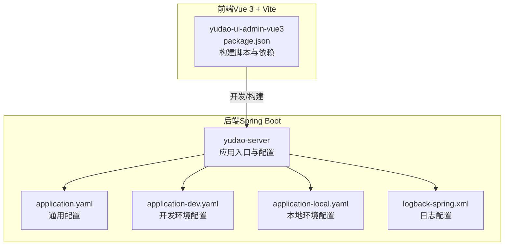
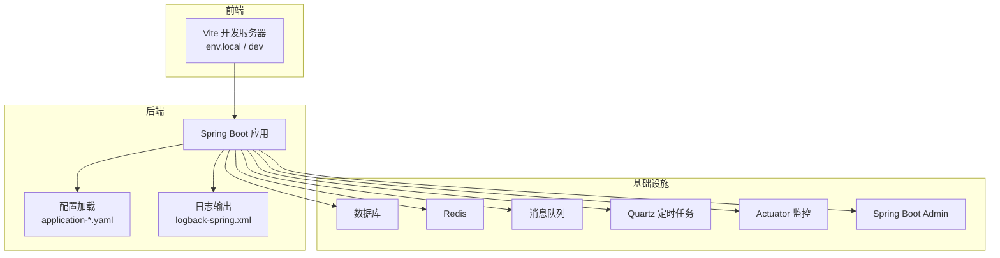
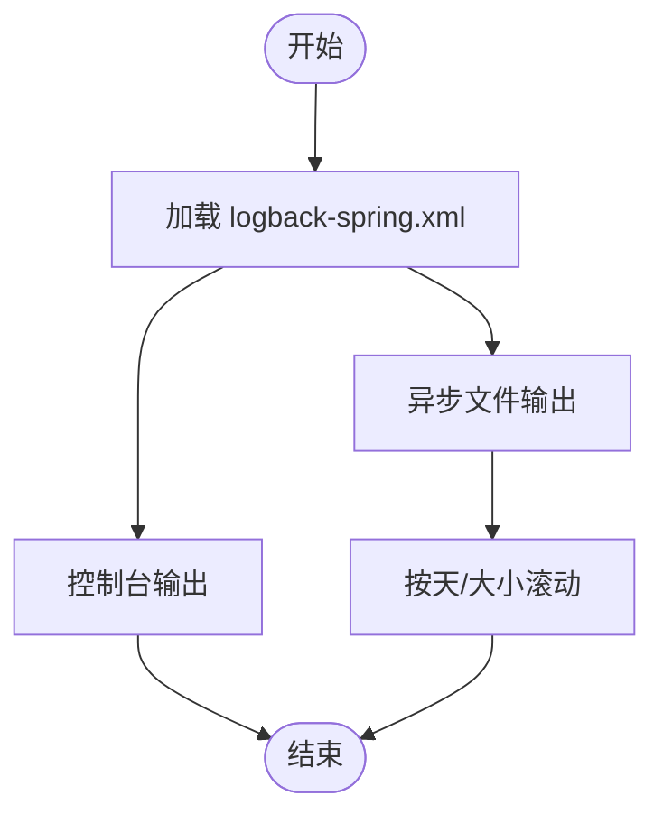
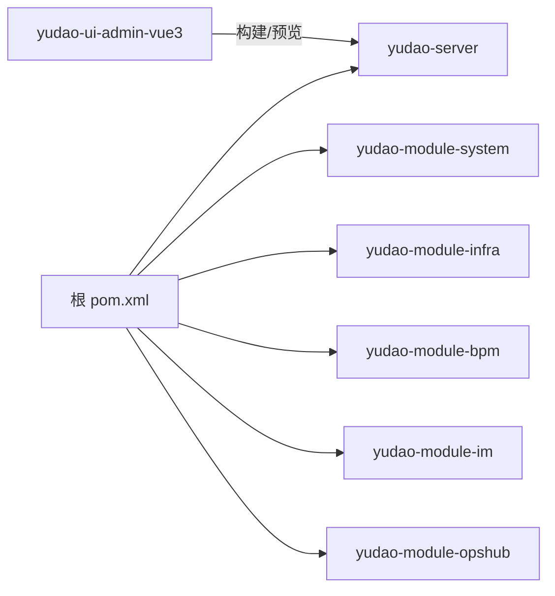

# 调试技巧

<cite>
**本文引用的文件**   
- [application.yaml](file://yudao-server/src/main/resources/application.yaml)
- [application-dev.yaml](file://yudao-server/src/main/resources/application-dev.yaml)
- [application-local.yaml](file://yudao-server/src/main/resources/application-local.yaml)
- [logback-spring.xml](file://yudao-server/src/main/resources/logback-spring.xml)
- [pom.xml](file://pom.xml)
- [package.json](file://yudao-ui/yudao-ui-admin-vue3/package.json)
</cite>

## 目录
1. [简介](#简介)
2. [项目结构](#项目结构)
3. [核心组件](#核心组件)
4. [架构总览](#架构总览)
5. [详细组件分析](#详细组件分析)
6. [依赖分析](#依赖分析)
7. [性能考虑](#性能考虑)
8. [故障排查指南](#故障排查指南)
9. [结论](#结论)
10. [附录](#附录)

## 简介
本文件面向芋道 Ruoyi-Vue-Pro 的开发者与测试人员，系统性整理后端（Spring Boot）、前端（Vue 3 + Vite）以及周边中间件（数据库、缓存、消息队列、定时任务、监控）的调试技巧与实操建议。内容覆盖 IDE 项目导入与断点调试、条件断点与异常断点、日志分析与级别控制、性能分析工具（JProfiler、VisualVM）与常见问题定位，帮助快速定位并解决问题。

## 项目结构
- 后端采用多模块 Maven 结构，核心入口位于 yudao-server，包含应用配置与日志配置。
- 前端位于 yudao-ui/yudao-ui-admin-vue3，使用 Vite 作为构建工具，提供多环境构建脚本。
- 配置文件集中于 yudao-server/src/main/resources 下，包含 application.yaml、application-dev.yaml、application-local.yaml 与 logback-spring.xml。

**图表来源**
- [application.yaml:1-354](file://yudao-server/src/main/resources/application.yaml#L1-L354)
- [application-dev.yaml:1-212](file://yudao-server/src/main/resources/application-dev.yaml#L1-L212)
- [application-local.yaml:1-285](file://yudao-server/src/main/resources/application-local.yaml#L1-L285)
- [logback-spring.xml:1-57](file://yudao-server/src/main/resources/logback-spring.xml#L1-L57)
- [package.json:1-158](file://yudao-ui/yudao-ui-admin-vue3/package.json#L1-L158)

**章节来源**
- [application.yaml:1-354](file://yudao-server/src/main/resources/application.yaml#L1-L354)
- [application-dev.yaml:1-212](file://yudao-server/src/main/resources/application-dev.yaml#L1-L212)
- [application-local.yaml:1-285](file://yudao-server/src/main/resources/application-local.yaml#L1-L285)
- [logback-spring.xml:1-57](file://yudao-server/src/main/resources/logback-spring.xml#L1-L57)
- [pom.xml:1-167](file://pom.xml#L1-L167)
- [package.json:1-158](file://yudao-ui/yudao-ui-admin-vue3/package.json#L1-L158)

## 核心组件
- 应用配置与环境
  - application.yaml：统一的通用配置，包含 Jackson、MyBatis、接口文档、AI、安全与租户等配置项。
  - application-dev.yaml：开发环境配置，含 Druid 监控、数据库连接、Redis、Quartz、Actuator、Spring Boot Admin、日志文件等。
  - application-local.yaml：本地开发环境配置，包含数据库切换（PostgreSQL/MySQL 等）、Redis、消息队列、Quartz、Actuator、日志级别等。
- 日志系统
  - logback-spring.xml：控制台与异步文件输出、滚动策略、可选 SkyWalking GRPC 日志采集。
- 前端构建
  - package.json：提供 dev/dev-server/build:* 等脚本，支持不同环境模式。

**章节来源**
- [application.yaml:1-354](file://yudao-server/src/main/resources/application.yaml#L1-L354)
- [application-dev.yaml:1-212](file://yudao-server/src/main/resources/application-dev.yaml#L1-L212)
- [application-local.yaml:1-285](file://yudao-server/src/main/resources/application-local.yaml#L1-L285)
- [logback-spring.xml:1-57](file://yudao-server/src/main/resources/logback-spring.xml#L1-L57)
- [package.json:1-158](file://yudao-ui/yudao-ui-admin-vue3/package.json#L1-L158)

## 架构总览
后端通过 Spring Boot 启动，加载多环境配置与日志配置；前端通过 Vite 在不同模式下运行并与后端交互；数据库、缓存、消息队列、定时任务与监控组件在配置中均有体现。

**图表来源**
- [application.yaml:1-354](file://yudao-server/src/main/resources/application.yaml#L1-L354)
- [application-dev.yaml:1-212](file://yudao-server/src/main/resources/application-dev.yaml#L1-L212)
- [application-local.yaml:1-285](file://yudao-server/src/main/resources/application-local.yaml#L1-L285)
- [logback-spring.xml:1-57](file://yudao-server/src/main/resources/logback-spring.xml#L1-L57)

## 详细组件分析

### IDE 配置与断点调试（IntelliJ IDEA / Eclipse）
- 项目导入
  - Maven 多模块：在 IDE 中选择导入根 pom.xml，确保解析 yudao-server 与其他模块。
  - JDK 版本：项目使用 Java 17，请在 IDE 中设置对应 SDK。
- 运行配置
  - 后端：以 yudao-server 为主模块，设置 VM Options（如 -Dspring.profiles.active=local 或 dev）。
  - 前端：使用 package.json 中的 scripts（如 dev/dev-server），或在 IDE 中配置外部工具运行 Vite。
- 断点调试
  - 建议在 Controller/Service 层设置断点，结合条件断点过滤特定参数。
  - 使用“方法断点”在构造函数或静态初始化处捕获初始化问题。
- 变量监视与调用栈
  - 观察关键对象（DTO、DO、MapStruct 转换结果）与线程上下文。
  - 查看调用栈定位异常来源，结合日志定位具体 SQL/缓存/消息队列位置。

**章节来源**
- [pom.xml:1-167](file://pom.xml#L1-L167)
- [application-dev.yaml:1-212](file://yudao-server/src/main/resources/application-dev.yaml#L1-L212)
- [application-local.yaml:1-285](file://yudao-server/src/main/resources/application-local.yaml#L1-L285)

### 条件断点、异常断点与方法断点
- 条件断点
  - 适用：过滤大量请求中的特定参数（如用户 ID、业务单号）。
  - 配置：在断点表达式中使用布尔条件，避免误触发。
- 异常断点
  - 适用：定位未捕获异常的源头，建议在全局异常处理器之前设置。
- 方法断点
  - 适用：构造函数、静态初始化、序列化/反序列化入口，便于观察对象生命周期与状态。

**章节来源**
- [application.yaml:1-354](file://yudao-server/src/main/resources/application.yaml#L1-L354)

### 日志分析方法（Logback）
- 配置要点
  - 控制台与异步文件输出，按天滚动与大小切割。
  - 可选 SkyWalking GRPC 日志采集，便于链路追踪。
- 日志级别
  - 本地环境可针对模块设置 debug/info 级别，减少噪音。
  - 常用模块：系统、基础设施、支付、工作流、即时通讯、AI 等。
- 关键日志追踪
  - SQL 日志：结合 Druid 监控页面查看慢 SQL。
  - 异常堆栈：结合调用栈与业务上下文定位问题。
- 建议
  - 为热点模块单独设置日志级别，避免过度打印。
  - 使用结构化日志字段（如 TraceId）配合链路追踪系统。

**图表来源**
- [logback-spring.xml:1-57](file://yudao-server/src/main/resources/logback-spring.xml#L1-L57)

**章节来源**
- [logback-spring.xml:1-57](file://yudao-server/src/main/resources/logback-spring.xml#L1-L57)
- [application-local.yaml:171-201](file://yudao-server/src/main/resources/application-local.yaml#L171-L201)
- [application-dev.yaml:146-150](file://yudao-server/src/main/resources/application-dev.yaml#L146-L150)

### 性能分析工具（JProfiler / VisualVM）
- 连接方式
  - 启动后端时添加 JVM 参数（如远程调试端口或探针参数），在工具中建立连接。
- 常见场景
  - CPU 占用：定位热点方法与线程阻塞点，关注定时任务线程池与消息消费线程。
  - 内存泄漏：观察堆内存增长趋势，重点检查缓存、线程局部变量与长生命周期对象。
  - 线程死锁：抓取线程转储，结合调用栈定位锁竞争。
- 与配置联动
  - Quartz 线程池大小、Redis 连接池参数、数据库连接池参数均可在配置中调整以辅助定位。

**章节来源**
- [application-dev.yaml:92-118](file://yudao-server/src/main/resources/application-dev.yaml#L92-L118)
- [application-local.yaml:92-119](file://yudao-server/src/main/resources/application-local.yaml#L92-L119)

### 前端调试技巧（浏览器开发者工具 + Vue DevTools）
- 浏览器开发者工具
  - Network：观察接口耗时、错误码与响应体；结合后端日志定位异常。
  - Console：查看 JS 错误与警告；结合后端 TraceId 定位服务端问题。
  - Sources：设置断点调试 Vue 组件逻辑。
- Vue DevTools
  - 组件树与状态检查，观察 props、state、computed 与事件流向。
- Vite 开发服务器
  - 使用 package.json 中的 dev/dev-server 脚本启动，便于热更新与错误提示。

**章节来源**
- [package.json:7-26](file://yudao-ui/yudao-ui-admin-vue3/package.json#L7-L26)

### 常见开发问题与解决方案
- 编译错误
  - JDK 版本：确保使用 Java 17。
  - Lombok/MapStruct：IDE 需启用注解处理，必要时刷新 Maven 依赖。
- 运行时异常
  - 检查 application-*.yaml 中的数据库、Redis、消息队列连接参数。
  - 使用异常断点与日志级别提升定位效率。
- 数据库连接问题
  - 校验 application-dev.yaml 与 application-local.yaml 中的数据库 URL、账号与密码。
  - Druid 监控页面可用于查看连接池状态与慢 SQL。
- 跨域问题
  - 若前端与后端端口不一致，需在后端配置 CORS 或代理（Vite devServer.proxy）。
  - 检查 Actuator/SBA 的跨域配置（frame-ancestors）。

**章节来源**
- [pom.xml:39-53](file://pom.xml#L39-L53)
- [application-dev.yaml:14-58](file://yudao-server/src/main/resources/application-dev.yaml#L14-L58)
- [application-local.yaml:48-88](file://yudao-server/src/main/resources/application-local.yaml#L48-L88)
- [application-dev.yaml:155-170](file://yudao-server/src/main/resources/application-dev.yaml#L155-L170)
- [application-local.yaml:155-170](file://yudao-server/src/main/resources/application-local.yaml#L155-L170)

## 依赖分析
- 后端模块
  - yudao-server 为核心应用模块，其他模块（如 system、infra、bpm、im、opshub 等）按功能划分。
- 前端模块
  - yudao-ui-admin-vue3 通过 Vite 构建，依赖 axios、vue、element-plus 等生态库。
- 配置依赖
  - application-*.yaml 与 logback-spring.xml 影响运行时行为与可观测性。

**图表来源**
- [pom.xml:10-33](file://pom.xml#L10-L33)
- [package.json:1-158](file://yudao-ui/yudao-ui-admin-vue3/package.json#L1-L158)

**章节来源**
- [pom.xml:1-167](file://pom.xml#L1-L167)
- [package.json:1-158](file://yudao-ui/yudao-ui-admin-vue3/package.json#L1-L158)

## 性能考虑
- 日志性能
  - 使用异步文件 Appender 降低 IO 延迟；合理设置滚动策略与队列大小。
- 数据库与缓存
  - 连接池参数（初始、最小空闲、最大活跃、超时）影响并发与延迟。
  - Redis 连接与序列化策略需与业务吞吐匹配。
- 定时任务
  - 线程池大小与集群检查间隔需根据任务负载调整。
- 监控与可观测性
  - Actuator 暴露端点便于健康检查与指标采集；Spring Boot Admin 提供可视化界面。

**章节来源**
- [logback-spring.xml:30-35](file://yudao-server/src/main/resources/logback-spring.xml#L30-L35)
- [application-dev.yaml:32-47](file://yudao-server/src/main/resources/application-dev.yaml#L32-L47)
- [application-local.yaml:32-46](file://yudao-server/src/main/resources/application-local.yaml#L32-L46)
- [application-dev.yaml:92-118](file://yudao-server/src/main/resources/application-dev.yaml#L92-L118)
- [application-local.yaml:92-119](file://yudao-server/src/main/resources/application-local.yaml#L92-L119)

## 故障排查指南
- 启动阶段
  - 检查 application.yaml 中的 profiles.active 与端口配置。
  - 确认数据库与 Redis 可达性，必要时临时降低日志级别以便观察。
- 运行阶段
  - 使用 Actuator /actuator 与 Spring Boot Admin 快速判断健康状态。
  - 结合 Druid 控制台查看慢 SQL 与连接池状态。
- 日志与异常
  - 提升关键模块日志级别，定位异常堆栈来源。
  - 使用条件断点与异常断点缩小范围。
- 前端联调
  - 使用 Vite dev-server 与浏览器开发者工具，核对接口路径与跨域配置。

**章节来源**
- [application.yaml:5-6](file://yudao-server/src/main/resources/application.yaml#L5-L6)
- [application-dev.yaml:124-145](file://yudao-server/src/main/resources/application-dev.yaml#L124-L145)
- [application-local.yaml:147-170](file://yudao-server/src/main/resources/application-local.yaml#L147-L170)
- [logback-spring.xml:48-54](file://yudao-server/src/main/resources/logback-spring.xml#L48-L54)

## 结论
通过合理的 IDE 调试策略、完善的日志体系、性能分析工具与前后端协同，能够高效定位并解决 Ruoyi-Vue-Pro 的开发与运行问题。建议在本地与开发环境开启必要的监控与日志能力，并在团队内形成标准化的调试流程与问题升级机制。

## 附录
- 环境与端口
  - 后端默认端口：48080（dev/local）
  - Druid 监控：/druid
  - Actuator：/actuator
  - Spring Boot Admin：/admin
- 前端脚本
  - dev/dev-server：开发模式
  - build:*：多环境构建
  - preview：本地预览

**章节来源**
- [application-dev.yaml:1-2](file://yudao-server/src/main/resources/application-dev.yaml#L1-L2)
- [application-local.yaml:1-2](file://yudao-server/src/main/resources/application-local.yaml#L1-L2)
- [application-dev.yaml:17-22](file://yudao-server/src/main/resources/application-dev.yaml#L17-L22)
- [application-dev.yaml:124-145](file://yudao-server/src/main/resources/application-dev.yaml#L124-L145)
- [application-local.yaml:155-169](file://yudao-server/src/main/resources/application-local.yaml#L155-L169)
- [package.json:7-26](file://yudao-ui/yudao-ui-admin-vue3/package.json#L7-L26)