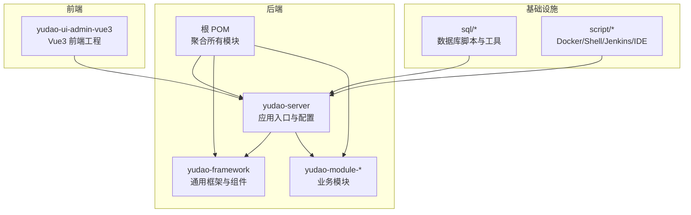
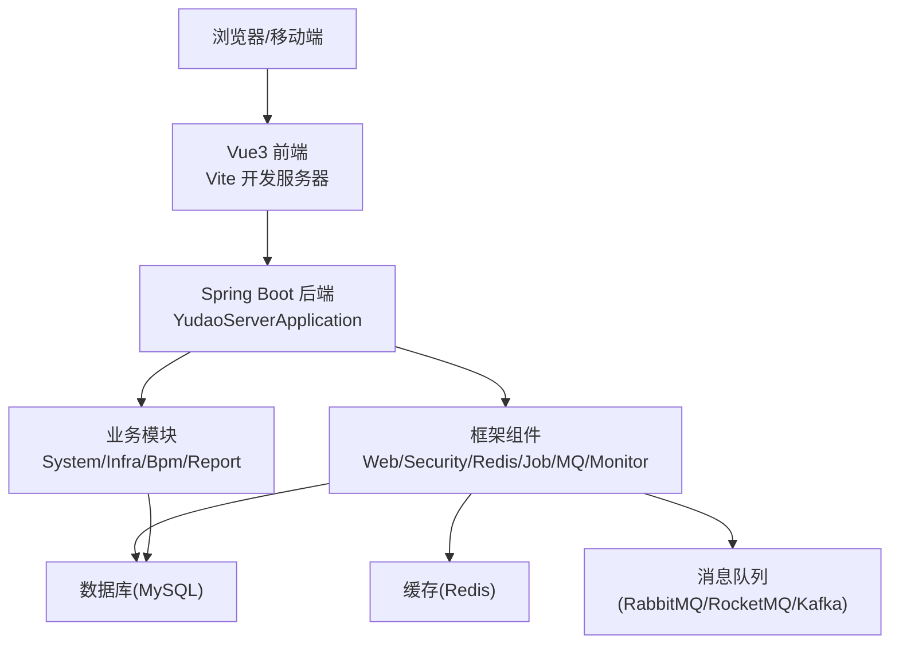
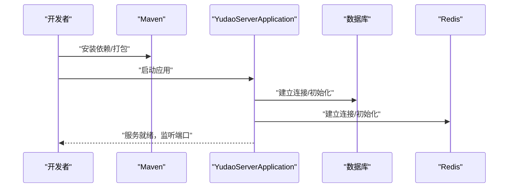
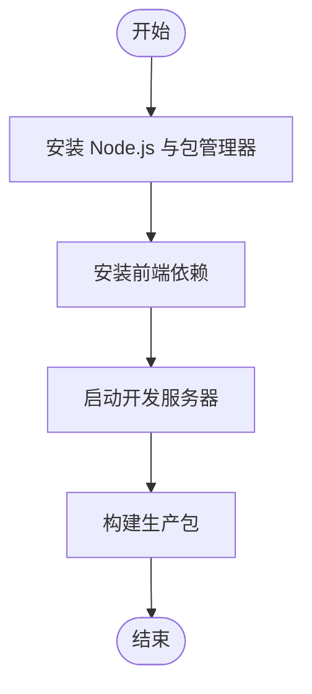
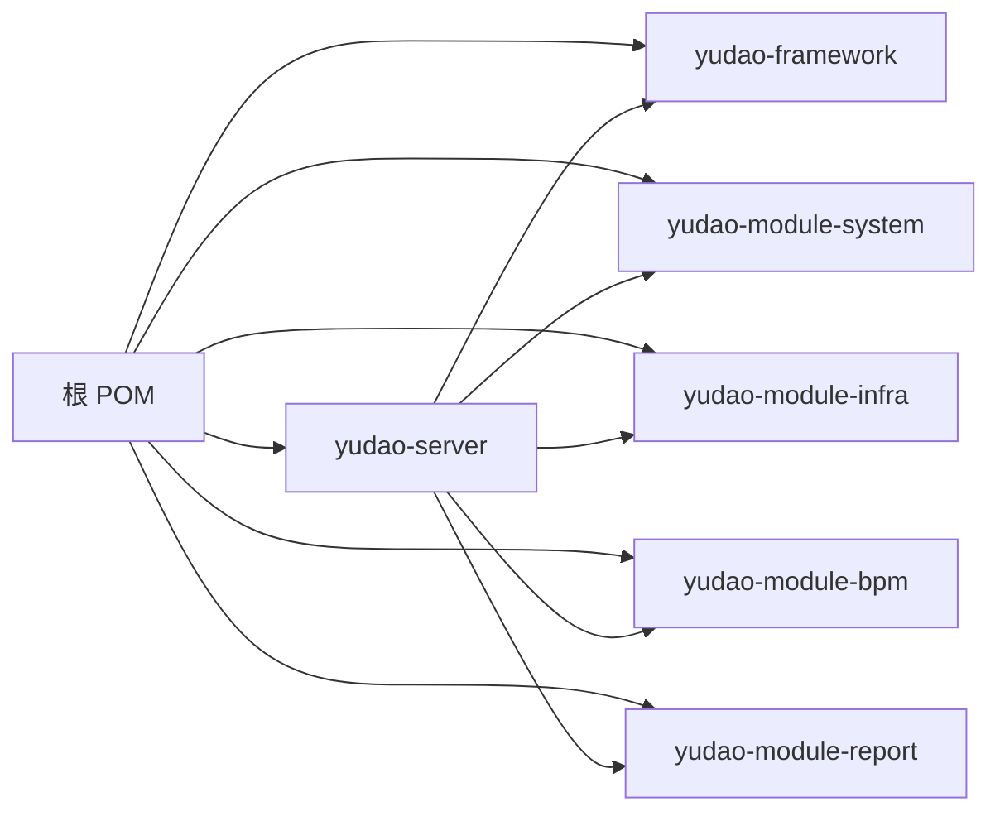

# 快速开始

<cite>
**本文引用的文件**
- [根 POM 文件](file://pom.xml)
- [yudao-server 应用入口](file://yudao-server/src/main/java/cn/iocoder/yudao/server/YudaoServerApplication.java)
- [后端开发环境配置](file://yudao-server/src/main/resources/application-dev.yaml)
- [后端本地环境配置](file://yudao-server/src/main/resources/application-local.yaml)
- [后端默认配置](file://yudao-server/src/main/resources/application.yaml)
- [后端日志配置](file://yudao-server/src/main/resources/logback-spring.xml)
- [后端 Dockerfile](file://yudao-server/Dockerfile)
- [后端 Docker Compose 使用说明](file://script/docker/Docker-HOWTO.md)
- [后端 Docker Compose 配置](file://script/docker/docker-compose.yml)
- [后端 Docker 环境变量](file://script/docker/docker.env)
- [前端包管理配置](file://yudao-ui/yudao-ui-admin-vue3/package.json)
- [前端构建与开发配置](file://yudao-ui/yudao-ui-admin-vue3/vite.config.ts)
- [前端类型声明](file://yudao-ui/yudao-ui-admin-vue3/types/env.d.ts)
- [前端 ESLint 配置](file://yudao-ui/yudao-ui-admin-vue3/eslint.config.mjs)
- [前端 Prettier 配置](file://yudao-ui/yudao-ui-admin-vue3/prettier.config.js)
- [前端 Stylelint 配置](file://yudao-ui/yudao-ui-admin-vue3/stylelint.config.js)
- [前端 UnoCSS 配置](file://yudao-ui/yudao-ui-admin-vue3/uno.config.ts)
- [前端 PostCSS 配置](file://yudao-ui/yudao-ui-admin-vue3/postcss.config.js)
- [前端 TypeScript 配置](file://yudao-ui/yudao-ui-admin-vue3/tsconfig.json)
- [后端模块系统 POM](file://yudao-module-system/pom.xml)
- [后端模块基础设施 POM](file://yudao-module-infra/pom.xml)
- [后端模块流程 POM](file://yudao-module-bpm/pom.xml)
- [后端模块报表 POM](file://yudao-module-report/pom.xml)
- [后端框架通用 POM](file://yudao-framework/yudao-common/pom.xml)
- [后端框架 Web 组件 POM](file://yudao-framework/yudao-spring-boot-starter-web/pom.xml)
- [后端框架安全组件 POM](file://yudao-framework/yudao-spring-boot-starter-security/pom.xml)
- [后端框架 Redis 组件 POM](file://yudao-framework/yudao-spring-boot-starter-redis/pom.xml)
- [后端框架定时任务组件 POM](file://yudao-framework/yudao-spring-boot-starter-job/pom.xml)
- [后端框架消息队列组件 POM](file://yudao-framework/yudao-spring-boot-starter-mq/pom.xml)
- [后端框架监控组件 POM](file://yudao-framework/yudao-spring-boot-starter-monitor/pom.xml)
- [后端框架数据权限组件 POM](file://yudao-framework/yudao-spring-boot-starter-biz-data-permission/pom.xml)
- [后端框架租户组件 POM](file://yudao-framework/yudao-spring-boot-starter-biz-tenant/pom.xml)
- [后端框架 Excel 组件 POM](file://yudao-framework/yudao-spring-boot-starter-excel/pom.xml)
- [后端框架测试组件 POM](file://yudao-framework/yudao-spring-boot-starter-test/pom.xml)
- [后端框架 WebSocket 组件 POM](file://yudao-framework/yudao-spring-boot-starter-websocket/pom.xml)
- [后端框架依赖聚合 POM](file://yudao-dependencies/pom.xml)
- [SQL 工具说明](file://sql/tools/README.md)
- [SQL 转换工具](file://sql/tools/convertor.py)
- [Docker 部署脚本](file://script/shell/deploy.sh)
- [Jenkins 自动化流水线](file://script/jenkins/Jenkinsfile)
- [IDE HTTP 客户端环境](file://script/idea/http-client.env.json)
</cite>

## 目录
1. [简介](#简介)
2. [项目结构](#项目结构)
3. [核心组件](#核心组件)
4. [架构总览](#架构总览)
5. [详细组件分析](#详细组件分析)
6. [依赖分析](#依赖分析)
7. [性能考虑](#性能考虑)
8. [故障排除指南](#故障排除指南)
9. [结论](#结论)
10. [附录](#附录)

## 简介
本指南面向首次接触芋道 ruoyi-vue-pro 的开发者，帮助你在本地快速完成环境准备、数据库初始化、后端与前端服务启动，并提供常见问题排查与最佳实践建议。项目采用前后端分离架构：后端基于 Spring Boot，前端基于 Vue 3 + Vite。

## 项目结构
项目采用多模块 Maven 架构，主要由以下部分组成：
- 后端聚合工程：统一版本与依赖管理
- yudao-server：后端应用入口与配置
- yudao-framework：通用框架与各能力组件（Web、Security、Redis、Job、MQ、Monitor 等）
- yudao-module-*：业务模块（System、Infra、Bpm、Report 等）
- yudao-ui：Vue 前端工程
- sql：数据库脚本与工具
- script：脚本与自动化（Docker、Shell、Jenkins、IDE）

图表来源
- [根 POM 文件](file://pom.xml)
- [yudao-server 应用入口](file://yudao-server/src/main/java/cn/iocoder/yudao/server/YudaoServerApplication.java)
- [后端框架 Web 组件 POM](file://yudao-framework/yudao-spring-boot-starter-web/pom.xml)
- [后端模块系统 POM](file://yudao-module-system/pom.xml)
- [前端包管理配置](file://yudao-ui/yudao-ui-admin-vue3/package.json)

章节来源
- [根 POM 文件](file://pom.xml)
- [yudao-server 应用入口](file://yudao-server/src/main/java/cn/iocoder/yudao/server/YudaoServerApplication.java)
- [后端框架 Web 组件 POM](file://yudao-framework/yudao-spring-boot-starter-web/pom.xml)
- [后端模块系统 POM](file://yudao-module-system/pom.xml)
- [前端包管理配置](file://yudao-ui/yudao-ui-admin-vue3/package.json)

## 核心组件
- 后端应用入口：负责加载 Spring Boot 应用上下文与自动配置
- 后端配置：application.yaml、application-dev.yaml、application-local.yaml 提供不同环境的配置切换
- 前端工程：基于 Vite 的 Vue 3 应用，包含构建、开发、ESLint、Prettier、Stylelint、UnoCSS 等配置
- 基础设施：Docker 化部署、Jenkins 自动化、IDE HTTP 客户端环境等

章节来源
- [yudao-server 应用入口](file://yudao-server/src/main/java/cn/iocoder/yudao/server/YudaoServerApplication.java)
- [后端默认配置](file://yudao-server/src/main/resources/application.yaml)
- [后端开发环境配置](file://yudao-server/src/main/resources/application-dev.yaml)
- [后端本地环境配置](file://yudao-server/src/main/resources/application-local.yaml)
- [前端包管理配置](file://yudao-ui/yudao-ui-admin-vue3/package.json)

## 架构总览
后端通过 Spring Boot 自动装配加载框架与业务模块；前端通过 Vite 进行开发与构建，运行时与后端通过 REST API 交互。数据库、缓存与消息中间件通过配置注入到后端。

图表来源
- [yudao-server 应用入口](file://yudao-server/src/main/java/cn/iocoder/yudao/server/YudaoServerApplication.java)
- [后端框架 Web 组件 POM](file://yudao-framework/yudao-spring-boot-starter-web/pom.xml)
- [后端框架安全组件 POM](file://yudao-framework/yudao-spring-boot-starter-security/pom.xml)
- [后端框架 Redis 组件 POM](file://yudao-framework/yudao-spring-boot-starter-redis/pom.xml)
- [后端框架定时任务组件 POM](file://yudao-framework/yudao-spring-boot-starter-job/pom.xml)
- [后端框架消息队列组件 POM](file://yudao-framework/yudao-spring-boot-starter-mq/pom.xml)
- [后端框架监控组件 POM](file://yudao-framework/yudao-spring-boot-starter-monitor/pom.xml)
- [后端模块系统 POM](file://yudao-module-system/pom.xml)
- [后端模块基础设施 POM](file://yudao-module-infra/pom.xml)
- [后端模块流程 POM](file://yudao-module-bpm/pom.xml)
- [后端模块报表 POM](file://yudao-module-report/pom.xml)

## 详细组件分析

### 环境准备与数据库初始化
- 数据库：MySQL（版本要求以实际配置为准），需创建数据库与用户
- 缓存：Redis（用于会话、限流、分布式锁等）
- Java：JDK 8 或 17+（根据项目配置选择）
- 前端：Node.js（推荐 LTS 版本），包管理器可选 npm/pnpm/yarn

数据库初始化步骤：
1) 创建数据库与用户（字符集建议 utf8mb4）
2) 执行初始化脚本（位于 sql/mysql/quartz.sql 等）
3) 在后端配置中设置数据库连接信息（application-dev.yaml 或 application-local.yaml）
4) 启动后端应用，等待 Flyway/MyBatis Plus 初始化完成

章节来源
- [后端开发环境配置](file://yudao-server/src/main/resources/application-dev.yaml)
- [后端本地环境配置](file://yudao-server/src/main/resources/application-local.yaml)
- [SQL 工具说明](file://sql/tools/README.md)
- [SQL 转换工具](file://sql/tools/convertor.py)

### 后端服务启动流程
- 依赖安装：使用 Maven 安装依赖（可配合私服或跳过测试）
- 数据库配置：在 application-dev.yaml 中配置数据库连接、Redis、消息队列等
- 应用启动：运行 YudaoServerApplication 或使用 mvn spring-boot:run
- 日志查看：logback-spring.xml 控制日志输出位置与级别

图表来源
- [yudao-server 应用入口](file://yudao-server/src/main/java/cn/iocoder/yudao/server/YudaoServerApplication.java)
- [后端默认配置](file://yudao-server/src/main/resources/application.yaml)
- [后端开发环境配置](file://yudao-server/src/main/resources/application-dev.yaml)
- [后端本地环境配置](file://yudao-server/src/main/resources/application-local.yaml)
- [后端日志配置](file://yudao-server/src/main/resources/logback-spring.xml)

章节来源
- [yudao-server 应用入口](file://yudao-server/src/main/java/cn/iocoder/yudao/server/YudaoServerApplication.java)
- [后端默认配置](file://yudao-server/src/main/resources/application.yaml)
- [后端开发环境配置](file://yudao-server/src/main/resources/application-dev.yaml)
- [后端本地环境配置](file://yudao-server/src/main/resources/application-local.yaml)
- [后端日志配置](file://yudao-server/src/main/resources/logback-spring.xml)

### 前端环境搭建与启动
- Node.js 环境：安装推荐版本的 Node.js
- 依赖安装：使用包管理器安装依赖（如 pnpm install）
- 开发服务器：运行开发命令启动 Vite 本地服务
- 构建产物：使用构建命令生成生产包

图表来源
- [前端包管理配置](file://yudao-ui/yudao-ui-admin-vue3/package.json)
- [前端构建与开发配置](file://yudao-ui/yudao-ui-admin-vue3/vite.config.ts)
- [前端类型声明](file://yudao-ui/yudao-ui-admin-vue3/types/env.d.ts)

章节来源
- [前端包管理配置](file://yudao-ui/yudao-ui-admin-vue3/package.json)
- [前端构建与开发配置](file://yudao-ui/yudao-ui-admin-vue3/vite.config.ts)
- [前端类型声明](file://yudao-ui/yudao-ui-admin-vue3/types/env.d.ts)

### 开发工具推荐配置
- IDE：IntelliJ IDEA（推荐），启用 Lombok 插件与相关注解处理
- 插件：MyBatis Log、Rainbow Brackets、String Manipulation、Statistic、Key Promoter X
- 调试：使用 application-dev.yaml 或 application-local.yaml 切换开发环境
- API 测试：使用 script/idea/http-client.env.json 配置 HTTP 客户端环境

章节来源
- [IDE HTTP 客户端环境](file://script/idea/http-client.env.json)

### Docker 化部署（可选）
- 使用 Dockerfile 构建镜像
- 使用 docker-compose.yml 一键编排后端、数据库、缓存等服务
- 使用 docker.env 设置环境变量

章节来源
- [后端 Dockerfile](file://yudao-server/Dockerfile)
- [后端 Docker Compose 使用说明](file://script/docker/Docker-HOWTO.md)
- [后端 Docker Compose 配置](file://script/docker/docker-compose.yml)
- [后端 Docker 环境变量](file://script/docker/docker.env)

## 依赖分析
后端通过根 POM 聚合管理，yudao-server 作为应用入口依赖框架与业务模块；前端通过 package.json 管理依赖并通过 Vite 构建。

图表来源
- [根 POM 文件](file://pom.xml)
- [yudao-server 应用入口](file://yudao-server/src/main/java/cn/iocoder/yudao/server/YudaoServerApplication.java)
- [后端模块系统 POM](file://yudao-module-system/pom.xml)
- [后端模块基础设施 POM](file://yudao-module-infra/pom.xml)
- [后端模块流程 POM](file://yudao-module-bpm/pom.xml)
- [后端模块报表 POM](file://yudao-module-report/pom.xml)
- [后端框架通用 POM](file://yudao-framework/yudao-common/pom.xml)

章节来源
- [根 POM 文件](file://pom.xml)
- [yudao-server 应用入口](file://yudao-server/src/main/java/cn/iocoder/yudao/server/YudaoServerApplication.java)
- [后端模块系统 POM](file://yudao-module-system/pom.xml)
- [后端模块基础设施 POM](file://yudao-module-infra/pom.xml)
- [后端模块流程 POM](file://yudao-module-bpm/pom.xml)
- [后端模块报表 POM](file://yudao-module-report/pom.xml)
- [后端框架通用 POM](file://yudao-framework/yudao-common/pom.xml)

## 性能考虑
- 启动优化：优先使用 application-dev.yaml，避免加载过多生产级监控与审计
- 数据库连接池：合理配置连接数与超时时间
- 缓存策略：对热点数据进行缓存，注意缓存一致性
- 日志级别：开发阶段使用 INFO，避免大量 DEBUG 日志影响性能
- 前端资源：开启压缩与 Tree Shaking，按需加载模块

## 故障排除指南
- 启动失败（端口占用）：检查 application.yaml 中 server.port 配置，修改为未被占用的端口
- 数据库连接异常：核对 application-dev.yaml 中的数据库地址、用户名、密码与字符集
- Redis 连接异常：确认 Redis 地址与认证配置正确
- 前端无法访问：确认 Vite 开发服务器端口未被占用，且代理配置正确
- Docker 启动异常：检查 docker-compose.yml 与 docker.env 的环境变量，确认容器间网络连通性
- Jenkins 构建失败：检查 Jenkinsfile 中的构建步骤与环境变量

章节来源
- [后端默认配置](file://yudao-server/src/main/resources/application.yaml)
- [后端开发环境配置](file://yudao-server/src/main/resources/application-dev.yaml)
- [后端本地环境配置](file://yudao-server/src/main/resources/application-local.yaml)
- [后端 Docker Compose 使用说明](file://script/docker/Docker-HOWTO.md)
- [Jenkins 自动化流水线](file://script/jenkins/Jenkinsfile)

## 结论
按照本指南完成环境准备与数据库初始化后，即可分别启动后端与前端服务。建议先验证后端接口可用性，再验证前端页面渲染与登录流程，最后进行联调测试，确保开发环境完整可用。

## 附录
- 自动化脚本：使用 script/shell/deploy.sh 进行部署
- SQL 工具：参考 sql/tools/README.md 与 convertor.py 进行脚本转换
- 前端质量工具：ESLint、Prettier、Stylelint、UnoCSS、PostCSS 配置已内置

章节来源
- [Docker 部署脚本](file://script/shell/deploy.sh)
- [SQL 工具说明](file://sql/tools/README.md)
- [SQL 转换工具](file://sql/tools/convertor.py)
- [前端 ESLint 配置](file://yudao-ui/yudao-ui-admin-vue3/eslint.config.mjs)
- [前端 Prettier 配置](file://yudao-ui/yudao-ui-admin-vue3/prettier.config.js)
- [前端 Stylelint 配置](file://yudao-ui/yudao-ui-admin-vue3/stylelint.config.js)
- [前端 UnoCSS 配置](file://yudao-ui/yudao-ui-admin-vue3/uno.config.ts)
- [前端 PostCSS 配置](file://yudao-ui/yudao-ui-admin-vue3/postcss.config.js)
- [前端 TypeScript 配置](file://yudao-ui/yudao-ui-admin-vue3/tsconfig.json)