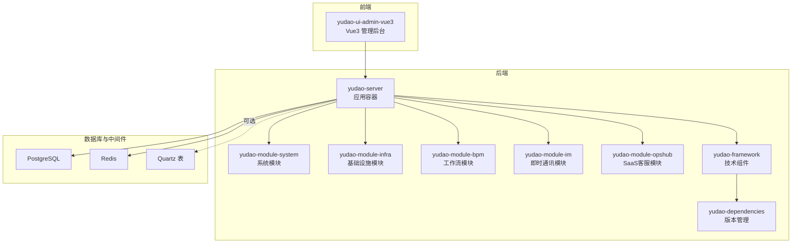
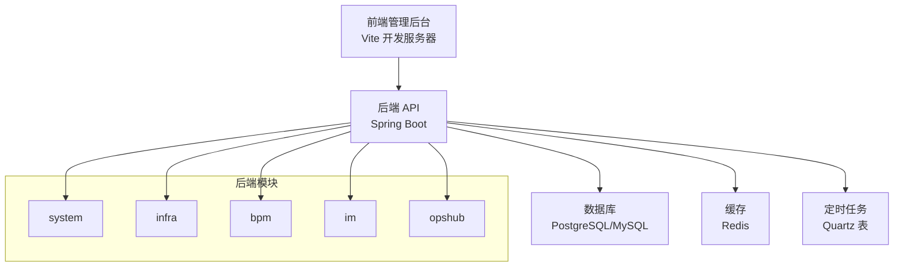
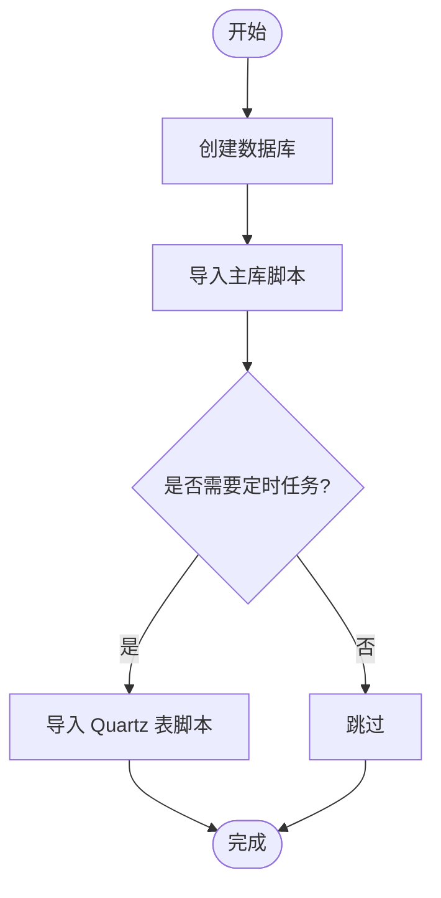
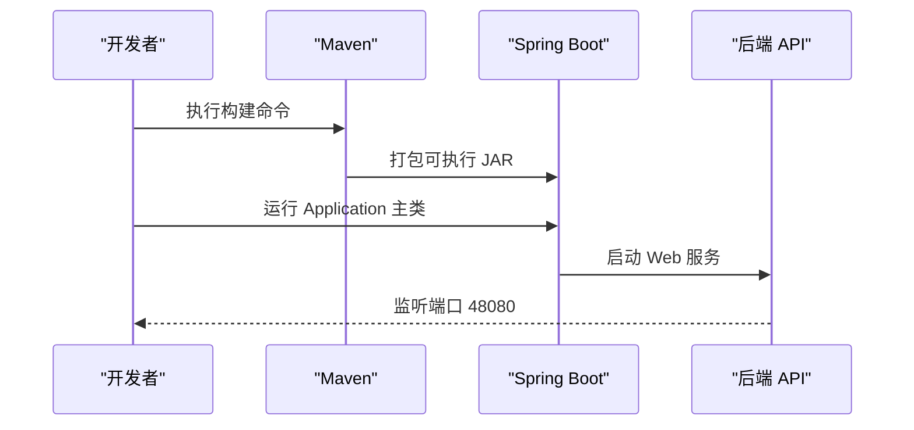
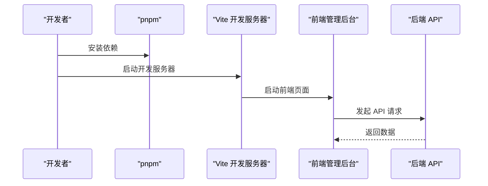
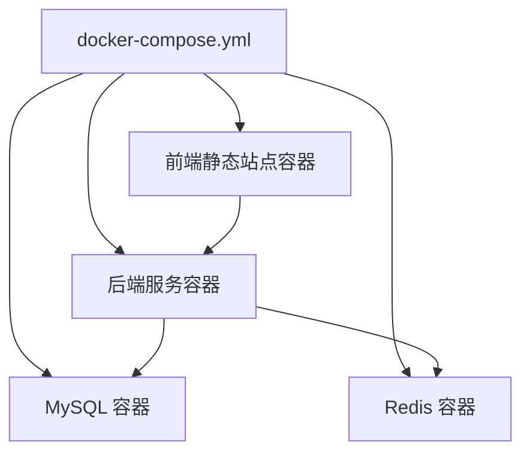
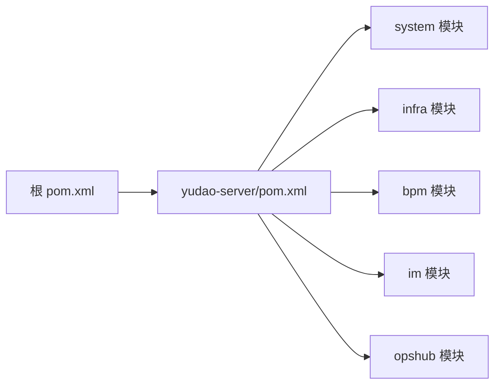

# 快速开始

<cite>
**本文引用的文件**
- [README.md](file://README.md)
- [STARTUP.md](file://STARTUP.md)
- [DEVELOPMENT-GUIDE.md](file://DEVELOPMENT-GUIDE.md)
- [pom.xml](file://pom.xml)
- [yudao-server/pom.xml](file://yudao-server/pom.xml)
- [yudao-server/src/main/resources/application-local.yaml](file://yudao-server/src/main/resources/application-local.yaml)
- [yudao-server/src/main/resources/application-dev.yaml](file://yudao-server/src/main/resources/application-dev.yaml)
- [yudao-server/src/main/java/cn/iocoder/yudao/server/YudaoServerApplication.java](file://yudao-server/src/main/java/cn/iocoder/yudao/server/YudaoServerApplication.java)
- [yudao-ui/yudao-ui-admin-vue3/package.json](file://yudao-ui/yudao-ui-admin-vue3/package.json)
- [yudao-ui/yudao-ui-admin-vue3/.env.local](file://yudao-ui/yudao-ui-admin-vue3/.env.local)
- [yudao-ui/yudao-ui-admin-vue3/.env.dev](file://yudao-ui/yudao-ui-admin-vue3/.env.dev)
- [yudao-ui/yudao-ui-admin-vue3/.env.prod](file://yudao-ui/yudao-ui-admin-vue3/.env.prod)
- [sql/postgresql/ruoyi-vue-pro.sql](file://sql/postgresql/ruoyi-vue-pro.sql)
- [sql/postgresql/quartz.sql](file://sql/postgresql/quartz.sql)
- [script/docker/docker-compose.yml](file://script/docker/docker-compose.yml)
- [script/docker/docker.env](file://script/docker/docker.env)
</cite>

## 目录
1. [简介](#简介)
2. [项目结构](#项目结构)
3. [核心组件](#核心组件)
4. [架构总览](#架构总览)
5. [详细组件分析](#详细组件分析)
6. [依赖分析](#依赖分析)
7. [性能考虑](#性能考虑)
8. [故障排查指南](#故障排查指南)
9. [结论](#结论)
10. [附录](#附录)

## 简介
本指南面向首次接触芋道 Ruoyi-Vue-Pro 的开发者，目标是在本地快速搭建并运行完整的前后端系统，涵盖环境准备、数据库与中间件部署、Maven 构建、前端依赖安装、本地启动流程、开发工具配置建议、首次启动验证与常见问题排查。项目采用 Spring Boot 多模块架构，后端提供 REST API，前端使用 Vue3 + Element Plus。

## 项目结构
- 后端多模块：yudao-dependencies（依赖版本管理）、yudao-framework（技术组件封装）、yudao-server（应用容器）、各业务模块（system、infra、bpm、im、opshub 等）。
- 前端：yudao-ui-admin-vue3（Vue3 管理后台）。
- 基础设施：MySQL/PostgreSQL、Redis、可选 MinIO、Quartz 定时任务表等。
- Docker：提供一键编排后端服务与前端静态站点。

**章节来源**
- [README.md: 第324-348 行:324-348](file://README.md#L324-L348)
- [pom.xml: 第10-33 行:10-33](file://pom.xml#L10-L33)
- [yudao-server/pom.xml: 第23-165 行:23-165](file://yudao-server/pom.xml#L23-L165)

## 核心组件
- 后端启动类：YudaoServerApplication，负责扫描模块与启动 Spring Boot 应用。
- 配置文件：
  - application-local.yaml：本地开发默认配置（PostgreSQL、Redis、Quartz 等）。
  - application-dev.yaml：开发环境配置（MySQL、Redis、Quartz 等）。
- 前端工程：yudao-ui-admin-vue3，使用 Vite + Vue3 + TypeScript，通过 .env.* 环境变量切换后端地址。
- 数据库脚本：PostgreSQL 主库脚本 ruoyi-vue-pro.sql，Quartz 定时任务表 quartz.sql。
- Docker 编排：docker-compose.yml 一键启动 MySQL、Redis、后端服务与前端静态站点。

**章节来源**
- [YudaoServerApplication.java: 第15-32 行:15-32](file://yudao-server/src/main/java/cn/iocoder/yudao/server/YudaoServerApplication.java#L15-L32)
- [application-local.yaml: 第1-285 行:1-285](file://yudao-server/src/main/resources/application-local.yaml#L1-L285)
- [application-dev.yaml: 第1-212 行:1-212](file://yudao-server/src/main/resources/application-dev.yaml#L1-L212)
- [package.json: 第7-26 行:7-26](file://yudao-ui/yudao-ui-admin-vue3/package.json#L7-L26)
- [docker-compose.yml: 第5-56 行:5-56](file://script/docker/docker-compose.yml#L5-L56)

## 架构总览
后端通过 yudao-server 作为容器聚合各模块，对外提供 REST API；前端通过 Vite 开发服务器代理请求到后端。数据库可选 PostgreSQL 或 MySQL，Redis 用于缓存与分布式能力，Quartz 用于定时任务持久化。

**图表来源**
- [application-local.yaml: 第50-88 行:50-88](file://yudao-server/src/main/resources/application-local.yaml#L50-L88)
- [application-dev.yaml: 第49-65 行:49-65](file://yudao-server/src/main/resources/application-dev.yaml#L49-L65)
- [yudao-server/pom.xml: 第23-165 行:23-165](file://yudao-server/pom.xml#L23-L165)

## 详细组件分析

### 环境准备与基础设施
- JDK 与构建工具
  - JDK：17+
  - Maven：3.8+
  - Node.js：18+（前端）
  - pnpm：9+（前端包管理）
- 数据库
  - PostgreSQL 13+（本地默认）
  - MySQL 5.7/8.0+（开发环境可选）
- 缓存
  - Redis 6+（本地默认）
- 文件存储（可选）
  - MinIO（S3 兼容），可在管理后台配置或通过 SQL 插入配置。

**章节来源**
- [STARTUP.md: 第5-14 行:5-14](file://STARTUP.md#L5-L14)
- [README.md: 第354-358 行:354-358](file://README.md#L354-L358)
- [application-local.yaml: 第50-88 行:50-88](file://yudao-server/src/main/resources/application-local.yaml#L50-L88)
- [application-dev.yaml: 第49-65 行:49-65](file://yudao-server/src/main/resources/application-dev.yaml#L49-L65)

### 数据库初始化（PostgreSQL）
- 创建数据库与导入主库脚本
- 如需定时任务，导入 Quartz 表脚本

**图表来源**
- [STARTUP.md: 第19-33 行:19-33](file://STARTUP.md#L19-L33)
- [sql/postgresql/ruoyi-vue-pro.sql: 第1-200 行:1-200](file://sql/postgresql/ruoyi-vue-pro.sql#L1-L200)
- [sql/postgresql/quartz.sql: 全部](file://sql/postgresql/quartz.sql)

**章节来源**
- [STARTUP.md: 第19-33 行:19-33](file://STARTUP.md#L19-L33)

### 后端启动（Maven）
- 完整构建（跳过测试）
- 启动后端服务（默认端口 48080）
- Swagger 文档：http://localhost:48080/swagger-ui

**图表来源**
- [STARTUP.md: 第44-54 行:44-54](file://STARTUP.md#L44-L54)
- [YudaoServerApplication.java: 第19-24 行:19-24](file://yudao-server/src/main/java/cn/iocoder/yudao/server/YudaoServerApplication.java#L19-L24)

**章节来源**
- [STARTUP.md: 第44-54 行:44-54](file://STARTUP.md#L44-L54)
- [pom.xml: 第39-53 行:39-53](file://pom.xml#L39-L53)
- [yudao-server/pom.xml: 第170-183 行:170-183](file://yudao-server/pom.xml#L170-L183)

### 前端启动（Vite）
- 安装依赖（pnpm install）
- 本地开发：前端请求指向后端 http://localhost:48080
- 开发环境模式：前端请求指向远程开发环境

**图表来源**
- [STARTUP.md: 第64-87 行:64-87](file://STARTUP.md#L64-L87)
- [package.json: 第7-26 行:7-26](file://yudao-ui/yudao-ui-admin-vue3/package.json#L7-L26)
- [.env.local: 第6-13 行:6-13](file://yudao-ui/yudao-ui-admin-vue3/.env.local#L6-L13)
- [.env.dev: 第6-13 行:6-13](file://yudao-ui/yudao-ui-admin-vue3/.env.dev#L6-L13)

**章节来源**
- [STARTUP.md: 第64-87 行:64-87](file://STARTUP.md#L64-L87)
- [package.json: 第7-26 行:7-26](file://yudao-ui/yudao-ui-admin-vue3/package.json#L7-L26)
- [.env.local: 第6-13 行:6-13](file://yudao-ui/yudao-ui-admin-vue3/.env.local#L6-L13)
- [.env.dev: 第6-13 行:6-13](file://yudao-ui/yudao-ui-admin-vue3/.env.dev#L6-L13)

### Docker 一键启动（可选）
- 使用 docker-compose 启动 MySQL、Redis、后端服务与前端静态站点
- 通过环境变量覆盖数据库与 Redis 连接

**图表来源**
- [docker-compose.yml: 第5-56 行:5-56](file://script/docker/docker-compose.yml#L5-L56)
- [docker.env: 第1-26 行:1-26](file://script/docker/docker.env#L1-L26)

**章节来源**
- [docker-compose.yml: 第5-56 行:5-56](file://script/docker/docker-compose.yml#L5-L56)
- [docker.env: 第1-26 行:1-26](file://script/docker/docker.env#L1-L26)

### 登录与首次验证
- 前端访问：http://localhost:80（Vite 默认端口）
- 默认账号：admin / admin123
- 验证项：
  - 成功登录并进入后台首页
  - Swagger 文档可用：http://localhost:48080/swagger-ui
  - 基础模块（系统、基础设施、工作流、IM、opshub）功能可正常使用

**章节来源**
- [STARTUP.md: 第134-141 行:134-141](file://STARTUP.md#L134-L141)
- [application-local.yaml: 第1-L285 行:1-285](file://yudao-server/src/main/resources/application-local.yaml#L1-L285)

## 依赖分析
- Maven 版本与模块启用
  - 根 pom.xml 的 <modules> 与 yudao-server/pom.xml 的 <dependencies> 必须同步启用模块，否则构建失败。
- 后端依赖方向
  - Controller → Service → DAL，禁止反向依赖。
- 前端依赖与脚本
  - package.json 定义了开发与构建脚本，Vite 模式通过 .env.* 切换后端地址。

**图表来源**
- [pom.xml: 第10-33 行:10-33](file://pom.xml#L10-L33)
- [yudao-server/pom.xml: 第23-165 行:23-165](file://yudao-server/pom.xml#L23-L165)

**章节来源**
- [DEVELOPMENT-GUIDE.md: 第64-70 行:64-70](file://DEVELOPMENT-GUIDE.md#L64-L70)
- [pom.xml: 第10-33 行:10-33](file://pom.xml#L10-L33)
- [yudao-server/pom.xml: 第23-165 行:23-165](file://yudao-server/pom.xml#L23-L165)

## 性能考虑
- 连接池与慢 SQL 监控：Druid 连接池配置与慢 SQL 记录已在本地配置中启用。
- 日志分级：针对不同模块设置日志级别，便于定位性能瓶颈。
- 定时任务：本地开发环境默认不自动启动 Quartz，避免不必要的任务占用。

**章节来源**
- [application-local.yaml: 第13-46 行:13-46](file://yudao-server/src/main/resources/application-local.yaml#L13-L46)
- [application-local.yaml: 第171-201 行:171-201](file://yudao-server/src/main/resources/application-local.yaml#L171-L201)
- [application-local.yaml: 第93-120 行:93-120](file://yudao-server/src/main/resources/application-local.yaml#L93-L120)

## 故障排查指南
- Maven 构建找不到模块
  - 根 pom.xml 的 <modules> 与 yudao-server/pom.xml 的 <dependencies> 必须同步启用。
- 前端 pnpm 安装报错
  - .npmrc 已配置 onlyBuiltDependencies，若仍有报错，可在 .npmrc 中追加对应包名放行。
- 后端启动连接数据库/Redis 失败
  - 检查 application-local.yaml 中的连接地址、用户名、密码，确认远程服务器防火墙开放对应端口（PostgreSQL: 15432, Redis: 6379）。

**章节来源**
- [STARTUP.md: 第146-156 行:146-156](file://STARTUP.md#L146-L156)

## 结论
按照本指南完成环境准备、数据库初始化、后端与前端启动，即可在本地快速运行芋道 Ruoyi-Vue-Pro 的完整功能。建议在开发过程中结合 Swagger 文档与日志分级进行调试，并通过 Docker 编排实现一键部署验证。

## 附录
- 开发工具配置建议
  - IDEA：启用 Lombok、MapStruct 注解处理器，使用 Maven 插件管理器配置编译参数。
  - VS Code：安装 Vue、TypeScript、ESLint、Prettier 插件，配合 .env.* 环境变量进行开发。
- 常用命令
  - 后端：mvn clean install -DskipTests；mvn spring-boot:run -pl yudao-server
  - 前端：cd yudao-ui/yudao-ui-admin-vue3 && pnpm install；pnpm dev
- 参考文档
  - 项目 README 与启动指南、开发规范文档

**章节来源**
- [README.md: 第16-22 行:16-22](file://README.md#L16-L22)
- [DEVELOPMENT-GUIDE.md: 第1-L20 行:1-20](file://DEVELOPMENT-GUIDE.md#L1-L20)