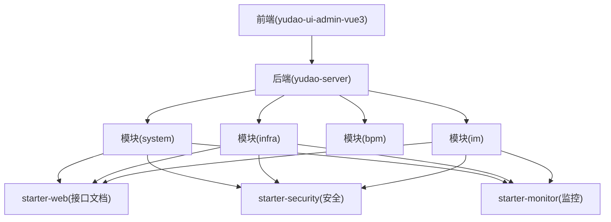
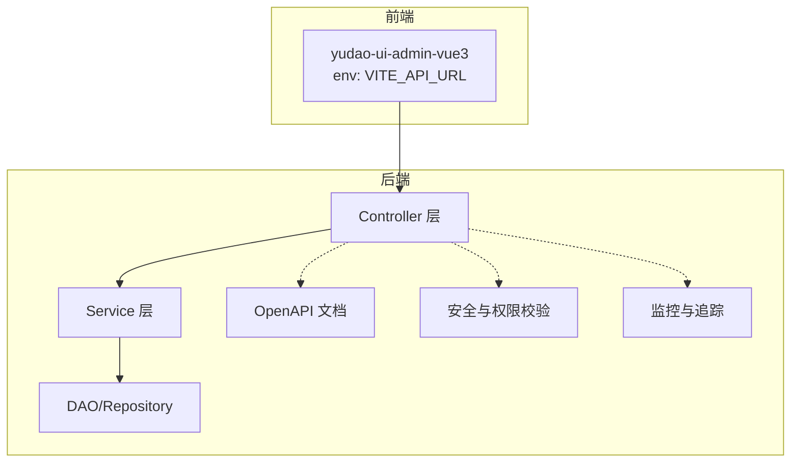
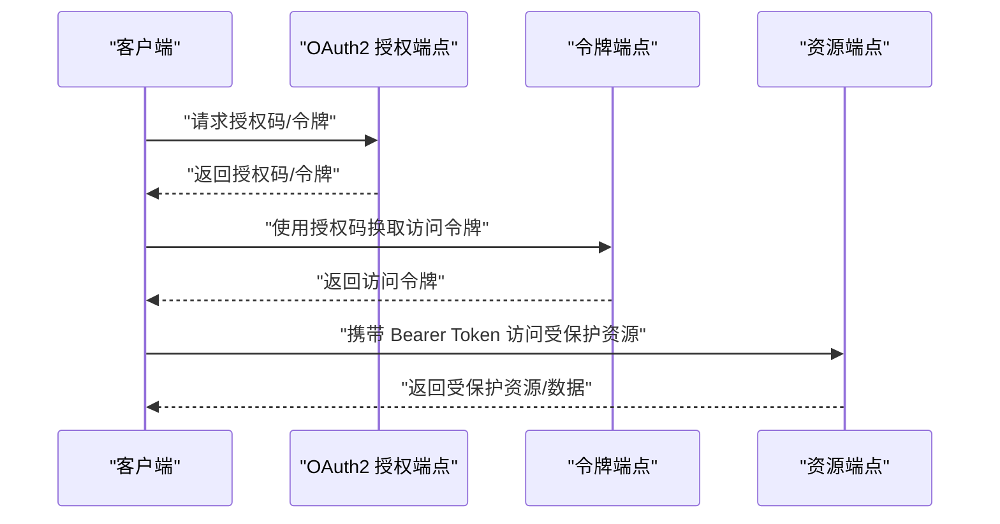
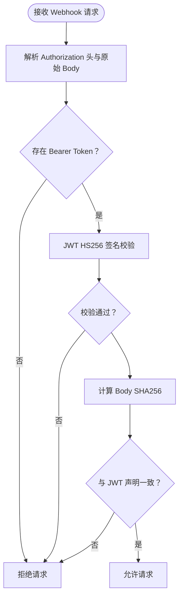
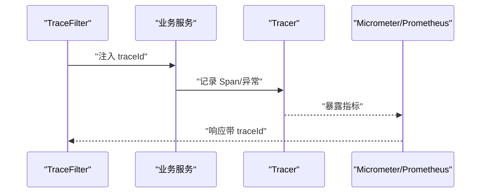
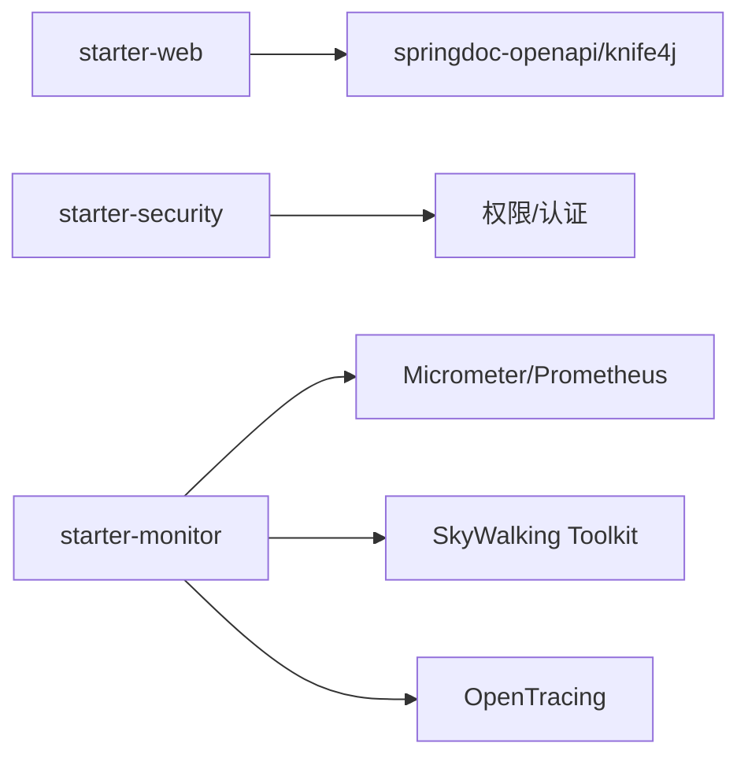

# API 扩展

<cite>
**本文引用的文件**
- [DEVELOPMENT-GUIDE.md](file://DEVELOPMENT-GUIDE.md)
- [README.md](file://README.md)
- [yudao-module-system/src/main/java/cn/iocoder/yudao/module/system/controller/package-info.java](file://yudao-module-system/src/main/java/cn/iocoder/yudao/module/system/controller/package-info.java)
- [yudao-module-infra/src/main/java/cn/iocoder/yudao/module/infra/controller/package-info.java](file://yudao-module-infra/src/main/java/cn/iocoder/yudao/module/infra/controller/package-info.java)
- [yudao-module-im/src/main/java/cn/iocoder/yudao/module/im/framework/web/config/ImWebConfiguration.java](file://yudao-module-im/src/main/java/cn/iocoder/yudao/module/im/framework/web/config/ImWebConfiguration.java)
- [yudao-framework/yudao-spring-boot-starter-web/pom.xml](file://yudao-framework/yudao-spring-boot-starter-web/pom.xml)
- [yudao-module-system/src/main/java/cn/iocoder/yudao/module/system/convert/oauth2/OAuth2OpenConvert.java](file://yudao-module-system/src/main/java/cn/iocoder/yudao/module/system/convert/oauth2/OAuth2OpenConvert.java)
- [yudao-module-system/src/main/java/cn/iocoder/yudao/module/system/enums/oauth2/OAuth2GrantTypeEnum.java](file://yudao-module-system/src/main/java/cn/iocoder/yudao/module/system/enums/oauth2/OAuth2GrantTypeEnum.java)
- [yudao-module-system/src/main/java/cn/iocoder/yudao/module/system/util/oauth2/OAuth2Utils.java](file://yudao-module-system/src/main/java/cn/iocoder/yudao/module/system/util/oauth2/OAuth2Utils.java)
- [yudao-module-system/src/main/java/cn/iocoder/yudao/module/system/service/oauth2/OAuth2ApproveService.java](file://yudao-module-system/src/main/java/cn/iocoder/yudao/module/system/service/oauth2/OAuth2ApproveService.java)
- [yudao-module-system/src/main/java/cn/iocoder/yudao/module/system/service/oauth2/OAuth2ApproveServiceImpl.java](file://yudao-module-system/src/main/java/cn/iocoder/yudao/module/system/service/oauth2/OAuth2ApproveServiceImpl.java)
- [yudao-module-im/src/main/java/cn/iocoder/yudao/module/im/framework/rtc/core/LiveKitClient.java](file://yudao-module-im/src/main/java/cn/iocoder/yudao/module/im/framework/rtc/core/LiveKitClient.java)
- [yudao-framework/yudao-spring-boot-starter-monitor/src/main/java/cn/iocoder/yudao/framework/tracer/config/YudaoTracerAutoConfiguration.java](file://yudao-framework/yudao-spring-boot-starter-monitor/src/main/java/cn/iocoder/yudao/framework/tracer/config/YudaoTracerAutoConfiguration.java)
- [yudao-framework/yudao-spring-boot-starter-monitor/src/main/java/cn/iocoder/yudao/framework/tracer/core/util/TracerFrameworkUtils.java](file://yudao-framework/yudao-spring-boot-starter-monitor/src/main/java/cn/iocoder/yudao/framework/tracer/core/util/TracerFrameworkUtils.java)
- [yudao-framework/yudao-spring-boot-starter-monitor/src/main/java/cn/iocoder/yudao/framework/tracer/config/TracerProperties.java](file://yudao-framework/yudao-spring-boot-starter-monitor/src/main/java/cn/iocoder/yudao/framework/tracer/config/TracerProperties.java)
- [yudao-framework/yudao-spring-boot-starter-monitor/src/main/java/cn/iocoder/yudao/framework/tracer/config/YudaoMetricsAutoConfiguration.java](file://yudao-framework/yudao-spring-boot-starter-monitor/src/main/java/cn/iocoder/yudao/framework/tracer/config/YudaoMetricsAutoConfiguration.java)
- [yudao-framework/yudao-spring-boot-starter-monitor/pom.xml](file://yudao-framework/yudao-spring-boot-starter-monitor/pom.xml)
- [yudao-framework/yudao-common/src/main/java/cn/iocoder/yudao/framework/common/util/monitor/TracerUtils.java](file://yudao-framework/yudao-common/src/main/java/cn/iocoder/yudao/framework/common/util/monitor/TracerUtils.java)
- [yudao-dependencies/pom.xml](file://yudao-dependencies/pom.xml)
- [yudao-ui/yudao-ui-admin-vue3/types/env.d.ts](file://yudao-ui/yudao-ui-admin-vue3/types/env.d.ts)
- [yudao-module-system/src/main/java/cn/iocoder/yudao/module/system/api/package-info.java](file://yudao-module-system/src/main/java/cn/iocoder/yudao/module/system/api/package-info.java)
- [yudao-module-system/src/main/java/cn/iocoder/yudao/module/system/service/oauth2/OAuth2ApproveServiceImpl.java](file://yudao-module-system/src/main/java/cn/iocoder/yudao/module/system/service/oauth2/OAuth2ApproveServiceImpl.java)
- [yudao-module-system/src/main/java/cn/iocoder/yudao/module/system/util/oauth2/OAuth2Utils.java](file://yudao-module-system/src/main/java/cn/iocoder/yudao/module/system/util/oauth2/OAuth2Utils.java)
- [yudao-module-system/src/main/java/cn/iocoder/yudao/module/system/convert/oauth2/OAuth2OpenConvert.java](file://yudao-module-system/src/main/java/cn/iocoder/yudao/module/system/convert/oauth2/OAuth2OpenConvert.java)
- [yudao-module-system/src/main/java/cn/iocoder/yudao/module/system/enums/oauth2/OAuth2GrantTypeEnum.java](file://yudao-module-system/src/main/java/cn/iocoder/yudao/module/system/enums/oauth2/OAuth2GrantTypeEnum.java)
- [yudao-module-system/src/main/java/cn/iocoder/yudao/module/system/service/oauth2/OAuth2ApproveService.java](file://yudao-module-system/src/main/java/cn/iocoder/yudao/module/system/service/oauth2/OAuth2ApproveService.java)
- [yudao-module-system/src/main/java/cn/iocoder/yudao/module/system/service/oauth2/OAuth2ApproveServiceImpl.java](file://yudao-module-system/src/main/java/cn/iocoder/yudao/module/system/service/oauth2/OAuth2ApproveServiceImpl.java)
- [yudao-module-im/src/main/java/cn/iocoder/yudao/module/im/framework/rtc/core/LiveKitClient.java](file://yudao-module-im/src/main/java/cn/iocoder/yudao/module/im/framework/rtc/core/LiveKitClient.java)
- [yudao-framework/yudao-spring-boot-starter-monitor/src/main/java/cn/iocoder/yudao/framework/tracer/config/YudaoTracerAutoConfiguration.java](file://yudao-framework/yudao-spring-boot-starter-monitor/src/main/java/cn/iocoder/yudao/framework/tracer/config/YudaoTracerAutoConfiguration.java)
- [yudao-framework/yudao-spring-boot-starter-monitor/src/main/java/cn/iocoder/yudao/framework/tracer/core/util/TracerFrameworkUtils.java](file://yudao-framework/yudao-spring-boot-starter-monitor/src/main/java/cn/iocoder/yudao/framework/tracer/core/util/TracerFrameworkUtils.java)
- [yudao-framework/yudao-spring-boot-starter-monitor/src/main/java/cn/iocoder/yudao/framework/tracer/config/TracerProperties.java](file://yudao-framework/yudao-spring-boot-starter-monitor/src/main/java/cn/iocoder/yudao/framework/tracer/config/TracerProperties.java)
- [yudao-framework/yudao-spring-boot-starter-monitor/src/main/java/cn/iocoder/yudao/framework/tracer/config/YudaoMetricsAutoConfiguration.java](file://yudao-framework/yudao-spring-boot-starter-monitor/src/main/java/cn/iocoder/yudao/framework/tracer/config/YudaoMetricsAutoConfiguration.java)
- [yudao-framework/yudao-spring-boot-starter-monitor/pom.xml](file://yudao-framework/yudao-spring-boot-starter-monitor/pom.xml)
- [yudao-framework/yudao-common/src/main/java/cn/iocoder/yudao/framework/common/util/monitor/TracerUtils.java](file://yudao-framework/yudao-common/src/main/java/cn/iocoder/yudao/framework/common/util/monitor/TracerUtils.java)
- [yudao-dependencies/pom.xml](file://yudao-dependencies/pom.xml)
- [yudao-ui/yudao-ui-admin-vue3/types/env.d.ts](file://yudao-ui/yudao-ui-admin-vue3/types/env.d.ts)
- [yudao-module-system/src/main/java/cn/iocoder/yudao/module/system/api/package-info.java](file://yudao-module-system/src/main/java/cn/iocoder/yudao/module/system/api/package-info.java)
</cite>

## 目录
1. [简介](#简介)
2. [项目结构](#项目结构)
3. [核心组件](#核心组件)
4. [架构总览](#架构总览)
5. [详细组件分析](#详细组件分析)
6. [依赖分析](#依赖分析)
7. [性能考虑](#性能考虑)
8. [故障排查指南](#故障排查指南)
9. [结论](#结论)
10. [附录](#附录)

## 简介
本指南面向“芋道 ruoyi-vue-pro”项目的 API 扩展与治理，围绕以下主题展开：RESTful 设计原则（资源命名、HTTP 方法与状态码）、接口版本管理策略（URL/Header/Query）、API 文档生成与维护（Swagger/OpenAPI）、接口安全扩展（JWT 认证、OAuth2 授权、接口签名验证）、接口限流与熔断（令牌桶/漏桶/Hystrix）、接口监控与追踪（请求日志、性能指标、错误追踪）、接口测试策略（单元/集成/压力）、接口兼容性处理（向后兼容与废弃过渡），以及完整的 API 开发流程与最佳实践。

## 项目结构
- 后端采用多模块分层：各业务模块（如 system、infra、im 等）提供各自 Controller 与 Service；公共能力以 starter 形式提供（web、security、monitor、protection 等）。
- 前端通过统一的 API 层对接后端，环境变量中包含 API 基础地址等配置项。
- 文档与监控：基于 Springdoc/OpenAPI 生成接口文档；基于 Micrometer + Prometheus + SkyWalking 实现监控与链路追踪。

图表来源
- [yudao-module-system/src/main/java/cn/iocoder/yudao/module/system/controller/package-info.java:1-6](file://yudao-module-system/src/main/java/cn/iocoder/yudao/module/system/controller/package-info.java#L1-L6)
- [yudao-module-infra/src/main/java/cn/iocoder/yudao/module/infra/controller/package-info.java:1-6](file://yudao-module-infra/src/main/java/cn/iocoder/yudao/module/infra/controller/package-info.java#L1-L6)
- [yudao-ui/yudao-ui-admin-vue3/types/env.d.ts:10-35](file://yudao-ui/yudao-ui-admin-vue3/types/env.d.ts#L10-L35)

章节来源
- [yudao-module-system/src/main/java/cn/iocoder/yudao/module/system/controller/package-info.java:1-6](file://yudao-module-system/src/main/java/cn/iocoder/yudao/module/system/controller/package-info.java#L1-L6)
- [yudao-module-infra/src/main/java/cn/iocoder/yudao/module/infra/controller/package-info.java:1-6](file://yudao-module-infra/src/main/java/cn/iocoder/yudao/module/infra/controller/package-info.java#L1-L6)
- [yudao-ui/yudao-ui-admin-vue3/types/env.d.ts:10-35](file://yudao-ui/yudao-ui-admin-vue3/types/env.d.ts#L10-L35)

## 核心组件
- 接口文档与 OpenAPI：后端通过 starter-web 引入 springdoc-openapi 与 knife4j，结合模块级 GroupedOpenApi 进行分组展示。
- 安全与认证：基于 Spring Security 与安全框架工具类，提供权限校验与认证上下文。
- OAuth2：提供授权类型枚举、工具方法、开放接口转换器与批准服务。
- 链路追踪与监控：提供 TraceFilter、Metrics 自动装配与 SkyWalking 工具类。
- RTC/Webhook 签名：LiveKitClient 提供 webhook 签名校验与管理 Token 签发。

章节来源
- [yudao-framework/yudao-spring-boot-starter-web/pom.xml:41-48](file://yudao-framework/yudao-spring-boot-starter-web/pom.xml#L41-L48)
- [yudao-module-im/src/main/java/cn/iocoder/yudao/module/im/framework/web/config/ImWebConfiguration.java:17-20](file://yudao-module-im/src/main/java/cn/iocoder/yudao/module/im/framework/web/config/ImWebConfiguration.java#L17-L20)
- [yudao-module-system/src/main/java/cn/iocoder/yudao/module/system/convert/oauth2/OAuth2OpenConvert.java:23-56](file://yudao-module-system/src/main/java/cn/iocoder/yudao/module/system/convert/oauth2/OAuth2OpenConvert.java#L23-L56)
- [yudao-module-system/src/main/java/cn/iocoder/yudao/module/system/enums/oauth2/OAuth2GrantTypeEnum.java:14-21](file://yudao-module-system/src/main/java/cn/iocoder/yudao/module/system/enums/oauth2/OAuth2GrantTypeEnum.java#L14-L21)
- [yudao-module-system/src/main/java/cn/iocoder/yudao/module/system/util/oauth2/OAuth2Utils.java:30-68](file://yudao-module-system/src/main/java/cn/iocoder/yudao/module/system/util/oauth2/OAuth2Utils.java#L30-L68)
- [yudao-module-system/src/main/java/cn/iocoder/yudao/module/system/service/oauth2/OAuth2ApproveService.java:16-52](file://yudao-module-system/src/main/java/cn/iocoder/yudao/module/system/service/oauth2/OAuth2ApproveService.java#L16-L52)
- [yudao-module-system/src/main/java/cn/iocoder/yudao/module/system/service/oauth2/OAuth2ApproveServiceImpl.java:25-60](file://yudao-module-system/src/main/java/cn/iocoder/yudao/module/system/service/oauth2/OAuth2ApproveServiceImpl.java#L25-L60)
- [yudao-framework/yudao-spring-boot-starter-monitor/src/main/java/cn/iocoder/yudao/framework/tracer/config/YudaoTracerAutoConfiguration.java:45-51](file://yudao-framework/yudao-spring-boot-starter-monitor/src/main/java/cn/iocoder/yudao/framework/tracer/config/YudaoTracerAutoConfiguration.java#L45-L51)
- [yudao-framework/yudao-spring-boot-starter-monitor/src/main/java/cn/iocoder/yudao/framework/tracer/core/util/TracerFrameworkUtils.java:24-44](file://yudao-framework/yudao-spring-boot-starter-monitor/src/main/java/cn/iocoder/yudao/framework/tracer/core/util/TracerFrameworkUtils.java#L24-L44)
- [yudao-framework/yudao-spring-boot-starter-monitor/src/main/java/cn/iocoder/yudao/framework/tracer/config/YudaoMetricsAutoConfiguration.java:21-25](file://yudao-framework/yudao-spring-boot-starter-monitor/src/main/java/cn/iocoder/yudao/framework/tracer/config/YudaoMetricsAutoConfiguration.java#L21-L25)
- [yudao-framework/yudao-spring-boot-starter-monitor/pom.xml:44-76](file://yudao-framework/yudao-spring-boot-starter-monitor/pom.xml#L44-L76)
- [yudao-framework/yudao-common/src/main/java/cn/iocoder/yudao/framework/common/util/monitor/TracerUtils.java:26-28](file://yudao-framework/yudao-common/src/main/java/cn/iocoder/yudao/framework/common/util/monitor/TracerUtils.java#L26-L28)
- [yudao-module-im/src/main/java/cn/iocoder/yudao/module/im/framework/rtc/core/LiveKitClient.java:181-206](file://yudao-module-im/src/main/java/cn/iocoder/yudao/module/im/framework/rtc/core/LiveKitClient.java#L181-L206)

## 架构总览
下图展示了 API 扩展的关键交互路径：前端通过统一 API 地址访问后端；后端按模块划分 Controller；文档由 OpenAPI 自动生成；安全通过 Spring Security 与工具类保障；监控与链路追踪贯穿请求生命周期。

图表来源
- [yudao-ui/yudao-ui-admin-vue3/types/env.d.ts:20-23](file://yudao-ui/yudao-ui-admin-vue3/types/env.d.ts#L20-L23)
- [yudao-framework/yudao-spring-boot-starter-web/pom.xml:41-48](file://yudao-framework/yudao-spring-boot-starter-web/pom.xml#L41-L48)
- [yudao-framework/yudao-spring-boot-starter-monitor/src/main/java/cn/iocoder/yudao/framework/tracer/config/YudaoTracerAutoConfiguration.java:45-51](file://yudao-framework/yudao-spring-boot-starter-monitor/src/main/java/cn/iocoder/yudao/framework/tracer/config/YudaoTracerAutoConfiguration.java#L45-L51)

章节来源
- [yudao-ui/yudao-ui-admin-vue3/types/env.d.ts:20-23](file://yudao-ui/yudao-ui-admin-vue3/types/env.d.ts#L20-L23)
- [yudao-framework/yudao-spring-boot-starter-web/pom.xml:41-48](file://yudao-framework/yudao-spring-boot-starter-web/pom.xml#L41-L48)
- [yudao-framework/yudao-spring-boot-starter-monitor/src/main/java/cn/iocoder/yudao/framework/tracer/config/YudaoTracerAutoConfiguration.java:45-51](file://yudao-framework/yudao-spring-boot-starter-monitor/src/main/java/cn/iocoder/yudao/framework/tracer/config/YudaoTracerAutoConfiguration.java#L45-L51)

## 详细组件分析

### RESTful 设计原则与最佳实践
- 资源命名：采用名词复数形式，层级清晰；不同前端（admin/app）通过模块包区分。
- HTTP 方法：POST/PUT/DELETE/GET 明确 CRUD 行为；参数校验使用 @Valid/@Validated。
- 状态码：遵循 2xx/4xx/5xx 常规语义；统一返回体封装（success/fail）便于前端处理。
- 权限控制：使用 @PreAuthorize 进行细粒度权限校验。

章节来源
- [DEVELOPMENT-GUIDE.md:201-251](file://DEVELOPMENT-GUIDE.md#L201-L251)
- [yudao-module-system/src/main/java/cn/iocoder/yudao/module/system/controller/package-info.java:1-6](file://yudao-module-system/src/main/java/cn/iocoder/yudao/module/system/controller/package-info.java#L1-L6)
- [yudao-module-infra/src/main/java/cn/iocoder/yudao/module/infra/controller/package-info.java:1-6](file://yudao-module-infra/src/main/java/cn/iocoder/yudao/module/infra/controller/package-info.java#L1-L6)

### 接口版本管理策略
- URL 版本控制：可在模块级或控制器级引入版本前缀（例如 /v1），便于平滑演进。
- Header 版本控制：通过 Accept 或 X-API-Version 指定版本，利于无侵扰升级。
- Query 参数版本控制：通过 v 或 version 参数传递，适合临时过渡场景。
- 建议：优先采用 URL 版本控制，配合文档明确版本生命周期与弃用策略。

[本节为通用策略说明，无需列出具体文件来源]

### API 文档生成与维护（Swagger/OpenAPI）
- 依赖引入：starter-web 中包含 springdoc-openapi 与 knife4j，确保文档自动生成。
- 模块分组：通过 GroupedOpenApi 为各模块构建独立文档分组，提升可读性。
- 文档注解：结合 @Tag、@Operation、@Parameter 等注解完善接口描述与参数说明。
- 访问方式：本地可通过 Knife4J UI 或 swagger-ui 查看接口文档。

章节来源
- [yudao-framework/yudao-spring-boot-starter-web/pom.xml:41-48](file://yudao-framework/yudao-spring-boot-starter-web/pom.xml#L41-L48)
- [yudao-module-im/src/main/java/cn/iocoder/yudao/module/im/framework/web/config/ImWebConfiguration.java:17-20](file://yudao-module-im/src/main/java/cn/iocoder/yudao/module/im/framework/web/config/ImWebConfiguration.java#L17-L20)
- [README.md:365-365](file://README.md#L365-L365)

### 接口安全扩展（JWT 认证、OAuth2 授权、接口签名验证）
- JWT 认证：后端通过安全框架工具类提供认证上下文与令牌类型常量，前端在鉴权头中携带 Bearer Token。
- OAuth2 授权：
  - 授权类型：密码模式、授权码模式、简化模式、客户端凭证模式、刷新模式。
  - 工具方法：构建授权码/简化模式重定向 URI、计算过期时间、拼接 scope 字符串。
  - 开放接口转换：统一封装 access_token、token_type、expires_in、scope 等字段。
  - 批准服务：支持客户端自动批准与用户历史批准合并判断。
- 接口签名验证：RTC/Webhook 签名通过 HS256 校验 JWT 与 body SHA256 一致性，确保第三方回调可信。

图表来源
- [yudao-module-system/src/main/java/cn/iocoder/yudao/module/system/enums/oauth2/OAuth2GrantTypeEnum.java:14-21](file://yudao-module-system/src/main/java/cn/iocoder/yudao/module/system/enums/oauth2/OAuth2GrantTypeEnum.java#L14-L21)
- [yudao-module-system/src/main/java/cn/iocoder/yudao/module/system/util/oauth2/OAuth2Utils.java:30-68](file://yudao-module-system/src/main/java/cn/iocoder/yudao/module/system/util/oauth2/OAuth2Utils.java#L30-L68)
- [yudao-module-system/src/main/java/cn/iocoder/yudao/module/system/convert/oauth2/OAuth2OpenConvert.java:28-41](file://yudao-module-system/src/main/java/cn/iocoder/yudao/module/system/convert/oauth2/OAuth2OpenConvert.java#L28-L41)

章节来源
- [yudao-module-system/src/main/java/cn/iocoder/yudao/module/system/convert/oauth2/OAuth2OpenConvert.java:23-56](file://yudao-module-system/src/main/java/cn/iocoder/yudao/module/system/convert/oauth2/OAuth2OpenConvert.java#L23-L56)
- [yudao-module-system/src/main/java/cn/iocoder/yudao/module/system/enums/oauth2/OAuth2GrantTypeEnum.java:14-21](file://yudao-module-system/src/main/java/cn/iocoder/yudao/module/system/enums/oauth2/OAuth2GrantTypeEnum.java#L14-L21)
- [yudao-module-system/src/main/java/cn/iocoder/yudao/module/system/util/oauth2/OAuth2Utils.java:30-68](file://yudao-module-system/src/main/java/cn/iocoder/yudao/module/system/util/oauth2/OAuth2Utils.java#L30-L68)
- [yudao-module-system/src/main/java/cn/iocoder/yudao/module/system/service/oauth2/OAuth2ApproveService.java:16-52](file://yudao-module-system/src/main/java/cn/iocoder/yudao/module/system/service/oauth2/OAuth2ApproveService.java#L16-L52)
- [yudao-module-system/src/main/java/cn/iocoder/yudao/module/system/service/oauth2/OAuth2ApproveServiceImpl.java:25-60](file://yudao-module-system/src/main/java/cn/iocoder/yudao/module/system/service/oauth2/OAuth2ApproveServiceImpl.java#L25-L60)

### 接口签名验证（LiveKit Webhook）
- 校验流程：先对 JWT 进行 HS256 签名校验，再对比 JWT 中声明的 body SHA256 与实际 body 的 SHA256。
- 管理 Token：签发具备 roomAdmin 权限的短期 JWT，用于调用 LiveKit 管理类 API。

图表来源
- [yudao-module-im/src/main/java/cn/iocoder/yudao/module/im/framework/rtc/core/LiveKitClient.java:181-206](file://yudao-module-im/src/main/java/cn/iocoder/yudao/module/im/framework/rtc/core/LiveKitClient.java#L181-L206)

章节来源
- [yudao-module-im/src/main/java/cn/iocoder/yudao/module/im/framework/rtc/core/LiveKitClient.java:181-206](file://yudao-module-im/src/main/java/cn/iocoder/yudao/module/im/framework/rtc/core/LiveKitClient.java#L181-L206)

### 接口限流与熔断机制
- 令牌桶/漏桶：建议在网关或服务入口处引入限流策略（如基于 Redis 的令牌桶），限制请求速率。
- Hystrix：可结合线程池隔离与熔断器模式，对下游依赖进行快速失败与降级处理。
- 实施要点：为高风险接口单独配置限流规则；对下游服务设置超时与重试策略；开启熔断后提供降级响应。

[本节为通用策略说明，无需列出具体文件来源]

### 接口监控与追踪（请求日志、性能监控、错误追踪）
- 链路追踪：TraceFilter 注入 traceId 响应头；SkyWalking Toolkit 提供 TraceContext 获取 TraceId。
- 错误追踪：TracerFrameworkUtils 将异常信息记录到 Span 中，便于定位问题。
- 指标监控：YudaoMetricsAutoConfiguration 为 Micrometer 注册 commonTags；Prometheus 采集指标。
- 依赖配置：starter-monitor 引入 opentracing、skywalking toolkit、prometheus 等依赖。

图表来源
- [yudao-framework/yudao-spring-boot-starter-monitor/src/main/java/cn/iocoder/yudao/framework/tracer/config/YudaoTracerAutoConfiguration.java:45-51](file://yudao-framework/yudao-spring-boot-starter-monitor/src/main/java/cn/iocoder/yudao/framework/tracer/config/YudaoTracerAutoConfiguration.java#L45-L51)
- [yudao-framework/yudao-spring-boot-starter-monitor/src/main/java/cn/iocoder/yudao/framework/tracer/core/util/TracerFrameworkUtils.java:24-44](file://yudao-framework/yudao-spring-boot-starter-monitor/src/main/java/cn/iocoder/yudao/framework/tracer/core/util/TracerFrameworkUtils.java#L24-L44)
- [yudao-framework/yudao-common/src/main/java/cn/iocoder/yudao/framework/common/util/monitor/TracerUtils.java:26-28](file://yudao-framework/yudao-common/src/main/java/cn/iocoder/yudao/framework/common/util/monitor/TracerUtils.java#L26-L28)
- [yudao-framework/yudao-spring-boot-starter-monitor/src/main/java/cn/iocoder/yudao/framework/tracer/config/YudaoMetricsAutoConfiguration.java:21-25](file://yudao-framework/yudao-spring-boot-starter-monitor/src/main/java/cn/iocoder/yudao/framework/tracer/config/YudaoMetricsAutoConfiguration.java#L21-L25)

章节来源
- [yudao-framework/yudao-spring-boot-starter-monitor/src/main/java/cn/iocoder/yudao/framework/tracer/config/YudaoTracerAutoConfiguration.java:45-51](file://yudao-framework/yudao-spring-boot-starter-monitor/src/main/java/cn/iocoder/yudao/framework/tracer/config/YudaoTracerAutoConfiguration.java#L45-L51)
- [yudao-framework/yudao-spring-boot-starter-monitor/src/main/java/cn/iocoder/yudao/framework/tracer/core/util/TracerFrameworkUtils.java:24-44](file://yudao-framework/yudao-spring-boot-starter-monitor/src/main/java/cn/iocoder/yudao/framework/tracer/core/util/TracerFrameworkUtils.java#L24-L44)
- [yudao-framework/yudao-common/src/main/java/cn/iocoder/yudao/framework/common/util/monitor/TracerUtils.java:26-28](file://yudao-framework/yudao-common/src/main/java/cn/iocoder/yudao/framework/common/util/monitor/TracerUtils.java#L26-L28)
- [yudao-framework/yudao-spring-boot-starter-monitor/src/main/java/cn/iocoder/yudao/framework/tracer/config/YudaoMetricsAutoConfiguration.java:21-25](file://yudao-framework/yudao-spring-boot-starter-monitor/src/main/java/cn/iocoder/yudao/framework/tracer/config/YudaoMetricsAutoConfiguration.java#L21-L25)
- [yudao-framework/yudao-spring-boot-starter-monitor/pom.xml:44-76](file://yudao-framework/yudao-spring-boot-starter-monitor/pom.xml#L44-L76)
- [yudao-dependencies/pom.xml:360-374](file://yudao-dependencies/pom.xml#L360-L374)

### 接口测试策略（单元/集成/压力）
- 单元测试：使用 Mockito 与测试基类（BaseMockitoUnitTest），不启动容器，速度快。
- 集成测试：使用 H2 内存数据库与 jedis-mock，模拟真实环境。
- 压力测试：建议结合 JMeter/Gatling 等工具对热点接口进行压测，关注 P95/P99 延迟与错误率。

章节来源
- [DEVELOPMENT-GUIDE.md:574-604](file://DEVELOPMENT-GUIDE.md#L574-L604)
- [yudao-dependencies/pom.xml:407-433](file://yudao-dependencies/pom.xml#L407-L433)

### 接口兼容性处理（向后兼容与废弃过渡）
- 版本化：优先采用 URL 版本控制；为旧版本提供过渡期（如 3-6 个月）。
- 废弃策略：在 OpenAPI 中标注 deprecated；在响应头或返回体中标注 deprecation 信息与替代方案。
- 渐进迁移：提供迁移脚本与灰度发布策略，逐步引导客户端切换至新版本。

[本节为通用策略说明，无需列出具体文件来源]

### 完整 API 开发流程与最佳实践
- 规划阶段：定义资源模型、HTTP 方法、状态码与权限矩阵；编写 OpenAPI 描述。
- 开发阶段：按模块划分 Controller/Service/DAO；使用 @Valid/@Validated 进行参数校验；使用 @PreAuthorize 进行权限控制。
- 文档阶段：完善接口注解；通过 Knife4J/Swagger UI 预览与联调。
- 安全阶段：启用 JWT/OAuth2；对敏感接口增加签名校验（如 RTC Webhook）。
- 监控阶段：接入链路追踪与指标监控；建立告警阈值。
- 测试阶段：覆盖单元/集成/压力测试；持续回归。
- 发布阶段：灰度发布、回滚预案与变更公告。

章节来源
- [DEVELOPMENT-GUIDE.md:201-251](file://DEVELOPMENT-GUIDE.md#L201-L251)
- [DEVELOPMENT-GUIDE.md:544-573](file://DEVELOPMENT-GUIDE.md#L544-L573)
- [DEVELOPMENT-GUIDE.md:574-604](file://DEVELOPMENT-GUIDE.md#L574-L604)

## 依赖分析
- 文档与安全：starter-web 引入 springdoc-openapi 与 knife4j；starter-security 提供权限与安全工具。
- 监控与追踪：starter-monitor 引入 Micrometer、Prometheus、SkyWalking Toolkit 与 OpenTracing。
- 基础设施：Redisson、MyBatis Plus、动态数据源等支撑高可用与高性能。

图表来源
- [yudao-framework/yudao-spring-boot-starter-web/pom.xml:41-48](file://yudao-framework/yudao-spring-boot-starter-web/pom.xml#L41-L48)
- [yudao-framework/yudao-spring-boot-starter-monitor/pom.xml:44-76](file://yudao-framework/yudao-spring-boot-starter-monitor/pom.xml#L44-L76)
- [README.md:359-372](file://README.md#L359-L372)

章节来源
- [yudao-framework/yudao-spring-boot-starter-web/pom.xml:41-48](file://yudao-framework/yudao-spring-boot-starter-web/pom.xml#L41-L48)
- [yudao-framework/yudao-spring-boot-starter-monitor/pom.xml:44-76](file://yudao-framework/yudao-spring-boot-starter-monitor/pom.xml#L44-L76)
- [README.md:359-372](file://README.md#L359-L372)

## 性能考虑
- 限流与降级：对热点接口实施令牌桶限流；对下游依赖设置熔断与超时。
- 缓存策略：读多写少场景使用缓存；写操作采用缓存失效策略（如 @CacheEvict）。
- 并发优化：合理拆分模块与接口，避免单点瓶颈；对批量操作采用异步处理。
- 监控指标：关注 QPS、延迟分布、错误率与 GC/线程池状态。

[本节为通用指导，无需列出具体文件来源]

## 故障排查指南
- 链路追踪：通过 TraceId 快速定位请求轨迹；异常信息记录在 Span 中，便于排查。
- 日志与告警：结合 SkyWalking 与 Prometheus 报警规则，及时发现性能退化与异常峰值。
- 文档核对：对照 OpenAPI 文档核对请求参数与响应格式，避免因文档不一致导致的问题。

章节来源
- [yudao-framework/yudao-spring-boot-starter-monitor/src/main/java/cn/iocoder/yudao/framework/tracer/core/util/TracerFrameworkUtils.java:24-44](file://yudao-framework/yudao-spring-boot-starter-monitor/src/main/java/cn/iocoder/yudao/framework/tracer/core/util/TracerFrameworkUtils.java#L24-L44)
- [yudao-framework/yudao-common/src/main/java/cn/iocoder/yudao/framework/common/util/monitor/TracerUtils.java:26-28](file://yudao-framework/yudao-common/src/main/java/cn/iocoder/yudao/framework/common/util/monitor/TracerUtils.java#L26-L28)

## 结论
通过规范化 RESTful 设计、完善的文档与安全体系、可观测性与测试策略，以及版本化与兼容性治理，可以系统性地提升“芋道 ruoyi-vue-pro”的 API 质量与可维护性。建议在新增接口时严格遵循本文流程与最佳实践，并根据业务演进持续优化。

[本节为总结性内容，无需列出具体文件来源]

## 附录
- 前端 API 基础地址：VITE_API_URL；可用于统一配置后端域名与路径。
- 模块 API 定义：system 模块的 api 包用于跨模块调用契约定义。

章节来源
- [yudao-ui/yudao-ui-admin-vue3/types/env.d.ts:20-23](file://yudao-ui/yudao-ui-admin-vue3/types/env.d.ts#L20-L23)
- [yudao-module-system/src/main/java/cn/iocoder/yudao/module/system/api/package-info.java:1-4](file://yudao-module-system/src/main/java/cn/iocoder/yudao/module/system/api/package-info.java#L1-L4)