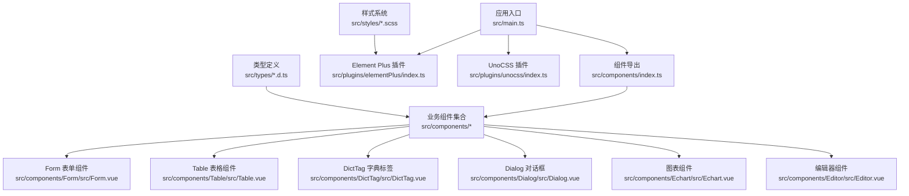
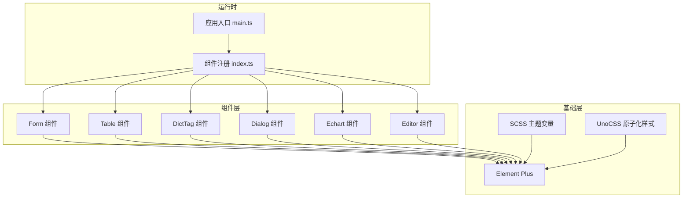
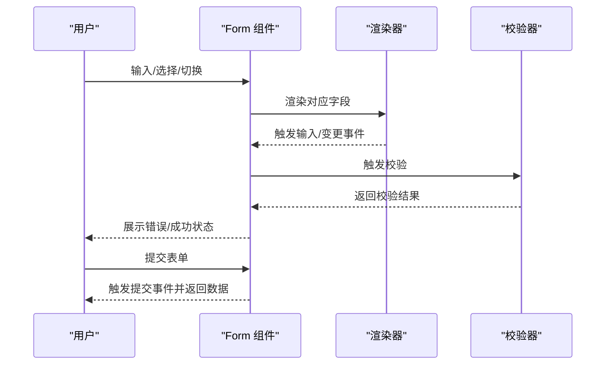
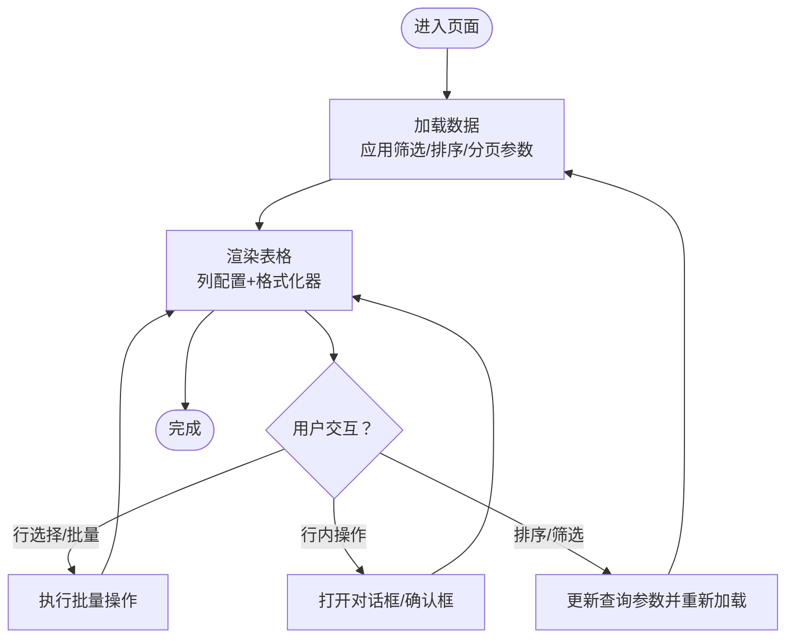
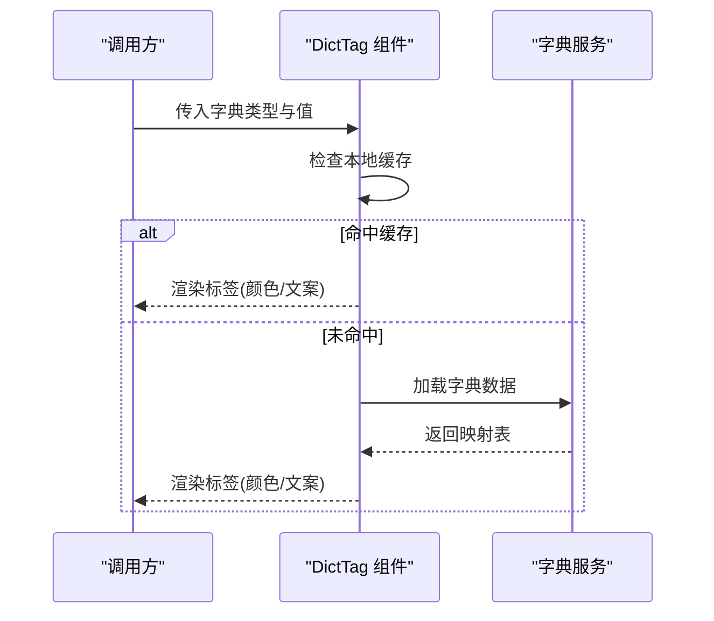
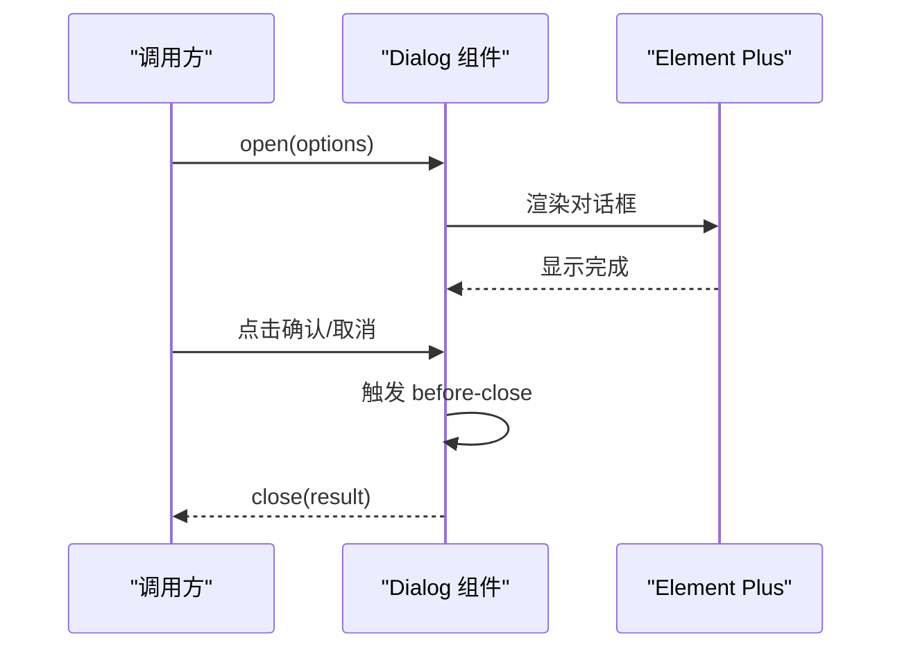
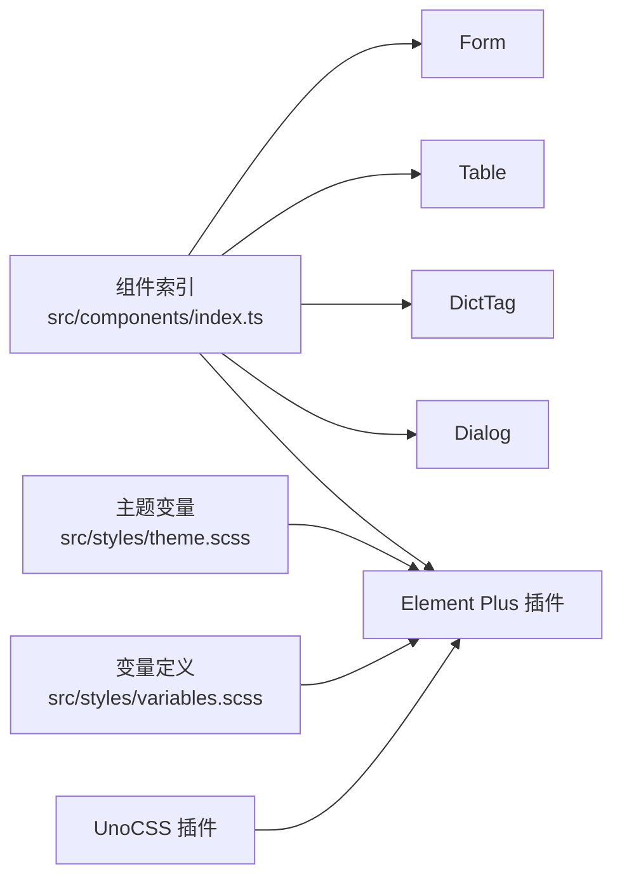

# UI 组件扩展

<cite>
**本文引用的文件**
- [App.vue](file://yudao-ui/yudao-ui-admin-vue3/src/App.vue)
- [main.ts](file://yudao-ui/yudao-ui-admin-vue3/src/main.ts)
- [index.ts](file://yudao-ui/yudao-ui-admin-vue3/src/components/index.ts)
- [DictTag.vue](file://yudao-ui/yudao-ui-admin-vue3/src/components/DictTag/src/DictTag.vue)
- [Form.vue](file://yudao-ui/yudao-ui-admin-vue3/src/components/Form/src/Form.vue)
- [Table.vue](file://yudao-ui/yudao-ui-admin-vue3/src/components/Table/src/Table.vue)
- [Dialog.vue](file://yudao-ui/yudao-ui-admin-vue3/src/components/Dialog/src/Dialog.vue)
- [Echart.vue](file://yudao-ui/yudao-ui-admin-vue3/src/components/Echart/src/Echart.vue)
- [Editor.vue](file://yudao-ui/yudao-ui-admin-vue3/src/components/Editor/src/Editor.vue)
- [Crontab.vue](file://yudao-ui/yudao-ui-admin-vue3/src/components/Crontab/src/Crontab.vue)
- [Cropper.vue](file://yudao-ui/yudao-ui-admin-vue3/src/components/Cropper/src/Cropper.vue)
- [Descriptions.vue](file://yudao-ui/yudao-ui-admin-vue3/src/components/Descriptions/src/Descriptions.vue)
- [Icon.vue](file://yudao-ui/yudao-ui-admin-vue3/src/components/Icon/src/Icon.vue)
- [IFrame.vue](file://yudao-ui/yudao-ui-admin-vue3/src/components/IFrame/src/IFrame.vue)
- [JsonEditor.vue](file://yudao-ui/yudao-ui-admin-vue3/src/components/JsonEditor/src/JsonEditor.vue)
- [Qrcode.vue](file://yudao-ui/yudao-ui-admin-vue3/src/components/Qrcode/src/Qrcode.vue)
- [Search.vue](file://yudao-ui/yudao-ui-admin-vue3/src/components/Search/src/Search.vue)
- [Tooltip.vue](file://yudao-ui/yudao-ui-admin-vue3/src/components/Tooltip/src/Tooltip.vue)
- [UploadFile.vue](file://yudao-ui/yudao-ui-admin-vue3/src/components/UploadFile/src/UploadFile.vue)
- [UserSelectForm.vue](file://yudao-ui/yudao-ui-admin-vue3/src/components/UserSelectForm/index.vue)
- [DeptSelectForm.vue](file://yudao-ui/yudao-ui-admin-vue3/src/components/DeptSelectForm/index.vue)
- [Pagination.vue](file://yudao-ui/yudao-ui-admin-vue3/src/components/Pagination/index.vue)
- [Backtop.vue](file://yudao-ui/yudao-ui-admin-vue3/src/components/Backtop/src/Backtop.vue)
- [CountTo.vue](file://yudao-ui/yudao-ui-admin-vue3/src/components/CountTo/src/CountTo.vue)
- [Draggable.vue](file://yudao-ui/yudao-ui-admin-vue3/src/components/Draggable/index.vue)
- [MarkdownView.vue](file://yudao-ui/yudao-ui-admin-vue3/src/components/MarkdownView/index.vue)
- [Verifition.vue](file://yudao-ui/yudao-ui-admin-vue3/src/components/Verifition/src/Verifition.vue)
- [VerticalButtonGroup.vue](file://yudao-ui/yudao-ui-admin-vue3/src/components/VerticalButtonGroup/index.vue)
- [XButton.vue](file://yudao-ui/yudao-ui-admin-vue3/src/components/XButton/src/XButton.vue)
- [theme.scss](file://yudao-ui/yudao-ui-admin-vue3/src/styles/theme.scss)
- [variables.scss](file://yudao-ui/yudao-ui-admin-vue3/src/styles/variables.scss)
- [elementPlus 插件配置](file://yudao-ui/yudao-ui-admin-vue3/src/plugins/elementPlus/index.ts)
- [svg 图标插件配置](file://yudao-ui/yudao-ui-admin-vue3/src/plugins/svgIcon/index.ts)
- [unocss 插件配置](file://yudao-ui/yudao-ui-admin-vue3/src/plugins/unocss/index.ts)
- [formCreate 设计器](file://yudao-ui/yudao-ui-admin-vue3/src/components/FormCreate/src/useFormCreateDesigner.ts)
- [DiyEditor 编辑器](file://yudao-ui/yudao-ui-admin-vue3/src/components/DiyEditor/index.vue)
- [SimpleProcessDesignerV2](file://yudao-ui/yudao-ui-admin-vue3/src/components/SimpleProcessDesignerV2/index.vue)
- [Tinyflow](file://yudao-ui/yudao-ui-admin-vue3/src/components/Tinyflow/Tinyflow.vue)
- [bpmnProcessDesigner](file://yudao-ui/yudao-ui-admin-vue3/src/components/bpmnProcessDesigner/src/index.ts)
- [组件类型定义](file://yudao-ui/yudao-ui-admin-vue3/src/types/components.d.ts)
- [Element Plus 类型定义](file://yudao-ui/yudao-ui-admin-vue3/src/types/elementPlus.d.ts)
- [表单类型定义](file://yudao-ui/yudao-ui-admin-vue3/src/types/form.d.ts)
- [表格类型定义](file://yudao-ui/yudao-ui-admin-vue3/src/types/table.d.ts)
- [dict 工具](file://yudao-ui/yudao-ui-admin-vue3/src/utils/dict.ts)
- [formatter 工具](file://yudao-ui/yudao-ui-admin-vue3/src/utils/formatter.ts)
- [tree 工具](file://yudao-ui/yudao-ui-admin-vue3/src/utils/tree.ts)
- [tsxHelper 工具](file://yudao-ui/yudao-ui-admin-vue3/src/utils/tsxHelper.ts)
- [formRules 工具](file://yudao-ui/yudao-ui-admin-vue3/src/utils/formRules.ts)
- [dateUtil 工具](file://yudao-ui/yudao-ui-admin-vue3/src/utils/dateUtil.ts)
- [constants 常量](file://yudao-ui/yudao-ui-admin-vue3/src/utils/constants.ts)
- [logger 日志](file://yudao-ui/yudao-ui-admin-vue3/src/utils/Logger.ts)
- [permission 权限](file://yudao-ui/yudao-ui-admin-vue3/src/utils/permission.ts)
- [routerHelper 路由工具](file://yudao-ui/yudao-ui-admin-vue3/src/utils/routerHelper.ts)
- [vite.config.ts](file://yudao-ui/yudao-ui-admin-vue3/vite.config.ts)
- [package.json](file://yudao-ui/yudao-ui-admin-vue3/package.json)
</cite>

## 目录
1. [简介](#简介)
2. [项目结构](#项目结构)
3. [核心组件](#核心组件)
4. [架构总览](#架构总览)
5. [详细组件分析](#详细组件分析)
6. [依赖关系分析](#依赖关系分析)
7. [性能考虑](#性能考虑)
8. [故障排查指南](#故障排查指南)
9. [结论](#结论)
10. [附录](#附录)

## 简介
本指南面向芋道 ruoyi-vue-pro 的前端 UI 组件扩展，系统性讲解 Vue 3 组件开发最佳实践与 Element Plus 二次封装方法，覆盖复杂业务组件（Form 表单、Table 表格、DictTag 字典标签）的设计与实现；同时提供组件库扩展（全局注册、按需引入、主题定制）、文档与示例编写、测试策略（单元测试、快照测试、交互测试）、性能优化（懒加载、虚拟滚动、渲染优化）以及实际开发案例与设计模式应用。

## 项目结构
ruoyi-vue-pro 前端采用 Vite + Vue 3 + TypeScript 技术栈，组件集中在 src/components 目录下，每个组件以功能域聚合组织，遵循“目录即组件”的模块化风格。全局入口在 src/main.ts，组件统一通过 src/components/index.ts 导出，Element Plus 通过插件方式注入，样式通过 SCSS 变量与 UnoCSS 实现主题与原子化样式控制。

图示来源
- [main.ts:1-50](file://yudao-ui/yudao-ui-admin-vue3/src/main.ts#L1-L50)
- [index.ts:1-200](file://yudao-ui/yudao-ui-admin-vue3/src/components/index.ts#L1-L200)
- [elementPlus 插件配置:1-100](file://yudao-ui/yudao-ui-admin-vue3/src/plugins/elementPlus/index.ts#L1-L100)
- [unocss 插件配置:1-100](file://yudao-ui/yudao-ui-admin-vue3/src/plugins/unocss/index.ts#L1-L100)

章节来源
- [main.ts:1-50](file://yudao-ui/yudao-ui-admin-vue3/src/main.ts#L1-L50)
- [index.ts:1-200](file://yudao-ui/yudao-ui-admin-vue3/src/components/index.ts#L1-L200)

## 核心组件
本节聚焦于可直接复用的核心组件及其职责边界，便于二次封装与扩展。

- Form 表单组件：提供动态表单渲染、字段映射、校验规则集成与布局控制，支持多种内置组件类型与自定义扩展。
- Table 表格组件：提供分页、排序、筛选、列配置、批量操作等能力，支持远程数据加载与本地数据处理。
- DictTag 字典标签：基于后端字典数据，将枚举值渲染为带样式的标签，支持颜色、文案映射与异步加载。
- Dialog 对话框：统一封装弹窗容器，支持尺寸、拖拽、遮罩关闭、底部按钮等通用行为。
- Echart/Editor/JsonEditor：可视化与内容编辑类组件，提供轻量封装与事件透传。
- Crontab/Cropper/Descriptions/Icon/IFrame/Qrcode/Search/Tooltip/UploadFile：常用业务组件，提供属性透传、事件冒泡与插槽扩展。

章节来源
- [Form.vue:1-200](file://yudao-ui/yudao-ui-admin-vue3/src/components/Form/src/Form.vue#L1-L200)
- [Table.vue:1-200](file://yudao-ui/yudao-ui-admin-vue3/src/components/Table/src/Table.vue#L1-L200)
- [DictTag.vue:1-150](file://yudao-ui/yudao-ui-admin-vue3/src/components/DictTag/src/DictTag.vue#L1-L150)
- [Dialog.vue:1-150](file://yudao-ui/yudao-ui-admin-vue3/src/components/Dialog/src/Dialog.vue#L1-L150)
- [Echart.vue:1-150](file://yudao-ui/yudao-ui-admin-vue3/src/components/Echart/src/Echart.vue#L1-L150)
- [Editor.vue:1-150](file://yudao-ui/yudao-ui-admin-vue3/src/components/Editor/src/Editor.vue#L1-L150)
- [Crontab.vue:1-150](file://yudao-ui/yudao-ui-admin-vue3/src/components/Crontab/src/Crontab.vue#L1-L150)
- [Cropper.vue:1-150](file://yudao-ui/yudao-ui-admin-vue3/src/components/Cropper/src/Cropper.vue#L1-L150)
- [Descriptions.vue:1-150](file://yudao-ui/yudao-ui-admin-vue3/src/components/Descriptions/src/Descriptions.vue#L1-L150)
- [Icon.vue:1-150](file://yudao-ui/yudao-ui-admin-vue3/src/components/Icon/src/Icon.vue#L1-L150)
- [IFrame.vue:1-150](file://yudao-ui/yudao-ui-admin-vue3/src/components/IFrame/src/IFrame.vue#L1-L150)
- [JsonEditor.vue:1-150](file://yudao-ui/yudao-ui-admin-vue3/src/components/JsonEditor/src/JsonEditor.vue#L1-L150)
- [Qrcode.vue:1-150](file://yudao-ui/yudao-ui-admin-vue3/src/components/Qrcode/src/Qrcode.vue#L1-L150)
- [Search.vue:1-150](file://yudao-ui/yudao-ui-admin-vue3/src/components/Search/src/Search.vue#L1-L150)
- [Tooltip.vue:1-150](file://yudao-ui/yudao-ui-admin-vue3/src/components/Tooltip/src/Tooltip.vue#L1-L150)
- [UploadFile.vue:1-150](file://yudao-ui/yudao-ui-admin-vue3/src/components/UploadFile/src/UploadFile.vue#L1-L150)

## 架构总览
组件层采用“组合式 API + TS 类型约束 + 插槽扩展”的设计范式，结合 Element Plus 的基础能力进行二次封装，确保一致的交互体验与可维护性。

图示来源
- [main.ts:1-50](file://yudao-ui/yudao-ui-admin-vue3/src/main.ts#L1-L50)
- [index.ts:1-200](file://yudao-ui/yudao-ui-admin-vue3/src/components/index.ts#L1-L200)
- [elementPlus 插件配置:1-100](file://yudao-ui/yudao-ui-admin-vue3/src/plugins/elementPlus/index.ts#L1-L100)
- [theme.scss:1-200](file://yudao-ui/yudao-ui-admin-vue3/src/styles/theme.scss#L1-L200)
- [variables.scss:1-200](file://yudao-ui/yudao-ui-admin-vue3/src/styles/variables.scss#L1-L200)

## 详细组件分析

### Form 表单组件
- 设计要点
  - 使用组合式 API 管理表单状态与校验，支持动态字段渲染与联动。
  - 通过 props 透传与 emits 事件冒泡，保证与 Element Plus 表单控件的兼容性。
  - 提供默认布局、栅格化与响应式断点，适配多端显示。
- 关键流程
  - 初始化：解析字段配置，建立响应式数据模型。
  - 渲染：根据字段类型选择渲染器，支持自定义渲染函数。
  - 校验：集成内置或自定义校验规则，错误信息回填。
  - 提交：收集数据并触发提交事件，支持防抖与并发控制。
- 扩展建议
  - 新增字段类型：在组件映射表中注册新渲染器。
  - 自定义校验：通过外部注入校验器，避免耦合到组件内部。
  - 插槽扩展：为复杂字段提供默认插槽与作用域插槽。

图示来源
- [Form.vue:1-200](file://yudao-ui/yudao-ui-admin-vue3/src/components/Form/src/Form.vue#L1-L200)

章节来源
- [Form.vue:1-200](file://yudao-ui/yudao-ui-admin-vue3/src/components/Form/src/Form.vue#L1-L200)

### Table 表格组件
- 设计要点
  - 支持远程/本地数据源切换，内置分页、排序、筛选参数序列化。
  - 列配置可动态开启/关闭，支持固定列与列宽调整。
  - 批量操作与行内操作按钮，统一权限控制与提示语。
- 关键流程
  - 请求：根据当前页、排序、筛选条件发起请求。
  - 渲染：根据列配置渲染表头与单元格，支持富文本/链接/标签等格式化。
  - 交互：行选中、批量操作、行内编辑/删除等。
- 扩展建议
  - 新增列类型：在列配置中注册格式化器与渲染函数。
  - 自定义筛选：提供多选/范围/日期等高级筛选器。
  - 性能优化：大数据场景启用虚拟滚动与懒加载。

图示来源
- [Table.vue:1-200](file://yudao-ui/yudao-ui-admin-vue3/src/components/Table/src/Table.vue#L1-L200)

章节来源
- [Table.vue:1-200](file://yudao-ui/yudao-ui-admin-vue3/src/components/Table/src/Table.vue#L1-L200)

### DictTag 字典标签组件
- 设计要点
  - 基于字典类型与值进行渲染，支持异步加载与缓存。
  - 标签颜色与文案映射可配置，支持空值占位与国际化。
- 关键流程
  - 初始化：读取字典类型与值，触发加载。
  - 渲染：命中缓存则直接渲染，否则请求后端接口。
  - 更新：当字典数据变化或类型切换时刷新显示。

图示来源
- [DictTag.vue:1-150](file://yudao-ui/yudao-ui-admin-vue3/src/components/DictTag/src/DictTag.vue#L1-L150)
- [dict 工具:1-200](file://yudao-ui/yudao-ui-admin-vue3/src/utils/dict.ts#L1-L200)

章节来源
- [DictTag.vue:1-150](file://yudao-ui/yudao-ui-admin-vue3/src/components/DictTag/src/DictTag.vue#L1-L150)
- [dict 工具:1-200](file://yudao-ui/yudao-ui-admin-vue3/src/utils/dict.ts#L1-L200)

### Dialog 对话框组件
- 设计要点
  - 封装 Element Plus 的 Drawer/Dialog，统一尺寸、拖拽、遮罩关闭等行为。
  - 提供默认底部按钮、加载态与错误提示，支持插槽扩展。
- 关键流程
  - 打开：接收参数并渲染内容。
  - 关闭：触发 before-close 钩子，支持取消与确认。
  - 销毁：清理事件监听与 DOM。

图示来源
- [Dialog.vue:1-150](file://yudao-ui/yudao-ui-admin-vue3/src/components/Dialog/src/Dialog.vue#L1-L150)

章节来源
- [Dialog.vue:1-150](file://yudao-ui/yudao-ui-admin-vue3/src/components/Dialog/src/Dialog.vue#L1-L150)

### Echart/Editor/JsonEditor 组件
- 设计要点
  - Echart：封装实例创建、数据更新与销毁，提供 resize 适配。
  - Editor/JsonEditor：基于第三方编辑器封装，暴露 value/change 事件与只读模式。
- 关键流程
  - 初始化：挂载容器并创建实例。
  - 更新：深拷贝数据，避免引用污染。
  - 销毁：移除事件监听与定时器。

章节来源
- [Echart.vue:1-150](file://yudao-ui/yudao-ui-admin-vue3/src/components/Echart/src/Echart.vue#L1-L150)
- [Editor.vue:1-150](file://yudao-ui/yudao-ui-admin-vue3/src/components/Editor/src/Editor.vue#L1-L150)
- [JsonEditor.vue:1-150](file://yudao-ui/yudao-ui-admin-vue3/src/components/JsonEditor/src/JsonEditor.vue#L1-L150)

### Crontab/Cropper/Descriptions/Icon/IFrame/Qrcode/Search/Tooltip/UploadFile 组件
- 设计要点
  - 统一属性透传与事件冒泡，保持与 Element Plus 的一致性。
  - 提供必要的默认行为与可配置项，减少重复代码。
- 关键流程
  - 输入：接收 props 并进行必要校验。
  - 渲染：根据状态切换不同视图。
  - 输出：通过 emits 通知父组件。

章节来源
- [Crontab.vue:1-150](file://yudao-ui/yudao-ui-admin-vue3/src/components/Crontab/src/Crontab.vue#L1-L150)
- [Cropper.vue:1-150](file://yudao-ui/yudao-ui-admin-vue3/src/components/Cropper/src/Cropper.vue#L1-L150)
- [Descriptions.vue:1-150](file://yudao-ui/yudao-ui-admin-vue3/src/components/Descriptions/src/Descriptions.vue#L1-L150)
- [Icon.vue:1-150](file://yudao-ui/yudao-ui-admin-vue3/src/components/Icon/src/Icon.vue#L1-L150)
- [IFrame.vue:1-150](file://yudao-ui/yudao-ui-admin-vue3/src/components/IFrame/src/IFrame.vue#L1-L150)
- [Qrcode.vue:1-150](file://yudao-ui/yudao-ui-admin-vue3/src/components/Qrcode/src/Qrcode.vue#L1-L150)
- [Search.vue:1-150](file://yudao-ui/yudao-ui-admin-vue3/src/components/Search/src/Search.vue#L1-L150)
- [Tooltip.vue:1-150](file://yudao-ui/yudao-ui-admin-vue3/src/components/Tooltip/src/Tooltip.vue#L1-L150)
- [UploadFile.vue:1-150](file://yudao-ui/yudao-ui-admin-vue3/src/components/UploadFile/src/UploadFile.vue#L1-L150)

## 依赖关系分析
- 组件注册：通过 src/components/index.ts 统一导出，便于全局注册与按需引入。
- Element Plus 集成：通过插件方式注入，自动注册组件与指令，支持按需引入。
- 样式体系：SCSS 变量与 UnoCSS 结合，提供主题定制与原子化样式。
- 类型约束：types 目录下的 d.ts 文件为组件提供 TS 类型定义，提升开发体验。

图示来源
- [index.ts:1-200](file://yudao-ui/yudao-ui-admin-vue3/src/components/index.ts#L1-L200)
- [elementPlus 插件配置:1-100](file://yudao-ui/yudao-ui-admin-vue3/src/plugins/elementPlus/index.ts#L1-L100)
- [theme.scss:1-200](file://yudao-ui/yudao-ui-admin-vue3/src/styles/theme.scss#L1-L200)
- [variables.scss:1-200](file://yudao-ui/yudao-ui-admin-vue3/src/styles/variables.scss#L1-L200)
- [unocss 插件配置:1-100](file://yudao-ui/yudao-ui-admin-vue3/src/plugins/unocss/index.ts#L1-L100)

章节来源
- [index.ts:1-200](file://yudao-ui/yudao-ui-admin-vue3/src/components/index.ts#L1-L200)
- [elementPlus 插件配置:1-100](file://yudao-ui/yudao-ui-admin-vue3/src/plugins/elementPlus/index.ts#L1-L100)
- [theme.scss:1-200](file://yudao-ui/yudao-ui-admin-vue3/src/styles/theme.scss#L1-L200)
- [variables.scss:1-200](file://yudao-ui/yudao-ui-admin-vue3/src/styles/variables.scss#L1-L200)
- [unocss 插件配置:1-100](file://yudao-ui/yudao-ui-admin-vue3/src/plugins/unocss/index.ts#L1-L100)

## 性能考虑
- 懒加载
  - 路由级懒加载：在路由配置中使用动态导入，减少首屏体积。
  - 组件级懒加载：对重型组件（如 Echart、Editor）使用动态 import，在需要时再加载。
- 虚拟滚动
  - 大列表场景优先使用虚拟滚动组件，限制渲染节点数量。
  - 合理设置 itemHeight 与缓冲区大小，平衡内存与性能。
- 渲染优化
  - 使用 v-memo 缓存昂贵计算结果。
  - 合理拆分子组件，避免不必要的重渲染。
- 数据流优化
  - 表单与表格使用浅拷贝与不可变更新策略，减少深拷贝成本。
  - 字典数据采用本地缓存与批量加载，降低网络请求频次。
- 样式优化
  - 使用 UnoCSS 的原子化类名，避免重复样式与冗余 CSS。
  - 主题变量集中管理，减少样式覆盖层级。

## 故障排查指南
- 组件无法注册
  - 检查 src/components/index.ts 是否正确导出组件。
  - 确认全局注册逻辑是否生效。
- 样式异常
  - 检查主题变量与 SCSS 文件是否正确引入。
  - 确认 UnoCSS 配置与组件样式冲突。
- 表单/表格无数据
  - 核对请求参数与分页配置，检查接口返回格式。
  - 确认数据映射与列配置是否匹配。
- 字典标签不显示
  - 检查字典类型与值是否正确，确认缓存是否命中。
  - 查看网络请求与后端接口返回。
- 对话框无法关闭
  - 检查 before-close 回调逻辑与遮罩点击行为。
  - 确认事件冒泡与插槽使用是否正确。

章节来源
- [index.ts:1-200](file://yudao-ui/yudao-ui-admin-vue3/src/components/index.ts#L1-L200)
- [theme.scss:1-200](file://yudao-ui/yudao-ui-admin-vue3/src/styles/theme.scss#L1-L200)
- [variables.scss:1-200](file://yudao-ui/yudao-ui-admin-vue3/src/styles/variables.scss#L1-L200)
- [elementPlus 插件配置:1-100](file://yudao-ui/yudao-ui-admin-vue3/src/plugins/elementPlus/index.ts#L1-L100)

## 结论
通过统一的组件注册机制、完善的类型定义与样式体系，以及对 Element Plus 的合理封装，ruoyi-vue-pro 的 UI 组件具备良好的扩展性与可维护性。建议在新增组件时遵循本文的设计原则与最佳实践，确保一致性与性能表现。

## 附录

### 组件库扩展方法
- 全局组件注册
  - 在 src/components/index.ts 中导出新组件，并在 src/main.ts 中进行全局注册。
- 按需引入
  - 通过插件或手动引入组件，避免全量打包。
- 主题定制
  - 修改 src/styles/theme.scss 与 src/styles/variables.scss，配合 Element Plus 的变量覆盖。

章节来源
- [index.ts:1-200](file://yudao-ui/yudao-ui-admin-vue3/src/components/index.ts#L1-L200)
- [main.ts:1-50](file://yudao-ui/yudao-ui-admin-vue3/src/main.ts#L1-L50)
- [theme.scss:1-200](file://yudao-ui/yudao-ui-admin-vue3/src/styles/theme.scss#L1-L200)
- [variables.scss:1-200](file://yudao-ui/yudao-ui-admin-vue3/src/styles/variables.scss#L1-L200)
- [elementPlus 插件配置:1-100](file://yudao-ui/yudao-ui-admin-vue3/src/plugins/elementPlus/index.ts#L1-L100)

### 文档编写与示例展示
- Props 文档生成
  - 使用组件注释规范，结合类型定义生成 API 文档。
- 交互演示
  - 提供在线示例与切换参数的演示页面，便于快速验证。

章节来源
- [组件类型定义:1-200](file://yudao-ui/yudao-ui-admin-vue3/src/types/components.d.ts#L1-L200)
- [Element Plus 类型定义:1-200](file://yudao-ui/yudao-ui-admin-vue3/src/types/elementPlus.d.ts#L1-L200)
- [表单类型定义:1-200](file://yudao-ui/yudao-ui-admin-vue3/src/types/form.d.ts#L1-L200)
- [表格类型定义:1-200](file://yudao-ui/yudao-ui-admin-vue3/src/types/table.d.ts#L1-L200)

### 测试策略
- 单元测试
  - 针对组件逻辑与工具函数编写测试用例，覆盖正常与异常分支。
- 快照测试
  - 对复杂组件输出进行快照对比，防止 UI 回退。
- 交互测试
  - 使用自动化测试工具模拟用户操作，验证关键流程。

章节来源
- [logger 日志:1-200](file://yudao-ui/yudao-ui-admin-vue3/src/utils/Logger.ts#L1-L200)
- [permission 权限:1-200](file://yudao-ui/yudao-ui-admin-vue3/src/utils/permission.ts#L1-L200)
- [routerHelper 路由工具:1-200](file://yudao-ui/yudao-ui-admin-vue3/src/utils/routerHelper.ts#L1-L200)

### 实际开发案例与设计模式
- 组合式 API 最佳实践
  - 使用 ref/reactive 管理状态，computed/computed 计算派生数据，watch/watchEffect 响应变化。
- 二次封装设计模式
  - 代理模式：通过 props 透传与 emits 冒泡，屏蔽底层差异。
  - 策略模式：在表单/表格中通过配置驱动渲染与行为。
- 复杂业务组件案例
  - Form：字段映射 + 校验策略 + 插槽扩展。
  - Table：远程数据 + 列配置 + 批量操作。
  - DictTag：异步字典 + 缓存策略 + 样式映射。

章节来源
- [Form.vue:1-200](file://yudao-ui/yudao-ui-admin-vue3/src/components/Form/src/Form.vue#L1-L200)
- [Table.vue:1-200](file://yudao-ui/yudao-ui-admin-vue3/src/components/Table/src/Table.vue#L1-L200)
- [DictTag.vue:1-150](file://yudao-ui/yudao-ui-admin-vue3/src/components/DictTag/src/DictTag.vue#L1-L150)
- [tsxHelper 工具:1-200](file://yudao-ui/yudao-ui-admin-vue3/src/utils/tsxHelper.ts#L1-L200)