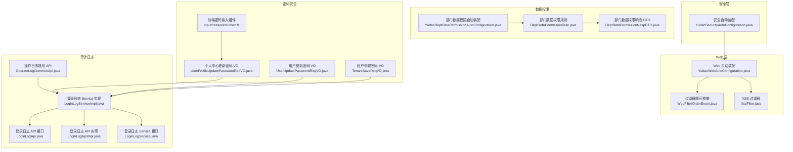
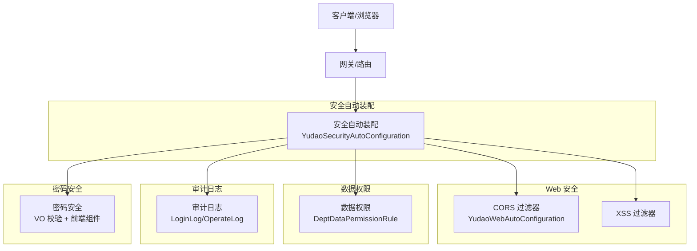
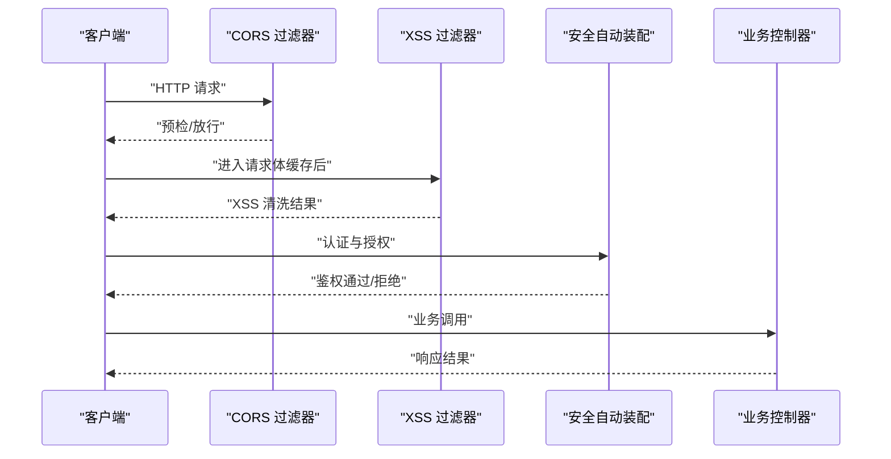
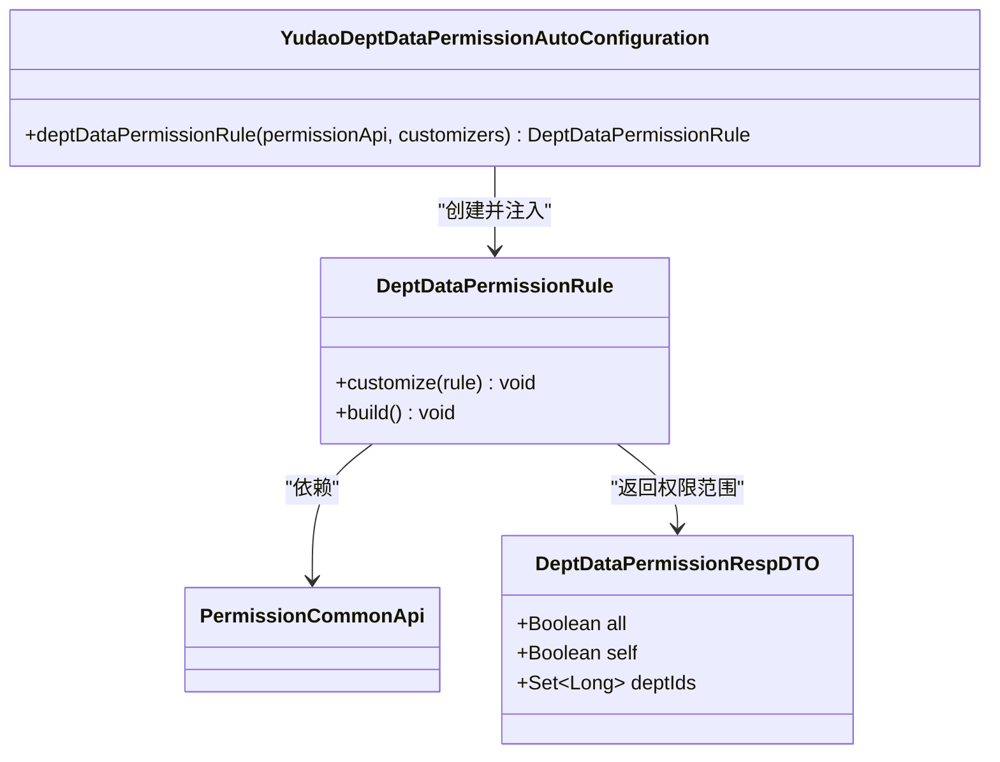
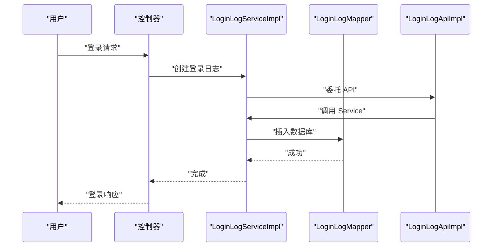
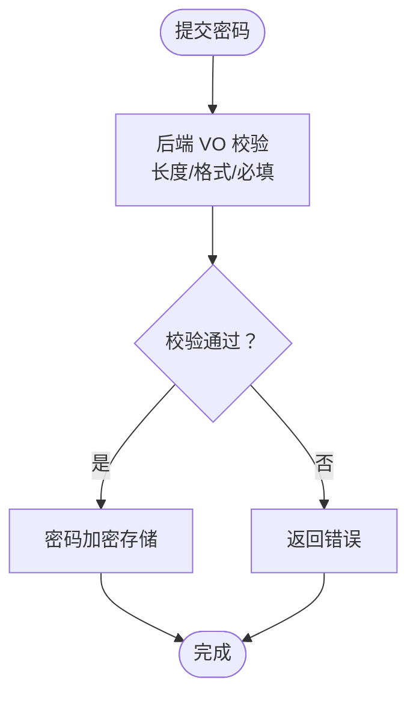
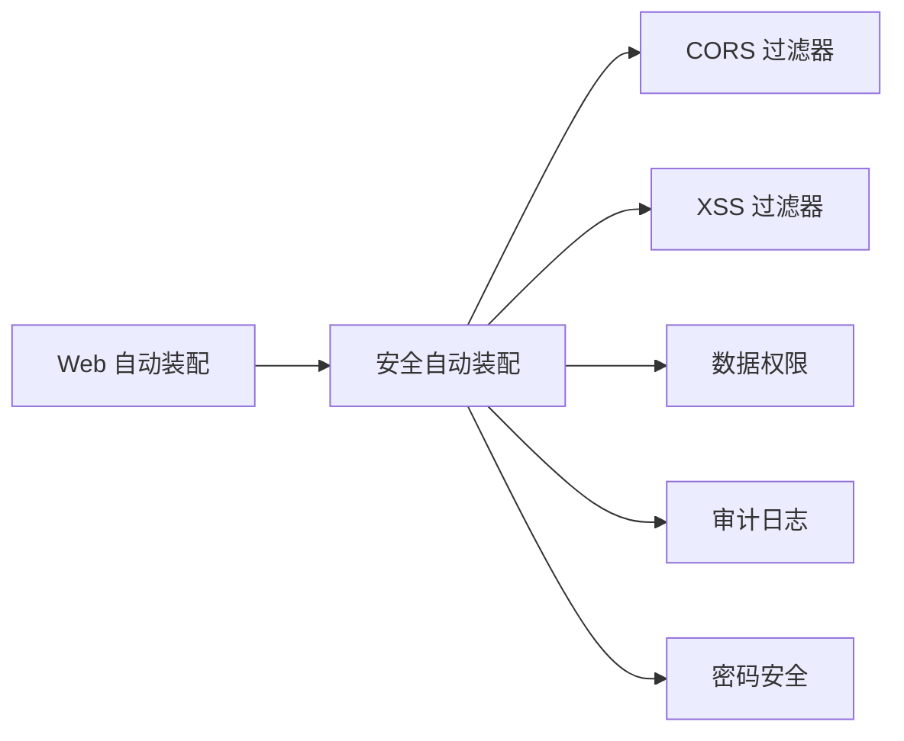

# 安全扩展

<cite>
**本文引用的文件**
- [YudaoWebAutoConfiguration.java](file://yudao-framework/yudao-spring-boot-starter-web/src/main/java/cn/iocoder/yudao/framework/web/config/YudaoWebAutoConfiguration.java)
- [WebFilterOrderEnum.java](file://yudao-framework/yudao-common/src/main/java/cn/iocoder/yudao/framework/common/enums/WebFilterOrderEnum.java)
- [XssFilter.java](file://yudao-framework/yudao-spring-boot-starter-web/src/main/java/cn/iocoder/yudao/framework/xss/core/filter/XssFilter.java)
- [YudaoSecurityAutoConfiguration.java](file://yudao-framework/yudao-spring-boot-starter-security/src/main/java/cn/iocoder/yudao/framework/security/config/YudaoSecurityAutoConfiguration.java)
- [YudaoDeptDataPermissionAutoConfiguration.java](file://yudao-framework/yudao-spring-boot-starter-biz-data-permission/src/main/java/cn/iocoder/yudao/framework/datapermission/config/YudaoDeptDataPermissionAutoConfiguration.java)
- [DeptDataPermissionRule.java](file://yudao-framework/yudao-spring-boot-starter-biz-data-permission/src/main/java/cn/iocoder/yudao/framework/datapermission/core/rule/dept/DeptDataPermissionRule.java)
- [DeptDataPermissionRespDTO.java](file://yudao-framework/yudao-common/src/main/java/cn/iocoder/yudao/framework/common/biz/system/permission/dto/DeptDataPermissionRespDTO.java)
- [LoginLogApi.java](file://yudao-module-system/src/main/java/cn/iocoder/yudao/module/system/api/logger/LoginLogApi.java)
- [LoginLogApiImpl.java](file://yudao-module-system/src/main/java/cn/iocoder/yudao/module/system/api/logger/LoginLogApiImpl.java)
- [LoginLogService.java](file://yudao-module-system/src/main/java/cn/iocoder/yudao/module/system/service/logger/LoginLogService.java)
- [LoginLogServiceImpl.java](file://yudao-module-system/src/main/java/cn/iocoder/yudao/module/system/service/logger/LoginLogServiceImpl.java)
- [OperateLogCommonApi.java](file://yudao-framework/yudao-common/src/main/java/cn/iocoder/yudao/framework/common/biz/system/logger/OperateLogCommonApi.java)
- [UserProfileUpdatePasswordReqVO.java](file://yudao-module-system/src/main/java/cn/iocoder/yudao/module/system/controller/admin/user/vo/profile/UserProfileUpdatePasswordReqVO.java)
- [UserUpdatePasswordReqVO.java](file://yudao-module-system/src/main/java/cn/iocoder/yudao/module/system/controller/admin/user/vo/user/UserUpdatePasswordReqVO.java)
- [TenantSaveReqVO.java](file://yudao-module-system/src/main/java/cn/iocoder/yudao/module/system/controller/admin/tenant/vo/tenant/TenantSaveReqVO.java)
- [InputPassword index.ts](file://yudao-ui/yudao-ui-admin-vue3/src/components/InputPassword/index.ts)
</cite>

## 目录
1. [简介](#简介)
2. [项目结构](#项目结构)
3. [核心组件](#核心组件)
4. [架构总览](#架构总览)
5. [详细组件分析](#详细组件分析)
6. [依赖关系分析](#依赖关系分析)
7. [性能考虑](#性能考虑)
8. [故障排查指南](#故障排查指南)
9. [结论](#结论)
10. [附录](#附录)

## 简介
本指南面向“芋道 ruoyi-vue-pro”后端与前端的安全扩展，围绕以下目标展开：
- 自定义认证方式：基于 Token 的认证、基于 Session 的认证、第三方认证集成
- 权限控制扩展：RBAC、基于资源的访问控制、动态权限判断
- 安全策略配置：CORS、CSRF 防护、XSS 防护
- 数据权限扩展：部门数据权限、岗位数据权限、自定义数据过滤规则
- 审计日志扩展：操作日志记录、登录日志收集、异常日志处理
- 密码安全增强：密码加密、密码强度验证、密码策略配置
- 安全组件集成：Spring Security 过滤器链、认证提供者、授权管理器
- 最佳实践与常见漏洞防护

## 项目结构
围绕安全主题的关键模块与文件如下：
- Web 安全与过滤器链：Web 自动装配、过滤器顺序枚举、XSS 过滤器
- 安全自动装配：Spring Security 相关自动配置入口
- 数据权限：部门数据权限自动装配与规则实现
- 审计日志：登录日志 API/Service 与通用操作日志 API
- 密码安全：密码 VO 校验与前端输入组件

**图表来源**
- [YudaoWebAutoConfiguration.java:106-119](file://yudao-framework/yudao-spring-boot-starter-web/src/main/java/cn/iocoder/yudao/framework/web/config/YudaoWebAutoConfiguration.java#L106-L119)
- [WebFilterOrderEnum.java:10-36](file://yudao-framework/yudao-common/src/main/java/cn/iocoder/yudao/framework/common/enums/WebFilterOrderEnum.java#L10-L36)
- [XssFilter.java](file://yudao-framework/yudao-spring-boot-starter-web/src/main/java/cn/iocoder/yudao/framework/xss/core/filter/XssFilter.java)
- [YudaoSecurityAutoConfiguration.java](file://yudao-framework/yudao-spring-boot-starter-security/src/main/java/cn/iocoder/yudao/framework/security/config/YudaoSecurityAutoConfiguration.java)
- [YudaoDeptDataPermissionAutoConfiguration.java:19-32](file://yudao-framework/yudao-spring-boot-starter-biz-data-permission/src/main/java/cn/iocoder/yudao/framework/datapermission/config/YudaoDeptDataPermissionAutoConfiguration.java#L19-L32)
- [DeptDataPermissionRule.java](file://yudao-framework/yudao-spring-boot-starter-biz-data-permission/src/main/java/cn/iocoder/yudao/framework/datapermission/core/rule/dept/DeptDataPermissionRule.java)
- [DeptDataPermissionRespDTO.java:13-35](file://yudao-framework/yudao-common/src/main/java/cn/iocoder/yudao/framework/common/biz/system/permission/dto/DeptDataPermissionRespDTO.java#L13-L35)
- [LoginLogApi.java:12-21](file://yudao-module-system/src/main/java/cn/iocoder/yudao/module/system/api/logger/LoginLogApi.java#L12-L21)
- [LoginLogApiImpl.java:15-27](file://yudao-module-system/src/main/java/cn/iocoder/yudao/module/system/api/logger/LoginLogApiImpl.java#L15-L27)
- [LoginLogService.java:13-38](file://yudao-module-system/src/main/java/cn/iocoder/yudao/module/system/service/logger/LoginLogService.java#L13-L38)
- [LoginLogServiceImpl.java:17-40](file://yudao-module-system/src/main/java/cn/iocoder/yudao/module/system/service/logger/LoginLogServiceImpl.java#L17-L40)
- [OperateLogCommonApi.java:12-31](file://yudao-framework/yudao-common/src/main/java/cn/iocoder/yudao/framework/common/biz/system/logger/OperateLogCommonApi.java#L12-L31)
- [UserProfileUpdatePasswordReqVO.java:11-23](file://yudao-module-system/src/main/java/cn/iocoder/yudao/module/system/controller/admin/user/vo/profile/UserProfileUpdatePasswordReqVO.java#L11-L23)
- [UserUpdatePasswordReqVO.java:12-23](file://yudao-module-system/src/main/java/cn/iocoder/yudao/module/system/controller/admin/user/vo/user/UserUpdatePasswordReqVO.java#L12-L23)
- [TenantSaveReqVO.java:55-71](file://yudao-module-system/src/main/java/cn/iocoder/yudao/module/system/controller/admin/tenant/vo/tenant/TenantSaveReqVO.java#L55-L71)
- [InputPassword index.ts:1-3](file://yudao-ui/yudao-ui-admin-vue3/src/components/InputPassword/index.ts#L1-L3)

**章节来源**
- [YudaoWebAutoConfiguration.java:106-119](file://yudao-framework/yudao-spring-boot-starter-web/src/main/java/cn/iocoder/yudao/framework/web/config/YudaoWebAutoConfiguration.java#L106-L119)
- [WebFilterOrderEnum.java:10-36](file://yudao-framework/yudao-common/src/main/java/cn/iocoder/yudao/framework/common/enums/WebFilterOrderEnum.java#L10-L36)
- [XssFilter.java](file://yudao-framework/yudao-spring-boot-starter-web/src/main/java/cn/iocoder/yudao/framework/xss/core/filter/XssFilter.java)
- [YudaoSecurityAutoConfiguration.java](file://yudao-framework/yudao-spring-boot-starter-security/src/main/java/cn/iocoder/yudao/framework/security/config/YudaoSecurityAutoConfiguration.java)
- [YudaoDeptDataPermissionAutoConfiguration.java:19-32](file://yudao-framework/yudao-spring-boot-starter-biz-data-permission/src/main/java/cn/iocoder/yudao/framework/datapermission/config/YudaoDeptDataPermissionAutoConfiguration.java#L19-L32)
- [DeptDataPermissionRule.java](file://yudao-framework/yudao-spring-boot-starter-biz-data-permission/src/main/java/cn/iocoder/yudao/framework/datapermission/core/rule/dept/DeptDataPermissionRule.java)
- [DeptDataPermissionRespDTO.java:13-35](file://yudao-framework/yudao-common/src/main/java/cn/iocoder/yudao/framework/common/biz/system/permission/dto/DeptDataPermissionRespDTO.java#L13-L35)
- [LoginLogApi.java:12-21](file://yudao-module-system/src/main/java/cn/iocoder/yudao/module/system/api/logger/LoginLogApi.java#L12-L21)
- [LoginLogApiImpl.java:15-27](file://yudao-module-system/src/main/java/cn/iocoder/yudao/module/system/api/logger/LoginLogApiImpl.java#L15-L27)
- [LoginLogService.java:13-38](file://yudao-module-system/src/main/java/cn/iocoder/yudao/module/system/service/logger/LoginLogService.java#L13-L38)
- [LoginLogServiceImpl.java:17-40](file://yudao-module-system/src/main/java/cn/iocoder/yudao/module/system/service/logger/LoginLogServiceImpl.java#L17-L40)
- [OperateLogCommonApi.java:12-31](file://yudao-framework/yudao-common/src/main/java/cn/iocoder/yudao/framework/common/biz/system/logger/OperateLogCommonApi.java#L12-L31)
- [UserProfileUpdatePasswordReqVO.java:11-23](file://yudao-module-system/src/main/java/cn/iocoder/yudao/module/system/controller/admin/user/vo/profile/UserProfileUpdatePasswordReqVO.java#L11-L23)
- [UserUpdatePasswordReqVO.java:12-23](file://yudao-module-system/src/main/java/cn/iocoder/yudao/module/system/controller/admin/user/vo/user/UserUpdatePasswordReqVO.java#L12-L23)
- [TenantSaveReqVO.java:55-71](file://yudao-module-system/src/main/java/cn/iocoder/yudao/module/system/controller/admin/tenant/vo/tenant/TenantSaveReqVO.java#L55-L71)
- [InputPassword index.ts:1-3](file://yudao-ui/yudao-ui-admin-vue3/src/components/InputPassword/index.ts#L1-L3)

## 核心组件
- Web 安全与过滤器链
  - CORS 过滤器注册与顺序：通过自动装配在特定顺序注册 CORS 过滤器，确保跨域配置生效
  - 过滤器顺序枚举：统一管理各过滤器的执行顺序，避免相互覆盖或失效
  - XSS 过滤器：在请求体缓存之后执行，防止恶意脚本注入
- 安全自动装配
  - 提供认证、授权、操作日志等安全能力的自动装配入口
- 数据权限
  - 部门数据权限自动装配：基于 LoginUser 与自定义规则定制器构建部门数据权限规则
  - 规则与响应 DTO：支持“全部可见”“仅自己”“指定部门集合”等策略
- 审计日志
  - 登录日志 API/Service：提供创建登录日志的能力，并支持分页查询
  - 操作日志通用 API：提供异步创建操作日志的默认实现
- 密码安全
  - 密码 VO 校验：统一长度与格式约束
  - 前端密码输入组件：封装密码输入交互

**章节来源**
- [YudaoWebAutoConfiguration.java:106-119](file://yudao-framework/yudao-spring-boot-starter-web/src/main/java/cn/iocoder/yudao/framework/web/config/YudaoWebAutoConfiguration.java#L106-L119)
- [WebFilterOrderEnum.java:10-36](file://yudao-framework/yudao-common/src/main/java/cn/iocoder/yudao/framework/common/enums/WebFilterOrderEnum.java#L10-L36)
- [XssFilter.java](file://yudao-framework/yudao-spring-boot-starter-web/src/main/java/cn/iocoder/yudao/framework/xss/core/filter/XssFilter.java)
- [YudaoSecurityAutoConfiguration.java](file://yudao-framework/yudao-spring-boot-starter-security/src/main/java/cn/iocoder/yudao/framework/security/config/YudaoSecurityAutoConfiguration.java)
- [YudaoDeptDataPermissionAutoConfiguration.java:19-32](file://yudao-framework/yudao-spring-boot-starter-biz-data-permission/src/main/java/cn/iocoder/yudao/framework/datapermission/config/YudaoDeptDataPermissionAutoConfiguration.java#L19-L32)
- [DeptDataPermissionRule.java](file://yudao-framework/yudao-spring-boot-starter-biz-data-permission/src/main/java/cn/iocoder/yudao/framework/datapermission/core/rule/dept/DeptDataPermissionRule.java)
- [DeptDataPermissionRespDTO.java:13-35](file://yudao-framework/yudao-common/src/main/java/cn/iocoder/yudao/framework/common/biz/system/permission/dto/DeptDataPermissionRespDTO.java#L13-L35)
- [LoginLogApi.java:12-21](file://yudao-module-system/src/main/java/cn/iocoder/yudao/module/system/api/logger/LoginLogApi.java#L12-L21)
- [LoginLogApiImpl.java:15-27](file://yudao-module-system/src/main/java/cn/iocoder/yudao/module/system/api/logger/LoginLogApiImpl.java#L15-L27)
- [LoginLogService.java:13-38](file://yudao-module-system/src/main/java/cn/iocoder/yudao/module/system/service/logger/LoginLogService.java#L13-L38)
- [LoginLogServiceImpl.java:17-40](file://yudao-module-system/src/main/java/cn/iocoder/yudao/module/system/service/logger/LoginLogServiceImpl.java#L17-L40)
- [OperateLogCommonApi.java:12-31](file://yudao-framework/yudao-common/src/main/java/cn/iocoder/yudao/framework/common/biz/system/logger/OperateLogCommonApi.java#L12-L31)
- [UserProfileUpdatePasswordReqVO.java:11-23](file://yudao-module-system/src/main/java/cn/iocoder/yudao/module/system/controller/admin/user/vo/profile/UserProfileUpdatePasswordReqVO.java#L11-L23)
- [UserUpdatePasswordReqVO.java:12-23](file://yudao-module-system/src/main/java/cn/iocoder/yudao/module/system/controller/admin/user/vo/user/UserUpdatePasswordReqVO.java#L12-L23)
- [TenantSaveReqVO.java:55-71](file://yudao-module-system/src/main/java/cn/iocoder/yudao/module/system/controller/admin/tenant/vo/tenant/TenantSaveReqVO.java#L55-L71)
- [InputPassword index.ts:1-3](file://yudao-ui/yudao-ui-admin-vue3/src/components/InputPassword/index.ts#L1-L3)

## 架构总览
下图展示安全相关组件在系统中的交互关系与职责边界。

**图表来源**
- [YudaoSecurityAutoConfiguration.java](file://yudao-framework/yudao-spring-boot-starter-security/src/main/java/cn/iocoder/yudao/framework/security/config/YudaoSecurityAutoConfiguration.java)
- [YudaoWebAutoConfiguration.java:106-119](file://yudao-framework/yudao-spring-boot-starter-web/src/main/java/cn/iocoder/yudao/framework/web/config/YudaoWebAutoConfiguration.java#L106-L119)
- [XssFilter.java](file://yudao-framework/yudao-spring-boot-starter-web/src/main/java/cn/iocoder/yudao/framework/xss/core/filter/XssFilter.java)
- [YudaoDeptDataPermissionAutoConfiguration.java:19-32](file://yudao-framework/yudao-spring-boot-starter-biz-data-permission/src/main/java/cn/iocoder/yudao/framework/datapermission/config/YudaoDeptDataPermissionAutoConfiguration.java#L19-L32)
- [DeptDataPermissionRule.java](file://yudao-framework/yudao-spring-boot-starter-biz-data-permission/src/main/java/cn/iocoder/yudao/framework/datapermission/core/rule/dept/DeptDataPermissionRule.java)
- [LoginLogApi.java:12-21](file://yudao-module-system/src/main/java/cn/iocoder/yudao/module/system/api/logger/LoginLogApi.java#L12-L21)
- [OperateLogCommonApi.java:12-31](file://yudao-framework/yudao-common/src/main/java/cn/iocoder/yudao/framework/common/biz/system/logger/OperateLogCommonApi.java#L12-L31)
- [UserProfileUpdatePasswordReqVO.java:11-23](file://yudao-module-system/src/main/java/cn/iocoder/yudao/module/system/controller/admin/user/vo/profile/UserProfileUpdatePasswordReqVO.java#L11-L23)

## 详细组件分析

### 认证与会话扩展
- 基于 Token 的认证
  - 在安全自动装配中启用基于 Token 的认证流程，结合过滤器链完成鉴权
  - 建议在控制器层通过注解保护接口，结合全局异常处理返回标准错误码
- 基于 Session 的认证
  - 使用 Spring Session 或原生 Session 实现状态保持
  - 结合 CSRF 防护策略，确保跨站请求安全
- 第三方认证集成
  - 通过 OAuth2/SAML 等协议接入第三方平台
  - 在认证提供者中扩展自定义 Provider，对接用户信息与权限映射

[本节为概念性说明，未直接分析具体文件，故无章节来源]

### 权限控制扩展
- RBAC（基于角色的访问控制）
  - 将用户与角色关联，角色与权限关联，形成树状权限模型
  - 在授权管理器中实现动态权限判断，支持“拥有任意角色即通过”
- 基于资源的访问控制
  - 以资源维度（如菜单、按钮、数据行）进行细粒度授权
  - 结合数据权限规则，限制用户可见范围
- 动态权限判断
  - 在业务层通过权限 API 查询当前用户权限集合
  - 在 AOP 中拦截控制器方法，按需校验权限

[本节为概念性说明，未直接分析具体文件，故无章节来源]

### 安全策略配置
- CORS 配置
  - 通过自动装配注册 CorsFilter，并设置允许的源、头、方法
  - 注意顺序优先级，确保在其他过滤器之前生效
- CSRF 防护
  - 在 Spring Security 中启用 CSRF，配合同源策略与 Token 校验
  - 对于前后端分离场景，可采用基于 Token 的无状态方案
- XSS 防护
  - 在请求体缓存之后执行 XSS 过滤器，清洗危险标签与脚本
  - 对上传文件与富文本输入进行白名单校验

**图表来源**
- [YudaoWebAutoConfiguration.java:106-119](file://yudao-framework/yudao-spring-boot-starter-web/src/main/java/cn/iocoder/yudao/framework/web/config/YudaoWebAutoConfiguration.java#L106-L119)
- [WebFilterOrderEnum.java:10-36](file://yudao-framework/yudao-common/src/main/java/cn/iocoder/yudao/framework/common/enums/WebFilterOrderEnum.java#L10-L36)
- [XssFilter.java](file://yudao-framework/yudao-spring-boot-starter-web/src/main/java/cn/iocoder/yudao/framework/xss/core/filter/XssFilter.java)
- [YudaoSecurityAutoConfiguration.java](file://yudao-framework/yudao-spring-boot-starter-security/src/main/java/cn/iocoder/yudao/framework/security/config/YudaoSecurityAutoConfiguration.java)

**章节来源**
- [YudaoWebAutoConfiguration.java:106-119](file://yudao-framework/yudao-spring-boot-starter-web/src/main/java/cn/iocoder/yudao/framework/web/config/YudaoWebAutoConfiguration.java#L106-L119)
- [WebFilterOrderEnum.java:10-36](file://yudao-framework/yudao-common/src/main/java/cn/iocoder/yudao/framework/common/enums/WebFilterOrderEnum.java#L10-L36)
- [XssFilter.java](file://yudao-framework/yudao-spring-boot-starter-web/src/main/java/cn/iocoder/yudao/framework/xss/core/filter/XssFilter.java)
- [YudaoSecurityAutoConfiguration.java](file://yudao-framework/yudao-spring-boot-starter-security/src/main/java/cn/iocoder/yudao/framework/security/config/YudaoSecurityAutoConfiguration.java)

### 数据权限扩展
- 部门数据权限
  - 自动装配根据 LoginUser 注入 PermissionCommonApi 并应用自定义规则
  - 规则支持“全部可见”“仅自己”“指定部门集合”，并以 DTO 返回权限范围
- 岗位数据权限
  - 可参考部门规则实现，将岗位 ID 列表纳入权限判断
- 自定义数据过滤规则
  - 通过规则定制器扩展匹配表与字段，实现多表联动的复杂过滤逻辑

**图表来源**
- [YudaoDeptDataPermissionAutoConfiguration.java:19-32](file://yudao-framework/yudao-spring-boot-starter-biz-data-permission/src/main/java/cn/iocoder/yudao/framework/datapermission/config/YudaoDeptDataPermissionAutoConfiguration.java#L19-L32)
- [DeptDataPermissionRule.java](file://yudao-framework/yudao-spring-boot-starter-biz-data-permission/src/main/java/cn/iocoder/yudao/framework/datapermission/core/rule/dept/DeptDataPermissionRule.java)
- [DeptDataPermissionRespDTO.java:13-35](file://yudao-framework/yudao-common/src/main/java/cn/iocoder/yudao/framework/common/biz/system/permission/dto/DeptDataPermissionRespDTO.java#L13-L35)

**章节来源**
- [YudaoDeptDataPermissionAutoConfiguration.java:19-32](file://yudao-framework/yudao-spring-boot-starter-biz-data-permission/src/main/java/cn/iocoder/yudao/framework/datapermission/config/YudaoDeptDataPermissionAutoConfiguration.java#L19-L32)
- [DeptDataPermissionRule.java](file://yudao-framework/yudao-spring-boot-starter-biz-data-permission/src/main/java/cn/iocoder/yudao/framework/datapermission/core/rule/dept/DeptDataPermissionRule.java)
- [DeptDataPermissionRespDTO.java:13-35](file://yudao-framework/yudao-common/src/main/java/cn/iocoder/yudao/framework/common/biz/system/permission/dto/DeptDataPermissionRespDTO.java#L13-L35)

### 审计日志扩展
- 登录日志
  - 提供 API 接口与 Service 实现，支持创建与分页查询
- 操作日志
  - 通用 API 支持异步创建，降低业务调用延迟
- 异常日志
  - 建议在全局异常处理器中统一记录异常上下文与堆栈

**图表来源**
- [LoginLogApi.java:12-21](file://yudao-module-system/src/main/java/cn/iocoder/yudao/module/system/api/logger/LoginLogApi.java#L12-L21)
- [LoginLogApiImpl.java:15-27](file://yudao-module-system/src/main/java/cn/iocoder/yudao/module/system/api/logger/LoginLogApiImpl.java#L15-L27)
- [LoginLogService.java:13-38](file://yudao-module-system/src/main/java/cn/iocoder/yudao/module/system/service/logger/LoginLogService.java#L13-L38)
- [LoginLogServiceImpl.java:17-40](file://yudao-module-system/src/main/java/cn/iocoder/yudao/module/system/service/logger/LoginLogServiceImpl.java#L17-L40)

**章节来源**
- [LoginLogApi.java:12-21](file://yudao-module-system/src/main/java/cn/iocoder/yudao/module/system/api/logger/LoginLogApi.java#L12-L21)
- [LoginLogApiImpl.java:15-27](file://yudao-module-system/src/main/java/cn/iocoder/yudao/module/system/api/logger/LoginLogApiImpl.java#L15-L27)
- [LoginLogService.java:13-38](file://yudao-module-system/src/main/java/cn/iocoder/yudao/module/system/service/logger/LoginLogService.java#L13-L38)
- [LoginLogServiceImpl.java:17-40](file://yudao-module-system/src/main/java/cn/iocoder/yudao/module/system/service/logger/LoginLogServiceImpl.java#L17-L40)
- [OperateLogCommonApi.java:12-31](file://yudao-framework/yudao-common/src/main/java/cn/iocoder/yudao/framework/common/biz/system/logger/OperateLogCommonApi.java#L12-L31)

### 密码安全增强
- 密码加密
  - 建议使用强哈希算法（如 BCrypt）存储用户密码
- 密码强度验证
  - 前端与后端共同校验：长度、字符集、历史密码策略
- 密码策略配置
  - 通过 VO 校验约束最小/最大长度、必填项
  - 前端使用专用密码输入组件，隐藏明文显示

**图表来源**
- [UserProfileUpdatePasswordReqVO.java:11-23](file://yudao-module-system/src/main/java/cn/iocoder/yudao/module/system/controller/admin/user/vo/profile/UserProfileUpdatePasswordReqVO.java#L11-L23)
- [UserUpdatePasswordReqVO.java:12-23](file://yudao-module-system/src/main/java/cn/iocoder/yudao/module/system/controller/admin/user/vo/user/UserUpdatePasswordReqVO.java#L12-L23)
- [TenantSaveReqVO.java:55-71](file://yudao-module-system/src/main/java/cn/iocoder/yudao/module/system/controller/admin/tenant/vo/tenant/TenantSaveReqVO.java#L55-L71)
- [InputPassword index.ts:1-3](file://yudao-ui/yudao-ui-admin-vue3/src/components/InputPassword/index.ts#L1-L3)

**章节来源**
- [UserProfileUpdatePasswordReqVO.java:11-23](file://yudao-module-system/src/main/java/cn/iocoder/yudao/module/system/controller/admin/user/vo/profile/UserProfileUpdatePasswordReqVO.java#L11-L23)
- [UserUpdatePasswordReqVO.java:12-23](file://yudao-module-system/src/main/java/cn/iocoder/yudao/module/system/controller/admin/user/vo/user/UserUpdatePasswordReqVO.java#L12-L23)
- [TenantSaveReqVO.java:55-71](file://yudao-module-system/src/main/java/cn/iocoder/yudao/module/system/controller/admin/tenant/vo/tenant/TenantSaveReqVO.java#L55-L71)
- [InputPassword index.ts:1-3](file://yudao-ui/yudao-ui-admin-vue3/src/components/InputPassword/index.ts#L1-L3)

### 安全组件集成
- Spring Security 过滤器链
  - 在安全自动装配中注册过滤器，确保顺序正确
- 认证提供者
  - 扩展自定义 AuthenticationProvider，对接用户详情与权限
- 授权管理器
  - 在 AccessDecisionManager 中实现“允许/拒绝”策略

[本节为概念性说明，未直接分析具体文件，故无章节来源]

## 依赖关系分析
- Web 层依赖安全自动装配，安全自动装配依赖过滤器链
- 数据权限依赖登录用户上下文与权限 API
- 审计日志依赖服务层与持久层
- 密码安全依赖 VO 校验与前端组件

**图表来源**
- [YudaoWebAutoConfiguration.java:106-119](file://yudao-framework/yudao-spring-boot-starter-web/src/main/java/cn/iocoder/yudao/framework/web/config/YudaoWebAutoConfiguration.java#L106-L119)
- [YudaoSecurityAutoConfiguration.java](file://yudao-framework/yudao-spring-boot-starter-security/src/main/java/cn/iocoder/yudao/framework/security/config/YudaoSecurityAutoConfiguration.java)
- [YudaoDeptDataPermissionAutoConfiguration.java:19-32](file://yudao-framework/yudao-spring-boot-starter-biz-data-permission/src/main/java/cn/iocoder/yudao/framework/datapermission/config/YudaoDeptDataPermissionAutoConfiguration.java#L19-L32)
- [LoginLogApiImpl.java:15-27](file://yudao-module-system/src/main/java/cn/iocoder/yudao/module/system/api/logger/LoginLogApiImpl.java#L15-L27)
- [OperateLogCommonApi.java:12-31](file://yudao-framework/yudao-common/src/main/java/cn/iocoder/yudao/framework/common/biz/system/logger/OperateLogCommonApi.java#L12-L31)

**章节来源**
- [YudaoWebAutoConfiguration.java:106-119](file://yudao-framework/yudao-spring-boot-starter-web/src/main/java/cn/iocoder/yudao/framework/web/config/YudaoWebAutoConfiguration.java#L106-L119)
- [YudaoSecurityAutoConfiguration.java](file://yudao-framework/yudao-spring-boot-starter-security/src/main/java/cn/iocoder/yudao/framework/security/config/YudaoSecurityAutoConfiguration.java)
- [YudaoDeptDataPermissionAutoConfiguration.java:19-32](file://yudao-framework/yudao-spring-boot-starter-biz-data-permission/src/main/java/cn/iocoder/yudao/framework/datapermission/config/YudaoDeptDataPermissionAutoConfiguration.java#L19-L32)
- [LoginLogApiImpl.java:15-27](file://yudao-module-system/src/main/java/cn/iocoder/yudao/module/system/api/logger/LoginLogApiImpl.java#L15-L27)
- [OperateLogCommonApi.java:12-31](file://yudao-framework/yudao-common/src/main/java/cn/iocoder/yudao/framework/common/biz/system/logger/OperateLogCommonApi.java#L12-L31)

## 性能考虑
- 过滤器顺序优化：确保 CORS/XSS 在鉴权前执行，避免重复处理
- 异步日志：操作日志采用异步写入，降低业务延迟
- 数据权限缓存：对常用部门/岗位权限进行缓存，减少重复计算
- 密码加密成本：合理选择加密迭代次数，平衡安全性与性能

[本节为一般性建议，未直接分析具体文件，故无章节来源]

## 故障排查指南
- CORS 不生效
  - 检查过滤器顺序是否正确，确认 CORS 过滤器在最前执行
- XSS 过滤误杀
  - 核对白名单配置，必要时调整过滤器执行位置
- 登录日志缺失
  - 确认登录流程中调用了登录日志 API；检查 Service 实现与 Mapper 映射
- 数据权限范围异常
  - 校验 DeptDataPermissionRespDTO 返回值，确认规则定制器配置正确
- 密码更新失败
  - 检查 VO 校验规则与前端组件是否一致

**章节来源**
- [WebFilterOrderEnum.java:10-36](file://yudao-framework/yudao-common/src/main/java/cn/iocoder/yudao/framework/common/enums/WebFilterOrderEnum.java#L10-L36)
- [YudaoWebAutoConfiguration.java:106-119](file://yudao-framework/yudao-spring-boot-starter-web/src/main/java/cn/iocoder/yudao/framework/web/config/YudaoWebAutoConfiguration.java#L106-L119)
- [LoginLogServiceImpl.java:17-40](file://yudao-module-system/src/main/java/cn/iocoder/yudao/module/system/service/logger/LoginLogServiceImpl.java#L17-L40)
- [DeptDataPermissionRespDTO.java:13-35](file://yudao-framework/yudao-common/src/main/java/cn/iocoder/yudao/framework/common/biz/system/permission/dto/DeptDataPermissionRespDTO.java#L13-L35)
- [UserProfileUpdatePasswordReqVO.java:11-23](file://yudao-module-system/src/main/java/cn/iocoder/yudao/module/system/controller/admin/user/vo/profile/UserProfileUpdatePasswordReqVO.java#L11-L23)

## 结论
通过现有模块与组件，系统已具备完善的 Web 安全、数据权限、审计日志与密码安全基础。在此基础上，可进一步扩展认证方式、细化权限模型、完善安全策略与组件集成，以满足更复杂的业务与合规需求。

[本节为总结性内容，未直接分析具体文件，故无章节来源]

## 附录
- 最佳实践
  - 统一错误码与异常处理
  - 严格参数校验与输入净化
  - 定期轮换密钥与升级加密算法
  - 审计日志全生命周期保留与脱敏
- 常见漏洞防护
  - OWASP Top 10：注入、XSS、CSRF、会话劫持、敏感数据泄露
  - 防护手段：参数校验、CORS/CSRF/XSS 配置、最小权限原则、日志审计

[本节为一般性建议，未直接分析具体文件，故无章节来源]