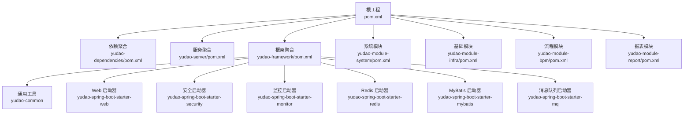
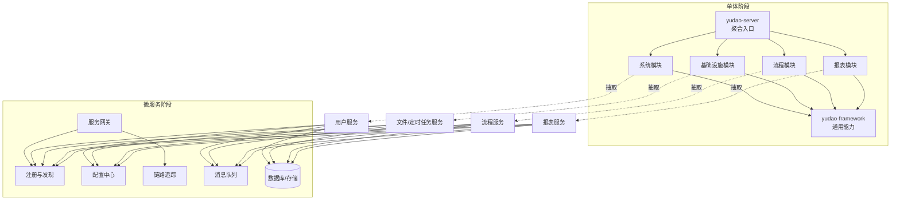
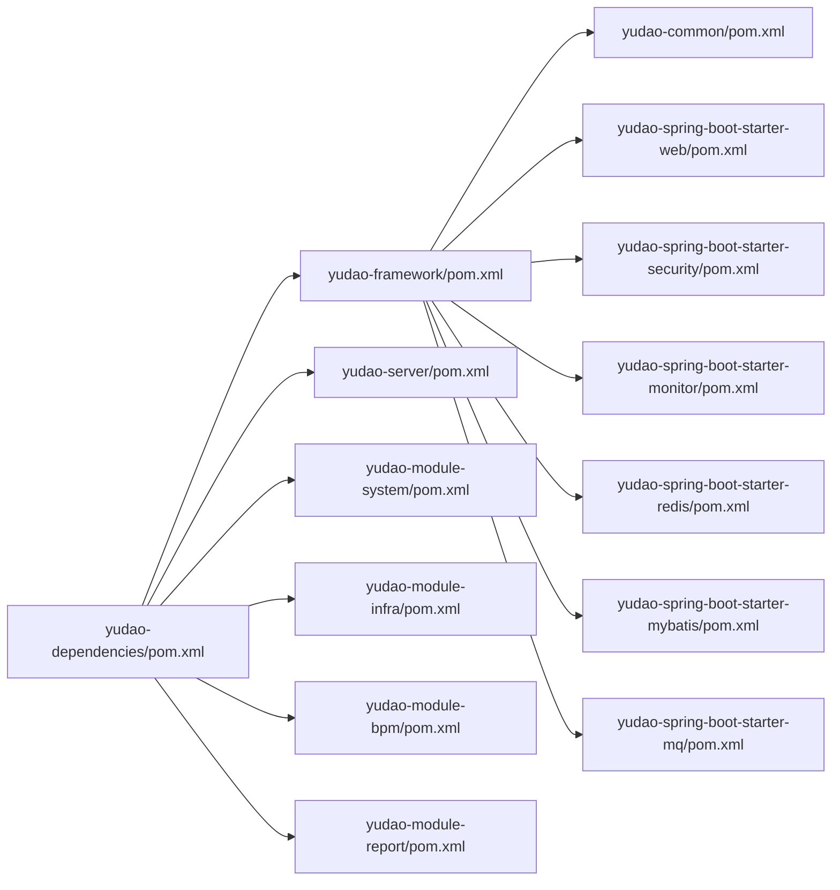

# 微服务改造

<cite>
**本文引用的文件**
- [pom.xml](file://pom.xml)
- [yudao-dependencies/pom.xml](file://yudao-dependencies/pom.xml)
- [yudao-framework/pom.xml](file://yudao-framework/pom.xml)
- [yudao-framework/yudao-common/pom.xml](file://yudao-framework/yudao-common/pom.xml)
- [yudao-framework/yudao-spring-boot-starter-monitor/pom.xml](file://yudao-framework/yudao-spring-boot-starter-monitor/pom.xml)
- [yudao-framework/yudao-spring-boot-starter-security/pom.xml](file://yudao-framework/yudao-spring-boot-starter-security/pom.xml)
- [yudao-framework/yudao-spring-boot-starter-mq/pom.xml](file://yudao-framework/yudao-spring-boot-starter-mq/pom.xml)
- [yudao-framework/yudao-spring-boot-starter-web/pom.xml](file://yudao-framework/yudao-spring-boot-starter-web/pom.xml)
- [yudao-framework/yudao-spring-boot-starter-redis/pom.xml](file://yudao-framework/yudao-spring-boot-starter-redis/pom.xml)
- [yudao-framework/yudao-spring-boot-starter-mybatis/pom.xml](file://yudao-framework/yudao-spring-boot-starter-mybatis/pom.xml)
- [yudao-server/pom.xml](file://yudao-server/pom.xml)
- [yudao-server/src/main/resources/application.yaml](file://yudao-server/src/main/resources/application.yaml)
- [yudao-server/src/main/resources/application-dev.yaml](file://yudao-server/src/main/resources/application-dev.yaml)
- [yudao-server/src/main/resources/application-local.yaml](file://yudao-server/src/main/resources/application-local.yaml)
- [yudao-server/Dockerfile](file://yudao-server/Dockerfile)
- [script/docker/docker-compose.yml](file://script/docker/docker-compose.yml)
- [script/docker/docker.env](file://script/docker/docker.env)
- [yudao-module-system/pom.xml](file://yudao-module-system/pom.xml)
- [yudao-module-infra/pom.xml](file://yudao-module-infra/pom.xml)
- [yudao-module-bpm/pom.xml](file://yudao-module-bpm/pom.xml)
- [yudao-module-report/pom.xml](file://yudao-module-report/pom.xml)
</cite>

## 目录
1. [引言](#引言)
2. [项目结构](#项目结构)
3. [核心组件](#核心组件)
4. [架构总览](#架构总览)
5. [详细组件分析](#详细组件分析)
6. [依赖分析](#依赖分析)
7. [性能考虑](#性能考虑)
8. [故障排查指南](#故障排查指南)
9. [结论](#结论)
10. [附录](#附录)

## 引言
本指南面向从单体架构向微服务架构迁移的团队，结合仓库现有模块与基础设施，给出可落地的服务拆分原则、领域建模与边界划分建议；同时覆盖注册发现、配置中心、服务网关、分布式事务、链路追踪、容器化部署等微服务关键能力，并提供最佳实践与常见问题解决方案。

## 项目结构
当前仓库采用多模块 Maven 结构，后端以 yudao-server 作为聚合入口，各业务域以独立 module 聚合，框架层通过 yudao-framework 提供通用能力。前端位于 yudao-ui/yudao-ui-admin-vue3，提供统一的管理界面。

图表来源
- [pom.xml:1-200](file://pom.xml#L1-L200)
- [yudao-server/pom.xml:1-200](file://yudao-server/pom.xml#L1-L200)
- [yudao-framework/pom.xml:1-200](file://yudao-framework/pom.xml#L1-L200)
- [yudao-framework/yudao-common/pom.xml:1-200](file://yudao-framework/yudao-common/pom.xml#L1-L200)
- [yudao-framework/yudao-spring-boot-starter-web/pom.xml:1-200](file://yudao-framework/yudao-spring-boot-starter-web/pom.xml#L1-L200)
- [yudao-framework/yudao-spring-boot-starter-security/pom.xml:1-200](file://yudao-framework/yudao-spring-boot-starter-security/pom.xml#L1-L200)
- [yudao-framework/yudao-spring-boot-starter-monitor/pom.xml:1-200](file://yudao-framework/yudao-spring-boot-starter-monitor/pom.xml#L1-L200)
- [yudao-framework/yudao-spring-boot-starter-redis/pom.xml:1-200](file://yudao-framework/yudao-spring-boot-starter-redis/pom.xml#L1-L200)
- [yudao-framework/yudao-spring-boot-starter-mybatis/pom.xml:1-200](file://yudao-framework/yudao-spring-boot-starter-mybatis/pom.xml#L1-L200)
- [yudao-framework/yudao-spring-boot-starter-mq/pom.xml:1-200](file://yudao-framework/yudao-spring-boot-starter-mq/pom.xml#L1-L200)

章节来源
- [pom.xml:1-200](file://pom.xml#L1-L200)
- [yudao-server/pom.xml:1-200](file://yudao-server/pom.xml#L1-L200)
- [yudao-framework/pom.xml:1-200](file://yudao-framework/pom.xml#L1-L200)

## 核心组件
- 服务聚合与运行：yudao-server 作为后端服务聚合模块，负责打包与运行，提供应用级配置与环境切换。
- 框架层能力：yudao-framework 提供 Web、安全、监控、缓存、数据库访问、消息队列等启动器与通用工具，支撑上层业务模块。
- 业务模块：按领域拆分为系统、基础设施、流程、报表等模块，便于后续进一步拆分为独立微服务。

章节来源
- [yudao-server/pom.xml:1-200](file://yudao-server/pom.xml#L1-L200)
- [yudao-framework/pom.xml:1-200](file://yudao-framework/pom.xml#L1-L200)
- [yudao-module-system/pom.xml:1-200](file://yudao-module-system/pom.xml#L1-L200)
- [yudao-module-infra/pom.xml:1-200](file://yudao-module-infra/pom.xml#L1-L200)
- [yudao-module-bpm/pom.xml:1-200](file://yudao-module-bpm/pom.xml#L1-L200)
- [yudao-module-report/pom.xml:1-200](file://yudao-module-report/pom.xml#L1-L200)

## 架构总览
下图展示从单体到微服务的演进路径：先在 yudao-server 内部按模块解耦，再逐步将模块抽取为独立服务，配合注册发现、配置中心、网关与链路追踪等基础设施。

图表来源
- [yudao-server/pom.xml:1-200](file://yudao-server/pom.xml#L1-L200)
- [yudao-framework/pom.xml:1-200](file://yudao-framework/pom.xml#L1-L200)
- [yudao-module-system/pom.xml:1-200](file://yudao-module-system/pom.xml#L1-L200)
- [yudao-module-infra/pom.xml:1-200](file://yudao-module-infra/pom.xml#L1-L200)
- [yudao-module-bpm/pom.xml:1-200](file://yudao-module-bpm/pom.xml#L1-L200)
- [yudao-module-report/pom.xml:1-200](file://yudao-module-report/pom.xml#L1-L200)

## 详细组件分析

### 服务拆分原则与领域建模
- 原子性与内聚性：优先按业务领域拆分，如“用户与权限”“文件与定时任务”“流程引擎”“报表”等，确保模块职责单一。
- 领域驱动设计：以实体、聚合、值对象为核心，围绕用例组织接口与数据访问，避免跨模块循环依赖。
- 边界划分：以模块为边界，逐步将模块内的控制器、服务、数据访问层抽取为独立服务，保留公共框架层与通用工具。
- 数据一致性：同一聚合内的读写操作尽量在同一服务内完成，跨聚合通过最终一致的消息或补偿机制实现。

### 注册与发现机制
- 当前状态：框架层提供 Web、安全、监控等启动器，未直接引入注册发现组件。
- 迁移建议：
  - 在 yudao-server 或独立服务中引入注册发现依赖（如 Spring Cloud Alibaba Nacos Discovery 或 Spring Cloud LoadBalancer），在应用配置中启用服务注册与发现。
  - 将 yudao-server 的 application.yaml 中的 server.port 等配置迁移到服务独立后的配置文件中。
- 配置要点：服务名、实例地址、健康检查、权重与灰度发布策略。

章节来源
- [yudao-framework/yudao-spring-boot-starter-web/pom.xml:1-200](file://yudao-framework/yudao-spring-boot-starter-web/pom.xml#L1-L200)
- [yudao-server/src/main/resources/application.yaml:1-200](file://yudao-server/src/main/resources/application.yaml#L1-L200)

### 分布式配置中心
- 当前状态：框架层提供监控启动器，未直接引入配置中心组件。
- 迁移建议：
  - 在 yudao-server 或独立服务中引入 Spring Cloud Config 或 Apollo 客户端依赖。
  - 将 application.yaml 中的配置项迁移到配置中心，按环境（dev/prod）与服务维度进行管理。
- 配置要点：配置命名空间、版本管理、动态刷新、敏感信息加密。

章节来源
- [yudao-framework/yudao-spring-boot-starter-monitor/pom.xml:1-200](file://yudao-framework/yudao-spring-boot-starter-monitor/pom.xml#L1-L200)
- [yudao-server/src/main/resources/application.yaml:1-200](file://yudao-server/src/main/resources/application.yaml#L1-L200)

### 服务网关
- 当前状态：未发现内置网关模块。
- 迁移建议：
  - 在 yudao-server 或独立服务中引入 Spring Cloud Gateway 或 Zuul 依赖。
  - 将前端请求统一由网关路由至对应后端服务，实现鉴权、限流、熔断与日志记录。
- 路由配置：基于服务名或路径的路由规则，支持负载均衡与重试策略。

章节来源
- [yudao-server/pom.xml:1-200](file://yudao-server/pom.xml#L1-L200)

### 分布式事务
- 当前状态：未发现分布式事务相关依赖。
- 迨移建议：
  - 引入 Seata 客户端与 AT 模式依赖，或结合 Saga 模式实现长事务编排。
  - 在跨服务调用处埋点，确保事务一致性与补偿逻辑。
- 注意事项：全局事务超时、回滚策略、悬挂状态处理。

章节来源
- [yudao-framework/yudao-spring-boot-starter-mq/pom.xml:1-200](file://yudao-framework/yudao-spring-boot-starter-mq/pom.xml#L1-L200)
- [yudao-framework/yudao-spring-boot-starter-mybatis/pom.xml:1-200](file://yudao-framework/yudao-spring-boot-starter-mybatis/pom.xml#L1-L200)

### 链路追踪
- 当前状态：框架层提供监控启动器，未直接引入链路追踪组件。
- 迁移建议：
  - 在 yudao-server 或独立服务中引入 SkyWalking 或 Zipkin 客户端依赖。
  - 统一采样策略与标签，确保跨服务链路可见。
- 配置要点：探针注入、采集器配置、存储与可视化。

章节来源
- [yudao-framework/yudao-spring-boot-starter-monitor/pom.xml:1-200](file://yudao-framework/yudao-spring-boot-starter-monitor/pom.xml#L1-L200)
- [yudao-server/src/main/resources/application.yaml:1-200](file://yudao-server/src/main/resources/application.yaml#L1-L200)

### 容器化与编排
- Docker 镜像：仓库提供 yudao-server/Dockerfile，可用于构建镜像。
- Compose 编排：仓库提供 script/docker/docker-compose.yml 与 docker.env，可用于本地编排与演示。
- 建议：为每个微服务单独构建镜像，使用 Kubernetes 进行部署与扩缩容，结合 ConfigMap/Secret 管理配置，使用 Service/Ingress 暴露服务。

章节来源
- [yudao-server/Dockerfile:1-200](file://yudao-server/Dockerfile#L1-L200)
- [script/docker/docker-compose.yml:1-200](file://script/docker/docker-compose.yml#L1-L200)
- [script/docker/docker.env:1-200](file://script/docker/docker.env#L1-L200)

## 依赖分析
- 依赖聚合：yudao-dependencies/pom.xml 统一管理版本与依赖范围。
- 框架聚合：yudao-framework/pom.xml 聚合通用启动器与工具模块。
- 业务模块：yudao-module-system、yudao-module-infra、yudao-module-bpm、yudao-module-report 独立维护各自依赖。
- 服务聚合：yudao-server/pom.xml 聚合框架与业务模块，作为运行入口。

图表来源
- [yudao-dependencies/pom.xml:1-200](file://yudao-dependencies/pom.xml#L1-L200)
- [yudao-framework/pom.xml:1-200](file://yudao-framework/pom.xml#L1-L200)
- [yudao-framework/yudao-common/pom.xml:1-200](file://yudao-framework/yudao-common/pom.xml#L1-L200)
- [yudao-framework/yudao-spring-boot-starter-web/pom.xml:1-200](file://yudao-framework/yudao-spring-boot-starter-web/pom.xml#L1-L200)
- [yudao-framework/yudao-spring-boot-starter-security/pom.xml:1-200](file://yudao-framework/yudao-spring-boot-starter-security/pom.xml#L1-L200)
- [yudao-framework/yudao-spring-boot-starter-monitor/pom.xml:1-200](file://yudao-framework/yudao-spring-boot-starter-monitor/pom.xml#L1-L200)
- [yudao-framework/yudao-spring-boot-starter-redis/pom.xml:1-200](file://yudao-framework/yudao-spring-boot-starter-redis/pom.xml#L1-L200)
- [yudao-framework/yudao-spring-boot-starter-mybatis/pom.xml:1-200](file://yudao-framework/yudao-spring-boot-starter-mybatis/pom.xml#L1-L200)
- [yudao-framework/yudao-spring-boot-starter-mq/pom.xml:1-200](file://yudao-framework/yudao-spring-boot-starter-mq/pom.xml#L1-L200)
- [yudao-server/pom.xml:1-200](file://yudao-server/pom.xml#L1-L200)
- [yudao-module-system/pom.xml:1-200](file://yudao-module-system/pom.xml#L1-L200)
- [yudao-module-infra/pom.xml:1-200](file://yudao-module-infra/pom.xml#L1-L200)
- [yudao-module-bpm/pom.xml:1-200](file://yudao-module-bpm/pom.xml#L1-L200)
- [yudao-module-report/pom.xml:1-200](file://yudao-module-report/pom.xml#L1-L200)

章节来源
- [yudao-dependencies/pom.xml:1-200](file://yudao-dependencies/pom.xml#L1-L200)
- [yudao-framework/pom.xml:1-200](file://yudao-framework/pom.xml#L1-L200)
- [yudao-server/pom.xml:1-200](file://yudao-server/pom.xml#L1-L200)

## 性能考虑
- 服务粒度：过细的服务会增加网络开销，过粗则违背微服务理念。建议以领域模型与高内聚为依据，结合容量评估确定服务边界。
- 缓存与数据库：利用 yudao-spring-boot-starter-redis 与 yudao-spring-boot-starter-mybatis 提升读写性能，注意缓存穿透、击穿与雪崩的防护。
- 并发与限流：在网关与服务侧设置限流与熔断，避免级联故障。
- 监控与告警：通过 yudao-spring-boot-starter-monitor 与链路追踪组件建立指标体系与告警通道。

## 故障排查指南
- 配置问题：核对 application.yaml 与环境变量，确认配置中心拉取成功且生效。
- 依赖冲突：通过 yudao-dependencies/pom.xml 统一版本，避免启动失败。
- 网络连通：确认注册发现与配置中心地址可达，防火墙与 DNS 解析正常。
- 链路追踪：检查探针是否正确注入，采样率与存储是否满足需求。
- 容器化：核对 Dockerfile 构建产物与 docker-compose.yml 的服务映射关系。

章节来源
- [yudao-server/src/main/resources/application.yaml:1-200](file://yudao-server/src/main/resources/application.yaml#L1-L200)
- [yudao-dependencies/pom.xml:1-200](file://yudao-dependencies/pom.xml#L1-L200)
- [script/docker/docker-compose.yml:1-200](file://script/docker/docker-compose.yml#L1-L200)

## 结论
本指南基于现有代码结构，提出了从单体到微服务的演进路径与关键能力落地方案。建议以模块为单位逐步拆分服务，配套注册发现、配置中心、网关与链路追踪等基础设施，结合容器化与编排实现弹性与可观测性。

## 附录
- 最佳实践清单
  - 以领域模型驱动服务边界，避免过早拆分。
  - 优先保证数据一致性与最终一致性的事务设计。
  - 统一接入注册发现与配置中心，避免硬编码。
  - 在网关层统一做鉴权、限流与日志。
  - 建立完善的监控与告警体系。
  - 使用容器化与编排，提升交付效率与稳定性。
- 常见问题
  - 服务间通信延迟高：优化序列化、压缩与批量处理。
  - 配置不生效：检查命名空间、环境与刷新机制。
  - 链路缺失：确认探针注入与采样策略。
  - 容器启动失败：核对端口占用、卷挂载与环境变量。