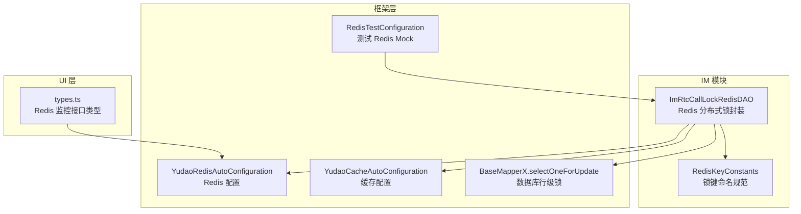
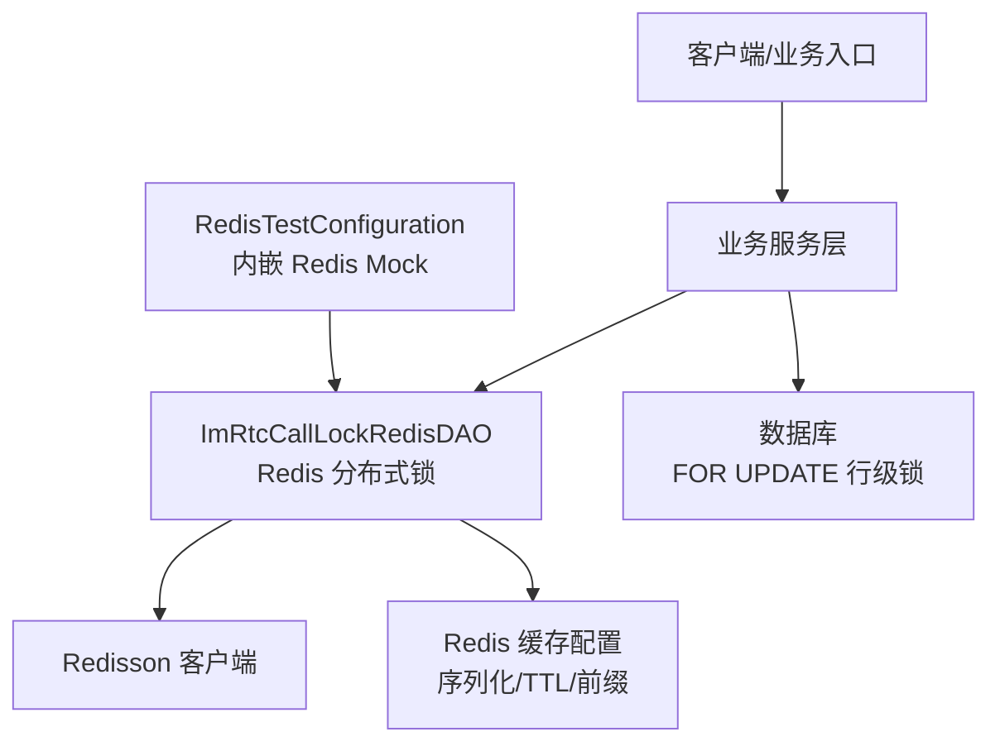
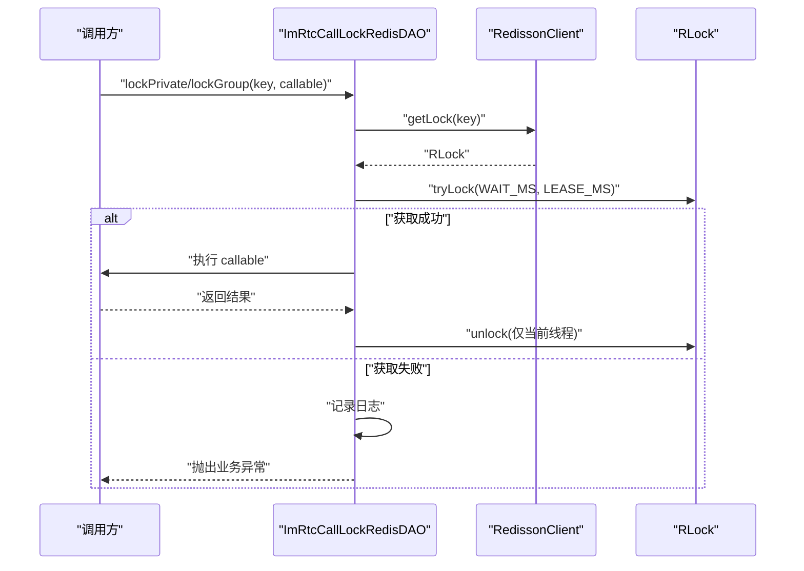
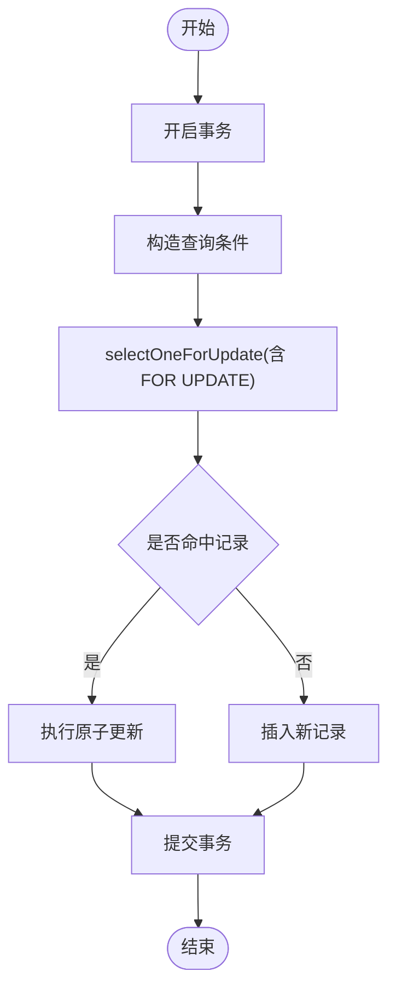
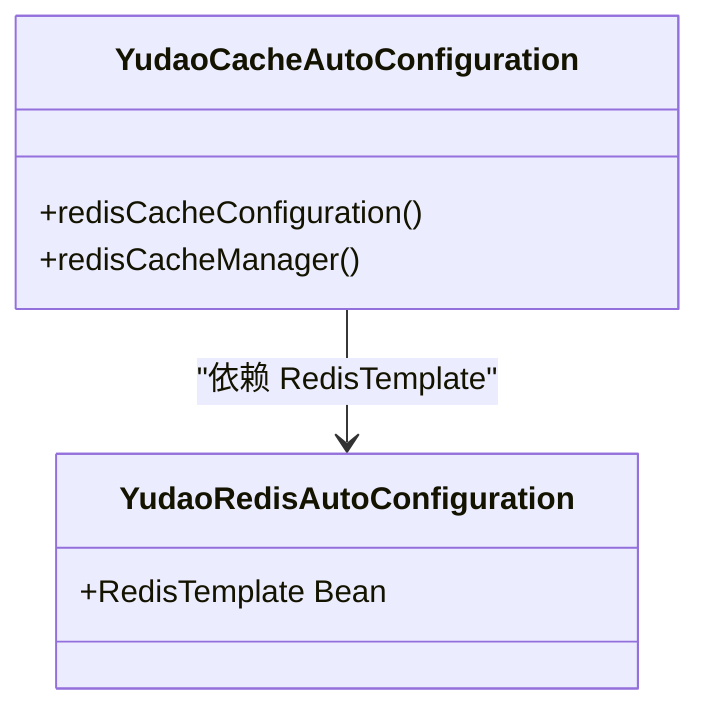
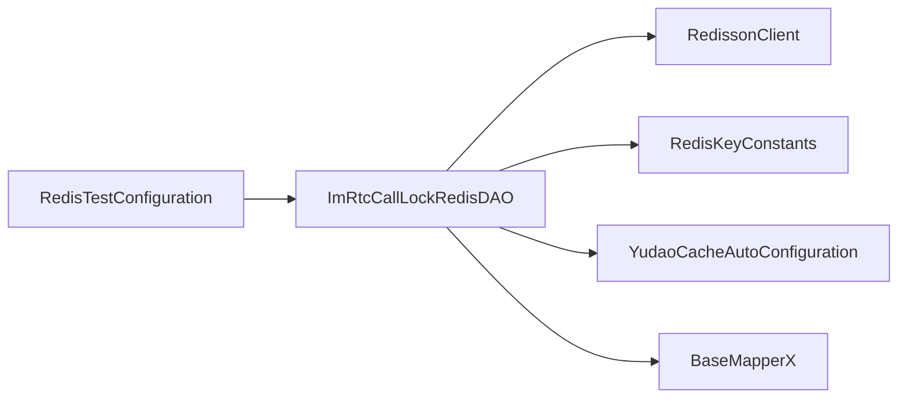

# 分布式锁扩展

<cite>
**本文引用的文件**
- [ImRtcCallLockRedisDAO.java](file://yudao-module-im/src/main/java/cn/iocoder/yudao/module/im/dal/redis/rtc/ImRtcCallLockRedisDAO.java)
- [RedisKeyConstants.java](file://yudao-module-im/src/main/java/cn/iocoder/yudao/module/im/dal/redis/RedisKeyConstants.java)
- [BaseMapperX.java](file://yudao-framework/yudao-spring-boot-starter-mybatis/src/main/java/cn/iocoder/yudao/framework/mybatis/core/mapper/BaseMapperX.java)
- [YudaoRedisAutoConfiguration.java](file://yudao-framework/yudao-spring-boot-starter-redis/src/main/java/cn/iocoder/yudao/framework/redis/config/YudaoRedisAutoConfiguration.java)
- [YudaoCacheAutoConfiguration.java](file://yudao-framework/yudao-spring-boot-starter-redis/src/main/java/cn/iocoder/yudao/framework/redis/config/YudaoCacheAutoConfiguration.java)
- [RedisTestConfiguration.java](file://yudao-framework/yudao-spring-boot-starter-test/src/main/java/cn/iocoder/yudao/framework/test/config/RedisTestConfiguration.java)
- [AbstractEngineConfiguration.java](file://sql/dm/flowable-patch/src/main/java/org/flowable/common/engine/impl/AbstractEngineConfiguration.java)
- [types.ts](file://yudao-ui/yudao-ui-admin-vue3/src/api/infra/redis/types.ts)
- [README.md](file://README.md)
</cite>

## 目录
1. [简介](#简介)
2. [项目结构](#项目结构)
3. [核心组件](#核心组件)
4. [架构总览](#架构总览)
5. [详细组件分析](#详细组件分析)
6. [依赖关系分析](#依赖关系分析)
7. [性能考量](#性能考量)
8. [故障排查指南](#故障排查指南)
9. [结论](#结论)
10. [附录](#附录)

## 简介
本扩展文档围绕芋道 Ruoyi-Vue-Pro 的分布式锁能力展开，结合现有实现与通用工程实践，系统阐述分布式锁的特性要求、实现原理、在高并发场景的应用策略、性能优化与最佳实践。项目中已存在基于 Redisson 的 Redis 分布式锁实现，同时具备数据库行级锁能力与 Redis 缓存配置能力，可作为构建可靠分布式锁系统的基座。

## 项目结构
与分布式锁相关的关键模块与文件如下：
- Redis 分布式锁实现：IM 模块中的 Redis DAO 封装了基于 Redisson 的可重入锁使用模式
- Redis 配置与序列化：统一的 RedisTemplate 与缓存配置，支撑分布式锁键空间与过期策略
- 数据库行级锁：MyBatis 扩展提供 FOR UPDATE 行级锁能力
- 测试环境：集成 Redis Mock 用于单元测试
- UI 监控：Redis 监控接口类型定义，便于观测锁相关指标

**图表来源**
- [ImRtcCallLockRedisDAO.java:1-80](file://yudao-module-im/src/main/java/cn/iocoder/yudao/module/im/dal/redis/rtc/ImRtcCallLockRedisDAO.java#L1-L80)
- [RedisKeyConstants.java:51-62](file://yudao-module-im/src/main/java/cn/iocoder/yudao/module/im/dal/redis/RedisKeyConstants.java#L51-L62)
- [YudaoRedisAutoConfiguration.java:1-17](file://yudao-framework/yudao-spring-boot-starter-redis/src/main/java/cn/iocoder/yudao/framework/redis/config/YudaoRedisAutoConfiguration.java#L1-L17)
- [YudaoCacheAutoConfiguration.java:32-86](file://yudao-framework/yudao-spring-boot-starter-redis/src/main/java/cn/iocoder/yudao/framework/redis/config/YudaoCacheAutoConfiguration.java#L32-L86)
- [BaseMapperX.java:122-145](file://yudao-framework/yudao-spring-boot-starter-mybatis/src/main/java/cn/iocoder/yudao/framework/mybatis/core/mapper/BaseMapperX.java#L122-L145)
- [RedisTestConfiguration.java:1-35](file://yudao-framework/yudao-spring-boot-starter-test/src/main/java/cn/iocoder/yudao/framework/test/config/RedisTestConfiguration.java#L1-L35)
- [types.ts:1-176](file://yudao-ui/yudao-ui-admin-vue3/src/api/infra/redis/types.ts#L1-L176)

**章节来源**
- [ImRtcCallLockRedisDAO.java:1-80](file://yudao-module-im/src/main/java/cn/iocoder/yudao/module/im/dal/redis/rtc/ImRtcCallLockRedisDAO.java#L1-L80)
- [YudaoRedisAutoConfiguration.java:1-17](file://yudao-framework/yudao-spring-boot-starter-redis/src/main/java/cn/iocoder/yudao/framework/redis/config/YudaoRedisAutoConfiguration.java#L1-L17)
- [YudaoCacheAutoConfiguration.java:32-86](file://yudao-framework/yudao-spring-boot-starter-redis/src/main/java/cn/iocoder/yudao/framework/redis/config/YudaoCacheAutoConfiguration.java#L32-L86)
- [BaseMapperX.java:122-145](file://yudao-framework/yudao-spring-boot-starter-mybatis/src/main/java/cn/iocoder/yudao/framework/mybatis/core/mapper/BaseMapperX.java#L122-L145)
- [RedisTestConfiguration.java:1-35](file://yudao-framework/yudao-spring-boot-starter-test/src/main/java/cn/iocoder/yudao/framework/test/config/RedisTestConfiguration.java#L1-L35)
- [types.ts:1-176](file://yudao-ui/yudao-ui-admin-vue3/src/api/infra/redis/types.ts#L1-L176)

## 核心组件
- Redis 分布式锁封装（Redisson）
  - 提供私聊与群聊两种场景的锁封装，采用 tryLock(waitTime, leaseTime, unit) 获取锁，超时抛业务异常，finally 中通过 isHeldByCurrentThread 判断再解锁，避免业务超过租约时间导致的非法状态异常
  - 锁键命名遵循 IM_RTC_CALL_LOCK 规范，私聊按较小 ID 与较大 ID 拼接，确保对称性；群聊以 groupId 为后缀
  - 锁等待与租约时间常量定义明确，便于统一治理与调优
- Redis 配置与缓存
  - 统一的 RedisTemplate 与缓存前缀策略，JSON 序列化，支持 TTL、禁用空值缓存、禁用键前缀等配置
  - 缓存管理器开启事务感知，保证事务提交后再生效，避免读穿与脏读
- 数据库行级锁
  - BaseMapperX 提供 selectOneForUpdate 系列方法，底层通过 FOR UPDATE 实现行级排他锁，需在事务中使用
- 测试支撑
  - RedisTestConfiguration 使用 Jedismock 启动内嵌 Redis，便于单元测试验证锁逻辑
- UI 监控
  - types.ts 定义 Redis 监控信息结构，可用于前端展示与告警

**章节来源**
- [ImRtcCallLockRedisDAO.java:26-80](file://yudao-module-im/src/main/java/cn/iocoder/yudao/module/im/dal/redis/rtc/ImRtcCallLockRedisDAO.java#L26-L80)
- [RedisKeyConstants.java:51-62](file://yudao-module-im/src/main/java/cn/iocoder/yudao/module/im/dal/redis/RedisKeyConstants.java#L51-L62)
- [YudaoCacheAutoConfiguration.java:32-86](file://yudao-framework/yudao-spring-boot-starter-redis/src/main/java/cn/iocoder/yudao/framework/redis/config/YudaoCacheAutoConfiguration.java#L32-L86)
- [BaseMapperX.java:122-145](file://yudao-framework/yudao-spring-boot-starter-mybatis/src/main/java/cn/iocoder/yudao/framework/mybatis/core/mapper/BaseMapperX.java#L122-L145)
- [RedisTestConfiguration.java:17-35](file://yudao-framework/yudao-spring-boot-starter-test/src/main/java/cn/iocoder/yudao/framework/test/config/RedisTestConfiguration.java#L17-L35)
- [types.ts:1-176](file://yudao-ui/yudao-ui-admin-vue3/src/api/infra/redis/types.ts#L1-L176)

## 架构总览
下图展示了分布式锁在系统中的位置与交互关系：Redis 分布式锁用于高并发下的互斥保护；数据库行级锁用于强一致场景；缓存配置与序列化为锁键与值提供统一承载；测试环境提供隔离验证；UI 层提供监控指标。

**图表来源**
- [ImRtcCallLockRedisDAO.java:43-78](file://yudao-module-im/src/main/java/cn/iocoder/yudao/module/im/dal/redis/rtc/ImRtcCallLockRedisDAO.java#L43-L78)
- [YudaoRedisAutoConfiguration.java:1-17](file://yudao-framework/yudao-spring-boot-starter-redis/src/main/java/cn/iocoder/yudao/framework/redis/config/YudaoRedisAutoConfiguration.java#L1-L17)
- [YudaoCacheAutoConfiguration.java:32-86](file://yudao-framework/yudao-spring-boot-starter-redis/src/main/java/cn/iocoder/yudao/framework/redis/config/YudaoCacheAutoConfiguration.java#L32-L86)
- [BaseMapperX.java:122-145](file://yudao-framework/yudao-spring-boot-starter-mybatis/src/main/java/cn/iocoder/yudao/framework/mybatis/core/mapper/BaseMapperX.java#L122-L145)
- [RedisTestConfiguration.java:25-33](file://yudao-framework/yudao-spring-boot-starter-test/src/main/java/cn/iocoder/yudao/framework/test/config/RedisTestConfiguration.java#L25-L33)

## 详细组件分析

### Redis 分布式锁组件分析
- 设计要点
  - 锁粒度：按私聊对称键与群组键划分，避免跨用户或跨群资源竞争
  - 超时与租约：等待超时直接失败并抛出业务异常；租约到期自动释放，避免死锁
  - 解锁安全：finally 中判断当前线程持有锁再解锁，规避越权释放
- 关键流程（私聊/群聊）
  - 生成锁键
  - 获取 RLock 并尝试加锁（带等待与租约）
  - 成功则执行业务逻辑；失败记录日志并抛出异常
  - 无论成功与否，在 finally 中检查并解锁
- 错误处理
  - 获取锁超时：记录日志并抛出“繁忙”类业务异常
  - 租约到期：记录日志提示自动释放，避免 IllegalMonitorStateException

**图表来源**
- [ImRtcCallLockRedisDAO.java:43-78](file://yudao-module-im/src/main/java/cn/iocoder/yudao/module/im/dal/redis/rtc/ImRtcCallLockRedisDAO.java#L43-L78)

**章节来源**
- [ImRtcCallLockRedisDAO.java:26-80](file://yudao-module-im/src/main/java/cn/iocoder/yudao/module/im/dal/redis/rtc/ImRtcCallLockRedisDAO.java#L26-L80)
- [RedisKeyConstants.java:51-62](file://yudao-module-im/src/main/java/cn/iocoder/yudao/module/im/dal/redis/RedisKeyConstants.java#L51-L62)

### 数据库行级锁组件分析
- 设计要点
  - FOR UPDATE：在事务中查询并锁定目标行，防止并发写冲突
  - 使用建议：必须在事务上下文中调用，否则锁立即失效
- 典型用法
  - selectOneForUpdate 多字段组合条件，返回实体对象
- 适用场景
  - 需要强一致性的原子更新，如库存扣减、余额变更等

**图表来源**
- [BaseMapperX.java:122-145](file://yudao-framework/yudao-spring-boot-starter-mybatis/src/main/java/cn/iocoder/yudao/framework/mybatis/core/mapper/BaseMapperX.java#L122-L145)

**章节来源**
- [BaseMapperX.java:122-145](file://yudao-framework/yudao-spring-boot-starter-mybatis/src/main/java/cn/iocoder/yudao/framework/mybatis/core/mapper/BaseMapperX.java#L122-L145)

### Redis 配置与缓存组件分析
- 设计要点
  - 统一前缀策略：避免键冲突，支持自定义前缀
  - JSON 序列化：提升跨语言与可观测性
  - TTL 与空值缓存：按需关闭空值缓存，设置默认过期时间
  - 事务感知：缓存操作延迟至事务提交后生效，降低并发风险
- 作用范围
  - 为分布式锁键空间提供统一的命名与序列化策略
  - 为业务缓存提供一致的配置基线

**图表来源**
- [YudaoCacheAutoConfiguration.java:32-86](file://yudao-framework/yudao-spring-boot-starter-redis/src/main/java/cn/iocoder/yudao/framework/redis/config/YudaoCacheAutoConfiguration.java#L32-L86)
- [YudaoRedisAutoConfiguration.java:1-17](file://yudao-framework/yudao-spring-boot-starter-redis/src/main/java/cn/iocoder/yudao/framework/redis/config/YudaoRedisAutoConfiguration.java#L1-L17)

**章节来源**
- [YudaoCacheAutoConfiguration.java:32-86](file://yudao-framework/yudao-spring-boot-starter-redis/src/main/java/cn/iocoder/yudao/framework/redis/config/YudaoCacheAutoConfiguration.java#L32-L86)
- [YudaoRedisAutoConfiguration.java:1-17](file://yudao-framework/yudao-spring-boot-starter-redis/src/main/java/cn/iocoder/yudao/framework/redis/config/YudaoRedisAutoConfiguration.java#L1-L17)

### 测试支撑组件分析
- 设计要点
  - 使用 Jedismock 启动内嵌 Redis 服务，端口来自 RedisProperties
  - 禁止延迟加载，确保测试容器初始化
- 作用范围
  - 为分布式锁逻辑提供隔离、可控的测试环境

**章节来源**
- [RedisTestConfiguration.java:17-35](file://yudao-framework/yudao-spring-boot-starter-test/src/main/java/cn/iocoder/yudao/framework/test/config/RedisTestConfiguration.java#L17-L35)

### UI 监控组件分析
- 设计要点
  - types.ts 定义 Redis 监控信息 VO 结构，包含 info、dbSize、commandStats 等
- 作用范围
  - 为前端监控面板提供数据模型，辅助观察锁相关指标

**章节来源**
- [types.ts:1-176](file://yudao-ui/yudao-ui-admin-vue3/src/api/infra/redis/types.ts#L1-L176)

## 依赖关系分析
- 组件耦合
  - ImRtcCallLockRedisDAO 依赖 RedissonClient 与 Redis 键常量，解耦于具体业务
  - 缓存配置与 Redis 配置共同为锁键提供统一承载
  - 数据库行级锁独立于 Redis，适用于强一致场景
- 外部依赖
  - Redisson：提供可重入锁、自动续期等能力
  - MyBatis：提供 FOR UPDATE 行级锁
  - Redis：键空间与过期策略由缓存配置统一管理
- 循环依赖
  - 当前实现未见循环依赖迹象，DAO 与配置分层清晰

**图表来源**
- [ImRtcCallLockRedisDAO.java:37-78](file://yudao-module-im/src/main/java/cn/iocoder/yudao/module/im/dal/redis/rtc/ImRtcCallLockRedisDAO.java#L37-L78)
- [RedisKeyConstants.java:51-62](file://yudao-module-im/src/main/java/cn/iocoder/yudao/module/im/dal/redis/RedisKeyConstants.java#L51-L62)
- [YudaoCacheAutoConfiguration.java:70-84](file://yudao-framework/yudao-spring-boot-starter-redis/src/main/java/cn/iocoder/yudao/framework/redis/config/YudaoCacheAutoConfiguration.java#L70-L84)
- [BaseMapperX.java:122-145](file://yudao-framework/yudao-spring-boot-starter-mybatis/src/main/java/cn/iocoder/yudao/framework/mybatis/core/mapper/BaseMapperX.java#L122-L145)
- [RedisTestConfiguration.java:25-33](file://yudao-framework/yudao-spring-boot-starter-test/src/main/java/cn/iocoder/yudao/framework/test/config/RedisTestConfiguration.java#L25-L33)

**章节来源**
- [ImRtcCallLockRedisDAO.java:37-78](file://yudao-module-im/src/main/java/cn/iocoder/yudao/module/im/dal/redis/rtc/ImRtcCallLockRedisDAO.java#L37-L78)
- [YudaoCacheAutoConfiguration.java:70-84](file://yudao-framework/yudao-spring-boot-starter-redis/src/main/java/cn/iocoder/yudao/framework/redis/config/YudaoCacheAutoConfiguration.java#L70-L84)

## 性能考量
- 锁粒度控制
  - 将锁键细化到业务域最小必要范围（如私聊对称键、群组键），减少热点竞争
- 超时与租约设置
  - WAIT_MS 与 LEASE_MS 需结合业务耗时与 Redis 延迟评估，避免过短导致频繁失败、过长导致资源占用
- 重试机制
  - 在幂等允许的前提下，对非关键路径增加指数退避重试，降低抖动
- 监控与告警
  - 通过 UI types.ts 定义的监控结构采集 Redis 指标，关注命令统计、内存、连接数等，建立告警阈值
- 缓存与序列化
  - 使用 JSON 序列化与统一前缀，提升可观测性与跨语言兼容性

[本节为通用指导，无需特定文件引用]

## 故障排查指南
- 获取锁超时
  - 现象：日志记录等待超时并抛出“繁忙”类异常
  - 排查：检查 WAIT_MS 是否合理、是否存在热点键、是否出现死锁或未释放
- 租约到期自动释放
  - 现象：业务超过 LEASE_MS 时锁被自动释放，避免 IllegalMonitorStateException
  - 排查：确认业务耗时是否超出预期，适当延长租约或拆分长事务
- 解锁失败或重复解锁
  - 现象：finally 中通过 isHeldByCurrentThread 判断再解锁，避免越权
  - 排查：确认锁使用是否跨线程传递、是否在异步回调中错误释放
- 数据库行级锁失效
  - 现象：FOR UPDATE 未在事务中调用导致锁立即释放
  - 排查：确保 selectOneForUpdate 在 @Transactional 上下文中调用
- 测试环境端口占用
  - 现象：多次启动测试容器时端口被占用
  - 排查：RedisTestConfiguration 已捕获异常并忽略，确认端口配置与容器生命周期

**章节来源**
- [ImRtcCallLockRedisDAO.java:62-78](file://yudao-module-im/src/main/java/cn/iocoder/yudao/module/im/dal/redis/rtc/ImRtcCallLockRedisDAO.java#L62-L78)
- [BaseMapperX.java:122-145](file://yudao-framework/yudao-spring-boot-starter-mybatis/src/main/java/cn/iocoder/yudao/framework/mybatis/core/mapper/BaseMapperX.java#L122-L145)
- [RedisTestConfiguration.java:25-33](file://yudao-framework/yudao-spring-boot-starter-test/src/main/java/cn/iocoder/yudao/framework/test/config/RedisTestConfiguration.java#L25-L33)

## 结论
项目已在 Redis 分布式锁方面提供了成熟的实现与配套配置，结合数据库行级锁与缓存配置，能够覆盖高并发与强一致性的双重需求。通过合理的锁粒度、超时与租约设置、重试与监控告警，可进一步提升系统的可靠性与性能表现。建议在新增业务时优先评估锁策略，遵循最小粒度原则，并配套完善测试与监控。

[本节为总结性内容，无需特定文件引用]

## 附录

### 分布式锁实现方案概览
- Redis 分布式锁（推荐）
  - 优点：低延迟、易扩展、支持自动续期
  - 适用：高并发互斥、热点资源串行化
  - 参考实现：ImRtcCallLockRedisDAO
- 数据库分布式锁（强一致）
  - 优点：强一致性、无需额外中间件
  - 适用：库存扣减、余额变更等强一致场景
  - 参考实现：BaseMapperX.selectOneForUpdate
- Zookeeper 分布式锁（可选）
  - 优点：强一致性、顺序节点天然有序
  - 适用：对一致性与顺序有更高要求的场景
  - 实现要点：临时顺序节点 + Watcher 监听 + 释放策略
- 数据库分布式锁（可选）
  - 优点：零依赖、实现简单
  - 适用：低并发或对一致性要求极高的场景
  - 实现要点：INSERT/UPDATE 原子写 + 唯一键约束 + FOR UPDATE

[本节为概念性说明，无需特定文件引用]

### 典型业务场景与锁策略
- 库存扣减
  - 方案：数据库行级锁（FOR UPDATE）+ Redis 分布式锁（热点商品）
  - 策略：先查后扣，事务内完成；热点商品加 Redis 锁，非热点走数据库行锁
- 订单创建
  - 方案：Redis 分布式锁（按用户/商品维度）+ 数据库行级锁（最终落库）
  - 策略：预占位 + 原子落库；失败回滚，避免脏写
- 数据更新
  - 方案：Redis 分布式锁（热点更新）+ 缓存一致性（TTL/失效策略）
  - 策略：写后读一致性，必要时强制失效或延迟生效

[本节为通用指导，无需特定文件引用]

### 最佳实践清单
- 明确锁粒度：按业务域最小化锁范围
- 合理设置超时与租约：结合压测与线上观测
- 异常与兜底：超时抛业务异常、租约到期自动释放、finally 安全解锁
- 监控与告警：采集 Redis 指标，建立阈值告警
- 测试覆盖：使用内嵌 Redis 进行单元测试，覆盖正常与异常路径
- 文档与评审：锁策略纳入设计评审，形成统一规范

[本节为通用指导，无需特定文件引用]