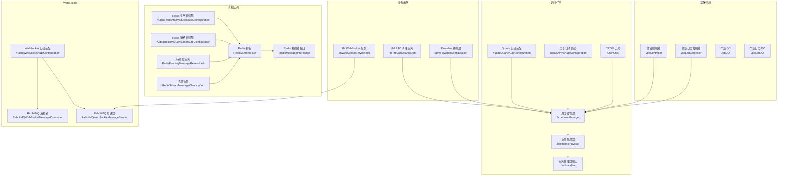
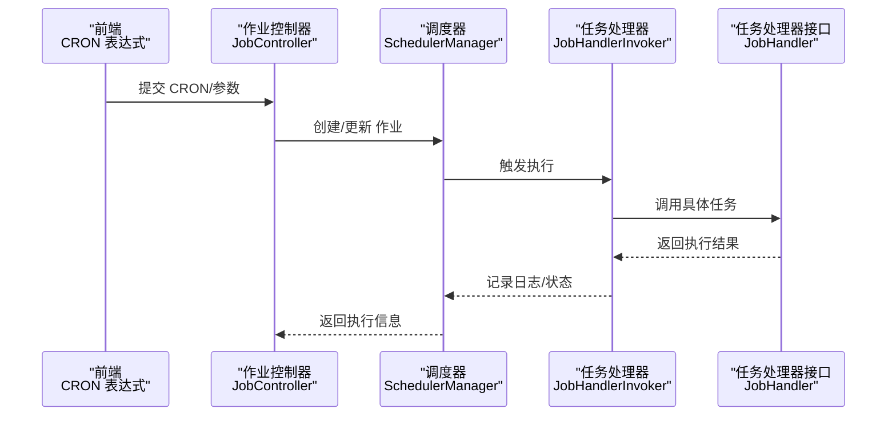
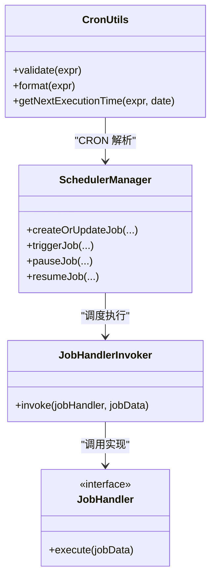
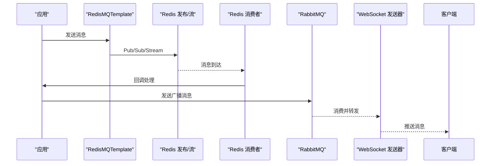
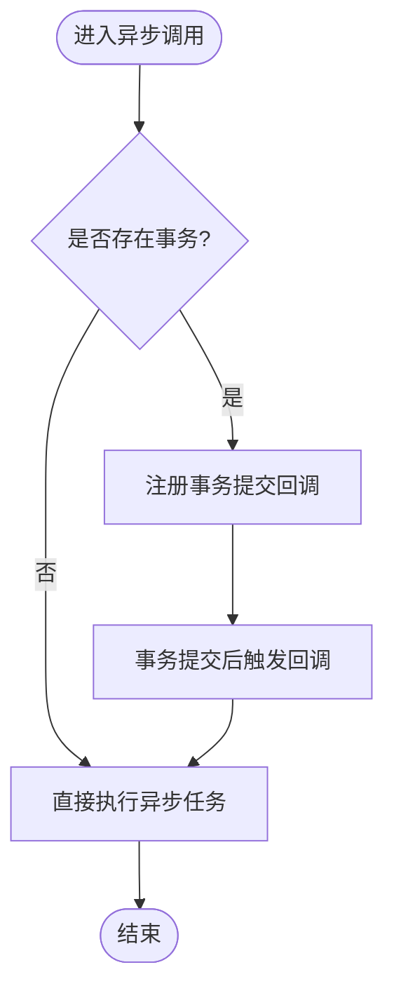
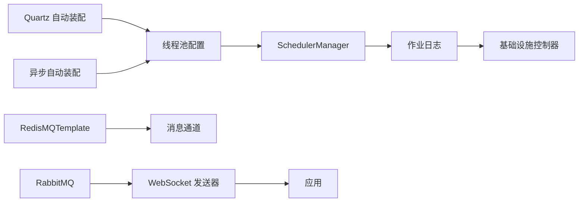

# 异步处理优化

<cite>
**本文引用的文件**
- [application-local.yaml](file://yudao-server/src/main/resources/application-local.yaml)
- [YudaoAsyncAutoConfiguration.java](file://yudao-framework/yudao-spring-boot-starter-job/src/main/java/cn/iocoder/yudao/framework/quartz/config/YudaoAsyncAutoConfiguration.java)
- [YudaoQuartzAutoConfiguration.java](file://yudao-framework/yudao-spring-boot-starter-job/src/main/java/cn/iocoder/yudao/framework/quartz/config/YudaoQuartzAutoConfiguration.java)
- [SchedulerManager.java](file://yudao-framework/yudao-spring-boot-starter-job/src/main/java/cn/iocoder/yudao/framework/quartz/core/scheduler/SchedulerManager.java)
- [JobHandler.java](file://yudao-framework/yudao-spring-boot-starter-job/src/main/java/cn/iocoder/yudao/framework/quartz/core/handler/JobHandler.java)
- [JobHandlerInvoker.java](file://yudao-framework/yudao-spring-boot-starter-job/src/main/java/cn/iocoder/yudao/framework/quartz/core/handler/JobHandlerInvoker.java)
- [CronUtils.java](file://yudao-framework/yudao-spring-boot-starter-job/src/main/java/cn/iocoder/yudao/framework/quartz/core/util/CronUtils.java)
- [YudaoRedisMQProducerAutoConfiguration.java](file://yudao-framework/yudao-spring-boot-starter-mq/src/main/java/cn/iocoder/yudao/framework/mq/redis/config/YudaoRedisMQProducerAutoConfiguration.java)
- [YudaoRedisMQConsumerAutoConfiguration.java](file://yudao-framework/yudao-spring-boot-starter-mq/src/main/java/cn/iocoder/yudao/framework/mq/redis/config/YudaoRedisMQConsumerAutoConfiguration.java)
- [RedisMQTemplate.java](file://yudao-framework/yudao-spring-boot-starter-mq/src/main/java/cn/iocoder/yudao/framework/mq/redis/core/RedisMQTemplate.java)
- [RedisMessageInterceptor.java](file://yudao-framework/yudao-spring-boot-starter-mq/src/main/java/cn/iocoder/yudao/framework/mq/redis/core/interceptor/RedisMessageInterceptor.java)
- [RedisPendingMessageResendJob.java](file://yudao-framework/yudao-spring-boot-starter-mq/src/main/java/cn/iocoder/yudao/framework/mq/redis/core/job/RedisPendingMessageResendJob.java)
- [RedisStreamMessageCleanupJob.java](file://yudao-framework/yudao-spring-boot-starter-mq/src/main/java/cn/iocoder/yudao/framework/mq/redis/core/job/RedisStreamMessageCleanupJob.java)
- [YudaoWebSocketAutoConfiguration.java](file://yudao-framework/yudao-spring-boot-starter-websocket/src/main/java/cn/iocoder/yudao/framework/websocket/config/YudaoWebSocketAutoConfiguration.java)
- [RabbitMQWebSocketMessageConsumer.java](file://yudao-framework/yudao-spring-boot-starter-websocket/src/main/java/cn/iocoder/yudao/framework/websocket/core/sender/rabbitmq/RabbitMQWebSocketMessageConsumer.java)
- [RabbitMQWebSocketMessageSender.java](file://yudao-framework/yudao-spring-boot-starter-websocket/src/main/java/cn/iocoder/yudao/framework/websocket/core/sender/rabbitmq/RabbitMQWebSocketMessageSender.java)
- [ImWebSocketServiceImpl.java](file://yudao-module-im/src/main/java/cn/iocoder/yudao/module/im/service/websocket/ImWebSocketServiceImpl.java)
- [ImRtcCallCleanupJob.java](file://yudao-module-im/src/main/java/cn/iocoder/yudao/module/im/job/rtc/ImRtcCallCleanupJob.java)
- [BpmFlowableConfiguration.java](file://yudao-module-bpm/src/main/java/cn/iocoder/yudao/module/bpm/framework/flowable/config/BpmFlowableConfiguration.java)
- [CacheUtils.java](file://yudao-framework/yudao-common/src/main/java/cn/iocoder/yudao/framework/common/util/cache/CacheUtils.java)
- [cron.ts](file://yudao-ui/yudao-ui-admin-vue3/src/utils/cron.ts)
- [JobController.java](file://yudao-module-infra/src/main/java/cn/iocoder/yudao/module/infra/controller/admin/job/JobController.java)
- [JobLogController.java](file://yudao-module-infra/src/main/java/cn/iocoder/yudao/module/infra/controller/admin/job/JobLogController.java)
- [JobDO.java](file://yudao-module-infra/src/main/java/cn/iocoder/yudao/module/infra/dal/dataobject/job/JobDO.java)
- [JobLogDO.java](file://yudao-module-infra/src/main/java/cn/iocoder/yudao/module/infra/dal/dataobject/job/JobLogDO.java)
- [JobStatusEnum.java](file://yudao-module-infra/src/main/java/cn/iocoder/yudao/module/infra/enums/job/JobStatusEnum.java)
- [JobLogStatusEnum.java](file://yudao-module-infra/src/main/java/cn/iocoder/yudao/module/infra/enums/job/JobLogStatusEnum.java)
</cite>

## 目录
1. [引言](#引言)
2. [项目结构](#项目结构)
3. [核心组件](#核心组件)
4. [架构总览](#架构总览)
5. [详细组件分析](#详细组件分析)
6. [依赖分析](#依赖分析)
7. [性能考虑](#性能考虑)
8. [故障排查指南](#故障排查指南)
9. [结论](#结论)
10. [附录](#附录)

## 引言
本文件面向芋道 Ruoyi-Vue-Pro 的异步处理优化目标，系统梳理并优化以下能力：
- 定时任务优化：Quartz 调度策略、并发控制、持久化、集群部署与监控
- 消息队列优化：Redis/RabbitMQ 等异步通道的可靠性、幂等、顺序与监控
- 异步调用优化：线程池配置、异步结果处理、异常与超时控制
- 性能监控：吞吐量、延迟、失败率与资源使用评估
- 实施示例与配置模板：帮助快速落地高效异步处理体系

## 项目结构
围绕异步处理的关键模块分布如下：
- 定时任务：yudao-spring-boot-starter-job（Quartz 自动装配、调度器、处理器、CRON 工具）
- 消息队列：yudao-spring-boot-starter-mq（Redis/RabbitMQ 等多实现适配）
- WebSocket：yudao-spring-boot-starter-websocket（RabbitMQ 广播发送）
- 业务示例：IM 模块（WebSocket 推送、RTC 清理任务）、BPM 模块（Flowable 线程池）
- 基础设施：Infra 模块（作业管理接口与日志）
- 前端工具：CRON 表达式解析与可视化

图表来源
- [YudaoQuartzAutoConfiguration.java:1-200](file://yudao-framework/yudao-spring-boot-starter-job/src/main/java/cn/iocoder/yudao/framework/quartz/config/YudaoQuartzAutoConfiguration.java#L1-L200)
- [YudaoAsyncAutoConfiguration.java:1-200](file://yudao-framework/yudao-spring-boot-starter-job/src/main/java/cn/iocoder/yudao/framework/quartz/config/YudaoAsyncAutoConfiguration.java#L1-L200)
- [SchedulerManager.java:1-200](file://yudao-framework/yudao-spring-boot-starter-job/src/main/java/cn/iocoder/yudao/framework/quartz/core/scheduler/SchedulerManager.java#L1-L200)
- [JobHandlerInvoker.java:1-200](file://yudao-framework/yudao-spring-boot-starter-job/src/main/java/cn/iocoder/yudao/framework/quartz/core/handler/JobHandlerInvoker.java#L1-L200)
- [YudaoRedisMQProducerAutoConfiguration.java:1-120](file://yudao-framework/yudao-spring-boot-starter-mq/src/main/java/cn/iocoder/yudao/framework/mq/redis/config/YudaoRedisMQProducerAutoConfiguration.java#L1-L120)
- [YudaoRedisMQConsumerAutoConfiguration.java:1-120](file://yudao-framework/yudao-spring-boot-starter-mq/src/main/java/cn/iocoder/yudao/framework/mq/redis/config/YudaoRedisMQConsumerAutoConfiguration.java#L1-L120)
- [RedisMQTemplate.java:1-200](file://yudao-framework/yudao-spring-boot-starter-mq/src/main/java/cn/iocoder/yudao/framework/mq/redis/core/RedisMQTemplate.java#L1-L200)
- [YudaoWebSocketAutoConfiguration.java:120-170](file://yudao-framework/yudao-spring-boot-starter-websocket/src/main/java/cn/iocoder/yudao/framework/websocket/config/YudaoWebSocketAutoConfiguration.java#L120-L170)
- [RabbitMQWebSocketMessageConsumer.java:1-120](file://yudao-framework/yudao-spring-boot-starter-websocket/src/main/java/cn/iocoder/yudao/framework/websocket/core/sender/rabbitmq/RabbitMQWebSocketMessageConsumer.java#L1-L120)
- [RabbitMQWebSocketMessageSender.java:1-120](file://yudao-framework/yudao-spring-boot-starter-websocket/src/main/java/cn/iocoder/yudao/framework/websocket/core/sender/rabbitmq/RabbitMQWebSocketMessageSender.java#L1-L120)
- [ImWebSocketServiceImpl.java:1-200](file://yudao-module-im/src/main/java/cn/iocoder/yudao/module/im/service/websocket/ImWebSocketServiceImpl.java#L1-L200)
- [ImRtcCallCleanupJob.java:1-120](file://yudao-module-im/src/main/java/cn/iocoder/yudao/module/im/job/rtc/ImRtcCallCleanupJob.java#L1-L120)
- [BpmFlowableConfiguration.java:1-120](file://yudao-module-bpm/src/main/java/cn/iocoder/yudao/module/bpm/framework/flowable/config/BpmFlowableConfiguration.java#L1-L120)

章节来源
- [YudaoQuartzAutoConfiguration.java:1-200](file://yudao-framework/yudao-spring-boot-starter-job/src/main/java/cn/iocoder/yudao/framework/quartz/config/YudaoQuartzAutoConfiguration.java#L1-L200)
- [YudaoAsyncAutoConfiguration.java:1-200](file://yudao-framework/yudao-spring-boot-starter-job/src/main/java/cn/iocoder/yudao/framework/quartz/config/YudaoAsyncAutoConfiguration.java#L1-L200)
- [YudaoRedisMQProducerAutoConfiguration.java:1-120](file://yudao-framework/yudao-spring-boot-starter-mq/src/main/java/cn/iocoder/yudao/framework/mq/redis/config/YudaoRedisMQProducerAutoConfiguration.java#L1-L120)
- [YudaoWebSocketAutoConfiguration.java:120-170](file://yudao-framework/yudao-spring-boot-starter-websocket/src/main/java/cn/iocoder/yudao/framework/websocket/config/YudaoWebSocketAutoConfiguration.java#L120-L170)

## 核心组件
- Quartz 定时任务：自动装配、调度器管理、任务处理器、CRON 工具
- Redis 消息队列：生产者/消费者自动装配、模板与拦截器、待重发与清理作业
- RabbitMQ WebSocket：广播发送与消费，Topic 交换机
- 业务示例：IM WebSocket 事务感知异步推送、RTC 清理任务
- BPM 线程池：Flowable 异步任务执行器
- 基础设施：作业与日志的管理与持久化

章节来源
- [SchedulerManager.java:1-200](file://yudao-framework/yudao-spring-boot-starter-job/src/main/java/cn/iocoder/yudao/framework/quartz/core/scheduler/SchedulerManager.java#L1-L200)
- [JobHandler.java:1-200](file://yudao-framework/yudao-spring-boot-starter-job/src/main/java/cn/iocoder/yudao/framework/quartz/core/handler/JobHandler.java#L1-L200)
- [RedisMQTemplate.java:1-200](file://yudao-framework/yudao-spring-boot-starter-mq/src/main/java/cn/iocoder/yudao/framework/mq/redis/core/RedisMQTemplate.java#L1-L200)
- [ImWebSocketServiceImpl.java:1-200](file://yudao-module-im/src/main/java/cn/iocoder/yudao/module/im/service/websocket/ImWebSocketServiceImpl.java#L1-L200)
- [BpmFlowableConfiguration.java:1-120](file://yudao-module-bpm/src/main/java/cn/iocoder/yudao/module/bpm/framework/flowable/config/BpmFlowableConfiguration.java#L1-L120)

## 架构总览
异步处理在系统中分层清晰：前端通过 CRON 表达式配置任务；后端 Quartz 统一调度；消息通道负责解耦；业务层在事务完成后触发异步操作。

图表来源
- [JobController.java:1-200](file://yudao-module-infra/src/main/java/cn/iocoder/yudao/module/infra/controller/admin/job/JobController.java#L1-L200)
- [SchedulerManager.java:1-200](file://yudao-framework/yudao-spring-boot-starter-job/src/main/java/cn/iocoder/yudao/framework/quartz/core/scheduler/SchedulerManager.java#L1-L200)
- [JobHandlerInvoker.java:1-200](file://yudao-framework/yudao-spring-boot-starter-job/src/main/java/cn/iocoder/yudao/framework/quartz/core/handler/JobHandlerInvoker.java#L1-L200)
- [JobHandler.java:1-200](file://yudao-framework/yudao-spring-boot-starter-job/src/main/java/cn/iocoder/yudao/framework/quartz/core/handler/JobHandler.java#L1-L200)

## 详细组件分析

### Quartz 定时任务优化
- 调度策略
  - CRON 表达式解析与校验，支持常用预设与可读描述
  - 作业参数透传与阈值解析，便于动态调整
- 并发控制
  - 线程池大小与队列容量配置，避免过载
  - 关闭时等待作业完成，保障优雅停机
- 任务持久化与集群
  - JDBC 存储器，集群模式，节点检查与 misfire 处理
- 监控与日志
  - 作业状态枚举与日志实体，记录执行结果与耗时

图表来源
- [SchedulerManager.java:1-200](file://yudao-framework/yudao-spring-boot-starter-job/src/main/java/cn/iocoder/yudao/framework/quartz/core/scheduler/SchedulerManager.java#L1-L200)
- [JobHandlerInvoker.java:1-200](file://yudao-framework/yudao-spring-boot-starter-job/src/main/java/cn/iocoder/yudao/framework/quartz/core/handler/JobHandlerInvoker.java#L1-L200)
- [JobHandler.java:1-200](file://yudao-framework/yudao-spring-boot-starter-job/src/main/java/cn/iocoder/yudao/framework/quartz/core/handler/JobHandler.java#L1-L200)
- [CronUtils.java:1-200](file://yudao-framework/yudao-spring-boot-starter-job/src/main/java/cn/iocoder/yudao/framework/quartz/core/util/CronUtils.java#L1-L200)

章节来源
- [application-local.yaml:92-115](file://yudao-server/src/main/resources/application-local.yaml#L92-L115)
- [YudaoQuartzAutoConfiguration.java:1-200](file://yudao-framework/yudao-spring-boot-starter-job/src/main/java/cn/iocoder/yudao/framework/quartz/config/YudaoQuartzAutoConfiguration.java#L1-L200)
- [YudaoAsyncAutoConfiguration.java:1-200](file://yudao-framework/yudao-spring-boot-starter-job/src/main/java/cn/iocoder/yudao/framework/quartz/config/YudaoAsyncAutoConfiguration.java#L1-L200)
- [ImRtcCallCleanupJob.java:1-120](file://yudao-module-im/src/main/java/cn/iocoder/yudao/module/im/job/rtc/ImRtcCallCleanupJob.java#L1-L120)
- [JobDO.java:1-200](file://yudao-module-infra/src/main/java/cn/iocoder/yudao/module/infra/dal/dataobject/job/JobDO.java#L1-L200)
- [JobLogDO.java:1-200](file://yudao-module-infra/src/main/java/cn/iocoder/yudao/module/infra/dal/dataobject/job/JobLogDO.java#L1-L200)
- [JobStatusEnum.java:1-200](file://yudao-module-infra/src/main/java/cn/iocoder/yudao/module/infra/enums/job/JobStatusEnum.java#L1-L200)
- [JobLogStatusEnum.java:1-200](file://yudao-module-infra/src/main/java/cn/iocoder/yudao/module/infra/enums/job/JobLogStatusEnum.java#L1-L200)

### 消息队列异步处理
- Redis 通道
  - 生产者模板与拦截器链，统一增强消息处理
  - 待重发与清理作业，保障可靠性与资源回收
- RabbitMQ 通道
  - Topic 交换机广播，消费者队列自动删除，避免堆积
  - 消费端基于注解绑定，简化订阅逻辑

图表来源
- [YudaoRedisMQProducerAutoConfiguration.java:1-120](file://yudao-framework/yudao-spring-boot-starter-mq/src/main/java/cn/iocoder/yudao/framework/mq/redis/config/YudaoRedisMQProducerAutoConfiguration.java#L1-L120)
- [YudaoRedisMQConsumerAutoConfiguration.java:1-120](file://yudao-framework/yudao-spring-boot-starter-mq/src/main/java/cn/iocoder/yudao/framework/mq/redis/config/YudaoRedisMQConsumerAutoConfiguration.java#L1-L120)
- [RedisMQTemplate.java:1-200](file://yudao-framework/yudao-spring-boot-starter-mq/src/main/java/cn/iocoder/yudao/framework/mq/redis/core/RedisMQTemplate.java#L1-L200)
- [YudaoWebSocketAutoConfiguration.java:120-170](file://yudao-framework/yudao-spring-boot-starter-websocket/src/main/java/cn/iocoder/yudao/framework/websocket/config/YudaoWebSocketAutoConfiguration.java#L120-L170)
- [RabbitMQWebSocketMessageConsumer.java:1-120](file://yudao-framework/yudao-spring-boot-starter-websocket/src/main/java/cn/iocoder/yudao/framework/websocket/core/sender/rabbitmq/RabbitMQWebSocketMessageConsumer.java#L1-L120)
- [RabbitMQWebSocketMessageSender.java:1-120](file://yudao-framework/yudao-spring-boot-starter-websocket/src/main/java/cn/iocoder/yudao/framework/websocket/core/sender/rabbitmq/RabbitMQWebSocketMessageSender.java#L1-L120)

章节来源
- [RedisPendingMessageResendJob.java:1-200](file://yudao-framework/yudao-spring-boot-starter-mq/src/main/java/cn/iocoder/yudao/framework/mq/redis/core/job/RedisPendingMessageResendJob.java#L1-L200)
- [RedisStreamMessageCleanupJob.java:1-200](file://yudao-framework/yudao-spring-boot-starter-mq/src/main/java/cn/iocoder/yudao/framework/mq/redis/core/job/RedisStreamMessageCleanupJob.java#L1-L200)
- [RedisMessageInterceptor.java:1-200](file://yudao-framework/yudao-spring-boot-starter-mq/src/main/java/cn/iocoder/yudao/framework/mq/redis/core/interceptor/RedisMessageInterceptor.java#L1-L200)

### 异步调用优化
- 事务感知异步
  - 在事务提交后再执行异步推送，避免脏读
  - 通过 Spring 代理获取自身，确保 @Async AOP 生效
- 线程池配置
  - Flowable 异步任务执行器，固定核心/最大线程与队列容量
  - Quartz 线程池大小按业务负载调整
- 结果与异常处理
  - 作业日志记录执行状态与异常，便于回溯
- 超时控制
  - 通过线程池拒绝策略与队列长度限制，避免长时间阻塞

图表来源
- [ImWebSocketServiceImpl.java:120-154](file://yudao-module-im/src/main/java/cn/iocoder/yudao/module/im/service/websocket/ImWebSocketServiceImpl.java#L120-L154)
- [BpmFlowableConfiguration.java:1-120](file://yudao-module-bpm/src/main/java/cn/iocoder/yudao/module/bpm/framework/flowable/config/BpmFlowableConfiguration.java#L1-L120)
- [application-local.yaml:92-115](file://yudao-server/src/main/resources/application-local.yaml#L92-L115)

章节来源
- [ImWebSocketServiceImpl.java:1-200](file://yudao-module-im/src/main/java/cn/iocoder/yudao/module/im/service/websocket/ImWebSocketServiceImpl.java#L1-L200)
- [BpmFlowableConfiguration.java:1-120](file://yudao-module-bpm/src/main/java/cn/iocoder/yudao/module/bpm/framework/flowable/config/BpmFlowableConfiguration.java#L1-L120)

### 性能监控与评估
- 指标维度
  - 吞吐量：单位时间内成功执行的作业数
  - 延迟：从触发到完成的耗时分布
  - 失败率：异常与重试导致的失败占比
  - 资源使用：CPU、内存、线程池饱和度、消息积压
- 数据来源
  - 作业状态与日志实体，结合前端 CRON 工具进行可视化展示

章节来源
- [JobLogDO.java:1-200](file://yudao-module-infra/src/main/java/cn/iocoder/yudao/module/infra/dal/dataobject/job/JobLogDO.java#L1-L200)
- [JobLogStatusEnum.java:1-200](file://yudao-module-infra/src/main/java/cn/iocoder/yudao/module/infra/enums/job/JobLogStatusEnum.java#L1-L200)
- [cron.ts:107-455](file://yudao-ui/yudao-ui-admin-vue3/src/utils/cron.ts#L107-L455)

## 依赖分析
- Quartz 与线程池
  - Quartz 自动装配与异步自动装配共同决定调度行为
  - 线程池大小直接影响并发与稳定性
- 消息队列与业务
  - Redis/RabbitMQ 模板与拦截器形成统一消息通道
  - 业务层通过模板发送，消费者统一处理
- 业务与基础设施
  - 作业与日志的 DO/枚举支撑管理与监控

图表来源
- [YudaoQuartzAutoConfiguration.java:1-200](file://yudao-framework/yudao-spring-boot-starter-job/src/main/java/cn/iocoder/yudao/framework/quartz/config/YudaoQuartzAutoConfiguration.java#L1-L200)
- [YudaoAsyncAutoConfiguration.java:1-200](file://yudao-framework/yudao-spring-boot-starter-job/src/main/java/cn/iocoder/yudao/framework/quartz/config/YudaoAsyncAutoConfiguration.java#L1-L200)
- [RedisMQTemplate.java:1-200](file://yudao-framework/yudao-spring-boot-starter-mq/src/main/java/cn/iocoder/yudao/framework/mq/redis/core/RedisMQTemplate.java#L1-L200)
- [YudaoWebSocketAutoConfiguration.java:120-170](file://yudao-framework/yudao-spring-boot-starter-websocket/src/main/java/cn/iocoder/yudao/framework/websocket/config/YudaoWebSocketAutoConfiguration.java#L120-L170)

章节来源
- [YudaoQuartzAutoConfiguration.java:1-200](file://yudao-framework/yudao-spring-boot-starter-job/src/main/java/cn/iocoder/yudao/framework/quartz/config/YudaoQuartzAutoConfiguration.java#L1-L200)
- [YudaoAsyncAutoConfiguration.java:1-200](file://yudao-framework/yudao-spring-boot-starter-job/src/main/java/cn/iocoder/yudao/framework/quartz/config/YudaoAsyncAutoConfiguration.java#L1-L200)
- [YudaoRedisMQProducerAutoConfiguration.java:1-120](file://yudao-framework/yudao-spring-boot-starter-mq/src/main/java/cn/iocoder/yudao/framework/mq/redis/config/YudaoRedisMQProducerAutoConfiguration.java#L1-L120)
- [YudaoWebSocketAutoConfiguration.java:120-170](file://yudao-framework/yudao-spring-boot-starter-websocket/src/main/java/cn/iocoder/yudao/framework/websocket/config/YudaoWebSocketAutoConfiguration.java#L120-L170)

## 性能考虑
- 线程池与队列
  - 根据任务类型区分线程池：IO 密集型与 CPU 密集型
  - 控制队列长度，避免内存压力与 GC 抖动
- 任务粒度
  - 将长任务拆分为多个短任务，降低单次执行时间
  - 对热点任务增加限流或降级策略
- 缓存与异步
  - 使用异步刷新缓存，减少阻塞
- 监控与告警
  - 基于作业日志建立延迟与失败率阈值告警

章节来源
- [CacheUtils.java:1-120](file://yudao-framework/yudao-common/src/main/java/cn/iocoder/yudao/framework/common/util/cache/CacheUtils.java#L1-L120)
- [application-local.yaml:92-115](file://yudao-server/src/main/resources/application-local.yaml#L92-L115)

## 故障排查指南
- Quartz 作业异常
  - 检查作业状态与日志实体，定位失败原因
  - 核对 CRON 表达式与参数解析
- 消息队列堆积
  - 查看待重发与清理作业是否正常运行
  - 检查消费者是否正确绑定与处理
- WebSocket 推送失败
  - 确认 RabbitMQ 交换机与消费者队列配置
  - 校验会话管理与消息体结构

章节来源
- [JobLogDO.java:1-200](file://yudao-module-infra/src/main/java/cn/iocoder/yudao/module/infra/dal/dataobject/job/JobLogDO.java#L1-L200)
- [RedisPendingMessageResendJob.java:1-200](file://yudao-framework/yudao-spring-boot-starter-mq/src/main/java/cn/iocoder/yudao/framework/mq/redis/core/job/RedisPendingMessageResendJob.java#L1-L200)
- [RedisStreamMessageCleanupJob.java:1-200](file://yudao-framework/yudao-spring-boot-starter-mq/src/main/java/cn/iocoder/yudao/framework/mq/redis/core/job/RedisStreamMessageCleanupJob.java#L1-L200)
- [RabbitMQWebSocketMessageConsumer.java:1-120](file://yudao-framework/yudao-spring-boot-starter-websocket/src/main/java/cn/iocoder/yudao/framework/websocket/core/sender/rabbitmq/RabbitMQWebSocketMessageConsumer.java#L1-L120)

## 结论
通过 Quartz 统一调度、消息队列解耦、事务感知异步与完善的监控体系，Ruoyi-Vue-Pro 已具备可扩展、高可靠的异步处理能力。建议在生产环境中结合业务负载持续优化线程池与队列参数，并完善告警与回放机制，进一步提升系统稳定性与可观测性。

## 附录
- 配置模板（节选）
  - Quartz 线程池与集群配置
  - Redis 消息队列生产者/消费者装配
  - RabbitMQ 交换机与消费者绑定
  - 作业状态与日志枚举

章节来源
- [application-local.yaml:92-115](file://yudao-server/src/main/resources/application-local.yaml#L92-L115)
- [YudaoRedisMQProducerAutoConfiguration.java:1-120](file://yudao-framework/yudao-spring-boot-starter-mq/src/main/java/cn/iocoder/yudao/framework/mq/redis/config/YudaoRedisMQProducerAutoConfiguration.java#L1-L120)
- [YudaoWebSocketAutoConfiguration.java:120-170](file://yudao-framework/yudao-spring-boot-starter-websocket/src/main/java/cn/iocoder/yudao/framework/websocket/config/YudaoWebSocketAutoConfiguration.java#L120-L170)
- [JobStatusEnum.java:1-200](file://yudao-module-infra/src/main/java/cn/iocoder/yudao/module/infra/enums/job/JobStatusEnum.java#L1-L200)
- [JobLogStatusEnum.java:1-200](file://yudao-module-infra/src/main/java/cn/iocoder/yudao/module/infra/enums/job/JobLogStatusEnum.java#L1-L200)