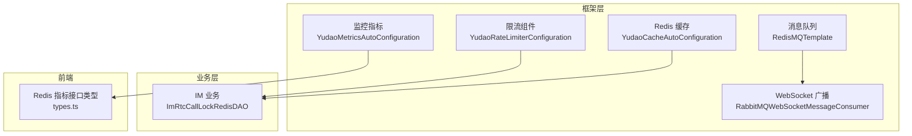
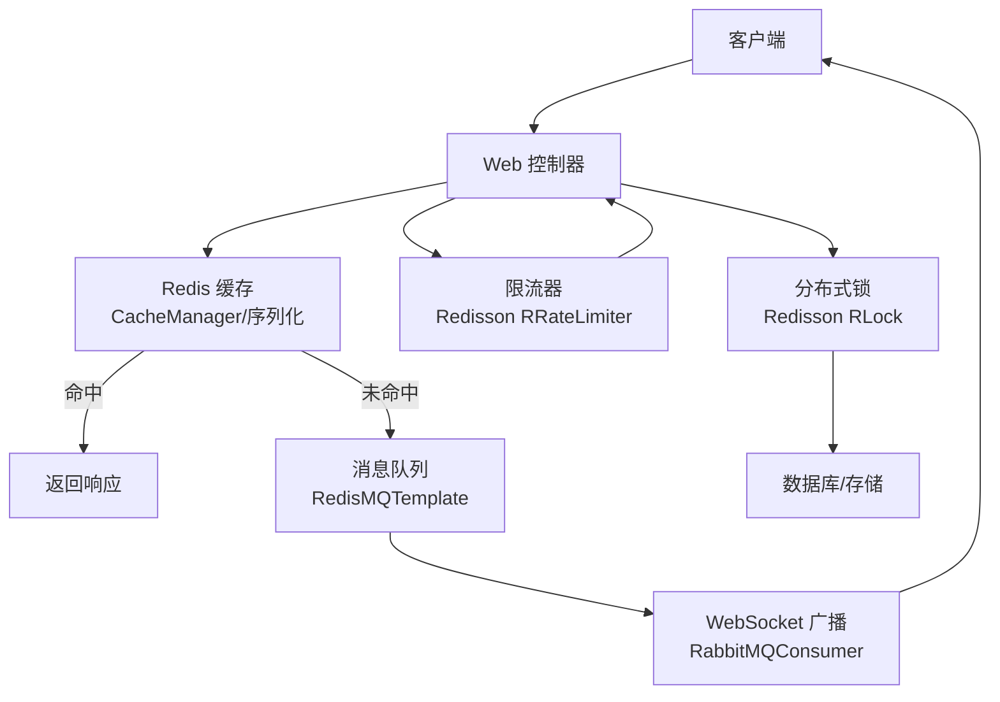
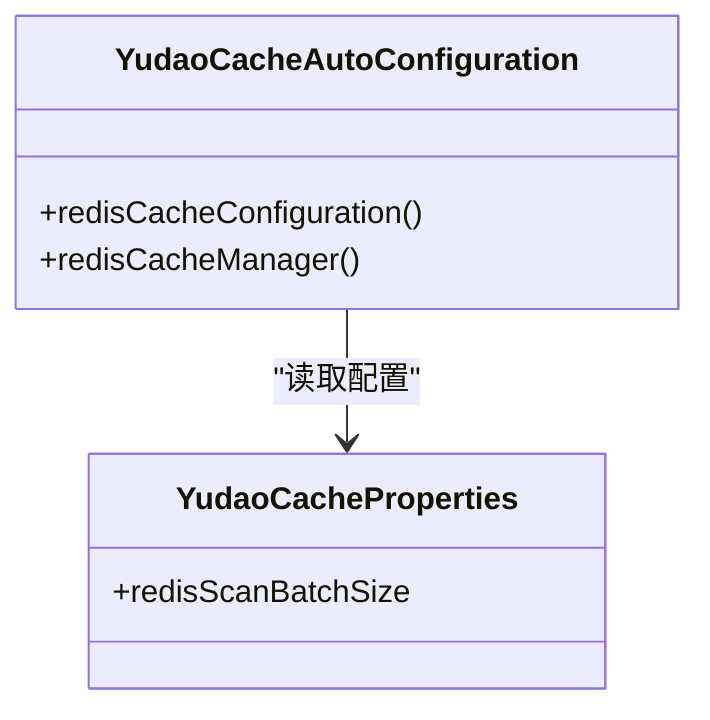
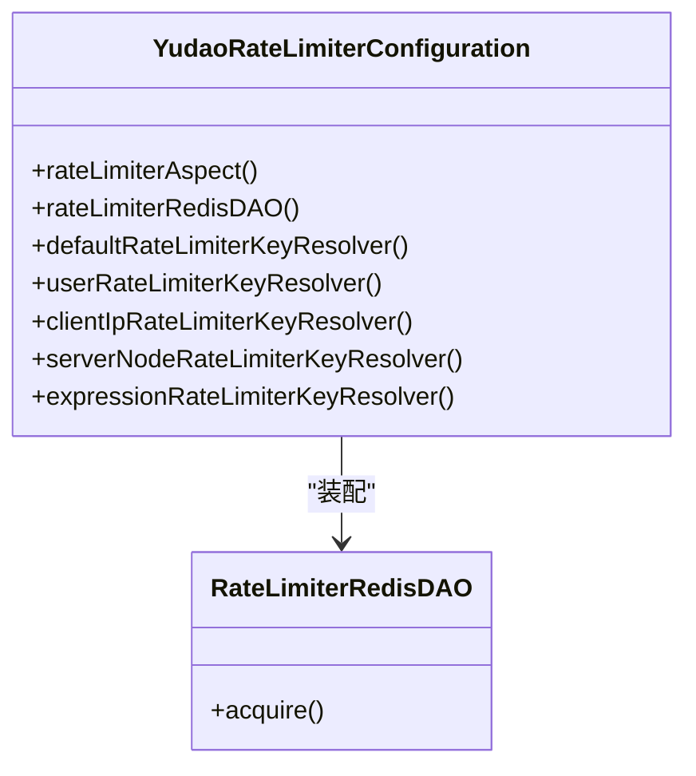
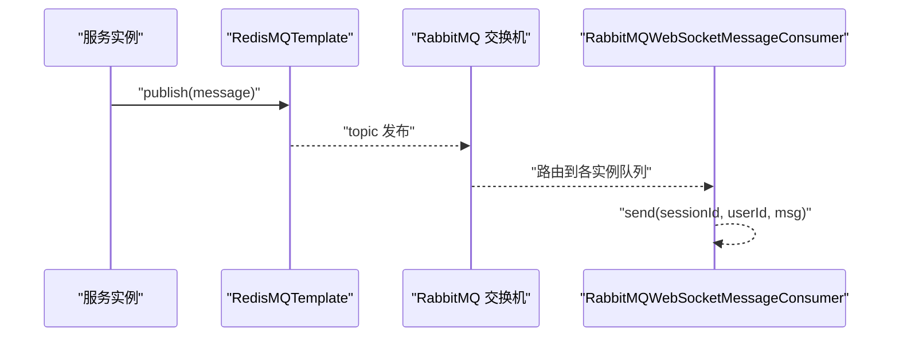
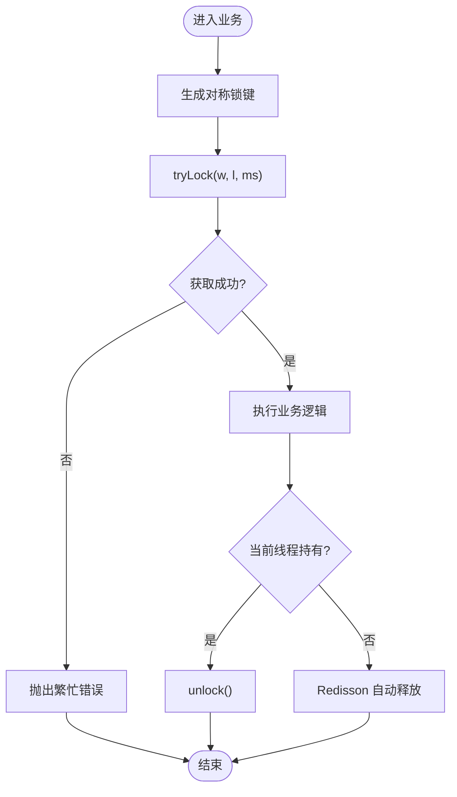
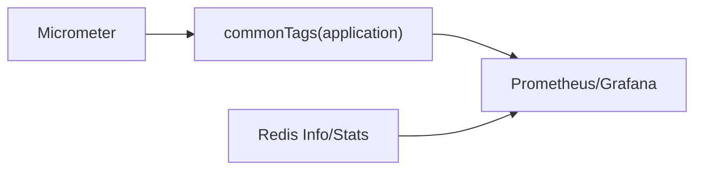
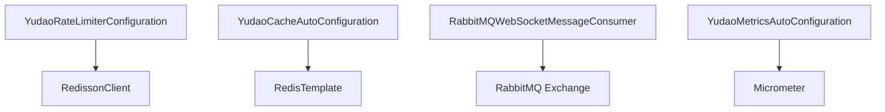

# 性能优化扩展

<cite>
**本文引用的文件**
- [YudaoCacheAutoConfiguration.java](file://yudao-framework/yudao-spring-boot-starter-redis/src/main/java/cn/iocoder/yudao/framework/redis/config/YudaoCacheAutoConfiguration.java)
- [YudaoCacheProperties.java](file://yudao-framework/yudao-spring-boot-starter-redis/src/main/java/cn/iocoder/yudao/framework/redis/config/YudaoCacheProperties.java)
- [YudaoRateLimiterConfiguration.java](file://yudao-framework/yudao-spring-boot-starter-protection/src/main/java/cn/iocoder/yudao/framework/ratelimiter/config/YudaoRateLimiterConfiguration.java)
- [RateLimiterRedisDAO.java](file://yudao-framework/yudao-spring-boot-starter-protection/src/main/java/cn/iocoder/yudao/framework/ratelimiter/core/redis/RateLimiterRedisDAO.java)
- [RedisMQTemplate.java](file://yudao-framework/yudao-spring-boot-starter-mq/src/main/java/cn/iocoder/yudao/framework/mq/redis/core/RedisMQTemplate.java)
- [RabbitMQWebSocketMessageConsumer.java](file://yudao-framework/yudao-spring-boot-starter-websocket/src/main/java/cn/iocoder/yudao/framework/websocket/core/sender/rabbitmq/RabbitMQWebSocketMessageConsumer.java)
- [ImRtcCallLockRedisDAO.java](file://yudao-module-im/src/main/java/cn/iocoder/yudao/module/im/dal/redis/rtc/ImRtcCallLockRedisDAO.java)
- [YudaoMetricsAutoConfiguration.java](file://yudao-framework/yudao-spring-boot-starter-monitor/src/main/java/cn/iocoder/yudao/framework/tracer/config/YudaoMetricsAutoConfiguration.java)
- [application-local.yaml](file://yudao-server/src/main/resources/application-local.yaml)
- [types.ts](file://yudao-ui/yudao-ui-admin-vue3/src/api/infra/redis/types.ts)
</cite>

## 目录
1. [引言](#引言)
2. [项目结构](#项目结构)
3. [核心组件](#核心组件)
4. [架构总览](#架构总览)
5. [详细组件分析](#详细组件分析)
6. [依赖关系分析](#依赖关系分析)
7. [性能考量](#性能考量)
8. [故障排查指南](#故障排查指南)
9. [结论](#结论)
10. [附录](#附录)

## 引言
本扩展文档聚焦于高并发场景下的性能优化，围绕缓存策略、数据库优化、异步处理、分布式锁与限流熔断等关键技术，结合芋道 Ruoyi-Vue-Pro 已有框架能力，给出可落地的优化方案与最佳实践。内容涵盖：
- 缓存优化：Redis 扩展使用、缓存穿透/雪崩防护、缓存一致性
- 流量控制：令牌桶/漏桶限流、Redisson 限流器、注解级限流切面
- 异步处理：消息队列与 WebSocket 广播的异步化
- 分布式锁：Redisson 锁、超时与幂等保障
- 监控与调优：指标采集、常见瓶颈定位与容量规划

## 项目结构
本项目采用多模块分层架构，性能优化相关的关键模块如下：
- yudao-framework：通用能力封装，包含 Redis 缓存、限流、消息队列、WebSocket、监控等
- yudao-module-*：业务模块，如 IM、系统、基础设施等，复用框架能力并进行业务优化
- yudao-ui：前端监控与运维界面，展示 Redis 指标与可视化图表

**图示来源**
- [YudaoCacheAutoConfiguration.java:37-84](file://yudao-framework/yudao-spring-boot-starter-redis/src/main/java/cn/iocoder/yudao/framework/redis/config/YudaoCacheAutoConfiguration.java#L37-L84)
- [YudaoRateLimiterConfiguration.java:14-55](file://yudao-framework/yudao-spring-boot-starter-protection/src/main/java/cn/iocoder/yudao/framework/ratelimiter/config/YudaoRateLimiterConfiguration.java#L14-L55)
- [RedisMQTemplate.java](file://yudao-framework/yudao-spring-boot-starter-mq/src/main/java/cn/iocoder/yudao/framework/mq/redis/core/RedisMQTemplate.java)
- [RabbitMQWebSocketMessageConsumer.java:12-39](file://yudao-framework/yudao-spring-boot-starter-websocket/src/main/java/cn/iocoder/yudao/framework/websocket/core/sender/rabbitmq/RabbitMQWebSocketMessageConsumer.java#L12-L39)
- [YudaoMetricsAutoConfiguration.java:16-27](file://yudao-framework/yudao-spring-boot-starter-monitor/src/main/java/cn/iocoder/yudao/framework/tracer/config/YudaoMetricsAutoConfiguration.java#L16-L27)
- [ImRtcCallLockRedisDAO.java:37-80](file://yudao-module-im/src/main/java/cn/iocoder/yudao/module/im/dal/redis/rtc/ImRtcCallLockRedisDAO.java#L37-L80)
- [types.ts:1-57](file://yudao-ui/yudao-ui-admin-vue3/src/api/infra/redis/types.ts#L1-L57)

**章节来源**
- [YudaoCacheAutoConfiguration.java:37-84](file://yudao-framework/yudao-spring-boot-starter-redis/src/main/java/cn/iocoder/yudao/framework/redis/config/YudaoCacheAutoConfiguration.java#L37-L84)
- [YudaoRateLimiterConfiguration.java:14-55](file://yudao-framework/yudao-spring-boot-starter-protection/src/main/java/cn/iocoder/yudao/framework/ratelimiter/config/YudaoRateLimiterConfiguration.java#L14-L55)
- [RedisMQTemplate.java](file://yudao-framework/yudao-spring-boot-starter-mq/src/main/java/cn/iocoder/yudao/framework/mq/redis/core/RedisMQTemplate.java)
- [RabbitMQWebSocketMessageConsumer.java:12-39](file://yudao-framework/yudao-spring-boot-starter-websocket/src/main/java/cn/iocoder/yudao/framework/websocket/core/sender/rabbitmq/RabbitMQWebSocketMessageConsumer.java#L12-L39)
- [YudaoMetricsAutoConfiguration.java:16-27](file://yudao-framework/yudao-spring-boot-starter-monitor/src/main/java/cn/iocoder/yudao/framework/tracer/config/YudaoMetricsAutoConfiguration.java#L16-L27)
- [ImRtcCallLockRedisDAO.java:37-80](file://yudao-module-im/src/main/java/cn/iocoder/yudao/module/im/dal/redis/rtc/ImRtcCallLockRedisDAO.java#L37-L80)
- [types.ts:1-57](file://yudao-ui/yudao-ui-admin-vue3/src/api/infra/redis/types.ts#L1-L57)

## 核心组件
- Redis 缓存管理：通过自定义 CacheManager 与序列化策略、扫描批大小、事务感知等提升缓存吞吐与一致性
- 限流组件：基于 Redisson 的限流器与切面，支持多种 KeyResolver，覆盖用户、IP、服务节点、SpEL 表达式
- 异步消息：Redis 消息模板与 RabbitMQ 广播消费者，实现跨实例消息分发
- 分布式锁：Redisson 锁封装，统一 tryLock/解锁语义与超时保护
- 监控指标：Micrometer 注册公共标签，便于多维度观测

**章节来源**
- [YudaoCacheAutoConfiguration.java:37-84](file://yudao-framework/yudao-spring-boot-starter-redis/src/main/java/cn/iocoder/yudao/framework/redis/config/YudaoCacheAutoConfiguration.java#L37-L84)
- [YudaoCacheProperties.java:12-27](file://yudao-framework/yudao-spring-boot-starter-redis/src/main/java/cn/iocoder/yudao/framework/redis/config/YudaoCacheProperties.java#L12-L27)
- [YudaoRateLimiterConfiguration.java:14-55](file://yudao-framework/yudao-spring-boot-starter-protection/src/main/java/cn/iocoder/yudao/framework/ratelimiter/config/YudaoRateLimiterConfiguration.java#L14-L55)
- [RateLimiterRedisDAO.java](file://yudao-framework/yudao-spring-boot-starter-protection/src/main/java/cn/iocoder/yudao/framework/ratelimiter/core/redis/RateLimiterRedisDAO.java)
- [RedisMQTemplate.java](file://yudao-framework/yudao-spring-boot-starter-mq/src/main/java/cn/iocoder/yudao/framework/mq/redis/core/RedisMQTemplate.java)
- [RabbitMQWebSocketMessageConsumer.java:12-39](file://yudao-framework/yudao-spring-boot-starter-websocket/src/main/java/cn/iocoder/yudao/framework/websocket/core/sender/rabbitmq/RabbitMQWebSocketMessageConsumer.java#L12-L39)
- [YudaoMetricsAutoConfiguration.java:16-27](file://yudao-framework/yudao-spring-boot-starter-monitor/src/main/java/cn/iocoder/yudao/framework/tracer/config/YudaoMetricsAutoConfiguration.java#L16-L27)

## 架构总览
下图展示了高并发场景下的关键路径：请求进入 Web 层后，优先命中缓存；若未命中则异步落库或触发消息队列；同时通过限流器与分布式锁保障资源安全与一致性。

**图示来源**
- [YudaoCacheAutoConfiguration.java:37-84](file://yudao-framework/yudao-spring-boot-starter-redis/src/main/java/cn/iocoder/yudao/framework/redis/config/YudaoCacheAutoConfiguration.java#L37-L84)
- [YudaoRateLimiterConfiguration.java:14-55](file://yudao-framework/yudao-spring-boot-starter-protection/src/main/java/cn/iocoder/yudao/framework/ratelimiter/config/YudaoRateLimiterConfiguration.java#L14-L55)
- [RedisMQTemplate.java](file://yudao-framework/yudao-spring-boot-starter-mq/src/main/java/cn/iocoder/yudao/framework/mq/redis/core/RedisMQTemplate.java)
- [RabbitMQWebSocketMessageConsumer.java:12-39](file://yudao-framework/yudao-spring-boot-starter-websocket/src/main/java/cn/iocoder/yudao/framework/websocket/core/sender/rabbitmq/RabbitMQWebSocketMessageConsumer.java#L12-L39)
- [ImRtcCallLockRedisDAO.java:37-80](file://yudao-module-im/src/main/java/cn/iocoder/yudao/module/im/dal/redis/rtc/ImRtcCallLockRedisDAO.java#L37-L80)

## 详细组件分析

### 缓存策略与优化
- 自定义 CacheManager：启用事务感知，确保事务提交后再清理/更新缓存，避免脏读
- 序列化策略：统一 JSON 序列化，减少键前缀与 TTL 配置
- 扫描批大小：通过配置项控制 SCAN 批量大小，降低大 Key 场景的阻塞风险
- 空值缓存：可配置禁用空值缓存，避免缓存穿透

**图示来源**
- [YudaoCacheAutoConfiguration.java:37-84](file://yudao-framework/yudao-spring-boot-starter-redis/src/main/java/cn/iocoder/yudao/framework/redis/config/YudaoCacheAutoConfiguration.java#L37-L84)
- [YudaoCacheProperties.java:12-27](file://yudao-framework/yudao-spring-boot-starter-redis/src/main/java/cn/iocoder/yudao/framework/redis/config/YudaoCacheProperties.java#L12-L27)

**章节来源**
- [YudaoCacheAutoConfiguration.java:37-84](file://yudao-framework/yudao-spring-boot-starter-redis/src/main/java/cn/iocoder/yudao/framework/redis/config/YudaoCacheAutoConfiguration.java#L37-L84)
- [YudaoCacheProperties.java:12-27](file://yudao-framework/yudao-spring-boot-starter-redis/src/main/java/cn/iocoder/yudao/framework/redis/config/YudaoCacheProperties.java#L12-L27)

### 缓存穿透、缓存雪崩与一致性
- 缓存穿透：利用“空值缓存”与唯一索引约束，结合限流与布隆过滤器（建议）降低无效查询
- 缓存雪崩：差异化过期时间、热点 Key 热备、异步加载与互斥更新
- 缓存不一致：事务感知缓存管理器、失效策略与最终一致性设计

**章节来源**
- [YudaoCacheAutoConfiguration.java:76-82](file://yudao-framework/yudao-spring-boot-starter-redis/src/main/java/cn/iocoder/yudao/framework/redis/config/YudaoCacheAutoConfiguration.java#L76-L82)

### 限流与熔断
- 限流器：基于 Redisson RRateLimiter，支持速率与突发配额
- 切面：通过注解拦截，结合多种 KeyResolver（默认、用户、客户端 IP、服务节点、SpEL）
- 熔断：建议引入 Hystrix 或 Resilience4j（在现有 Redisson 限流基础上叠加）

**图示来源**
- [YudaoRateLimiterConfiguration.java:14-55](file://yudao-framework/yudao-spring-boot-starter-protection/src/main/java/cn/iocoder/yudao/framework/ratelimiter/config/YudaoRateLimiterConfiguration.java#L14-L55)
- [RateLimiterRedisDAO.java](file://yudao-framework/yudao-spring-boot-starter-protection/src/main/java/cn/iocoder/yudao/framework/ratelimiter/core/redis/RateLimiterRedisDAO.java)

**章节来源**
- [YudaoRateLimiterConfiguration.java:14-55](file://yudao-framework/yudao-spring-boot-starter-protection/src/main/java/cn/iocoder/yudao/framework/ratelimiter/config/YudaoRateLimiterConfiguration.java#L14-L55)
- [RateLimiterRedisDAO.java](file://yudao-framework/yudao-spring-boot-starter-protection/src/main/java/cn/iocoder/yudao/framework/ratelimiter/core/redis/RateLimiterRedisDAO.java)

### 异步处理与广播
- Redis 消息：统一模板封装发布/订阅，降低耦合
- RabbitMQ 广播：消费者队列随机后缀实现广播消费，按 Topic 交换路由

**图示来源**
- [RedisMQTemplate.java](file://yudao-framework/yudao-spring-boot-starter-mq/src/main/java/cn/iocoder/yudao/framework/mq/redis/core/RedisMQTemplate.java)
- [RabbitMQWebSocketMessageConsumer.java:12-39](file://yudao-framework/yudao-spring-boot-starter-websocket/src/main/java/cn/iocoder/yudao/framework/websocket/core/sender/rabbitmq/RabbitMQWebSocketMessageConsumer.java#L12-L39)

**章节来源**
- [RedisMQTemplate.java](file://yudao-framework/yudao-spring-boot-starter-mq/src/main/java/cn/iocoder/yudao/framework/mq/redis/core/RedisMQTemplate.java)
- [RabbitMQWebSocketMessageConsumer.java:12-39](file://yudao-framework/yudao-spring-boot-starter-websocket/src/main/java/cn/iocoder/yudao/framework/websocket/core/sender/rabbitmq/RabbitMQWebSocketMessageConsumer.java#L12-L39)

### 分布式锁
- Redisson 锁：统一 tryLock(wait, lease, unit)，自动续期与异常兜底
- 业务锁：私聊/群聊通话邀请串行化，避免并发冲突

**图示来源**
- [ImRtcCallLockRedisDAO.java:37-80](file://yudao-module-im/src/main/java/cn/iocoder/yudao/module/im/dal/redis/rtc/ImRtcCallLockRedisDAO.java#L37-L80)

**章节来源**
- [ImRtcCallLockRedisDAO.java:37-80](file://yudao-module-im/src/main/java/cn/iocoder/yudao/module/im/dal/redis/rtc/ImRtcCallLockRedisDAO.java#L37-L80)

### 监控与可观测性
- 指标注册：公共标签 application=应用名，便于多实例对比
- Redis 指标：前端 types.ts 定义 Redis 监控信息结构，用于展示关键指标

**图示来源**
- [YudaoMetricsAutoConfiguration.java:16-27](file://yudao-framework/yudao-spring-boot-starter-monitor/src/main/java/cn/iocoder/yudao/framework/tracer/config/YudaoMetricsAutoConfiguration.java#L16-L27)
- [types.ts:1-57](file://yudao-ui/yudao-ui-admin-vue3/src/api/infra/redis/types.ts#L1-L57)

**章节来源**
- [YudaoMetricsAutoConfiguration.java:16-27](file://yudao-framework/yudao-spring-boot-starter-monitor/src/main/java/cn/iocoder/yudao/framework/tracer/config/YudaoMetricsAutoConfiguration.java#L16-L27)
- [types.ts:1-57](file://yudao-ui/yudao-ui-admin-vue3/src/api/infra/redis/types.ts#L1-L57)

## 依赖关系分析
- 限流组件依赖 Redisson 与 Redis 自动配置
- 缓存管理器依赖 RedisTemplate 与自定义配置
- WebSocket 广播依赖 RabbitMQ 交换机与消费者
- 监控依赖 Micrometer 与 Actuator

**图示来源**
- [YudaoRateLimiterConfiguration.java:14-26](file://yudao-framework/yudao-spring-boot-starter-protection/src/main/java/cn/iocoder/yudao/framework/ratelimiter/config/YudaoRateLimiterConfiguration.java#L14-L26)
- [YudaoCacheAutoConfiguration.java:71-84](file://yudao-framework/yudao-spring-boot-starter-redis/src/main/java/cn/iocoder/yudao/framework/redis/config/YudaoCacheAutoConfiguration.java#L71-L84)
- [RabbitMQWebSocketMessageConsumer.java:12-25](file://yudao-framework/yudao-spring-boot-starter-websocket/src/main/java/cn/iocoder/yudao/framework/websocket/core/sender/rabbitmq/RabbitMQWebSocketMessageConsumer.java#L12-L25)
- [YudaoMetricsAutoConfiguration.java:16-27](file://yudao-framework/yudao-spring-boot-starter-monitor/src/main/java/cn/iocoder/yudao/framework/tracer/config/YudaoMetricsAutoConfiguration.java#L16-L27)

**章节来源**
- [YudaoRateLimiterConfiguration.java:14-26](file://yudao-framework/yudao-spring-boot-starter-protection/src/main/java/cn/iocoder/yudao/framework/ratelimiter/config/YudaoRateLimiterConfiguration.java#L14-L26)
- [YudaoCacheAutoConfiguration.java:71-84](file://yudao-framework/yudao-spring-boot-starter-redis/src/main/java/cn/iocoder/yudao/framework/redis/config/YudaoCacheAutoConfiguration.java#L71-L84)
- [RabbitMQWebSocketMessageConsumer.java:12-25](file://yudao-framework/yudao-spring-boot-starter-websocket/src/main/java/cn/iocoder/yudao/framework/websocket/core/sender/rabbitmq/RabbitMQWebSocketMessageConsumer.java#L12-L25)
- [YudaoMetricsAutoConfiguration.java:16-27](file://yudao-framework/yudao-spring-boot-starter-monitor/src/main/java/cn/iocoder/yudao/framework/tracer/config/YudaoMetricsAutoConfiguration.java#L16-L27)

## 性能考量
- 缓存层
  - 合理设置 TTL 与差异化过期，避免集中过期
  - 使用事务感知缓存管理器，减少脏读
  - 控制 SCAN 批大小，避免大 Key 导致阻塞
- 限流与削峰
  - 结合用户/IP 维度限流，防止恶意刷量
  - 对热点接口叠加本地缓存与异步降级
- 异步化
  - 将非关键路径异步化，降低主流程延迟
  - 使用广播队列实现跨实例消息分发
- 分布式锁
  - 明确锁粒度与超时时间，避免死锁与抖动
  - 业务逻辑短小、幂等性强，减少锁持有时间
- 监控
  - 采集 QPS、P99、错误率、缓存命中率、队列长度、Redis 内存与 CPU
  - 建立告警阈值与容量基线，定期压测与容量规划

[本节为通用指导，无需列出具体文件来源]

## 故障排查指南
- 缓存未命中/穿透
  - 检查空值缓存开关与 TTL 设置
  - 核对键前缀与序列化策略
- 限流频繁拒绝
  - 调整速率参数与 KeyResolver 维度
  - 观察 Redisson 限流器统计与业务峰值
- 广播未送达
  - 检查队列名称后缀与交换机绑定
  - 核对消费者是否正常拉取
- 分布式锁失败
  - 查看等待时间与租约时间配置
  - 确认业务执行耗时未超过租约
- 指标缺失
  - 确认 Micrometer 开关与 commonTags 注册
  - 校验前端 types.ts 字段与实际 Redis 返回字段映射

**章节来源**
- [YudaoCacheAutoConfiguration.java:56-67](file://yudao-framework/yudao-spring-boot-starter-redis/src/main/java/cn/iocoder/yudao/framework/redis/config/YudaoCacheAutoConfiguration.java#L56-L67)
- [YudaoRateLimiterConfiguration.java:18-26](file://yudao-framework/yudao-spring-boot-starter-protection/src/main/java/cn/iocoder/yudao/framework/ratelimiter/config/YudaoRateLimiterConfiguration.java#L18-L26)
- [RabbitMQWebSocketMessageConsumer.java:12-39](file://yudao-framework/yudao-spring-boot-starter-websocket/src/main/java/cn/iocoder/yudao/framework/websocket/core/sender/rabbitmq/RabbitMQWebSocketMessageConsumer.java#L12-L39)
- [ImRtcCallLockRedisDAO.java:62-78](file://yudao-module-im/src/main/java/cn/iocoder/yudao/module/im/dal/redis/rtc/ImRtcCallLockRedisDAO.java#L62-L78)
- [YudaoMetricsAutoConfiguration.java:21-25](file://yudao-framework/yudao-spring-boot-starter-monitor/src/main/java/cn/iocoder/yudao/framework/tracer/config/YudaoMetricsAutoConfiguration.java#L21-L25)
- [types.ts:1-57](file://yudao-ui/yudao-ui-admin-vue3/src/api/infra/redis/types.ts#L1-L57)

## 结论
通过 Redis 缓存、限流、异步消息与分布式锁的协同，结合完善的监控体系，可在高并发场景下显著提升系统吞吐与稳定性。建议在生产环境中持续压测、观察关键指标，并根据业务特征动态调整缓存策略、限流参数与锁粒度。

[本节为总结性内容，无需列出具体文件来源]

## 附录
- 配置参考
  - Quartz 线程池大小与集群配置
  - Redis 缓存扫描批大小

**章节来源**
- [application-local.yaml:92-115](file://yudao-server/src/main/resources/application-local.yaml#L92-L115)
- [YudaoCacheProperties.java:12-27](file://yudao-framework/yudao-spring-boot-starter-redis/src/main/java/cn/iocoder/yudao/framework/redis/config/YudaoCacheProperties.java#L12-L27)