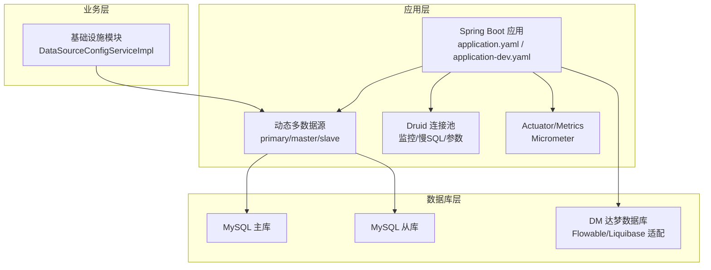
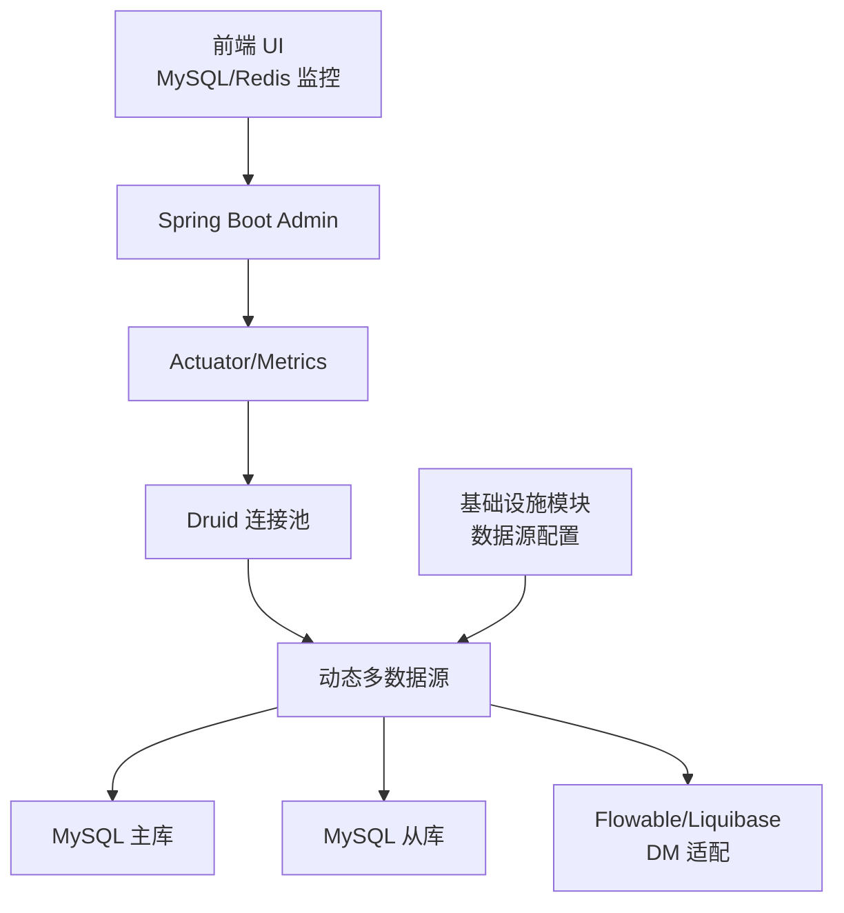
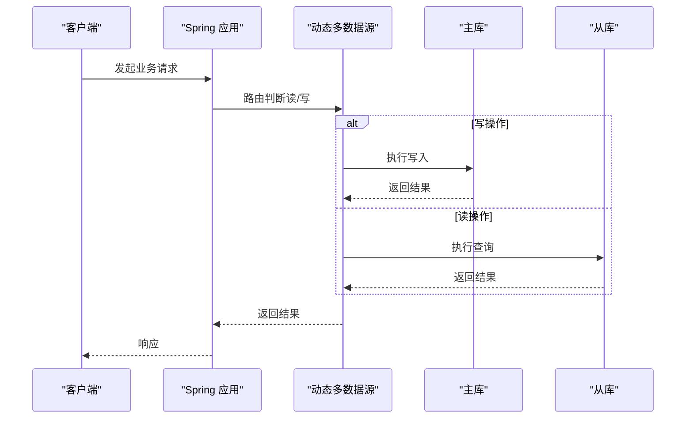
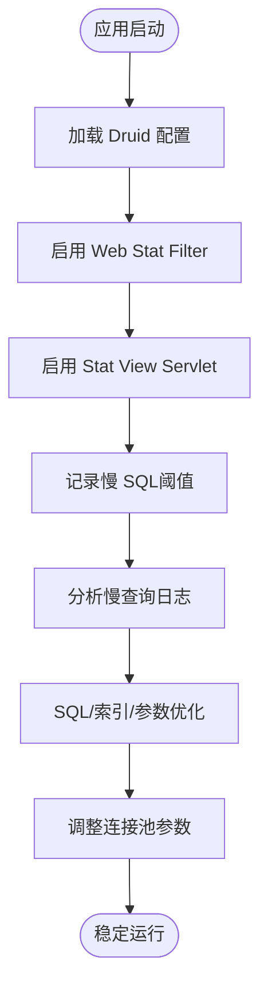
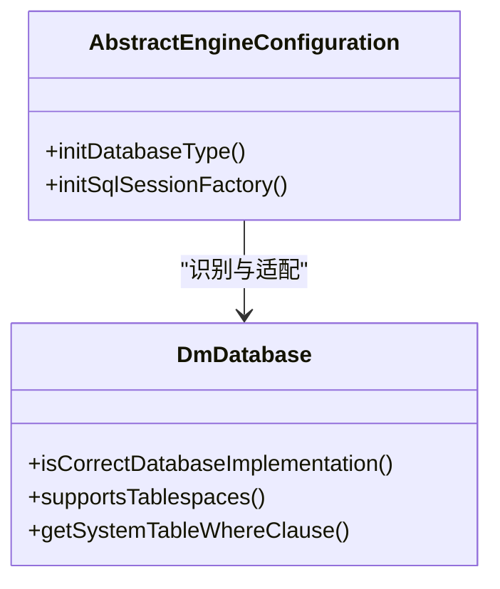
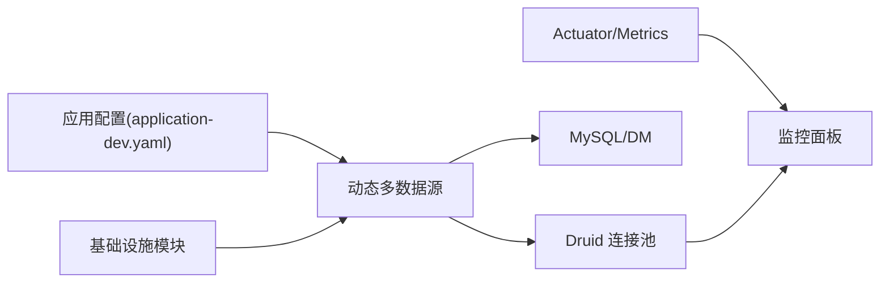

# 数据库性能优化

<cite>
**本文引用的文件**
- [application.yaml](file://yudao-server/src/main/resources/application.yaml)
- [application-dev.yaml](file://yudao-server/src/main/resources/application-dev.yaml)
- [DataSourceConfigServiceImpl.java](file://yudao-module-infra/src/main/java/cn/iocoder/yudao/module/infra/service/db/DataSourceConfigServiceImpl.java)
- [AbstractEngineConfiguration.java](file://sql/dm/flowable-patch/src/main/java/org/flowable/common/engine/impl/AbstractEngineConfiguration.java)
- [DmDatabase.java](file://sql/dm/flowable-patch/src/main/java/liquibase/database/core/DmDatabase.java)
- [YudaoMetricsAutoConfiguration.java](file://yudao-framework/yudao-spring-boot-starter-monitor/src/main/java/cn/iocoder/yudao/framework/tracer/config/YudaoMetricsAutoConfiguration.java)
- [docker.env](file://script/docker/docker.env)
- [README.md（项目说明）](file://README.md)
- [README.md（前端UI说明）](file://yudao-ui/yudao-ui-admin-vue3/README.md)
</cite>

## 目录
1. [简介](#简介)
2. [项目结构与数据库相关配置概览](#项目结构与数据库相关配置概览)
3. [核心组件与优化要点](#核心组件与优化要点)
4. [架构总览](#架构总览)
5. [详细组件分析](#详细组件分析)
6. [依赖关系分析](#依赖关系分析)
7. [性能考量与最佳实践](#性能考量与最佳实践)
8. [故障排查指南](#故障排查指南)
9. [结论](#结论)
10. [附录：配置模板与优化示例](#附录配置模板与优化示例)

## 简介
本文件面向芋道 Ruoyi-Vue-Pro 项目，系统化梳理数据库性能优化方案，覆盖索引与查询优化、连接池优化、读写分离、慢查询分析与优化、监控与调优、以及可落地的配置模板与示例。文档结合项目现有配置（如 Druid 连接池、动态多数据源、Actuator/Micrometer 监控等）给出可操作的优化建议，并提供可视化图示帮助理解。

## 项目结构与数据库相关配置概览
- 应用层配置
  - 主应用配置集中于 application.yaml 与 application-dev.yaml，其中包含数据源、动态多数据源、Druid 监控、Quartz 存储、Actuator/Micrometer 监控等关键节点。
- 业务层能力
  - 基础设施模块提供数据源配置的持久化与校验，确保连接可用性与主从配置补充。
- 数据库兼容与适配
  - 通过 Flowable 与 Liquibase 的适配类，支持 DM 达梦数据库类型识别与特性处理，便于在不同数据库上统一行为。
- 监控与可观测性
  - 通过 Micrometer + Actuator 暴露指标，结合 Druid 控制台与前端 UI 的“MySQL 监控/Redis 监控”能力，形成端到端的数据库健康观测。

图表来源
- [application.yaml:1-354](file://yudao-server/src/main/resources/application.yaml#L1-L354)
- [application-dev.yaml:1-212](file://yudao-server/src/main/resources/application-dev.yaml#L1-L212)
- [DataSourceConfigServiceImpl.java:1-111](file://yudao-module-infra/src/main/java/cn/iocoder/yudao/module/infra/service/db/DataSourceConfigServiceImpl.java#L1-L111)
- [AbstractEngineConfiguration.java:367-551](file://sql/dm/flowable-patch/src/main/java/org/flowable/common/engine/impl/AbstractEngineConfiguration.java#L367-L551)
- [DmDatabase.java:41-175](file://sql/dm/flowable-patch/src/main/java/liquibase/database/core/DmDatabase.java#L41-L175)

章节来源
- [application.yaml:1-354](file://yudao-server/src/main/resources/application.yaml#L1-L354)
- [application-dev.yaml:1-212](file://yudao-server/src/main/resources/application-dev.yaml#L1-L212)
- [DataSourceConfigServiceImpl.java:1-111](file://yudao-module-infra/src/main/java/cn/iocoder/yudao/module/infra/service/db/DataSourceConfigServiceImpl.java#L1-L111)
- [AbstractEngineConfiguration.java:367-551](file://sql/dm/flowable-patch/src/main/java/org/flowable/common/engine/impl/AbstractEngineConfiguration.java#L367-L551)
- [DmDatabase.java:41-175](file://sql/dm/flowable-patch/src/main/java/liquibase/database/core/DmDatabase.java#L41-L175)

## 核心组件与优化要点
- 动态多数据源与读写分离
  - 通过 application-dev.yaml 的 dynamic.datasource 配置主从库，配合主库作为 primary，从库按需懒加载，实现读写分离与负载分散。
- Druid 连接池与慢查询
  - application-dev.yaml 中 druid.web-stat-filter、stat-view-servlet、stat.filter.stat 等开启慢 SQL 记录与控制台监控，slow-sql-millis 设定阈值，merge-sql 合并统计，便于定位慢查询。
- 查询优化与索引建议
  - 基于慢查询日志与执行计划，优先为高频过滤字段、排序字段、关联字段建立合适索引；避免 select *、函数包裹在索引列上、隐式转换等导致索引失效。
- 连接池参数优化
  - 初始连接数、最小空闲、最大活跃、最大等待、空闲回收周期、预编译缓存等参数应结合 QPS、并发度与事务时长调整，防止连接池耗尽或资源浪费。
- 监控与告警
  - Actuator 暴露端点，Micrometer 注入通用标签，Druid 控制台展示连接池状态与慢 SQL；前端 UI 提供“MySQL 监控/Redis 监控”，辅助运维侧观察。
- 数据库兼容与适配
  - Flowable/Liquibase 对 DM 达梦的类型识别与系统表过滤，确保在多数据库环境下一致的迁移与运行行为。

章节来源
- [application-dev.yaml:13-58](file://yudao-server/src/main/resources/application-dev.yaml#L13-L58)
- [application.yaml:125-150](file://yudao-server/src/main/resources/application.yaml#L125-L150)
- [YudaoMetricsAutoConfiguration.java:1-27](file://yudao-framework/yudao-spring-boot-starter-monitor/src/main/java/cn/iocoder/yudao/framework/tracer/config/YudaoMetricsAutoConfiguration.java#L1-L27)
- [README.md（项目说明）:214-215](file://README.md#L214-L215)
- [README.md（前端UI说明）:182-183](file://yudao-ui/yudao-ui-admin-vue3/README.md#L182-L183)

## 架构总览
下图展示数据库层在系统中的位置与交互：应用层通过动态多数据源路由到主/从库，Druid 提供连接池与慢 SQL 监控，Actuator/Metrics 暴露指标，基础设施模块负责数据源配置的持久化与校验，Flowable/Liquibase 适配 DM 达梦。

图表来源
- [application-dev.yaml:13-58](file://yudao-server/src/main/resources/application-dev.yaml#L13-L58)
- [application.yaml:125-150](file://yudao-server/src/main/resources/application.yaml#L125-L150)
- [YudaoMetricsAutoConfiguration.java:1-27](file://yudao-framework/yudao-spring-boot-starter-monitor/src/main/java/cn/iocoder/yudao/framework/tracer/config/YudaoMetricsAutoConfiguration.java#L1-L27)
- [DataSourceConfigServiceImpl.java:1-111](file://yudao-module-infra/src/main/java/cn/iocoder/yudao/module/infra/service/db/DataSourceConfigServiceImpl.java#L1-L111)
- [AbstractEngineConfiguration.java:367-551](file://sql/dm/flowable-patch/src/main/java/org/flowable/common/engine/impl/AbstractEngineConfiguration.java#L367-L551)
- [DmDatabase.java:41-175](file://sql/dm/flowable-patch/src/main/java/liquibase/database/core/DmDatabase.java#L41-L175)

## 详细组件分析

### 组件A：动态多数据源与读写分离
- 能力概述
  - 通过 primary 指定主库，master/slave 定义主从库；从库支持懒加载，减少启动时延。
  - 基础设施模块提供数据源配置的持久化、校验与主库补充，确保运行时可用。
- 优化要点
  - 明确读写路由规则（注解/策略），避免脏读；在从库延迟可控的前提下提升读扩展。
  - 主从一致性：写入后读取尽量走主库，或在强一致场景引入短事务与重试策略。

图表来源
- [application-dev.yaml:47-57](file://yudao-server/src/main/resources/application-dev.yaml#L47-L57)
- [DataSourceConfigServiceImpl.java:77-111](file://yudao-module-infra/src/main/java/cn/iocoder/yudao/module/infra/service/db/DataSourceConfigServiceImpl.java#L77-L111)

章节来源
- [application-dev.yaml:47-57](file://yudao-server/src/main/resources/application-dev.yaml#L47-L57)
- [DataSourceConfigServiceImpl.java:77-111](file://yudao-module-infra/src/main/java/cn/iocoder/yudao/module/infra/service/db/DataSourceConfigServiceImpl.java#L77-L111)

### 组件B：Druid 连接池与慢查询监控
- 能力概述
  - 开启 Druid Web Stat Filter、Stat View Servlet，记录慢 SQL 并设定阈值；合并统计便于聚合分析。
- 优化要点
  - 结合慢查询日志与执行计划，定位热点 SQL；优化参数绑定、减少 N+1、拆分复杂查询。
  - 合理设置连接池参数，避免超时与抖动；开启预编译缓存降低解析成本。

图表来源
- [application-dev.yaml:13-47](file://yudao-server/src/main/resources/application-dev.yaml#L13-L47)

章节来源
- [application-dev.yaml:13-47](file://yudao-server/src/main/resources/application-dev.yaml#L13-L47)

### 组件C：数据库兼容与适配（DM 达梦）
- 能力概述
  - Flowable 通过数据库产品名映射识别 DM；Liquibase 的 DmDatabase 提供系统表过滤与特性支持。
- 优化要点
  - 在多数据库环境下统一迁移与运行行为；针对 DM 的约束、序列、函数等差异进行适配。

图表来源
- [AbstractEngineConfiguration.java:367-551](file://sql/dm/flowable-patch/src/main/java/org/flowable/common/engine/impl/AbstractEngineConfiguration.java#L367-L551)
- [DmDatabase.java:41-175](file://sql/dm/flowable-patch/src/main/java/liquibase/database/core/DmDatabase.java#L41-L175)

章节来源
- [AbstractEngineConfiguration.java:367-551](file://sql/dm/flowable-patch/src/main/java/org/flowable/common/engine/impl/AbstractEngineConfiguration.java#L367-L551)
- [DmDatabase.java:41-175](file://sql/dm/flowable-patch/src/main/java/liquibase/database/core/DmDatabase.java#L41-L175)

## 依赖关系分析
- 组件耦合
  - 应用配置驱动动态多数据源与连接池；基础设施模块为数据源配置提供持久化与校验；监控组件暴露指标供运维观察。
- 外部依赖
  - MySQL/DM 达梦数据库；Redis（用于缓存与监控）；Actuator/Micrometer（指标体系）。
- 潜在风险
  - 从库延迟导致读到旧数据；连接池参数不当引发超时；慢 SQL 未及时治理造成放大效应。

图表来源
- [application-dev.yaml:13-58](file://yudao-server/src/main/resources/application-dev.yaml#L13-L58)
- [DataSourceConfigServiceImpl.java:1-111](file://yudao-module-infra/src/main/java/cn/iocoder/yudao/module/infra/service/db/DataSourceConfigServiceImpl.java#L1-L111)
- [YudaoMetricsAutoConfiguration.java:1-27](file://yudao-framework/yudao-spring-boot-starter-monitor/src/main/java/cn/iocoder/yudao/framework/tracer/config/YudaoMetricsAutoConfiguration.java#L1-L27)

章节来源
- [application-dev.yaml:13-58](file://yudao-server/src/main/resources/application-dev.yaml#L13-L58)
- [DataSourceConfigServiceImpl.java:1-111](file://yudao-module-infra/src/main/java/cn/iocoder/yudao/module/infra/service/db/DataSourceConfigServiceImpl.java#L1-L111)
- [YudaoMetricsAutoConfiguration.java:1-27](file://yudao-framework/yudao-spring-boot-starter-monitor/src/main/java/cn/iocoder/yudao/framework/tracer/config/YudaoMetricsAutoConfiguration.java#L1-L27)

## 性能考量与最佳实践
- 索引优化
  - 高频过滤/排序/关联字段建立复合索引；避免在索引列使用函数或隐式转换；定期评估索引选择性与回表成本。
- 查询优化
  - 减少全表扫描与大结果集；拆分复杂查询、使用分页与延迟加载；避免不必要的 distinct 与子查询。
- 连接池优化
  - 初始连接数与最小空闲应满足峰值并发；最大活跃与等待时间根据事务时长与超时策略平衡；开启预编译缓存与合理设置每连接缓存上限。
- 读写分离
  - 明确读写路由策略；写后读强制走主库；在可接受范围内提升从库读扩展；关注主从延迟与一致性。
- 慢查询治理
  - 基于 Druid 控制台与慢 SQL 日志，结合执行计划定位热点；优先优化 TOP-N SQL，持续回归。
- 监控与容量规划
  - 通过 Actuator/Metrics 观察连接池利用率、SQL 执行时延与错误率；结合业务增长趋势进行容量规划与扩容。

## 故障排查指南
- 连接池耗尽/超时
  - 检查最大活跃与最大等待；核对慢 SQL 与长事务；评估连接泄漏与未释放资源。
- 读到旧数据
  - 确认读写路由策略；检查主从延迟；必要时写后读强制主库。
- 指标异常
  - 通过 Actuator 暴露端点与 Micrometer 通用标签定位异常；结合 Druid 控制台与前端“MySQL 监控”核对连接池与慢 SQL。
- 数据库兼容问题
  - 核对 Flowable/Liquibase 的数据库类型识别与 DM 适配类；修正迁移脚本与函数差异。

章节来源
- [application-dev.yaml:13-58](file://yudao-server/src/main/resources/application-dev.yaml#L13-L58)
- [YudaoMetricsAutoConfiguration.java:1-27](file://yudao-framework/yudao-spring-boot-starter-monitor/src/main/java/cn/iocoder/yudao/framework/tracer/config/YudaoMetricsAutoConfiguration.java#L1-L27)
- [README.md（项目说明）:214-215](file://README.md#L214-L215)
- [README.md（前端UI说明）:182-183](file://yudao-ui/yudao-ui-admin-vue3/README.md#L182-L183)

## 结论
通过动态多数据源与读写分离、Druid 连接池与慢查询监控、完善的指标与可观测性，以及对 DM 达梦等数据库的适配，Ruoyi-Vue-Pro 已具备数据库性能优化的基础能力。建议在实际生产中持续进行慢 SQL 治理、索引与查询优化、连接池参数调优，并结合监控指标进行容量规划与应急处置，以构建稳定高效的数据库系统。

## 附录：配置模板与优化示例
- 应用配置（示例片段路径）
  - 动态多数据源与从库懒加载：[application-dev.yaml:47-57](file://yudao-server/src/main/resources/application-dev.yaml#L47-L57)
  - Druid 连接池与慢 SQL 阈值：[application-dev.yaml:13-47](file://yudao-server/src/main/resources/application-dev.yaml#L13-L47)
  - Actuator/Metrics 通用标签：[application.yaml:125-150](file://yudao-server/src/main/resources/application.yaml#L125-L150)、[YudaoMetricsAutoConfiguration.java:1-27](file://yudao-framework/yudao-spring-boot-starter-monitor/src/main/java/cn/iocoder/yudao/framework/tracer/config/YudaoMetricsAutoConfiguration.java#L1-L27)
  - 数据源配置持久化与校验：[DataSourceConfigServiceImpl.java:77-111](file://yudao-module-infra/src/main/java/cn/iocoder/yudao/module/infra/service/db/DataSourceConfigServiceImpl.java#L77-L111)
  - DM 达梦适配（类型识别与系统表过滤）：[AbstractEngineConfiguration.java:367-551](file://sql/dm/flowable-patch/src/main/java/org/flowable/common/engine/impl/AbstractEngineConfiguration.java#L367-L551)、[DmDatabase.java:41-175](file://sql/dm/flowable-patch/src/main/java/liquibase/database/core/DmDatabase.java#L41-L175)
  - Docker 环境变量（主从地址示例）：[docker.env:8-13](file://script/docker/docker.env#L8-L13)
- 优化示例（步骤说明）
  - 慢查询分析：开启 Druid 慢 SQL 记录，定位 TOP-N SQL，结合执行计划优化索引与查询。
  - 连接池调优：根据峰值 QPS 与事务时长，调整初始连接、最小空闲、最大活跃与等待时间。
  - 读写分离：明确路由策略，写后读走主库，从库读取延迟可控场景提升读扩展。
  - 监控与告警：启用 Actuator 端点与 Micrometer 指标，结合 Druid 控制台与前端“MySQL 监控”。

章节来源
- [application-dev.yaml:13-58](file://yudao-server/src/main/resources/application-dev.yaml#L13-L58)
- [application.yaml:125-150](file://yudao-server/src/main/resources/application.yaml#L125-L150)
- [YudaoMetricsAutoConfiguration.java:1-27](file://yudao-framework/yudao-spring-boot-starter-monitor/src/main/java/cn/iocoder/yudao/framework/tracer/config/YudaoMetricsAutoConfiguration.java#L1-L27)
- [DataSourceConfigServiceImpl.java:77-111](file://yudao-module-infra/src/main/java/cn/iocoder/yudao/module/infra/service/db/DataSourceConfigServiceImpl.java#L77-L111)
- [AbstractEngineConfiguration.java:367-551](file://sql/dm/flowable-patch/src/main/java/org/flowable/common/engine/impl/AbstractEngineConfiguration.java#L367-L551)
- [DmDatabase.java:41-175](file://sql/dm/flowable-patch/src/main/java/liquibase/database/core/DmDatabase.java#L41-L175)
- [docker.env:8-13](file://script/docker/docker.env#L8-L13)
- [README.md（项目说明）:214-215](file://README.md#L214-L215)
- [README.md（前端UI说明）:182-183](file://yudao-ui/yudao-ui-admin-vue3/README.md#L182-L183)