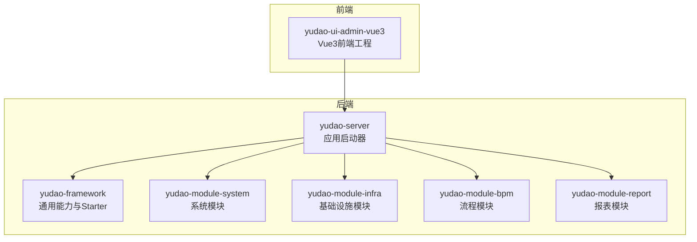
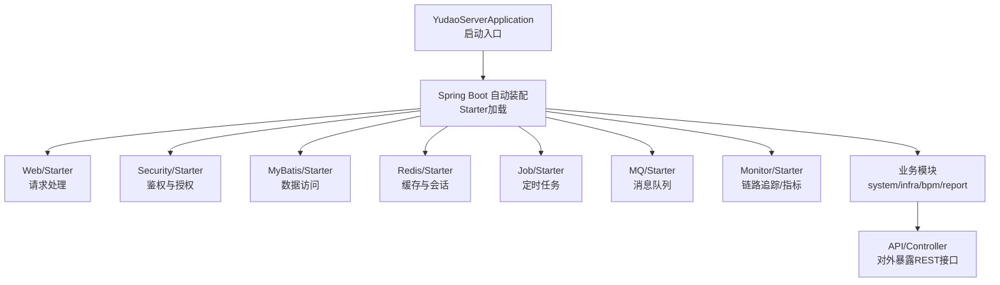
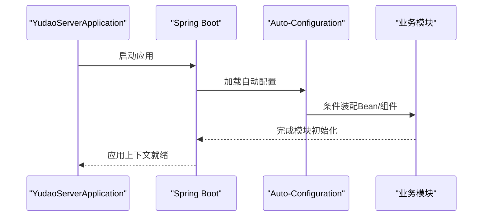
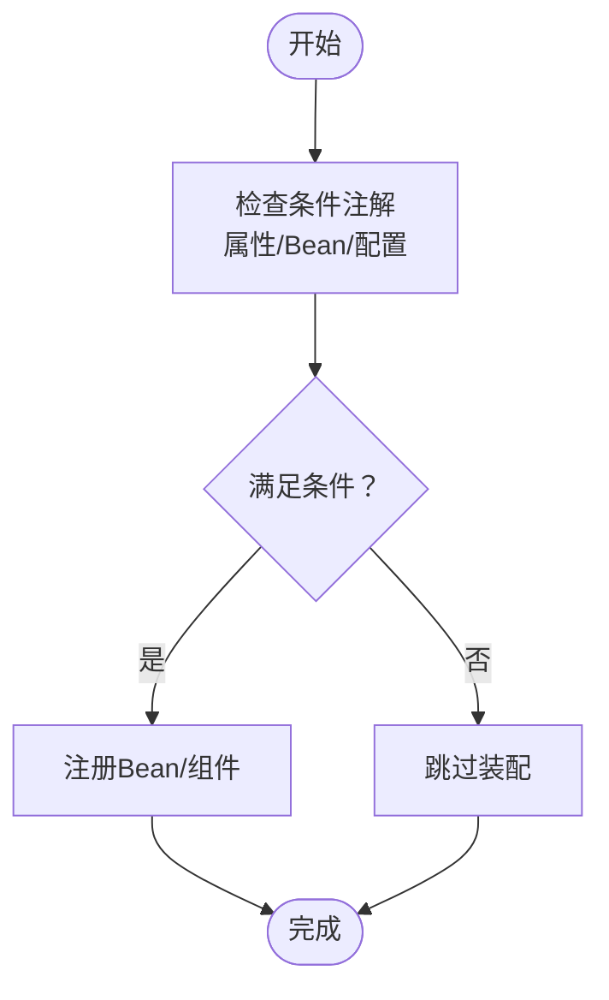
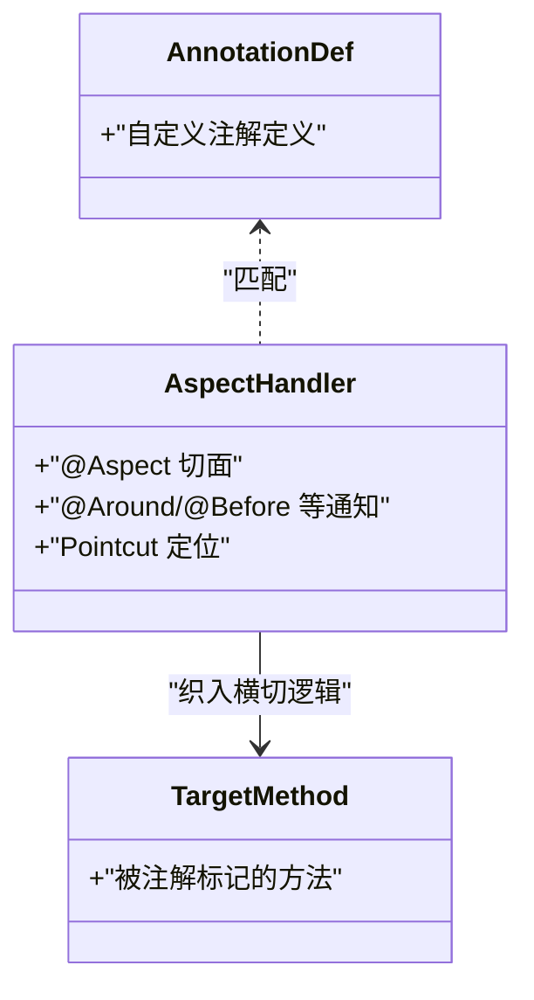
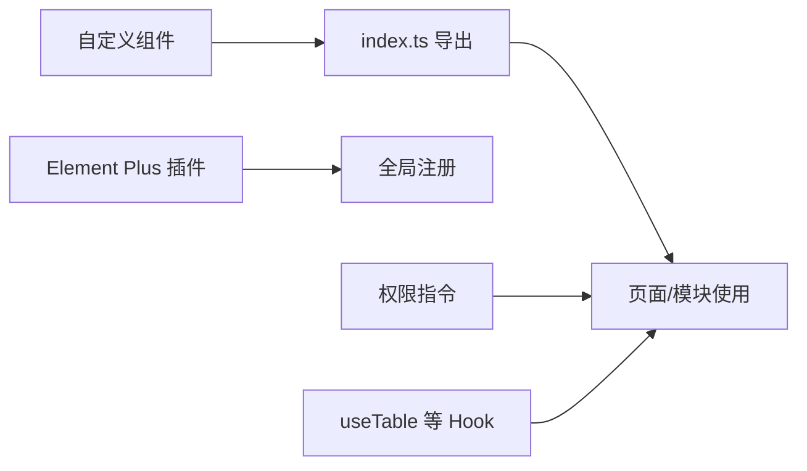
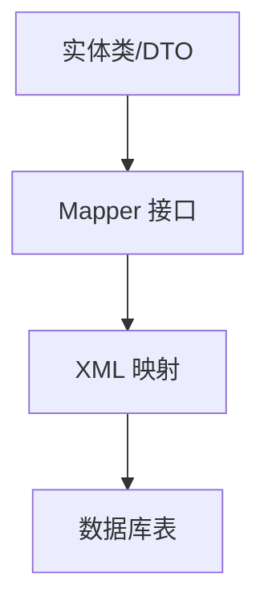
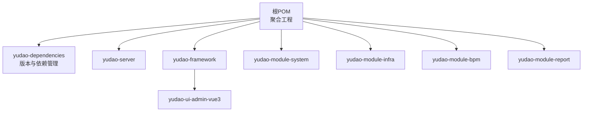

# 扩展开发

<cite>
**本文引用的文件**
- [YudaoServerApplication.java](file://yudao-server/src/main/java/cn/iocoder/yudao/server/YudaoServerApplication.java)
- [pom.xml](file://pom.xml)
- [yudao-framework/pom.xml](file://yudao-framework/pom.xml)
- [yudao-dependencies/pom.xml](file://yudao-dependencies/pom.xml)
- [yudao-framework/yudao-spring-boot-starter-web/pom.xml](file://yudao-framework/yudao-spring-boot-starter-web/pom.xml)
- [yudao-framework/yudao-spring-boot-starter-security/pom.xml](file://yudao-framework/yudao-spring-boot-starter-security/pom.xml)
- [yudao-framework/yudao-spring-boot-starter-mybatis/pom.xml](file://yudao-framework/yudao-spring-boot-starter-mybatis/pom.xml)
- [yudao-framework/yudao-spring-boot-starter-redis/pom.xml](file://yudao-framework/yudao-spring-boot-starter-redis/pom.xml)
- [yudao-framework/yudao-spring-boot-starter-job/pom.xml](file://yudao-framework/yudao-spring-boot-starter-job/pom.xml)
- [yudao-framework/yudao-spring-boot-starter-mq/pom.xml](file://yudao-framework/yudao-spring-boot-starter-mq/pom.xml)
- [yudao-framework/yudao-spring-boot-starter-monitor/pom.xml](file://yudao-framework/yudao-spring-boot-starter-monitor/pom.xml)
- [yudao-framework/yudao-spring-boot-starter-biz-data-permission/pom.xml](file://yudao-framework/yudao-spring-boot-starter-biz-data-permission/pom.xml)
- [yudao-framework/yudao-spring-boot-starter-biz-tenant/pom.xml](file://yudao-framework/yudao-spring-boot-starter-biz-tenant/pom.xml)
- [yudao-framework/yudao-spring-boot-starter-biz-ip/pom.xml](file://yudao-framework/yudao-spring-boot-starter-biz-ip/pom.xml)
- [yudao-framework/yudao-spring-boot-starter-excel/pom.xml](file://yudao-framework/yudao-spring-boot-starter-excel/pom.xml)
- [yudao-framework/yudao-spring-boot-starter-protection/pom.xml](file://yudao-framework/yudao-spring-boot-starter-protection/pom.xml)
- [yudao-framework/yudao-spring-boot-starter-websocket/pom.xml](file://yudao-framework/yudao-spring-boot-starter-websocket/pom.xml)
- [yudao-framework/yudao-spring-boot-starter-test/pom.xml](file://yudao-framework/yudao-spring-boot-starter-test/pom.xml)
- [yudao-module-system/pom.xml](file://yudao-module-system/pom.xml)
- [yudao-module-infra/pom.xml](file://yudao-module-infra/pom.xml)
- [yudao-module-bpm/pom.xml](file://yudao-module-bpm/pom.xml)
- [yudao-module-report/pom.xml](file://yudao-module-report/pom.xml)
- [yudao-ui-admin-vue3/package.json](file://yudao-ui/yudao-ui-admin-vue3/package.json)
- [yudao-ui-admin-vue3/vite.config.ts](file://yudao-ui/yudao-ui-admin-vue3/vite.config.ts)
- [yudao-ui-admin-vue3/src/main.ts](file://yudao-ui/yudao-ui-admin-vue3/src/main.ts)
- [yudao-ui-admin-vue3/src/router/index.ts](file://yudao-ui/yudao-ui-admin-vue3/src/router/index.ts)
- [yudao-ui-admin-vue3/src/store/index.ts](file://yudao-ui/yudao-ui-admin-vue3/src/store/index.ts)
- [yudao-ui-admin-vue3/src/components/index.ts](file://yudao-ui/yudao-ui-admin-vue3/src/components/index.ts)
- [yudao-ui-admin-vue3/src/plugins/elementPlus/index.ts](file://yudao-ui/yudao-ui-admin-vue3/src/plugins/elementPlus/index.ts)
- [yudao-ui-admin-vue3/src/directives/permission/index.ts](file://yudao-ui/yudao-ui-admin-vue3/src/directives/permission/index.ts)
- [yudao-ui-admin-vue3/src/types/global.d.ts](file://yudao-ui/yudao-ui-admin-vue3/src/types/global.d.ts)
- [yudao-ui-admin-vue3/src/utils/auth.ts](file://yudao-ui/yudao-ui-admin-vue3/src/utils/auth.ts)
- [yudao-ui-admin-vue3/src/utils/permission.ts](file://yudao-ui/yudao-ui-admin-vue3/src/utils/permission.ts)
- [yudao-ui-admin-vue3/src/layout/Layout.vue](file://yudao-ui/yudao-ui-admin-vue3/src/layout/Layout.vue)
- [yudao-ui-admin-vue3/src/views/Home/Home.vue](file://yudao-ui/yudao-ui-admin-vue3/src/views/Home/Home.vue)
- [yudao-ui-admin-vue3/src/api/system/user/types.ts](file://yudao-ui/yudao-ui-admin-vue3/src/api/system/user/types.ts)
- [yudao-ui-admin-vue3/src/hooks/web/useTable.ts](file://yudao-ui/yudao-ui-admin-vue3/src/hooks/web/useTable.ts)
- [yudao-ui-admin-vue3/src/styles/index.scss](file://yudao-ui/yudao-ui-admin-vue3/src/styles/index.scss)
- [yudao-ui-admin-vue3/src/config/axios/config.ts](file://yudao-ui/yudao-ui-admin-vue3/src/config/axios/config.ts)
- [yudao-ui-admin-vue3/src/config/axios/service.ts](file://yudao-ui/yudao-ui-admin-vue3/src/config/axios/service.ts)
</cite>

## 目录
1. [引言](#引言)
2. [项目结构](#项目结构)
3. [核心组件](#核心组件)
4. [架构总览](#架构总览)
5. [详细组件分析](#详细组件分析)
6. [依赖分析](#依赖分析)
7. [性能考虑](#性能考虑)
8. [故障排查指南](#故障排查指南)
9. [结论](#结论)
10. [附录](#附录)

## 引言
本指南面向希望在芋道 ruoyi-vue-pro 基础上进行扩展开发的工程师，系统讲解如何新增模块、配置 Maven 依赖、编写 Spring Boot 自动配置与模块注册、实现插件化 Starter、进行微服务改造、开发自定义注解与 AOP 切面、扩展前端组件与组件库、设计 RESTful API 与接口版本管理、扩展数据模型与 MyBatis 映射、以及完善安全扩展与最佳实践。内容基于仓库现有代码结构与模块组织方式进行提炼，确保可操作性与一致性。

## 项目结构
ruoyi-vue-pro 采用多模块聚合工程，后端以 yudao-server 为启动入口，通过 yudao-framework 提供通用能力（如 Web、Security、MyBatis、Redis、Job、MQ、Monitor 等 Starter），业务模块按领域划分（如 system、infra、bpm、report）。前端采用 Vue 3 + Vite，统一通过 yudao-ui-admin-vue3 提供界面与交互。

**图表来源**
- [YudaoServerApplication.java](file://yudao-server/src/main/java/cn/iocoder/yudao/server/YudaoServerApplication.java)
- [pom.xml](file://pom.xml)

**章节来源**
- [YudaoServerApplication.java](file://yudao-server/src/main/java/cn/iocoder/yudao/server/YudaoServerApplication.java)
- [pom.xml](file://pom.xml)

## 核心组件
- 后端启动器：yudao-server 负责应用启动与模块装配。
- 通用框架：yudao-framework 提供大量 Starter，覆盖 Web、Security、MyBatis、Redis、定时任务、消息队列、监控、数据权限、租户、IP、Excel、防护、WebSocket 等能力。
- 业务模块：按领域拆分，彼此通过 API/DTO 进行协作。
- 前端工程：yudao-ui-admin-vue3 提供路由、状态管理、指令、插件、组件库与全局样式等。

**章节来源**
- [yudao-server/src/main/java/cn/iocoder/yudao/server/YudaoServerApplication.java](file://yudao-server/src/main/java/cn/iocoder/yudao/server/YudaoServerApplication.java)
- [yudao-framework/pom.xml](file://yudao-framework/pom.xml)
- [yudao-module-system/pom.xml](file://yudao-module-system/pom.xml)
- [yudao-module-infra/pom.xml](file://yudao-module-infra/pom.xml)
- [yudao-module-bpm/pom.xml](file://yudao-module-bpm/pom.xml)
- [yudao-module-report/pom.xml](file://yudao-module-report/pom.xml)

## 架构总览
整体采用“单体 + 插件化”的架构：后端以 yudao-server 为核心，通过 yudao-framework 的 Starter 实现功能插件化；业务模块按领域拆分，便于独立演进与替换；前端通过统一的 UI 工程提供一致的交互体验。

**图表来源**
- [YudaoServerApplication.java](file://yudao-server/src/main/java/cn/iocoder/yudao/server/YudaoServerApplication.java)
- [yudao-framework/yudao-spring-boot-starter-web/pom.xml](file://yudao-framework/yudao-spring-boot-starter-web/pom.xml)
- [yudao-framework/yudao-spring-boot-starter-security/pom.xml](file://yudao-framework/yudao-spring-boot-starter-security/pom.xml)
- [yudao-framework/yudao-spring-boot-starter-mybatis/pom.xml](file://yudao-framework/yudao-spring-boot-starter-mybatis/pom.xml)
- [yudao-framework/yudao-spring-boot-starter-redis/pom.xml](file://yudao-framework/yudao-spring-boot-starter-redis/pom.xml)
- [yudao-framework/yudao-spring-boot-starter-job/pom.xml](file://yudao-framework/yudao-spring-boot-starter-job/pom.xml)
- [yudao-framework/yudao-spring-boot-starter-mq/pom.xml](file://yudao-framework/yudao-spring-boot-starter-mq/pom.xml)
- [yudao-framework/yudao-spring-boot-starter-monitor/pom.xml](file://yudao-framework/yudao-spring-boot-starter-monitor/pom.xml)

## 详细组件分析

### 新模块创建与 Maven 依赖配置
- 在根 pom.xml 中声明子模块坐标，并在 yudao-dependencies/pom.xml 中集中管理版本与依赖范围，确保版本对齐与可维护性。
- 新模块建议遵循现有模块目录结构（controller、service、dal、convert、enums、framework 等包），并在模块 pom.xml 中引入所需 Starter 依赖（如 Web、Security、MyBatis、Redis 等）。
- 若需要独立打包或发布，可在模块 pom.xml 中配置 packaging 与相关插件。

**章节来源**
- [pom.xml](file://pom.xml)
- [yudao-dependencies/pom.xml](file://yudao-dependencies/pom.xml)
- [yudao-module-system/pom.xml](file://yudao-module-system/pom.xml)
- [yudao-module-infra/pom.xml](file://yudao-module-infra/pom.xml)
- [yudao-module-bpm/pom.xml](file://yudao-module-bpm/pom.xml)
- [yudao-module-report/pom.xml](file://yudao-module-report/pom.xml)

### Spring Boot 自动配置与模块注册
- 后端启动器通过主类启用组件扫描与自动装配，业务模块通过 Starter 的自动配置类完成 Bean 注册与条件装配。
- 可参考现有 Starter 的 AutoConfiguration 导入文件（例如 AutoConfiguration.imports）与 spring.factories，了解自动配置的注册方式。
- 模块注册：在 yudao-server 中确保业务模块被扫描到，或通过模块间依赖传递自动装配。

**图表来源**
- [YudaoServerApplication.java](file://yudao-server/src/main/java/cn/iocoder/yudao/server/YudaoServerApplication.java)
- [yudao-framework/yudao-spring-boot-starter-web/pom.xml](file://yudao-framework/yudao-spring-boot-starter-web/pom.xml)
- [yudao-framework/yudao-spring-boot-starter-security/pom.xml](file://yudao-framework/yudao-spring-boot-starter-security/pom.xml)

**章节来源**
- [YudaoServerApplication.java](file://yudao-server/src/main/java/cn/iocoder/yudao/server/YudaoServerApplication.java)
- [yudao-framework/yudao-spring-boot-starter-web/pom.xml](file://yudao-framework/yudao-spring-boot-starter-web/pom.xml)
- [yudao-framework/yudao-spring-boot-starter-security/pom.xml](file://yudao-framework/yudao-spring-boot-starter-security/pom.xml)

### 插件开发机制（Starter 模式）
- Starter 结构：每个能力以独立模块提供，包含自动配置类、资源文件（spring.factories 或 AutoConfiguration.imports）、依赖声明。
- 自动配置类编写：通过 @ConditionalOnProperty、@ConditionalOnMissingBean 等条件注解实现按需装配；在 spring.factories 或 AutoConfiguration.imports 中声明自动配置类。
- 条件注解使用：根据环境变量、Bean 是否存在、外部配置等进行装配，避免不必要的依赖加载。

**图表来源**
- [yudao-framework/yudao-spring-boot-starter-job/pom.xml](file://yudao-framework/yudao-spring-boot-starter-job/pom.xml)
- [yudao-framework/yudao-spring-boot-starter-mq/pom.xml](file://yudao-framework/yudao-spring-boot-starter-mq/pom.xml)
- [yudao-framework/yudao-spring-boot-starter-monitor/pom.xml](file://yudao-framework/yudao-spring-boot-starter-monitor/pom.xml)

**章节来源**
- [yudao-framework/yudao-spring-boot-starter-job/pom.xml](file://yudao-framework/yudao-spring-boot-starter-job/pom.xml)
- [yudao-framework/yudao-spring-boot-starter-mq/pom.xml](file://yudao-framework/yudao-spring-boot-starter-mq/pom.xml)
- [yudao-framework/yudao-spring-boot-starter-monitor/pom.xml](file://yudao-framework/yudao-spring-boot-starter-monitor/pom.xml)

### 微服务改造方案
- 服务拆分策略：以业务域为边界拆分，保留现有模块作为服务单元；公共能力下沉至 yudao-framework。
- 注册与发现：在 yudao-framework 的 Starter 中可引入注册发现依赖（如 Nacos/Consul/Eureka），在模块中通过注解启用服务注册与发现。
- 配置中心：通过 yudao-framework 的配置加载机制接入配置中心，实现动态配置下发。
- 分布式事务：在 yudao-framework 的 MQ/Starter 中集成分布式事务组件（如 Seata/RocketMQ 事务消息），在业务模块中通过注解或拦截器实现事务编排。

**章节来源**
- [yudao-framework/yudao-spring-boot-starter-mq/pom.xml](file://yudao-framework/yudao-spring-boot-starter-mq/pom.xml)

### 自定义注解开发（含 AOP 切面）
- 注解定义：在 yudao-framework 或业务模块中定义注解，标注在方法或类上。
- 处理器实现：编写切面类，使用 @Aspect 定义通知（前置、后置、异常、环绕），结合 @Around/@Before/@After/@AfterThrowing 实现横切逻辑。
- AOP 切面编程：通过 Pointcut 定位目标方法，结合条件注解与参数解析实现精细化控制。

**图表来源**
- [yudao-framework/yudao-spring-boot-starter-security/pom.xml](file://yudao-framework/yudao-spring-boot-starter-security/pom.xml)

**章节来源**
- [yudao-framework/yudao-spring-boot-starter-security/pom.xml](file://yudao-framework/yudao-spring-boot-starter-security/pom.xml)

### 自定义组件开发（Vue 组件、UI 封装与组件库扩展）
- 组件开发：在 yudao-ui-admin-vue3/src/components 下新增组件，遵循统一命名与导出规范。
- UI 组件封装：通过 props、events、slots 抽象通用行为，结合 Element Plus 主题体系与样式规范。
- 组件库扩展：在 src/components/index.ts 中集中导出组件，供页面与模块复用；在 src/plugins 中注册第三方插件（如 Element Plus）。
- 指令与 Hooks：在 src/directives 与 src/hooks 中扩展权限指令与通用 Hook（如 useTable）。

**图表来源**
- [yudao-ui-admin-vue3/src/components/index.ts](file://yudao-ui/yudao-ui-admin-vue3/src/components/index.ts)
- [yudao-ui-admin-vue3/src/plugins/elementPlus/index.ts](file://yudao-ui/yudao-ui-admin-vue3/src/plugins/elementPlus/index.ts)
- [yudao-ui-admin-vue3/src/directives/permission/index.ts](file://yudao-ui/yudao-ui-admin-vue3/src/directives/permission/index.ts)
- [yudao-ui-admin-vue3/src/hooks/web/useTable.ts](file://yudao-ui/yudao-ui-admin-vue3/src/hooks/web/useTable.ts)

**章节来源**
- [yudao-ui-admin-vue3/src/components/index.ts](file://yudao-ui/yudao-ui-admin-vue3/src/components/index.ts)
- [yudao-ui-admin-vue3/src/plugins/elementPlus/index.ts](file://yudao-ui/yudao-ui-admin-vue3/src/plugins/elementPlus/index.ts)
- [yudao-ui-admin-vue3/src/directives/permission/index.ts](file://yudao-ui/yudao-ui-admin-vue3/src/directives/permission/index.ts)
- [yudao-ui-admin-vue3/src/hooks/web/useTable.ts](file://yudao-ui/yudao-ui-admin-vue3/src/hooks/web/useTable.ts)

### API 扩展（RESTful 设计、版本管理与文档）
- RESTful 设计：遵循资源化命名与标准 HTTP 方法，控制器层统一返回封装对象。
- 接口版本管理：通过路径前缀或请求头区分版本，保持向后兼容。
- API 文档：结合 yudao-framework 的 Web/Starter 提供的文档能力，统一生成接口文档。

**章节来源**
- [yudao-framework/yudao-spring-boot-starter-web/pom.xml](file://yudao-framework/yudao-spring-boot-starter-web/pom.xml)

### 数据模型扩展（实体类、表扩展与 MyBatis 映射）
- 实体类设计：遵循现有模块的实体类结构，使用枚举与转换器，保证类型安全与可读性。
- 数据库表扩展：在对应模块的 SQL 资源中新增迁移脚本，配合 MyBatis XML 映射与 DAO 层。
- MyBatis 映射配置：在 yudao-framework 的 MyBatis/Starter 中统一配置数据源与扫描规则，模块内按需扩展 Mapper 与 XML。

**图表来源**
- [yudao-framework/yudao-spring-boot-starter-mybatis/pom.xml](file://yudao-framework/yudao-spring-boot-starter-mybatis/pom.xml)

**章节来源**
- [yudao-framework/yudao-spring-boot-starter-mybatis/pom.xml](file://yudao-framework/yudao-spring-boot-starter-mybatis/pom.xml)

### 安全扩展（认证、授权与策略）
- 自定义认证方式：在 yudao-framework 的 Security/Starter 中扩展认证过滤器与用户详情服务，支持多种登录方式。
- 权限控制扩展：通过注解驱动的权限控制与指令扩展，结合角色/菜单/数据权限实现细粒度授权。
- 安全策略配置：在 yudao-framework 的 Security/Starter 中集中配置 CORS、CSRF、会话管理等策略。

**章节来源**
- [yudao-framework/yudao-spring-boot-starter-security/pom.xml](file://yudao-framework/yudao-spring-boot-starter-security/pom.xml)

## 依赖分析
- 聚合工程：根 pom.xml 聚合所有模块，yudao-dependencies/pom.xml 统一版本与依赖管理。
- 模块依赖：业务模块依赖 yudao-framework 的 Starter，形成能力复用与解耦。
- 前端依赖：yudao-ui-admin-vue3 通过 package.json 管理依赖，Vite 配置与构建脚本集中管理。

**图表来源**
- [pom.xml](file://pom.xml)
- [yudao-dependencies/pom.xml](file://yudao-dependencies/pom.xml)
- [yudao-server/pom.xml](file://yudao-server/pom.xml)
- [yudao-framework/pom.xml](file://yudao-framework/pom.xml)
- [yudao-module-system/pom.xml](file://yudao-module-system/pom.xml)
- [yudao-module-infra/pom.xml](file://yudao-module-infra/pom.xml)
- [yudao-module-bpm/pom.xml](file://yudao-module-bpm/pom.xml)
- [yudao-module-report/pom.xml](file://yudao-module-report/pom.xml)

**章节来源**
- [pom.xml](file://pom.xml)
- [yudao-dependencies/pom.xml](file://yudao-dependencies/pom.xml)

## 性能考虑
- 启动性能：减少不必要的自动配置与 Bean 初始化，按需启用 Starter。
- 数据访问：合理使用缓存（Redis/Starter）、批量查询与索引优化，避免 N+1 查询。
- 并发与限流：在 Web/Starter 中集成限流与熔断策略，保障系统稳定性。
- 监控与追踪：通过 Monitor/Starter 开启链路追踪与指标采集，持续优化热点路径。

## 故障排查指南
- 启动失败：检查 yudao-server 的启动类是否正确扫描模块，确认 yudao-framework 的 Starter 是否正确导入。
- 自动配置不生效：核对条件注解与配置项，确认 spring.factories/AutoConfiguration.imports 是否正确声明。
- 前端构建问题：检查 yudao-ui-admin-vue3 的 Vite 配置与依赖安装，确保 Node 版本与包管理器一致。
- 权限与认证异常：核对 yudao-framework 的 Security/Starter 配置，确认用户角色与菜单权限映射。

**章节来源**
- [YudaoServerApplication.java](file://yudao-server/src/main/java/cn/iocoder/yudao/server/YudaoServerApplication.java)
- [yudao-framework/yudao-spring-boot-starter-security/pom.xml](file://yudao-framework/yudao-spring-boot-starter-security/pom.xml)
- [yudao-ui-admin-vue3/vite.config.ts](file://yudao-ui/yudao-ui-admin-vue3/vite.config.ts)

## 结论
通过 yudao-framework 的 Starter 体系与模块化结构，ruoyi-vue-pro 提供了清晰的扩展路径。开发者可以按需引入能力模块、编写自动配置与注解切面、扩展前后端组件与 API，并在微服务改造中复用通用能力。遵循本文的实践与注意事项，可高效、稳定地完成定制化扩展。

## 附录
- 前端工程基础信息：入口文件、路由、状态管理、插件与指令等位于 yudao-ui-admin-vue3 工程中，可据此进行二次开发与组件扩展。
- API 类型与工具：在 src/api 与 src/utils 中提供类型定义与工具函数，便于统一调用与维护。

**章节来源**
- [yudao-ui-admin-vue3/src/main.ts](file://yudao-ui/yudao-ui-admin-vue3/src/main.ts)
- [yudao-ui-admin-vue3/src/router/index.ts](file://yudao-ui/yudao-ui-admin-vue3/src/router/index.ts)
- [yudao-ui-admin-vue3/src/store/index.ts](file://yudao-ui/yudao-ui-admin-vue3/src/store/index.ts)
- [yudao-ui-admin-vue3/src/plugins/elementPlus/index.ts](file://yudao-ui/yudao-ui-admin-vue3/src/plugins/elementPlus/index.ts)
- [yudao-ui-admin-vue3/src/directives/permission/index.ts](file://yudao-ui/yudao-ui-admin-vue3/src/directives/permission/index.ts)
- [yudao-ui-admin-vue3/src/utils/auth.ts](file://yudao-ui/yudao-ui-admin-vue3/src/utils/auth.ts)
- [yudao-ui-admin-vue3/src/utils/permission.ts](file://yudao-ui/yudao-ui-admin-vue3/src/utils/permission.ts)
- [yudao-ui-admin-vue3/src/layout/Layout.vue](file://yudao-ui/yudao-ui-admin-vue3/src/layout/Layout.vue)
- [yudao-ui-admin-vue3/src/views/Home/Home.vue](file://yudao-ui/yudao-ui-admin-vue3/src/views/Home/Home.vue)
- [yudao-ui-admin-vue3/src/api/system/user/types.ts](file://yudao-ui/yudao-ui-admin-vue3/src/api/system/user/types.ts)
- [yudao-ui-admin-vue3/src/hooks/web/useTable.ts](file://yudao-ui/yudao-ui-admin-vue3/src/hooks/web/useTable.ts)
- [yudao-ui-admin-vue3/src/styles/index.scss](file://yudao-ui/yudao-ui-admin-vue3/src/styles/index.scss)
- [yudao-ui-admin-vue3/src/config/axios/config.ts](file://yudao-ui/yudao-ui-admin-vue3/src/config/axios/config.ts)
- [yudao-ui-admin-vue3/src/config/axios/service.ts](file://yudao-ui/yudao-ui-admin-vue3/src/config/axios/service.ts)