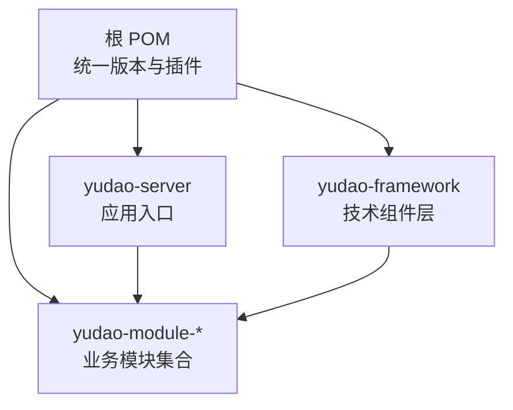
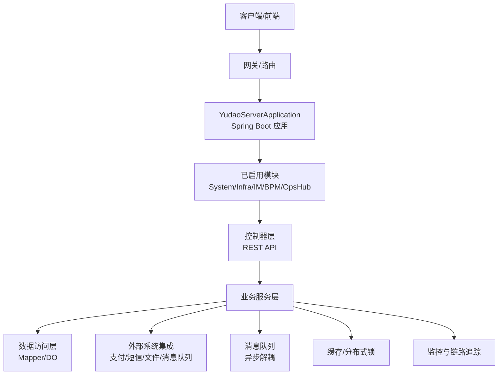
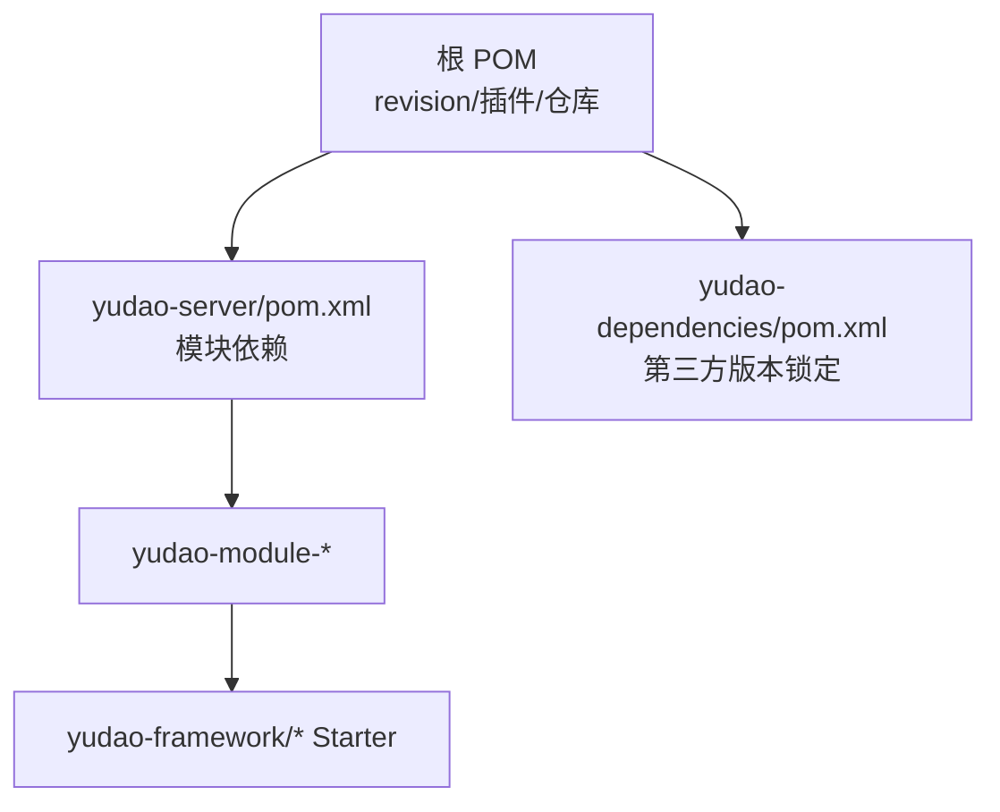

# 扩展开发

<cite>
**本文引用的文件**
- [根 POM](file://pom.xml)
- [服务器启动类](file://yudao-server/src/main/java/cn/iocoder/yudao/server/YudaoServerApplication.java)
- [开发指南](file://DEVELOPMENT-GUIDE.md)
- [模块启用说明](file://AGENTS.md)
- [yudao-framework 模块总览](file://yudao-framework/pom.xml)
- [Web Starter](file://yudao-framework/yudao-spring-boot-starter-web/pom.xml)
- [安全 Starter](file://yudao-framework/yudao-spring-boot-starter-security/pom.xml)
- [MyBatis Starter](file://yudao-framework/yudao-spring-boot-starter-mybatis/pom.xml)
- [Redis Starter](file://yudao-framework/yudao-spring-boot-starter-redis/pom.xml)
- [消息队列 Starter](file://yudao-framework/yudao-spring-boot-starter-mq/pom.xml)
- [定时任务 Starter](file://yudao-framework/yudao-spring-boot-starter-job/pom.xml)
- [监控 Starter](file://yudao-framework/yudao-spring-boot-starter-monitor/pom.xml)
- [Excel 导出 Starter](file://yudao-framework/yudao-spring-boot-starter-excel/pom.xml)
- [IP 地址解析 Starter](file://yudao-framework/yudao-spring-boot-starter-biz-ip/pom.xml)
- [数据权限 Starter](file://yudao-framework/yudao-spring-boot-starter-biz-data-permission/pom.xml)
- [多租户 Starter](file://yudao-framework/yudao-spring-boot-starter-biz-tenant/pom.xml)
- [WebSocket Starter](file://yudao-framework/yudao-spring-boot-starter-websocket/pom.xml)
- [系统模块控制器示例](file://yudao-module-system/src/main/java/cn/iocoder/yudao/module/system/controller/admin/package-info.java)
- [系统模块服务示例](file://yudao-module-system/src/main/java/cn/iocoder/yudao/module/system/service/package-info.java)
- [基础设施模块控制器示例](file://yudao-module-infra/src/main/java/cn/iocoder/yudao/module/infra/controller/admin/package-info.java)
- [即时通讯模块控制器示例](file://yudao-module-im/src/main/java/cn/iocoder/yudao/module/im/controller/admin/package-info.java)
- [工作流模块控制器示例](file://yudao-module-bpm/src/main/java/cn/iocoder/yudao/module/bpm/controller/admin/package-info.java)
- [运营 Hub 模块控制器示例](file://yudao-module-opshub/src/main/java/cn/iocoder/yudao/module/opshub/controller/admin/package-info.java)
- [系统模块枚举示例](file://yudao-module-system/src/main/java/cn/iocoder/yudao/module/system/enums/package-info.java)
- [基础设施模块枚举示例](file://yudao-module-infra/src/main/java/cn/iocoder/yudao/module/infra/enums/package-info.java)
- [即时通讯模块枚举示例](file://yudao-module-im/src/main/java/cn/iocoder/yudao/module/im/enums/package-info.java)
- [工作流模块枚举示例](file://yudao-module-bpm/src/main/java/cn/iocoder/yudao/module/bpm/enums/package-info.java)
- [运营 Hub 模块枚举示例](file://yudao-module-opshub/src/main/java/cn/iocoder/yudao/module/opshub/enums/package-info.java)
- [系统模块转换器示例](file://yudao-module-system/src/main/java/cn/iocoder/yudao/module/system/convert/package-info.java)
- [基础设施模块转换器示例](file://yudao-module-infra/src/main/java/cn/iocoder/yudao/module/infra/convert/package-info.java)
- [即时通讯模块转换器示例](file://yudao-module-im/src/main/java/cn/iocoder/yudao/module/im/convert/package-info.java)
- [工作流模块转换器示例](file://yudao-module-bpm/src/main/java/cn/iocoder/yudao/module/bpm/convert/package-info.java)
- [运营 Hub 模块转换器示例](file://yudao-module-opshub/src/main/java/cn/iocoder/yudao/module/opshub/convert/package-info.java)
- [系统模块数据对象示例](file://yudao-module-system/src/main/java/cn/iocoder/yudao/module/system/dal/dataobject/package-info.java)
- [基础设施模块数据对象示例](file://yudao-module-infra/src/main/java/cn/iocoder/yudao/module/infra/dal/dataobject/package-info.java)
- [即时通讯模块数据对象示例](file://yudao-module-im/src/main/java/cn/iocoder/yudao/module/im/dal/dataobject/package-info.java)
- [工作流模块数据对象示例](file://yudao-module-bpm/src/main/java/cn/iocoder/yudao/module/bpm/dal/dataobject/package-info.java)
- [运营 Hub 模块数据对象示例](file://yudao-module-opshub/src/main/java/cn/iocoder/yudao/module/opshub/dal/dataobject/package-info.java)
- [系统模块 Mapper 示例](file://yudao-module-system/src/main/java/cn/iocoder/yudao/module/system/dal/mysql/package-info.java)
- [基础设施模块 Mapper 示例](file://yudao-module-infra/src/main/java/cn/iocoder/yudao/module/infra/dal/mysql/package-info.java)
- [即时通讯模块 Mapper 示例](file://yudao-module-im/src/main/java/cn/iocoder/yudao/module/im/dal/mysql/package-info.java)
- [工作流模块 Mapper 示例](file://yudao-module-bpm/src/main/java/cn/iocoder/yudao/module/bpm/dal/mysql/package-info.java)
- [运营 Hub 模块 Mapper 示例](file://yudao-module-opshub/src/main/java/cn/iocoder/yudao/module/opshub/dal/mysql/package-info.java)
- [系统模块 API 接口示例](file://yudao-module-system/src/main/java/cn/iocoder/yudao/module/system/api/package-info.java)
- [基础设施模块 API 接口示例](file://yudao-module-infra/src/main/java/cn/iocoder/yudao/module/infra/api/package-info.java)
- [即时通讯模块 API 接口示例](file://yudao-module-im/src/main/java/cn/iocoder/yudao/module/im/api/package-info.java)
- [工作流模块 API 接口示例](file://yudao-module-bpm/src/main/java/cn/iocoder/yudao/module/bpm/api/package-info.java)
- [运营 Hub 模块 API 接口示例](file://yudao-module-opshub/src/main/java/cn/iocoder/yudao/module/opshub/api/package-info.java)
- [系统模块框架配置示例](file://yudao-module-system/src/main/java/cn/iocoder/yudao/module/system/framework/package-info.java)
- [基础设施模块框架配置示例](file://yudao-module-infra/src/main/java/cn/iocoder/yudao/module/infra/framework/package-info.java)
- [即时通讯模块框架配置示例](file://yudao-module-im/src/main/java/cn/iocoder/yudao/module/im/framework/package-info.java)
- [工作流模块框架配置示例](file://yudao-module-bpm/src/main/java/cn/iocoder/yudao/module/bpm/framework/package-info.java)
- [运营 Hub 模块框架配置示例](file://yudao-module-opshub/src/main/java/cn/iocoder/yudao/module/opshub/framework/package-info.java)
- [系统模块应用服务示例](file://yudao-module-system/src/main/java/cn/iocoder/yudao/module/system/service/app/package-info.java)
- [基础设施模块应用服务示例](file://yudao-module-infra/src/main/java/cn/iocoder/yudao/module/infra/service/app/package-info.java)
- [即时通讯模块应用服务示例](file://yudao-module-im/src/main/java/cn/iocoder/yudao/module/im/service/app/package-info.java)
- [工作流模块应用服务示例](file://yudao-module-bpm/src/main/java/cn/iocoder/yudao/module/bpm/service/app/package-info.java)
- [运营 Hub 模块应用服务示例](file://yudao-module-opshub/src/main/java/cn/iocoder/yudao/module/opshub/service/app/package-info.java)
- [系统模块后台控制器示例](file://yudao-module-system/src/main/java/cn/iocoder/yudao/module/system/controller/admin/package-info.java)
- [基础设施模块后台控制器示例](file://yudao-module-infra/src/main/java/cn/iocoder/yudao/module/infra/controller/admin/package-info.java)
- [即时通讯模块后台控制器示例](file://yudao-module-im/src/main/java/cn/iocoder/yudao/module/im/controller/admin/package-info.java)
- [工作流模块后台控制器示例](file://yudao-module-bpm/src/main/java/cn/iocoder/yudao/module/bpm/controller/admin/package-info.java)
- [运营 Hub 模块后台控制器示例](file://yudao-module-opshub/src/main/java/cn/iocoder/yudao/module/opshub/controller/admin/package-info.java)
</cite>

## 目录
1. [引言](#引言)
2. [项目结构](#项目结构)
3. [核心组件](#核心组件)
4. [架构总览](#架构总览)
5. [详细组件分析](#详细组件分析)
6. [依赖分析](#依赖分析)
7. [性能考虑](#性能考虑)
8. [故障排查指南](#故障排查指南)
9. [结论](#结论)
10. [附录](#附录)

## 引言
本文件面向希望在芋道 Ruoyi-Vue-Pro 基础上进行扩展开发的工程师，系统讲解如何基于现有框架开发自定义模块，涵盖模块结构设计、依赖配置、接口定义、业务实现、插件系统扩展机制（Spring Boot 自动装配、自定义 Starter 开发、配置属性绑定）、第三方系统集成方案（支付、短信、文件存储、消息队列）、自定义业务功能开发方法、性能优化与扩展性设计、监控与可观测性增强，以及可复用的扩展模板与示例路径。

## 项目结构
- 采用 Maven 多模块架构，根 POM 统一管理版本与插件，各模块按职责拆分，便于独立演进与组合启用。
- 服务器入口通过启动类扫描基础包与模块包，形成“空壳容器 + 依赖组合”的模块化运行模式。
- 模块遵循统一的包结构规范，便于跨模块协作与维护。

图示来源
- [根 POM:1-167](file://pom.xml#L1-L167)
- [服务器启动类:1-35](file://yudao-server/src/main/java/cn/iocoder/yudao/server/YudaoServerApplication.java#L1-L35)

章节来源
- [根 POM:1-167](file://pom.xml#L1-L167)
- [开发指南:22-45](file://DEVELOPMENT-GUIDE.md#L22-L45)
- [模块启用说明:77-106](file://AGENTS.md#L77-L106)
- [服务器启动类:1-35](file://yudao-server/src/main/java/cn/iocoder/yudao/server/YudaoServerApplication.java#L1-L35)

## 核心组件
- 技术组件层（yudao-framework）：封装常用能力为 Spring Boot Starter，如 Web、Security、MyBatis、Redis、MQ、Job、Monitor、Excel、IP、数据权限、多租户、WebSocket 等，降低重复造轮子成本。
- 业务模块层（yudao-module-*）：按领域划分，如系统管理、基础设施、IM、BPM、OpsHub 等，遵循统一包结构，清晰分层。
- 服务器入口（yudao-server）：仅作为模块聚合容器，实际功能由所选模块决定。

章节来源
- [yudao-framework 模块总览](file://yudao-framework/pom.xml)
- [开发指南:22-45](file://DEVELOPMENT-GUIDE.md#L22-L45)

## 架构总览
下图展示从请求进入、模块加载、业务处理到外部系统交互的整体流程，体现扩展点与耦合边界。

图示来源
- [服务器启动类:1-35](file://yudao-server/src/main/java/cn/iocoder/yudao/server/YudaoServerApplication.java#L1-L35)
- [开发指南:22-45](file://DEVELOPMENT-GUIDE.md#L22-L45)

## 详细组件分析

### 模块结构设计与包规范
- 统一包结构：controller/admin、controller/app、service、dal/dataobject、dal/mysql、convert、enums、api、framework 等，确保跨模块协作一致。
- 分层清晰：控制层负责接口与 VO；服务层封装业务；数据访问层隔离持久化细节；convert 负责对象映射；enums 提供领域常量；api 定义模块间契约；framework 放置配置与适配。

章节来源
- [模块启用说明:91-106](file://AGENTS.md#L91-L106)

### 插件系统扩展机制（Spring Boot 自动装配与 Starter）
- 自动装配原理：Starter 在 resources/META-INF/spring 下声明自动配置类，Spring Boot 在启动时自动加载。
- 自定义 Starter 开发步骤：
  1) 创建模块并引入 starter 依赖；
  2) 在 resources/META-INF/spring 下放置自动配置导入文件；
  3) 编写 @Configuration 类，定义 Bean 与条件装配；
  4) 通过 @EnableAutoConfiguration 或 spring.factories 注册；
  5) 提供配置属性类，绑定 application.yaml 中的前缀配置。
- 典型 Starter 参考：
  - 安全：提供鉴权、操作日志等自动配置
  - Redis：提供缓存、分布式锁等自动配置
  - MQ：提供消息队列适配（RabbitMQ/Redis Stream 等）
  - Job：提供 Quartz 定时任务自动配置
  - Monitor：提供链路追踪与指标采集
  - Excel：提供导出工具自动配置
  - IP/数据权限/多租户：提供业务能力自动注入

章节来源
- [安全 Starter](file://yudao-framework/yudao-spring-boot-starter-security/pom.xml)
- [Redis Starter](file://yudao-framework/yudao-spring-boot-starter-redis/pom.xml)
- [消息队列 Starter](file://yudao-framework/yudao-spring-boot-starter-mq/pom.xml)
- [定时任务 Starter](file://yudao-framework/yudao-spring-boot-starter-job/pom.xml)
- [监控 Starter](file://yudao-framework/yudao-spring-boot-starter-monitor/pom.xml)
- [Excel 导出 Starter](file://yudao-framework/yudao-spring-boot-starter-excel/pom.xml)
- [IP 地址解析 Starter](file://yudao-framework/yudao-spring-boot-starter-biz-ip/pom.xml)
- [数据权限 Starter](file://yudao-framework/yudao-spring-boot-starter-biz-data-permission/pom.xml)
- [多租户 Starter](file://yudao-framework/yudao-spring-boot-starter-biz-tenant/pom.xml)

### 第三方系统集成方案
- 支付系统集成
  - 设计支付订单实体与状态机，使用枚举管理状态常量。
  - 通过 API 层对接第三方支付网关，异步回调更新订单状态。
  - 使用消息队列解耦支付结果通知与后续处理。
  - 参考路径：[系统模块枚举示例](file://yudao-module-system/src/main/java/cn/iocoder/yudao/module/system/enums/package-info.java)，[消息队列 Starter](file://yudao-framework/yudao-spring-boot-starter-mq/pom.xml)
- 短信服务集成
  - 在 service 层封装短信发送接口，支持模板与变量替换。
  - 使用消息队列异步发送，保证主流程不阻塞。
  - 参考路径：[系统模块应用服务示例](file://yudao-module-system/src/main/java/cn/iocoder/yudao/module/system/service/app/package-info.java)，[消息队列 Starter](file://yudao-framework/yudao-spring-boot-starter-mq/pom.xml)
- 文件存储集成
  - 抽象文件上传/下载接口，支持本地/云存储切换。
  - 使用 Redis 缓存热点元数据，结合异步任务处理缩略图/转码。
  - 参考路径：[基础设施模块应用服务示例](file://yudao-module-infra/src/main/java/cn/iocoder/yudao/module/infra/service/app/package-info.java)，[Redis Starter](file://yudao-framework/yudao-spring-boot-starter-redis/pom.xml)
- 消息队列集成
  - 选择合适的消息中间件（RabbitMQ/Redis），在 service 层发布事件。
  - 使用消费者监听处理业务，注意幂等与重试策略。
  - 参考路径：[消息队列 Starter](file://yudao-framework/yudao-spring-boot-starter-mq/pom.xml)

章节来源
- [系统模块枚举示例](file://yudao-module-system/src/main/java/cn/iocoder/yudao/module/system/enums/package-info.java)
- [系统模块应用服务示例](file://yudao-module-system/src/main/java/cn/iocoder/yudao/module/system/service/app/package-info.java)
- [基础设施模块应用服务示例](file://yudao-module-infra/src/main/java/cn/iocoder/yudao/module/infra/service/app/package-info.java)
- [消息队列 Starter](file://yudao-framework/yudao-spring-boot-starter-mq/pom.xml)
- [Redis Starter](file://yudao-framework/yudao-spring-boot-starter-redis/pom.xml)

### 自定义业务功能开发流程
- 新增业务实体设计
  - 在 enums 中定义领域常量与状态枚举，在 dal/dataobject 中定义 DO，dal/mysql 中定义 Mapper。
  - 参考路径：[系统模块数据对象示例](file://yudao-module-system/src/main/java/cn/iocoder/yudao/module/system/dal/dataobject/package-info.java)，[系统模块 Mapper 示例](file://yudao-module-system/src/main/java/cn/iocoder/yudao/module/system/dal/mysql/package-info.java)
- 数据访问层实现
  - 基于 MyBatis Plus 的 BaseMapperX 与 BaseDO，减少样板代码。
  - 参考路径：[MyBatis Starter](file://yudao-framework/yudao-spring-boot-starter-mybatis/pom.xml)
- 业务逻辑封装
  - 在 service 层编写事务与流程控制，必要时使用 Redisson 实现分布式锁。
  - 参考路径：[Redis Starter](file://yudao-framework/yudao-spring-boot-starter-redis/pom.xml)
- 前端页面开发
  - 在 yudao-ui 对应模块目录下新增 API 与页面组件，遵循现有命名与目录规范。
  - 参考路径：[系统模块后台控制器示例](file://yudao-module-system/src/main/java/cn/iocoder/yudao/module/system/controller/admin/package-info.java)

章节来源
- [系统模块数据对象示例](file://yudao-module-system/src/main/java/cn/iocoder/yudao/module/system/dal/dataobject/package-info.java)
- [系统模块 Mapper 示例](file://yudao-module-system/src/main/java/cn/iocoder/yudao/module/system/dal/mysql/package-info.java)
- [MyBatis Starter](file://yudao-framework/yudao-spring-boot-starter-mybatis/pom.xml)
- [Redis Starter](file://yudao-framework/yudao-spring-boot-starter-redis/pom.xml)
- [系统模块后台控制器示例](file://yudao-module-system/src/main/java/cn/iocoder/yudao/module/system/controller/admin/package-info.java)

### 接口定义与模块契约
- 在 api 包中定义模块对外接口，约束入参与返回，便于跨模块调用。
- 使用 convert 进行 DO/VO 映射，保持接口稳定与数据一致性。
- 参考路径：[系统模块 API 接口示例](file://yudao-module-system/src/main/java/cn/iocoder/yudao/module/system/api/package-info.java)，[系统模块转换器示例](file://yudao-module-system/src/main/java/cn/iocoder/yudao/module/system/convert/package-info.java)

章节来源
- [系统模块 API 接口示例](file://yudao-module-system/src/main/java/cn/iocoder/yudao/module/system/api/package-info.java)
- [系统模块转换器示例](file://yudao-module-system/src/main/java/cn/iocoder/yudao/module/system/convert/package-info.java)

### 控制器与服务层最佳实践
- 控制器层：统一返回格式、参数校验、权限拦截；按 admin/app 划分接口域。
- 服务层：事务边界明确、异常统一处理、复杂流程拆分为子服务或使用消息队列异步化。
- 参考路径：[Web Starter](file://yudao-framework/yudao-spring-boot-starter-web/pom.xml)，[安全 Starter](file://yudao-framework/yudao-spring-boot-starter-security/pom.xml)

章节来源
- [Web Starter](file://yudao-framework/yudao-spring-boot-starter-web/pom.xml)
- [安全 Starter](file://yudao-framework/yudao-spring-boot-starter-security/pom.xml)

## 依赖分析
- 模块启用需“两处同步”：根 POM 的 <modules> 与 yudao-server 的 <dependencies>，否则构建失败。
- 版本管理：根 POM 的 <revision> 统一版本号，第三方依赖在 yudao-dependencies 锁定。
- 框架与模块的依赖关系：yudao-server 通过依赖启用具体模块；各模块依赖 yudao-framework 的 Starter。

图示来源
- [根 POM:1-167](file://pom.xml#L1-L167)
- [模块启用说明:77-106](file://AGENTS.md#L77-L106)

章节来源
- [根 POM:1-167](file://pom.xml#L1-L167)
- [模块启用说明:77-106](file://AGENTS.md#L77-L106)

## 性能考虑
- 缓存策略
  - 使用 Redis 缓存热点数据，结合过期时间与淘汰策略；对写多读少场景使用延迟双删或写后失效。
  - 参考路径：[Redis Starter](file://yudao-framework/yudao-spring-boot-starter-redis/pom.xml)
- 异步处理
  - 使用消息队列异步化非关键路径，削峰填谷；对幂等性与重试进行设计。
  - 参考路径：[消息队列 Starter](file://yudao-framework/yudao-spring-boot-starter-mq/pom.xml)
- 分布式锁
  - 使用 Redisson 实现细粒度分布式锁，避免超卖与竞态条件。
  - 参考路径：[Redis Starter](file://yudao-framework/yudao-spring-boot-starter-redis/pom.xml)
- 限流与熔断
  - 在网关或服务层结合限流算法（令牌桶/漏桶）与熔断策略（Hystrix/Sentinel），保护下游系统。
- 数据库优化
  - 基于 MyBatis Plus 的分页查询、批量插入、索引优化与读写分离。
  - 参考路径：[MyBatis Starter](file://yudao-framework/yudao-spring-boot-starter-mybatis/pom.xml)

章节来源
- [Redis Starter](file://yudao-framework/yudao-spring-boot-starter-redis/pom.xml)
- [消息队列 Starter](file://yudao-framework/yudao-spring-boot-starter-mq/pom.xml)
- [MyBatis Starter](file://yudao-framework/yudao-spring-boot-starter-mybatis/pom.xml)

## 故障排查指南
- 启动问题定位
  - 检查 yudao-server 的扫描基包是否正确，确认模块已启用且依赖存在。
  - 参考路径：[服务器启动类:1-35](file://yudao-server/src/main/java/cn/iocoder/yudao/server/YudaoServerApplication.java#L1-L35)，[模块启用说明:77-106](file://AGENTS.md#L77-L106)
- 构建失败
  - 确认根 POM 与 yudao-server 的模块启用保持一致，避免依赖缺失。
  - 参考路径：[根 POM:1-167](file://pom.xml#L1-L167)
- 接口异常
  - 统一异常处理与返回格式，结合 Web Starter 的全局异常配置。
  - 参考路径：[Web Starter](file://yudao-framework/yudao-spring-boot-starter-web/pom.xml)
- 性能瓶颈
  - 使用监控 Starter 与链路追踪，定位慢调用与热点接口。
  - 参考路径：[监控 Starter](file://yudao-framework/yudao-spring-boot-starter-monitor/pom.xml)

章节来源
- [服务器启动类:1-35](file://yudao-server/src/main/java/cn/iocoder/yudao/server/YudaoServerApplication.java#L1-L35)
- [模块启用说明:77-106](file://AGENTS.md#L77-L106)
- [根 POM:1-167](file://pom.xml#L1-L167)
- [Web Starter](file://yudao-framework/yudao-spring-boot-starter-web/pom.xml)
- [监控 Starter](file://yudao-framework/yudao-spring-boot-starter-monitor/pom.xml)

## 结论
通过遵循统一的模块结构与包规范、利用丰富的 Starter 能力、采用消息队列与缓存等手段，开发者可以高效地在 Ruoyi-Vue-Pro 上扩展新模块与业务功能。同时，完善的监控与可观测性保障了系统在高并发场景下的稳定性与可维护性。

## 附录
- 快速开始模板
  - 新模块骨架：参考任一现有模块（如 system/infra/im/bpm/opshub）的包结构，复制并替换包名与业务。
  - 启用模块：在根 POM 与 yudao-server 的依赖中同步启用。
  - 参考路径：[开发指南:22-45](file://DEVELOPMENT-GUIDE.md#L22-L45)，[模块启用说明:77-106](file://AGENTS.md#L77-L106)
- 关键扩展点清单
  - 自动装配：resources/META-INF/spring 下添加自动配置导入
  - 配置属性：提供 @ConfigurationProperties 绑定前缀
  - 接口契约：在 api 包定义模块对外接口
  - 数据模型：在 enums、dal/dataobject、dal/mysql 中完善
  - 业务实现：service 层封装流程，必要时使用 MQ/Redis
  - 监控可观测：接入监控 Starter 与链路追踪