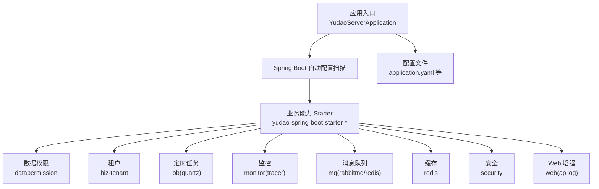
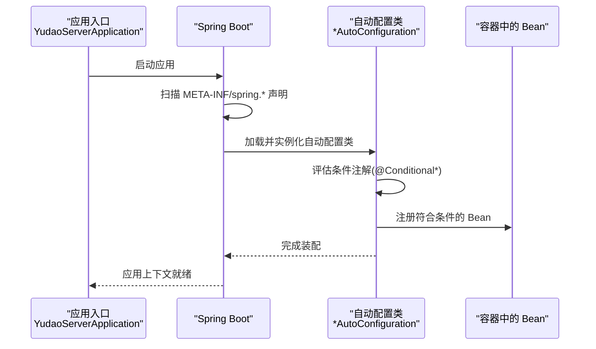
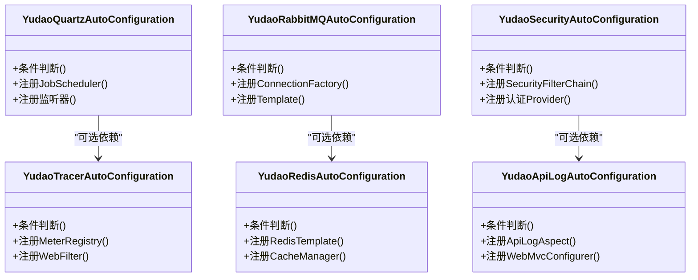
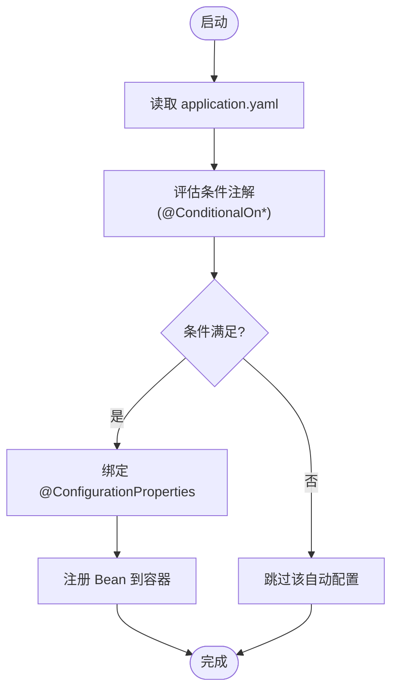
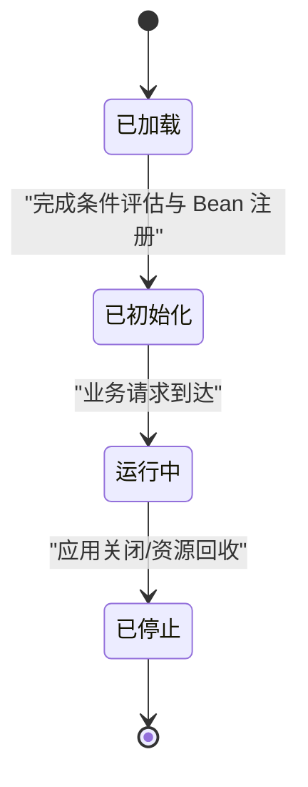
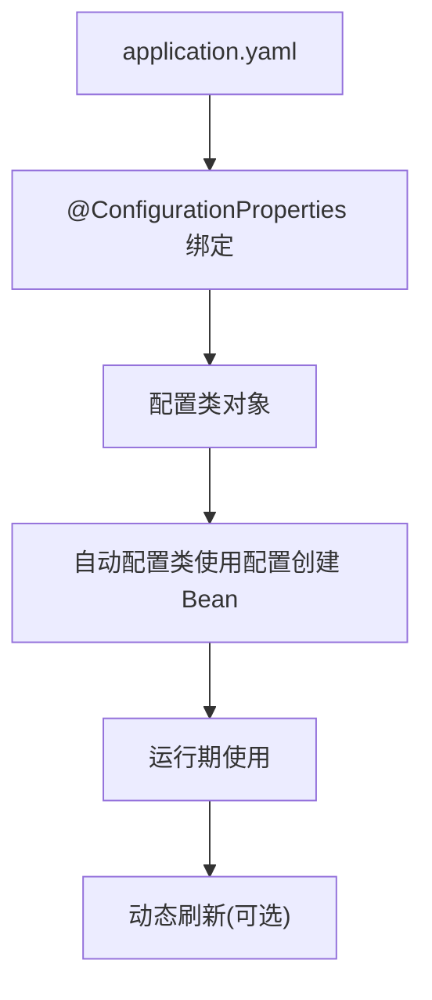
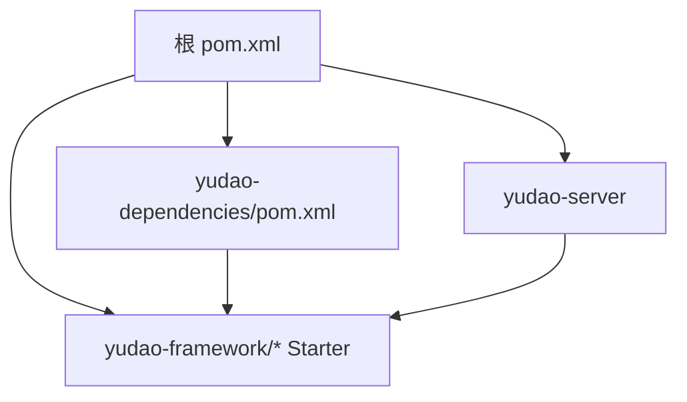

# 插件开发

<cite>
**本文引用的文件**
- [YudaoServerApplication.java](file://yudao-server/src/main/java/cn/iocoder/yudao/server/YudaoServerApplication.java)
- [application.yaml](file://yudao-server/src/main/resources/application.yaml)
- [application-dev.yaml](file://yudao-server/src/main/resources/application-dev.yaml)
- [application-local.yaml](file://yudao-server/src/main/resources/application-local.yaml)
- [YudaoDataPermissionAutoConfiguration.java](file://yudao-framework/yudao-spring-boot-starter-biz-data-permission/src/main/java/cn/iocoder/yudao/framework/datapermission/config/YudaoDataPermissionAutoConfiguration.java)
- [YudaoTenantAutoConfiguration.java](file://yudao-framework/yudao-spring-boot-starter-biz-tenant/src/main/java/cn/iocoder/yudao/framework/tenant/config/YudaoTenantAutoConfiguration.java)
- [YudaoQuartzAutoConfiguration.java](file://yudao-framework/yudao-spring-boot-starter-job/src/main/java/cn/iocoder/yudao/framework/quartz/config/YudaoQuartzAutoConfiguration.java)
- [YudaoTracerAutoConfiguration.java](file://yudao-framework/yudao-spring-boot-starter-monitor/src/main/java/cn/iocoder/yudao/framework/tracer/config/YudaoTracerAutoConfiguration.java)
- [YudaoRabbitMQAutoConfiguration.java](file://yudao-framework/yudao-spring-boot-starter-mq/src/main/java/cn/iocoder/yudao/framework/mq/rabbitmq/config/YudaoRabbitMQAutoConfiguration.java)
- [YudaoRedisAutoConfiguration.java](file://yudao-framework/yudao-spring-boot-starter-redis/src/main/java/cn/iocoder/yudao/framework/redis/config/YudaoRedisAutoConfiguration.java)
- [YudaoSecurityAutoConfiguration.java](file://yudao-framework/yudao-spring-boot-starter-security/src/main/java/cn/iocoder/yudao/framework/security/config/YudaoSecurityAutoConfiguration.java)
- [YudaoApiLogAutoConfiguration.java](file://yudao-framework/yudao-spring-boot-starter-web/src/main/java/cn/iocoder/yudao/framework/apilog/config/YudaoApiLogAutoConfiguration.java)
- [spring.factories](file://yudao-framework/yudao-spring-boot-starter-biz-tenant/src/main/resources/META-INF/spring.factories)
- [AutoConfiguration.imports](file://yudao-framework/yudao-spring-boot-starter-job/src/main/resources/META-INF/spring/org.springframework.boot.autoconfigure.AutoConfiguration.imports)
- [AutoConfiguration.imports](file://yudao-framework/yudao-spring-boot-starter-monitor/src/main/resources/META-INF/spring/org.springframework.boot.autoconfigure.AutoConfiguration.imports)
- [AutoConfiguration.imports](file://yudao-framework/yudao-spring-boot-starter-mq/src/main/resources/META-INF/spring/org.springframework.boot.autoconfigure.AutoConfiguration.imports)
- [AutoConfiguration.imports](file://yudao-framework/yudao-spring-boot-starter-redis/src/main/resources/META-INF/spring/org.springframework.boot.autoconfigure.AutoConfiguration.imports)
- [AutoConfiguration.imports](file://yudao-framework/yudao-spring-boot-starter-security/src/main/resources/META-INF/spring/org.springframework.boot.autoconfigure.AutoConfiguration.imports)
- [AutoConfiguration.imports](file://yudao-framework/yudao-spring-boot-starter-web/src/main/resources/META-INF/spring/org.springframework.boot.autoconfigure.AutoConfiguration.imports)
- [pom.xml](file://pom.xml)
- [yudao-dependencies/pom.xml](file://yudao-dependencies/pom.xml)
</cite>

## 目录
1. [引言](#引言)
2. [项目结构](#项目结构)
3. [核心组件](#核心组件)
4. [架构总览](#架构总览)
5. [详细组件分析](#详细组件分析)
6. [依赖分析](#依赖分析)
7. [性能考虑](#性能考虑)
8. [故障排查指南](#故障排查指南)
9. [结论](#结论)
10. [附录](#附录)

## 引言
本指南面向在芋道 ruoyi-vue-pro 中进行“插件化”扩展的开发者，系统讲解基于 Spring Boot 自动配置的 Starter 模式插件体系：如何设计自动配置类、合理使用条件注解与配置属性绑定、管理插件生命周期（加载、初始化、运行、卸载）、配置机制（application.yaml、@ConfigurationProperties、动态刷新）、插件间依赖与冲突处理、以及热加载/热部署实践。文档同时提供从简单功能插件到企业级复杂插件的开发范式，并总结最佳实践、性能优化与调试技巧。

## 项目结构
芋道 ruoyi-vue-pro 采用多模块 Maven 架构，后端服务由 yudao-server 启动，业务能力通过 yudao-framework 下的各类 Starter 提供。每个 Starter 独立封装特定能力（如数据权限、租户、定时任务、监控、消息队列、缓存、安全、Web 增强等），通过 Spring Boot 的自动配置机制按需装配。

图表来源
- [YudaoServerApplication.java](file://yudao-server/src/main/java/cn/iocoder/yudao/server/YudaoServerApplication.java)
- [application.yaml](file://yudao-server/src/main/resources/application.yaml)

章节来源
- [YudaoServerApplication.java](file://yudao-server/src/main/java/cn/iocoder/yudao/server/YudaoServerApplication.java)
- [application.yaml](file://yudao-server/src/main/resources/application.yaml)

## 核心组件
- 自动配置类：每个 Starter 内部提供一个或多个 AutoConfiguration 类，负责条件化地注册 Bean、装配组件。
- 条件注解：@ConditionalOnProperty、@ConditionalOnClass、@ConditionalOnMissingBean 等，确保仅在满足环境条件时生效。
- 配置属性绑定：通过 @ConfigurationProperties 或 @Value 绑定 application.yaml 中的配置项。
- 配置声明：通过 spring.factories 或 AutoConfiguration.imports 声明自动配置类，供 Spring Boot 发现。
- 生命周期：由 Spring 容器托管，随应用启动加载、初始化；卸载通常通过上下文关闭触发。
- 动态配置：结合 Spring Cloud Config 或 @RefreshScope 实现配置热更新（若引入相关生态）。

章节来源
- [YudaoDataPermissionAutoConfiguration.java](file://yudao-framework/yudao-spring-boot-starter-biz-data-permission/src/main/java/cn/iocoder/yudao/framework/datapermission/config/YudaoDataPermissionAutoConfiguration.java)
- [YudaoTenantAutoConfiguration.java](file://yudao-framework/yudao-spring-boot-starter-biz-tenant/src/main/java/cn/iocoder/yudao/framework/tenant/config/YudaoTenantAutoConfiguration.java)
- [YudaoQuartzAutoConfiguration.java](file://yudao-framework/yudao-spring-boot-starter-job/src/main/java/cn/iocoder/yudao/framework/quartz/config/YudaoQuartzAutoConfiguration.java)
- [YudaoTracerAutoConfiguration.java](file://yudao-framework/yudao-spring-boot-starter-monitor/src/main/java/cn/iocoder/yudao/framework/tracer/config/YudaoTracerAutoConfiguration.java)
- [YudaoRabbitMQAutoConfiguration.java](file://yudao-framework/yudao-spring-boot-starter-mq/src/main/java/cn/iocoder/yudao/framework/mq/rabbitmq/config/YudaoRabbitMQAutoConfiguration.java)
- [YudaoRedisAutoConfiguration.java](file://yudao-framework/yudao-spring-boot-starter-redis/src/main/java/cn/iocoder/yudao/framework/redis/config/YudaoRedisAutoConfiguration.java)
- [YudaoSecurityAutoConfiguration.java](file://yudao-framework/yudao-spring-boot-starter-security/src/main/java/cn/iocoder/yudao/framework/security/config/YudaoSecurityAutoConfiguration.java)
- [YudaoApiLogAutoConfiguration.java](file://yudao-framework/yudao-spring-boot-starter-web/src/main/java/cn/iocoder/yudao/framework/apilog/config/YudaoApiLogAutoConfiguration.java)
- [spring.factories](file://yudao-framework/yudao-spring-boot-starter-biz-tenant/src/main/resources/META-INF/spring.factories)
- [AutoConfiguration.imports](file://yudao-framework/yudao-spring-boot-starter-job/src/main/resources/META-INF/spring/org.springframework.boot.autoconfigure.AutoConfiguration.imports)

## 架构总览
下图展示了应用启动时，Spring Boot 如何发现并装配各 Starter 的自动配置类，以及它们如何根据条件注解与配置属性决定是否创建 Bean。

图表来源
- [spring.factories](file://yudao-framework/yudao-spring-boot-starter-biz-tenant/src/main/resources/META-INF/spring.factories)
- [AutoConfiguration.imports](file://yudao-framework/yudao-spring-boot-starter-job/src/main/resources/META-INF/spring/org.springframework.boot.autoconfigure.AutoConfiguration.imports)
- [YudaoQuartzAutoConfiguration.java](file://yudao-framework/yudao-spring-boot-starter-job/src/main/java/cn/iocoder/yudao/framework/quartz/config/YudaoQuartzAutoConfiguration.java)

## 详细组件分析

### 自动配置类设计模式
- 命名规范：以能力命名 + AutoConfiguration 结尾，例如 Quartz、Tracer、RabbitMQ、Redis、Security、ApiLog。
- 条件装配：优先使用 @ConditionalOnProperty 检查开关，@ConditionalOnClass 检查依赖是否存在，@ConditionalOnMissingBean 避免重复装配。
- Bean 注册：在配置类中定义 @Bean 方法，注入外部配置（@ConfigurationProperties 或 @Value），并在合适的作用域内暴露给业务使用。
- 外观与细节分离：对外暴露简化的配置键，内部实现可复用通用组件。

图表来源
- [YudaoQuartzAutoConfiguration.java](file://yudao-framework/yudao-spring-boot-starter-job/src/main/java/cn/iocoder/yudao/framework/quartz/config/YudaoQuartzAutoConfiguration.java)
- [YudaoTracerAutoConfiguration.java](file://yudao-framework/yudao-spring-boot-starter-monitor/src/main/java/cn/iocoder/yudao/framework/tracer/config/YudaoTracerAutoConfiguration.java)
- [YudaoRabbitMQAutoConfiguration.java](file://yudao-framework/yudao-spring-boot-starter-mq/src/main/java/cn/iocoder/yudao/framework/mq/rabbitmq/config/YudaoRabbitMQAutoConfiguration.java)
- [YudaoRedisAutoConfiguration.java](file://yudao-framework/yudao-spring-boot-starter-redis/src/main/java/cn/iocoder/yudao/framework/redis/config/YudaoRedisAutoConfiguration.java)
- [YudaoSecurityAutoConfiguration.java](file://yudao-framework/yudao-spring-boot-starter-security/src/main/java/cn/iocoder/yudao/framework/security/config/YudaoSecurityAutoConfiguration.java)
- [YudaoApiLogAutoConfiguration.java](file://yudao-framework/yudao-spring-boot-starter-web/src/main/java/cn/iocoder/yudao/framework/apilog/config/YudaoApiLogAutoConfiguration.java)

章节来源
- [YudaoQuartzAutoConfiguration.java](file://yudao-framework/yudao-spring-boot-starter-job/src/main/java/cn/iocoder/yudao/framework/quartz/config/YudaoQuartzAutoConfiguration.java)
- [YudaoTracerAutoConfiguration.java](file://yudao-framework/yudao-spring-boot-starter-monitor/src/main/java/cn/iocoder/yudao/framework/tracer/config/YudaoTracerAutoConfiguration.java)
- [YudaoRabbitMQAutoConfiguration.java](file://yudao-framework/yudao-spring-boot-starter-mq/src/main/java/cn/iocoder/yudao/framework/mq/rabbitmq/config/YudaoRabbitMQAutoConfiguration.java)
- [YudaoRedisAutoConfiguration.java](file://yudao-framework/yudao-spring-boot-starter-redis/src/main/java/cn/iocoder/yudao/framework/redis/config/YudaoRedisAutoConfiguration.java)
- [YudaoSecurityAutoConfiguration.java](file://yudao-framework/yudao-spring-boot-starter-security/src/main/java/cn/iocoder/yudao/framework/security/config/YudaoSecurityAutoConfiguration.java)
- [YudaoApiLogAutoConfiguration.java](file://yudao-framework/yudao-spring-boot-starter-web/src/main/java/cn/iocoder/yudao/framework/apilog/config/YudaoApiLogAutoConfiguration.java)

### 条件注解与配置属性绑定
- 条件注解：常用 @ConditionalOnProperty(prefix = "xxx", name = "enabled", havingValue = "true", matchIfMissing = false) 控制开关；@ConditionalOnClass 判断依赖是否存在；@ConditionalOnMissingBean 防止重复装配。
- 配置属性绑定：推荐使用 @ConfigurationProperties(prefix = "xxx") 将 application.yaml 中的键值映射到配置类，便于类型安全与 IDE 提示。
- 配置声明：通过 spring.factories 或 AutoConfiguration.imports 声明自动配置类，确保 Spring Boot 在启动时自动发现。

图表来源
- [YudaoDataPermissionAutoConfiguration.java](file://yudao-framework/yudao-spring-boot-starter-biz-data-permission/src/main/java/cn/iocoder/yudao/framework/datapermission/config/YudaoDataPermissionAutoConfiguration.java)
- [YudaoTenantAutoConfiguration.java](file://yudao-framework/yudao-spring-boot-starter-biz-tenant/src/main/java/cn/iocoder/yudao/framework/tenant/config/YudaoTenantAutoConfiguration.java)
- [spring.factories](file://yudao-framework/yudao-spring-boot-starter-biz-tenant/src/main/resources/META-INF/spring.factories)
- [AutoConfiguration.imports](file://yudao-framework/yudao-spring-boot-starter-job/src/main/resources/META-INF/spring/org.springframework.boot.autoconfigure.AutoConfiguration.imports)

章节来源
- [YudaoDataPermissionAutoConfiguration.java](file://yudao-framework/yudao-spring-boot-starter-biz-data-permission/src/main/java/cn/iocoder/yudao/framework/datapermission/config/YudaoDataPermissionAutoConfiguration.java)
- [YudaoTenantAutoConfiguration.java](file://yudao-framework/yudao-spring-boot-starter-biz-tenant/src/main/java/cn/iocoder/yudao/framework/tenant/config/YudaoTenantAutoConfiguration.java)
- [spring.factories](file://yudao-framework/yudao-spring-boot-starter-biz-tenant/src/main/resources/META-INF/spring.factories)
- [AutoConfiguration.imports](file://yudao-framework/yudao-spring-boot-starter-job/src/main/resources/META-INF/spring/org.springframework.boot.autoconfigure.AutoConfiguration.imports)

### 插件生命周期管理
- 加载：Spring Boot 启动阶段扫描并加载各自动配置类。
- 初始化：执行 @PostConstruct 或 InitializingBean 的初始化逻辑；注册拦截器、过滤器、监听器等。
- 运行：Bean 在容器中被业务代码调用；异步任务、消息消费、链路追踪等持续工作。
- 卸载：应用关闭时销毁容器与资源；对于长连接、线程池等需显式清理。

图表来源
- [YudaoQuartzAutoConfiguration.java](file://yudao-framework/yudao-spring-boot-starter-job/src/main/java/cn/iocoder/yudao/framework/quartz/config/YudaoQuartzAutoConfiguration.java)
- [YudaoTracerAutoConfiguration.java](file://yudao-framework/yudao-spring-boot-starter-monitor/src/main/java/cn/iocoder/yudao/framework/tracer/config/YudaoTracerAutoConfiguration.java)
- [YudaoRabbitMQAutoConfiguration.java](file://yudao-framework/yudao-spring-boot-starter-mq/src/main/java/cn/iocoder/yudao/framework/mq/rabbitmq/config/YudaoRabbitMQAutoConfiguration.java)
- [YudaoRedisAutoConfiguration.java](file://yudao-framework/yudao-spring-boot-starter-redis/src/main/java/cn/iocoder/yudao/framework/redis/config/YudaoRedisAutoConfiguration.java)
- [YudaoSecurityAutoConfiguration.java](file://yudao-framework/yudao-spring-boot-starter-security/src/main/java/cn/iocoder/yudao/framework/security/config/YudaoSecurityAutoConfiguration.java)
- [YudaoApiLogAutoConfiguration.java](file://yudao-framework/yudao-spring-boot-starter-web/src/main/java/cn/iocoder/yudao/framework/apilog/config/YudaoApiLogAutoConfiguration.java)

章节来源
- [YudaoQuartzAutoConfiguration.java](file://yudao-framework/yudao-spring-boot-starter-job/src/main/java/cn/iocoder/yudao/framework/quartz/config/YudaoQuartzAutoConfiguration.java)
- [YudaoTracerAutoConfiguration.java](file://yudao-framework/yudao-spring-boot-starter-monitor/src/main/java/cn/iocoder/yudao/framework/tracer/config/YudaoTracerAutoConfiguration.java)
- [YudaoRabbitMQAutoConfiguration.java](file://yudao-framework/yudao-spring-boot-starter-mq/src/main/java/cn/iocoder/yudao/framework/mq/rabbitmq/config/YudaoRabbitMQAutoConfiguration.java)
- [YudaoRedisAutoConfiguration.java](file://yudao-framework/yudao-spring-boot-starter-redis/src/main/java/cn/iocoder/yudao/framework/redis/config/YudaoRedisAutoConfiguration.java)
- [YudaoSecurityAutoConfiguration.java](file://yudao-framework/yudao-spring-boot-starter-security/src/main/java/cn/iocoder/yudao/framework/security/config/YudaoSecurityAutoConfiguration.java)
- [YudaoApiLogAutoConfiguration.java](file://yudao-framework/yudao-spring-boot-starter-web/src/main/java/cn/iocoder/yudao/framework/apilog/config/YudaoApiLogAutoConfiguration.java)

### 配置机制：application.yaml、@ConfigurationProperties 与动态更新
- application.yaml：集中声明各插件开关与参数，如开关 enabled、连接地址、超时时间、线程数等。
- @ConfigurationProperties：将配置键映射到配置类，建议设置默认值与校验注解，提升健壮性。
- 动态配置更新：若引入 Spring Cloud Config 或 @RefreshScope，可在不重启情况下刷新配置；否则可通过重启容器实现。

图表来源
- [application.yaml](file://yudao-server/src/main/resources/application.yaml)
- [YudaoQuartzAutoConfiguration.java](file://yudao-framework/yudao-spring-boot-starter-job/src/main/java/cn/iocoder/yudao/framework/quartz/config/YudaoQuartzAutoConfiguration.java)
- [YudaoTracerAutoConfiguration.java](file://yudao-framework/yudao-spring-boot-starter-monitor/src/main/java/cn/iocoder/yudao/framework/tracer/config/YudaoTracerAutoConfiguration.java)
- [YudaoRabbitMQAutoConfiguration.java](file://yudao-framework/yudao-spring-boot-starter-mq/src/main/java/cn/iocoder/yudao/framework/mq/rabbitmq/config/YudaoRabbitMQAutoConfiguration.java)
- [YudaoRedisAutoConfiguration.java](file://yudao-framework/yudao-spring-boot-starter-redis/src/main/java/cn/iocoder/yudao/framework/redis/config/YudaoRedisAutoConfiguration.java)
- [YudaoSecurityAutoConfiguration.java](file://yudao-framework/yudao-spring-boot-starter-security/src/main/java/cn/iocoder/yudao/framework/security/config/YudaoSecurityAutoConfiguration.java)
- [YudaoApiLogAutoConfiguration.java](file://yudao-framework/yudao-spring-boot-starter-web/src/main/java/cn/iocoder/yudao/framework/apilog/config/YudaoApiLogAutoConfiguration.java)

章节来源
- [application.yaml](file://yudao-server/src/main/resources/application.yaml)
- [application-dev.yaml](file://yudao-server/src/main/resources/application-dev.yaml)
- [application-local.yaml](file://yudao-server/src/main/resources/application-local.yaml)
- [YudaoQuartzAutoConfiguration.java](file://yudao-framework/yudao-spring-boot-starter-job/src/main/java/cn/iocoder/yudao/framework/quartz/config/YudaoQuartzAutoConfiguration.java)
- [YudaoTracerAutoConfiguration.java](file://yudao-framework/yudao-spring-boot-starter-monitor/src/main/java/cn/iocoder/yudao/framework/tracer/config/YudaoTracerAutoConfiguration.java)
- [YudaoRabbitMQAutoConfiguration.java](file://yudao-framework/yudao-spring-boot-starter-mq/src/main/java/cn/iocoder/yudao/framework/mq/rabbitmq/config/YudaoRabbitMQAutoConfiguration.java)
- [YudaoRedisAutoConfiguration.java](file://yudao-framework/yudao-spring-boot-starter-redis/src/main/java/cn/iocoder/yudao/framework/redis/config/YudaoRedisAutoConfiguration.java)
- [YudaoSecurityAutoConfiguration.java](file://yudao-framework/yudao-spring-boot-starter-security/src/main/java/cn/iocoder/yudao/framework/security/config/YudaoSecurityAutoConfiguration.java)
- [YudaoApiLogAutoConfiguration.java](file://yudao-framework/yudao-spring-boot-starter-web/src/main/java/cn/iocoder/yudao/framework/apilog/config/YudaoApiLogAutoConfiguration.java)

### 插件间依赖与冲突处理
- 依赖声明：通过 spring.factories 或 AutoConfiguration.imports 显式声明前置依赖，避免无序装配。
- 冲突规避：使用 @ConditionalOnMissingBean 避免重复注册；对第三方组件进行 @ConditionalOnClass 包装。
- 顺序控制：在自动配置类中通过 @DependsOn 或调整装配顺序减少依赖环风险。
- 配置隔离：不同插件尽量使用独立前缀，避免键名冲突。

章节来源
- [spring.factories](file://yudao-framework/yudao-spring-boot-starter-biz-tenant/src/main/resources/META-INF/spring.factories)
- [AutoConfiguration.imports](file://yudao-framework/yudao-spring-boot-starter-job/src/main/resources/META-INF/spring/org.springframework.boot.autoconfigure.AutoConfiguration.imports)
- [YudaoQuartzAutoConfiguration.java](file://yudao-framework/yudao-spring-boot-starter-job/src/main/java/cn/iocoder/yudao/framework/quartz/config/YudaoQuartzAutoConfiguration.java)

### 热加载与热部署机制
- 开发期热部署：利用 Spring Boot DevTools 或重启策略，在修改代码/配置后快速恢复服务。
- 生产期动态刷新：结合 Spring Cloud Config 或 @RefreshScope 实现配置热更新；注意对不可变配置进行幂等处理。
- 资源热替换：静态资源与前端构建产物可独立热更，后端通过接口层与缓存层配合保证一致性。

章节来源
- [pom.xml](file://pom.xml)
- [yudao-dependencies/pom.xml](file://yudao-dependencies/pom.xml)

## 依赖分析
- 模块依赖：yudao-server 作为聚合入口，其他模块按功能拆分；Starter 模块彼此低耦合，通过公共依赖 yudao-dependencies 管理版本。
- 启动依赖：应用入口类位于 yudao-server，自动配置通过 spring.factories/AutoConfiguration.imports 声明。
- 版本治理：yudao-dependencies 统一管理依赖版本，避免冲突。

图表来源
- [pom.xml](file://pom.xml)
- [yudao-dependencies/pom.xml](file://yudao-dependencies/pom.xml)

章节来源
- [pom.xml](file://pom.xml)
- [yudao-dependencies/pom.xml](file://yudao-dependencies/pom.xml)

## 性能考虑
- 条件装配最小化：仅在必要时创建 Bean，避免不必要的初始化开销。
- 缓存与连接池：合理配置连接池大小、超时与重试策略，避免阻塞与抖动。
- 监控与可观测性：启用 Tracer 与 Metrics，定位热点与异常路径。
- 异步与限流：对高并发场景使用异步处理与限流保护，防止级联故障。
- 配置懒加载：对昂贵资源采用延迟初始化，按需激活。

## 故障排查指南
- 自动配置未生效
  - 检查开关键是否正确：application.yaml 中 enabled 键是否开启。
  - 检查依赖是否存在：@ConditionalOnClass 是否满足。
  - 检查是否被覆盖：@ConditionalOnMissingBean 是否误判。
- Bean 冲突或重复
  - 使用 @Primary 或 @Qualifier 精确选择 Bean。
  - 检查是否被其他自动配置重复注册。
- 配置不生效
  - 确认 @ConfigurationProperties 前缀与 application.yaml 键一致。
  - 确认未被其他配置源覆盖（如环境变量、命令行参数）。
- 启动失败
  - 查看自动配置报告：添加 debug=true 并观察自动配置日志。
  - 检查依赖版本与兼容性。

章节来源
- [YudaoQuartzAutoConfiguration.java](file://yudao-framework/yudao-spring-boot-starter-job/src/main/java/cn/iocoder/yudao/framework/quartz/config/YudaoQuartzAutoConfiguration.java)
- [YudaoTracerAutoConfiguration.java](file://yudao-framework/yudao-spring-boot-starter-monitor/src/main/java/cn/iocoder/yudao/framework/tracer/config/YudaoTracerAutoConfiguration.java)
- [YudaoRabbitMQAutoConfiguration.java](file://yudao-framework/yudao-spring-boot-starter-mq/src/main/java/cn/iocoder/yudao/framework/mq/rabbitmq/config/YudaoRabbitMQAutoConfiguration.java)
- [YudaoRedisAutoConfiguration.java](file://yudao-framework/yudao-spring-boot-starter-redis/src/main/java/cn/iocoder/yudao/framework/redis/config/YudaoRedisAutoConfiguration.java)
- [YudaoSecurityAutoConfiguration.java](file://yudao-framework/yudao-spring-boot-starter-security/src/main/java/cn/iocoder/yudao/framework/security/config/YudaoSecurityAutoConfiguration.java)
- [YudaoApiLogAutoConfiguration.java](file://yudao-framework/yudao-spring-boot-starter-web/src/main/java/cn/iocoder/yudao/framework/apilog/config/YudaoApiLogAutoConfiguration.java)

## 结论
通过 Starter 模式与自动配置，芋道 ruoyi-vue-pro 实现了高度模块化与可插拔的扩展能力。遵循本文的自动配置设计原则、条件注解使用、配置绑定与生命周期管理方法，即可在不侵入主工程的前提下，快速开发出稳定、可维护且高性能的插件。生产环境中建议结合监控、限流与动态配置能力，确保系统的稳定性与可运维性。

## 附录
- 快速上手步骤
  - 新建 Maven 模块，引入 yudao-dependencies 版本管理。
  - 编写自动配置类，使用 @ConditionalOnProperty/@ConditionalOnClass 控制开关。
  - 定义 @ConfigurationProperties 配置类，绑定 application.yaml 键。
  - 在 spring.factories 或 AutoConfiguration.imports 中声明自动配置类。
  - 在 application.yaml 中开启插件开关并配置参数。
  - 编写单元测试与集成测试，验证条件装配与 Bean 注册。
- 最佳实践清单
  - 使用独立配置前缀，避免键名冲突。
  - 优先使用 @ConfigurationProperties，配合默认值与校验。
  - 通过 @DependsOn 控制装配顺序，避免循环依赖。
  - 对外暴露最小 API，内部实现可复用通用组件。
  - 记录自动配置报告，便于问题定位。
  - 在生产中启用监控与日志，及时发现异常。