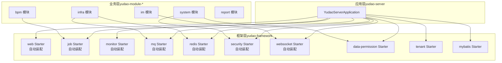
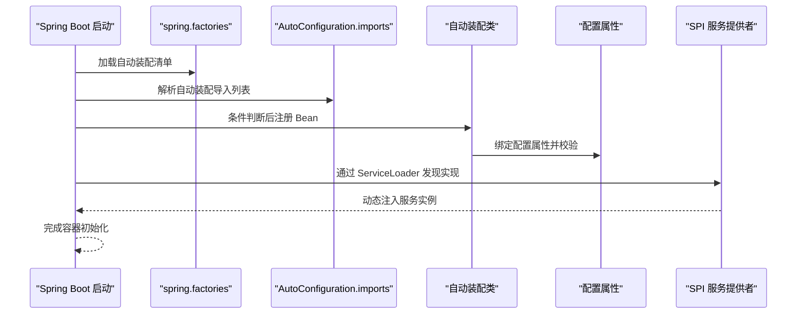
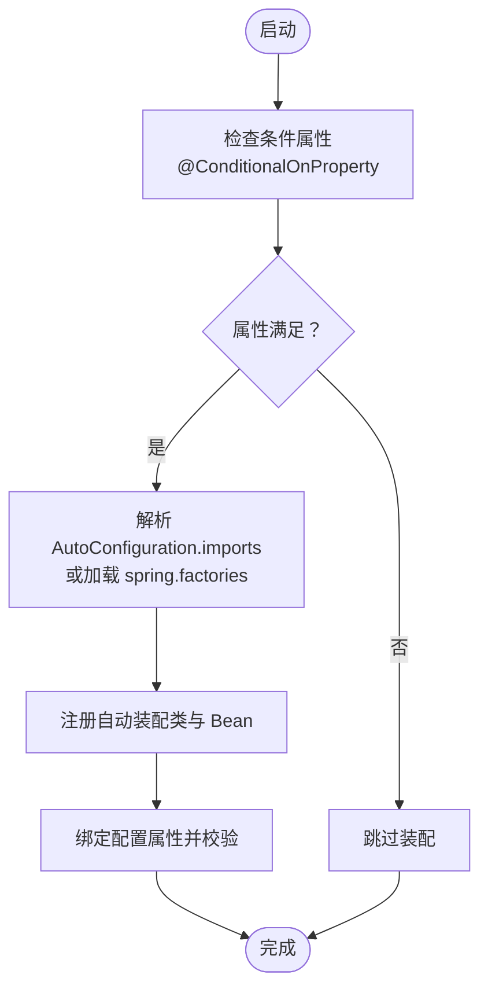
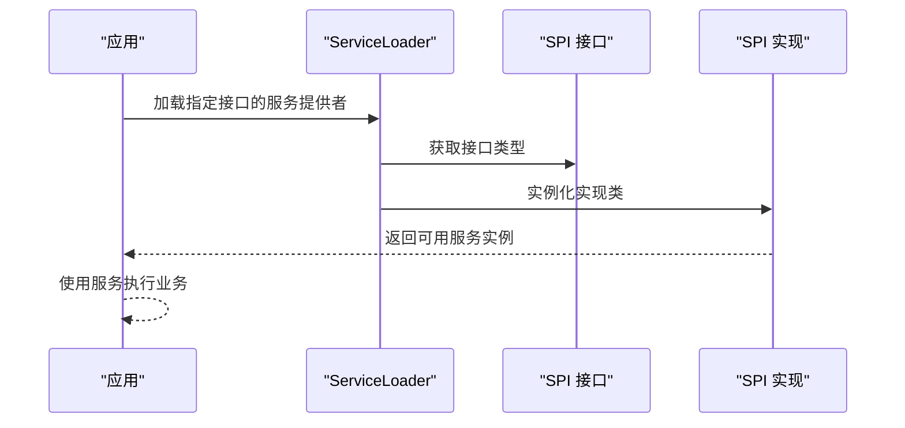
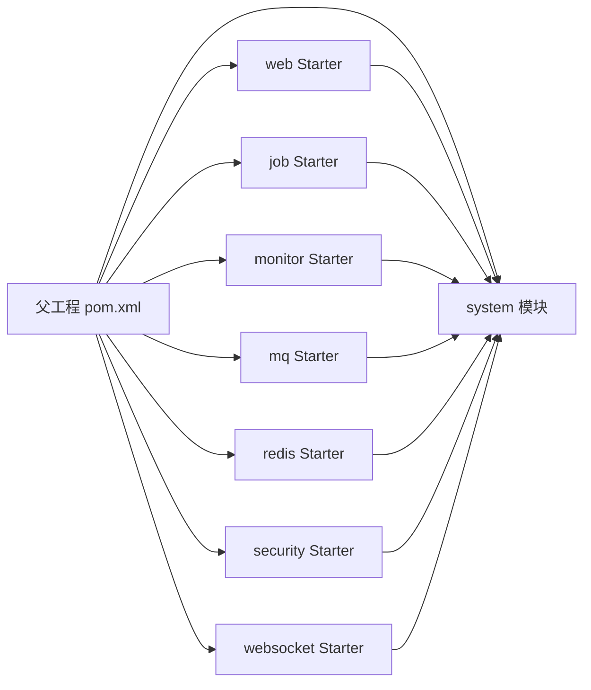

# 插件系统扩展

<cite>
**本文引用的文件**
- [pom.xml](file://pom.xml)
- [YudaoWebAutoConfiguration.java](file://yudao-framework/yudao-spring-boot-starter-web/src/main/java/cn/iocoder/yudao/framework/web/config/YudaoWebAutoConfiguration.java)
- [spring.factories（租户）](file://yudao-framework/yudao-spring-boot-starter-biz-tenant/src/main/resources/META-INF/spring.factories)
- [spring.factories（MyBatis）](file://yudao-framework/yudao-spring-boot-starter-mybatis/src/main/resources/META-INF/spring.factories)
- [AutoConfiguration.imports（定时任务）](file://yudao-framework/yudao-spring-boot-starter-job/src/main/resources/META-INF/spring/org.springframework.boot.autoconfigure.AutoConfiguration.imports)
- [AutoConfiguration.imports（监控）](file://yudao-framework/yudao-spring-boot-starter-monitor/src/main/resources/META-INF/spring/org.springframework.boot.autoconfigure.AutoConfiguration.imports)
- [AutoConfiguration.imports（消息队列）](file://yudao-framework/yudao-spring-boot-starter-mq/src/main/resources/META-INF/spring/org.springframework.boot.autoconfigure.AutoConfiguration.imports)
- [AutoConfiguration.imports（Redis）](file://yudao-framework/yudao-spring-boot-starter-redis/src/main/resources/META-INF/spring/org.springframework.boot.autoconfigure.AutoConfiguration.imports)
- [AutoConfiguration.imports（安全）](file://yudao-framework/yudao-spring-boot-starter-security/src/main/resources/META-INF/spring/org.springframework.boot.autoconfigure.AutoConfiguration.imports)
- [AutoConfiguration.imports（WebSocket）](file://yudao-framework/yudao-spring-boot-starter-websocket/src/main/resources/META-INF/spring/org.springframework.boot.autoconfigure.AutoConfiguration.imports)
- [CaptchaCacheService](file://yudao-module-system/src/main/resources/META-INF/services/com.anji.captcha.service.CaptchaCacheService)
- [CaptchaService](file://yudao-module-system/src/main/resources/META-INF/services/com.anji.captcha.service.CaptchaService)
</cite>

## 目录
1. [引言](#引言)
2. [项目结构](#项目结构)
3. [核心组件](#核心组件)
4. [架构总览](#架构总览)
5. [详细组件分析](#详细组件分析)
6. [依赖分析](#依赖分析)
7. [性能考虑](#性能考虑)
8. [故障排查指南](#故障排查指南)
9. [结论](#结论)
10. [附录](#附录)

## 引言
本文件面向“芋道 Ruoyi-Vue-Pro”项目的插件系统扩展，围绕 Spring Boot 自动装配机制进行深入讲解，涵盖条件装配、导入机制、META-INF 配置文件等自动装配技术；并基于现有 Starter 模块，给出自定义 Starter 的完整开发流程与最佳实践。同时，结合项目中已有的 SPI 服务提供者接口与动态加载能力，阐述插件注册与发现机制、插件配置管理（解析、绑定、验证、热更新）以及实战案例（消息队列、安全认证、数据权限），帮助开发者快速构建可扩展、可维护的插件体系。

## 项目结构
从仓库结构可见，项目采用多模块组织方式，核心框架位于 yudao-framework 下，包含大量 Spring Boot Starter 模块，覆盖业务能力如数据权限、租户、定时任务、监控、消息队列、Redis、安全、WebSocket 等。各模块通过 Maven 父工程统一管理版本与插件。

- 多模块分层清晰：framework 提供通用能力与 Starter，module 提供业务域实现，server 作为应用入口。
- 自动装配落地形式多样：既有传统的 spring.factories，也有 Spring Boot 3.x 推荐的 AutoConfiguration.imports 文件。
- SPI 服务提供者接口已在部分模块中使用，为插件化扩展提供了天然基础。

图表来源
- [pom.xml](file://pom.xml)
- [YudaoWebAutoConfiguration.java](file://yudao-framework/yudao-spring-boot-starter-web/src/main/java/cn/iocoder/yudao/framework/web/config/YudaoWebAutoConfiguration.java)

章节来源
- [pom.xml](file://pom.xml)

## 核心组件
- 条件装配与导入机制
  - @ConditionalOnProperty：根据配置项决定是否创建 Bean，如演示过滤器的启用。
  - @Import 与 AutoConfiguration.imports：声明自动装配类或导入配置，替代 spring.factories 的现代化方式。
  - spring.factories：传统自动装配清单，仍广泛存在于现有 Starter 中。
- SPI 服务提供者接口
  - 通过 META-INF/services 定义服务接口与实现，便于运行时动态加载与替换。
- 配置属性绑定与验证
  - 通过 @ConfigurationProperties 或 @EnableConfigurationProperties 进行属性绑定，配合 JSR-303 注解进行校验。
- 热更新与动态加载
  - 结合 Spring 容器生命周期与事件机制，实现配置变更后的 Bean 重建或刷新策略。

章节来源
- [YudaoWebAutoConfiguration.java](file://yudao-framework/yudao-spring-boot-starter-web/src/main/java/cn/iocoder/yudao/framework/web/config/YudaoWebAutoConfiguration.java)

## 架构总览
下图展示了插件系统在启动阶段的装配与加载路径，体现条件装配、SPI 发现与自动装配导入之间的协同关系：

图表来源
- [spring.factories（租户）](file://yudao-framework/yudao-spring-boot-starter-biz-tenant/src/main/resources/META-INF/spring.factories)
- [spring.factories（MyBatis）](file://yudao-framework/yudao-spring-boot-starter-mybatis/src/main/resources/META-INF/spring.factories)
- [AutoConfiguration.imports（定时任务）](file://yudao-framework/yudao-spring-boot-starter-job/src/main/resources/META-INF/spring/org.springframework.boot.autoconfigure.AutoConfiguration.imports)
- [AutoConfiguration.imports（监控）](file://yudao-framework/yudao-spring-boot-starter-monitor/src/main/resources/META-INF/spring/org.springframework.boot.autoconfigure.AutoConfiguration.imports)
- [AutoConfiguration.imports（消息队列）](file://yudao-framework/yudao-spring-boot-starter-mq/src/main/resources/META-INF/spring/org.springframework.boot.autoconfigure.AutoConfiguration.imports)
- [AutoConfiguration.imports（Redis）](file://yudao-framework/yudao-spring-boot-starter-redis/src/main/resources/META-INF/spring/org.springframework.boot.autoconfigure.AutoConfiguration.imports)
- [AutoConfiguration.imports（安全）](file://yudao-framework/yudao-spring-boot-starter-security/src/main/resources/META-INF/spring/org.springframework.boot.autoconfigure.AutoConfiguration.imports)
- [AutoConfiguration.imports（WebSocket）](file://yudao-framework/yudao-spring-boot-starter-websocket/src/main/resources/META-INF/spring/org.springframework.boot.autoconfigure.AutoConfiguration.imports)

## 详细组件分析

### 条件装配与导入机制
- @ConditionalOnProperty
  - 在 Web Starter 中，演示模式通过配置项控制过滤器 Bean 的创建，体现了“按需装配”的思想。
  - 典型路径参考：[YudaoWebAutoConfiguration.java](file://yudao-framework/yudao-spring-boot-starter-web/src/main/java/cn/iocoder/yudao/framework/web/config/YudaoWebAutoConfiguration.java)
- @Import 与 AutoConfiguration.imports
  - 新版 Starter 更推荐使用 AutoConfiguration.imports 替代 spring.factories，提升性能与可读性。
  - 参考文件：
    - [AutoConfiguration.imports（定时任务）](file://yudao-framework/yudao-spring-boot-starter-job/src/main/resources/META-INF/spring/org.springframework.boot.autoconfigure.AutoConfiguration.imports)
    - [AutoConfiguration.imports（监控）](file://yudao-framework/yudao-spring-boot-starter-monitor/src/main/resources/META-INF/spring/org.springframework.boot.autoconfigure.AutoConfiguration.imports)
    - [AutoConfiguration.imports（消息队列）](file://yudao-framework/yudao-spring-boot-starter-mq/src/main/resources/META-INF/spring/org.springframework.boot.autoconfigure.AutoConfiguration.imports)
    - [AutoConfiguration.imports（Redis）](file://yudao-framework/yudao-spring-boot-starter-redis/src/main/resources/META-INF/spring/org.springframework.boot.autoconfigure.AutoConfiguration.imports)
    - [AutoConfiguration.imports（安全）](file://yudao-framework/yudao-spring-boot-starter-security/src/main/resources/META-INF/spring/org.springframework.boot.autoconfigure.AutoConfiguration.imports)
    - [AutoConfiguration.imports（WebSocket）](file://yudao-framework/yudao-spring-boot-starter-websocket/src/main/resources/META-INF/spring/org.springframework.boot.autoconfigure.AutoConfiguration.imports)
- spring.factories
  - 传统自动装配清单，仍可在部分 Starter 中看到，兼容旧版本或第三方集成场景。
  - 参考文件：
    - [spring.factories（租户）](file://yudao-framework/yudao-spring-boot-starter-biz-tenant/src/main/resources/META-INF/spring.factories)
    - [spring.factories（MyBatis）](file://yudao-framework/yudao-spring-boot-starter-mybatis/src/main/resources/META-INF/spring.factories)

图表来源
- [YudaoWebAutoConfiguration.java](file://yudao-framework/yudao-spring-boot-starter-web/src/main/java/cn/iocoder/yudao/framework/web/config/YudaoWebAutoConfiguration.java)
- [AutoConfiguration.imports（消息队列）](file://yudao-framework/yudao-spring-boot-starter-mq/src/main/resources/META-INF/spring/org.springframework.boot.autoconfigure.AutoConfiguration.imports)
- [spring.factories（租户）](file://yudao-framework/yudao-spring-boot-starter-biz-tenant/src/main/resources/META-INF/spring.factories)

章节来源
- [YudaoWebAutoConfiguration.java](file://yudao-framework/yudao-spring-boot-starter-web/src/main/java/cn/iocoder/yudao/framework/web/config/YudaoWebAutoConfiguration.java)
- [AutoConfiguration.imports（消息队列）](file://yudao-framework/yudao-spring-boot-starter-mq/src/main/resources/META-INF/spring/org.springframework.boot.autoconfigure.AutoConfiguration.imports)
- [spring.factories（租户）](file://yudao-framework/yudao-spring-boot-starter-biz-tenant/src/main/resources/META-INF/spring.factories)

### SPI 服务提供者接口与动态加载
- 项目在 system 模块中通过 META-INF/services 定义了 CaptchaService 与 CaptchaCacheService 的 SPI 接口与实现，体现了插件化的服务替换能力。
- 运行时可通过 ServiceLoader 自动发现并注入对应实现，实现“插件即服务”的注册与发现。

图表来源
- [CaptchaCacheService](file://yudao-module-system/src/main/resources/META-INF/services/com.anji.captcha.service.CaptchaCacheService)
- [CaptchaService](file://yudao-module-system/src/main/resources/META-INF/services/com.anji.captcha.service.CaptchaService)

章节来源
- [CaptchaCacheService](file://yudao-module-system/src/main/resources/META-INF/services/com.anji.captcha.service.CaptchaCacheService)
- [CaptchaService](file://yudao-module-system/src/main/resources/META-INF/services/com.anji.captcha.service.CaptchaService)

### 配置属性绑定与验证
- 属性绑定
  - 通过 @ConfigurationProperties 或 @EnableConfigurationProperties 将配置文件中的键值映射到对象，简化配置管理。
- 配置验证
  - 结合 JSR-303 注解（如 @NotNull、@NotBlank 等）对配置进行运行期校验，避免非法配置导致的运行时异常。
- 热更新
  - 对于需要热生效的配置，建议结合 @RefreshScope 或事件监听，在配置变更时触发 Bean 重建或刷新策略。

章节来源
- [YudaoWebAutoConfiguration.java](file://yudao-framework/yudao-spring-boot-starter-web/src/main/java/cn/iocoder/yudao/framework/web/config/YudaoWebAutoConfiguration.java)

### 自定义 Starter 开发流程
- 模块设计
  - 将公共能力封装为独立模块，对外暴露 API 与自动装配类，内部实现细节对使用者透明。
- 依赖管理
  - 在父工程中统一版本与插件配置，确保依赖一致性与构建稳定性。
- 配置属性绑定
  - 定义配置类，使用 @ConfigurationProperties 绑定命名空间下的属性。
- 条件装配
  - 使用 @ConditionalOnProperty、@ConditionalOnClass 等注解，按需启用功能。
- 自动装配导入
  - 推荐使用 AutoConfiguration.imports 声明自动装配类，兼顾性能与可读性。
- 测试与文档
  - 提供最小可运行示例与集成测试，配套开发指南与最佳实践。

章节来源
- [pom.xml](file://pom.xml)
- [AutoConfiguration.imports（安全）](file://yudao-framework/yudao-spring-boot-starter-security/src/main/resources/META-INF/spring/org.springframework.boot.autoconfigure.AutoConfiguration.imports)

## 依赖分析
- 组件耦合
  - 各 Starter 之间低耦合，通过配置与 SPI 实现横向扩展。
- 外部依赖
  - Starter 依赖 Spring Boot 自动装配基础设施与第三方库，版本由父工程统一管理。
- 循环依赖
  - 通过模块拆分与接口抽象避免循环依赖风险。

图表来源
- [pom.xml](file://pom.xml)

章节来源
- [pom.xml](file://pom.xml)

## 性能考虑
- 自动装配扫描优化
  - 使用 AutoConfiguration.imports 替代 spring.factories，减少不必要的类加载与反射开销。
- 条件装配
  - 合理使用 @ConditionalOnProperty 与 @ConditionalOnClass，避免无用 Bean 的创建与初始化。
- SPI 发现
  - 控制 SPI 实现数量与加载时机，必要时延迟初始化以降低启动时间。
- 配置热更新
  - 对热更新配置采用增量刷新策略，避免全量重建带来的抖动。

## 故障排查指南
- 自动装配未生效
  - 检查 AutoConfiguration.imports 或 spring.factories 是否正确放置与命名。
  - 确认条件注解（如 @ConditionalOnProperty）的属性值是否匹配。
- SPI 未发现实现
  - 确认 META-INF/services 文件名与接口全限定名一致，实现类在打包后可见。
- 配置绑定失败
  - 核对配置文件键名与 @ConfigurationProperties 绑定的命名空间是否一致，检查必填字段是否缺失。
- 启动耗时过长
  - 分析自动装配类数量与初始化逻辑，评估是否可拆分为按需装配或延迟初始化。

章节来源
- [YudaoWebAutoConfiguration.java](file://yudao-framework/yudao-spring-boot-starter-web/src/main/java/cn/iocoder/yudao/framework/web/config/YudaoWebAutoConfiguration.java)
- [spring.factories（租户）](file://yudao-framework/yudao-spring-boot-starter-biz-tenant/src/main/resources/META-INF/spring.factories)
- [AutoConfiguration.imports（监控）](file://yudao-framework/yudao-spring-boot-starter-monitor/src/main/resources/META-INF/spring/org.springframework.boot.autoconfigure.AutoConfiguration.imports)

## 结论
通过条件装配、自动装配导入与 SPI 服务发现，芋道 Ruoyi-Vue-Pro 已具备良好的插件化扩展基础。结合统一的配置绑定与验证机制，以及对热更新与性能的关注，开发者可以高效地构建消息队列、安全认证、数据权限等插件模块，并将其无缝集成到现有系统中。建议在后续迭代中逐步迁移至 AutoConfiguration.imports，完善插件注册表与动态加载能力，进一步增强系统的可扩展性与可维护性。

## 附录
- 实战案例建议
  - 消息队列插件：基于 yudao-spring-boot-starter-mq，新增 RabbitMQ/Redis/EventBus 等实现的条件装配与 SPI 注册。
  - 安全认证插件：基于 yudao-spring-boot-starter-security，新增 JWT/OAuth2/CAS 等认证实现的自动装配与切换。
  - 数据权限插件：基于 yudao-spring-boot-starter-biz-data-permission，新增多租户/行级权限的 SPI 扩展与动态规则加载。
- 最佳实践
  - 明确插件边界与职责，避免过度耦合。
  - 提供默认实现与可替换接口，保证向后兼容。
  - 编写完善的单元测试与集成测试，确保插件质量。
  - 提供清晰的配置文档与迁移指南，降低接入成本。