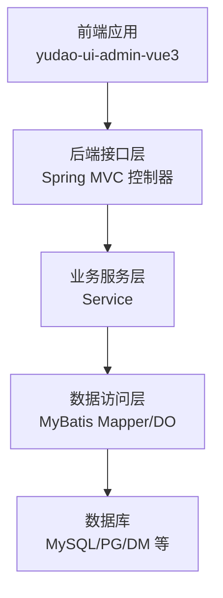
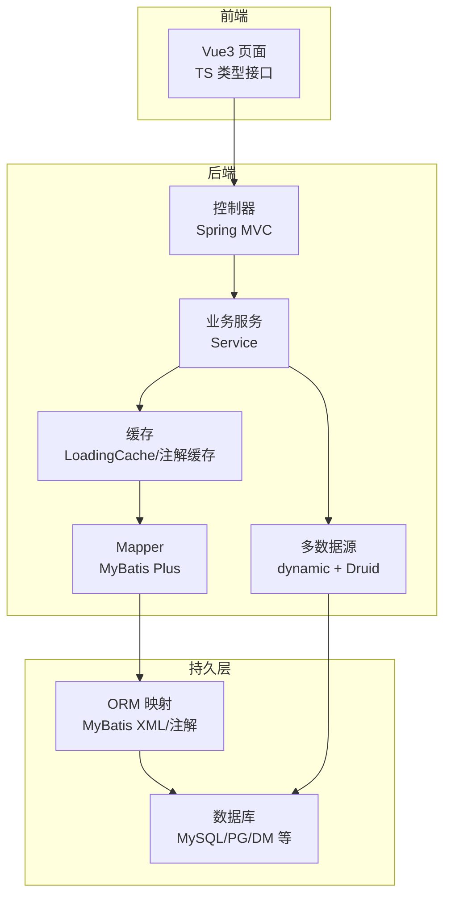
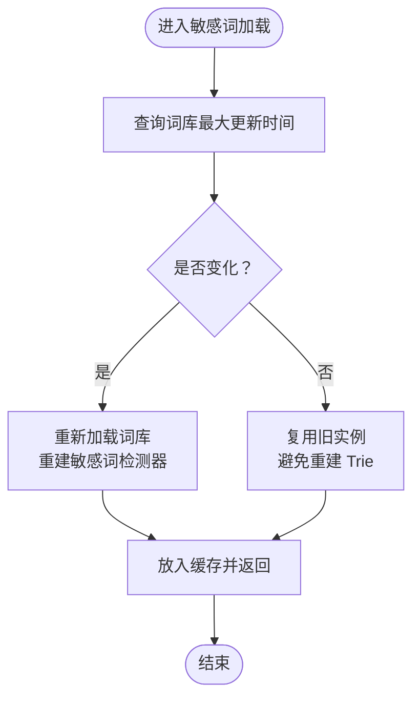
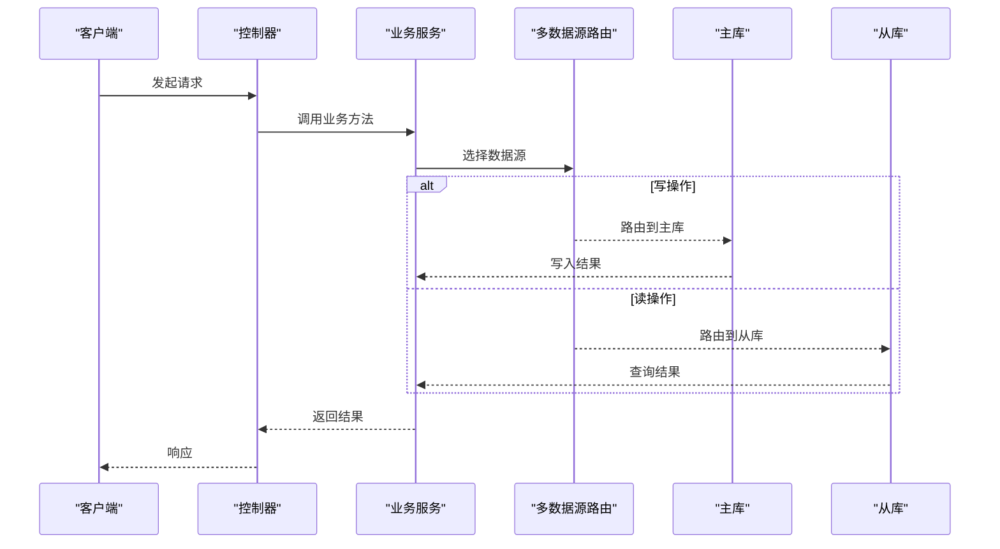
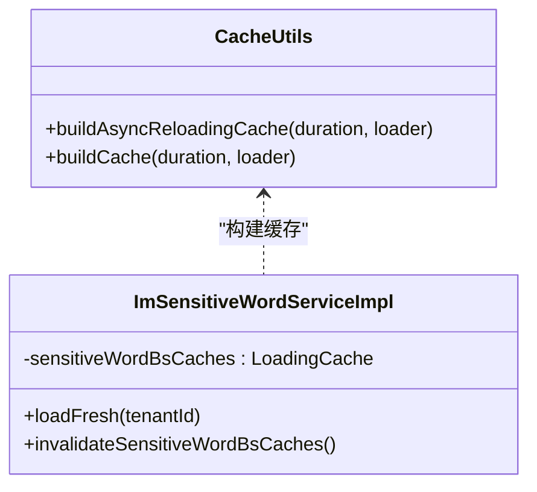
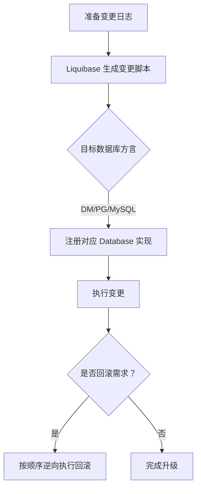
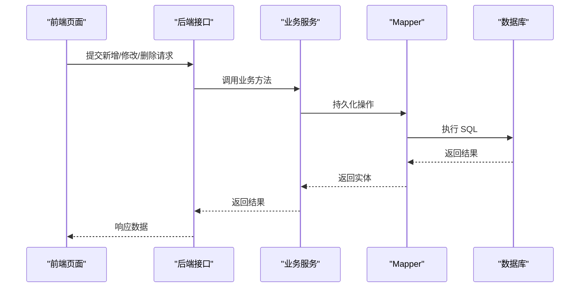
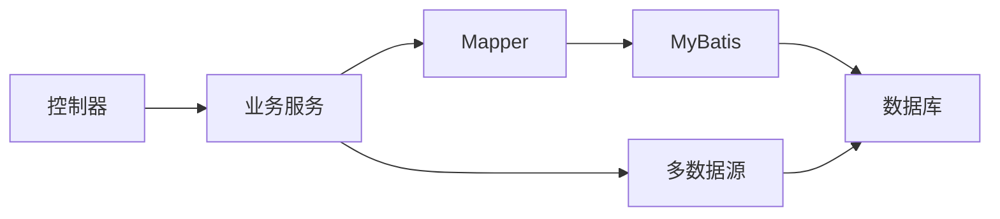

# 数据模型扩展

<cite>
**本文引用的文件**
- [application-dev.yaml](file://yudao-server/src/main/resources/application-dev.yaml)
- [BaseDO.java](file://yudao-framework/yudao-spring-boot-starter-mybatis/src/main/java/cn/iocoder/yudao/framework/mybatis/core/dataobject/BaseDO.java)
- [BaseMapperX.java](file://yudao-framework/yudao-spring-boot-starter-mybatis/src/main/java/cn/iocoder/yudao/framework/mybatis/core/mapper/BaseMapperX.java)
- [do.vm](file://yudao-module-infra/src/main/resources/codegen/java/dal/do.vm)
- [mapper.xml.vm](file://yudao-module-infra/src/main/resources/codegen/java/dal/mapper.xml.vm)
- [saveReqVO.vm](file://yudao-module-infra/src/main/resources/codegen/java/controller/vo/saveReqVO.vm)
- [h2.vm](file://yudao-module-infra/src/main/resources/codegen/sql/h2.vm)
- [api.ts.vm](file://yudao-module-infra/src/main/resources/codegen/vue3/api/api.ts.vm)
- [Index.ts](file://yudao-ui/yudao-ui-admin-vue3/src/api/infra/dataSourceConfig/index.ts)
- [CacheUtils.java](file://yudao-framework/yudao-common/src/main/java/cn/iocoder/yudao/framework/common/util/cache/CacheUtils.java)
- [ImSensitiveWordServiceImpl.java](file://yudao-module-im/src/main/java/cn/iocoder/yudao/module/im/service/sensitiveword/ImSensitiveWordServiceImpl.java)
- [ImSensitiveWordDO.java](file://yudao-module-im/src/main/java/cn/iocoder/yudao/module/im/dal/dataobject/sensitiveword/ImSensitiveWordDO.java)
- [AbstractEngineConfiguration.java](file://sql/dm/flowable-patch/src/main/java/org/flowable/common/engine/impl/AbstractEngineConfiguration.java)
- [DmDatabase.java](file://sql/dm/flowable-patch/src/main/java/liquibase/database/core/DmDatabase.java)
- [README.md](file://sql/tools/README.md)
</cite>

## 目录
1. [简介](#简介)
2. [项目结构](#项目结构)
3. [核心组件](#核心组件)
4. [架构总览](#架构总览)
5. [详细组件分析](#详细组件分析)
6. [依赖分析](#依赖分析)
7. [性能考虑](#性能考虑)
8. [故障排查指南](#故障排查指南)
9. [结论](#结论)
10. [附录](#附录)

## 简介
本指南面向在芋道 ruoyi-vue-pro 中进行数据模型扩展的开发者，围绕实体类设计、数据库表扩展、MyBatis 映射配置、多数据源与读写分离、缓存策略、数据迁移与版本管理、数据访问层优化、数据安全与脱敏等方面，提供从理论到实践的完整方法论与最佳实践。文档同时给出可落地的开发案例与性能优化建议，帮助你在保持系统一致性的同时提升可维护性与性能。

## 项目结构
- 后端采用模块化分层：基础框架层（yudao-framework）、业务模块层（如 system、infra、bpm、im 等）、服务启动层（yudao-server）。
- 数据访问层以 MyBatis Plus 为核心，结合代码生成模板快速产出实体、Mapper、XML、前端 TS 类型与后端 VO。
- 前端通过 axios 请求对接后端接口，接口定义位于 yudao-ui-admin-vue3 的 api 目录。

图示来源
- [application-dev.yaml:1-37](file://yudao-server/src/main/resources/application-dev.yaml#L1-L37)

章节来源
- [application-dev.yaml:1-37](file://yudao-server/src/main/resources/application-dev.yaml#L1-L37)

## 核心组件
- 实体基类与通用 Mapper
  - 实体基类 BaseDO 提供通用字段（如创建人、更新人、创建时间、更新时间、租户等），确保各业务实体具备一致的审计与隔离能力。
  - BaseMapperX 提供通用 CRUD 与 FOR UPDATE 锁定能力，便于在事务中安全锁定记录。
- 代码生成模板
  - DO 模板：生成实体类、MyBatis 注解、Lombok 组合注解等。
  - Mapper XML 模板：生成命名空间与注释，按需扩展复杂 SQL。
  - VO/SaveReq 模板：生成控制器参数校验注解与接口类型。
  - SQL 模板：生成 H2 测试表结构，便于单元测试与本地验证。
  - 前端 TS 接口模板：生成 API 返回/请求类型定义。
- 多数据源与读写分离
  - 通过 application-dev.yaml 中 dynamic 配置启用多数据源与 Druid 连接池参数，支持读写分离与高可用。
- 缓存策略
  - 本地缓存工具 CacheUtils 提供同步/异步刷新 LoadingCache，结合业务 Service 的缓存注解实现缓存一致性与失效控制。
- 敏感词与脱敏
  - IM 模块提供敏感词服务，结合本地缓存与定时刷新，保障实时性与一致性。

章节来源
- [BaseDO.java:1-200](file://yudao-framework/yudao-spring-boot-starter-mybatis/src/main/java/cn/iocoder/yudao/framework/mybatis/core/dataobject/BaseDO.java#L1-L200)
- [BaseMapperX.java:122-145](file://yudao-framework/yudao-spring-boot-starter-mybatis/src/main/java/cn/iocoder/yudao/framework/mybatis/core/mapper/BaseMapperX.java#L122-L145)
- [do.vm:1-46](file://yudao-module-infra/src/main/resources/codegen/java/dal/do.vm#L1-L46)
- [mapper.xml.vm:1-12](file://yudao-module-infra/src/main/resources/codegen/java/dal/mapper.xml.vm#L1-L12)
- [saveReqVO.vm:31-64](file://yudao-module-infra/src/main/resources/codegen/java/controller/vo/saveReqVO.vm#L31-L64)
- [h2.vm:1-37](file://yudao-module-infra/src/main/resources/codegen/sql/h2.vm#L1-L37)
- [api.ts.vm:25-54](file://yudao-module-infra/src/main/resources/codegen/vue3/api/api.ts.vm#L25-L54)
- [application-dev.yaml:1-37](file://yudao-server/src/main/resources/application-dev.yaml#L1-L37)
- [CacheUtils.java:1-61](file://yudao-framework/yudao-common/src/main/java/cn/iocoder/yudao/framework/common/util/cache/CacheUtils.java#L1-L61)
- [ImSensitiveWordServiceImpl.java:78-81](file://yudao-module-im/src/main/java/cn/iocoder/yudao/module/im/service/sensitiveword/ImSensitiveWordServiceImpl.java#L78-L81)
- [ImSensitiveWordDO.java:1-41](file://yudao-module-im/src/main/java/cn/iocoder/yudao/module/im/dal/dataobject/sensitiveword/ImSensitiveWordDO.java#L1-L41)

## 架构总览
下图展示从前端到数据库的整体链路，以及多数据源与缓存的关键节点。

图示来源
- [application-dev.yaml:32-37](file://yudao-server/src/main/resources/application-dev.yaml#L32-L37)
- [BaseMapperX.java:122-145](file://yudao-framework/yudao-spring-boot-starter-mybatis/src/main/java/cn/iocoder/yudao/framework/mybatis/core/mapper/BaseMapperX.java#L122-L145)
- [CacheUtils.java:37-59](file://yudao-framework/yudao-common/src/main/java/cn/iocoder/yudao/framework/common/util/cache/CacheUtils.java#L37-L59)

## 详细组件分析

### 实体类设计与关系映射
- 设计原则
  - 统一继承 BaseDO，确保审计字段与租户隔离字段一致。
  - 使用 MyBatis Plus 注解标注表名、序列或自增策略，兼容 Oracle/PG/DM/H2 等数据库。
  - 对于非表字段，使用 @TableField(exist=false) 标识，避免参与持久化。
- 关系映射
  - 主子表：通过模板生成的 VO/DO 字段承载子表集合或单对象，便于前端树形/表格渲染。
  - 外键关系：建议在数据库层面建立外键约束，在实体层面通过字段与注解表达映射，避免硬编码 SQL。
- 复杂逻辑流程（敏感词加载与缓存刷新）

图示来源
- [ImSensitiveWordServiceImpl.java:78-81](file://yudao-module-im/src/main/java/cn/iocoder/yudao/module/im/service/sensitiveword/ImSensitiveWordServiceImpl.java#L78-L81)
- [ImSensitiveWordServiceImpl.java:164-170](file://yudao-module-im/src/main/java/cn/iocoder/yudao/module/im/service/sensitiveword/ImSensitiveWordServiceImpl.java#L164-L170)
- [CacheUtils.java:37-59](file://yudao-framework/yudao-common/src/main/java/cn/iocoder/yudao/framework/common/util/cache/CacheUtils.java#L37-L59)

章节来源
- [BaseDO.java:1-200](file://yudao-framework/yudao-spring-boot-starter-mybatis/src/main/java/cn/iocoder/yudao/framework/mybatis/core/dataobject/BaseDO.java#L1-L200)
- [do.vm:33-34](file://yudao-module-infra/src/main/resources/codegen/java/dal/do.vm#L33-L34)
- [saveReqVO.vm:31-64](file://yudao-module-infra/src/main/resources/codegen/java/controller/vo/saveReqVO.vm#L31-L64)
- [ImSensitiveWordDO.java:15-23](file://yudao-module-im/src/main/java/cn/iocoder/yudao/module/im/dal/dataobject/sensitiveword/ImSensitiveWordDO.java#L15-L23)

### 数据库表扩展方法
- 表结构设计
  - 使用 H2 模板生成建表 SQL，统一字段类型与默认值，便于本地与测试环境一致性。
  - 主键策略：优先使用数据库自增或序列，兼容 Oracle/PG/DM/H2 等。
  - 审计字段：统一包含 create_time、update_time、creator、updater、deleted、tenant_id 等。
- 索引优化
  - 唯一索引：对业务唯一键（如账号、编号）建立唯一索引。
  - 聚集索引：将高频查询条件前置，减少回表。
  - 复合索引：针对常见 WHERE/JOIN 条件组合建立复合索引。
- 约束配置
  - 非空约束：对必填字段设置 NOT NULL。
  - 外键约束：在数据库层面约束父子关系，保证数据一致性。
- 清理脚本
  - 生成测试清理 SQL，便于回归测试与本地初始化。

章节来源
- [h2.vm:1-37](file://yudao-module-infra/src/main/resources/codegen/sql/h2.vm#L1-L37)

### MyBatis 映射配置扩展
- XML 映射文件
  - 命名空间与 DAO 接口保持一致，遵循模块+业务域组织。
  - 优先使用通用 Mapper 进行 CRUD；复杂联表查询再补充 XML。
- 注解映射
  - 实体类使用 @TableName/@KeySequence 等注解，简化映射配置。
- 动态 SQL 构建
  - 使用 MyBatisX 插件生成常用查询，复杂条件通过动态 SQL 组合，注意绑定参数与 SQL 注入防护。
- 事务与锁
  - 在需要强一致的场景使用 FOR UPDATE，配合 BaseMapperX 的 selectOneForUpdate 方法。

章节来源
- [mapper.xml.vm:1-12](file://yudao-module-infra/src/main/resources/codegen/java/dal/mapper.xml.vm#L1-L12)
- [do.vm:33-34](file://yudao-module-infra/src/main/resources/codegen/java/dal/do.vm#L33-L34)
- [BaseMapperX.java:122-145](file://yudao-framework/yudao-spring-boot-starter-mybatis/src/main/java/cn/iocoder/yudao/framework/mybatis/core/mapper/BaseMapperX.java#L122-L145)

### 多数据源配置与使用
- 读写分离
  - 在 application-dev.yaml 中配置 dynamic 多数据源，设置读写分离规则与连接池参数。
  - 通过注解或路由策略选择数据源，保证写操作走主库、读操作走从库。
- 数据路由
  - 建议在 Service 层显式声明数据源，避免跨模块误用默认数据源。
- 事务管理
  - 在分布式事务场景下，确保同一事务内的读写在同一数据源上执行。

图示来源
- [application-dev.yaml:32-37](file://yudao-server/src/main/resources/application-dev.yaml#L32-L37)

章节来源
- [application-dev.yaml:1-37](file://yudao-server/src/main/resources/application-dev.yaml#L1-L37)

### 缓存策略扩展
- 二级缓存配置
  - 使用 CacheUtils 构建 LoadingCache，支持同步/异步刷新，设置合理的过期时间与容量上限。
- 缓存失效
  - 写操作后主动失效本地缓存，结合定时刷新实现多实例一致性收敛。
- 缓存一致性
  - 通过“变更即失效 + 定时刷新”的双策略，平衡实时性与性能。

图示来源
- [CacheUtils.java:37-59](file://yudao-framework/yudao-common/src/main/java/cn/iocoder/yudao/framework/common/util/cache/CacheUtils.java#L37-L59)
- [ImSensitiveWordServiceImpl.java:78-81](file://yudao-module-im/src/main/java/cn/iocoder/yudao/module/im/service/sensitiveword/ImSensitiveWordServiceImpl.java#L78-L81)

章节来源
- [CacheUtils.java:1-61](file://yudao-framework/yudao-common/src/main/java/cn/iocoder/yudao/framework/common/util/cache/CacheUtils.java#L1-L61)
- [ImSensitiveWordServiceImpl.java:78-81](file://yudao-module-im/src/main/java/cn/iocoder/yudao/module/im/service/sensitiveword/ImSensitiveWordServiceImpl.java#L78-L81)

### 数据迁移与版本管理
- Liquibase 使用
  - 通过自定义 Database 实现（如 DmDatabase）适配特定数据库方言，确保变更日志正确生成与执行。
  - 在不同数据库平台注册对应的 Liquibase 数据库实现，避免方言差异导致的迁移失败。
- 版本升级与回滚
  - 变更日志按模块拆分，升级前先备份，回滚时按顺序逆向执行变更。
- MyBatis 集成
  - AbstractEngineConfiguration 中对 MyBatis 的初始化、拦截器与 XML Mapper 的解析，体现了框架对 MyBatis 的深度集成，便于在迁移过程中统一管理 SQL 与类型处理器。

图示来源
- [DmDatabase.java:207-245](file://sql/dm/flowable-patch/src/main/java/liquibase/database/core/DmDatabase.java#L207-L245)
- [AbstractEngineConfiguration.java:833-876](file://sql/dm/flowable-patch/src/main/java/org/flowable/common/engine/impl/AbstractEngineConfiguration.java#L833-L876)

章节来源
- [DmDatabase.java:207-245](file://sql/dm/flowable-patch/src/main/java/liquibase/database/core/DmDatabase.java#L207-L245)
- [AbstractEngineConfiguration.java:833-876](file://sql/dm/flowable-patch/src/main/java/org/flowable/common/engine/impl/AbstractEngineConfiguration.java#L833-L876)
- [README.md:1-200](file://sql/tools/README.md#L1-L200)

### 数据访问层优化技巧
- 批量操作
  - 使用 MyBatis Plus 的批量插入/更新能力，合理分批提交，避免单次事务过大。
- 延迟加载
  - 对大字段或低频字段采用延迟加载，减少网络传输与序列化开销。
- 查询优化
  - 使用 BaseMapperX 的 selectPage/selectList 等方法，配合分页与索引，避免全表扫描。
  - 对热点查询使用缓存，结合弱一致策略降低数据库压力。

章节来源
- [BaseMapperX.java:122-145](file://yudao-framework/yudao-spring-boot-starter-mybatis/src/main/java/cn/iocoder/yudao/framework/mybatis/core/mapper/BaseMapperX.java#L122-L145)

### 数据安全与脱敏处理
- 敏感数据加密
  - 建议对密码、身份证、银行卡等敏感字段在入库前进行加密存储。
- 访问控制
  - 结合权限模块与数据权限，限制用户对敏感数据的访问范围。
- 脱敏策略
  - 在返回给前端的数据中对敏感字段进行脱敏处理（如隐藏中间位），避免泄露。

章节来源
- [ImSensitiveWordServiceImpl.java:28-49](file://yudao-module-im/src/main/java/cn/iocoder/yudao/module/im/service/sensitiveword/ImSensitiveWordServiceImpl.java#L28-L49)

### 开发案例：新增数据源配置接口
- 前端接口定义
  - 在 yudao-ui-admin-vue3 的 api 目录下新增数据源配置接口，定义请求/响应类型。
- 后端接口
  - 控制器接收请求，调用 Service 完成新增/修改/删除/列表查询。
- 数据模型
  - 使用代码生成模板生成 DO、Mapper、XML 与 VO，确保前后端类型一致。

图示来源
- [Index.ts:1-40](file://yudao-ui/yudao-ui-admin-vue3/src/api/infra/dataSourceConfig/index.ts#L1-L40)

章节来源
- [Index.ts:1-40](file://yudao-ui/yudao-ui-admin-vue3/src/api/infra/dataSourceConfig/index.ts#L1-L40)
- [do.vm:1-46](file://yudao-module-infra/src/main/resources/codegen/java/dal/do.vm#L1-L46)
- [mapper.xml.vm:1-12](file://yudao-module-infra/src/main/resources/codegen/java/dal/mapper.xml.vm#L1-L12)
- [saveReqVO.vm:31-64](file://yudao-module-infra/src/main/resources/codegen/java/controller/vo/saveReqVO.vm#L31-L64)
- [api.ts.vm:25-54](file://yudao-module-infra/src/main/resources/codegen/vue3/api/api.ts.vm#L25-L54)

## 依赖分析
- 组件耦合
  - 控制器依赖 Service；Service 依赖 Mapper；Mapper 依赖 MyBatis 与数据库。
  - 多数据源通过路由策略解耦业务与数据源选择。
- 外部依赖
  - MyBatis Plus、Druid、Liquibase、Guava Cache 等。

图示来源
- [application-dev.yaml:32-37](file://yudao-server/src/main/resources/application-dev.yaml#L32-L37)
- [BaseMapperX.java:122-145](file://yudao-framework/yudao-spring-boot-starter-mybatis/src/main/java/cn/iocoder/yudao/framework/mybatis/core/mapper/BaseMapperX.java#L122-L145)

章节来源
- [application-dev.yaml:1-37](file://yudao-server/src/main/resources/application-dev.yaml#L1-L37)
- [BaseMapperX.java:122-145](file://yudao-framework/yudao-spring-boot-starter-mybatis/src/main/java/cn/iocoder/yudao/framework/mybatis/core/mapper/BaseMapperX.java#L122-L145)

## 性能考虑
- 连接池与多数据源
  - 合理设置初始/最小/最大连接数与等待时间，避免高并发下的连接争用。
- SQL 优化
  - 使用索引覆盖、避免 N+1 查询、分页查询限制结果集大小。
- 缓存策略
  - 对热点数据使用本地缓存，结合异步刷新与失效策略，降低数据库压力。
- 批处理
  - 大批量写入时分批提交，避免长事务与锁竞争。

## 故障排查指南
- SQL 执行慢
  - 检查慢 SQL 日志（Druid 配置），定位未命中索引或全表扫描的查询。
- 缓存不生效
  - 确认缓存键是否正确、过期时间是否过短、是否在写后主动失效。
- 多数据源切换异常
  - 核对路由规则与注解使用，确保事务内数据源一致。
- 敏感词检测异常
  - 检查缓存刷新周期与词库变更是否触发失效，确认 Trie 是否重建成功。

章节来源
- [application-dev.yaml:14-31](file://yudao-server/src/main/resources/application-dev.yaml#L14-L31)
- [CacheUtils.java:37-59](file://yudao-framework/yudao-common/src/main/java/cn/iocoder/yudao/framework/common/util/cache/CacheUtils.java#L37-L59)
- [ImSensitiveWordServiceImpl.java:164-170](file://yudao-module-im/src/main/java/cn/iocoder/yudao/module/im/service/sensitiveword/ImSensitiveWordServiceImpl.java#L164-L170)

## 结论
通过统一的实体基类、完善的代码生成模板、灵活的多数据源与缓存策略、规范的迁移与版本管理，以及面向性能的访问层优化与安全脱敏机制，可以在 ruoyi-vue-pro 上高效地扩展数据模型。建议在新功能开发中严格遵循本文的规范与流程，确保系统的可维护性、一致性与高性能。

## 附录
- 前端接口类型生成
  - 使用 Vue3 模板生成 TS 类型，确保与后端 VO/DO 字段一致。
- 数据库方言适配
  - 通过自定义 Database 实现适配 DM/PG/MySQL 等，确保 Liquibase 正确生成 SQL。

章节来源
- [api.ts.vm:25-54](file://yudao-module-infra/src/main/resources/codegen/vue3/api/api.ts.vm#L25-L54)
- [DmDatabase.java:207-245](file://sql/dm/flowable-patch/src/main/java/liquibase/database/core/DmDatabase.java#L207-L245)