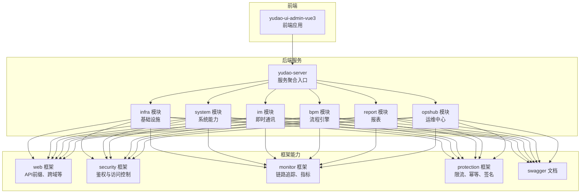
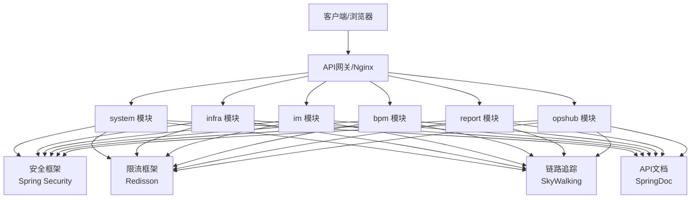
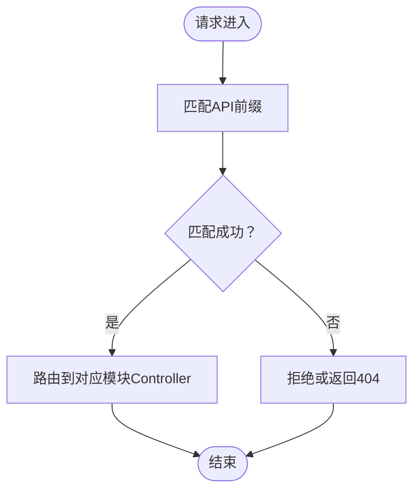
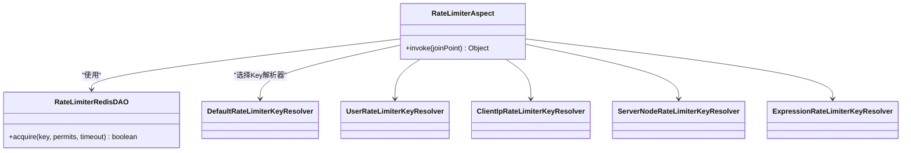
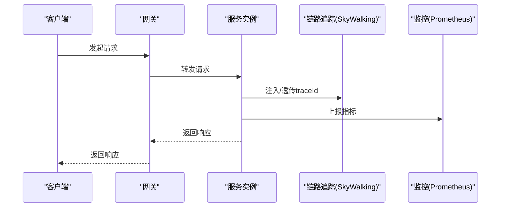
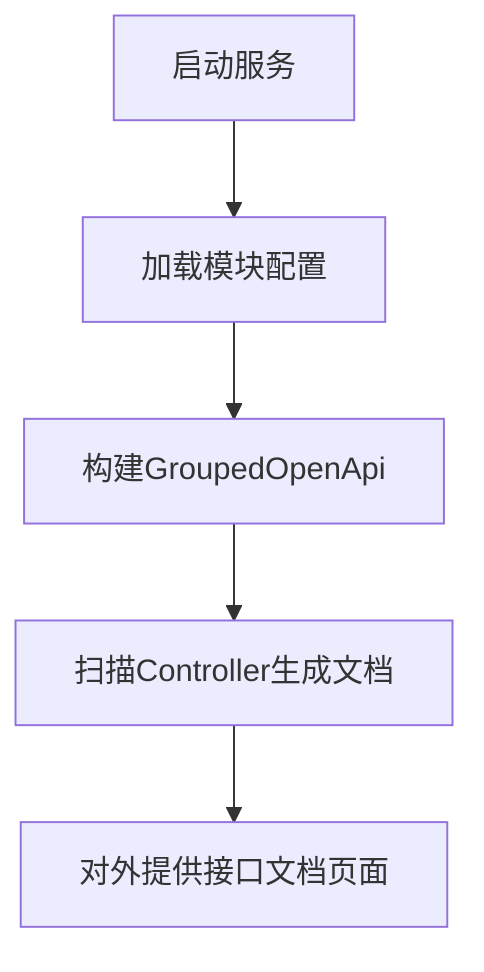
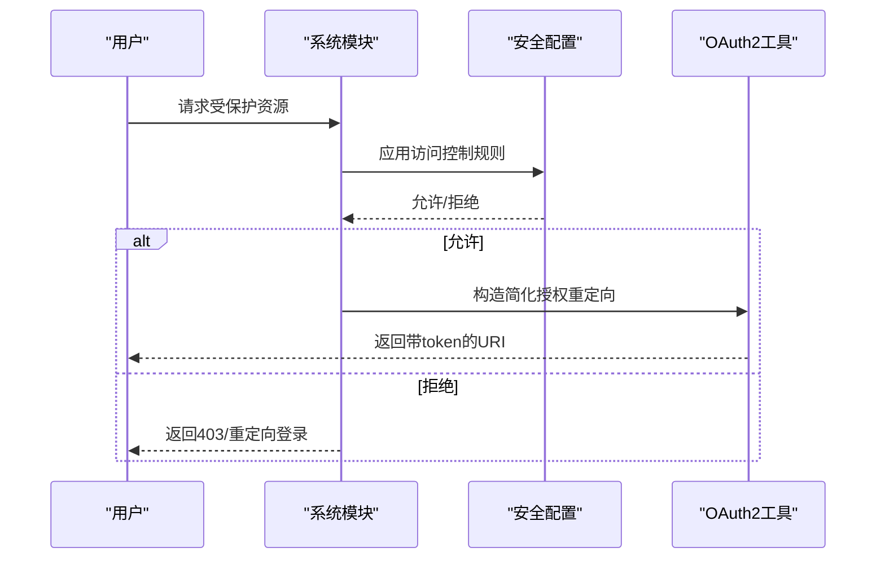
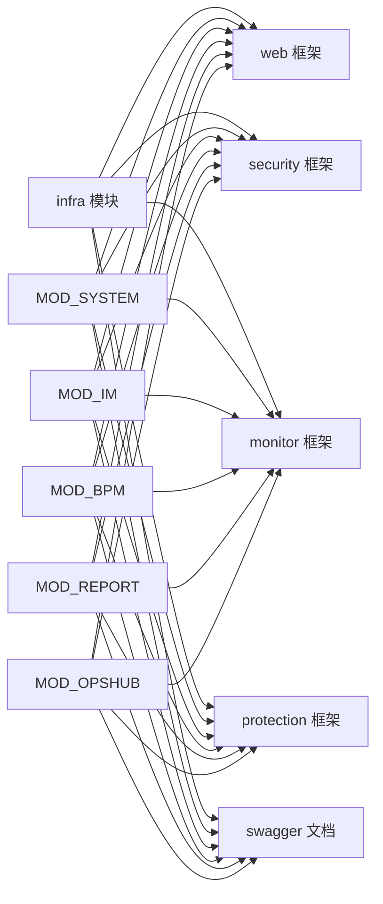

# API网关与微服务集成

<cite>
**本文引用的文件**
- [YudaoRateLimiterConfiguration.java](file://yudao-framework/yudao-spring-boot-starter-protection/src/main/java/cn/iocoder/yudao/framework/ratelimiter/config/YudaoRateLimiterConfiguration.java)
- [YudaoTracerAutoConfiguration.java](file://yudao-framework/yudao-spring-boot-starter-monitor/src/main/java/cn/iocoder/yudao/framework/tracer/config/YudaoTracerAutoConfiguration.java)
- [YudaoMetricsAutoConfiguration.java](file://yudao-framework/yudao-spring-boot-starter-monitor/src/main/java/cn/iocoder/yudao/framework/tracer/config/YudaoMetricsAutoConfiguration.java)
- [TracerProperties.java](file://yudao-framework/yudao-spring-boot-starter-monitor/src/main/java/cn/iocoder/yudao/framework/tracer/config/TracerProperties.java)
- [pom.xml（监控依赖）](file://yudao-framework/yudao-spring-boot-starter-monitor/pom.xml)
- [ImWebConfiguration.java](file://yudao-module-im/src/main/java/cn/iocoder/yudao/module/im/framework/web/config/ImWebConfiguration.java)
- [WebProperties.java](file://yudao-framework/yudao-spring-boot-starter-web/src/main/java/cn/iocoder/yudao/framework/web/config/WebProperties.java)
- [SecurityConfiguration.java](file://yudao-module-opshub/src/main/java/cn/iocoder/yudao/module/opshub/framework/security/config/SecurityConfiguration.java)
- [OAuth2Utils.java](file://yudao-module-system/src/main/java/cn/iocoder/yudao/module/system/util/oauth2/OAuth2Utils.java)
- [application.yaml（服务端）](file://yudao-server/src/main/resources/application.yaml)
- [application-dev.yaml（服务端）](file://yudao-server/src/main/resources/application-dev.yaml)
- [application-local.yaml（服务端）](file://yudao-server/src/main/resources/application-local.yaml)
- [README.md（项目总览）](file://README.md)
- [README.md（前端UI）](file://yudao-ui/yudao-ui-admin-vue3/README.md)
</cite>

## 目录
1. [引言](#引言)
2. [项目结构](#项目结构)
3. [核心组件](#核心组件)
4. [架构总览](#架构总览)
5. [详细组件分析](#详细组件分析)
6. [依赖关系分析](#依赖关系分析)
7. [性能考量](#性能考量)
8. [故障排查指南](#故障排查指南)
9. [结论](#结论)
10. [附录](#附录)

## 引言
本文件面向“芋道 Ruoyi-Vue-Pro”项目的API网关与微服务集成，系统性阐述以下主题：
- API网关集成：请求路由、负载均衡、限流熔断等核心能力的实现路径与配置要点
- 微服务治理：服务注册发现、配置中心、分布式链路追踪等治理能力的现状与扩展方向
- API文档：Swagger/OpenAPI集成、接口文档展示与接口测试能力
- 安全机制：鉴权验证、访问控制、请求签名等安全策略
- 配置方法：服务注册配置、网关路由配置、监控配置等关键参数说明
- 示例与模板：结合仓库现有实现给出可复用的配置模板与集成步骤，帮助开发者快速落地

## 项目结构
项目采用多模块分层架构，前端UI与后端服务模块清晰分离；后端通过框架层提供通用能力（如监控、安全、限流、Swagger等），各业务模块按领域拆分。

图示来源
- [application.yaml（服务端）](file://yudao-server/src/main/resources/application.yaml)
- [application-dev.yaml（服务端）](file://yudao-server/src/main/resources/application-dev.yaml)
- [application-local.yaml（服务端）](file://yudao-server/src/main/resources/application-local.yaml)

章节来源
- [README.md（项目总览）](file://README.md)
- [README.md（前端UI）](file://yudao-ui/yudao-ui-admin-vue3/README.md)

## 核心组件
- API网关与路由
  - 通过统一API前缀与控制器包扫描，配合反向代理（如Nginx）实现路由转发，避免敏感端点暴露
  - 参考：[WebProperties.java](file://yudao-framework/yudao-spring-boot-starter-web/src/main/java/cn/iocoder/yudao/framework/web/config/WebProperties.java)
- 限流与保护
  - 基于Redisson的限流实现，提供多种Key解析器（默认、用户、客户端IP、服务节点、表达式）
  - 参考：[YudaoRateLimiterConfiguration.java](file://yudao-framework/yudao-spring-boot-starter-protection/src/main/java/cn/iocoder/yudao/framework/ratelimiter/config/YudaoRateLimiterConfiguration.java)
- 链路追踪与监控
  - 基于SkyWalking的链路追踪与Micrometer Prometheus指标采集，结合Spring Boot Admin客户端
  - 参考：[YudaoTracerAutoConfiguration.java](file://yudao-framework/yudao-spring-boot-starter-monitor/src/main/java/cn/iocoder/yudao/framework/tracer/config/YudaoTracerAutoConfiguration.java)、[YudaoMetricsAutoConfiguration.java](file://yudao-framework/yudao-spring-boot-starter-monitor/src/main/java/cn/iocoder/yudao/framework/tracer/config/YudaoMetricsAutoConfiguration.java)、[pom.xml（监控依赖）](file://yudao-framework/yudao-spring-boot-starter-monitor/pom.xml)
- API文档
  - 基于SpringDoc OpenAPI（原Swagger），按模块分组生成接口文档
  - 参考：[ImWebConfiguration.java](file://yudao-module-im/src/main/java/cn/iocoder/yudao/module/im/framework/web/config/ImWebConfiguration.java)
- 安全与鉴权
  - 基于Spring Security的访问控制定制，OAuth2简化模式重定向构造
  - 参考：[SecurityConfiguration.java](file://yudao-module-opshub/src/main/java/cn/iocoder/yudao/module/opshub/framework/security/config/SecurityConfiguration.java)、[OAuth2Utils.java](file://yudao-module-system/src/main/java/cn/iocoder/yudao/module/system/util/oauth2/OAuth2Utils.java)

章节来源
- [WebProperties.java:27-66](file://yudao-framework/yudao-spring-boot-starter-web/src/main/java/cn/iocoder/yudao/framework/web/config/WebProperties.java#L27-L66)
- [YudaoRateLimiterConfiguration.java:1-55](file://yudao-framework/yudao-spring-boot-starter-protection/src/main/java/cn/iocoder/yudao/framework/ratelimiter/config/YudaoRateLimiterConfiguration.java#L1-L55)
- [YudaoTracerAutoConfiguration.java:1-53](file://yudao-framework/yudao-spring-boot-starter-monitor/src/main/java/cn/iocoder/yudao/framework/tracer/config/YudaoTracerAutoConfiguration.java#L1-L53)
- [YudaoMetricsAutoConfiguration.java:1-27](file://yudao-framework/yudao-spring-boot-starter-monitor/src/main/java/cn/iocoder/yudao/framework/tracer/config/YudaoMetricsAutoConfiguration.java#L1-L27)
- [pom.xml（监控依赖）:37-79](file://yudao-framework/yudao-spring-boot-starter-monitor/pom.xml#L37-L79)
- [ImWebConfiguration.java:1-22](file://yudao-module-im/src/main/java/cn/iocoder/yudao/module/im/framework/web/config/ImWebConfiguration.java#L1-L22)
- [SecurityConfiguration.java:1-28](file://yudao-module-opshub/src/main/java/cn/iocoder/yudao/module/opshub/framework/security/config/SecurityConfiguration.java#L1-L28)
- [OAuth2Utils.java:39-68](file://yudao-module-system/src/main/java/cn/iocoder/yudao/module/system/util/oauth2/OAuth2Utils.java#L39-L68)

## 架构总览
下图展示了API网关与微服务的交互关系：前端通过网关访问后端服务，服务内部通过框架能力完成鉴权、限流、监控与文档生成。

图示来源
- [application.yaml（服务端）](file://yudao-server/src/main/resources/application.yaml)
- [SecurityConfiguration.java:1-28](file://yudao-module-opshub/src/main/java/cn/iocoder/yudao/module/opshub/framework/security/config/SecurityConfiguration.java#L1-L28)
- [YudaoRateLimiterConfiguration.java:1-55](file://yudao-framework/yudao-spring-boot-starter-protection/src/main/java/cn/iocoder/yudao/framework/ratelimiter/config/YudaoRateLimiterConfiguration.java#L1-L55)
- [YudaoTracerAutoConfiguration.java:1-53](file://yudao-framework/yudao-spring-boot-starter-monitor/src/main/java/cn/iocoder/yudao/framework/tracer/config/YudaoTracerAutoConfiguration.java#L1-L53)
- [ImWebConfiguration.java:1-22](file://yudao-module-im/src/main/java/cn/iocoder/yudao/module/im/framework/web/config/ImWebConfiguration.java#L1-L22)

## 详细组件分析

### 组件A：API网关与路由
- 统一API前缀与控制器包扫描，便于网关统一转发
- 参考路径：[WebProperties.java:27-66](file://yudao-framework/yudao-spring-boot-starter-web/src/main/java/cn/iocoder/yudao/framework/web/config/WebProperties.java#L27-L66)
- 与网关配合的典型做法
  - 将所有Controller置于统一包并设置API前缀，网关仅需转发到该前缀路径
  - 参考：[application.yaml（服务端）](file://yudao-server/src/main/resources/application.yaml)

图示来源
- [WebProperties.java:27-66](file://yudao-framework/yudao-spring-boot-starter-web/src/main/java/cn/iocoder/yudao/framework/web/config/WebProperties.java#L27-L66)

章节来源
- [WebProperties.java:27-66](file://yudao-framework/yudao-spring-boot-starter-web/src/main/java/cn/iocoder/yudao/framework/web/config/WebProperties.java#L27-L66)
- [application.yaml（服务端）](file://yudao-server/src/main/resources/application.yaml)

### 组件B：限流与熔断（保护）
- 限流实现
  - 基于Redisson RRateLimiter，提供切面拦截与多种Key解析器
  - 参考：[YudaoRateLimiterConfiguration.java:1-55](file://yudao-framework/yudao-spring-boot-starter-protection/src/main/java/cn/iocoder/yudao/framework/ratelimiter/config/YudaoRateLimiterConfiguration.java#L1-L55)
- 熔断
  - 仓库未直接提供熔断实现，可在网关侧（如Nginx/Tengine）或引入Spring Cloud CircuitBreaker进行扩展

图示来源
- [YudaoRateLimiterConfiguration.java:1-55](file://yudao-framework/yudao-spring-boot-starter-protection/src/main/java/cn/iocoder/yudao/framework/ratelimiter/config/YudaoRateLimiterConfiguration.java#L1-L55)

章节来源
- [YudaoRateLimiterConfiguration.java:1-55](file://yudao-framework/yudao-spring-boot-starter-protection/src/main/java/cn/iocoder/yudao/framework/ratelimiter/config/YudaoRateLimiterConfiguration.java#L1-L55)

### 组件C：链路追踪与监控
- 链路追踪
  - 自动装配TraceFilter，注入SkyWalking相关依赖，支持traceId透传
  - 参考：[YudaoTracerAutoConfiguration.java:1-53](file://yudao-framework/yudao-spring-boot-starter-monitor/src/main/java/cn/iocoder/yudao/framework/tracer/config/YudaoTracerAutoConfiguration.java#L1-L53)、[TracerProperties.java:1-14](file://yudao-framework/yudao-spring-boot-starter-monitor/src/main/java/cn/iocoder/yudao/framework/tracer/config/TracerProperties.java#L1-L14)
- 指标与监控
  - Micrometer Prometheus指标与Spring Boot Admin客户端
  - 参考：[YudaoMetricsAutoConfiguration.java:1-27](file://yudao-framework/yudao-spring-boot-starter-monitor/src/main/java/cn/iocoder/yudao/framework/tracer/config/YudaoMetricsAutoConfiguration.java#L1-L27)、[pom.xml（监控依赖）:37-79](file://yudao-framework/yudao-spring-boot-starter-monitor/pom.xml#L37-L79)

图示来源
- [YudaoTracerAutoConfiguration.java:1-53](file://yudao-framework/yudao-spring-boot-starter-monitor/src/main/java/cn/iocoder/yudao/framework/tracer/config/YudaoTracerAutoConfiguration.java#L1-L53)
- [YudaoMetricsAutoConfiguration.java:1-27](file://yudao-framework/yudao-spring-boot-starter-monitor/src/main/java/cn/iocoder/yudao/framework/tracer/config/YudaoMetricsAutoConfiguration.java#L1-L27)

章节来源
- [YudaoTracerAutoConfiguration.java:1-53](file://yudao-framework/yudao-spring-boot-starter-monitor/src/main/java/cn/iocoder/yudao/framework/tracer/config/YudaoTracerAutoConfiguration.java#L1-L53)
- [YudaoMetricsAutoConfiguration.java:1-27](file://yudao-framework/yudao-spring-boot-starter-monitor/src/main/java/cn/iocoder/yudao/framework/tracer/config/YudaoMetricsAutoConfiguration.java#L1-L27)
- [pom.xml（监控依赖）:37-79](file://yudao-framework/yudao-spring-boot-starter-monitor/pom.xml#L37-L79)

### 组件D：API文档（Swagger/OpenAPI）
- 模块化分组：按模块构建GroupedOpenApi，自动扫描Controller生成接口文档
- 参考：[ImWebConfiguration.java:1-22](file://yudao-module-im/src/main/java/cn/iocoder/yudao/module/im/framework/web/config/ImWebConfiguration.java#L1-L22)
- 项目整体能力：前端UI与后端均强调Swagger文档与接口测试能力
- 参考：[README.md（项目总览）](file://README.md)、[README.md（前端UI）](file://yudao-ui/yudao-ui-admin-vue3/README.md)

图示来源
- [ImWebConfiguration.java:1-22](file://yudao-module-im/src/main/java/cn/iocoder/yudao/module/im/framework/web/config/ImWebConfiguration.java#L1-L22)

章节来源
- [ImWebConfiguration.java:1-22](file://yudao-module-im/src/main/java/cn/iocoder/yudao/module/im/framework/web/config/ImWebConfiguration.java#L1-L22)
- [README.md（项目总览）](file://README.md)
- [README.md（前端UI）](file://yudao-ui/yudao-ui-admin-vue3/README.md)

### 组件E：安全与鉴权
- 访问控制
  - 通过SecurityConfiguration定制authorizeRequests，模块可按需放行公开接口
  - 参考：[SecurityConfiguration.java:1-28](file://yudao-module-opshub/src/main/java/cn/iocoder/yudao/module/opshub/framework/security/config/SecurityConfiguration.java#L1-L28)
- OAuth2简化模式
  - 构造简化授权模式下的重定向URI，包含token、过期时间、scope等
  - 参考：[OAuth2Utils.java:39-68](file://yudao-module-system/src/main/java/cn/iocoder/yudao/module/system/util/oauth2/OAuth2Utils.java#L39-L68)

图示来源
- [SecurityConfiguration.java:1-28](file://yudao-module-opshub/src/main/java/cn/iocoder/yudao/module/opshub/framework/security/config/SecurityConfiguration.java#L1-L28)
- [OAuth2Utils.java:39-68](file://yudao-module-system/src/main/java/cn/iocoder/yudao/module/system/util/oauth2/OAuth2Utils.java#L39-L68)

章节来源
- [SecurityConfiguration.java:1-28](file://yudao-module-opshub/src/main/java/cn/iocoder/yudao/module/opshub/framework/security/config/SecurityConfiguration.java#L1-L28)
- [OAuth2Utils.java:39-68](file://yudao-module-system/src/main/java/cn/iocoder/yudao/module/system/util/oauth2/OAuth2Utils.java#L39-L68)

## 依赖关系分析
- 模块与框架的耦合
  - 各业务模块依赖框架层提供的web、security、monitor、protection、swagger能力
  - 通过AutoConfiguration自动装配，降低模块间重复配置
- 外部依赖
  - SkyWalking、Micrometer、SpringDoc、Redisson等

图示来源
- [ImWebConfiguration.java:1-22](file://yudao-module-im/src/main/java/cn/iocoder/yudao/module/im/framework/web/config/ImWebConfiguration.java#L1-L22)
- [YudaoRateLimiterConfiguration.java:1-55](file://yudao-framework/yudao-spring-boot-starter-protection/src/main/java/cn/iocoder/yudao/framework/ratelimiter/config/YudaoRateLimiterConfiguration.java#L1-L55)
- [YudaoTracerAutoConfiguration.java:1-53](file://yudao-framework/yudao-spring-boot-starter-monitor/src/main/java/cn/iocoder/yudao/framework/tracer/config/YudaoTracerAutoConfiguration.java#L1-L53)

章节来源
- [ImWebConfiguration.java:1-22](file://yudao-module-im/src/main/java/cn/iocoder/yudao/module/im/framework/web/config/ImWebConfiguration.java#L1-L22)
- [YudaoRateLimiterConfiguration.java:1-55](file://yudao-framework/yudao-spring-boot-starter-protection/src/main/java/cn/iocoder/yudao/framework/ratelimiter/config/YudaoRateLimiterConfiguration.java#L1-L55)
- [YudaoTracerAutoConfiguration.java:1-53](file://yudao-framework/yudao-spring-boot-starter-monitor/src/main/java/cn/iocoder/yudao/framework/tracer/config/YudaoTracerAutoConfiguration.java#L1-L53)

## 性能考量
- 限流策略
  - 使用Redisson限流器，建议针对热点接口与全局接口分别配置不同Key解析器
  - 参考：[YudaoRateLimiterConfiguration.java:1-55](file://yudao-framework/yudao-spring-boot-starter-protection/src/main/java/cn/iocoder/yudao/framework/ratelimiter/config/YudaoRateLimiterConfiguration.java#L1-L55)
- 监控与可观测性
  - 开启Micrometer Prometheus指标与Spring Boot Admin，结合SkyWalking实现端到端观测
  - 参考：[YudaoMetricsAutoConfiguration.java:1-27](file://yudao-framework/yudao-spring-boot-starter-monitor/src/main/java/cn/iocoder/yudao/framework/tracer/config/YudaoMetricsAutoConfiguration.java#L1-L27)、[pom.xml（监控依赖）:37-79](file://yudao-framework/yudao-spring-boot-starter-monitor/pom.xml#L37-L79)
- 文档与测试
  - 通过模块化OpenAPI分组提升文档质量，结合前端UI的接口测试能力提升联调效率
  - 参考：[ImWebConfiguration.java:1-22](file://yudao-module-im/src/main/java/cn/iocoder/yudao/module/im/framework/web/config/ImWebConfiguration.java#L1-L22)、[README.md（前端UI）](file://yudao-ui/yudao-ui-admin-vue3/README.md)

## 故障排查指南
- 链路追踪不可用
  - 检查SkyWalking相关依赖是否引入，以及TraceFilter是否注册
  - 参考：[YudaoTracerAutoConfiguration.java:1-53](file://yudao-framework/yudao-spring-boot-starter-monitor/src/main/java/cn/iocoder/yudao/framework/tracer/config/YudaoTracerAutoConfiguration.java#L1-L53)、[pom.xml（监控依赖）:37-79](file://yudao-framework/yudao-spring-boot-starter-monitor/pom.xml#L37-L79)
- 指标无法上报
  - 确认yudao.metrics.enable开关与common tags配置
  - 参考：[YudaoMetricsAutoConfiguration.java:1-27](file://yudao-framework/yudao-spring-boot-starter-monitor/src/main/java/cn/iocoder/yudao/framework/tracer/config/YudaoMetricsAutoConfiguration.java#L1-L27)
- 限流不生效
  - 检查Redisson连接、Key解析器选择与注解使用
  - 参考：[YudaoRateLimiterConfiguration.java:1-55](file://yudao-framework/yudao-spring-boot-starter-protection/src/main/java/cn/iocoder/yudao/framework/ratelimiter/config/YudaoRateLimiterConfiguration.java#L1-L55)
- 文档分组缺失
  - 确认模块已注册GroupedOpenApi，且Controller扫描路径正确
  - 参考：[ImWebConfiguration.java:1-22](file://yudao-module-im/src/main/java/cn/iocoder/yudao/module/im/framework/web/config/ImWebConfiguration.java#L1-L22)
- 鉴权规则异常
  - 检查SecurityConfiguration中的authorizeRequestsCustomizer配置
  - 参考：[SecurityConfiguration.java:1-28](file://yudao-module-opshub/src/main/java/cn/iocoder/yudao/module/opshub/framework/security/config/SecurityConfiguration.java#L1-L28)

章节来源
- [YudaoTracerAutoConfiguration.java:1-53](file://yudao-framework/yudao-spring-boot-starter-monitor/src/main/java/cn/iocoder/yudao/framework/tracer/config/YudaoTracerAutoConfiguration.java#L1-L53)
- [YudaoMetricsAutoConfiguration.java:1-27](file://yudao-framework/yudao-spring-boot-starter-monitor/src/main/java/cn/iocoder/yudao/framework/tracer/config/YudaoMetricsAutoConfiguration.java#L1-L27)
- [YudaoRateLimiterConfiguration.java:1-55](file://yudao-framework/yudao-spring-boot-starter-protection/src/main/java/cn/iocoder/yudao/framework/ratelimiter/config/YudaoRateLimiterConfiguration.java#L1-L55)
- [ImWebConfiguration.java:1-22](file://yudao-module-im/src/main/java/cn/iocoder/yudao/module/im/framework/web/config/ImWebConfiguration.java#L1-L22)
- [SecurityConfiguration.java:1-28](file://yudao-module-opshub/src/main/java/cn/iocoder/yudao/module/opshub/framework/security/config/SecurityConfiguration.java#L1-L28)

## 结论
- 本项目在API网关与微服务集成方面，已具备完善的路由、限流、监控与文档能力
- 链路追踪与指标体系已就绪，可满足生产级可观测性需求
- 安全框架提供了灵活的访问控制扩展点，适合在各模块按需定制
- 网关侧的负载均衡与熔断可通过外部网关或Spring Cloud进一步完善
- 建议结合本文配置模板与集成步骤，快速落地企业级微服务架构

## 附录

### A. API网关与路由配置模板（服务端）
- API前缀与控制器包扫描
  - 参考：[WebProperties.java:27-66](file://yudao-framework/yudao-spring-boot-starter-web/src/main/java/cn/iocoder/yudao/framework/web/config/WebProperties.java#L27-L66)
- 服务端环境配置
  - 参考：[application.yaml（服务端）](file://yudao-server/src/main/resources/application.yaml)、[application-dev.yaml（服务端）](file://yudao-server/src/main/resources/application-dev.yaml)、[application-local.yaml（服务端）](file://yudao-server/src/main/resources/application-local.yaml)

章节来源
- [WebProperties.java:27-66](file://yudao-framework/yudao-spring-boot-starter-web/src/main/java/cn/iocoder/yudao/framework/web/config/WebProperties.java#L27-L66)
- [application.yaml（服务端）](file://yudao-server/src/main/resources/application.yaml)
- [application-dev.yaml（服务端）](file://yudao-server/src/main/resources/application-dev.yaml)
- [application-local.yaml（服务端）](file://yudao-server/src/main/resources/application-local.yaml)

### B. 限流配置模板（保护）
- 限流切面与Key解析器
  - 参考：[YudaoRateLimiterConfiguration.java:1-55](file://yudao-framework/yudao-spring-boot-starter-protection/src/main/java/cn/iocoder/yudao/framework/ratelimiter/config/YudaoRateLimiterConfiguration.java#L1-L55)

章节来源
- [YudaoRateLimiterConfiguration.java:1-55](file://yudao-framework/yudao-spring-boot-starter-protection/src/main/java/cn/iocoder/yudao/framework/ratelimiter/config/YudaoRateLimiterConfiguration.java#L1-L55)

### C. 链路追踪与监控配置模板（监控）
- 追踪与指标
  - 参考：[YudaoTracerAutoConfiguration.java:1-53](file://yudao-framework/yudao-spring-boot-starter-monitor/src/main/java/cn/iocoder/yudao/framework/tracer/config/YudaoTracerAutoConfiguration.java#L1-L53)、[YudaoMetricsAutoConfiguration.java:1-27](file://yudao-framework/yudao-spring-boot-starter-monitor/src/main/java/cn/iocoder/yudao/framework/tracer/config/YudaoMetricsAutoConfiguration.java#L1-L27)、[pom.xml（监控依赖）:37-79](file://yudao-framework/yudao-spring-boot-starter-monitor/pom.xml#L37-L79)

章节来源
- [YudaoTracerAutoConfiguration.java:1-53](file://yudao-framework/yudao-spring-boot-starter-monitor/src/main/java/cn/iocoder/yudao/framework/tracer/config/YudaoTracerAutoConfiguration.java#L1-L53)
- [YudaoMetricsAutoConfiguration.java:1-27](file://yudao-framework/yudao-spring-boot-starter-monitor/src/main/java/cn/iocoder/yudao/framework/tracer/config/YudaoMetricsAutoConfiguration.java#L1-L27)
- [pom.xml（监控依赖）:37-79](file://yudao-framework/yudao-spring-boot-starter-monitor/pom.xml#L37-L79)

### D. API文档配置模板（Swagger）
- 模块化分组
  - 参考：[ImWebConfiguration.java:1-22](file://yudao-module-im/src/main/java/cn/iocoder/yudao/module/im/framework/web/config/ImWebConfiguration.java#L1-L22)
- 项目整体文档能力
  - 参考：[README.md（项目总览）](file://README.md)、[README.md（前端UI）](file://yudao-ui/yudao-ui-admin-vue3/README.md)

章节来源
- [ImWebConfiguration.java:1-22](file://yudao-module-im/src/main/java/cn/iocoder/yudao/module/im/framework/web/config/ImWebConfiguration.java#L1-L22)
- [README.md（项目总览）](file://README.md)
- [README.md（前端UI）](file://yudao-ui/yudao-ui-admin-vue3/README.md)

### E. 安全与鉴权配置模板（安全）
- 访问控制定制
  - 参考：[SecurityConfiguration.java:1-28](file://yudao-module-opshub/src/main/java/cn/iocoder/yudao/module/opshub/framework/security/config/SecurityConfiguration.java#L1-L28)
- OAuth2简化模式
  - 参考：[OAuth2Utils.java:39-68](file://yudao-module-system/src/main/java/cn/iocoder/yudao/module/system/util/oauth2/OAuth2Utils.java#L39-L68)

章节来源
- [SecurityConfiguration.java:1-28](file://yudao-module-opshub/src/main/java/cn/iocoder/yudao/module/opshub/framework/security/config/SecurityConfiguration.java#L1-L28)
- [OAuth2Utils.java:39-68](file://yudao-module-system/src/main/java/cn/iocoder/yudao/module/system/util/oauth2/OAuth2Utils.java#L39-L68)